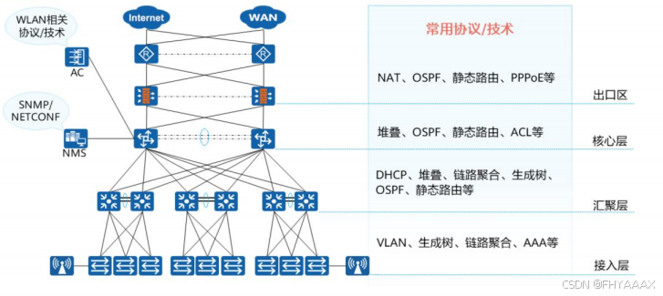

> @Author  : Lewis Tian (taseikyo@gmail.com)
>
> @Link    : github.com/taseikyo
>
> @Range   : 2024-07-07 - 2024-07-13

# Weekly #70

[readme](../README.md) | [previous](202407W1.md) | [next](202407W3.md)


\**Photo by [Yilin Liu](https://unsplash.com/@l61012345) on [Unsplash](https://unsplash.com/photos/brown-cardboard-boxes-on-brown-wooden-shelf-nSBBGw5xJYI)*

> 《毛主席语录》  二、阶级和阶级斗争
>
> 阶级斗争，一些阶级胜利了，一些阶级消灭了。这就是历史，这就是几千年的文明史。拿这个观点解释历史的就叫做历史的唯物主义，站在这个观点的反面的是历史的唯心主义。
>
> 《丢掉幻想，准备斗争》（一九四九年八月十四日），《毛泽东选集》第四卷第一四九一页

## Table of Contents

- [algorithm](#algorithm-)
- [review](#review-)
	- 路由与交换_路由交换技术
- [tip](#tip-)
	- win10/win11如何设置一周第一天是周日
	- 使用Markdown+Pandoc+LaTex+Beamer制作幻灯片
- [share](#share-)

## algorithm [🔝](#weekly-70)

## review [🔝](#weekly-70)

### [路由与交换_路由交换技术](https://blog.csdn.net/FHY26828/article/details/141005258)

1. 路由（Routing）

1.1 什么是路由？        

路由是指在网络中找到从源节点到达目的节点的最佳路径的过程。它不仅仅涉及路径的选择，还包括决定如何有效地在网络中传输数据包。路由器（Router）作为网络的中枢设备，通过查阅和维护路由表（Routing Table），来确定数据包的下一跳位置，从而逐步将数据包送达最终目的地。路由的目的是确保数据包通过最优路径，既可以减少延迟又能提高数据传输的可靠性。路由器（Router）根据路由表（Routing Table）决定数据包的传输路径。主要包含静态路由和动态路由。

1.2 静态路由和动态路由

- 静态路由（Static Routing）：管理员手动配置的路由路径，并在路由器中固定下来。这种方式虽然简单可靠，但缺点是灵活性不足，尤其在网络拓扑发生变化时，手动维护和更新路由信息变得费时且容易出错。

- 动态路由（Dynamic Routing）：使用路由协议自动更新的路由信息。主要的动态路由协议有：
	- RIP（Routing Information Protocol）：基于距离向量算法，使用跳数作为衡量路径优劣的指标。RIP 适用于较小规模的网络，因为其最大跳数为 15，超出后将视为不可达。
	- OSPF（Open Shortest Path First）：基于链路状态算法，OSPF 使用 Dijkstra 算法计算到达每个网络的最短路径。OSPF 适合大型企业网络，支持多区域配置，具有收敛速度快、无环路等优点。
	- BGP（Border Gateway Protocol）：BGP 是互联网的主要路由协议，负责跨自治系统（AS）的路由选择。BGP 能够处理大量路由表，并支持复杂的策略控制，如路径选择的策略、流量工程等。

1.3 路由算法

- 距离向量算法（Distance Vector Algorithm）： 路由器基于从邻居路由器接收到的信息更新自己的路由表，并向所有邻居广播其更新后的路由信息。这种算法简单但容易形成环路问题，因此引入了防环机制如水平分割（Split Horizon）和毒性逆转（Poison Reverse）。如 RIP，每个路由器向其邻居广播整个路由表，并基于跳数选择路径。
- 链路状态算法（Link State Algorithm）： 每个路由器通过发送链路状态公告（LSA）来向整个网络通报其直接相连的链路状态，所有路由器接收到这些信息后，使用 Dijkstra 算法计算网络中的最短路径。这种算法的优点是收敛快、精确度高，适用于大型复杂网络。如 OSPF，每个路由器向整个网络广播链路状态信息，基于 Dijkstra 算法计算最短路径。

1.4 路由表管理

路由表是路由器用来决定数据包转发路径的关键数据结构。路由表中的每一条目通常包含以下信息：

- 目标网络地址（Destination Network Address）： 表示数据包需要到达的最终网络。
- 下一跳地址（Next Hop Address）： 数据包在转发过程中，下一个应该发送到的路由器地址。
- 路由度量值（Metric）： 用于衡量路径的优劣，如跳数、延迟、带宽、开销等。
- 接口（Interface）： 数据包通过该接口转发到下一跳或目的地。

路由器会根据这些信息来做出最佳路径选择，以确保数据包高效、准确地到达目的地。

2. 交换（Switching）

2.1 什么是交换

交换指在同一网络中将数据包从一个设备转发到另一个设备的过程。交换技术主要在数据链路层（OSI 模型的第二层）进行操作。交换机（Switch）通过 MAC 地址表（Forwarding Table），根据数据帧的目标 MAC 地址，决定该数据帧应当转发到哪个端口。交换过程确保了局域网内的高效数据传输，避免了网络冲突和带宽浪费。

2.2 交换机类型

- 二层交换机（Layer 2 Switch）： 二层交换机在数据链路层工作，通过学习和维护 MAC 地址表来实现基于 MAC 地址的快速转发。这种交换机主要用于局域网（LAN）中，用于设备之间的直接通信。
- 三层交换机（Layer 3 Switch）： 三层交换机结合了传统路由器的部分功能，能够在不同子网之间进行数据包转发。这使得它们适用于大型局域网或企业网络，支持更复杂的网络结构。
- 多层交换机（Multilayer Switch）： 多层交换机不仅支持二层和三层的功能，还能提供更高层次的功能，如应用层防火墙、负载均衡、流量控制等。这些功能使其在复杂的企业环境中非常有用。

2.3 交换方式

- 存储 - 转发交换（Store-and-Forward Switching）： 交换机在接收到整个数据包后，进行完整性检查（如 CRC 校验），再决定是否转发。这种方式可以确保数据包的完整性，但增加了转发延迟。
- 直通交换（Cut-Through Switching）： 交换机在接收到数据包的前几字节后，即可根据目标 MAC 地址决定转发路径，从而减少延迟。这种方式虽然提高了速度，但无法检查数据包的完整性。
- 碎片直通交换（Fragment-Free Switching）： 这是直通交换的一种改进方式，交换机会在接收前 64 字节后开始转发，因为大部分错误数据包通常会出现在前 64 字节内。这种方式在确保一定数据完整性的同时，兼顾了转发速度。

2.4 虚拟局域网（VLAN）：

虚拟局域网（VLAN）是一种逻辑分割网络的方法，用于将同一物理网络中的设备划分为不同的虚拟网络段，以实现网络隔离、优化性能和提高安全性。

- 基于端口的 VLAN： 通过将交换机端口分配到不同的 VLAN，创建独立的广播域。每个 VLAN 内的设备可以相互通信，而不同 VLAN 之间的通信需要通过路由器或三层交换机进行。
- 基于标签的 VLAN（802.1Q）： 使用 802.1Q 协议，在数据帧中添加 VLAN 标签，使 VLAN 能够跨越多个交换机进行配置和管理。这种方式适合于跨多个交换机的大型网络环境。

3. 路由与交换的集成与管理

3.1 网络管理协议：

网络管理是确保网络设备正常运行和优化性能的关键任务。常见的网络管理协议包括：

- SNMP（Simple Network Management Protocol）： SNMP 是一种用于网络设备管理和监控的协议。管理员可以使用 SNMP 查询设备状态、修改配置以及接收设备的告警信息，方便远程管理和维护。
- NetFlow： NetFlow 是思科开发的一种网络流量监控协议，用于流量分析、性能监控和安全分析。它能提供详尽的网络使用情况，包括谁在使用网络、使用了多少带宽，以及通信的目的地等。

3.2 高可用性与冗余：

在网络中，确保高可用性和容错能力至关重要。为此，网络设备通常采用冗余机制，以避免单点故障导致的网络中断。

- HSRP（Hot Standby Router Protocol）： HSRP 是思科开发的专有协议，通过允许多台路由器组成一个虚拟路由器，来提高网络的冗余性。当主路由器发生故障时，备份路由器会自动接管，以确保网络连接不中断。
- VRRP（Virtual Router Redundancy Protocol）： VRRP 是一个开源协议，功能与 HSRP 类似，广泛应用于多供应商环境下的路由器冗余配置。VRRP 通过选举机制确定主备路由器，保障网络的高可用性。
- STP（Spanning Tree Protocol）： STP 是一种用于以太网交换网络中的协议，它通过构建无环的逻辑拓扑，防止网络中的环路问题，从而提高网络的可靠性。

3.3 软件定义网络（SDN）

软件定义网络（SDN）是一种创新的网络架构，通过将网络的控制平面与数据平面分离，实现集中控制和动态配置。SDN 的主要特点包括：

- 集中管理： 网络管理员可以通过一个中央控制器来配置和管理整个网络的路由和交换行为，而不需要单独配置每个设备。
- 灵活性和自动化： SDN 允许网络在需要时自动调整和优化资源，适应快速变化的业务需求。
- 编程接口： SDN 提供了开放的编程接口，使得第三方软件可以与网络设备交互，从而实现更高级的网络功能。

3.4 实际应用与案例

- 企业网络： 在大型企业网络中，通常使用多层交换机和路由器构建复杂的内部网络结构。这些网络不仅需要支持多种业务应用，还必须满足安全性、可扩展性和可靠性的要求。企业网络中常见的技术包括 VLAN 划分、动态路由协议以及网络访问控制等。
- 数据中心： 数据中心的网络架构通常要求高密度端口配置、快速收敛的动态路由、支持虚拟化和多租户隔离等特性。数据中心网络还需要具备高带宽、低延迟以及弹性的资源管理能力，以应对云计算和大数据应用的需求。
- 广域网： 在广域网（WAN）环境中，跨多个自治系统的路由选择是确保全球互联网正常运行的关键。BGP 在此类环境中扮演了至关重要的角色，能够处理复杂的路由选择和策略配置，确保数据在不同网络之间高效、安全地传输。

4. 组网架构参考

4.1 组网架构图



（此图来自华为的培训手册）

4.2 网络架构分析

这张网络架构图展示了一个典型的大型企业网络设计，采用了分层架构的设计方法，包括出口区、核心层、汇聚层和接入层，每一层都有其特定的功能和使用的协议 / 技术。以下是对该网络架构的详细分析：

4.2.1 出口区（Edge Layer）

功能： 出口区是企业网络与外部网络（如 Internet 和 WAN）的连接点。它负责管理进入和离开企业网络的所有流量，并确保外部访问的安全性和有效性。

关键技术 / 协议：

- NAT（网络地址转换）： 将内部网络的私有 IP 地址转换为公有 IP 地址，以便与外部网络进行通信。这种转换保护了内部网络免受外部攻击的直接威胁。
- OSPF（开放最短路径优先协议）： 用于动态路由选择，确保在网络拓扑发生变化时能够迅速找到最佳路径。
静态路由： 对于出口区的一些关键路径，采用静态路由以确保稳定性和可靠性。
- PPPoE（点对点协议以太网）： 主要用于宽带接入，通过拨号的方式连接到互联网服务提供商（ISP），适用于家庭和中小型企业的宽带接入。

4.2.2 核心层（Core Layer）

功能： 核心层是整个网络的高速主干部分，负责在网络的不同区域之间转发大量的数据流量。它通常要求高可用性、高性能以及低延迟，是网络的心脏部分。

关键技术 / 协议：

- 堆叠技术： 通过将多个交换机堆叠成一个逻辑交换机，以增加网络的端口密度和冗余性，同时简化管理。
- OSPF： 在核心层中使用 OSPF 协议有助于快速收敛和动态路由管理，适应网络拓扑的变化。
- 静态路由： 在核心层为关键路径配置静态路由，确保路由的稳定性，避免不必要的路由波动。
- ACL（访问控制列表）： 通过 ACL 对进入和离开的数据流进行过滤，确保只有合法的流量可以通过，提升网络的安全性。

4.2.3 汇聚层（Distribution Layer）

功能： 汇聚层是连接接入层和核心层的中间层，主要负责对来自多个接入层的流量进行聚合和处理，然后将处理后的流量传递到核心层。此外，它还承担了部分路由和策略控制的职责。

关键技术 / 协议：

- DHCP（动态主机配置协议）： 为接入层的终端设备自动分配 IP 地址，简化网络管理。
- 堆叠和链路聚合： 提高带宽和网络冗余性，确保网络的高可用性和高性能。
- 生成树协议（STP）： 防止二层网络中的环路问题，确保数据包能够高效且正确地转发。
- OSPF 和静态路由： 结合使用以平衡动态路由更新和路由稳定性，提供灵活且高效的流量管理。

4.2.4 接入层（Access Layer）

功能： 接入层是网络的边缘部分，直接连接最终用户设备（如电脑、打印机）和无线接入点。其主要任务是控制用户访问，提供对网络资源的接入点，并实现局域网内部的通信。

关键技术 / 协议：

- VLAN（虚拟局域网）： 将物理网络划分为多个逻辑网络，以增强网络的安全性和管理效率。不同部门或业务单元可以通过 VLAN 隔离，避免广播风暴和潜在的安全问题。
- 生成树协议（STP）： 防止环路，保证二层网络的稳定运行，避免广播风暴影响网络性能。
- 链路聚合： 增加带宽，提供冗余路径，确保高可用性和快速恢复。
AAA（认证、授权和记账）： 实现对接入用户的身份验证和权限管理，确保只有授权用户才能访问网络资源，同时对用户行为进行记录。

4.2.5 管理与安全

- WLAN 相关协议 / 技术： 用于管理无线网络接入点（AP）及控制器（AC），确保无线设备能够稳定、安全地接入网络。
- SNMP/NETCONF： 这两个是用于网络设备管理和监控的协议，SNMP 适用于传统网络设备的监控和管理，而 NETCONF 则更适合现代化设备的配置管理，特别是在 SDN（软件定义网络）环境下。

4.2.6 总结

该网络架构通过层次化设计实现了高效的流量管理和网络性能优化。每一层的设计都经过精心配置，以确保网络的稳定性、可扩展性和安全性。出口区的安全防护、核心层的高速转发、汇聚层的流量整合，以及接入层的灵活管理，共同构成了一个健壮的企业网络架构，适用于各种复杂的企业网络环境。这种设计在支持多样化业务需求的同时，能够有效应对网络中的故障和变化，确保网络服务的连续性和高可用性。

## tip [🔝](#weekly-70)

### 1. [win10/win11如何设置一周第一天是周日](https://zhuanlan.zhihu.com/p/698361470)

1、win+i调出设置页；

2、选择“时间和语言”

3、选择“日期、时间和区域格式设置”

4、点击“更改数据格式”

5、调整一周中第一天是周日

### 2. [使用Markdown+Pandoc+LaTex+Beamer制作幻灯片](https://www.cnblogs.com/aquastone/p/markdown_slide.html)

mardown 制作幻灯片的流程一般是：先用 markdown 写文本文件，然后使用工具转化为 html 或 pdf 等格式。 这个过程如有必要，可修改 css 或 tex 模板。 用到的工具有：

- 任何文本编辑器：用于编辑 markdown 源文件
- pandoc：将 markdown 转换成其他格式（本文主要介绍 pdf）的工具
- latex：pandoc 将 markdown 转换成 pdf 时，需要用到 latex 引擎。如果要支持中文，可以装 xelatex
- beamer：latex 下制作幻灯片的工具包

当然，直接用 latex+beamer 就可以制作幻灯片，但是需要写 tex 源文件，比较麻烦而且可读性不如 markdown。 所以我采用 markdown 写内容，tex 做模板的方式。


1、一个基本的幻灯片

1.1、编辑 markdown 源文件

pandoc 将 markdown 的一级标题视为幻灯片组，将二级标题视为幻灯片标题，二级标题下的内容放在一张幻灯片里。 不过，如果某个一级标题下没有二级标题，那么 pandoc 将把一级标题视为幻灯片标题，将这个一级标题下的内容放在一张幻灯片里， 二级标题显示为子框。

在任何时候，用 '---------' 都可以产生一张新幻灯片。

pandoc 对 markdown 有个扩展，在前面加上三行以 % 开头的内容，分别是标题、作者和日期。

例子如下

```
% Title
% auther
% date

# This is a group

## This is title 1

  This is first slide

  - item 1
  - item 2

## This is tile 2

  This is second slide

-------------

  This is third slide

```

1.2、转换为 pdf

将上述代码保存为 exam1.md，运行

```
pandoc -t beamer -o exam1.pdf exam1.md

```

即可生成 pdf。

2、pandoc 对 markdown 的扩展

pandoc 出了支持标准的 markdown 语法，还作了一些很实用的扩展，上面的标题、作者和日期就是。 此外比较实用的还有表格、公式等。详见 [pandoc 的文档](http://johnmacfarlane.net/pandoc/README.html)

3、中文支持

要正常显示中文，需要注意两点：

- 使用 xelatex 引擎
- 在模板文件中正确配置

首先导出 pandoc 的 beamer 默认配置

```
pandoc -D beamer > beamer-template.tex

```

```
\usepackage{xeCJK}                 % 设置中英文字体
\setCJKmainfont{WenQuanYi Micro Hei} % 中文字体
\setmainfont{Arial}                % 英文字体
\setromanfont{Courier New}
\setmonofont{Courier New}
\linespread{1.2}\selectfont        % 行距
\XeTeXlinebreaklocale "zh"         % 中文自动换行
\XeTeXlinebreakskip = 0pt plus 1pt % 字之间加0pt至1pt间距
\parindent 0em                     % 段缩进
\setlength{\parskip}{20pt}         % 段间距

```

编译时使用命令

```
pandoc -t beamer --latex-engine=xelatex --template=beamer-template.tex xx.md -o xx.pdf

```

4、实用技巧

4.1、设置页面比例

在模板文件的 documentclass 中加入参数 aspectratio=169，即

```
\documentclass[..., aspectratio=169]{$documentclass$}

```

即可设置页面比例为 16:9(默认为 4:3)。

4.2、设置背景图片

笔者在工作中，需要使用公司的 ppt 模板，因此需要设置幻灯片的背景。最终采用的解决方法是这样的：

在模板文件中加入命令

```
\usebackgroundtemplate{\includegraphics[width=\paperwidth, height=\paperheight]{background.png}}
```

如果要对标题页单独设置背景，笔者用的是 [这篇](http://tex.stackexchange.com/questions/51457/can-i-specify-title-page-customization-in-a-template-instead-of-my-document) 文章里的方法:

```
\RequirePackage{tikz}
\addtobeamertemplate{title page}{%
    \begin{tikzpicture}[remember picture,overlay]
        \node [xshift=0cm,yshift=0cm] at (current page.center)
            {\includegraphics[width=\paperwidth, height=\paperheight]{background_title.png}};
    \end{tikzpicture}%
}{}
```

## share [🔝](#weekly-70)

[readme](../README.md) | [previous](202407W1.md) | [next](202407W3.md)
