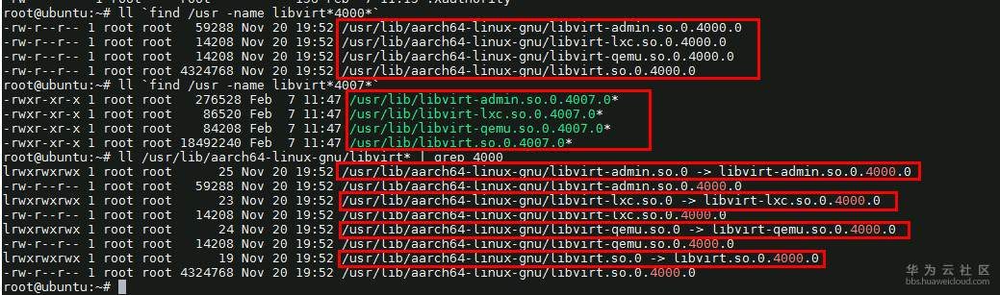

> @Author  : Lewis Tian (taseikyo@gmail.com)
>
> @Link    : github.com/taseikyo
>
> @Range   : 2024-07-21 - 2024-07-27

# Weekly #72

[readme](../README.md) | [previous](202407W3.md) | [next](202408W1.md)


\**Photo by [Kelly Jean](https://unsplash.com/@kelly_jean) on [Unsplash](https://unsplash.com/photos/a-bunch-of-pumpkins-sitting-on-a-window-sill-2LiVAoyjfqA)*

## Table of Contents

- [algorithm](#algorithm-)
- [review](#review-)
	- linux 源码分析（四）start_kernel cgroup
- [tip](#tip-)
	- WSL2 安装中文字体
	- Ubuntu 安装 KVM 虚拟机
- [share](#share-)
	- 彼得原理
	- 邓宁-克鲁格效应
	- 呆伯特法则
	- 帕金森定理

## algorithm [🔝](#weekly-72)

## review [🔝](#weekly-72)

### 1. [linux 源码分析（四）start_kernel cgroup](https://www.cnblogs.com/yjf512/p/6003094.html)

```bash
cgroup_init_early();
```

1、cgroup 概念

这个函数就是初始化 cgroup 所需要的参数的。cgroup 最初是在 2006 年由 google 的一名工程师提出的，目的是把一些共同目标的进程放在一个组里面，而这个组里面的进程能共享指定数额的资源。而后就有了 cgroup 这个概念了。

我们把每种资源叫做子系统，比如 CPU 子系统，内存子系统。为什么叫做子系统呢，因为它是从整个操作系统的资源衍生出来的。然后我们创建一种虚拟的节点，叫做 cgroup，然后这个虚拟节点可以扩展，以树形的结构，有 root 节点，和子节点。这个父节点和各个子节点就形成了层级（hierarchiy）。每个层级都可以附带继承一个或者多个子系统，就意味着，我们把资源按照分割到多个层级系统中，层级系统中的每个节点对这个资源的占比各有不同。

下面我们想法子把进程分组，进程分组的逻辑叫做 css_set。这里的 css 是 cgroup_subsys_state 的缩写。所以 css_set 和进程的关系是一对多的关系。另外，在 cgroup 眼中，进程请不要叫做进程，叫做 task。这个可能是为了和内核中进程的名词区分开吧。

进程分组 css_set，不同层级中的节点 cgroup 也都有了。那么，就要把节点 cgroup 和层级进行关联，和数据库中关系表一样。这个事一个多对多的关系。为什么呢？首先，一个节点可以隶属于多个 css_set，这就代表这这批 css_set 中的进程都拥有这个 cgroup 所代表的资源。其次，一个 css_set 需要多个 cgroup。因为一个层级的 cgroup 只代表一种或者几种资源，而一般进程是需要多种资源的集合体。

美团的这个图片描写的非常清晰，一看就了解了：


2、task_struct

首先先看进程的结构，里面和 cgroup 有关的是

```C
#ifdef CONFIG_CGROUPS
     // 设置这个进程属于哪个css_set
    struct css_set __rcu *cgroups;
     // cg_list是用于将所有同属于一个css_set的task连成一起
    struct list_head cg_list;
#endif
```

我们会在代码中经常见到 list_head。它其实就是表示，这个在链表中存在。

```C
struct list_head {
    struct list_head *next, *prev;
};
```

它的结构很简单，就能把某种相同性质的结构连成一个链表，根据这个链表我能前后找全整个链表或者头部节点等。


3、css_set

结构体在 `include/linux/cgroup-defs.h` 中。

```C
struct css_set {
    // 引用计数，gc使用，如果子系统有引用到这个css_set,则计数＋1
    atomic_t refcount;

     // TODO: 列出有相同hash值的cgroup（还不清楚为什么）
    struct hlist_node hlist;

     // 将所有的task连起来。mg_tasks代表迁移的任务
    struct list_head tasks;
    struct list_head mg_tasks;
     // 将这个css_set对应的cgroup连起来
    struct list_head cgrp_links;

    // 默认连接的cgroup
    struct cgroup *dfl_cgrp;

     // 包含一系列的css(cgroup_subsys_state)，css就是子系统，这个就代表了css_set和子系统的多对多的其中一面
    struct cgroup_subsys_state *subsys[CGROUP_SUBSYS_COUNT];

    // 内存迁移的时候产生的系列数据
    struct list_head mg_preload_node;
    struct list_head mg_node;
    struct cgroup *mg_src_cgrp;
    struct cgroup *mg_dst_cgrp;
    struct css_set *mg_dst_cset;

    // 把->subsys[ssid]->cgroup->e_csets[ssid]结构展平放在这里，提高迭代效率
    struct list_head e_cset_node[CGROUP_SUBSYS_COUNT];

     // 所有迭代任务的列表，这个补丁参考:https://patchwork.kernel.org/patch/7368941/
    struct list_head task_iters;

    // 这个css_set是否已经无效了
    bool dead;

    // rcu锁所需要的callback等信息
    struct rcu_head rcu_head;
};
```

这里说一下 rcu 锁，这个锁是 linux2.6 引入的。它是非常高效的，适合读多写少的情况。全称是（Read-Copy Update）读－拷贝修改。原理就是读操作的时候，不需要任何锁，直接进行读取，写操作的时候，先拷贝一个副本，然后对副本进行修改，最后使用回调（callback）在适当的时候把指向原来数据的指针指向新的被修改的数据。https://www.ibm.com/developerworks/cn/linux/l-rcu/

这里的 rcu_head 就存储了对这个结构上 rcu 锁所需要的回调信息。

```C
struct callback_head {
    struct callback_head *next;
    void (*func)(struct callback_head *head);
} __attribute__((aligned(sizeof(void *))));
#define rcu_head callback_head
```

回到 `css_set`，其实最重要的就是 `cgroup_subsys_state subsys[]` 数组这个结构。

4、cgroup_subsys_state 和 cgroup_subsys

这个结构最重要的就是存储的进程与特定子系统相关的信息。通过它，可以将 `task_struct` 和 `cgroup` 连接起来了：`task_struct->css_set->cgroup_subsys_state->cgroup`

```C
struct cgroup_subsys_state {
    // 对应的cgroup
    struct cgroup *cgroup;

    // 子系统
    struct cgroup_subsys *ss;

    // 带cpu信息的引用计数（不大理解）
    struct percpu_ref refcnt;

    // 父css
    struct cgroup_subsys_state *parent;

    // 兄弟和孩子链表串
    struct list_head sibling;
    struct list_head children;

    // css的唯一id
    int id;

     // 可设置的flag有：CSS_NO_REF/CSS_ONLINE/CSS_RELEASED/CSS_VISIBLE
    unsigned int flags;

    // 为了保证遍历的顺序性，设置遍历按照这个字段的升序走
    u64 serial_nr;

    // 计数，计算本身css和子css的活跃数，当这个数大于1，说明还有有效子css
    atomic_t online_cnt;

    // TODO: 带cpu信息的引用计数使用的rcu锁（不大理解）
    struct rcu_head rcu_head;
    struct work_struct destroy_work;
};
```

`cgroup_subsys` 结构体在 `include/linux/cgroup-defs.h` 里面

```
struct cgroup_subsys {
     // 下面的是函数指针，定义了子系统对css_set结构的系列操作
    struct cgroup_subsys_state *(*css_alloc)(struct cgroup_subsys_state *parent_css);
    int (*css_online)(struct cgroup_subsys_state *css);
    void (*css_offline)(struct cgroup_subsys_state *css);
    void (*css_released)(struct cgroup_subsys_state *css);
    void (*css_free)(struct cgroup_subsys_state *css);
    void (*css_reset)(struct cgroup_subsys_state *css);

     // 这些函数指针表示了对子系统对进程task的一系列操作
    int (*can_attach)(struct cgroup_taskset *tset);
    void (*cancel_attach)(struct cgroup_taskset *tset);
    void (*attach)(struct cgroup_taskset *tset);
    void (*post_attach)(void);
    int (*can_fork)(struct task_struct *task);
    void (*cancel_fork)(struct task_struct *task);
    void (*fork)(struct task_struct *task);
    void (*exit)(struct task_struct *task);
    void (*free)(struct task_struct *task);

    void (*bind)(struct cgroup_subsys_state *root_css);

     // 是否在前期初始化了
    bool early_init:1;

     // 如果设置了true，那么在cgroup.controllers和cgroup.subtree_control就不会显示, TODO:
    bool implicit_on_dfl:1;

     // 如果设置为false，则子cgroup会继承父cgroup的子系统资源，否则不继承或者只继承一半
     // 但是现在，我们规定，不允许一个cgroup有不可继承子系统仍然可以衍生出cgroup。如果做类似操作，我们会根据
     // warned_broken_hierarch出现错误提示。
    bool broken_hierarchy:1;
    bool warned_broken_hierarchy:1;

    int id;
    const char *name;

     // 如果子cgroup的结构继承子系统的时候没有设置name，就会沿用父系统的子系统名字，所以这里存的就是父cgroup的子系统名字
    const char *legacy_name;

    struct cgroup_root *root;  // 这个就是子系统指向的层级中的root的cgroup

    struct idr css_idr; // 对应的css的idr

     // 对应的文件系统相关信息
    struct list_head cfts;
    struct cftype *dfl_cftypes;    /* 默认的文件系统 */
    struct cftype *legacy_cftypes;    /* 继承的文件系统 */

     // 有的子系统是依赖其他子系统的，这里是一个掩码来表示这个子系统依赖哪些子系统
    unsigned int depends_on;
};
```

这里特别说一下 cftype。它是 `cgroup_filesystem_type` 的缩写。这个要从我们的 linux 虚拟文件系统说起（VFS）。VFS 封装了标准文件的所有系统调用。那么我们使用 cgroup，也抽象出了一个文件系统，自然也需要实现这个 VFS。实现这个 VFS 就是使用这个 cftype 结构。

这里说一下 idr。这个是 linux 的整数 id 管理机制。你可以把它看成一个 map，这个 map 是把 id 和制定指针关联在一起的机制。它的原理是使用基数树。一个结构存储了一个 idr，就能很方便根据 id 找出这个 id 对应的结构的地址了。http://blog.csdn.net/dlutbrucezhang/article/details/10103371

5、cgroup

`cgroup` 结构也在相同文件，但是 `cgroup_root` 和子节点 `cgroup` 是使用两个不同结构表示的。

```C
struct cgroup {
    // cgroup所在css
    struct cgroup_subsys_state self;

    unsigned long flags;

    int id;

    // 这个cgroup所在层级中，当前cgroup的深度
    int level;

    // 每当有个非空的css_set和这个cgroup关联的时候，就增加计数1
    int populated_cnt;

    struct kernfs_node *kn;        /* cgroup kernfs entry */
    struct cgroup_file procs_file;    /* handle for "cgroup.procs" */
    struct cgroup_file events_file;    /* handle for "cgroup.events" */

    // TODO: 不理解
    u16 subtree_control;
    u16 subtree_ss_mask;
    u16 old_subtree_control;
    u16 old_subtree_ss_mask;

    // 一个cgroup属于多个css，这里就是保存了cgroup和css直接多对多关系的另一半
    struct cgroup_subsys_state __rcu *subsys[CGROUP_SUBSYS_COUNT];

     // 根cgroup
    struct cgroup_root *root;

    // 相同css_set的cgroup链表
    struct list_head cset_links;

    // 这个cgroup使用的所有子系统的每个链表
    struct list_head e_csets[CGROUP_SUBSYS_COUNT];

    // TODO: 不理解
    struct list_head pidlists;
    struct mutex pidlist_mutex;

    // 用来保存下线task
    wait_queue_head_t offline_waitq;

    // TODO: 用来保存释放任务？(不理解)
    struct work_struct release_agent_work;

    // 保存每个level的祖先
    int ancestor_ids[];
};
```

这里看到一个新的结构，`wait_queue_head_t`，这个结构是用来将一个资源挂在等待队列中，具体参考：http://www.cnblogs.com/lubiao/p/4858086.html

还有一个结构是 `cgroup_root`

```C
struct cgroup_root {
     // TODO: 不清楚
    struct kernfs_root *kf_root;

    // 子系统掩码
    unsigned int subsys_mask;

    // 层级的id
    int hierarchy_id;

    // 根部的cgroup，这里面就有下级cgroup
    struct cgroup cgrp;

    // 相等于cgrp->ancester_ids[0]
    int cgrp_ancestor_id_storage;

    // 这个root层级下的cgroup数，初始化的时候为1
    atomic_t nr_cgrps;

    // 串起所有的cgroup_root
    struct list_head root_list;

    unsigned int flags;

    // TODO: 不清楚
    struct idr cgroup_idr;

    // TODO: 不清楚
    char release_agent_path[PATH_MAX];

    // 这个层级的名称，有可能为空
    char name[MAX_CGROUP_ROOT_NAMELEN];
};
```

6、cgroup_init_early

回到这个函数

```C
int __init cgroup_init_early(void)
{
    // 初始化cgroup_root，就是一个cgroup_root的结构
    init_cgroup_root(&cgrp_dfl_root, &opts);
    cgrp_dfl_root.cgrp.self.flags |= CSS_NO_REF;

    RCU_INIT_POINTER(init_task.cgroups, &init_css_set);

    for_each_subsys(ss, i) {
        WARN(!ss->css_alloc || !ss->css_free || ss->name || ss->id,
             "invalid cgroup_subsys %d:%s css_alloc=%p css_free=%p id:name=%d:%s\n",
             i, cgroup_subsys_name[i], ss->css_alloc, ss->css_free,
             ss->id, ss->name);
        WARN(strlen(cgroup_subsys_name[i]) > MAX_CGROUP_TYPE_NAMELEN,
             "cgroup_subsys_name %s too long\n", cgroup_subsys_name[i]);

        ss->id = i;
        ss->name = cgroup_subsys_name[i];
        if (!ss->legacy_name)
            ss->legacy_name = cgroup_subsys_name[i];

        if (ss->early_init)
            cgroup_init_subsys(ss, true);
    }
    return 0;
}
```

这个函数初始化的 `cgroup_root` 是一个全局的变量。定义在 `kernel/cgroup.c` 中。

```C
struct cgroup_root cgrp_dfl_root;
EXPORT_SYMBOL_GPL(cgrp_dfl_root);
```

理解了 `cgroup` 结构，里面的设置就可以基本看懂了。

7、参考

- https://files.cnblogs.com/files/lisperl/cgroups%E4%BB%8B%E7%BB%8D.pdf
- http://tech.meituan.com/cgroups.html
- http://coolshell.cn/articles/17049.html

## tip [🔝](#weekly-72)

### 1. [WSL2 安装中文字体](https://blog.csdn.net/oZuoZuoZuoShi/article/details/118977701)

wsl是没有中文字体的，所以在安装使用Firefox等软件时，无法正常显示中文字体，所以我们可以通过使用Windows自带字体的方式，来实现快速安装中文字体（以Ubuntu为例）。

```bash
sudo ln -s /mnt/c/Windows/Fonts /usr/share/fonts/font
```

我们只需要将Windows下的字体目录链接到WSL目录下即可然后再刷新一下。

```bash
fc-cache -fv
```

这样就可以正常显示中文字体了

### 2. [Ubuntu 安装 KVM 虚拟机](https://bbs.huaweicloud.com/forum/thread-41012-1-1.html)

想要在 Kunpeng-inside 服务器上安装 Ubuntu 后体验虚拟机的同学，可以参考。

测试环境使用 Ubuntu 18.04

Ubuntu 18.04 通过 `apt install qemu* libvirt*` 安装的libvirt(4.0)版本较低，但是也可以正常安装虚拟机，可以不升级libvirt

说明：为了测试方便，如无特殊说明，本文中所有命令都用root用户执行

安装依赖包

```bash
apt install virt-manager libvirt-bin bridge-utils gnutls* libnl-3-dev libnl-route-3-dev xsltproc python-pip libdevmapper-dev libpciaccess-dev uuid-dev ovmf libyajl-dev gnutls3* qemu-efi-aarch64 libseccomp-dev
```

通过 apt install 安装好 Ubuntu 自带的 qemu 版本为 2.11，libvirt 版本为 4.0.0，其中 qemu 无需升级，可选手动升级 libvirt。

升级 libvirt（可选）

下载 libvirt

```bash
wget https://libvirt.org/sources/libvirt-4.7.0.tar.xz
pip install rst2html5
tar -xJvf libvirt-4.7.0.tar.xz 
cd libvirt-4.7.0
./configure --prefix=/usr --localstatedir=/var --sysconfdir=/etc
make -j 48 && make -j 48 install
ldconfig
apt remove libvirt-daemon
```

升级完成后重启服务器。

由于 `apt remove` 无法将 libvirt 相关 so 文件替换，升级后需要手动将 libvirt 相关的 so 文件替换为新安装的 4007 版本

查询旧版本

```bash
ll `find /usr -name libvirt*4000*`
ll `find /usr -name libvirt*4007*`
ll /usr/lib/aarch64-linux-gnu/libvirt*|grep 4000
```



替换软链接指向新的 4007 版本的 so 文件

```bash
rm /usr/lib/aarch64-linux-gnu/libvirt-admin.so.0
ln -s /usr/lib/libvirt-admin.so.0.4007.0 /usr/lib/aarch64-linux-gnu/libvirt-admin.so.0
rm /usr/lib/aarch64-linux-gnu/libvirt-lxc.so.0
ln -s /usr/lib/libvirt-lxc.so.0.4007.0 /usr/lib/aarch64-linux-gnu/libvirt-lxc.so.0
rm /usr/lib/aarch64-linux-gnu/libvirt-qemu.so.0
ln -s /usr/lib/libvirt-qemu.so.0.4007.0 /usr/lib/aarch64-linux-gnu/libvirt-qemu.so.0
rm /usr/lib/aarch64-linux-gnu/libvirt.so.0
ln -s /usr/lib/libvirt.so.0.4007.0 /usr/lib/aarch64-linux-gnu/libvirt.so.0
```


Ubuntu 自带的 qemu 版本强制检测 sandbox，需要修改 qemu 配置

```bash
vi /etc/libvirt/qemu.conf
```

将 702 行改为 `seccomp_sandbox = 0` 后保存退出，重启 libvirtd 服务


若重启 libvirtd 服务失败，需要重新执行替换 so 文件软链接，指向 4007 版本的 so 文件。

至此，可以正常安装虚拟机，推荐使用图形界面安装，Ubuntu 安装图形界面参考：https://bbs.huaweicloud.com/forum/thread-40560-1-1.html

安装一个 CentOS 的虚拟机


## share [🔝](#weekly-72)

### 1. [彼得原理](https://zh.wikipedia.org/wiki/%E5%BD%BC%E5%BE%97%E5%8E%9F%E7%90%86)

《彼得原理》（英语：Peter Principle）是管理学家劳伦斯·彼得在1969年出版的一本同名书，里面提出的"彼得原理"是指：在组织或企业的等级制度中，人会因其某种特质或特殊技能，令他被擢升到不能胜任的高阶职位，最终变成组织的障碍物（冗员）及负资产。

### 2. [邓宁-克鲁格效应](https://zh.wikipedia.org/wiki/%E9%84%A7%E5%AF%A7-%E5%85%8B%E9%AD%AF%E6%A0%BC%E6%95%88%E6%87%89)

邓宁-克鲁格效应（英语：Dunning-Kruger effect），简称邓克效应或达克效应（DK effect），亦有人称井蛙现象，是一种认知偏差，能力欠缺的人有一种虚幻的自我优越感，错误地认为自己比真实情况更加优秀。美国康乃尔大学的社会心理学家大卫·邓宁和贾斯汀·克鲁格将其归咎于元认知上的缺陷，能力欠缺的人无法认识到自身的无能，不能准确评估自身的能力。他们的研究还表明，反之，非常能干的人会低估自己的能力，错误地假定他们自己能够很容易完成的任务，别人也能够很容易地完成。但能力欠佳的人对自己能力的评估并不比能力较佳的人高。邓宁和克鲁格于1999年在实验中首次观测到此认识偏差，他们通过对人们阅读、驾驶、下棋或打网球等各种技能的研究发现：

1. 对特定任务不熟练的人通常会高估自己的技能水准，但他们自我能力的评估仍然会低于能力强的人；
2. 对特定任务不熟练的人不能正确认识到其他真正有此技能的人的水准；
3. 对特定任务不熟练的人无法认知且正视自身的不足，及其不足之极端程度；
4. 如果对特定任务不熟练的人能够经过恰当训练大幅度提高能力水准，他们最终会认知到且能承认他们之前的无能程度。

邓宁和克鲁格认为这种效应是由于能力欠缺者的内在错觉和能干者对外界的错误认知："无能者的错误标度源自于对自我的错误认知，而极有才能者的错误标度源自于对他人的错误认知。"

在流行文化中，邓宁-克鲁格效应经常被误解为低智商人群的普遍过度自信，而不是对特定任务不熟练的人的特定过度自信。


### 3. [呆伯特法则](https://zh.wikipedia.org/wiki/%E5%91%86%E4%BC%AF%E7%89%B9%E6%B3%95%E5%89%87)

呆伯特法则意指1990年代一个讽刺意味的观察，认为公司倾向有于把工作能力最差的员工提升到管理层，以把他们能对公司造成的损害减至最低。

“呆伯特法则”（Dilbert principle）是彼得法则的变化。彼得法则指在阶层式组织或企业中，人会因其工作出色，而被擢升到他往往不能胜任的高级职位，相反变成组织的障碍物（冗员）及负资产。

创立这个名词的斯科特·亚当斯，呆伯特漫画的创作者。1996年阿当斯在华尔街日报一篇文章中解释此法则；然后在1996年一本同名讽刺的著作中，进一步探讨了该法则。该书在一些管理及商业课程中，被列为必须或推介读物，售出逾一百万册，更登上纽约时报畅销书榜达四十三周。

这法则虽然可能被学者斥为不真实，但却与传统的人力资源管理并无违背，而是从一个商业世界广为谈论的问题中演化出来的讥讽论调。这个理论在商界和管理阶层亦得到支持，例如前苹果电脑巨头盖伊·川崎说过：“公司有两种，一种知道他们就是呆伯特，另一种还不知道自己也是呆伯特。”

### 4. [帕金森定理](https://zh.wikipedia.org/wiki/%E5%B8%95%E9%87%91%E6%A3%AE%E5%AE%9A%E7%90%86)

帕金森定理（英语：Parkinson's law），又译做“白京生定律”，是由英国作家西里尔·诺斯古德·帕金森提出的俗语。这个俚语最早出现在1955年《经济学人》中的幽默短文，帕金森说：

> 在工作能够完成的时限内，工作量会一直增加，直到所有可用时间都被填充为止。

西里尔·诺斯古德·帕金森在1958年，将这个观察，扩充为一本书，《帕金森定律：对于进度的追求》（Parkinson's Law: The Pursuit of Progress）。在此书中，帕金森定理被当成一个数学等式，即:

> 在预算之内，支出的需求会一直增加，直到所有资源被用完为止。

这个则是用来描述官僚组织随着时间而扩大的速率。帕金森观察到，一个官僚组织中的雇员总数，通常以每年5-7%的速度增加。他认为，有两股力量造成了这个增长：

1. 一个官员希望他的可动用的下属增加，但不希望解雇造成敌人增加；
2. 官员会分散和制造工作量给彼此。

[readme](../README.md) | [previous](202407W3.md) | [next](202408W1.md)
