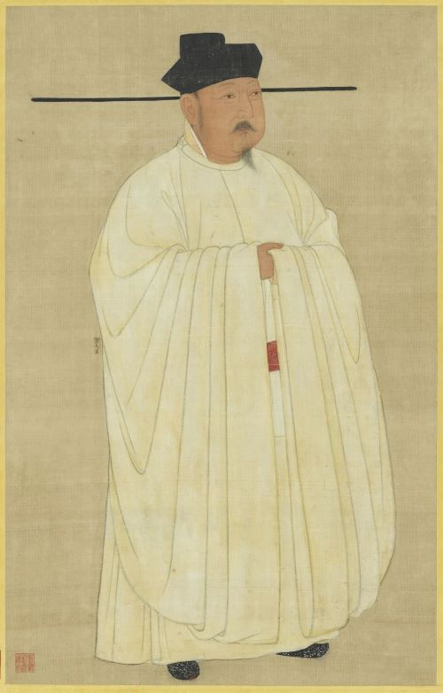

> @Author  : Lewis Tian (taseikyo@gmail.com)
>
> @Link    : github.com/taseikyo
>
> @Range   : 2024-07-28 - 2024-08-03

# Weekly #73

[readme](../README.md) | [previous](202407W4.md) | [next](202408W2.md)


\**Photo by [The Oregon State University Collections and Archives](https://unsplash.com/@oregonstateuni) on [Unsplash](https://unsplash.com/photos/a-black-and-white-photo-of-a-mountain-lake-42INohKEYkA)*

## Table of Contents

- [algorithm](#algorithm-)
- [review](#review-)
	- 伤害性不大，侮辱性极极极强
	- RC4加密算法
	- Qt之实现图片轮播效果
- [tip](#tip-)
- [share](#share-)
	- 人生六戒

## algorithm [🔝](#weekly-73)

## review [🔝](#weekly-73)

### 1. [伤害性不大，侮辱性极极极强](https://mp.weixin.qq.com/s/JzlYbL7mosdusNknmAaV8g)



伤害性不大，侮辱性极极极强

宋太宗曾问大臣：“朕何如唐太宗”？

你是大臣，该怎么回答？

【宋太宗】：朕比唐太宗，如何？

【大臣】：

唐太宗得位不正，陛下顺天承命，兄终弟及，此道胜一也。

唐太宗劳师远征，穷兵黩武，陛下为民守土，以静制动，此义胜二也。

唐太宗全承隋制，在位期间未有新政，陛下即位以来，一扫重武轻文之陋习，以文治国，此治胜三也。

唐太宗篡改起居注，沽名钓誉，陛下广开言路，从善如流，不畏流言，此度胜四也。

唐太宗屠尽隐太子后人，囚父于后宫，陛下善待太祖之后，此德胜五也。

唐太宗在位时，众皇子争储不断，其百年以后后宫作乱，牝鸡司晨，陛下诸皇子兄友弟恭，皆仁爱之辈，此孝胜六也。

唐太宗终其一朝，鼎盛时尚不过前隋，陛下治下万民安居乐业，人口繁盛远胜后周，此仁胜七也。

唐太宗名为天可汗，却不能收服异族，以兵革之利制夷，终至大唐四面受敌，陛下修德怀远，四夷称颂，此交胜八也。

唐太宗略输文采，此事后人皆知，陛下善书法诗赋，此文胜九也。

唐太宗于渭水签下城下之盟，陛下虽远征契丹不利，却能保中原不为敌骑践踏，此武胜十也。

陛下有十胜，唐太宗有十败，由此观之，唐太宗之比陛下，如萤火之比日月，露珠之比江海，陛下之功，虽尧舜不能及也。

【宋太宗】：来人呐，给朕叉出去。

【大臣】拼命回头：唐太宗昭陵六骏半丧，陛下驴车安然归京。此驾胜也也也也...

### 2. [RC4加密算法](https://zhou-yuxin.github.io/articles/2016/RC4%E5%8A%A0%E5%AF%86%E7%AE%97%E6%B3%95/index.html)

RC4加密算法是一种对称加密算法。所谓对称加密算法，说得直白一点，就是加密与解密的过程一模一样。假设定义RC4的运算过程是rc4(key,data)，那么，密文=rc4(key,明文)，明文=rc4(key,密文)。所以，对一段数据迭代地做奇数次RC4运算，就得到密文，对这段数据迭代地做偶数次RC4运算，结果依旧是原来的那段数据。

这种对称性就是基于密钥流的加密算法的一个特征。RC4加密算法也是一种基于密钥流的加密算法。何为密钥流呢？假设要加密的数据长N个字节，那么我通过某种算法，也产生一串N字节的数据，然后把这两串N字节数据按位异或（XOR），就得到了密文。把密文与这串密钥流再XOR，就能重新得到明文。而这一串由某种算法产生的N字节，或者说8N位，就叫做密钥流，而该算法就叫做密钥流生成算法。所有基于密钥流的加密算法的区别就在于密钥流的生成方式的不同。只要生成了与数据等长的密钥流，那么加密、解密方式都是把数据与密钥流做异或运算。

RC4本质上就是一种密钥流生成算法。它的特点是算法简单、运算效率高，而且非线性度良好。算法简单的特点使得可以使用硬件来实现RC4，如同在很多旧的无线网卡中就是使用硬件来实现WEP加密的。运算效率高使得用软件实现RC4也很便捷、不会占用过多CPU。而非线性度良好，则是RC4广泛使用的重要原因。所谓非线性度好，就是指通过密码产生密钥流容易，而通过密钥流逆推出密码则很难。

好了，说了这么多屁话，就上代码了：

rc4.h

```C
#ifndef RC4_H
#define RC4_H

/*
导出rc4_crypt函数，参数为要加密的数据、数据长度、密码、密码长度
*/
void rc4_crypt(unsigned char* p_data,unsigned int p_data_len,unsigned char* p_key,unsigned int p_key_len);

#endif
```

rc4.c

```C
#include <string.h>

static void rc4_init(unsigned char* p_s,unsigned char* p_key,unsigned int p_key_len)
{
    unsigned char t_k[256];
    int t_i;
    for(t_i=0;t_i<256;t_i++)
    {
        p_s[t_i]=t_i;
        t_k[t_i]=p_key[t_i%p_key_len];
    }
    int t_j=0;
    for(t_i=0;t_i<256;t_i++)
    {
        t_j=(t_j+p_s[t_i]+t_k[t_i])%256;
        unsigned char t_tmp=p_s[t_i];
        p_s[t_i]=p_s[t_j];
        p_s[t_j]=t_tmp;
    }
}

void rc4_crypt(unsigned char* p_data,unsigned int p_data_len,unsigned char* p_key,unsigned int p_key_len)
{
    unsigned char t_s[256];
    rc4_init(t_s,p_key,p_key_len);
    int t_i=0,t_j=0;
    unsigned int t_k;
    for(t_k=0;t_k<p_data_len;t_k++)
    {
        t_i=(t_i+1)%256;
        t_j=(t_j+t_s[t_i])%256;
        unsigned char t_tmp=t_s[t_i];
        t_s[t_i]=t_s[t_j];
        t_s[t_j]=t_tmp;
        int t_t=(t_s[t_i]+t_s[t_j])%256;
        p_data[t_k]^=t_s[t_t];
    }
}
```

要使用的时候，如下：

main.c

```C
#include <stdio.h>
#include "rc4.h"

int main()
{
    unsigned char t_data[]="hello,here is the data!";

    rc4_crypt(t_data,24,"password",8);
    printf("加密后的数据:n");
    int t_i;
    for(t_i=0;t_i<24;t_i++)
        printf("%x ",t_data[t_i]);
    printf("n");

    rc4_crypt(t_data,24,"password",8);
    printf("解密后的数据:n");
    for(t_i=0;t_i<24;t_i++)
        printf("%c",t_data[t_i]);
    printf("n");

    return 0;
}
```

### 3. [Qt 之实现图片轮播效果](https://blog.csdn.net/goforwardtostep/article/details/79212468)

主要是提供接口设置图片列表的路径，然后通过动画类来修改图片的透明度来达到切换的动画效果。而图片是直接通过 paintEvent 事件进行绘制的，同时绘制两张图片，先绘制下一张图片，然后再根据动画类返回的透明度绘制当前图片。图片自动切换通过一个时钟来搞定。也可以手动点击白色小按钮进行图片切换。

CarouselImageWindow.h

```C++
#include <QWidget>
#include <QScrollArea>
#include <QTimer>
#include <QPropertyAnimation>
#include <QPushButton>

class CarouselImageWindow : public QWidget
{
	Q_OBJECT

public:
	CarouselImageWindow(QWidget *parent = NULL);
	~CarouselImageWindow();

	// 设置图片列表;
	void setImageList(QStringList imageFileNameList);
	// 添加图片;
	void addImage(QString imageFileName);
	// 开始播放;
	void startPlay();

private:
	// 初始化图片切换按钮;
	void initChangeImageButton();
	// 绘图事件;
	void paintEvent(QPaintEvent *event);

	// 鼠标点击事件;
	void mousePressEvent(QMouseEvent* event);

public slots:
	// 图片切换时钟;
	void onImageChangeTimeout();

	// 图片切换按钮点击;
	void onImageSwitchButtonClicked(int buttonId);

private:
	// 用来做图片切换滑动效果，目前以透明度作为切换效果;
	QScrollArea* m_imagePlayWidget;
	// 图片列表;
	QList<QString> m_imageFileNameList;

	// 图片切换时钟;
	QTimer m_imageChangeTimer;

	// 当前显示图片index;
	int m_currentDrawImageIndx;

	// 切换图片;
	QPixmap m_currentPixmap;
	QPixmap m_nextPixmap;
	// 图片切换动画类;
	QPropertyAnimation* m_opacityAnimation;
	// 按钮列表;
	QList<QPushButton*> m_pButtonChangeImageList;
};
```

CarouselImageWindow.cpp

```C++
#include "CarouselImageWindow.h"
#include <QHBoxLayout>
#include <QPainter>
#include <QDebug>
#include <QButtonGroup>

CarouselImageWindow::CarouselImageWindow(QWidget *parent)
    : QWidget(parent)
    , m_currentDrawImageIndx(0)
{
    // 添加ImageOpacity属性;
    this->setProperty("ImageOpacity", 1.0);

    // 动画切换类;
    m_opacityAnimation = new QPropertyAnimation(this, "ImageOpacity");
    // 这里要设置的动画时间小于图片切换时间;
    m_opacityAnimation->setDuration(1500);

    // 设置ImageOpacity属性值的变化范围;
    m_opacityAnimation->setStartValue(1.0);
    m_opacityAnimation->setEndValue(0.0);
    // 透明度变化及时更新绘图;
    connect(m_opacityAnimation, SIGNAL(valueChanged(const QVariant&)), this, SLOT(update()));
    // 设置图片切换时钟槽函数;
    connect(&m_imageChangeTimer, SIGNAL(timeout()), this, SLOT(onImageChangeTimeout()));

    this->setFixedSize(QSize(400, 250));

    this->setWindowFlags(Qt::FramelessWindowHint);
}

CarouselImageWindow::~CarouselImageWindow()
{

}

void CarouselImageWindow::initChangeImageButton() {
    // 注意图片过多按钮可能放置不下;
    QButtonGroup* changeButtonGroup = new QButtonGroup;
    QHBoxLayout* hLayout = new QHBoxLayout();
    hLayout->addStretch();
    for (int i = 0; i < m_imageFileNameList.count(); i++) {
        QPushButton* pButton = new QPushButton;
        pButton->setFixedSize(QSize(16, 16));
        pButton->setCheckable(true);
        pButton->setStyleSheet("QPushButton{border-image:url(:/Resources/select1.png);}\
                                QPushButton:checked{border-image:url(:/Resources/select2.png);}");
        changeButtonGroup->addButton(pButton, i);
        m_pButtonChangeImageList.append(pButton);
        hLayout->addWidget(pButton);
    }
    hLayout->addStretch();
    hLayout->setSpacing(10);
    hLayout->setMargin(0);

    connect(changeButtonGroup, SIGNAL(buttonClicked(int)), this, SLOT(onImageSwitchButtonClicked(int)));

    QVBoxLayout* mainLayout = new QVBoxLayout(this);
    mainLayout->addStretch();
    mainLayout->addLayout(hLayout);
    mainLayout->setContentsMargins(0, 0, 0, 20);
}

void CarouselImageWindow::setImageList(QStringList imageFileNameList) {
    m_imageFileNameList = imageFileNameList;
}

void CarouselImageWindow::addImage(QString imageFileName) {
    m_imageFileNameList.append(imageFileName);
}

void CarouselImageWindow::startPlay() {
    // 添加完图片之后，根据图片多少设置图片切换按钮;
    initChangeImageButton();
    if (m_imageFileNameList.count() == 1) {
        m_pButtonChangeImageList[m_currentDrawImageIndx]->setChecked(true);
    }
    else if (m_imageFileNameList.count() > 1) {
        m_pButtonChangeImageList[m_currentDrawImageIndx]->setChecked(true);
        m_currentPixmap = QPixmap(m_imageFileNameList.at(m_currentDrawImageIndx));
        m_imageChangeTimer.start(2000);
        update();
    }   
}

void CarouselImageWindow::onImageChangeTimeout() {
    // 设置前后的图片;
    m_currentPixmap = QPixmap(m_imageFileNameList.at(m_currentDrawImageIndx));
    m_currentDrawImageIndx++;
    if (m_currentDrawImageIndx >= m_imageFileNameList.count()) {
        m_currentDrawImageIndx = 0;
    }
    m_nextPixmap = QPixmap(m_imageFileNameList.at(m_currentDrawImageIndx));

    m_pButtonChangeImageList[m_currentDrawImageIndx]->setChecked(true);

    // 动画类重新开始; 
    m_opacityAnimation->start();
}

void CarouselImageWindow::paintEvent(QPaintEvent *event) {
    QPainter painter(this);
    QRect imageRect = this->rect();

    // 如果图片列表为空，显示默认图片;
    if (m_imageFileNameList.isEmpty()) {
        QPixmap backPixmap = QPixmap(":/Resources/CarouselImageBack.png");
        painter.drawPixmap(imageRect, backPixmap.scaled(imageRect.size()));
    }
    // 如果只有一张图片;
    else if (m_imageFileNameList.count() == 1) {
        QPixmap backPixmap = QPixmap(m_imageFileNameList.first());
        painter.drawPixmap(imageRect, backPixmap.scaled(imageRect.size()));
    }
    // 多张图片;
    else if (m_imageFileNameList.count() > 1) {
        float imageOpacity = this->property("ImageOpacity").toFloat();
        painter.setOpacity(1);
        painter.drawPixmap(imageRect, m_nextPixmap.scaled(imageRect.size()));
        painter.setOpacity(imageOpacity);
        painter.drawPixmap(imageRect, m_currentPixmap.scaled(imageRect.size()));
    }
}

void CarouselImageWindow::onImageSwitchButtonClicked(int buttonId) {
    m_currentDrawImageIndx = buttonId - 1;
    if (m_currentDrawImageIndx == -1) {
        m_currentDrawImageIndx = m_imageFileNameList.count() - 1;
    }

    onImageChangeTimeout();
    m_imageChangeTimer.start(2000);
    update();
}

void CarouselImageWindow::mousePressEvent(QMouseEvent* event) {
    // 这里可以对当前图片进行点击然后触发每个图片对应的效果;
    // 比如web上好多类似的弹出对应的广告页面等功能;
    qDebug() << m_currentDrawImageIndx;
    return __super::mousePressEvent(event);
}
```

测试代码

```C++
int main(int argc, char *argv[]) {
	QApplication a(argc, argv);
	CarouselImageWindow w;
	w.addImage(":/Resources/image1.jpg");
	w.addImage(":/Resources/image2.jpg");
	w.addImage(":/Resources/image3.jpg");
	w.addImage(":/Resources/image4.jpg");
	w.startPlay();
	w.show();
	return a.exec();
}
```


## tip [🔝](#weekly-73)

## share [🔝](#weekly-73)

### 1. [人生六戒](https://app.bjtitle.com/8816/newshow.php?newsid=5585655)

曾国藩是春秋战国时代曾子的七十世孙。

他曾创下九年十升的官场奇迹，是清朝中兴的四大名臣之一。

他是中国近代政治家、战略家、理学家、文学家，湘军的创立者和统帅；

他因为在学问和事功方面的成就而备受后世推崇。

读懂曾国藩的人生 "六戒"，就学到了他的做人做事之道。

01

第一戒：

**久利之事勿为，众争之地勿往**

翻译：

一直都能获利的事情，就要考虑是否要终止；别人都在争的地方，就不要去了。

释读：

前半句是说人要懂得 "见好就收"，不要幻想着一件事会一直得利，万物有生有死，有消有长。

凡事都不会例外，所以如果一件事一直获利，那么衰败或者亏损的时候就要到了。这时候务必保持清醒。

后半句说的是保身之道，别人都在争的地方，一定是危险的地方，容易招惹麻烦或者祸患。

君子不立危墙之下，无论在任何情况下，都要注意观察形势，不要让自己陷入险境。

02

第二戒：

**勿以小恶弃人大美，勿以小怨忘人大恩**

翻译：

不要因为别人的小缺点就忽视他的优点，不要因为小小的恩怨就忽略了别人的大恩。

释读：

人无完人，每个人都有缺点，不要因为别人的一点缺点，就否定一个人的全部。

不要因为个人的一点小恩怨，就全盘否定，忘记一个人的恩情。

孔子不喜欢管仲，说他奢靡浪费，太看重排场。

但是在《论语》中，还有这样一句话："微管仲，吾其被发左衽矣。"

意思是说：没有管仲尊王攘夷，一匡天下，我们还都是披头散发的野人呢。

在待人接物的时候，一定不要太感情用事，一定要客观、公正地看待别人的缺点和不足。

这才是一个人成熟的表现。

03

第三戒：

**说人之短乃护己之短，夸己之长乃忌人之长**

翻译：

那种经常谈论别人缺点的人，内心其实是借此在掩饰自己的缺点；经常夸耀自己长处的人，内心其实是嫉妒或者想掩盖别人的长处罢了。

释读：

老是讨论别人缺点，吹嘘自己优点的人，其实内心反而是不够充实坚定的。

他们内心没有信心，所以喜欢打击别人，夸耀自己。

这样的人就像纸老虎，往往一戳就破。

而且，他们经常讨论别人的缺点，容易招致别人的怨恨，经常夸耀自己的优点，容易招人反感。

这样的人，情商太低，迟早会招致祸患。

04

第四戒：

**利可共而不可独，谋可寡而不可众**

翻译：

利益一定要懂得分享给众人，谋划大事最好自己拿主意。

释读：

每个人都渴望利益，如果谁想独占，那就是大家的敌人。

想要成事，就必须懂得分享利益，曾国藩在任期间，向朝廷举荐人才无数，官位财富毫不吝啬与下属分享。

于是曾国藩招揽的人才最多，人心也最齐。

《战国策》上说，"论至德者不和于俗，成大功者不谋于众。"

谋划特别重大的事情时，不要和大众商量，尽量自己拿主意。

因为自古以来，成大事的人都有不凡的格局和气魄，这样的人万中无一。

和大众一起谋划大事，七嘴八舌，反而容易破坏信心，干扰判断。

05

第五戒：

**天下古今之庸人，皆以一惰字致败；天下古今之才人，皆以一傲字致败**

翻译：

天赋平平的人，一般输在懒上，天赋惊艳的人，一般都输在傲上。

释读：

对于一般人来说，没有什么天赋，只能靠自己后天的努力，才能成就一番事业，所以，最忌讳的就是一个懒。

那些天赋好的人，聪明敏锐，才气逼人，但是也因此容易孤傲自大，故步自封，所以，他们最忌讳的就是一个傲字。

曾国藩本身天赋不高，但是他却以一个勤字，成就了同时代天才们难以企及的事业和学问。

可以说曾国藩正是普通人的榜样。而如项羽、李自成等，占尽天时地利，却最终因为骄傲而败亡。

06

第六戒：

**凡办大事，以识为主，以才为辅；凡成大事，人谋居半，天意居半**

翻译：

办大事主要是看格局和见识，才能只是辅助；凡是要做大事，一半在于人的谋划，另一半就要看天意了。

释读：

刘邦攻下咸阳，诸将都去抢金银美女，只有萧何封存了秦国的户籍、地形、法令。

这些材料为制定正确的方针政策和律令制度找到了可靠的根据，对日后西汉政权的建立和巩固，起到了巨大的作用，萧何功不可没。

花盆里长不出参天大树，一个人的见识和格局，决定着一个人所能抵达的高度。

大事，以识为主，见识上高瞻远瞩，才能先人一步。

而 "人谋居半，天意居半" 则是说，无论做什么事情，都不是百分之百能成功的。

我们只能 "尽人事以听天命"，把心态放平。

不要因为有自己不能左右的因素就不去努力，更不能因为自己努力了，最终却失败了而去怨天尤人。

[readme](../README.md) | [previous](202407W4.md) | [next](202408W2.md)
