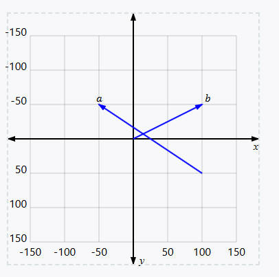
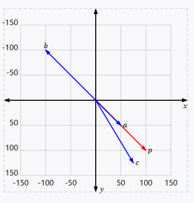
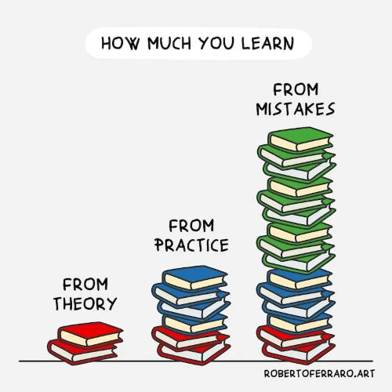

> @Author  : Lewis Tian (taseikyo@gmail.com)
>
> @Link    : github.com/taseikyo
>
> @Range   : 2024-08-04 - 2024-08-10

# Weekly #74

[readme](../README.md) | [previous](202408W1.md) | [next](202408W3.md)

本文总字数 3572 个，阅读时长约：5 分 22 秒，统计数据来自：[算筹字数统计](http://www.xiqei.com/tools?p=tj)。


\**Photo by [The Chaffins](https://unsplash.com/@thechaffins) on [Unsplash](https://unsplash.com/photos/a-large-rock-in-the-middle-of-a-forest-1KDauE4oF0o)*

## Table of Contents

- [algorithm](#algorithm-)
- [review](#review-)
	- 向量搜索介绍（英文）
- [tip](#tip-)
	- 加密压缩使用 7z 而不是 zip
	- 指定 PDF 的跳转页面
- [share](#share-)
	- 收获最多的学习途径

## algorithm [🔝](#weekly-74)

## review [🔝](#weekly-74)

### 1. [向量搜索介绍（英文）](https://blog.shalvah.me/posts/an-exploration-of-vector-search)

随着 AI 的爆火，向量库、向量搜索这些词汇也流行起来，本文介绍了向量搜索。

1、向量

在二维空间中，一个向量表示为从空间一个点到另一点的运动。如下图，a 向量是从 (100, 50) 到 (-50, -50)，b 向量是从 (0, 0) 到 (100, -50)



如何将向量的思想扩展到非数字实体？

每个数值向量具有 X 和 Y 坐标（或 3D 系统中的 X，Y，Z，依此类推）。x，y，z 是此向量空间的轴或尺寸。给定一些我们要表示为向量的非数字实体，我们需要首先决定维度，并为每个维度分配一个值。

比如交通工具：

| item | number of wheels | has an engine | moves on land | max occupants |
|:---:|:---:|:---:|:---:|:---:|
| car | 4 | yes | yes | 5 |
| bicycle | 2 | no | yes | 1 |
| tricycle | 3 | no | yes | 1 |
| motorcycle | 2 | yes | yes | 2 |
| sailboat | 0 | no | no | 20 |
| ship | 0 | yes | no | 1000 |

因此，对于车（car），我们可以定义它的向量：(4, 1, 1, 5)

2、相似度

每个向量都有它的方向和长度，如下图中，p 和a 指向相同的方向，但长度不同。𝑝 和 b 的方向完全相反，但具有相同的长度。c 比 p 短一点，虽然指向不同，但很接近。



那么，哪个向量与 p 最接近呢？

- 如果“相似”意味着只指向相似的方向，那么 a 与 p 最相似。 b 是最不相似的，因为它指向 p 的完全相反。
- 如果“相似”仅意味着相似的长度，那么b 与 p 最相似。

在向量搜索中，很少只看长度，相似度的大多数度量仅取决于方向或方向和大小。

3、相似度的计算

1. 欧氏距离（Euclidean distance）
2. 曼哈顿距离（Manhattan distance）
3. 点乘（Dot product）
4. 余弦相似度（Cosine similarity）

## tip [🔝](#weekly-74)

### 1. 加密压缩使用 7z 而不是 zip

最近做文件备份，方法是使用 `zip` 命令对文件夹压缩加密，然后上传飞书，打算在另一个电脑上下载解压缩。

谁知道上传完之后，在飞书可以直接点开该加密的压缩包，感觉就是 `zip` 的加密算法不靠谱（也可能是我设置的密码只包含数字+字母，以及长度有限导致比较简单？）。

然后我用 `7z` 尝试了下，使用同样的密码，对一个文件夹加密压缩，然后上传飞书，待上传完之后是点不开的，显示压缩包已加密或损坏，高下立判，之后还是使用 `7z` 吧。

附带二者的命令：

```bash
zip -er folder.zip folder		// 输入该命令之后会提示你输入密码
7z a -ppasswd folder.7z folder  // -p 后面就是密码，无需空格
```

以下是 chatgpt 的对这俩压缩算法的优劣对比：

ZIP和7Z是两种常见的压缩格式，它们各自采用不同的压缩算法，具有不同的优缺点。以下是它们在多个维度上的对比：  

1. **压缩算法**
- **ZIP**：通常使用 **Deflate** 算法（LZ77 + Huffman 编码）。部分现代ZIP实现（如7-Zip、WinRAR）支持更高级的压缩算法（如 BZip2、LZMA）。
- **7Z**：默认使用 **LZMA** 或 **LZMA2** 算法（改进的 Lempel-Ziv 算法，结合区块排序和自适应哈夫曼编码）。此外，还支持 BZip2、PPMD、Deflate 等多种算法。

2. **压缩比**
- **ZIP** 的压缩比相对较低，尤其在对大文件或可高度压缩的文件（如文本、日志）进行压缩时，LZMA 在 7Z 格式下通常能提供 30%～70% 更高的压缩比。
- **7Z** 的压缩比更高，尤其适用于文本、代码、日志等冗余数据较多的文件。

3. **压缩速度**
- **ZIP** 的压缩速度较快，特别是使用 Deflate 时，适用于快速归档和传输。
- **7Z** 由于使用 LZMA 算法，压缩速度通常比 ZIP 慢，尤其是默认的高压缩比模式。不过，LZMA2 在多核 CPU 上表现较好，能部分弥补速度问题。

4. **解压速度**
- **ZIP** 的解压速度较快，尤其是在低端硬件或移动设备上。
- **7Z** 的解压速度通常比 ZIP 慢一些，尤其是在高压缩比模式下。但在多核 CPU 上，LZMA2 仍然能较好地提高解压性能。

5. **格式支持**
- **ZIP** 是通用格式，几乎所有操作系统和压缩软件（Windows 自带、macOS、自解压程序）都能直接打开。
- **7Z** 主要由 7-Zip 软件支持（但一些现代解压工具，如 WinRAR、PeaZip 也支持）。在非 Windows 系统（如 macOS、Linux）上可能需要额外软件。

6. **加密**
- **ZIP** 传统上支持较弱的 PKZIP 加密，但 AES-256 加密需使用现代工具（如 WinRAR、7-Zip）。
- **7Z** 默认支持 **AES-256**，安全性更高。

7. **分卷压缩**
- **ZIP** 支持分卷，但兼容性依赖于软件实现。
- **7Z** 具有更灵活的分卷压缩机制，适用于大文件存储和分发。

8. **容错与恢复**
- **ZIP** 没有内置数据恢复功能。
- **7Z** 支持**冗余恢复数据（数据恢复记录）**，部分情况下可修复损坏的压缩文件。

9. **适用场景**
- **ZIP 适合：**
  - 需要通用兼容性的场景（如发送给普通用户）
  - 需要快速压缩/解压缩的应用
  - 低配置设备或需要兼容操作系统自带工具
- **7Z 适合：**
  - 需要高压缩比的场景（如备份大数据、存储日志）
  - 需要更强的加密保护
  - 适用于多核 CPU 和大内存的系统

10. **总结**

| 对比维度 | ZIP | 7Z |
|---------|-----|----|
| **压缩算法** | Deflate（部分支持 BZip2、LZMA） | LZMA/LZMA2（支持多种算法） |
| **压缩比** | 一般 | 高，尤其是文本、代码文件 |
| **压缩速度** | 快 | 较慢（LZMA2 可优化） |
| **解压速度** | 快 | 稍慢 |
| **兼容性** | 极高（Windows/macOS/Linux 原生支持） | 需 7-Zip、WinRAR 等软件 |
| **加密** | 传统 ZIP 加密（弱），支持 AES-256 | 默认 AES-256 |
| **分卷压缩** | 支持但兼容性一般 | 支持，适合大文件 |
| **数据恢复** | 无 | 有数据恢复记录 |
| **适用场景** | 快速归档，通用传输 | 高压缩比存储，安全存档 |

总的来说，ZIP 更适合通用需求，而 7Z 在压缩比和安全性方面表现更强，适用于存档和大数据存储。

### 2. [指定 PDF 的跳转页面](https://technicalwriting.dev/links/pdf.html)

Just append #page=X to your URL, where X is a placeholder for the page you want to link to. For example, the following link should jump you to page 5 of the Raspberry Pi Pico getting started guide: https://datasheets.raspberrypi.com/pico/getting-started-with-pico.pdf#page=5

Note that the PDF authors consider this to be page 4, whereas the browser considers it page 5. This is because the browser always treats the first page of the PDF as page 1 whereas authors sometimes don’t.

## share [🔝](#weekly-74)

### 1. 收获最多的学习途径

哪种方式学习可以收获最多？

最近流行的一句话是：“干中学”，也就是在实践中不断学习。

下面这张图形象地展示了学习的不同阶段：理论是基础，实践是关键，而真正的提升往往来自于犯错。当我们在实践中遇到问题，及时纠正并调整理论，才能不断深化理解，实现真正的成长。



[readme](../README.md) | [previous](202408W1.md) | [next](202408W3.md)
