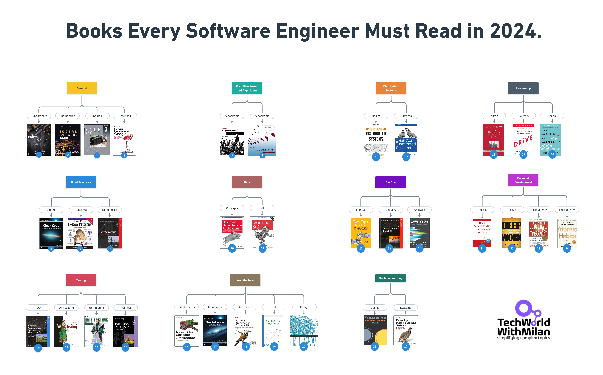

> @Author  : Lewis Tian (taseikyo@gmail.com)
>
> @Link    : github.com/taseikyo
>
> @Range   : 2024-08-11 - 2024-08-17

# Weekly #75

[readme](../README.md) | [previous](202408W2.md) | [next](202408W4.md)

本文总字数 4297 个，阅读时长约：7 分 58 秒，统计数据来自：[算筹字数统计](http://www.xiqei.com/tools?p=tj)。

{width=100%}

\**Photo by [Andrew Valdivia](https://unsplash.com/@donovan_valdivia) on [Unsplash](https://unsplash.com/photos/black-and-white-metal-tool-9uysHhdXNN4)*

> 愿中国青年都摆脱冷气，只是向上走，不必听自暴自弃者流的话。能做事的做事，能发声的发声。有一分热，发一分光，就令萤火一般，也可以在黑暗里发一点光，不必等候炬火。此后如竟没有炬火：我便是唯一的光。
>
> 鲁迅 —— 《热风·随感录四十一》

## Table of Contents

- [algorithm](#algorithm-)
- [review](#review-)
	- 奶头乐理论
	- 蘑菇管理定律
	- 软件工程谁应该读的书（英文）
- [tip](#tip-)
- [share](#share-)
	- 37% 法则和最优停止理论

## algorithm [🔝](#weekly-75)

## review [🔝](#weekly-75)

### 1. [奶头乐理论](https://wiki.mbalib.com/wiki/%E5%A5%B6%E5%A4%B4%E4%B9%90%E7%90%86%E8%AE%BA)

1、什么是奶头乐理论

奶头乐理论的前提：社会动荡的主要因素之一是阶层之间的利益冲突。

奶头乐理论的描述：由于生产力的不断上升，世界上的一大部分人口将不必也无法积极参与产品和服务的生产。为了安慰这些“被遗弃”的人，避免阶级冲突，方法之一就是制造“奶头”、喂之以“奶头”——使令人陶醉的消遣娱乐和充满感官刺激的产品（比如网络、电视和游戏）填满人们的生活、转移其注意力和不满情绪，令其沉浸在“快乐”中不知不觉丧失思考能力、无心挑战现有的统治阶级。

“奶头”的形式有两种：

一种是发泄性娱乐，比如鼓励暴力网络游戏、鼓动口水战；

一种是满足性游戏，比如拍摄大量的肥皂剧和偶像剧，大量报道明星丑闻，播放真人秀等大众娱乐节目。

2、奶头乐理论的来源

这一概念来自美国前总统国家安全事务助理布热津斯基。

美国旧金山曾于1995年举行过一个集合全球500名经济界、政治界精英的会议，与会者包括萨切尔、老布什、美国有线电视新闻网（CNN）、惠普、Sun微系统的老板等等，该会议的主旨在于为全球化的世界进行分析与规划。会议上，与会者一致认为全球化的高度、快速、激烈的竞争将使全球80%人口"边缘化"，而这80%“边缘化”人口与20%搭上全球化快车的人口之间的冲突将成为今后的主要问题。

在此基础上，Sun微系统的老板格基表示，届时将是一个“要么吃人、要么被吃”的世界。布热津斯基也及时献计献策，创造了一个新词汇——tittytainment “奶头乐”，英文titty“奶头”与entertainment “娱乐”的组合，意指要使彼80%的人安分守己，此20%的人高枕无忧，就得采取温情、麻醉、低成本、半满足的办法卸除“边缘化人口”的不满。

3、奶头乐理论在中国

在中国，更适合 Titty Tainment 的翻译或许是“肥宅乐”，“肥宅”是一群只满足于待在家中，用电子游戏、虚拟社交或者膨化食品、碳酸饮料麻痹自己的人，他们抵触现实社交与工作，宁愿一个人孤独终老。大多集中在20-30岁的年轻群体。

### 2. [蘑菇管理定律](https://wiki.mbalib.com/wiki/%E8%98%91%E8%8F%87%E7%AE%A1%E7%90%86%E5%AE%9A%E5%BE%8B)

1、什么是蘑菇管理定律

“蘑菇管理定律”指的是组织或个人对待新进者的一种管理心态。因初学者常被置于阴暗的角落,不受部门的重视，只做一些打杂跑腿的工作，有时还会被浇上一头大粪，受到无端的批评、指责、代人受过；组织或直属领导任其自生自灭；初学者得不到必要的指导和提携，这种情况与蘑菇的生长情景极为相似。一般在管理机构比较正式的大企业和公司里，这种情况比较多。管理者要提早认识到这种现象并加以预防利用，才能做到事半功倍的管理效果！

2、蘑菇管理定律的由来

据称，蘑菇管理定律一词来源于20世纪70年代一批年轻的电脑程序员的创意。由于当时许多人不理解他们的工作，持怀疑和轻视的态度，所以年轻的电脑程序员就经常自嘲“像蘑菇一样的生活”。电脑程序员之所以如此自嘲，这与蘑菇的生存空间有一定的关系。

蘑菇的生长特性是需要养料和水分，但同时也要注意避免阳光的直接照射，一般需在阴暗角落里培育，过分的曝光会导致过早夭折。古时，蘑菇的养料一般为人、兽的排泄物，虽不洁但为必需品。

从两者的关系来看，地点、养料两方面的条件给予了蘑菇的生存空间，但须为自生自灭，新进学者亦是如此。

3、管理中的蘑菇定律
　　一个组织，一般对新进的人员都是一视同仁，从起薪到工作都不会有大的差别。无论你是多么优秀的人才，在刚开始的时候，都只能从最简单的事情做起，“蘑菇” 的经历，对于成长中的年轻人来说，就像蚕茧，是羽化前必须经历的一步。所以，如何高效率地走过生命的这一段，从中尽可能汲取经验，成熟起来，并树立良好的值得信赖的个人形象，是每个刚入社会的年轻人必须面对的课题。

　　古人云：“吃得苦中苦，方为人上人”、“天將降大任于斯人，必先苦其心志，劳其筋骨、饿其体肤”。吃苦受难并非是坏事，特别是刚走向社会步入工作岗位，当上几天 “蘑菇”，能够消除很多不切实际的幻想，也能够对形形色色的人与事物有更深的了解，为今后的发展打下坚实的基础。“蘑菇”经历对于成长中的年轻人来说犹如破茧成蝶，如果承受不起这些磨难就永远不会成为展翅的蝴蝶，所以平和的走过生命的这一“蘑菇”阶段能够汲取经验，尽快成熟起来。当然，如果当“蘑菇”时间过长，有可能成为众人眼中的无能者，自己也会渐渐认同这个角色。

　　从该定律的意义可见，心态的调整对于组织的初入者，尤其是那些象牙塔里走出来的大学生们很重要。现在有许多刚大学毕业的新人，放不下大学生或研究生身份，委屈的做些不愿做的小事情，如端茶倒水、跑腿送报，他们忍受不了做这种平凡或平庸的工作，从而态度消极想跳槽，这也就是现代年轻人所流露出的眼高手低的陋习。象牙塔中的天之骄子，满怀理想抱负对未来充满信心，但“一室之不治，何以天下家国为？”连小事都不愿意做，怎么能成就大事业呢？难道天之骄子们就没有想到公司这样的管理是没有任何错误的？“不经历风雨怎么见彩虹，没有人能随随便便成功”，想一口吃成大胖子更是不切实际，新人需要在“蘑菇”的环境中锻炼自己。

　　我们关注磨菇的生存环境，适当给予关怀，不要过分施压，才能让其有良好的成长空间！

3、蘑菇管理定律的意义与思考

　　首先，“蘑菇管理”是一种较为普遍的社会现象，我国古代的学徒工，在刚开始学徒的时候，就是如此：师傅并不马上教你什么，只是安排学徒工做一些跑堂之类的杂事，不管学徒喜不喜欢，都必须做，而且必须做好。徒弟没有选择的权力，如果做不好杂事，也就没有了学徒的资格。现在虽然大多数行业已经没有学徒制度了，但是，“蘑菇管理定律”却还在许多单位根深蒂固地存在着，大部分“初出茅庐”的年轻人都有过一段被“蘑菇管理”的经历。

　　其次，“蘑菇管理”有一定的积极意义。许多初出茅庐的年轻人刚到一个新单位，对工作、对业务、对人事、对环境都不熟悉，不太可能马上胜任重要工作(个别优秀者除外)。这时候，经历一段“蘑菇管理”无论对单位还是对个人都是有意义的。对单位来说，不会因为初学者对业务的不熟练而给企业带来损失。对个人来说，正是积累经验、熟悉工作，历练和成长的好机会。但是，作为刚刚走出大学校门，雄心勃勃的大学毕业生来说，应该如何对待“蘑菇管理”，这是一个值得思考的问题。

4、如何对待蘑菇管理

1. 主动出击
2. 沟通交流
3. 学会忍耐
4. 良好心态
5. 适应环境

### 3. [软件工程谁应该读的书（英文）](https://newsletter.techworld-with-milan.com/p/learn-things-that-dont-change?open=false#%C2%A7books-every-software-engineer-must-read-in)

## tip [🔝](#weekly-75)

## share [🔝](#weekly-75)

### 1. [37% 法则和最优停止理论](https://wiki.mbalib.com/wiki/37%25%E6%B3%95%E5%88%99)

最优停止理论的一个经典案例：[秘书问题](https://wiki.mbalib.com/wiki/%E7%A7%98%E4%B9%A6%E9%97%AE%E9%A2%98)。

我们在公司中工作，被招聘、面试人都有所经历，假如你是一个秘书，需要招聘一个人员，筛选了几分简历，决定面试4人，甲、乙、丙、丁。

每次面试之后，你有两个选择，要么聘用此人，要么拒绝。我们如何才能招聘最佳人选的机会最大，终止面试呢？

我们假设这四个人按照顺序丁＞丙＞乙＞甲，我们面试是随机的，前提也不知道丁是最棒的，如果我们面试完这四个人，是有24种可能的，也就是4种排列。

假如我们有三种策略：

第一种策略：面试完第一人就决定录用，能录用到丁的概率是25%；

第二种策略：面试完最后一人就决定录用（前三人不要），能录用到丁的概率是25%；

第三种策略：面试完第一人不做决定，作为判定标准，一旦出现比他高的人就录用，能录用到丁的概率是46%。

假如第一个人是就是丁，后面面试的能力都比他弱，我们就自行放弃吧，选中丁的概率是为0的；假如第一个人是甲，第二个人能力都比甲好，但是录取到丁的概率是2/24；假如第一个人是乙，第二个人是甲的话，肯定不用，第二个人是乙、丙、丁就会录用，但是能录用到丁的概率就是3/24；假如第一个人是丙，只有丁比他强，因此只要丁一出现就会被录取，有6/24的可能性，以上可能性加到一起就是11/24=46%。我们发现第三种策略能选到最优人员的概率要大。

以上是 N=4 的时候，当 N 变动时，概率是什么样子的呢？

请看下表：

| 人数 | 作为标准的人数 | 选中优秀人员概率 |
|---|---|---|
| 4 | 1 | 46% |
| 5 | 2 | 43 |
| 6 | 2 | 42.78 |
| ... | ... | ... |
| 100 | 37（37%） | 37.1 |
| 1000 | 369（36.9%） | 36.8 |

当N无限大，我们作为标准的策略就是N/e（e是自然常数），概率就是1/e，是不是很神奇。假如人数是10000,，我们采取的策略是10000/2.71828=3678，不做录取，只做标准，选中最优人员的概率为1/e=36.8%≈37%。

这就是37%的由来，因此37%是我们在做最优停止时选择标准根据样本计算的依据。

法则运用：

比如你打算在 18- 40 岁之间找到人生的伴侣,那么按照 37% 理论来的话,前一段 37% 也就是 
18-26.1 岁,用来交往不同的男士，只交往不结婚。等你到了 26.1 岁的时候,坐下来确定你的“最基本的满意标准”。然后嫁给一个从那一 天开始你遇到的，第一个好于这个标准的男士，并且不再寻找最优方案。

再比如你想在一个月内买房子，那你可以用37%的时间看房子，确定“最基本满意标准”，然后从第12天开始，遇见一个好于这个标准的房子，就立即下手。

如果你一生可能要有 10 段恋爱，那么找到“那个他”的最大概率发生在拒绝 4 个恋人之后（代表 39.87% 的恋爱经历）。如果你可能谈 20 段恋爱，则要拒绝前 8 个人（那个对的人在 38.42% 处等你）

[readme](../README.md) | [previous](202408W2.md) | [next](202408W4.md)
