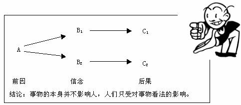

> @Author  : Lewis Tian (taseikyo@gmail.com)
>
> @Link    : github.com/taseikyo
>
> @Range   : 2024-08-18 - 2024-08-24

# Weekly #76

[readme](../README.md) | [previous](202408W3.md) | [next](202408W5.md)

本文总字数 9500 个，阅读时长约：18 分 8 秒，统计数据来自：[算筹字数统计](http://www.xiqei.com/tools?p=tj)。

{height=100%}

\**Photo by [Khanh Nguyen](https://unsplash.com/@passengerslover92) on [Unsplash](https://unsplash.com/photos/a-woman-pushing-a-cart-full-of-items-down-a-street-jE-56UoLT3g)*

## Table of Contents

- [algorithm](#algorithm-)
- [review](#review-)
	- 猴子管理法则
- [tip](#tip-)
	- 同步远端的状态，删除远端已不存在的本地分支
- [share](#share-)
	- 情绪ABC理论

## algorithm [🔝](#weekly-76)

## review [🔝](#weekly-76)

### 1. [猴子管理法则](https://wiki.mbalib.com/wiki/%E7%8C%B4%E5%AD%90%E7%AE%A1%E7%90%86%E6%B3%95%E5%88%99)

1、猴子管理法则来源

背上的猴子——由威廉姆翁肯 (William Oncken)所发明的一个有趣的理论。他所谓的“猴子”，是指“下一个动作”，意指管理者和下属在处理问题时所持有的态度。其与Donald L. Wass在1999年共同创作并发行了介绍该理论的书籍《Management Time: Who's Got the Monkey?》。

很多管理者往往遇到这样的情况，每天走进办公大门后，总有员工跑到自己面前说：“我昨天的工作遇到了一些问题，请问该怎么解决？”这个时候，很多管理者会发现，当你听完下属员工的工作汇报后发现这件事情并没有得到彻底解决，而你原本计划好今天要做的工作也因此耽误了不少时间。

**责任是一只猴子**

这其中的关键在于，本来该下属员工自行完成的工作，因为逃避责任的缘故，交由上司处理。每个下属都有自己的猴子，如果都交由上司管理，显然，管理者自己的时间将变得很不够用。

威廉姆翁肯提出的猴子管理法则，目的在于帮助经理人确定由适当人选在适当的时间，用正确的方法做正确的事。当然，这个法则只能运用在有生存价值的猴子身上，不该存活的猴子就狠心把他杀了吧！


2、猴子管理法则的简介

猴子管理法则的目的在于帮助经理人确定由适当人选在适当的时间，用正确的方法做正确的事。身为经理人要能够让员工去抚养自己的“猴子”，你也有足够的时间去做规划、协调、创新等重要工作。

**“猴子”=问题**

你是问题处理高手吗？假如你的下属崇拜你，你或许会相当高兴。但那以后，他几乎每件事都向你请示，你会觉得如何呢？你是否会感觉自己的时间不够用了，并因此开始检查自己的管理是不是出了什么问题呢？

有一天，你的一位下属在办公室的走廊与你不期而遇，下属停下脚步问：“老板，有一个问题，我一直想向你请示该怎么办。”此时，下属的身上有一只需要照顾的 “猴子”，接下来他如此这般将问题汇报了一番。尽管你有要事在身，但还是不太好意思让急切地想把事情办好的下属失望。你非常认真地听着……慢慢地，“猴子”的一只脚已悄悄搭在你的肩膀上。

你一直在认真倾听，并不时点头，几分钟后，你对他说这是一个非常不错的问题，很想先听听他的意见，并问：“你觉得该怎么办？”

“老板，我就是因为想不出办法，才不得不向你求援的呀。”

“不会吧，你一定能找到更好的方法。”你看了看手表，“这样吧，我现在正好有急事，明天下午四点后我有空，到时你拿几个解决方案来我们一起讨论。”

告别前，你没有忘记补充一句：“你不是刚刚受过‘头脑风暴’训练吗？实在想不出，找几个搭档来一次‘头脑风暴’，明天我等你们的答案。”

“猴子”悄悄收回了搭在你身上的那只脚，继续留在此下属的肩膀上。

第二天，下属如约前来。从脸上表情看得出，他似乎胸有成竹：“老板，按照你的指点，我们已有了5个觉得还可以的方案，只是不知道哪一个更好，现在就是请你拍板了。”即使你一眼就已看出哪一个更好，也不要急着帮他作出决定。不然，他以后对你会有依赖，或者万一事情没办好，他一定会说：“老板，这不能怪我，我都是按照你的意见去办的。”

关于作决定，记住以下准则：

一、该下属做决定的事，一定要让他们自己学着做决定；

二、做决定意味着为自己的决定负责任。不想做决定，常常是潜意识里他不想承担责任；

三、下属不思考问题、不习惯做决定的根源一般有两个：其一是有“托付思想”，依赖上司或别人，这样的下属不堪大用；其二是上司习惯代替下属做决定或喜欢享受别人听命于自己的成就感，这样的上司以及他所带领的团队难以胜任复杂的任务；

四、让下属自己想办法，做决定，就是训练下属独立思考问题的能力和勇于承担责任的行事风格。

对话还在继续。你兴奋地说：“太棒了，这么多好方案。你认为，相比较而言哪一个方案更好？”

“我觉得A方案更好一些。”

“这的确是一个不错的方案，不过你有没有考虑过万一出现这种情况，该怎么办？”

“噢，有道理，看来用E方案更好。”

“这方案真的也很好，可是，你有没有想过……”

“我明白，应该选择B方案。”

“非常好，我的想法跟你一样，我看就按你的意见去办吧。”

凭你的经验，其实你早就知道应该选择B方案，你不直接告诉他的目的是想借此又多赢得一次训练部属的机会。训练是一个虽慢反快的过程，训练的“慢”是为了将来更快。

你这样做的好处不言而喻：

一、打断下属负面的“依赖”神经链。

二、训练了下属分析问题、全面思考问题的能力。

三、让下属产生信心与成就感。他会觉得自己居然也有解决复杂问题的能力。越来越有能力的下属能越来越胜任更重要的任务。

四、激发下属的行动力。

五、你将因此不必照看下属的“猴子”而腾出更多的精力去照看自己的“猴子”。

这是一个比较成功的个例，下面让我们来看看其他更复杂的情况下经理应如何处理。

**“猴子”在哪儿**

每次“猴子”都是在经理和下属的背上跳来跳去，它所要做的就只是不合时宜地跳，然后，一转眼，下属就机敏地消失了。

让我们再想象一下，一个经理正走过大厅时，他的下属小李迎面而来。两人碰面时，小李打招呼道：“早上好。顺便说一下，我们出了个问题。你看……”当小李继续往下说时，经理发现这个问题与所有下属提出的问题具有两个相同之处。这两个相同之处是：一、经理知道自己应该参与解决问题；二、经理知道目前还无法提供解决问题的方案。

于是，经理说：“很高兴你能提出这个问题。我现在很忙。让我考虑一下，再通知你。”然后他就和小李各自走开了。

现在我们分析一下刚才发生的一幕。他们两个人碰面之前，“猴子”在谁的背上？下属的背上。两人走开之后，又在谁的背上？经理的背上。一旦“猴子”成功地从下属的背上跳到上司的背上，“受下属制约的时间”便一直持续到“猴子”回到真正的主人那儿接受照顾和饲养。在接收这只“猴子”的同时，他也就自动地站到了他下属的下属位置上。而下属为了确保经理不会忘记这件事，以后她会将头探进经理办公室，欢快地询问：“经理，怎么样了？”（这叫监督）

或者让我们想象一下经理是如何结束他和另一位下属小杨的谈话的。他离开时说：“好的，给我一份备忘录。”

我们分析一下这个场景。“猴子”现在在下属的背上，因为下一步要采取的行动是他，但“猴子”准备跳跃了。观察这只“猴子”，小杨尽职地写好经理要求的备忘录，发送给经理，经理收到后读了一遍。现在该由谁来采取行动？经理。如果他越不迅速采取行动，下属就会越生气，经理也就越内疚。

或者，设想经理在和另一个下属小张会面时，他同意为小张做的公共关系建议书提供一切必要的支持。结束的时候经理说：“需要帮助尽管告诉我。”

我们就此做一个分析。同样，“猴子”本来是在下属背上的，但是又有多久呢？小张意识到：直至经理批准她的建议书才能让经理知道“猴子”的存在。根据经验，她也意识到她的建议书会在经理的公文包里呆上几个礼拜才能得到处理。是谁真正得到了“猴子”？谁要找谁核实？浪费时间和瓶颈问题又会发生。

第四个下属Reed，他刚从公司的另一部门调任，将发起并管理一项新的业务。经理说他们马上要碰个头，订出一套新的工作目标并补充说：“我会草拟一个大纲和你讨论。”

我们也来分析一下。下属得到了一份新工作并负有全部责任，但是经理要负责下一步的工作，在他做出任何行动前，他肩负着“猴子”，而下属也无法开展工作。

为什么会发生以上这些情形？因为在各种情形下，经理和下属在最初时总是自觉或不自觉地认为他们所考虑的问题是两人共同的问题。每次“猴子”都是在经理和下属的背上跳来跳去，它所要做的就只是不合时宜地跳，然后，一转眼，下属就机敏地消失了。于是，经理的一大堆事务中又增添了一桩。当然，可以培训“猴子” 合时宜地跳，但在最开始就阻止它们叉腿坐在两个人的背上就更容易些。

**谁为谁工作**

设想一下，如果这4个下属都能为他们的上司周全考虑，从而尽量使每天跳到经理背上的“猴子”不超过3只。在5天的工作周里，经理就会得到60只尖叫的“猴子”——“猴子”太多，会令他无法一只一只地处理好。所以他只能将“受下属制约的时间”花在搞定“优先事情”上。

周五下午快下班时，经理把自己关在办公室时考虑面临的事情，而他的下属们则等在门外希望能抓住周末前最后的机会提醒他“快做抉择”。想象他们在门外等的时候怎样彼此悄悄议论：“真是难办，他根本没法做任何决定。真是不知道像他那样一个没能力做决定的人怎么会在公司做得这么高。”

最糟的是，经理无法做出任何“下一步的行动”是因为他几乎把所有的时间都花在了应付上司和公司要求做的事情上了。要完成这些事，他需要自由支配的时间，而当他忙于应付这些“猴子”时，也就失去了自由支配的时间。经理用对讲机告诉秘书，让她转告那几个下属，他只能礼拜一早上见他们了。晚上7点，他离开公司，下定决心要第二天回办公室，利用周末处理事情。第二天清晨，当他回到办公室时却透过窗户看见高尔夫球场上有两对人正在打球。猜到是谁了吧？

这下好了。他现在知道谁真正为谁工作了。而且，他现在也明白了，如果他这个周末完成了他要完成的任务，他的下属就会士气高涨，从而每个人都会提高跳到他背上的“猴子”数量。于是他像躲避瘟疫似地离开了办公室。周日晚上他享受了一次长达10小时的香甜睡眠，因为他对周一已有了清楚的计划。他要摒弃下属强加给他的“猴子”。而同时，他也得到相同长度的自由支配时间。其中，他还要将一部分自由支配时间花在下属身上，以确保他们学会艰涩难懂却极有意义的管理艺术——“猴子的照料和喂养”。

表面上看，不会“猴子”管理的领导不是好领导，可你仔细想一想：下属10小时的香甜睡眠是在单人床上！而领导哪怕4小时的睡眠，也是在席梦思上面！

这是一个引导下属、领导懒惰，安于现状的法则！他是外国人发明的，而你看到的宣传，针对的确是中国的下属与领导，道理你懂得！

还认为它说得对不？那么假设一下，你的团队有100只“猴子”，其中大“猴子”30只，每只重量在100--200不等；小“猴子”有七十只，重量在1--99.9之间。背负那只重200的“猴子”的领导一年拿200万；而你只背负了那只重2.50的“猴子”，效果你懂的！

按照“猴子”管理说的，你只要背负好自己的“猴子”就好了，然后慢慢把它养大。可是，得等多久？所以聪明的下属会抢着别人的猴子背负，让领导看到你的能力！让竞争者无“猴子”可背负，只好回家睡觉。然后积蓄力量，当着大领导的面，把小领导的“猴子” 也抢过来，然后快速养大，让小领导也回家睡觉，你就可以得到证明自己的机会！这时，你发现你背上的“猴子”已经重250了！这时候，你就可以运用猴子管理，把那些被你请回家睡觉的前竞争者请回来，回到他们原来的位置，把他们原来的“猴子”还给他们！

**摆脱“猴子”**

当经理看见各个下属带着各自的“猴子”离开办公室，觉得很满足。

周一早上，经理尽量晚地来到办公室，他的4个下属已聚集在办公室门口等着询问“猴子”的问题。他把他们逐一叫进办公室。每次面谈的目的是拿出一只“猴子”放在办公桌上，共同思考下属的下一步行动应该是什么。有些“猴子”也许要花更长的时间，下属的下一步行动也许很难定夺，经理可以暂时决定先让“猴子” 在下属背上过夜，然后在第二天早上约定的时间把“猴子”带回经理办公室，继续寻求下属的下一步行动方案。

当经理看见各个下属带着各自的“猴子”离开办公室，觉得很满足。在后来的24小时里，不再是下属等待经理；相反，是经理在等待下属了。后来，似乎是为了提醒自己有权利在间歇期间参与一项有建设性的工作，经理踱步走到下属办公室门口，探进头去，欢快地问：“怎么样了？”

当背着“猴子”的下属在第二天约定的时间与经理会面时，经理这样解释：“任何时候当我帮助你解决这样或那样的问题时，你的问题都不应成为我的问题。你的问题一旦成为我的问题，那你就不再有问题了。我不会帮助一个没有问题的人。这次面谈结束后，问题应该由你带出去，正如由你带进来一样。你可以在任何约定的时间向我求助，然后我们可以共同决定下一步谁应采取什么行动。”

经理就这样将他的思路传递给各个下属，这时他突然明白再也不用关门了，他所有的“猴子”都不见了。当然他们都会回来，但只在约定的时间。

**“猴子”的照料与喂养**

对于经理而言，首要任务是通过消除“受下属制约的时间”来增加自己的“自由支配时间”。

为了弄清背上的“猴子”与分配任务以及进行控制之间的比喻关系，我们可以大致参考经理的约会安排。经理的约会安排需要运用指导“猴子的照料与喂养”管理艺术的5个严格规则（违反这些规则会造成自由支配时间的丧失）。

规则一：“猴子”要么被喂养，要么被杀死。否则，他们会饿死，而经理则要将大量宝贵时间浪费在尸体解剖或试图使他们复活上。

规则二：“猴子”的数量必须被控制在经理有时间喂养的最大数额以下。下属会尽量找时间喂养猴子，但不应比这更多。饲养一只正常状况的猴子时间不应超过5～15分钟。

规则三：“猴子”只能在约定的时间喂养。经理无须四处寻找饥饿的“猴子”，抓到一只喂一只。

规则四：“猴子”应面对面或通过电话进行喂养，而不要通过邮件，文档处理可能会增加喂养程序，但不能取代喂养。

规则五：应确定每只“猴子”下次的喂养时间。这可以在任何时间由双方修改并达成一致，但不要模糊不清。否则，“猴子”或者会饿死或者最终回到经理的背上。

“控制好工作的时间和内容”是一条关于管理时间的恰当建议。对于经理而言，首要任务是通过消除“受下属制约的时间”来增加自己的“自由支配时间”；其次是利用这部分刚发现的自由支配时间确保各个下属确实具有并运用积极性；最后经理利用另一部分增长的自由支配时间控制“受老板制约的时间”和“受公司制约的时间”。

所有这些步骤将提高经理的优势，并使他花在支配“管理时间”上的每个小时的价值能无任何理论限制地成倍增长。

## tip [🔝](#weekly-76)

### 1. 同步远端的状态，删除远端已不存在的本地分支

可以使用以下 Git 命令同步远端的状态，并删除远端已不存在的本地分支：

```bash
git fetch --prune
git branch -vv | awk '/: gone]/{print $1}' | xargs git branch -d
```

1. `git fetch --prune`：获取远端的最新状态，并删除本地已跟踪但远端已删除的远端分支（如 `origin/xxx`）。
2. `git branch -vv`：列出所有本地分支及其跟踪的远端分支状态。
3. `awk '/: gone]/{print $1}'`：筛选出远端已删除的本地分支（即 `gone` 标记的分支）。
4. `xargs git branch -d`：批量删除这些本地分支（`-d` 仅删除已合并的分支）。
   - 如果要强制删除未合并的分支，可以改为 `xargs git branch -D`。

这样，你的本地仓库就会完全同步远端的状态，并删除所有远端已不存在的本地分支。

## share [🔝](#weekly-76)

### 1. [情绪 ABC 理论](https://wiki.mbalib.com/wiki/%E6%83%85%E7%BB%AAABC%E7%90%86%E8%AE%BA)

1、什么是ABC理论

ABC 理论（ABC Theory of Emotion）是由美国心理学家埃利斯创建的。就是认为激发事件A（activating event 的第一个英文字母）只是引发情绪和行为后果C（consequence 的第一个英文字母）的间接原因，而引起C的直接原因则是个体对激发事件A的认知和评价而产生的信念B（belief的第一个英文字母），即人的消极情绪和行为障碍结果（C），不是由于某一激发事件（A）直接引发的，而是由于经受这一事件的个体对它不正确的认知和评价所产生的错误信念（B）所直接引起。错误信念也称为非理性信念。




如图中，A（Antecedent）指事情的前因，C（Consequence）指事情的后果，有前因必有后果，但是有同样的前因A，产生了不一样的后果C1和C2。这是因为从前因到结果之间，一定会透过一座桥梁B（Bridge），这座桥梁就是信念和我们对情境的评价与解释。又因为，同一情境之下（A），不同的人的理念以及评价与解释不同（B1和B2），所以会得到不同结果（C1和C2）。因此，事情发生的一切根源缘于我们的信念、评价与解释。

情绪ABC理论的创始者埃利斯认为：正是由于我们常有的一些不合理的信念才使我们产生情绪困扰。如果这些不合理的信念久而久之，还会引起情绪障碍呢。情绪 ABC理论中：A表示诱发性事件，B表示个体针对此诱发性事件产生的一些信念，即对这件事的一些看法、解释。C表示自己产生的情绪和行为的结果。

通常人们会认为诱发事件A直接导致了人的情绪和行为结果C，发生了什么事就引起了什么情绪体验。然而，你有没有发现同样一件事，对不同的人，会引起不同的情绪体验。同样是报考英语六级，结果两个人都没过。一个人无所谓，而另一个人却伤心欲绝。

为什么？就是诱发事件A与情绪、行为结果C之间还有个对诱发事件A的看法、解释的B在作怪。一个人可能认为：这次考试只是试一试，考不过也没关系，下次可以再来。另一个人可能说：我精心准备了那么长时间，竟然没过，是不是我太笨了，我还有什么用啊，人家会怎么评价我。于是不同的B带来的C大相径庭。

2、常见的不合理信念

- 自己应比别人强，自我价值过高；
- 人应该得到生活中所有对自己重要的人的喜爱和赞许；
- 有价值的人应在各方面都比别人强；
- 任何事物都应按自己的意愿发展，否则会很糟糕；
- 一个人应该担心随时可能发生灾祸；
- 情绪由外界控制，自己无能为力；
- 已经定下的事是无法改变的；
- 一个人碰到的种种问题，总应该都有一个正确、完满的答案，如果一个人无法找到它，便是不能容忍的事；
- 对不好的人应该给予严厉的惩罚和制裁；
- 逃避挑战与责任可能要比正视它们容易得多；

3、不合理观念的特征

依据ABC理论，分析日常生活中的一些具体情况，我们不难发现人的不合理观念常常具有以下三个特征。

一是绝对化的要求：是指人们常常以自己的意愿为出发点，认为某事物必定发生或不发生的想法。它常常表现为将“希望”、“想要”等绝对化为“必须”、“应该”或“一定要”等。例如，“我必须成功”、“别人必须对我好”等等。这种绝对化的要求之所以不合理，是因为每一客观事物都有其自身的发展规律，不可能以个人的意志为转移。 **对于某个人来说，他不可能在每一件事上都获得成功，他周围的人或事物的表现及发展也不会以他的意愿来改变。** 因此，当某些事物的发展与其对事物的绝对化要求相悖时，他就会感到难以接受和适应，从而极易陷入情绪困扰之中。

二是过分概括化：这是一种以偏概全的不合理思维方式的表现，它常常把“有时”、“某些”过分概括化为“总是”、“所有”等。用艾利斯的话来说，这就好像凭一本书的封面来判定它的好坏一样。 **它具体体现在人们对自己或他人的不合理评价上，典型特征是以某一件或某几件事来评价自身或他人的整体价值。** 例如，有些人遭受一些失败后，就会认为自己“一无是处、毫无价值”，这种片面的自我否定往往导致自卑自弃、自罪自责等不良情绪。而这种评价一旦指向他人，就会一味地指责别人，产生怨忿、敌意等消极情绪。我们应该认识到，“金无足赤，人无完人”，每个人都有犯错误的可能性。

三是糟糕至极：这种观念认为如果一件不好的事情发生，那将是非常可怕和糟糕。例如，“我没考上大学，一切都完了”，“我没当上处长，不会有前途了。”这种想法是非理性的， **因为对任何一件事情来说，都会有比之更坏的情况发生，所以没有一件事情可被定义为糟糕至极。** 但如果一个人坚持这种“糟糕”观时，那么当他遇到他所谓的百分之百糟糕的事时，他就会陷入不良的情绪体验之中，而一蹶不振。

因此，在日常生活和工作中，当遭遇各种失败和挫折，要想避免情绪失调，就应多检查一下自己的大脑，看是否存在一些“绝对化要求”、“过分概括化”和“糟糕至极”等不合理想法，如有，就要有意识地用合理观念取而代之。

4、基于ABC理论的合理情绪疗法

合理情绪疗法是20世纪50年代由埃利斯在美国创立，它是认知疗法的一种，因此采用了行为治疗的一些方法，故又被称之为认知行为疗法。合理情绪疗法的基本理论主要是ABC理论，这一理论又是建立在埃利斯对人的基本看法之上的。

埃利斯对人的本性的看法可归纳为以下几点：

1. 人既可以是有理性的、合理的，也可以是无理性的、不合理的。当人们按照理性去思维、去行动时，他们就会很愉快、富有竞争精神及行动有成效。
2. 情绪是伴随人们的思维而产生的，情绪上或心理上的困扰是由于不合理的、不合逻辑思维所造成。
3. 人具有一种生物学和社会学的倾向性，倾向于其在有理性的合理思维和无理性的不合理思维。即任何人都不可避免地具有或多或少的不合理思维与信念。
4. 人是有语言的动物，思维借助于语言而进行，不断地用内化语言重复某种不合理的信念，这将导致无法排解的情绪困扰。

为此，艾利斯宣称：人的情绪不是由某一诱发性事件的本身所引起，而是由经历了这一事件的人对这一事件的解释和评价所引起的。这就成了 ABC 理论的基本观点。在ABC理论模式中， A是指诱发性事件； B是指个体在遇到诱发事件之后相应而生的信念，即他对这一事件的看法、解释和评价； C是指特定情景下，个体的情绪及行为的结果。

通常人们会认为，人的情绪的行为反应是直接由诱发性事件A引起的，即A引起了C。 ABC理论则指出，诱发性事件A只是引起情绪及行为反应的间接原因，而人们对诱发性事件所持的信念、看法、解释B才是引起人的情绪及行为反应的更直接的原因。

例如：两个人一起在街上闲逛，迎面碰到他们的领导，但对方没有与他们招呼，径直走过去了。这两个人中的一个对此是这样想的：“他可能正在想别的事情，没有注意到我们。即使是看到我们而没理睬，也可能有什么特殊的原因。”而另一个人却可能有不同的想法：“是不是上次顶撞了他一句，他就故意不理我了，下一步可能就要故意找我的岔子了。”

两种不同的想法就会导致两种不同的情绪和行为反应。前者可能觉得无所谓，该干什么仍继续干自己的；而后者可能忧心忡忡，以至无法冷静下来干好自己的工作。从这个简单的例子中可以看出，人的情绪及行为反应与人们对事物的想法、看法有直接关系。在这些想法和看法背后，有着人们对一类事物的共同看法，这就是信念。这两个人的信念，前者在合理情绪疗法中称之为合理的信念，而后者则被称之为不合理的信念。合理的信念会引起人们对事物适当、适度的情绪和行为反应；而不合理的信念则相反，往往会导致不适当的情绪和行为反应。当人们坚持某些不合理的信念，长期处于不良的情绪状态之中时，最终将导致情绪障碍的产生。

[readme](../README.md) | [previous](202408W3.md) | [next](202408W5.md)
