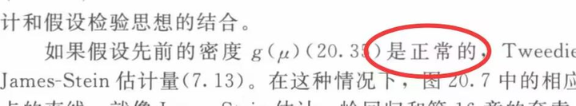
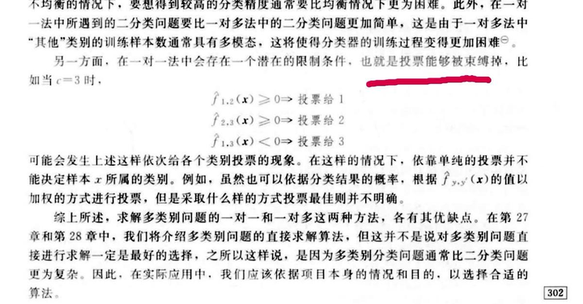
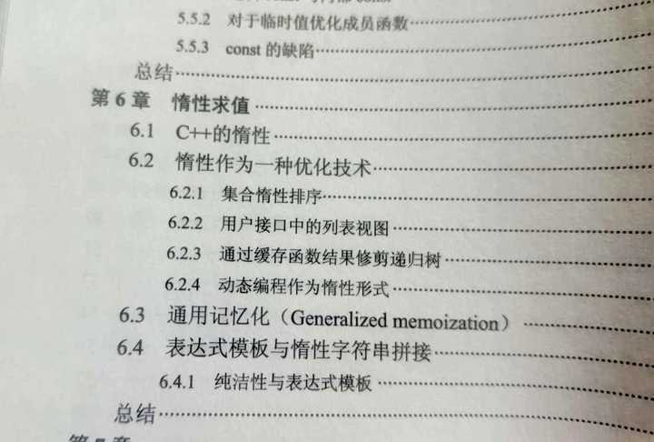

> @Author  : Lewis Tian (taseikyo@gmail.com)
>
> @Link    : github.com/taseikyo
>
> @Range   : 2024-09-22 - 2024-09-28

# Weekly #81

[readme](../README.md) | [previous](202409W3.md) | [next](202410W1.md)

本文总字数 1268 个，阅读时长约： 1 分 50 秒，统计数据来自：[算筹字数统计](http://www.xiqei.com/tools?p=tj)。


\**Photo by [Riccardo Carlo Rossi](https://unsplash.com/@daysofgrain) on [Unsplash](https://unsplash.com/photos/a-naked-woman-holding-a-bouquet-of-roses-eyO2CkilGt4)*

## Table of Contents

- [algorithm](#algorithm-)
	- 只出现一次的数字
	- 多数元素
- [review](#review-)
	- 有哪些好书败给了糟糕的翻译
- [tip](#tip-)
- [share](#share-)
	- 什么是爱

## algorithm [🔝](#weekly-81)

### 1. [只出现一次的数字](https://leetcode.cn/problems/single-number/description/)

#### 题目

给你一个 非空 整数数组 nums ，除了某个元素只出现一次以外，其余每个元素均出现两次。找出那个只出现了一次的元素。

你必须设计并实现线性时间复杂度的算法来解决此问题，且该算法只使用常量额外空间。

#### 解答

> [singlenumber.go](../code/leetcode/singlenumber.go)

```go
func singleNumber(nums []int) int {
    x := 0
    for _, val := range nums {
        x = x^val
    }

    return x
}
```

数据：0ms 100%; 7.67MB 52.95%

### 2. [多数元素](https://leetcode.cn/problems/majority-element/description)

#### 题目

给定一个大小为 n 的数组 nums ，返回其中的多数元素。多数元素是指在数组中出现次数 大于 `⌊ n/2 ⌋` 的元素。

你可以假设数组是非空的，并且给定的数组总是存在多数元素。

进阶：尝试设计时间复杂度为 O(n)、空间复杂度为 O(1) 的算法解决此问题。

#### 解答

这里有个技巧在这里：多数元素必定是比其他元素多的，遍历一次对比前后元素，只要不相同则相互消去，剩下的就是多数元素。

> [majorityelement.go](../code/leetcode/majorityelement.go)

```go
func majorityElement(nums []int) int {
    res, count := 0, 0
    for _, num := range nums {
        if count == 0 {
            res = num
        }
        if res == num {
            count++
        } else {
            count--
        }
    }

    return res
}
```

数据：0ms 100%; 8.06MB 26.82%

## review [🔝](#weekly-81)

### 1. [有哪些好书败给了糟糕的翻译](https://www.zhihu.com/question/36278156/answer/3345268462)

没见过“正态（normal）分布”。



《被束缚掉》（tied 有束缚和平局的意思，原文指的是平局）：



“惰性作为一种优化技术”、“动态编程作为惰性形式”，一股子机翻味……（而且“动态编程”应该是“动态规划（Dynamic Programming）”。）



> 有点难绷，还是要学好英语，对于专业书籍还是看原版吧

## tip [🔝](#weekly-81)

## share [🔝](#weekly-81)

### 1. [什么是爱](https://www.zhihu.com/question/640807704/answer/3485600059)

来自知乎的一个回答，其中只有一句话，两张截图：

> 晚上约了几个好友小酌，临近尾声时收到两条消息：


[readme](../README.md) | [previous](202409W3.md) | [next](202410W1.md)
