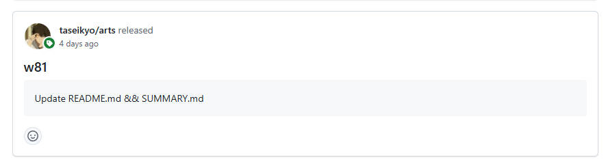

> @Author  : Lewis Tian (taseikyo@gmail.com)
>
> @Link    : github.com/taseikyo
>
> @Range   : 2024-09-29 - 2024-10-05

# Weekly #82

[readme](../README.md) | [previous](202409W4.md) | [next](202410W2.md)

本文总字数 4445 个，阅读时长约： 5 分 10 秒，统计数据来自：[算筹字数统计](http://www.xiqei.com/tools?p=tj)。


\**Photo by [Annie Spratt](https://unsplash.com/@anniespratt) on [Unsplash](https://unsplash.com/photos/a-group-of-people-watching-a-horse-race-p3zfHx0VD9M)*

## Table of Contents

- [algorithm](#algorithm-)
- [review](#review-)
- [tip](#tip-)
	- 解释 shell 命令
	- 在 GitHub Action 中获取 tag 的信息
	- 使用 Youtube-dl+aria2+ffmpeg 实现自动下载 YouTube 的剧集
- [share](#share-)
	- 当收藏的博客变成 404，我们失去了什么？

## algorithm [🔝](#weekly-82)

## review [🔝](#weekly-82)

## tip [🔝](#weekly-82)

### 1. [解释 shell 命令](https://explainshell.com/)

- https://github.com/idank/explainshell

这是个可以解释 shell 命令的网站，上面也贴了它的 GitHub 链接，还挺只管的，比如：


### 2. [在 GitHub Action 中获取 tag 的信息](https://github.com/orgs/community/discussions/27155)

Q：

> I want to capture the github tag message in Github Actions.
>
> If user pushes tag with some message e.g.
>
> git tag -a 1.0.0 -m "Test Message"
>
> than, I would like to capture that message(“Test Message”) inside the github actions.

A：

```Bash
git fetch --depth=1 origin +refs/tags/*:refs/tags/*
git tag -l --format='%(contents:subject)' 1.0.0
```

注意，一定要执行第一行命令，否则会出现问题：



### 3. [使用Youtube-dl+aria2+ffmpeg实现自动下载YouTube的剧集](https://www.dwhd.org/20181208_022522_6131.html)

首先下载 Youtube-dl、aria2、ffmpeg 的 Windows 版本

- Youtube-dl : https://rg3.github.io/youtube-dl/download.html
- Aria2 : https://github.com/aria2/aria2/releases
- Ffmpeg : https://www.ffmpeg.org/download.html#build-windows

其次、安装&配置环境变量

验证三个软件是否成功安装：


下载测试：

```Bash
–external-downloader aria2c #调用外部下载工具aria2c
–external-downloader-args #外部下载工具指定参数
-x 16 #表示进程数，aria2最高只能16进程
-k 1M #指定块的大小
```

将所需下载的视频网址一行一个黏贴到 test.txt 文件中，保存关闭。

使用下面代码就可以实现列表批量下载了：

```Bash
youtube-dl -ci --batch-file=test.txt --external-downloader aria2c --external-downloader-args "-x 16 -k 1M"
```

指定下载的路径

如果你已经试过前面的命令了，那就会发现：所下载的视频对应的文件都被放在执行该下载命令的路径下，要修改下载路径很简单：使用参数 `-o` 。

```Bash
youtube-dl -o "绝对路径\%(title)s.%(ext)s"
```

其中，前半部分的绝对路径是你指定的，后半部分最好是固定的，使用原来的标题作为文件名以及使用原扩展名。
 
比如把之前的 4K 30 帧的 mp4 视频下载到 `H:\youtube_videos` 内，那么命令就是这样：`youtube-dl -o "H:\youtube_videos\%(title)s.%(ext)s" -f 266+140 https://www.youtube.com/watch?v=1La4QzGeaaQ`
 
137是1080p 30fps、299是1080p 60fps

并且这两个都是只有视频画面的 mp4 文件，它们都是不带音频的视频。

- 266是2160p 30fps不带音频的mp4视频
- 315是2160p 60fps不带音频的webm视频
- 138是4320p 30fps不带音频的mp4视频
- 140是128k 44100Hz的m4a音频

```Bash
PS D:\Download-Test> youtube-dl -F https://www.youtube.com/watch?v=WcCbUbS3W7A
[youtube] WcCbUbS3W7A: Downloading webpage
[youtube] WcCbUbS3W7A: Downloading video info webpage
[info] Available formats for WcCbUbS3W7A:
format code  extension  resolution note
249          webm       audio only DASH audio   68k , opus @ 50k, 14.97MiB
250          webm       audio only DASH audio   89k , opus @ 70k, 18.73MiB
140          m4a        audio only DASH audio  130k , m4a_dash container, mp4a.40.2@128k, 41.22MiB
171          webm       audio only DASH audio  152k , vorbis@128k, 27.43MiB
251          webm       audio only DASH audio  157k , opus @160k, 33.82MiB
278          webm       256x142    144p  110k , webm container, vp9, 25fps, video only, 24.50MiB
160          mp4        256x142    144p  145k , avc1.4d400c, 25fps, video only, 13.04MiB
242          webm       426x238    240p  227k , vp9, 25fps, video only, 31.68MiB
133          mp4        426x238    240p  341k , avc1.4d4015, 25fps, video only, 31.14MiB
243          webm       640x358    360p  427k , vp9, 25fps, video only, 57.05MiB
134          mp4        640x358    360p  668k , avc1.4d401e, 25fps, video only, 62.66MiB
244          webm       854x476    480p  787k , vp9, 25fps, video only, 96.93MiB
135          mp4        854x476    480p 1164k , avc1.4d401e, 25fps, video only, 100.36MiB
247          webm       1280x714   720p 1531k , vp9, 25fps, video only, 195.56MiB
136          mp4        1280x714   720p 2255k , avc1.4d401f, 25fps, video only, 157.24MiB
248          webm       1920x1072  1080p 2680k , vp9, 25fps, video only, 344.00MiB
137          mp4        1920x1072  1080p 3471k , avc1.640028, 25fps, video only, 249.12MiB
17           3gp        176x144    small , mp4v.20.3, mp4a.40.2@ 24k, 23.02MiB
36           3gp        320x178    small , mp4v.20.3, mp4a.40.2, 66.59MiB
18           mp4        640x356    medium , avc1.42001E, mp4a.40.2@ 96k, 133.64MiB
43           webm       640x360    medium , vp8.0, vorbis@128k, 152.63MiB
22           mp4        1280x714   hd720 , avc1.64001F, mp4a.40.2@192k (best)

PS D:\Download-Test> youtube-dl --external-downloader aria2c --external-downloader-args "-x 16" -f 'bestvideo[ext=mp4]+bestaudio[ext=m4a]/bestvideo+bestaudio' 'https://www.youtube.com/watch?v=WcCbUbS3W7A'
[youtube] WcCbUbS3W7A: Downloading webpage
[youtube] WcCbUbS3W7A: Downloading video info webpage
[download] Destination: 危机四伏 10 _ 华语谍战佳作“潜伏”2.0版-WcCbUbS3W7A.f137.mp4
PS D:\Download-Test>
```

> `-f 'bestvideo[ext=mp4]+bestaudio[ext=m4a]/bestvideo+bestaudio'` 这个选项似乎是在指定最高画质的视频和最高音质的音频
>
> 但是作者没解释，盲猜是这样

## share [🔝](#weekly-82)

### 1. 当收藏的博客变成 404，我们失去了什么？

几年前，我曾收藏了一些技术博客，想着日后回顾时能再次品味。然而最近点开它们却只看到冷冰冰的“404 Not Found”或者变成广告的网页。

那些曾点亮思路的文字，已随时间消散在互联网的汪洋中。  

我们习惯性地认为，网络是永恒的，信息触手可及。然而，博客关闭、域名失效、服务器停运……一篇篇精心撰写的文章，在某天悄然蒸发。它们曾是无数技术人的心血结晶，而今却只留下记忆中的残影。 

这让我开始反思，我们该如何对抗数字遗忘症？是时候学会更主动地归档、备份，甚至将珍贵的内容转化为自己的知识体系，否则，下一个消失的页面，或许就是我们曾视若珍宝的灵感源泉。

[readme](../README.md) | [previous](202409W4.md) | [next](202410W2.md)
