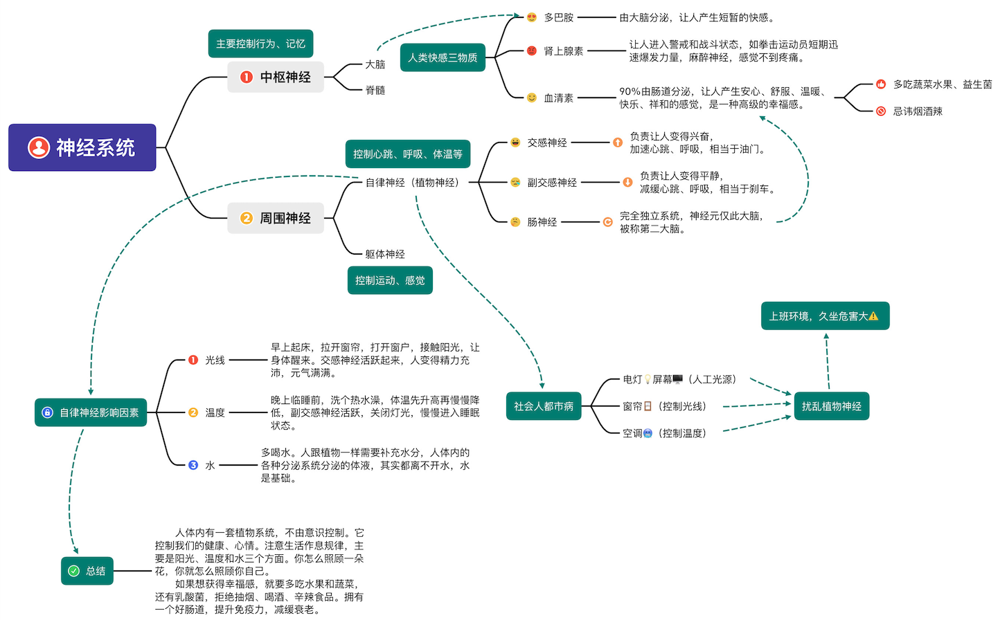

> @Author  : Lewis Tian (taseikyo@gmail.com)
>
> @Link    : github.com/taseikyo
>
> @Range   : 2024-10-05 - 2024-10-12

# Weekly #83

[readme](../README.md) | [previous](202410W1.md) | [next](202410W3.md)


\**Photo by [Mickael Gresset](https://unsplash.com/@mickael?utm_content=creditCopyText&utm_medium=referral&utm_source=unsplash) on [Unsplash](https://unsplash.com/photos/topless-woman-lying-on-ground-while-holding-white-book-rg29IYzdPlo)*

## Table of Contents

- [algorithm](#algorithm-)
- [review](#review-)
	- 消除疲劳、失眠、焦虑的根本方法 | 附自律神经思维导图
- [tip](#tip-)
	- linux 内核镜像网站
	- 个人自用 rsync 文件同步常用命令
- [share](#share-)
	- 最好的关系是相互滋养

## algorithm [🔝](#weekly-83)

## review [🔝](#weekly-83)

### 1. [消除疲劳、失眠、焦虑的根本方法 | 附自律神经思维导图](https://www.jiemin.com/archives/1598.html)

人的神经系统主要由两部分组成：中枢神经与周围神经。中枢神经由脑子和脊髓组成，主要控制人的行为、记忆。而周围神经由自律神经（也叫植物神经，至于为什么叫植物神经，读完后面就懂了）和躯体神经组成。

自律神经控制心跳、呼吸、血液循环、体温、消化、免疫、分泌、新陈代谢等系统，也就是说它是一个控制“状态”的一个神经，都不是自主意识能控制的。而躯体神经则是控制运动、感觉。

自律神经又分为三个部分：

1. 交感神经
2. 副交感神经
3. 肠神经

交感神经负责让人变得兴奋，加速心跳、呼吸，相当于油门；副交感神经负责让人变得平静，减缓心跳、呼吸，相当于刹车。它们之间的关系，并不是相对的，而是相辅相成的，就好像开车时候的油门和闸。抑郁症从神经方面来讲，就是交感神经和副交感神经都出了问题，有无尽的疲惫，通过休息也没办法恢复，就是身体和精神上的累（相当于汽车一边踩油门，一边同时刹车），这种状态是自身无法控制的。

最后一个是非常重要的神经——肠神经。我们以前一直以为肠子是人体中非常普通的器官，只用来消化，但现在发现并不是这样。

它是一个完全独立的系统，不受正副交感神经控制，而且肠道内的神经元非常多，超过脊髓，仅次于脑子（所以肠子又被称为“第二大脑”）。

人类快感有三种物质：

- 多巴胺：由大脑分泌，让人产生短暂的快感。
- 血清素：90％由肠道分泌，让人产生安心、舒服、温暖、快乐、祥和的感觉，是一种高级的幸福感。（血清素又叫5-羟色胺，会影响人的胃口、内驱力、食欲、睡眠、性以及情绪）。
- 肾上腺素：让人进入警戒和战斗状态，如拳击运动员短期迅速爆发力量，麻醉神经，感觉不到疼痛。

所以我们90%的幸福是由肠道控制的，多吃蔬菜水果与益生菌（酸奶、纳豆等食物）对肠道有好处；肠道忌讳三样东西：酒、烟、辣。

自律神经是完全可以自愈的（不需要去医院），主要靠自我调节。因此强调生活作息规律，生活环境的重要性。该睡觉就睡觉，该起床就起床，这是两个很重要的时点。白天交感神经活跃，有利于精力充沛完成工作；晚上副交感神经活跃，有利于睡眠。两者交替协同，日出而作日入而息。

既然自律神经是不受自主意识控制的，那么它又是如何知道到点睡觉、起床的呢？

主要有3个因素：光线、温度、水（因此自律神经也叫植物神经）。

自律神经出的问题，往往是社会人的都市病。人类发明的电灯、屏幕（人工光源）、窗帘（控制光线）、空调（控制温度），这不就是我们上班所处的环境吗（久坐危害大）？！晚上下了班，该睡觉的时候还去聚会活动，该起床时候还在赖床...正确的姿势是：

- 早上起床，拉开窗帘，打开窗户，接触阳光，让身体醒来。交感神经活跃起来，人变得精力充沛，元气满满。
- 晚上临睡前，洗个热水澡，体温先升高再慢慢降低，副交感神经活跃，关闭灯光，慢慢进入睡眠状态。
- 多喝水。人跟植物一样需要补充水分，人体内的各种分泌系统分泌的体液，其实都离不开水，水是基础。

**总结：人体内有一套植物系统，不由我们控制。它控制我们的健康、心情。注意生活作息规律，主要是阳光、温度和水三个方面。你怎么照顾一朵花，你就怎么照顾你自己。如果想获得幸福感，就要多吃水果和蔬菜，还有乳酸菌，拒绝抽烟、喝酒、辛辣食品。拥有一个好肠道，提升免疫力，减缓衰老。**



## tip [🔝](#weekly-83)

### 1. [linux 内核镜像网站](https://renwole.com/)

大概是读研的时候收藏的网站，用于下载不同发行版、不同内核版本的镜像：


点进 Ubuntu：


### 2. [个人自用 rsync 文件同步常用命令](https://blog.saop.cc/p/30664)

```Bash
# 将本地 test 文件夹同步传输到远程终端上
rsync -ravzP ~/test i@i.cc:/home/i/

# 将远程 test 文件夹同步传输到本地终端上
rsync -ravzP i@i.cc:/home/i/test ~/
```

## share [🔝](#weekly-83)

### 1. [最好的关系是相互滋养](https://www.jiemin.com/archives/1752.html)

> 有位作家说：“最好的关系是人与人之间能够达成相互滋养，如此，那些非常重要的关系，才能陪伴你走很久。”
>
> 生活中，有的人身处泥沼，也能把日子过得有声有色；有的人鲜花着锦，仍觉得生活无滋无味。
>
> 和言语暖的人相处，每天都有好心情；
> 跟情绪稳定的人同行，生活会有松弛感；
> 跟心态好的人交往，会变得积极乐观。
> 被人滋养，是最大的幸福；滋养他人，是顶级的修养！
>
> 草在结它的种子，风在摇它的叶子。我们站着,不说话，就十分美好。在漫长的岁月中，最舒服的关系莫过于：相处不累，久处不厌。
>
> 清醒，是对这个世界的认知和理解，也是让自己拨开迷雾，更好地面对自己内心的方式，不被种种幻觉和内耗所困扰。
>
> 每个人都有两次生命。
>
> 第一次是活给别人看的，第二次是活给自己的。
> 第二次生命，常常从四十岁开始。
>
> 人生有三次觉醒，分别是：见自己，见天地，见众生。见自己：认识局限，开始反省。见天地：了解大道，顺应自然。见众生：理解他人，心存善念。

[readme](../README.md) | [previous](202410W1.md) | [next](202410W3.md)
