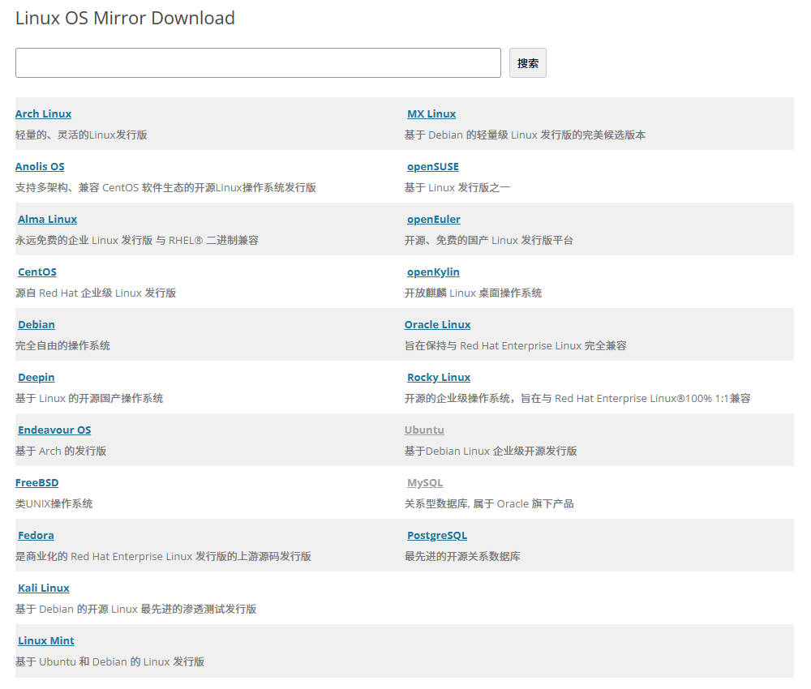
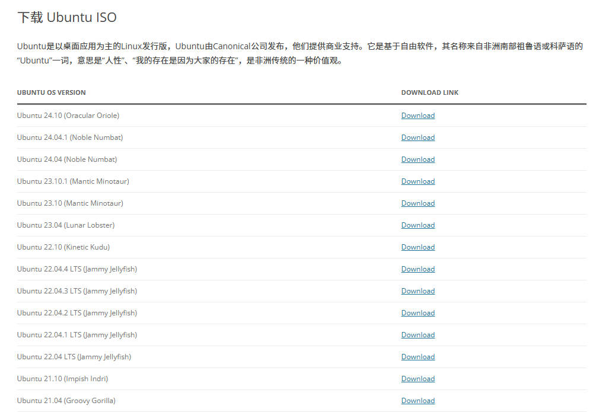

> @Author  : Lewis Tian (taseikyo@gmail.com)
>
> @Link    : github.com/taseikyo
>
> @Range   : 2024-10-05 - 2024-10-12

# Weekly #83

[readme](../README.md) | [previous](202410W1.md) | [next](202410W3.md)


\**Photo by [Mickael Gresset](https://unsplash.com/@mickael?utm_content=creditCopyText&utm_medium=referral&utm_source=unsplash) on [Unsplash](https://unsplash.com/photos/topless-woman-lying-on-ground-while-holding-white-book-rg29IYzdPlo)*

## Table of Contents

- [algorithm](#algorithm-)
- [review](#review-)
- [tip](#tip-)
	- linux 内核镜像网站
	- 个人自用 rsync 文件同步常用命令
- [share](#share-)

## algorithm [🔝](#weekly-83)

## review [🔝](#weekly-83)

## tip [🔝](#weekly-83)

### 1. [linux 内核镜像网站](https://renwole.com/)

大概是读研的时候收藏的网站，用于下载不同发行版、不同内核版本的镜像：



点进 Ubuntu：



### 2. [个人自用 rsync 文件同步常用命令](https://blog.saop.cc/p/30664)

```Bash
# 将本地 test 文件夹同步传输到远程终端上
rsync -ravzP ~/test i@i.cc:/home/i/

# 将远程 test 文件夹同步传输到本地终端上
rsync -ravzP i@i.cc:/home/i/test ~/
```


## share [🔝](#weekly-83)

[readme](../README.md) | [previous](202410W1.md) | [next](202410W3.md)
