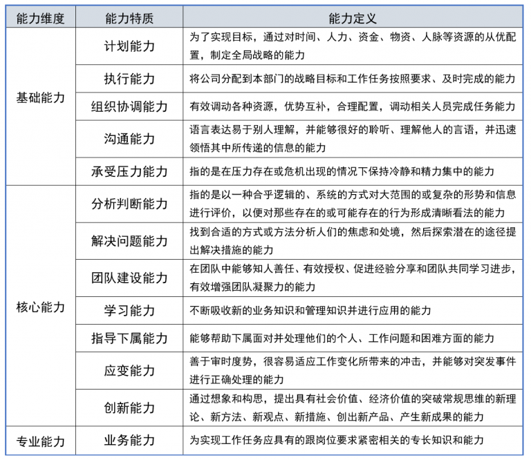

> @Author  : Lewis Tian (taseikyo@gmail.com)
>
> @Link    : github.com/taseikyo
>
> @Range   : 2024-10-20 - 2024-10-26

# Weekly #85

[readme](../README.md) | [previous](202410W3.md) | [next](202410W5.md)


\**Photo by [Riccardo Manieri](https://unsplash.com/@manieri_r) on [Unsplash](https://unsplash.com/photos/a-wooden-object-floating-in-a-pool-of-water-blU1iTkUP0Y)*

## Table of Contents

- [algorithm](#algorithm-)
	- 数组形式的整数加法
- [review](#review-)
	- 别把班组长不当班组长，那还要生产经理干什么？Team leader
- [tip](#tip-)
	- 生产制造企业高层领导生产现场巡查技巧
- [share](#share-)
	- 勇敢地去追随自己的心灵和直觉

## algorithm [🔝](#weekly-85)

### 1. [数组形式的整数加法](https://leetcode.cn/problems/add-to-array-form-of-integer/description/)

#### 题目

整数的 数组形式  num 是按照从左到右的顺序表示其数字的数组。

例如，对于 num = 1321 ，数组形式是 [1,3,2,1] 。

给定 num ，整数的 数组形式 ，和整数 k ，返回 整数 num + k 的 数组形式 。

提示：

- 1 <= num.length <= 104
- 0 <= num[i] <= 9
- num 不包含任何前导零，除了零本身
- 1 <= k <= 10^4

#### 解法

最直观的解法是转为整数，然后累加，最后转化为数组，然而有测试用例比较有趣，直接加会溢出：

> [add-to-array-form-of-integer.go](../code/leetcode/add-to-array-form-of-integer.go)

```go
func addToArrayForm(num []int, k int) []int {
    sum := 0
    for _, val := range num {
        sum = sum*10+val
    }
    sum += k

    fmt.Println(sum)
    res := make([]int, 0)
    for sum > 0 {
        res = append([]int{sum%10}, res...)
        sum /= 10
    }

    return res
}
```

```
num=[1,2,6,3,0,7,1,7,1,9,7,5,6,6,4,4,0,0,6,3]
k=516

输出：516
```

果然还是得按位累加：

```go
func addToArrayForm(num []int, k int) []int {
    carry := 0
    idx := len(num) - 1
    for k > 0 && idx >= 0 {
        carry = carry + k%10 + num[idx]
        num[idx] = carry % 10
        carry = carry / 10
        k = k/10
        idx--
    }
    for k > 0 {
        carry = carry + k%10
        num = append([]int{carry % 10}, num...)
        carry = carry / 10
        k = k/10
    }
    for idx >= 0 {
        carry = carry + num[idx]
        num[idx] = carry % 10
        carry = carry / 10
        idx--
    }
    if carry > 0 {
        num = append([]int{1}, num...)
    }


    return num
}
```

数据：0ms 100%; 8.29MB 93.75%

## review [🔝](#weekly-85)

### 1. [别把班组长不当班组长，那还要生产经理干什么？Team leader](https://www.liulihu.com/archives/513.html)

最近看了一个班组长的能力模型（见文末），对班组长提出了基础能力、核心能力、专业能力三大块，并进行了明确详细的定义和说明。看完以后都快哭了，如果生产班组长都能够达到这样的能力（60%以上也了不得），那还要车间主任生产经理干什么？所以，请别把班组长不当班组长。

班组长面临的困境有哪些？谁真正的去关注和分析过这样的境界：

1. 班组长拿着比基层员工多不了多少的薪水，甚至比一些基层员工还要少，哪里来的什么动力能让他达到这样的能力要求？
2. 多数班组长不仅要做班组管理工作，还有自身的岗位生产工作要做，也就是相当一部分班组长并不是脱产管理者，做多了管理工作，肯定影响岗位工作并影响收入；
3. 公司年终车间主任生产经理基本都会有老板的红包，班组长基本上没有几个人可以拿到红包，也就是说，班组长在公司的地位令人尴尬；
4. 多数班组长读书不多，要掌握这么多的各种能力对他们来说是老虎吃天；
5. 外出培训和学习的机会对班组长来说少之又少，又有什么理由要求班组长掌握这么多的技能？

班组管理的重要性不言而喻，是生产制造管理中的核心，也决定了生产系统的运作效率。

一个能够达到所设计的班组长能力模型60%合格的班组长如果就是一头狼，而车间主任或生产经理是一只老虎的话，那么，不需要多的，三只狼就能够胜过一只老虎。如何解决班组长面临的这些问题核心的关键就在于公司的中高层，特别是老板、总经理等决策层必须扭转观念，必须从薪资待遇、培训学习机会、关注关心等方面倾向于班组长。

下面的这个图形不看也罢，就是那个把班组长设计成比生产经理还厉害的能力模型，希望各个公司的中高层领导，包括人力资源HR部门，不要再对班组长提出不切实际的要求，而是从根本上立体化解决问题。



## tip [🔝](#weekly-85)

### 1. [生产制造企业高层领导生产现场巡查技巧](https://www.liulihu.com/archives/688.html)

> 作为公司生产管理的高层领导，生产现场的巡查是必须的工作内容之一，一些管理者每天要花费很长的时间（2-3个小时甚至更多）去做这一项其意义与价值有待商榷的工作，以下方法为建议方法，可以提高工作效率（本文为刘立户老师原创内容）：

- 频率：每周2-3次，不宜再多；
- 方式：不再单独去巡查，而是带领副职或者行政部等1-2个人一起去巡查
- 目标：保证每个车间（作业区、工段等）每天至少解决1个基础管理方面的问题（污染源、死角源、故障源、浪费源、危险源、缺陷源等等）
- 要求：
	- 到达现场后发现问题，叫来相关中层管理者，确认问题提后落实解决问题的截止时间（Deadline）、程度、数量、质量等；
	- 随行人员拍摄问题现状照片，记录承诺的解决时间（1-3天）、地点、人员、资源等信息；
	- 如果问题解决需要其他部门相关人员配合，现场将相关人员召集，商议解决结果，并要求做出承诺；
	- 如果问题解决需要资金等资源，现场落实资源，商议解决结果，并要求做出承诺。
- 数量：根据一个车间（作业区等）问题的工作量，落实1-3个确保可以解决的问题，目标为确保一天有效解决一个问题。不可过多，否则影响执行效果，同时要考虑难易结合等。落实达到相应的数量，就不再继续要求做出承诺。同时利用巡查的机会，对问题存在的现状、重要程度、难易程度等进行分析，要求随行人员作好记录，作为后期解决的备选问题。
- 整理：全部车间（作业区）巡查完毕后，要求随行人员对今天已经做出承诺的问题，根据车间进行归类整理成文档，签字后发送相关车间作为依据。
- 跟踪：2天或3天后再次现场巡查时，第一项任务就是落实上次巡查时的完成情况，如果完成情况理想，随行人员同一角度拍摄完成后的照片，并做好相应的记录，进而继续按照每天必须解决1个问题的节奏继续寻找问题；如果完成情况不理想，需要严厉批评（考核）对应的中层管理者，要求立竿见影，提高执行力。

> 巡查完毕后，随行人员需要对已经完成或未完成的工作进行汇总，要求图文并茂，数据完整，并每月编制对应的PPT报告备查或向上级汇报。

- 循环：按照以上的4-7的步骤，循环开展工作，持之以恒。
- 效果：保证每天至少解决1个小问题，不求多，但求有结果，并持之以恒，节省出来的时间另当别论。

## share [🔝](#weekly-85)

### 1. [勇敢地去追随自己的心灵和直觉](https://www.jiemin.com/archives/1335.html)

你的时间有限，所以不要为别人而活。不要被教条所限，不要活在别人的观念里。不要让别人的意见左右自己内心的声音。最重要的是，勇敢地去追随自己的心灵和直觉，只有自己的心灵和直觉才知道你自己的真实想法，其他一切都是次要。

[readme](../README.md) | [previous](202410W3.md) | [next](202410W5.md)
