> @Author  : Lewis Tian (taseikyo@gmail.com)
>
> @Link    : github.com/taseikyo
>
> @Range   : 2024-11-03 - 2024-11-09

# Weekly #86

[readme](../README.md) | [previous](202410W4.md) | [next](202411W1.md)

\**Photo by [Geranimo](https://unsplash.com/@geraninmo) on [Unsplash](https://unsplash.com/photos/brown-squirrel-on-black-background-bKhETeDV1WM)*

## Table of Contents

- [algorithm](#algorithm-)
- [review](#review-)
	- 5 分钟搞懂布隆过滤器，亿级数据过滤算法你值得拥有！
	- 一篇吃透布隆过滤器（Bloom Filter）及其使用场景
	- 布谷鸟过滤器（Cuckoo Filter）
	- 布谷鸟过滤器
- [tip](#tip-)
- [share](#share-)
	- 如果不能真实的面对自己，存在将失去意义。

## algorithm [🔝](#weekly-86)

## review [🔝](#weekly-86)

### 1. [5 分钟搞懂布隆过滤器，亿级数据过滤算法你值得拥有！](https://juejin.cn/post/6844904007790673933)

布隆过滤器（Bloom Filter）是 1970 年由布隆提出的。它实际上是一个很长的二进制向量和一系列随机映射函数。布隆过滤器可以用于检索一个元素是否在一个集合中。 **它的优点是空间效率和查询时间都比一般的算法要好的多，缺点是有一定的误识别率和删除困难。**

#### 一、布隆过滤器简介

布隆过滤器可以检查值是 “可能在集合中” 还是 “绝对不在集合中”。“可能” 表示有一定的概率，也就是说可能存在一定为误判率。

布隆过滤器（Bloom Filter）本质上是由长度为 m 的位向量或位列表（仅包含 0 或 1 位值的列表）组成，最初所有的值均设置为 0，如下图所示。

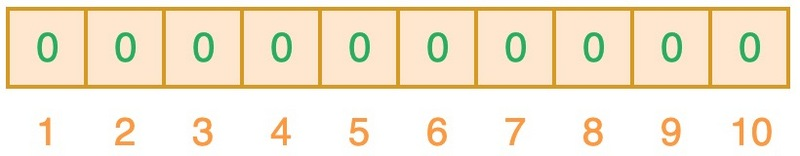

为了将数据项添加到布隆过滤器中，我们会提供 K 个不同的哈希函数，并将结果位置上对应位的值置为 “1”。在前面所提到的哈希表中，我们使用的是单个哈希函数，因此只能输出单个索引值。而对于布隆过滤器来说，我们将使用多个哈希函数，这将会产生多个索引值。

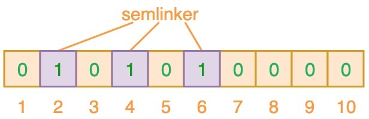

如上图所示，当输入 “semlinker” 时，预设的 3 个哈希函数将输出 2、4、6，我们把相应位置 1。假设另一个输入 ”kakuqo“，哈希函数输出 3、4 和 7。你可能已经注意到，索引位 4 已经被先前的 “semlinker” 标记了。此时，我们已经使用 “semlinker” 和 ”kakuqo“ 两个输入值，填充了位向量。当前位向量的标记状态为：

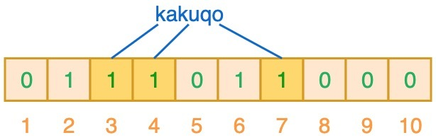

当对值进行搜索时，与哈希表类似，我们将使用 3 个哈希函数对 ”搜索的值“ 进行哈希运算，并查看其生成的索引值。假设，当我们搜索 ”fullstack“ 时，3 个哈希函数输出的 3 个索引值分别是 2、3 和 7：

从上图可以看出，相应的索引位都被置为 1，这意味着我们可以说 ”fullstack“ 可能已经插入到集合中。事实上这是误报的情形，产生的原因是由于哈希碰撞导致的巧合而将不同的元素存储在相同的比特位上。幸运的是，布隆过滤器有一个可预测的误判率（FPP）：

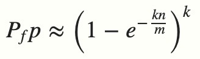

- n 是已经添加元素的数量；
- k 哈希的次数；
- m 布隆过滤器的长度（如比特数组的大小）；

极端情况下，当布隆过滤器没有空闲空间时（满），每一次查询都会返回 true 。这也就意味着 m 的选择取决于期望预计添加元素的数量 n ，并且 m 需要远远大于 n 。

实际情况中，布隆过滤器的长度 m 可以根据给定的误判率（FFP）的和期望添加的元素个数 n 的通过如下公式计算：

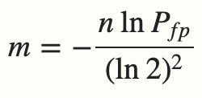

**当我们搜索一个值的时候，若该值经过 K 个哈希函数运算后的任何一个索引位为 ”0“，那么该值肯定不在集合中。但如果所有哈希索引值均为 ”1“，则只能说该搜索的值可能存在集合中。**

#### 二、布隆过滤器应用

布隆过滤器常见的应用场景如下：

- 网页爬虫对 URL 去重，避免爬取相同的 URL 地址；
- 反垃圾邮件，从数十亿个垃圾邮件列表中判断某邮箱是否垃圾邮箱；
- Google Chrome 使用布隆过滤器识别恶意 URL；
- Medium 使用布隆过滤器避免推荐给用户已经读过的文章；
- Google BigTable，Apache HBbase 和 Apache Cassandra 使用布隆过滤器减少对不存在的行和列的查找。

除了上述的应用场景之外，布隆过滤器还有一个应用场景就是 **解决缓存穿透** 的问题。

所谓的缓存穿透就是服务调用方每次都是查询不在缓存中的数据，这样每次服务调用都会到数据库中进行查询，如果这类请求比较多的话，就会导致数据库压力增大，这样缓存就失去了意义。

利用布隆过滤器我们可以预先把数据查询的主键，比如用户 ID 或文章 ID 缓存到过滤器中。当根据 ID 进行数据查询的时候，我们先判断该 ID 是否存在，若存在的话，则进行下一步处理。若不存在的话，直接返回，这样就不会触发后续的数据库查询。需要注意的是缓存穿透不能完全解决，我们只能将其控制在一个可以容忍的范围内。

### 2. [一篇吃透布隆过滤器（Bloom Filter）及其使用场景](https://blog.csdn.net/weixin_64366370/article/details/130693987)

#### 3、布隆过滤器的使用场景

1、Redis 通过布隆过滤器防止缓存穿透

首先我们需要知道什么是缓存穿透，这里我们给出缓存穿透的定义。

> Redis 缓存穿透指访问一个缓存和数据库中都不存在的 key，由于这个 key 在缓存中不存在，则会到数据库中查询，数据库中也不存在该 key，无法将数据添加到缓存中，所以每次都会访问数据库导致数据库压力增大。

我们可以在访问 Redis 之前使用布隆过滤器来对请求的 key 进行过滤， 可以大大减少那些恶意攻击。当然，会存在一定误判率，但是使用布隆过滤器后，“不法分子” 肯定对我们服务器就没那么容易进行恶意攻击了。

2、RocketMQ 通过布隆过滤器防止消息重复消费

为了防止 RocketMQ 消息重复消费，我们发送消息时可以对每个消息设置唯一的 key，然后在消费者处利用布隆过滤器对消息的 key 检索，如果存在则说明消息已经消费过，不消费。不存在则进行消费，然后插入布隆过滤器。

当然，上面两个例子仅仅是举的例子，布隆过滤器能使用的地方很多，只要但凡涉及 “数据过滤” 均可以考虑使用 “布隆过滤器” 来实现。

#### 4、布隆过滤器优缺点

1、优点

- 时间复杂度低，增加和查询元素的时间复杂为 O(N)，（N 为哈希函数的个数，通常情况比较小）
- 保密性强，布隆过滤器不存储元素本身
- 存储空间小，如果允许存在一定的误判，布隆过滤器是非常节省空间的（相比其他数据结构如 Set、Map 集合）

2、缺点

- 有点一定的误判率，但是可以通过调整参数来降低
- 无法获取元素本身
- 很难删除元素

### 3. [布谷鸟过滤器（Cuckoo Filter）](https://www.cnblogs.com/zhaodongge/p/15067657.html)

#### 1 概述

在允许一定误判率的大数据量下的查找是否存在问题上可以使用布隆过滤器。布隆过滤器在工程应用方面已经比较成熟了， [上一篇文章中](https://www.cnblogs.com/zhaodongge/p/15017574.html) ，谈到了布隆过滤器的一些缺点，比如不支持删除操作、查询效率弱，因为多个随机哈希函数探测的是 bit 数组中多个不同的点，所以会导致低 CPU 缓存命中率。

针对此2014年的一篇文章 [《Cuckoo Filter：Better Than Bloom》](https://www.cs.cmu.edu/~dga/papers/cuckoo-conext2014.pdf) 基于布谷鸟哈希算法提出了布谷鸟过滤器，不过看文章的名字有点碰瓷的感觉了，这篇文章解决了布隆过滤器存在的问题。

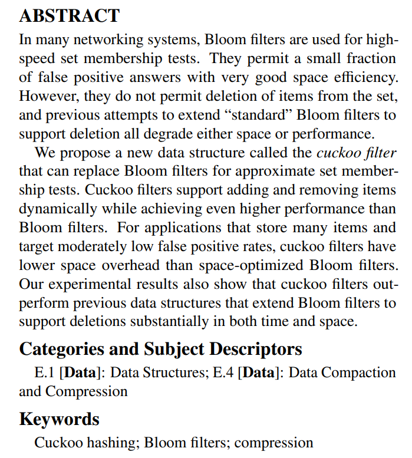

布谷鸟过滤器用更低的空间开销解决了布隆过滤器不能删除元素的问题，做到了更好的效果，具体的：

- 支持动态的添加和删除元素
- 提供了比传统布隆过滤器更高的查找性能，即使在接近满的情况下（比如空间利用率达到 95% 的时候）
- 比起商过滤器它更容易实现
- 如果要求误判率低于 3%，它比布隆过滤器有更低的空间开销

#### 2 布谷鸟哈希

布谷鸟哈希是 2001 年由 Rasmus Pagh 和 Flemming Friche Rodler 提出。本质上来说它为解决哈希冲突提供了另一种策略，利用较少计算换取了较大空间。它具有占用空间小、查询迅速等特性。名称源于采取了一种和布谷鸟一样的养娃方法

> 布谷鸟交配后，雌性布谷鸟就准备产蛋了，但它却不会自己筑巢。它会来到像知更鸟、刺嘴莺等那些比它小的鸟类的巢中，移走原来的那窝蛋中的一个，用自己的蛋来取而代之。相对于它的体形来说，它的蛋是偏小的，而且蛋上的斑纹同它混入的其他鸟的蛋也非常相似，所以不易被分辨出来。如果不是这样，它的蛋肯定会被扔出去。

是一种鸠占鹊巢的策略，最原始的布谷鸟哈希方法是使用两个哈希函数对一个 key 进行哈希，得到桶中的两个位置，此时

- 如果两个位置都为为空则将 key 随机存入其中一个位置
- 如果只有一个位置为空则存入为空的位置
- 如果都不为空，则随机踢出一个元素，踢出的元素再重新计算哈希找到相应的位置

当然假如存在绝对的空间不足，那老是踢出也不是办法，所以一般会设置一个踢出阈值，如果在某次插入行为过程中连续踢出超过阈值，则进行扩容。

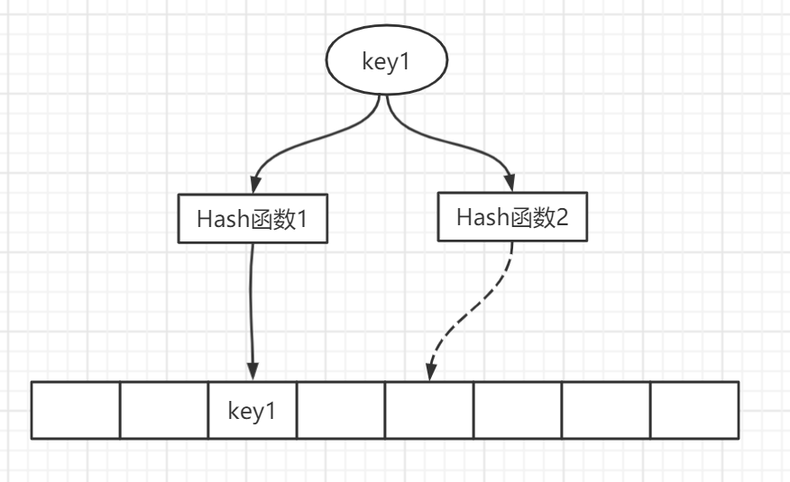

#### 3 布谷鸟过滤器

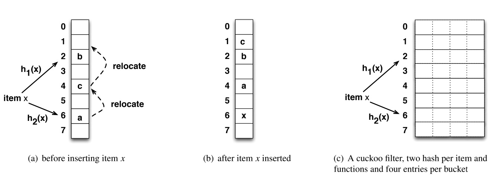

上图（a）(b) 展示了一个基本的布谷鸟哈希表的插入操作，是由一个桶数组组成，每个插入项都有由散列函数 `h1(x)` 和 	`h2(x)` 确定的两个候选桶，具体操作上文中已经描述，此处不再赘述。

而基本的布谷鸟过滤器也是由两个或者多个哈希函数构成，布谷鸟过滤器的布谷鸟哈希表的基本单位称为条目（entry）。 每个条目存储一个指纹（fingerprint），指纹指的是使用一个哈希函数生成的 n 位比特位，n 的具体大小由所能接受的误判率来设置，论文中的例子使用的是 8bits 的指纹大小。

哈希表由一个桶数组组成，其中一个桶可以有多个条目（比如上述图 c 中有四个条目）。而每个桶中有四个指纹位置，意味着一次哈希计算后布谷鸟有四个 “巢 “可用，而且四个巢是连续位置，可以更好的利用 cpu 高速缓存。也就是说每个桶的大小是 `4*8bits`。

3.1 插入

布谷鸟过滤器的插入是重点，与朴素的布谷鸟哈希不同，布谷鸟过滤器采取了两个并不独立的哈希函数，具体的：

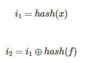

i1 i2 即计算出来两个桶的索引，其中第一个桶的索引是通过某个哈希函数计算出来，第二个是使用第一个索引和指纹的哈希做了一个异或操作，进行异或操作的好处是，因为异或操作的特性：同为 0 不同为 1，且 0 和任何数异或是这个数的本身。那么  i1 也可以通过 i2 和指纹异或来计算。 换句话说，在桶中迁走一个键，我们直接用当前桶的索引 i 和存储在桶中的指纹计算它的备用桶。

具体的指纹是通过哈希函数取一定量的比特位

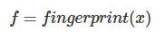

为什么不直接用索引 1 和指纹做异或操作，关于这个问题文中给了解释，因为指纹一般只是 key 映射出来的少量 bit 位置，那么假如不进行哈希操作，当指纹的比特位与整个桶数组相比很小时，那么备用位置使用 “i⊕指纹”，将被放置到离桶 i1 很近的位置，比如使用八位的指纹大小，最多只能改变 i1 的低八位，所以也就是两个候选通的位置最多相差 256，不利于均匀分配。

3.2 查找

布谷鸟过滤器的查找过程很简单，给定一个项 x，算法首先根据上述插入公式，计算 x 的指纹和两个候选桶。然后读取这两个桶：如果两个桶中的任何现有指纹匹配，则布谷鸟过滤器返回 true，否则过滤器返回 false。此时，只要不发生桶溢出，就可以确保没有假阴性。

3.3 删除

标准布隆过滤器不能删除，因此删除单个项需要重建整个过滤器，而计数布隆过滤器需要更多的空间。布谷鸟过滤器就像计数布隆过滤器，可以通过从哈希表删除相应的指纹删除插入的项，其他具有类似删除过程的过滤器比布谷鸟过滤器更复杂。

具体删除的过程也很简单，检查给定项的两个候选桶；如果任何桶中的指纹匹配，则从该桶中删除匹配指纹的一份副本。

#### 4 布谷鸟过滤器不足以及性能、参数分析

4.1 缺点

- 删除不完美，存在误删的概率。删除的时候知识删除了一份指纹副本，并不能确定此指纹副本是要删除的 key 的指纹。同时这个问题也导致了假阳性的情况。
- 插入复杂度比较高。随着插入元素的增多，复杂度会越来越高，因为存在桶满，踢出的操作，所以需要重新计算，但综合来讲复杂度还是常数级别。
- 存储空间的大小必须为 2 的指数的限制让空间效率打了折扣。
- 同一个元素最多插入 kb 次，（k 指哈希函数的个数，b 指的桶中能装指纹的个数也可以说是桶的尺寸大小）如果布谷鸟过滤器支持删除，则必须存储同一项的多个副本。 插入同一项 kb+1 次将导致插入失败。 这类似于计数布隆过滤器，其中重复插入会导致计数器溢出。

4.2 不同过滤器比较

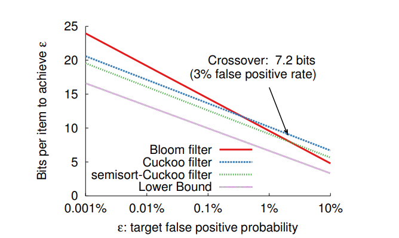

上图是布谷鸟过滤器其他过滤器比较，假阳性率与每个元素的空间成本。对于低假阳性率（低于 3%），布谷鸟过滤器比空间优化的布隆过滤器每个元素需要更少的存储空间。

布谷鸟过滤器有一个负载阈值。 在达到最大可行负载因子后，插入不再稳定，并且越来越有可能失败，因此哈希表必须扩容才能存储更多的项。 而对于布隆过滤器来说可以继续将新项，不过是以增加假阳性率为代价。 为了保持相同的目标假阳性率，布隆过滤器也必须扩容。

4.3 桶的尺寸

桶的尺寸是指每个桶能放的指纹个数，保持布谷鸟过滤器的总大小（桶数组）不变，但改变桶的大小（上述例子使用的是大小为 4）会导致两个后果：

(1) 较大的桶可以提高表的利用率 (即 b 越大假阳性率越大) ，使用 k=2 个哈希函数时，当桶大小 b=1（即直接映射哈希表）时，负载因子α为 50%，但使用桶大小 b=2、4 或 8 时则分别会增加到 84%、95% 和 98%。

(2) 较大的桶需要较长的指纹才能保持相同的假阳性率 (即 b 越大 f 越大)。 使用较大的桶时，每次查找都会检查更多的条目，从而有更大的概率产生指纹冲突。

所以要基于以上寻找一个最合适的桶大小

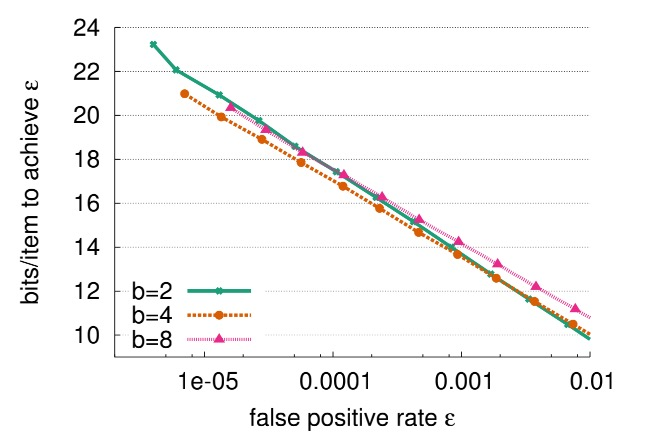

上图是，在不同的不同桶大小下（b=2，4，8），每个项的均摊空间成本与测量的假阳性率。文章的作者对此作了实验，基于上述的结果，空间最优桶大小取决于目标假阳性率ϵ：当ϵ>0.002 时，每桶有两个条目比每桶使用四个条目产生的结果略好，当ϵ减小到 0.00001<ϵ≤0.002 时，桶的大小选取 4 可以最小化空间。

另外在大多数应用情况下，选择两个哈希函数，桶的大小选择 4，能够达到最佳或接近最佳的空间效率的假阳性率。

### 4. [布谷鸟过滤器](https://dbwu.tech/posts/cuckoo_filter/)

#### 基本概念

布谷鸟过滤器 是一种节省内存空间的概率数据结构，基于 布谷鸟哈希算法 实现的过滤器，和 布隆过滤器 一样，用于检测指定元素是否存在于某个集合中，返回结果语义是“元素一定不存在”或“有较大可能存在”。

#### 和布隆过滤器比较

优点

- 布谷鸟过滤器支持删除元素，布隆过滤器不支持
- 高负载因子场景下，布谷鸟过滤器查询效率更高
- 对于存储数据量较大且期望误判率较低 (小于 3%) 的场景下，布谷鸟过滤器存储空间开销更低
- 布谷鸟过滤器比布隆过滤器更容易实现

缺点

- 布谷鸟过滤器采用一种备用候选桶的方案，候选桶与首选桶可以通过 位置 + 值指纹的哈希 通过 异或计算 得出，这种对应关系要求桶的大小必须是 2 的指数倍数 (如 4, 8, 16, 32…)
- 布隆过滤器插入时计算好哈希直接写入位即可，而布谷鸟过滤器在计算后可能会出现对应位置上已经存储了指纹，这时就需要将已存储的值踢出到候选桶，碰撞概率和插入耗时随着表元素增多而增大，因此其插入性能低于布隆过滤器
- 布隆过滤器插入重复元素时没有影响 (可以重复插入)，而布谷鸟过滤器对已存在的值会执行 踢出 操作，因此重复元素的插入存在上限
- 布谷鸟过滤器的删除并不完美，删除操作在相同哈希值仅被插入一次时是完美的，如果元素没有插入就进行删除，可能会出现误删除 (删除了相同哈希值的其他元素)， 如果元素插入了多次，但是每次删除操作只删除一个值，那么就需要知道元素插入了多少次才能彻底删除，或者循环删除直到失败为止

PS: 如果只需要保证 一定不存在 语义，那么删除时不论是否存在重复元素，直接删除即可。

#### 布谷鸟哈希算法描述

- 使用两个哈希函数 H1, H2 和两个哈希表 T1, T2
- 插入元素 x
	- 计算 x 的两个哈希值 idx1 = H1(x), idx2 = H2(x)
	- 如果 T1[idx1], T2[idx2] 有一个为空，插入 x, 两者都为空，随便选一个插入 x
	- 如果 T1[idx1], T2[idx2] 都不为空，则随便选择其中一个 (设为 y) 将其踢出，插入 x
	- 重复上述过程，插入元素 y
	- 如果插入时，踢出次数过多，则说明哈希表满了，进行扩容 (ReHash)，扩容完成后再次插入
- 查询元素 x
	- 读取 T1[idx1], T2[idx2] 的值，和 x 比较

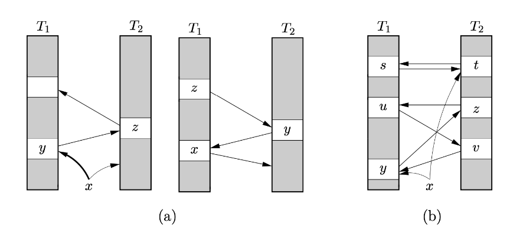

图 (a) 算法过程描述:

- 插入元素 x
- 将对应桶的元素 y 踢出
- 将元素 y 插入到桶 z
- 将对应桶的元素 z 踢出
- 将元素 z 插入到其他桶中

图 (b) 算法过程描述:

- 插入元素 x
- 插入失败，因为桶已经满了
- 触发扩容

#### 不同的版本

1、一个哈希桶

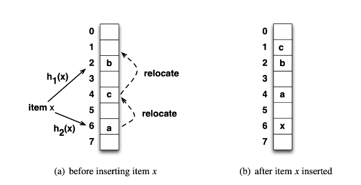

如图所示，在未发生哈希碰撞之前，哈希桶的利用率只有 50%。

2、四路哈希桶

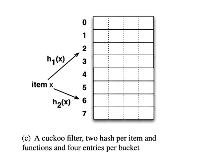

如图所示是一个改进的哈希桶，每个桶有 4 个槽位，当哈希函数映射到同一个桶时，其它 3 个槽位如果有空位，那么就不会有元素被踢出，降低了碰撞概率。

## tip [🔝](#weekly-86)

## share [🔝](#weekly-86)

### 1. [如果不能真实的面对自己，存在将失去意义。](https://www.jiemin.com/archives/1498.html)

如果不能真实的面对自己，存在将失去意义。——电影《不能说的夏天》

人到中年，心不由己，而风险无处不在，30-40岁尤其明显。人无远虑，必有近忧。你有认真想过，要是意外某天突然而至，网络财产如何能提前作好处理？包括你的股票、网络P2P、信用卡数、支付宝各种宝宝、微信等等虚拟资产，乃至你想留给至亲的一些话。中国人忌讳谈论意外乃至死亡，然而只有理性对待“丧”，才能更好的活在当下，毫无顾虑地过好每一天。

中年人抵御风险，首先要配置的就是意外险。保费最低，杠杆最高，没有之一，购买意外险本质买的就是一份合同，就是把风险转嫁给保险公司。

意外险中的“意外”是指受外来的、突发的、非本意的、非疾病的（四要素）使身体受到伤害的客观事件。

意外险主要保障三个方面，意外身故、意外残疾、意外医疗。意外身故，就是意外导致身故给付保险金，一般等于保额；意外残疾，给付的保险金是根据残疾的十个等级来确定的（10级最轻、1级最严重），如发生10级残疾就给付10%的保额，发生1级就给付100%保额。意外医疗，就是可以报销因意外导致的医疗费用。

需要注意的是，一般的意外险是不保“猝死”的，猝死在保险范畴属于疾病，而不是你想象的“意外”。但是现在也已经有保猝死的意外险。

这里不再讨论保险条款，意外险虽然比较简单，但是保险是个严肃的话题。总之，意外险保费低，是人人可以入手的险种，下面直接给出购买建议和渠道（注意，这不是广告，严肃.jpg）

这些年线上互联网保险大发展，不需要再像过往那样被保险代理人忽悠，拿出你的智能手机，下载“小米金融”App，购买“小米综合意外险”。建议一步到位选择“尊享款”，猝死保额50万。一年期意外险，平均每天保费八毛钱就能撬动100万。小米综合意外险是2018年为止性价比最高的含猝死保障的意外险，而且保额能达到100万（小米的热卖款也辗压同级对手，被无数保险代理人推荐的“安意保”）。但是可能每家保险公司对“猝死”的定义会不一样，买保险最终还是得看条款，条款，条款。

买完了意外险压压惊（线上保险都是电子保单，可以联系客服发送PDF保单再打印出来保管），接着说回开头的话题，要是意外某天突然而至，网络财产如何能提前作好处理？

这里提供一个可行的操作方案，不需要存管在所谓的网络虚拟资产托管网站（不靠谱，需要收费不说，说不定某天它就先挂了）。

QQ邮箱想必大家都有用，利用QQ邮箱的“定时发送”功能就能简单实现，实用便捷。把你觉得靠谱的多个人的邮箱地址作为收件人，添加附件（附件可以用word文档写好你要说的话，各种资产的存放处，账号、密码等等）。

点击底部的“定时发送”，一般可以根据个人实际，间隔选择3-7天，这封邮件就会静静躺在草稿箱，等待发射。然后手机设定提醒哦，就是到发送时点前，登录邮箱进行一次修改时间，也就是延时发送。要是忘记延时，你的邮件一群发就吓死大伙。

QQ邮箱比较稳定，如果你实在还不放心，可以设置两封邮件。那么，有的同学问题来了，那么多重要的网络资产信息，放在邮箱里，要是邮箱被盗用怎么办？对于文件安全的问题，请接着往下看。

比如你的word文档是“网络资产.doc”,右键-“添加到压缩文件”，利用RAR压缩工具的加密功能对文档附件加密压缩打包。

密码设置为数字搭配大小写字母或者特殊字符，尽可能复杂。然后别忘记了在邮件的正中提及到解压密码的暗号（比如是你某人的全名的汉语拼音）或者放在某个地方（花瓶里的纸条、抽屉里的标识）。否则邮件的附件是无法打开看到内容的。

写到这里，基本搞定。通过低成本配置意外险，高杠杆转嫁中年意外风险，利用免费的QQ邮箱定时发送功能实现资产传承。如果你对于网络天然忧虑，这里还有一个线下的办法，就是租用银行的收费保险箱服务。登记的时候留下多个联系人电话，一般年费续费时候，银行人员就会电话通知续费。好处是线下实物保管，银行保管也靠谱，缺点就是时效性就要比QQ邮箱低很多。

[readme](../README.md) | [previous](202410W4.md) | [next](202411W1.md)
