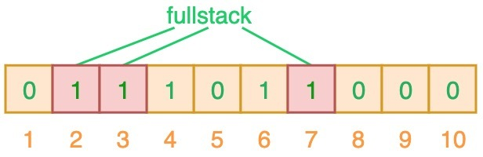

> @Author  : Lewis Tian (taseikyo@gmail.com)
>
> @Link    : github.com/taseikyo
>
> @Range   : 2024-10-27 - 2024-11-02

# Weekly #86

[readme](../README.md) | [previous](202410W4.md) | [next](202411W1.md)

\**Photo by [Geranimo](https://unsplash.com/@geraninmo) on [Unsplash](https://unsplash.com/photos/brown-squirrel-on-black-background-bKhETeDV1WM)*

## Table of Contents

- [algorithm](#algorithm-)
- [review](#review-)
	- 5 分钟搞懂布隆过滤器，亿级数据过滤算法你值得拥有！
	- 一篇吃透布隆过滤器（Bloom Filter）及其使用场景
- [tip](#tip-)
- [share](#share-)

## algorithm [🔝](#weekly-86)

## review [🔝](#weekly-86)

### 1. [5 分钟搞懂布隆过滤器，亿级数据过滤算法你值得拥有！](https://juejin.cn/post/6844904007790673933)

布隆过滤器（Bloom Filter）是 1970 年由布隆提出的。它实际上是一个很长的二进制向量和一系列随机映射函数。布隆过滤器可以用于检索一个元素是否在一个集合中。 **它的优点是空间效率和查询时间都比一般的算法要好的多，缺点是有一定的误识别率和删除困难。**

#### 一、布隆过滤器简介

布隆过滤器可以检查值是 “可能在集合中” 还是 “绝对不在集合中”。“可能” 表示有一定的概率，也就是说可能存在一定为误判率。

布隆过滤器（Bloom Filter）本质上是由长度为 m 的位向量或位列表（仅包含 0 或 1 位值的列表）组成，最初所有的值均设置为 0，如下图所示。

为了将数据项添加到布隆过滤器中，我们会提供 K 个不同的哈希函数，并将结果位置上对应位的值置为 “1”。在前面所提到的哈希表中，我们使用的是单个哈希函数，因此只能输出单个索引值。而对于布隆过滤器来说，我们将使用多个哈希函数，这将会产生多个索引值。

如上图所示，当输入 “semlinker” 时，预设的 3 个哈希函数将输出 2、4、6，我们把相应位置 1。假设另一个输入 ”kakuqo“，哈希函数输出 3、4 和 7。你可能已经注意到，索引位 4 已经被先前的 “semlinker” 标记了。此时，我们已经使用 “semlinker” 和 ”kakuqo“ 两个输入值，填充了位向量。当前位向量的标记状态为：

当对值进行搜索时，与哈希表类似，我们将使用 3 个哈希函数对 ”搜索的值“ 进行哈希运算，并查看其生成的索引值。假设，当我们搜索 ”fullstack“ 时，3 个哈希函数输出的 3 个索引值分别是 2、3 和 7：

从上图可以看出，相应的索引位都被置为 1，这意味着我们可以说 ”fullstack“ 可能已经插入到集合中。事实上这是误报的情形，产生的原因是由于哈希碰撞导致的巧合而将不同的元素存储在相同的比特位上。幸运的是，布隆过滤器有一个可预测的误判率（FPP）：

- n 是已经添加元素的数量；
- k 哈希的次数；
- m 布隆过滤器的长度（如比特数组的大小）；

极端情况下，当布隆过滤器没有空闲空间时（满），每一次查询都会返回 true 。这也就意味着 m 的选择取决于期望预计添加元素的数量 n ，并且 m 需要远远大于 n 。

实际情况中，布隆过滤器的长度 m 可以根据给定的误判率（FFP）的和期望添加的元素个数 n 的通过如下公式计算：

**当我们搜索一个值的时候，若该值经过 K 个哈希函数运算后的任何一个索引位为 ”0“，那么该值肯定不在集合中。但如果所有哈希索引值均为 ”1“，则只能说该搜索的值可能存在集合中。**

#### 二、布隆过滤器应用

布隆过滤器常见的应用场景如下：

- 网页爬虫对 URL 去重，避免爬取相同的 URL 地址；
- 反垃圾邮件，从数十亿个垃圾邮件列表中判断某邮箱是否垃圾邮箱；
- Google Chrome 使用布隆过滤器识别恶意 URL；
- Medium 使用布隆过滤器避免推荐给用户已经读过的文章；
- Google BigTable，Apache HBbase 和 Apache Cassandra 使用布隆过滤器减少对不存在的行和列的查找。

除了上述的应用场景之外，布隆过滤器还有一个应用场景就是 **解决缓存穿透** 的问题。

所谓的缓存穿透就是服务调用方每次都是查询不在缓存中的数据，这样每次服务调用都会到数据库中进行查询，如果这类请求比较多的话，就会导致数据库压力增大，这样缓存就失去了意义。

利用布隆过滤器我们可以预先把数据查询的主键，比如用户 ID 或文章 ID 缓存到过滤器中。当根据 ID 进行数据查询的时候，我们先判断该 ID 是否存在，若存在的话，则进行下一步处理。若不存在的话，直接返回，这样就不会触发后续的数据库查询。需要注意的是缓存穿透不能完全解决，我们只能将其控制在一个可以容忍的范围内。

### 2. [一篇吃透布隆过滤器（Bloom Filter）及其使用场景](https://blog.csdn.net/weixin_64366370/article/details/130693987)

#### 3、布隆过滤器的使用场景

1、Redis 通过布隆过滤器防止缓存穿透

首先我们需要知道什么是缓存穿透，这里我们给出缓存穿透的定义。

> Redis 缓存穿透指访问一个缓存和数据库中都不存在的 key，由于这个 key 在缓存中不存在，则会到数据库中查询，数据库中也不存在该 key，无法将数据添加到缓存中，所以每次都会访问数据库导致数据库压力增大。

我们可以在访问 Redis 之前使用布隆过滤器来对请求的 key 进行过滤， 可以大大减少那些恶意攻击。当然，会存在一定误判率，但是使用布隆过滤器后，“不法分子” 肯定对我们服务器就没那么容易进行恶意攻击了。

2、RocketMQ 通过布隆过滤器防止消息重复消费

为了防止 RocketMQ 消息重复消费，我们发送消息时可以对每个消息设置唯一的 key，然后在消费者处利用布隆过滤器对消息的 key 检索，如果存在则说明消息已经消费过，不消费。不存在则进行消费，然后插入布隆过滤器。

当然，上面两个例子仅仅是举的例子，布隆过滤器能使用的地方很多，只要但凡涉及 “数据过滤” 均可以考虑使用 “布隆过滤器” 来实现。

#### 4、布隆过滤器优缺点

1、优点

- 时间复杂度低，增加和查询元素的时间复杂为 O(N)，（N 为哈希函数的个数，通常情况比较小）
- 保密性强，布隆过滤器不存储元素本身
- 存储空间小，如果允许存在一定的误判，布隆过滤器是非常节省空间的（相比其他数据结构如 Set、Map 集合）

2、缺点

- 有点一定的误判率，但是可以通过调整参数来降低
- 无法获取元素本身
- 很难删除元素

## tip [🔝](#weekly-86)

## share [🔝](#weekly-86)

[readme](../README.md) | [previous](202410W4.md) | [next](202411W1.md)
