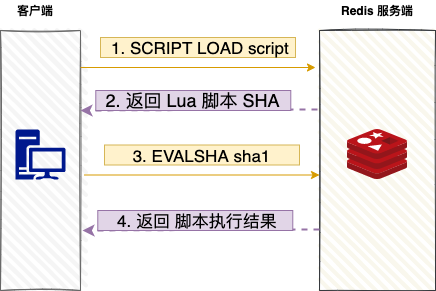

> @Author  : Lewis Tian (taseikyo@gmail.com)
>
> @Link    : github.com/taseikyo
>
> @Range   : 2025-03-18 - 2025-03-18

# Weekly #87

[readme](../README.md) | [previous](202410W5.md) | [next](202411W2.md)

\**Photo by [Serenay Tosun](https://unsplash.com/@serenaytosun) on [Unsplash](https://unsplash.com/photos/a-woman-walking-along-a-beach-next-to-the-ocean-_zsMDxFp9ZU)*

## Table of Contents

- [algorithm](#algorithm-)
- [review](#review-)
	- Redis 批量查询技巧
	- 大数据平台架构——框架篇
- [tip](#tip-)
- [share](#share-)
	- 第一性原理

## algorithm [🔝](#weekly-87)

## review [🔝](#weekly-87)

### 1. [Redis 批量查询技巧](https://www.cnblogs.com/kukuxjx/p/18017252)

#### 1.  前言

Redis，我们做开发的想必都用过，他是一种缓存，主要用于快速响应结果嘛。比如我们要获取商品的详情，有日销量、月销量、库存数量、评价数量，这些数据都在 Redis 缓存中，那么我们是要拿四趟？还是一趟呢？当然是一趟最好呀。接下来我们来看看为什么我们要一趟这么做，以及怎么做。

#### 2. 为什么需要批量执行命令

我们看一下交互过程：

每次客户端发送一个一个请求命令，Redis 服务端接收到命令后，将命令放在队列内，一个一个命令执行，并将结果返回。

批量执行命令有三点优势：

- 提高命令执行效率，减少了网络延迟，从而提高了 Redis 服务器的响应速度。批量执行减少了每个命令的单独网络传输开销，有效降低了往返时间（RTT）。
- 简化客户端逻辑，通过将多个命令封装成一个操作，客户端的处理逻辑变得更加简洁和清晰。这使得客户端代码更易读、易维护。
- 提升事务性能，批量执行命令能够确保一组命令在同一时间内执行，从而提高了事务的性能。这对于需要保持原子性的操作尤为重要，确保一组命令要么全部执行成功，要么全部失败。

接下来，我们详细讲解批量查询的四种方式。

- 字符串 MGET 命令
- 哈希表 HMGET 命令
- 管道技术
- Lua 脚本

#### 3. 批量查询

3.1、字符串 MGET 命令

MGET 接受一个或多个键作为参数，返回与这些键关联的值。

- key1, key2, ..., keyN：要获取值的键列表。
- MGET 返回一个包含相应值的列表，如果键不存在，则对应的位置返回 nil。

3.2、哈希表 HMGET 命令

HMGET 接受一个哈希表的键以及一个或多个字段名作为参数，返回与这些字段名关联的值。

如果给定的域不存在于哈希表，那么返回一个 nil 值。

3.3、管道技术

Redis Pipeline（管道）命令是一种优化网络通信的技术，可以将多个命令一次性发送给 Redis 服务器，可以减少客户端与 Redis 服务器之间的网络通信次数。

客户端将多个命令一次性发送给 Redis 服务器，Redis 服务器缓存这些命令，并一次性执行，最后将执行结果一次性返回给客户端。

通过使用 Redis Pipeline，显而易见的好处是避免了在每个命令执行时都进行一次网络通信，从而显著降低了时间开销。

**1 次 pipeline（n条命令） = 1 次网络时间 + 执行n 条命令时间**

3.4、Lua 脚本

Redis Lua 脚本是一种在 Redis 服务器上执行的脚本语言，基于 Lua 编程语言。

这种脚本可以包含多个 Redis 命令，而且它们在 Redis 服务器上以原子性操作的方式执行。通过使用 Lua 脚本，你可以在服务器端执行一系列的 Redis 命令，而不需要将它们一条一条地发送到服务器。

Redis 执行 Lua 脚本有两种执行方式：Eval 和 EvalSHA 。

3.4.1、Eval

EVAL命令的执行过程主要可以分为三个步骤：

1. 根据客户端提供的 Lua 脚本，在 Lua 环境中定义一个 Lua 函数。Lua 函数的名称实际上是以 "f_" 为前缀加上脚本本身计算出的 SHA1 值，例如 f_ddfsdfjgjbg33rndgj00，其中 SHA1 的长度为 40 字符。函数体则是脚本本身。
2. 将客户端提供的脚本保存到 lua_scripts 字典中。简单来说，就是添加一个键值对，其中键是 Lua 脚本的 SHA1 校验和，值是 Lua 脚本本身。这主要是为了以后能够复用这个脚本。
3. 执行第一步在 Lua 环境中定义的函数，从而执行客户端提供的 Lua 脚本。这个过程利用了在步骤二中保存的 SHA1 校验和来调用对应的 Lua 函数。

这个流程使得 Redis 能够高效地处理客户端提供的 Lua 脚本，同时通过缓存 SHA1 校验和，可以减少重复传输脚本的开销，提高效率。

在 Redis 中，使用了 Key 列表和参数列表来为 Lua 脚本提供更多的灵活性，执行 Eval 命令的格式为：

下图演示下 Lua 如何调用 Redis 命令 ，通过 `redis.call()` 来执行了 Redis 命令 。

3.4.2、EvalSHA

与 EVAL 不同，EVALSHA 的主要目的是通过脚本的 SHA1 校验和来执行预先在服务器端加载的 Lua 脚本，从而避免重复传输脚本的开销。

使用步骤：

（1）加载 Lua 脚本到 Redis 服务端：

首先，将 Lua 脚本加载到 Redis 服务端。这可以通过 SCRIPT LOAD 命令完成。执行 SCRIPT LOAD 后，会返回一个 SHA1 校验和，该值唯一标识了加载的 Lua 脚本。

这会返回 SHA1 校验和: a1104f2250e5dd9fc10c3c681ddb389e7bd4a2cf。

（2）执行 Lua 脚本：

一旦 Lua 脚本被加载并获得了 SHA1 校验和，之后就可以使用 EVALSHA 命令来执行该脚本。

### 2. [大数据平台架构——框架篇](https://zhuanlan.zhihu.com/p/653973251)

#### 一、大数据平台介绍

首先，先解释下大数据的 5V 特征：

- 数据量大：一般以 P（1000 个 TB）、E（100 万个 TB）或 Z（10 亿个 TB）为计量单位
- 数据类型繁多：包括结构化、半结构化和非结构化的数据，数据来源多样，文本、日志、视频、图片、地理位置等；
- 价值密度低：大数据所具备的巨大体量，使其所包含信息较少。因此需要利用通过数据分析与机器学习更快速的挖掘出有价值的数据，带来更多的商业价值。
- 速度快：数据增长速度快、并要求处理速度快、对时效性要求也高，海量数据的处理需求不再局限在离线计算当中。
- 真实性：数据的真实性和可信赖度差异较大，因此数据分析的精确度也有所不同。

大数据平台本质上就是对海量数据从采集、存储、计算、应用、管理、运维的多方位、多维度的组合研究设计，从而建设合理、高效的大数据平台架构。

#### 二、大数据存储计算

1、那我们先讲讲最核心的大数据存储和计算吧。
这里就不得不引入 Hadoop 这个框架。Hadoop 是大数据存储和计算的鼻祖了，现在大多开源的大数据框架都依赖 Hadoop 或者与它能很好的兼容。

关于 Hadoop，我们需要了解他们是什么、什么原理、使用场景、如何使用：

- HDFS、MapReduce
- NameNode、DataNode
- JobTracker、TaskTracker
- Yarn、ResourceManager、NodeManager

2、对于大数据的处理，我们必须了解和会使用的就是 SQL。

使用 SQL 处理分析 Hadoop 上的数据，方便、高效、易上手、更是趋势。不论是离线计算还是实时计算，越来越多的大数据处理框架都在积极提供 SQL 接口。

而 Hive 则是数据仓库工具。通过 Hive 命令行可以对数据进行创建表、删除表、往表中加载数据、分区、将表中数据下载到本地等操作。

至此，通过上面的知识学习，我们已经了解到，HDFS 是 Hadoop 提供的分布式存储框架，它可以用来存储海量数据，MapReduce 是 Hadoop 提供的分布式计算框架，它可以用来统计和分析 HDFS 上的海量数据，而 Hive 则是 SQL On Hadoop，Hive 提供了 SQL 接口，开发人员只需要编写简单易上手的 SQL 语句，Hive 负责把 SQL 翻译成 MapReduce，提交运行。

此时我们认知中的关于大数据平台架构至少包含以下部分：

Hive 把 MapReduce 作为执行引擎，会发现其实执行会有些慢，所以很多 SQL on Hadoop 的框架越来越多，目前主流的开源 OLAP 计算引擎包括：Sparksql、Presto、Kylin、Impala、Druid、Clickhouse 等。因此这几个框架也扩充了数据计算层的多样性。

#### 三、大数据采集

那我们如何将数据存储到 HDFS 上呢？这里就需要涉及数据的采集、转化、加载了。我们知道数据的来源多种多样，结构化的、半结构化和非结构化的，不同数据源也就会有不同的采集工具。例如：

- Hadoop 框架自带的命令：HDFS PUT 命令、HDFS API
- Sqoop：是一个主要用于 Hadoop/Hive 与传统关系型数据库 Oracle/MySQL/SQLServer 等之间进行数据交换的开源框架。就像 Hive 把 SQL 翻译成 MapReduce 一样，Sqoop 把你指定的参数翻译成 MapReduce，提交到 Hadoop 运行，完成 Hadoop 与其他数据库之间的数据交换。
- Flume：是一个分布式的海量日志采集和传输框架，因为 “采集和传输框架”，所以它并不适合关系型数据库的数据采集和传输。Flume 可以实时的从网络协议、消息系统、文件系统采集日志，并传输到 HDFS 上。因此，如果你的业务有这些数据源的数据，并且需要实时的采集，那么就应该考虑使用 Flume。
- Data X：阿里开源的关系性数据库采集交换数据的工具

此时我们认知中关于大数据平台架构会包含：

#### 四、大数据应用

以上我们已经了解了大数据从采集、存储、计算的技术架构和原理了，接下来我们就可以将计算好的数据同步和应用到其他系统中去。而这一步反向数据输出的技术工具可以是和我们数据采集转换时使用的工具是一样的，也可以是计算层的使用的框架。
而对于数据的应用，根据不同的业务属性和场景，大致会分为 BI 平台、应用系统、数据开发平台、数据分析挖掘等。具体数据应用的细分可以参考：[Amy 随笔记：应用数据产品合集](https://zhuanlan.zhihu.com/p/639957114)

至此，大数据架构就会包含：

#### 五、实时和离线

关于大数据的应用场景，我们知道有时候需要离线数据就可以了，但有些时候也需要实时的数据，所以我们在大数据的存储、计算时，同样也需要离线和实时的两套方案。

关于离线数据存储，我们就主要会依赖数仓分层建模的方式进行数据存储，详细细节可参考：Amy 随笔记：数仓分层建模

关于实时数据传输，目前比较主流的就是使用 Kafka 框架，它是一种分布式发布订阅消息的系统，用来处理流数据。这种架构下，将数据分为生产者和消费者。实时的场景下，Kafka 充当着将数据从生产者流通到消费者的管道角色，借此吞吐量大的优势，以此实现数据及时获取和传输。离线的场景下，HDFS 也可以作为数据其中消费者，通过 Kafka 将数据同步到 HDFS。

而对于实时的数据计算，其实也分为绝对实时和准实时两种场景。绝对实时的延迟要求一般在毫秒级，准实时的延迟要求一般在秒、分钟级。对于需要绝对实时的业务场景，用的比较多的是 Storm，对于其他准实时的业务场景，可以是 Storm，也可以是 Spark Streaming、Flink。至此，大数据平台架构演变成了：

#### 六、大数据任务调度

以上你会发现大数据平台的任务越来越多了，不仅仅是分析任务，数据采集、数据交换同样是一个个的任务。这些任务中，有的是定时触发，有的则需要依赖其他任务来触发。当平台中有几百上千个任务需要维护和运行时候，仅仅靠 crontab 这样简单的脚本执行任务是远远不够了，这时便需要一个调度监控系统来完成这件事。调度监控系统是整个数据平台的中枢系统，类似于 AppMaster，负责分配和监控任务。像这样的框架常用的就有 Apache Oozie、Azkaban 㩐。这时数据架构就会包含：

#### 七、大数据监控和管理

截止当前，我们了解了大数据从采集、存储、计算、应用的整个过程。但在这个过程中，程序任务是可能会出现很多问题的，例如：

1. 需要知道在数据流水线的任何步骤中数据都不会丢失。因此，你需要监控每个程序正在处理的数据量，以便尽快检测到任何异常;
2. 需要有对数据质量进行测试的机制，以便在数据中出现任何意外值时，你接收到告警信息;
3. 需要监控应用程序的运行时间，以便每个数据源都有一个预定义的 ETA，并且会对延迟的数据源发出警报;
4. 需要管理数据血缘关系，以便我们了解每个数据源的生成方式，以便在出现问题时，我们知道哪些数据和结果会受到影响;
5. 需要系统自动处理合法的元数据变更，并能够发现和报告非法元数据变更;
6. 需要对应用程序进行版本控制并将其与数据相关联，以便在程序更改时，我们知道相关数据如何相应地更改。

就此我们发现，我们需要对数据进行全方位的管理，包括数据监控、数据质量检测、元数据管理、血缘关系管理、异常处理、版本控制。

这里涉及到监控预警的平台例如 grafana、promethus 等；

保证数据质量，数据治理是比不可少的，这里涉及元数据管理、血缘关系管理、数据标准管理等的数据治理平台例如 Altas、Data Hub 等，当然各企业也可以是自研的管理平台和工具。

就此，数据架构就会包含如下：

#### 八、大数据安全

除此之外，数据的安全是必不可少的，仅包含用户访问权限、数据资源权限管理、审计等。目前市面上也有这样的框架，例如 Apache Ranger、Sentry 等

#### 九、云基础架构

随着业务的发展，各种大数据应用程序或任务被添加到大数据系统中后，你会发现配置机器和设置生产部署的过程非常繁琐，并且有很多的坑要踩。这个时候可能就需要考虑一下云计算平台了。通过在统一框架中运行，利用云计算易于配置和部署，弹性扩展，资源隔离，高资源利用率，高弹性，自动恢复等优势，它们将大大降低复杂性并提高运行效率。例如云基础架构 K8S。此时，大数据平台架构就变成了：

### 3. [一文读懂 Apache Flink 技术](https://juejin.cn/post/6844903700964589576)

#### 1、Flink 介绍

Flink 是一款分布式的计算引擎，它可以用来做批处理，即处理静态的数据集、历史的数据集；也可以用来做流处理，即实时地处理一些实时数据流，实时地产生数据的结果；也可以用来做一些基于事件的应用，比如说滴滴通过 Flink CEP 实现实时监测用户及司机的行为流来判断用户或司机的行为是否正当。

总而言之，Flink 是一个 Stateful Computations Over Streams，即数据流上的有状态的计算。这里面有两个关键字，一个是 Streams，Flink 认为有界数据集是无界数据流的一种特例，所以说有界数据集也是一种数据流，事件流也是一种数据流。Everything is streams，即 Flink 可以用来处理任何的数据，可以支持批处理、流处理、AI、MachineLearning 等等。另外一个关键词是 Stateful，即有状态计算。有状态计算是最近几年来越来越被用户需求的一个功能。举例说明状态的含义，比如说一个网站一天内访问 UV 数，那么这个 UV 数便为状态。Flink 提供了内置的对状态的一致性的处理，即如果任务发生了 Failover，其状态不会丢失、不会被多算少算，同时提供了非常高的性能。

那 Flink 的受欢迎离不开它身上还有很多的标签，其中包括性能优秀（尤其在流计算领域）、高可扩展性、支持容错，是一种纯内存式的一个计算引擎，做了内存管理方面的大量优化，另外也支持 eventime 的处理、支持超大状态的 Job（在阿里巴巴中作业的 state 大小超过 TB 的是非常常见的）、支持 exactly-once 的处理。

#### 2、Flink 基石

Flink 之所以能这么流行，离不开它最重要的四个基石：Checkpoint、State、Time、Window。

首先是 Checkpoint 机制，这是 Flink 最重要的一个特性。Flink 基于 Chandy-Lamport 算法实现了一个分布式的一致性的快照，从而提供了一致性的语义。Chandy-Lamport 算法实际上在 1985 年的时候已经被提出来，但并没有被很广泛的应用，而 Flink 则把这个算法发扬光大了。Spark 最近在实现 Continue streaming，Continue streaming 的目的是为了降低它处理的延时，其也需要提供这种一致性的语义，最终采用 Chandy-Lamport 这个算法，说明 Chandy-Lamport 算法在业界得到了一定的肯定。

提供了一致性的语义之后，Flink 为了让用户在编程时能够更轻松、更容易地去管理状态，还提供了一套非常简单明了的 State API，包括里面的有 ValueState、ListState、MapState，近期添加了 BroadcastState，使用 State API 能够自动享受到这种一致性的语义。

除此之外，Flink 还实现了 Watermark 的机制，能够支持基于事件的时间的处理，或者说基于系统时间的处理，能够容忍数据的延时、容忍数据的迟到、容忍乱序的数据

另外流计算中一般在对流数据进行操作之前都会先进行开窗，即基于一个什么样的窗口上做这个计算。Flink 提供了开箱即用的各种窗口，比如滑动窗口、滚动窗口、会话窗口以及非常灵活的自定义的窗口。

#### 3、Flink API

Flink 分层 API 主要有三层，如下图：

最底层是 ProcessFunction，它能够提供非常灵活的功能，它能够访问各种各样的 State，用来注册一些 timer，利用 timer 回调的机制能够实现一些基于事件驱动的一些应用。

之上是 DataStream API，最上层是 SQL/Table API 的一种 High-level API。

#### 4、Flink 的用途

Flink 能用来做什么？回顾一下 Flink up 前几站的分享，有非常多的嘉宾分享了他们在自己公司里面基于 Flink 做的一些实践，包括携程、唯品会、饿了么、滴滴、头条等等。他们的应用场景包括实时的机器学习，实时的统计分析，实时的异常监测等等。这些实践案例的共同点就是都用来做实时性的任务。

#### 5、Flink Title 的变化

早期 Flink 是这样介绍自己的:“我是一个开源的流批统一的计算引擎”，当时跟 Spark 有点类似。后来 Spark 改成了一长串的文字，里面有各种各样的形容词：“我是一个分布式的、高性能的、高可用的、高精确的流计算系统”。最近 Spark 又进行了修改：“我是一个数据流上的有状态的计算”。

通过观察这个变化，可以发现 Flink 社区重心的变迁，即社区现在主要精力是放在打造它的流计算引擎上。先在流计算领域扎根，领先其他对手几年，然后借助社区的力量壮大社区，再借助社区的力量扩展它的生态。

阿里巴巴 Flink 是这样介绍自己的：“Flink 是一个大数据量处理的统一的引擎”。这个 “统一的引擎” 包括流处理、批处理、AI、MachineLearning、图计算等等。

#### 6、Flink High-Level API 的历史变迁

在 Flink 1.0.0 时期，Table API 和 CEP 这两个框架被首次加入到仓库里面，同时社区对于 SQL 的需求很大。SQL 和 Table API 非常相近，都是一种处理结构化数据的一种 High-Level 语言，实现上可以共用很多内容。所以在 1.1.0 里面，社区基于 Apache Calcite 对整个非 Table 的 Module 做了重大的重构，使得 Table API 和 SQL 共用了大部分的代码，同时进行了支持。

在 Flink 1.2.0 时期，在 Table API 和 SQL 上支持 Tumbling Window、Sliding Window、Session Window 这些窗口。

在 Flink 1.3.0 时期，首次引用了 Dynamic Table 这个概念，借助 Dynamic Table，流和批之间是可以相互进行转换的。流可以是一张表，表也可以是一张流，这是流批统一的基础之一。Retraction 机制是 Dynamic Table 最重要的一个功能，基于 Retraction 才能够正确地实现多级 Application、多级 Join，才能够保证语意与结果的一个正确性。同时该版本支持了 CEP 算子的可控性。

在 Flink 1.5.0 时期，支持了 Join 操作，包括 window Join 以及非 window Join，还添加了 SQL CLI 支持。SQL CLI 提供了一个类似 shell 命令的对话框，可以交互式执行查询。

#### 7、Flink API 的历史变迁

在 Flink 1.0.0 时期，加入了 State API，即 ValueState、ReducingState、ListState 等等。State API 主要方便了 DataStream 用户，使其能够更加容易地管理状态。

在 Flink 1.1.0 时期，提供了对 SessionWindow 以及迟到数据处理的支持。

在 Flink 1.2.0 时期，提供了 ProcessFunction，一个 Low-level 的 API。基于 ProcessFunction 用户可以比较灵活地实现基于事件的一些应用。

在 Flink 1.3.0 时期，提供了 Side outputs 功能。一般算子的输出只有一种输出的类型，但是有些时候可能需要输出另外的类型，比如把一些异常数据、迟到数据以侧边流的形式进行输出，并交给异常节点进行下一步处理，这就是 Side outputs。

在 Flink 1.5.0 时期，加入了 BroadcastState。BroadcastState 用来存储上游被广播过来的数据，这个节点上的很多 N 个并发上存在的 BroadcastState 里面的数据都是一模一样的，因为它是从上游广播来的。基于这种 State 可以比较好地去解决不等值 Join 这种场景。比如一个 Query 里面写的 “SLECECT * FROM L JOIN R WHERE L.a> R.b”，也就是说我们需要把左表和右表里面所有 A 大于 B 的数据都关联输出出来。在以前的实现中，由于没有 Join 等值条件，就无法按照等值条件来做 KeyBy 的 Shuffle，只能够将所有的数据全部汇集到一个节点上，一个单并发的节点上进行处理，而这个单并发的节点就会成为整个 Job 的瓶颈。而有了 BroadcastState 以后就可以做一些优化：因为左表数据量比较大，右表数据量比较小，所以选择把右表进行广播，把左表按照它某一个进行均匀分布的 key，做 keyby shuffle，shuffle 到下游的 N 个 Join 的节点，Join 的节点里面会存两份 State，左边 state 和右边 state，左边 state 用来存左边数据流的 state，是一个 keyedState，因为它是按它某一个 key 做 keyby 分发下来的。右边 State 是一个 BroadcastState，所有的 Join 节点里面的 BroadcastState 里面存的数据都是一模一样的，因为均为从上游广播而来。所有 keyedState 进行并发处理，之后将 keyedState 集合进行合并便等于左边数据流的全集处理结果。于是便实现了这个 Join 节点的可扩充，通过增加 join 节点的并发，可以比较好地提升 Job 处理能力。除了不等值 Join 场景，BroadcastState 还可以比较有效地解决像 CAP 上的动态规则。

在 Flink 1.6.0 时期，提供了 State TTL 参数、DataStream Interval Join 功能。State TTL 实现了在申请某个 State 时候可以在指定一个 TTL 参数，指定该 state 过了多久之后需要被系统自动清除。在这个版本之前，如果用户想要实现这种状态清理操作需要使用 ProcessFunction 注册一个 Timer，然后利用 Timer 的回调手动把这个 State 清除。从该版本开始，Flink 框架可以基于 TTL 原生地解决这件事情。DataStream Interval Join 功能即含有区间间隔的 Join，比如说左流 Join 右流前后几分钟之内的数据，这种叫做 Interval Join。

#### 8、Flink Checkpoint & Recovery 的历史变迁

Checkpoint 机制在 Flink 很早期的时候就已经支持，是 Flink 一个很核心的功能，Flink 社区也一直致力于努力把 Checkpoint 效率提升，以及换成 FailOver 之后它的 Recallable 效率的提升。

在 Flink 1.0.0 时期，提供了 RocksDB 的支持，这个版本之前所有的状态都只能存在进程的内存里面，这个内存总有存不下的一天，如果存不下则会发生 OOM。如果想要存更多数据、更大量 State 就要用到 RocksDB。RocksDB 是一款基于文件的嵌入式数据库，它会把数据存到磁盘，但是同时它又提供高效读写能力。所以使用 RocksDB 不会发生 OOM 这种事情。在 Flink1.1.0 里面，提供了纯异步化的 RocksDB 的 snapshot。以前版本在做 RocksDB 的 snapshot 时它会同步阻塞主数据流的处理，很影响吞吐量，即每当 checkpoint 时主数据流就会卡住。纯异步化处理之后不会卡住数据流，于是吞吐量也得到了提升。

在 Flink 1.2.0 时期，引入了 Rescalable keys 和 operate state 的概念，它支持了一个 Key State 的可扩充以及 operator state 的可扩充。 在 Flink 1.3.0 时期，引入了增量的 checkpoint 这个比较重要的功能。只有基于增量的 checkpoint 才能更好地支持含有超大 State 的 Job。在阿里内部，这种上 TB 的 State 是非常常见。如果每一次都把全量上 TB 的 State 都刷到远程的 HDFS 上那么这个效率是很低下的。而增量 checkpoint 只是把 checkpoint 间隔新增的那些状态发到远程做存储，每一次 checkpoint 发的数据就少了很多，效率得到提高。在这个版本里面还引入了一个细粒度的 recovery，细粒度的 recovery 在做恢复的时候，有时不需要对整个 Job 做恢复，可能只需要恢复这个 Job 中的某一个子图，这样便能够提高恢复效率。

在 Flink 1.5.0 时期，引入了 Task local 的 State 的 recovery。因为基于 checkpoint 机制，会把 State 持久化地存储到某一个远程存储，比如 HDFS，当发生 Failover 的时候需要重新把这个数据从远程 HDFS 再 download 下来，如果这个状态特别大那么该 download 操作的过程就会很漫长，导致 Failover 恢复所花的时间会很长。Task local state recovery 提供的机制是当 Job 发生 Failover 之后，能够保证该 Job 状态在本地不会丢失，进行恢复时只需在本地直接恢复，不需从远程 HDFS 重新把状态 download 下来，于是就提升了 Failover recovery 的效率。

#### 9、Flink Runtime 的历史变迁

在 Flink 1.2.0 时期，提供了 Async I/O 功能。如果任务内部需要频繁地跟外部存储做查询访问，比如说查询一个 HBase 表，在该版本之前每次查询的操作都是阻塞的，会频繁地被 I/O 的请求卡住。当加入异步 I/O 之后就可以同时地发起 N 个异步查询的请求，这样便提升了整个 job 的吞吐量，同时 Async I/O 又能够保证该 job 的 Async 语义。

在 Flink 1.3.0 时期，引入了 HistoryServer 的模块。HistoryServer 主要功能是当 job 结束以后，它会把 job 的状态以及信息都进行归档，方便后续开发人员做一些深入排查。

在 Flink 1.4.0 时期，提供了端到端的 exactly once 的语义保证，Flink 中所谓 exactly once 一般是指 Flink 引擎本身的 exactly once。如果要做到从输入到处理再到输出，整个端到端整体的 exactly once 的话，它需要输出组件具备 commit 功能。在 kafka 老版本中不存在 commit 功能，从最近的 1.1 开始有了这个功能，于是 Flink 很快便实现了端到端 exactly once。

在 Flink 1.5.0 时期，Flink 首次对外正式地提到新的部署模型和处理模型。新的模型开发工作已经持续了很久，在阿里巴巴内部这个新的处理模型也已经运行了有两年以上，该模型的实现对 Flink 内部代码改动量特别大，可以说是自 Flink 项目建立以来，Runtime 改动最大的一个改进。简而言之，它的一个特性就是它可以使得在使用 YARN、Mesos 这种调度系统时，可以更加更好地动态分配资源、动态释放资源、提高资源利用性，还有提供更好的 jobs 之间的隔离。最后是在这个版本中，Flink 对其网络站进行了一个基本重构。

#### 10、Flink 网络栈重构

在流计算中有两个用来衡量性能的指标：延迟和吞吐。一般来讲如果想要更高吞吐就要牺牲一些延迟，如果想要更低的延迟就要牺牲一定的吞吐。但是网络栈的重构却实现了延迟和吞吐的同时提升，这主要得益于它两方面的工作：第一个是基于信用的流控，另一个是基于事件的 I/O。一个用来提高它的吞吐，另一个用来降低它的延迟。

在介绍流控之前需要先介绍一下现有的网络栈。Flink 中 TaskManager 就是用来管理各个 task 的角色，它是以进程为单位；task 用来执行用户代码，以线程为单位。当 tasks 之间有数据传输的交互的时候就要建立网络的连接，如果 2 秒之间都建立一个 TCP 连接的话，那么这个 TCP 连接会被严重浪费，所以 Flink 在两个 TaskManager 之间建立一个 TCP 连接，即两个进程之间只存在一个连接。各个 task 之间以 TCP channel 的方式来共享 TCP 的连接，这样整个 job 中就不会有太多的 TCP 连接。

#### 11、Flink 反压

反压的意思是当某一个 task 的处理性能跟不上输入速率的时候，其输入端的 Buffer 就会被填满，当输入端 Buffer 被填满的时候就会导致 TCP 的读取被暂停。TCP 的读取被暂停之后，就会导致上游输出端的 Buffer 池越积越多，因为下游此时已经不再进行消费。当上游输出端的 Buffer 池也堆满的时候， TCP 通道就会被关闭，其内部所有的 TCP channel 也会被关闭。从而上游 task 就会逐级的向上游进行反压，这是整体的反压流程，所以说 Flink 以前的反压机制是比较原生态、比较粗暴的，因为其控制力度很大，整个 TCP 中一旦某一个 Task 性能跟不上，就会把整个 TCP 连接关掉。如下图所示：

右下角的 task 虽然处理跟不上了，但上面的 task 仍然可以继续进行处理。左边这些上游数据可以继续发给右上角的 task 进行处理。但是由于现在整个的 TCP 连接都被关闭，导致右上角 task 同样收不到数据，整体吞吐量实际上是下降的趋势。为了优化这个功能就需要做到更加细密度的流控，目前是关闭整个 TCP 连接，优化措施就是需要对 TCP channel 进行控制，当某个 task 处理不过来时只需要该 Task 对应的 TCP channel，其它 TCP channel 不受影响。优化实现方式就是基于信用的流控。

基于信用的流控的核心思想就是基于信用额度的消费。比如银行做贷款，为了防止坏账太多，它会对每一个人评估其信用额度，当发放贷款时贷款不会超过这个人能承受的额度。基于这种方式，它能够一方面不会产生太多坏账，另一方面可以充分地把银行的资金利用起来。基于信用的流控就是基于这种思想，Flink 中所谓的信用额度，就是指这个下游消费端的可用的 Buffer 数。如下图：

该图左边是指发送端，有四个输出的队列，每个队列里面的方块代表输出 Buffer，即准备丢给下游处理的 Buffer。右边是消费端，消费端也有四个队列，这四个队列里面也有一些 Buffer 块，这些 Buffer 块是空闲的 Buffer，准备用来接收上游发给自己的数据。

上面提到基于数据的流控中所谓的信用就是指这个消费端它可用的 Buffer 数，代表当前还能够消费多少数据，消费端首先会向上游反馈当前的信用是多少， producer 端只会向信用额度大于 0 的下游进行发送，对于信用额度如果为 0 的就不再发送数据。这样整个网络的利用率便得到了很大的提升，不会发生某些 Buffer 被长时间的停留在网络的链路上的情况。基于信用的流控主要有以下两方面的优化提升：一个是当某一个 task 发生反压处理跟不上的时候，不会发生所有的 task 都卡住，这种做法使吞吐量得到了很大的提升，在阿里内部用双 11 大屏作业进行测试，这种新的流控算法会得到 20% 的提升；另一个是基于事件的 I/O，Flink 在网络端写数据时会先往一个 Buffer 块里面写数据，这个 Buffer 块是一个 32K 的长度的单位，即 32K 的大小，当这个 Buffer 块被填满的时候就会输出到网络里面，或者如果数据流比较慢，没办法很快填满的话，那么会等待一个超时，默认一个 100 毫秒，即如果 100 毫秒内还没被填满那么这个 Buffer 也会被输出到网络里面。此时若是在以前版本中 Flink 延迟可能是在 100 毫秒以内，最差的情况下是到 100 毫秒，因为需要到 100 毫秒等这个 Buffer 发出去。如果要得到更低的延时，现在的做法就会将这个 Buffer 直接加入到输出的队列，但是还是保持继续往这个 Buffer 块里面写数据，当网络里面有容量时这个 Buffer 块便会立刻被发出去，如果网络现在也比较繁忙，那就继续填充这个 Buffer，这样吞吐也会比较好一点。基于这种算法，Flink 的延时几乎是完美的，可以看到它的曲线基本上是低于 10 毫秒的，这也充分利用了网络的容量，几乎对吞吐没有影响。

## tip [🔝](#weekly-87)

## share [🔝](#weekly-87)

### 1. [第一性原理](https://wiki.mbalib.com/wiki/%E7%AC%AC%E4%B8%80%E6%80%A7%E5%8E%9F%E7%90%86)

第一性原理指的是，回归事物最基本的条件，将其拆分成各要素进行解构分析，从而找到实现目标最优路径的方法。

该原理源于古希腊哲学家亚里士多德提出的一个哲学观点：“每个系统中存在一个最基本的命题，它不能被违背或删除。”

这个名词被炒的很火主要得益于“钢铁侠”埃隆·马斯克（特斯拉汽车CEO）。他曾在采访中提到自己特别推崇“第一性原理”思考法：“通过第一性原理，我把事情升华到最根本的真理，然后从最核心处开始推理……”

“我们运用第一性原理，而不是比较思维去思考问题是非常重要的。我们在生活中总是倾向于比较，对别人已经做过或者正在做的事情我们也都去做，这样发展的结果只能产生细小的迭代发展。第一性原理的思想方式是用物理学的角度看待世界，也就是说一层层拨开事物表象，看到里面的本质，再从本质一层层往上走。”这是他眼中的“第一性原理思维模型”——回溯事物的本质，重新思考怎么做。

十几年前，传统锂电池组价格曾长期居高不下，这很大程度影响了特斯拉电动车的大众化之路。于是，创始人马斯克回归电池组的最基本要素,思考电池组是由哪些材料组成的?这些原料的市场价格是多少?结果他发现，如果从伦敦金属交易所购买电池组所需的碳、镍、铝等原材料，再由特斯拉自己建厂研发制造，而不是直接购买供应链产品，电池投产之后的价格可以下降30%。

马斯克的这种思维就是运用了“第一性原理”，并且他非常推崇使用该原理解决问题，这使他在电动汽车、航空航天、清洁能源等领域都取得了一些颠覆性的创新。 

如何运用第一性原理？

第一，以最本质最基础的无法改变的条件作为出发点。

如果不是从事物最基本的条件出发，那么拆分出的要素很可能发挥不了作用。同样是为了解决电动车锂电池组成本过高的问题，如果马斯克把作为出发点的基础条件放在供应商身上，试图说服供应商降价，不仅可能吃闭门羹，甚至可能让双方的关系紧张。更可行的思路是解决电池的原料问题，因为电池的原材料是相对固定的，这才是最基础的出发点。

第二，推演过程需要有严密的逻辑关系，尽量少引入估计。

之所以说运用第一性原理会消耗更高的认知能量，正是因为整个推演分析的过程必须保证合理可靠，否则就可能失之毫厘，谬以千里。整个过程就变成了做无用功。当然，这需要丰富的知识储备、生活经验和思维训练作为支撑。

第三，不可随意参照同类方案或现有经验，尊重客观推演结果。

要做好“找准出发点”和“保证逻辑关系”这两点，最重要的就是学会保持“空杯心态”，在推演分析时屏蔽现有的、已知的各种因素的干扰。没有了参照，有时可能会产生看似天马行空的想法。如果出发点和逻辑关系都没有问题，那么就应该尊重客观推演的结果，也许这就是一个蕴含着巨大价值的天才想法。

[readme](../README.md) | [previous](202410W5.md) | [next](202411W2.md)
