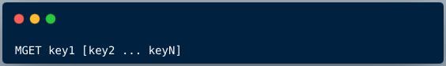

> @Author  : Lewis Tian (taseikyo@gmail.com)
>
> @Link    : github.com/taseikyo
>
> @Range   : 2025-03-18 - 2025-03-18

# Weekly #87

[readme](../README.md) | [previous](202410W5.md) | [next](202411W2.md)

\**Photo by [Serenay Tosun](https://unsplash.com/@serenaytosun) on [Unsplash](https://unsplash.com/photos/a-woman-walking-along-a-beach-next-to-the-ocean-_zsMDxFp9ZU)*

## Table of Contents

- [algorithm](#algorithm-)
- [review](#review-)
	- Redis 批量查询技巧
	- 大数据平台架构——框架篇
- [tip](#tip-)
- [share](#share-)

## algorithm [🔝](#weekly-87)

## review [🔝](#weekly-87)

### 1. [Redis 批量查询技巧](https://www.cnblogs.com/kukuxjx/p/18017252)

#### 1.  前言

Redis，我们做开发的想必都用过，他是一种缓存，主要用于快速响应结果嘛。比如我们要获取商品的详情，有日销量、月销量、库存数量、评价数量，这些数据都在 Redis 缓存中，那么我们是要拿四趟？还是一趟呢？当然是一趟最好呀。接下来我们来看看为什么我们要一趟这么做，以及怎么做。

#### 2. 为什么需要批量执行命令

我们看一下交互过程：

每次客户端发送一个一个请求命令，Redis 服务端接收到命令后，将命令放在队列内，一个一个命令执行，并将结果返回。

批量执行命令有三点优势：

- 提高命令执行效率，减少了网络延迟，从而提高了 Redis 服务器的响应速度。批量执行减少了每个命令的单独网络传输开销，有效降低了往返时间（RTT）。
- 简化客户端逻辑，通过将多个命令封装成一个操作，客户端的处理逻辑变得更加简洁和清晰。这使得客户端代码更易读、易维护。
- 提升事务性能，批量执行命令能够确保一组命令在同一时间内执行，从而提高了事务的性能。这对于需要保持原子性的操作尤为重要，确保一组命令要么全部执行成功，要么全部失败。

接下来，我们详细讲解批量查询的四种方式。

- 字符串 MGET 命令
- 哈希表 HMGET 命令
- 管道技术
- Lua 脚本

#### 3. 批量查询

3.1、字符串 MGET 命令

MGET 接受一个或多个键作为参数，返回与这些键关联的值。

- key1, key2, ..., keyN：要获取值的键列表。
- MGET 返回一个包含相应值的列表，如果键不存在，则对应的位置返回 nil。

3.2、哈希表 HMGET 命令

HMGET 接受一个哈希表的键以及一个或多个字段名作为参数，返回与这些字段名关联的值。

如果给定的域不存在于哈希表，那么返回一个 nil 值。

3.3、管道技术

Redis Pipeline（管道）命令是一种优化网络通信的技术，可以将多个命令一次性发送给 Redis 服务器，可以减少客户端与 Redis 服务器之间的网络通信次数。

客户端将多个命令一次性发送给 Redis 服务器，Redis 服务器缓存这些命令，并一次性执行，最后将执行结果一次性返回给客户端。

通过使用 Redis Pipeline，显而易见的好处是避免了在每个命令执行时都进行一次网络通信，从而显著降低了时间开销。

**1 次 pipeline（n条命令） = 1 次网络时间 + 执行n 条命令时间**

3.4、Lua 脚本

Redis Lua 脚本是一种在 Redis 服务器上执行的脚本语言，基于 Lua 编程语言。

这种脚本可以包含多个 Redis 命令，而且它们在 Redis 服务器上以原子性操作的方式执行。通过使用 Lua 脚本，你可以在服务器端执行一系列的 Redis 命令，而不需要将它们一条一条地发送到服务器。

Redis 执行 Lua 脚本有两种执行方式：Eval 和 EvalSHA 。

3.4.1、Eval

EVAL命令的执行过程主要可以分为三个步骤：

1. 根据客户端提供的 Lua 脚本，在 Lua 环境中定义一个 Lua 函数。Lua 函数的名称实际上是以 "f_" 为前缀加上脚本本身计算出的 SHA1 值，例如 f_ddfsdfjgjbg33rndgj00，其中 SHA1 的长度为 40 字符。函数体则是脚本本身。
2. 将客户端提供的脚本保存到 lua_scripts 字典中。简单来说，就是添加一个键值对，其中键是 Lua 脚本的 SHA1 校验和，值是 Lua 脚本本身。这主要是为了以后能够复用这个脚本。
3. 执行第一步在 Lua 环境中定义的函数，从而执行客户端提供的 Lua 脚本。这个过程利用了在步骤二中保存的 SHA1 校验和来调用对应的 Lua 函数。

这个流程使得 Redis 能够高效地处理客户端提供的 Lua 脚本，同时通过缓存 SHA1 校验和，可以减少重复传输脚本的开销，提高效率。

在 Redis 中，使用了 Key 列表和参数列表来为 Lua 脚本提供更多的灵活性，执行 Eval 命令的格式为：

下图演示下 Lua 如何调用 Redis 命令 ，通过 `redis.call()` 来执行了 Redis 命令 。

3.4.2、EvalSHA

与 EVAL 不同，EVALSHA 的主要目的是通过脚本的 SHA1 校验和来执行预先在服务器端加载的 Lua 脚本，从而避免重复传输脚本的开销。

使用步骤：

（1）加载 Lua 脚本到 Redis 服务端：

首先，将 Lua 脚本加载到 Redis 服务端。这可以通过 SCRIPT LOAD 命令完成。执行 SCRIPT LOAD 后，会返回一个 SHA1 校验和，该值唯一标识了加载的 Lua 脚本。

这会返回 SHA1 校验和: a1104f2250e5dd9fc10c3c681ddb389e7bd4a2cf。

（2）执行 Lua 脚本：

一旦 Lua 脚本被加载并获得了 SHA1 校验和，之后就可以使用 EVALSHA 命令来执行该脚本。

### 2. [大数据平台架构——框架篇](https://zhuanlan.zhihu.com/p/653973251)

#### 一、大数据平台介绍

首先，先解释下大数据的 5V 特征：

- 数据量大：一般以 P（1000 个 TB）、E（100 万个 TB）或 Z（10 亿个 TB）为计量单位
- 数据类型繁多：包括结构化、半结构化和非结构化的数据，数据来源多样，文本、日志、视频、图片、地理位置等；
- 价值密度低：大数据所具备的巨大体量，使其所包含信息较少。因此需要利用通过数据分析与机器学习更快速的挖掘出有价值的数据，带来更多的商业价值。
- 速度快：数据增长速度快、并要求处理速度快、对时效性要求也高，海量数据的处理需求不再局限在离线计算当中。
- 真实性：数据的真实性和可信赖度差异较大，因此数据分析的精确度也有所不同。

大数据平台本质上就是对海量数据从采集、存储、计算、应用、管理、运维的多方位、多维度的组合研究设计，从而建设合理、高效的大数据平台架构。

#### 二、大数据存储计算

1、那我们先讲讲最核心的大数据存储和计算吧。
这里就不得不引入 Hadoop 这个框架。Hadoop 是大数据存储和计算的鼻祖了，现在大多开源的大数据框架都依赖 Hadoop 或者与它能很好的兼容。

关于 Hadoop，我们需要了解他们是什么、什么原理、使用场景、如何使用：

- HDFS、MapReduce
- NameNode、DataNode
- JobTracker、TaskTracker
- Yarn、ResourceManager、NodeManager

2、对于大数据的处理，我们必须了解和会使用的就是 SQL。

使用 SQL 处理分析 Hadoop 上的数据，方便、高效、易上手、更是趋势。不论是离线计算还是实时计算，越来越多的大数据处理框架都在积极提供 SQL 接口。

而 Hive 则是数据仓库工具。通过 Hive 命令行可以对数据进行创建表、删除表、往表中加载数据、分区、将表中数据下载到本地等操作。

至此，通过上面的知识学习，我们已经了解到，HDFS 是 Hadoop 提供的分布式存储框架，它可以用来存储海量数据，MapReduce 是 Hadoop 提供的分布式计算框架，它可以用来统计和分析 HDFS 上的海量数据，而 Hive 则是 SQL On Hadoop，Hive 提供了 SQL 接口，开发人员只需要编写简单易上手的 SQL 语句，Hive 负责把 SQL 翻译成 MapReduce，提交运行。

此时我们认知中的关于大数据平台架构至少包含以下部分：

Hive 把 MapReduce 作为执行引擎，会发现其实执行会有些慢，所以很多 SQL on Hadoop 的框架越来越多，目前主流的开源 OLAP 计算引擎包括：Sparksql、Presto、Kylin、Impala、Druid、Clickhouse 等。因此这几个框架也扩充了数据计算层的多样性。

#### 三、大数据采集

那我们如何将数据存储到 HDFS 上呢？这里就需要涉及数据的采集、转化、加载了。我们知道数据的来源多种多样，结构化的、半结构化和非结构化的，不同数据源也就会有不同的采集工具。例如：

- Hadoop 框架自带的命令：HDFS PUT 命令、HDFS API
- Sqoop：是一个主要用于 Hadoop/Hive 与传统关系型数据库 Oracle/MySQL/SQLServer 等之间进行数据交换的开源框架。就像 Hive 把 SQL 翻译成 MapReduce 一样，Sqoop 把你指定的参数翻译成 MapReduce，提交到 Hadoop 运行，完成 Hadoop 与其他数据库之间的数据交换。
- Flume：是一个分布式的海量日志采集和传输框架，因为 “采集和传输框架”，所以它并不适合关系型数据库的数据采集和传输。Flume 可以实时的从网络协议、消息系统、文件系统采集日志，并传输到 HDFS 上。因此，如果你的业务有这些数据源的数据，并且需要实时的采集，那么就应该考虑使用 Flume。
- Data X：阿里开源的关系性数据库采集交换数据的工具

此时我们认知中关于大数据平台架构会包含：

#### 四、大数据应用

以上我们已经了解了大数据从采集、存储、计算的技术架构和原理了，接下来我们就可以将计算好的数据同步和应用到其他系统中去。而这一步反向数据输出的技术工具可以是和我们数据采集转换时使用的工具是一样的，也可以是计算层的使用的框架。
而对于数据的应用，根据不同的业务属性和场景，大致会分为 BI 平台、应用系统、数据开发平台、数据分析挖掘等。具体数据应用的细分可以参考：[Amy 随笔记：应用数据产品合集](https://zhuanlan.zhihu.com/p/639957114)

至此，大数据架构就会包含：

#### 五、实时和离线

关于大数据的应用场景，我们知道有时候需要离线数据就可以了，但有些时候也需要实时的数据，所以我们在大数据的存储、计算时，同样也需要离线和实时的两套方案。

关于离线数据存储，我们就主要会依赖数仓分层建模的方式进行数据存储，详细细节可参考：Amy 随笔记：数仓分层建模

关于实时数据传输，目前比较主流的就是使用 Kafka 框架，它是一种分布式发布订阅消息的系统，用来处理流数据。这种架构下，将数据分为生产者和消费者。实时的场景下，Kafka 充当着将数据从生产者流通到消费者的管道角色，借此吞吐量大的优势，以此实现数据及时获取和传输。离线的场景下，HDFS 也可以作为数据其中消费者，通过 Kafka 将数据同步到 HDFS。

而对于实时的数据计算，其实也分为绝对实时和准实时两种场景。绝对实时的延迟要求一般在毫秒级，准实时的延迟要求一般在秒、分钟级。对于需要绝对实时的业务场景，用的比较多的是 Storm，对于其他准实时的业务场景，可以是 Storm，也可以是 Spark Streaming、Flink。至此，大数据平台架构演变成了：

#### 六、大数据任务调度

以上你会发现大数据平台的任务越来越多了，不仅仅是分析任务，数据采集、数据交换同样是一个个的任务。这些任务中，有的是定时触发，有的则需要依赖其他任务来触发。当平台中有几百上千个任务需要维护和运行时候，仅仅靠 crontab 这样简单的脚本执行任务是远远不够了，这时便需要一个调度监控系统来完成这件事。调度监控系统是整个数据平台的中枢系统，类似于 AppMaster，负责分配和监控任务。像这样的框架常用的就有 Apache Oozie、Azkaban 㩐。这时数据架构就会包含：

#### 七、大数据监控和管理

截止当前，我们了解了大数据从采集、存储、计算、应用的整个过程。但在这个过程中，程序任务是可能会出现很多问题的，例如：

1. 需要知道在数据流水线的任何步骤中数据都不会丢失。因此，你需要监控每个程序正在处理的数据量，以便尽快检测到任何异常;
2. 需要有对数据质量进行测试的机制，以便在数据中出现任何意外值时，你接收到告警信息;
3. 需要监控应用程序的运行时间，以便每个数据源都有一个预定义的 ETA，并且会对延迟的数据源发出警报;
4. 需要管理数据血缘关系，以便我们了解每个数据源的生成方式，以便在出现问题时，我们知道哪些数据和结果会受到影响;
5. 需要系统自动处理合法的元数据变更，并能够发现和报告非法元数据变更;
6. 需要对应用程序进行版本控制并将其与数据相关联，以便在程序更改时，我们知道相关数据如何相应地更改。

就此我们发现，我们需要对数据进行全方位的管理，包括数据监控、数据质量检测、元数据管理、血缘关系管理、异常处理、版本控制。

这里涉及到监控预警的平台例如 grafana、promethus 等；

保证数据质量，数据治理是比不可少的，这里涉及元数据管理、血缘关系管理、数据标准管理等的数据治理平台例如 Altas、Data Hub 等，当然各企业也可以是自研的管理平台和工具。

就此，数据架构就会包含如下：

#### 八、大数据安全

除此之外，数据的安全是必不可少的，仅包含用户访问权限、数据资源权限管理、审计等。目前市面上也有这样的框架，例如 Apache Ranger、Sentry 等

#### 九、云基础架构

随着业务的发展，各种大数据应用程序或任务被添加到大数据系统中后，你会发现配置机器和设置生产部署的过程非常繁琐，并且有很多的坑要踩。这个时候可能就需要考虑一下云计算平台了。通过在统一框架中运行，利用云计算易于配置和部署，弹性扩展，资源隔离，高资源利用率，高弹性，自动恢复等优势，它们将大大降低复杂性并提高运行效率。例如云基础架构 K8S。此时，大数据平台架构就变成了：

## tip [🔝](#weekly-87)

## share [🔝](#weekly-87)

[readme](../README.md) | [previous](202410W5.md) | [next](202411W2.md)
