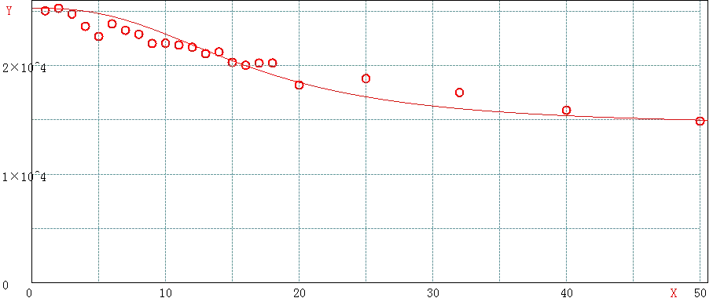

> @Author  : Lewis Tian (taseikyo@gmail.com)
>
> @Link    : github.com/taseikyo
>
> @Range   : 2024-11-10 - 2024-11-16

# Weekly #88

[readme](../README.md) | [previous](202411W1.md) | [next](202411W3.md)


\**Photo by [Kevin Wang](https://unsplash.com/@kevin_w_) on [Unsplash](https://unsplash.com/photos/a-rocky-coast-covered-in-yellow-flowers-and-fog-WvppfLb8CRQ)*

## Table of Contents

- [algorithm](#algorithm-)
- [review](#review-)
	- Redis MGET 性能衰减分析
    - 瞧瞧别人家的 API 接口，那叫一个优雅
    - Golang 自定义 error 避坑实践
- [tip](#tip-)
- [share](#share-)

## algorithm [🔝](#weekly-88)

## review [🔝](#weekly-88)

### 1. [Redis MGET 性能衰减分析](https://www.jianshu.com/p/172b39244c85)

MGET是 redis 中较为常用的命令，用来批量获取给定 key 对应的 value。因为 redis 使用基于 RESP (REdis Serialization Protocol) 协议的 rpc 接口，而 redis 本身的数据结构非常高效，因此在日常使用中，IO 和协议解析是个不容忽略的资源消耗。通过 mget 将多个 get 请求汇聚成一条命令，可以大大降低网络、rpc 协议解析的开销，从而大幅提升缓存效率。mget的定义如下：

```Bash
MGET key [key ...]
返回所有(一个或多个)给定 key 的值。
如果给定的 key 里面，有某个 key 不存在，那么这个 key 返回特殊值 nil 。因此，该命令永不失败。

返回值：
    一个包含所有给定 key 的值的列表。q

例：
    redis> SET redis redis.com
    OK
    redis> SET mongodb mongodb.org
    OK
    redis> MGET redis mongodb
    1) "redis.com"
    2) "mongodb.org"
```

但是，在某些需要一次批量查询大量 key 的场景下，我们会发现mget并没有想象中的那么完美。

以电商库存系统（或价格系统）为例，作为原子级的服务，我们经常要面对商品列表页、活动页、购物车、交易等系统的批量查询，一次请求中动辄包含几十甚至上百个 sku，此时mget是否还能像我们想象中那般保持极高的吞吐？

我们先来设计一个实验，探一探mget性能的底。


#### 1 实验设计

在本地进行了压测模拟，redis key 设计：

- key 为 string 类型，固定为八位数字字符串以模拟 SKU ID，不足 8 位者高位填 0
- value 为 5 位整型数字，模拟商品库存
- 实验中将 SKU ID 设置为 1～500000 的数字

单元测试代码设计原则：

- 可以方便地调整测试参数
- 尽量减少 GC 对结果的影响，设置合适的堆空间和垃圾回收器

压测代码做了局部优化以尽量保证结果的准确性，包括：

- 针对每一轮压测，提前准备好随机的 key 列表，避免随机生成 key 列表时大量的内存操作对测试结果造成影响
- 每一轮压测统计多次 mget 的平均执行时间
- 每一轮压测完成后，强制触发 fullgc，尽量避免在压测进行中发生 gc

```Java
@Test
public void testRedisMultiGetPerformance() {
    final int[] keyLens = new int[]{1, 2, 3, 4, 5, ..., 10000 };
    for(int keyLen : keyLens){
        noTransactionNoPipelineMultiGetWithSpecifiedKeyList(getPreparedKeys(keyLen));
    }
}
// 在mget前准备好随机的key列表
private List<String[]> getPreparedKeys(int keyLen, int loopTimes) {
    int loopTimes = 1000;
    if(keyLen<10) loopTimes *= 100;
    else if (keyLen<100) loopTimes *= 50;
    else if (keyLen<500) loopTimes *= 10;
    else if (keyLen<1000) loopTimes *= 5;
    return generateKeys(keyLen, i);
}
// 生成 times 组不同的 String[] keys ，每组keys长度为 keyLen
private List<String[]> generateKeys(int keyLen, int times) {
    List<String[]> keysList = new ArrayList<String[]>(times);
    for(int i=0; i<times; i++) {
        String[] keys = new String[keyLen];
        for(int j=0; j<keyLen; j++) {
            keys[j] = String.valueOf(RandomUtils.nextInt(keyCounter.get()));
        }
        keysList.add(keys);
    }
    return keysList;
}
// 根据预先生成的key列表通过mget取value并计算和打印平均时间
public void noTransactionNoPipelineMultiGetWithSpecifiedKeyList(List<String[]> keysList) {
    Jedis jedis = pool.getResource();
    long meanTime = 0;
    try {
        long start = System.currentTimeMillis();
        for (String[] keys: keysList) {
            jedis.mget(keys);
        }
        meanTime += System.currentTimeMillis() - start;
    } catch (Exception e) {
        logger.error("", e);
    }finally {
        jedis.close();
        logger.info("{} | {} | {} | {} | {} | |"
                , String.format("%5d", keysList.get(0).length)
                , String.format("%5.3f", meanTime / Float.valueOf(keysList.size()))
                , String.format("%9.3f", Float.valueOf(keysList.size()) * 1000 / meanTime)
                , String.format("%5s", 5*keysList.get(0).length)
                , String.format("%7s", keysList.size()));
        // force gc 降低在压测进行中出现gc的概率
        System.gc();
    }
}
```

#### 2 JVM 调优

考虑到 redis 平均响应时间在 0.1ms 以内，而一次 minor gc 一般需要耗时 50ms 以上，而 full gc 更可能耗费数秒，因此需要格外注意压测时的 jvm 内存设置和 GC 配置。

经过调试，设置 Java 启动参数：-Xms3g -Xmx3g -XX:+UseG1GC -XX:MaxNewSize=1g -server -XX:MaxTenuringThreshold=1时，在本实验中可以获得理想的结果。

通过下面 jstat 日志可以看出，实验过程中没有出现 minor gc，每一轮结束后强制进行一次 full gc，full gc 触发次数与压测轮数一致。因此测试中统计的时间仅包含了 redis 响应时间和相关代码执行时间 (在性能越高的场景下，代码执行时间相对影响越大)。

```Bash
jinlu$ jstat -gcutil $(jps | grep AppMain | cut -d " " -f 1) 4000
S0     S1     E      O      M     CCS    YGC     YGCT    FGC    FGCT     GCT
0.00 100.00  24.82  20.75  97.13  93.88      9    0.719     0    0.000    0.719
0.00 100.00   2.42  31.50  97.16  93.88     12    0.746     0    0.000    0.746
0.00   0.00   1.39  28.67  98.06  94.73     12    0.746     1    1.832    2.579
0.00   0.00   7.90   0.08  98.12  94.78     12    0.746     2    2.104    2.850
...
0.00   0.00   9.49   0.07  95.66  95.10     13    1.035    33    5.245    6.280
0.00 100.00  16.90  18.24  95.66  95.10     14    1.375    34    5.307    6.683
0.00 100.00  42.14  23.35  95.66  95.10     15    1.425    34    5.307    6.733
```

另外，为了保证结果的可靠性，整个测试期间，通过 top 对系统性能进行监控，结果如下：

- redis CPU 占用率很高但未饱和，即没有出现 redis 性能饱和导致的响应变慢
- java 进程的 CPU 占用率维持在 30% 上下，表明 java 代码没有遇到瓶颈，时间主要用于等待 redis 返回 mget 结果。

可见压测过程中，redis 的 CPU 占比保持在 50%～80% 但没有饱和，java 进程的 cpu 保持 30%～50%。因此不存在因为 CPU 导致的响应变慢，结果完全反应在中重度压力下 redis 对mget的处理能力。压测过程中抓取的 top 图如下：


#### 3 实验结果

通过针对不同的mgetkey 长度进行多轮压测，得到不同的 key 长度下 redis 响应能力表如下：

| keyLen | 耗时 ms | qps | % | lg(keyLen) |  | keyLen | 耗时 ms | qps | % | lg(keyLen) |
|---|---|---|---|---|---|---|---|---|---|---|
| 1 | 0.040 | 25056.377 | 100 | 0.000 |  | 18 | 0.049 | 20242.914 | 80.7 | 1.255 |
| 2 | 0.040 | 25284.449 | 100 | 0.301 |  | 20 | 0.055 | 18214.936 | 72.7 | 1.301 |
| 3 | 0.040 | 24752.475 | 99.8 | 0.477 |  | 25 | 0.053 | 18811.137 | 75.0 | 1.398 |
| 4 | 0.042 | 23618.328 | 94.2 | 0.602 |  | 32 | 0.057 | 17525.412 | 70.0 | 1.505 |
| 5 | 0.044 | 22696.322 | 90.6 | 0.699 |  | 40 | 0.063 | 15888.147 | 63.4 | 1.602 |
| 6 | 0.042 | 23849.273 | 95.2 | 0.778 |  | 50 | 0.067 | 14889.815 | 59.4 | 1.699 |
| 7 | 0.043 | 23255.814 | 92.8 | 0.845 |  | 60 | 0.075 | 13276.687 | 53.0 | 1.778 |
| 8 | 0.044 | 22888.533 | 91.3 | 0.903 |  | 80 | 0.091 | 10979.358 | 43.8 | 1.903 |
| 9 | 0.045 | 22040.996 | 88.0 | 0.954 |  | 100 | 0.096 | 10405.827 | 41.5 | 2.000 |
| 10 | 0.045 | 22065.313 | 88.0 | 1.000 |  | 200 | 0.161 | 6211.180 | 24.8 | 2.301 |
| 11 | 0.046 | 21901.008 | 87.4 | 1.041 |  | 500 | 0.348 | 2871.913 | 11.5 | 2.699 |
| 12 | 0.046 | 21691.975 | 86.6 | 1.079 |  | 800 | 0.552 | 1812.251 | 7.2 | 2.903 |
| 13 | 0.047 | 21105.951 | 84.2 | 1.114 |  | 1000 | 0.639 | 1564.945 | 6.2 | 3.000 |
| 14 | 0.047 | 21258.504 | 84.4 | 1.146 |  | 2000 | 1.201 | 832.639 | 3.3 | 3.301 |
| 15 | 0.049 | 20300.447 | 81.0 | 1.176 |  | 5000 | 3.140 | 318.471 | 1.2 | 3.699 |
| 16 | 0.050 | 20032.051 | 79.9 | 1.204 |  | 8000 | 5.297 | 188.786 | 0.7 | 3.903 |
| 17 | 0.049 | 20234.723 | 80.8 | 1.230 |  | 10000 | 6.141 | 162.840 | 0.6 | 4.000 |


3.1、单次 mget 的 key 数目在 50 以内时

- 一次操作 10 个 key 的性能达到一次操作 1 个 key 的 88%
- 一次操作 20 个 key 的性能达到一次操作 1 个 key 的 72%
- 一次操作 50 个 key 的性能达到一次操作 1 个 key 的 59%



keyLen<50 曲线拟合

可以看出，此时 redis 整体响应非常好，包含 50 个以内的 key 时，mget既可以保持高 qps，又可以大幅提升吞吐量。

3.2、单次 mget 的 key 数目在 100 以内时

- 一次操作 60 个 key 的性能达到一次操作 1 个 key 的 53%
- 一次操作 80 个 key 的性能达到一次操作 1 个 key 的 43%
- 一次操作 100 个 key 的性能大道一次操作 1 个 key 的 41%


keyLen<100 曲线拟合

单次操作 key 数量在 100 以内时，性能大概能达到 redis 最大性能的 40% 以上，考虑到 key 的吞吐量，这样做是有足够的收益的，但是需要清楚当前场景下单个 redis 实例的最大吞吐量，必要时需要进行分片以提高系统整体性能。

3.3、单次 mget 的 key 数目在 1000 以内

- 一次操作 200 个 key 的性能只能达到一次操作 1 个 key 的 25%，大约是一次处理 100 个 key 的 60%
- 一次操作 500 个 key 的性能只能达到一次操作 1 个 key 的 11%，大约是一次处理 100 个 key 的 28%
- 一次操作 800 个 key 的性能只能达到一次操作 1 个 key 的 7%，大约是一次处理 100 个 key 的 17%


keyLen<1000 曲线拟合

可见，虽然相比较较少的 key，单次请求处理更多的 key 还是有性能上的微弱优势，但是此时性能衰减已经比较严重，此时的 redis 实例不在是那个动辄每秒几万 qps 的超人了，可能从性能上来说可以接受，但是我们要清楚此时 redis 的响应能力，并结合业务场景并考虑是否需要通过其他手段来为 redis 减负，比如分片、读写分离、多级缓存等。

3.4 单次 mget 的 key 数目在 1000 以上

性能急剧恶化，即使在高性能服务器上，这样的操作在单 redis 实例上也只能维持在千上下，此时单次请求的响应时间退化到与 key 数目成正比。除非你确定需要这么做，否则就要尽量避免如此多的 key 的批量获取，而应该从业务上、架构上考虑这么做的必要性。


keyLen>1000 曲线拟合

3.5、请求时间与 key 数目对数的关系

对 mget 的 key 数目取对数，可以得到如下曲线。

log10(keyLen) and keyLen<10000


【注意】 x 轴为 key 的数目对 10 取对数，即 log10(keyLen)

- 当 key 数目在 10 以内时，mget 性能下降趋势非常小，性能基本上能达到 redis 实例的极限
- 当 key 数目在 10～100 之间时，mget 性能下降明显，需要考虑 redis 性能衰减对系统吞吐的影响
- 当 key 数目在 100 以上时，mget 性能下降幅度趋缓，此时 redis 性能已经较差，不建议使用在 OLTP 系统中，或者需要考虑其他手段来提升性能。

### 2. [瞧瞧别人家的 API 接口，那叫一个优雅](https://www.cnblogs.com/12lisu/p/16976923.html)

#### 前言

在实际工作中，我们需要经常跟第三方平台打交道，可能会对接第三方平台 API 接口，或者提供 API 接口给第三方平台调用。

那么问题来了，如果设计一个优雅的 API 接口，能够满足：安全性、可重复调用、稳定性、好定位问题等多方面需求？

今天跟大家一起聊聊设计 API 接口时，需要注意的一些地方，希望对你会有所帮助。

#### 1. 签名


为了防止 API 接口中的数据被篡改，很多时候我们需要对 API 接口做签名。

接口请求方将请求参数 + 时间戳 + 密钥拼接成一个字符串，然后通过 md5 等 hash 算法，生成一个前面 sign。

然后在请求参数或者请求头中，增加 sign 参数，传递给 API 接口。

API 接口的网关服务，获取到该 sign 值，然后用相同的请求参数 + 时间戳 + 密钥拼接成一个字符串，用相同的 m5 算法生成另外一个 sign，对比两个 sign 值是否相等。

如果两个 sign 相等，则认为是有效请求，API 接口的网关服务会将给请求转发给相应的业务系统。

如果两个 sign 不相等，则 API 接口的网关服务会直接返回签名错误。

问题来了：签名中为什么要加时间戳？

答：为了安全性考虑，防止同一次请求被反复利用，增加了密钥没破解的可能性，我们必须要对每次请求都设置一个合理的过期时间，比如：15 分钟。

这样一次请求，在 15 分钟之内是有效的，超过 15 分钟，API 接口的网关服务会返回超过有效期的异常提示。

目前生成签名中的密钥有两种形式：

一种是双方约定一个固定值 privateKey。

另一种是 API 接口提供方给出 AK/SK 两个值，双方约定用 SK 作为签名中的密钥。AK 接口调用方作为 header 中的 accessKey 传递给 API 接口提供方，这样 API 接口提供方可以根据 AK 获取到 SK，而生成新的 sgin。

#### 2. 加密

有些时候，我们的 API 接口直接传递的非常重要的数据，比如：用户的银行卡号、转账金额、用户身份证等，如果将这些参数，直接明文，暴露到公网上是非常危险的事情。

由此，我们需要对数据进行加密。

目前使用比较多的是用BASE64加解密。

我们可以将所有的数据，安装一定的规律拼接成一个大的字符串，然后在加一个密钥，拼接到一起。

然后使用 JDK1.8 之后的 Base64 工具类处理，效果如下：

```Bash
【加密前的数据】www.baidu.com
【加密后的数据】d3d3LmJhaWR1LmNvbQ==
```

为了安全性，使用 Base64 可以加密多次。

API 接口的调用方在传递参数时，body 中只有一个参数 data，它就是 base64 之后的加密数据。

API 接口的网关服务，在接收到 data 数据后，根据双方事先预定的密钥、加密算法、加密次数等，进行解密，并且反序列化出参数数据。

#### 3. ip 白名单

为了进一步加强 API 接口的安全性，防止接口的签名或者加密被破解了，攻击者可以在自己的服务器上请求该接口。

需求限制请求ip，增加ip白名单。

只有在白名单中的 ip 地址，才能成功请求 API 接口，否则直接返回无访问权限。

ip 白名单也可以加在 API 网关服务上。

但也要防止公司的内部应用服务器被攻破，这种情况也可以从内部服务器上发起 API 接口的请求。

这时候就需要增加 web 防火墙了，比如：ModSecurity 等。

#### 4. 限流

如果你的 API 接口被第三方平台调用了，这就意味着着，调用频率是没法控制的。

第三方平台调用你的 API 接口时，如果并发量一下子太高，可能会导致你的 API 服务不可用，接口直接挂掉。

由此，必须要对 API 接口做限流。

限流方法有三种：

- 对请求 ip 做限流：比如同一个 ip，在一分钟内，对API接口总的请求次数，不能超过 10000 次。
- 对请求接口做限流：比如同一个 ip，在一分钟内，对指定的API接口，请求次数不能超过 2000 次。
- 对请求用户做限流：比如同一个AK/SK用户，在一分钟内，对 API 接口总的请求次数，不能超过 10000 次。

我们在实际工作中，可以通过nginx，redis或者gateway实现限流的功能。

#### 5. 参数校验

我们需要对 API 接口做参数校验，比如：校验必填字段是否为空，校验字段类型，校验字段长度，校验枚举值等等。

这样做可以拦截一些无效的请求。

比如在新增数据时，字段长度超过了数据字段的最大长度，数据库会直接报错。

但这种异常的请求，我们完全可以在 API 接口的前期进行识别，没有必要走到数据库保存数据那一步，浪费系统资源。

有些金额字段，本来是正数，但如果用户传入了负数，万一接口没做校验，可能会导致一些没必要的损失。

还有些状态字段，如果不做校验，用户如果传入了系统中不存在的枚举值，就会导致保存的数据异常。

由此可见，做参数校验是非常有必要的。

在 Java 中校验数据使用最多的是hiberate的Validator框架，它里面包含了 @Null、@NotEmpty、@Size、@Max、@Min 等注解。

用它们校验数据非常方便。

当然有些日期字段和枚举字段，可能需要通过自定义注解的方式实现参数校验。

#### 6. 统一返回值

我之前调用过别人的 API 接口，正常返回数据是一种 json 格式，比如：

```Bash
{
    "code":0,
    "message":null,
    "data":[{"id":123,"name":"abc"}]
},
```

签名错误返回的 json 格式：

```Bash
{
    "code":1001,
    "message":"签名错误",
    "data":null
}
```

没有数据权限返回的 json 格式：

```bash
{
    "rt":10,
    "errorMgt":"没有权限",
    "result":null
}
```

这种是比较坑的做法，返回值中有多种不同格式的返回数据，这样会导致对接方很难理解。

出现这种情况，可能是 API 网关定义了一直返回值结构，业务系统定义了另外一种返回值结构。如果是网关异常，则返回网关定义的返回值结构，如果是业务系统异常，则返回业务系统的返回值结构。

但这样会导致 API 接口出现不同的异常时，返回不同的返回值结构，非常不利于接口的维护。

其实这个问题我们可以在设计API网关时解决。

业务系统在出现异常时，抛出业务异常的 RuntimeException，其中有个 message 字段定义异常信息。

所有的 API 接口都必须经过 API 网关，API 网关捕获该业务异常，然后转换成统一的异常结构返回，这样能统一返回值结构。

#### 7. 统一封装异常

我们的 API 接口需要对异常进行统一处理。

不知道你有没有遇到过这种场景：有时候在 API 接口中，需要访问数据库，但表不存在，或者 sql 语句异常，就会直接把 sql 信息在 API 接口中直接返回。

返回值中包含了异常堆栈信息、数据库信息、错误代码和行数等信息。

如果直接把这些内容暴露给第三方平台，是很危险的事情。

有些不法分子，利用接口返回值中的这些信息，有可能会进行 sql 注入或者直接脱库，而对我们系统造成一定的损失。

因此非常有必要对 API 接口中的异常做统一处理，把异常转换成这样：

```Bash
{
    "code":500,
    "message":"服务器内部错误",
    "data":null
}
```

返回码code是500，返回信息message是服务器内部异常。

这样第三方平台就知道是 API 接口出现了内部问题，但不知道具体原因，他们可以找我们排查问题。

我们可以在内部的日志文件中，把堆栈信息、数据库信息、错误代码行数等信息，打印出来。

我们可以在gateway中对异常进行拦截，做统一封装，然后给第三方平台的是处理后没有敏感信息的错误信息。

#### 8. 请求日志

在第三方平台请求你的 API 接口时，接口的请求日志非常重要，通过它可以快速的分析和定位问题。

我们需要把 API 接口的请求 url、请求参数、请求头、请求方式、响应数据和响应时间等，记录到日志文件中。

最好有traceId，可以通过它串联整个请求的日志，过滤多余的日志。

当然有些时候，请求日志不光是你们公司开发人员需要查看，第三方平台的用户也需要能查看接口的请求日志。

这时就需要把日志落地到数据库，比如：mongodb 或者 elastic search，然后做一个 UI 页面，给第三方平台的用户开通查看权限。这样他们就能在外网查看请求日志了，他们自己也能定位一部分问题。

#### 9. 幂等设计

第三方平台极有可能在极短的时间内，请求我们接口多次，比如：在 1 秒内请求两次。有可能是他们业务系统有 bug，或者在做接口调用失败重试，因此我们的 API 接口需要做幂等设计。

也就是说要支持在极短的时间内，第三方平台用相同的参数请求 API 接口多次，第一次请求数据库会新增数据，但第二次请求以后就不会新增数据，但也会返回成功。

这样做的目的是不会产生错误数据。

我们在日常工作中，可以通过在数据库中增加唯一索引，或者在redis保存requestId和请求参来保证接口幂等性。

#### 10. 限制记录条数

对于对我提供的批量接口，一定要限制请求的记录条数。

如果请求的数据太多，很容易造成 API接口超时等问题，让 API 接口变得不稳定。

通常情况下，建议一次请求中的参数，最多支持传入 500 条记录。

如果用户传入多余 500 条记录，则接口直接给出提示。

建议这个参数做成可配置的，并且要事先跟第三方平台协商好，避免上线后产生不必要的问题。

#### 11. 压测

上线前我们务必要对 API 接口做一下压力测试，知道各个接口的qps情况。

以便于我们能够更好的预估，需要部署多少服务器节点，对于 API 接口的稳定性至关重要。

之前虽说对 API 接口做了限流，但是实际上 API 接口是否能够达到限制的阀值，这是一个问号，如果不做压力测试，是有很大风险的。

比如：你 API 接口限流 1 秒只允许 50 次请求，但实际 API 接口只能处理 30 次请求，这样你的 API 接口也会处理不过来。

我们在工作中可以用jmeter或者apache benc对 API 接口做压力测试。

#### 12. 异步处理

一般的 API 接口的逻辑都是同步处理的，请求完之后立刻返回结果。

但有时候，我们的 API 接口里面的业务逻辑非常复杂，特别是有些批量接口，如果同步处理业务，耗时会非常长。

这种情况下，为了提升 API 接口的性能，我们可以改成异步处理。

在 API 接口中可以发送一条mq消息，然后直接返回成功。之后，有个专门的mq消费者去异步消费该消息，做业务逻辑处理。

直接异步处理的接口，第三方平台有两种方式获取到。

第一种方式是：我们回调第三方平台的接口，告知他们 API 接口的处理结果，很多支付接口就是这么玩的。

第二种方式是：第三方平台通过轮询调用我们另外一个查询状态的 API 接口，每隔一段时间查询一次状态，传入的参数是之前的那个 API 接口中的 id 集合。

#### 13. 数据脱敏

有时候第三方平台调用我们 API 接口时，获取的数据中有一部分是敏感数据，比如：用户手机号、银行卡号等等。

这样信息如果通过 API 接口直接保留到外网，是非常不安全的，很容易造成用户隐私数据泄露的问题。

这就需要对部分数据做数据脱敏了。

我们可以在返回的数据中，部分内容用星号代替。

已用户手机号为例：182****887。

这样即使数据被泄露了，也只泄露了一部分，不法分子拿到这份数据也没啥用。

#### 14. 完整的接口文档

说实话，一份完整的 API 接口文档，在双方做接口对接时，可以减少很多沟通成本，让对方少走很多弯路。

接口文档中需要包含如下信息：

- 接口地址
- 请求方式，比如：post 或 get
- 请求参数和字段介绍
- 返回值和字段介绍
- 返回码和错误信息
- 加密或签名示例
- 完整的请求 demo
- 额外的说明，比如：开通 ip 白名单。

接口文档中最好能够统一接口和字段名称的命名风格，比如都用驼峰标识命名。

统一字段的类型和长度，比如：id 字段用 Long 类型，长度规定 20。status 字段用 int 类型，长度固定 2 等。

统一时间格式字段，比如：time 用 String 类型，格式为：yyyy-MM-dd HH:mm:ss。

接口文档中写明 AK/SK 和域名，找某某单独提供等。

### 3. [Golang 自定义 error 避坑实践](https://blog.csdn.net/justenjoyitpy/article/details/135845642)

熟悉 go 开发的朋友都知道，在 go 的设计中是推荐显示去处理 error 的。在使用时，通过建议函数返回一个 error 值，通过把返回的 error 变量与 nil 的比较，来判定操作是否成功。

go 中的 error 定义如下：

```go
type error interface {
    Error() string
}
```

原始的 error 被定义为 interface。

可以看出原生的 error 非常简单，只有 msg，但是一般业务开发上，我们还需要 code 信息。根据 go 的接口设计，只要我们实现了 Error() string 方法就可以实现自定义 error。

```go
package errors

import "fmt"

type myErr struct {
   code int
   msg  string
}

func (e myErr) Error() string {
   return fmt.Sprintf("code:%d,msg:%v", e.code, e.msg)
}

func New(code int, msg string) error {
   return myErr{
      code: code,
      msg:  msg,
   }
}

func GetCode(err error) int {
   if e, ok := err.(myErr); ok {
      return e.code
   }
   return -1
}

func GetMsg(err error) string {
   if e, ok := err.(myErr); ok {
      return e.msg
   }
   return ""
}
```

通过自定义一个 struct，并且实现 Error() string 方法，我们自定义了一个带 code 的 error。

这里需要注意，我们将 myErr 声明为小写开头，这样可以避免在在包外被直接声明，只允许通过函数 `New(code int, msg string)` 得到 error。

如果可以被在包外直接声明，会有什么问题呢？这就是本次要介绍的一个坑了。

请看下面这个例子：

```go
package main

import "fmt"

func main() {
   err := HelloWorld()
   fmt.Println(err == nil) //输出为false
}

func HelloWorld() error {
   var err *MyErr
   //do something
   return err
}

type MyErr struct {
   code int
   msg  string
}

func (e *MyErr) Error() string {
   return fmt.Sprintf("code:%d,msg:%v", e.code, e.msg)
}
```

我们会惊奇的发现 `err == nil` 输出为 `false`

这一切是由于 go 的 interface 设计导致的，go 将 interface 设计为了两部分：

- type
- value

其中，value 由一个任意的具体值表示，称作 interface 的 dynamic value ；而 type 则对应该 value 的类型（即 dynamic type）；例如对于对于 var a int = 3 来说，把 a 赋值给 interface 时， interface 是使用 (int, 3) 进行存储的。

当想判断 interface 的值为 nil时 ，则必须是其内部 value 和 type 均未设置的情况，即 (nil, nil) ；

那么回到上面的例子，当把 `var err *MyErr` 赋值给 interface 时，interface 的存储数据为 `(*MyErr, nil)` 。这个时候进行 nil 判断的结果肯定是 false。

所以当自定义 error 时，我们要尽可能的避免 error 可以被直接声明。通过提供函数的形式去生成 error。

一来可以避免上述的问题，二来可以屏蔽实现细节，可以更好的扩展。

## tip [🔝](#weekly-88)

## share [🔝](#weekly-88)

[readme](../README.md) | [previous](202411W1.md) | [next](202411W3.md)
