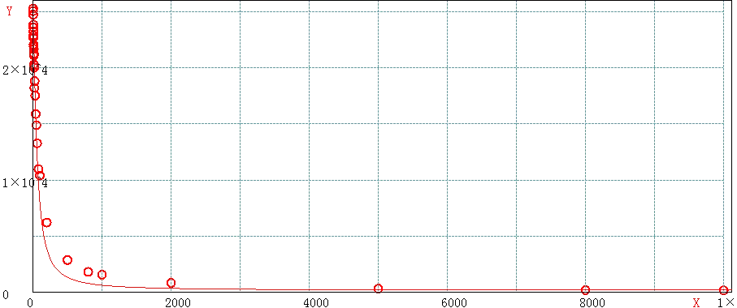

> @Author  : Lewis Tian (taseikyo@gmail.com)
>
> @Link    : github.com/taseikyo
>
> @Range   : 2024-11-10 - 2024-11-16

# Weekly #88

[readme](../README.md) | [previous](202411W1.md) | [next](202411W3.md)


\**Photo by Lewis Tian on Unsplash*

## Table of Contents

- [algorithm](#algorithm-)
- [review](#review-)
	- Redis MGET 性能衰减分析
- [tip](#tip-)
- [share](#share-)

## algorithm [🔝](#weekly-88)

## review [🔝](#weekly-88)

### 1. [Redis MGET 性能衰减分析](https://www.jianshu.com/p/172b39244c85)

MGET是 redis 中较为常用的命令，用来批量获取给定 key 对应的 value。因为 redis 使用基于 RESP (REdis Serialization Protocol) 协议的 rpc 接口，而 redis 本身的数据结构非常高效，因此在日常使用中，IO 和协议解析是个不容忽略的资源消耗。通过 mget 将多个 get 请求汇聚成一条命令，可以大大降低网络、rpc 协议解析的开销，从而大幅提升缓存效率。mget的定义如下：

```Bash
MGET key [key ...]
返回所有(一个或多个)给定 key 的值。
如果给定的 key 里面，有某个 key 不存在，那么这个 key 返回特殊值 nil 。因此，该命令永不失败。

返回值：
    一个包含所有给定 key 的值的列表。q

例：
    redis> SET redis redis.com
    OK
    redis> SET mongodb mongodb.org
    OK
    redis> MGET redis mongodb
    1) "redis.com"
    2) "mongodb.org"
```

但是，在某些需要一次批量查询大量 key 的场景下，我们会发现mget并没有想象中的那么完美。

以电商库存系统（或价格系统）为例，作为原子级的服务，我们经常要面对商品列表页、活动页、购物车、交易等系统的批量查询，一次请求中动辄包含几十甚至上百个 sku，此时mget是否还能像我们想象中那般保持极高的吞吐？

我们先来设计一个实验，探一探mget性能的底。


#### 1 实验设计

在本地进行了压测模拟，redis key 设计：

- key 为 string 类型，固定为八位数字字符串以模拟 SKU ID，不足 8 位者高位填 0
- value 为 5 位整型数字，模拟商品库存
- 实验中将 SKU ID 设置为 1～500000 的数字

单元测试代码设计原则：

- 可以方便地调整测试参数
- 尽量减少 GC 对结果的影响，设置合适的堆空间和垃圾回收器

压测代码做了局部优化以尽量保证结果的准确性，包括：

- 针对每一轮压测，提前准备好随机的 key 列表，避免随机生成 key 列表时大量的内存操作对测试结果造成影响
- 每一轮压测统计多次 mget 的平均执行时间
- 每一轮压测完成后，强制触发 fullgc，尽量避免在压测进行中发生 gc

```Java
@Test
public void testRedisMultiGetPerformance() {
    final int[] keyLens = new int[]{1, 2, 3, 4, 5, ..., 10000 };
    for(int keyLen : keyLens){
        noTransactionNoPipelineMultiGetWithSpecifiedKeyList(getPreparedKeys(keyLen));
    }
}
// 在mget前准备好随机的key列表
private List<String[]> getPreparedKeys(int keyLen, int loopTimes) {
    int loopTimes = 1000;
    if(keyLen<10) loopTimes *= 100;
    else if (keyLen<100) loopTimes *= 50;
    else if (keyLen<500) loopTimes *= 10;
    else if (keyLen<1000) loopTimes *= 5;
    return generateKeys(keyLen, i);
}
// 生成 times 组不同的 String[] keys ，每组keys长度为 keyLen
private List<String[]> generateKeys(int keyLen, int times) {
    List<String[]> keysList = new ArrayList<String[]>(times);
    for(int i=0; i<times; i++) {
        String[] keys = new String[keyLen];
        for(int j=0; j<keyLen; j++) {
            keys[j] = String.valueOf(RandomUtils.nextInt(keyCounter.get()));
        }
        keysList.add(keys);
    }
    return keysList;
}
// 根据预先生成的key列表通过mget取value并计算和打印平均时间
public void noTransactionNoPipelineMultiGetWithSpecifiedKeyList(List<String[]> keysList) {
    Jedis jedis = pool.getResource();
    long meanTime = 0;
    try {
        long start = System.currentTimeMillis();
        for (String[] keys: keysList) {
            jedis.mget(keys);
        }
        meanTime += System.currentTimeMillis() - start;
    } catch (Exception e) {
        logger.error("", e);
    }finally {
        jedis.close();
        logger.info("{} | {} | {} | {} | {} | |"
                , String.format("%5d", keysList.get(0).length)
                , String.format("%5.3f", meanTime / Float.valueOf(keysList.size()))
                , String.format("%9.3f", Float.valueOf(keysList.size()) * 1000 / meanTime)
                , String.format("%5s", 5*keysList.get(0).length)
                , String.format("%7s", keysList.size()));
        // force gc 降低在压测进行中出现gc的概率
        System.gc();
    }
}
```

#### 2 JVM 调优

考虑到 redis 平均响应时间在 0.1ms 以内，而一次 minor gc 一般需要耗时 50ms 以上，而 full gc 更可能耗费数秒，因此需要格外注意压测时的 jvm 内存设置和 GC 配置。

经过调试，设置 Java 启动参数：-Xms3g -Xmx3g -XX:+UseG1GC -XX:MaxNewSize=1g -server -XX:MaxTenuringThreshold=1时，在本实验中可以获得理想的结果。

通过下面 jstat 日志可以看出，实验过程中没有出现 minor gc，每一轮结束后强制进行一次 full gc，full gc 触发次数与压测轮数一致。因此测试中统计的时间仅包含了 redis 响应时间和相关代码执行时间 (在性能越高的场景下，代码执行时间相对影响越大)。

```Bash
jinlu$ jstat -gcutil $(jps | grep AppMain | cut -d " " -f 1) 4000
S0     S1     E      O      M     CCS    YGC     YGCT    FGC    FGCT     GCT
0.00 100.00  24.82  20.75  97.13  93.88      9    0.719     0    0.000    0.719
0.00 100.00   2.42  31.50  97.16  93.88     12    0.746     0    0.000    0.746
0.00   0.00   1.39  28.67  98.06  94.73     12    0.746     1    1.832    2.579
0.00   0.00   7.90   0.08  98.12  94.78     12    0.746     2    2.104    2.850
...
0.00   0.00   9.49   0.07  95.66  95.10     13    1.035    33    5.245    6.280
0.00 100.00  16.90  18.24  95.66  95.10     14    1.375    34    5.307    6.683
0.00 100.00  42.14  23.35  95.66  95.10     15    1.425    34    5.307    6.733
```

另外，为了保证结果的可靠性，整个测试期间，通过 top 对系统性能进行监控，结果如下：

- redis CPU 占用率很高但未饱和，即没有出现 redis 性能饱和导致的响应变慢
- java 进程的 CPU 占用率维持在 30% 上下，表明 java 代码没有遇到瓶颈，时间主要用于等待 redis 返回 mget 结果。

可见压测过程中，redis 的 CPU 占比保持在 50%～80% 但没有饱和，java 进程的 cpu 保持 30%～50%。因此不存在因为 CPU 导致的响应变慢，结果完全反应在中重度压力下 redis 对mget的处理能力。压测过程中抓取的 top 图如下：


#### 3 实验结果

通过针对不同的mgetkey 长度进行多轮压测，得到不同的 key 长度下 redis 响应能力表如下：

| keyLen | 耗时 ms | qps | % | lg(keyLen) |  | keyLen | 耗时 ms | qps | % | lg(keyLen) |
|---|---|---|---|---|---|---|---|---|---|---|
| 1 | 0.040 | 25056.377 | 100 | 0.000 |  | 18 | 0.049 | 20242.914 | 80.7 | 1.255 |
| 2 | 0.040 | 25284.449 | 100 | 0.301 |  | 20 | 0.055 | 18214.936 | 72.7 | 1.301 |
| 3 | 0.040 | 24752.475 | 99.8 | 0.477 |  | 25 | 0.053 | 18811.137 | 75.0 | 1.398 |
| 4 | 0.042 | 23618.328 | 94.2 | 0.602 |  | 32 | 0.057 | 17525.412 | 70.0 | 1.505 |
| 5 | 0.044 | 22696.322 | 90.6 | 0.699 |  | 40 | 0.063 | 15888.147 | 63.4 | 1.602 |
| 6 | 0.042 | 23849.273 | 95.2 | 0.778 |  | 50 | 0.067 | 14889.815 | 59.4 | 1.699 |
| 7 | 0.043 | 23255.814 | 92.8 | 0.845 |  | 60 | 0.075 | 13276.687 | 53.0 | 1.778 |
| 8 | 0.044 | 22888.533 | 91.3 | 0.903 |  | 80 | 0.091 | 10979.358 | 43.8 | 1.903 |
| 9 | 0.045 | 22040.996 | 88.0 | 0.954 |  | 100 | 0.096 | 10405.827 | 41.5 | 2.000 |
| 10 | 0.045 | 22065.313 | 88.0 | 1.000 |  | 200 | 0.161 | 6211.180 | 24.8 | 2.301 |
| 11 | 0.046 | 21901.008 | 87.4 | 1.041 |  | 500 | 0.348 | 2871.913 | 11.5 | 2.699 |
| 12 | 0.046 | 21691.975 | 86.6 | 1.079 |  | 800 | 0.552 | 1812.251 | 7.2 | 2.903 |
| 13 | 0.047 | 21105.951 | 84.2 | 1.114 |  | 1000 | 0.639 | 1564.945 | 6.2 | 3.000 |
| 14 | 0.047 | 21258.504 | 84.4 | 1.146 |  | 2000 | 1.201 | 832.639 | 3.3 | 3.301 |
| 15 | 0.049 | 20300.447 | 81.0 | 1.176 |  | 5000 | 3.140 | 318.471 | 1.2 | 3.699 |
| 16 | 0.050 | 20032.051 | 79.9 | 1.204 |  | 8000 | 5.297 | 188.786 | 0.7 | 3.903 |
| 17 | 0.049 | 20234.723 | 80.8 | 1.230 |  | 10000 | 6.141 | 162.840 | 0.6 | 4.000 |


3.1、单次 mget 的 key 数目在 50 以内时

- 一次操作 10 个 key 的性能达到一次操作 1 个 key 的 88%
- 一次操作 20 个 key 的性能达到一次操作 1 个 key 的 72%
- 一次操作 50 个 key 的性能达到一次操作 1 个 key 的 59%


keyLen<50 曲线拟合

可以看出，此时 redis 整体响应非常好，包含 50 个以内的 key 时，mget既可以保持高 qps，又可以大幅提升吞吐量。

3.2、单次 mget 的 key 数目在 100 以内时

- 一次操作 60 个 key 的性能达到一次操作 1 个 key 的 53%
- 一次操作 80 个 key 的性能达到一次操作 1 个 key 的 43%
- 一次操作 100 个 key 的性能大道一次操作 1 个 key 的 41%


keyLen<100 曲线拟合

单次操作 key 数量在 100 以内时，性能大概能达到 redis 最大性能的 40% 以上，考虑到 key 的吞吐量，这样做是有足够的收益的，但是需要清楚当前场景下单个 redis 实例的最大吞吐量，必要时需要进行分片以提高系统整体性能。

3.3、单次 mget 的 key 数目在 1000 以内

- 一次操作 200 个 key 的性能只能达到一次操作 1 个 key 的 25%，大约是一次处理 100 个 key 的 60%
- 一次操作 500 个 key 的性能只能达到一次操作 1 个 key 的 11%，大约是一次处理 100 个 key 的 28%
- 一次操作 800 个 key 的性能只能达到一次操作 1 个 key 的 7%，大约是一次处理 100 个 key 的 17%


keyLen<1000 曲线拟合

可见，虽然相比较较少的 key，单次请求处理更多的 key 还是有性能上的微弱优势，但是此时性能衰减已经比较严重，此时的 redis 实例不在是那个动辄每秒几万 qps 的超人了，可能从性能上来说可以接受，但是我们要清楚此时 redis 的响应能力，并结合业务场景并考虑是否需要通过其他手段来为 redis 减负，比如分片、读写分离、多级缓存等。

3.4 单次 mget 的 key 数目在 1000 以上

性能急剧恶化，即使在高性能服务器上，这样的操作在单 redis 实例上也只能维持在千上下，此时单次请求的响应时间退化到与 key 数目成正比。除非你确定需要这么做，否则就要尽量避免如此多的 key 的批量获取，而应该从业务上、架构上考虑这么做的必要性。



keyLen>1000 曲线拟合

3.5、请求时间与 key 数目对数的关系

对 mget 的 key 数目取对数，可以得到如下曲线。

log10(keyLen) and keyLen<10000


【注意】 x 轴为 key 的数目对 10 取对数，即 log10(keyLen)

- 当 key 数目在 10 以内时，mget 性能下降趋势非常小，性能基本上能达到 redis 实例的极限
- 当 key 数目在 10～100 之间时，mget 性能下降明显，需要考虑 redis 性能衰减对系统吞吐的影响
- 当 key 数目在 100 以上时，mget 性能下降幅度趋缓，此时 redis 性能已经较差，不建议使用在 OLTP 系统中，或者需要考虑其他手段来提升性能。


## tip [🔝](#weekly-88)

## share [🔝](#weekly-88)

[readme](../README.md) | [previous](202411W1.md) | [next](202411W3.md)
