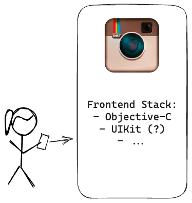
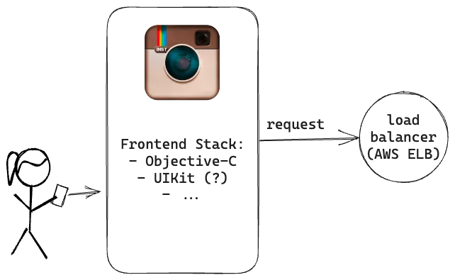

> @Author  : Lewis Tian (taseikyo@gmail.com)
>
> @Link    : github.com/taseikyo
>
> @Range   : 2024-11-17 - 2024-11-23

# Weekly #89

[readme](../README.md) | [previous](202411W2.md) | [next](202411W4.md)


\**Photo by [Yusuf Onuk](https://unsplash.com/@onkysf) on [Unsplash](https://unsplash.com/photos/persons-hand-on-blue-ocean-water-during-daytime-d94ltt7Zesk)*

## Table of Contents

- [algorithm](#algorithm-)
- [review](#review-)
	- Instagram 的早期架构（英文）
	- 分片不等于分布式（英文）
- [tip](#tip-)
	- 如何查看 Linux 系统的安装时间（英文）
	- WSL 忘记 root 密码（Ubuntu）
- [share](#share-)

## algorithm [🔝](#weekly-89)

## review [🔝](#weekly-89)

### 1. [Instagram 的早期架构（英文）](https://read.engineerscodex.com/p/how-instagram-scaled-to-14-million)

从 2010 年 10 月到 2011 年 12 月，Instagram 在仅仅一年的时间内从 0 到 1400 万用户，期间仅有 3 位工程师。

他们通过遵循3个关键原则并拥有可靠的技术堆栈来做到这一点。

- 保持事情非常简单
- 不要重新发明轮子
- 尽可能使用经过验证的技术

> - Keep things very simple.
>
> - Don’t re-invent the wheel.
>
> - Use proven, solid technologies when possible.

Instagram 早期是租用 AWS 的 EC2 服务器。

1、前端

Instagram 2010 发布，，而 Swift 于 2014 才发布，所以可以假设 Instagram 是使用 Objective-C 和 Uikit 等其他内容组合编写的。



2、负载均衡

Instagram 使用了亚马逊的弹性负载平衡器，他们有 3 个 NGINX 实例。



3、后端

Instagram 的应用程序服务器使用了 Django，它是用 Python 编写的，将 Gunicorn 作为 WSGI 服务器。

WSGI（Web Server Gateway Interface）将请求从Web服务器转发到Web应用程序。

Instagram 使用 Fabric 在许多实例上同时同时运行命令。


4、数据库

Postgress

5、图片存储

Amazon S3 & Cloudfront

6、缓存

redis & memcached

redis 用来存储 图片 ID 到用户 ID 的映射，memcached 用来缓存数据库读到的数据


7、push 推送 & 异步任务

push 通知是使用 PYAPN 发送的。PYAPNS 是一种开源的，通用的 Apple Push Notification Service（APNS）提供商。

异步任务使用 [Gearman](https://gearman.org/)， Gearman 用于多个异步任务，例如向所有用户的关注者推出活动（如发布的新照片）


8、监控报警

- Instagram 使用 Sentry（开源 Django 应用程序）实时监视 Python 错误
- Munin 用于绘制整个系统范围的指标并提醒异常。Instagram 有一堆自定义的 Munin 插件来跟踪应用程序级别的指标，例如每秒发布的照片
- pingdom 用于外部服务监控
- Pagerduty 用于处理事件和通知

9、总体架构


### 2. [分片不等于分布式（英文）](https://medium.com/@magda7817/sharded-does-not-imply-distributed-572fdafc4040)

分片是一种在几个独立数据库实例上分配与访问数据的技术。该方法通过将原始数据分成多片来利用水平可扩展性，然后将其分布在多个数据库实例上。


1、分片数据库

每个分片解决方案都一个关键组件，该组件可能有不同名字： coordinator, router, or director


它将客户端请求映射到特定的分片，然后将其映射到相应的数据库实例。

如果客户端要将新记录插入到购物车中，则请求首先转到 coordinator 。 coordinator 将记录的主要键映射到其中一个分片，然后将请求转发到负责该分片的数据库实例：


2、分布式数据库

与分片数据库解决方案一样，分布式数据库也采用类似的分片技术来分配与访问数据，这些数据和负载在一组数据库节点上分发。但是，与分片解决方案不同，分布式数据库不依赖于协调器组件。

分布式数据库建立在没有共享的体系结构上，该架构没有协调员：


集群中的所有节点彼此都知道，通过直接通信，每个节点可以将客户端请求路由到适当的分片所有者。此外，他们可以执行和协调多节点事务。当扩展到更多节点时，群集会自动重新平衡并分裂分片。节点维护数据的冗余副本（基于配置的复制因子），即使某些节点失败，也可以继续操作而无需停机。

## tip [🔝](#weekly-89)

### 1. [如何查看 Linux 系统的安装时间（英文）](https://linuxiac.com/how-to-find-linux-os-installation-date)

使用 `stat / | awk '/Birth: /{print $2 " " substr($3,1,5)}'` 命令即可查看安装 Linux 系统的确切日期：

```bash
taseikyo at Polaris in /mnt/d/Github/arts (w89)
$ stat / | awk '/Birth: /{print $2 " " substr($3,1,5)}'
2024-12-07 19:30
```

如果想简单点，直接用 `stat /` 命令并查看“Birth”行：

```bash
taseikyo at Polaris in /mnt/d/Github/arts (w89●●)
$ stat /
  File: /
  Size: 4096            Blocks: 8          IO Block: 4096   directory
Device: 8,32    Inode: 2           Links: 22
Access: (0755/drwxr-xr-x)  Uid: (    0/    root)   Gid: (    0/    root)
Access: 2025-03-22 12:52:45.883003957 +0800
Modify: 2025-03-22 12:52:44.703003950 +0800
Change: 2025-03-22 12:52:44.703003950 +0800
 Birth: 2024-12-07 19:30:24.000000000 +0800
```

另一个方法是 `fsname=$(df / | tail -1 | cut -f1 -d' ') && tune2fs -l $fsname | grep 'created'` ，但是需要先切换为 root 用户：

```bash
root@Polaris:/mnt/d/Github/arts# fsname=$(df / | tail -1 | cut -f1 -d' ') && tune2fs -l $fsname | grep 'created'
Filesystem created:       Sat Dec  7 19:30:24 2024
```

下面是各种发行版自己的命令：

- Debian / Ubuntu

```bash
sudo head -n1 /var/log/installer/syslog
```

- Fedora / Rocky Linux / AlmaLinux

```bash
sudo rpm -qi basesystem | grep -i "install date"
```

- Arch Linux

```bash
head -n1 /var/log/pacman.log
```

### 2. [WSL 忘记 root 密码（Ubuntu）](https://blog.csdn.net/weixin_45100742/article/details/140101405)

1、问题描述

Windows 下的 WSL（Ubuntu）忘记了 root 密码，无法使用管理员权限。

2、解决方法

- 关闭 Ubuntu 窗口。
- 打开 Windows 的 Powershell 或 cmd， 以 root 默认登陆 WSL。

```bash
wsl -u root
```

- 修改密码

```bash
passwd
```

- 输入密码，确认密码，修改成功。

## share [🔝](#weekly-89)

[readme](../README.md) | [previous](202411W2.md) | [next](202411W4.md)
