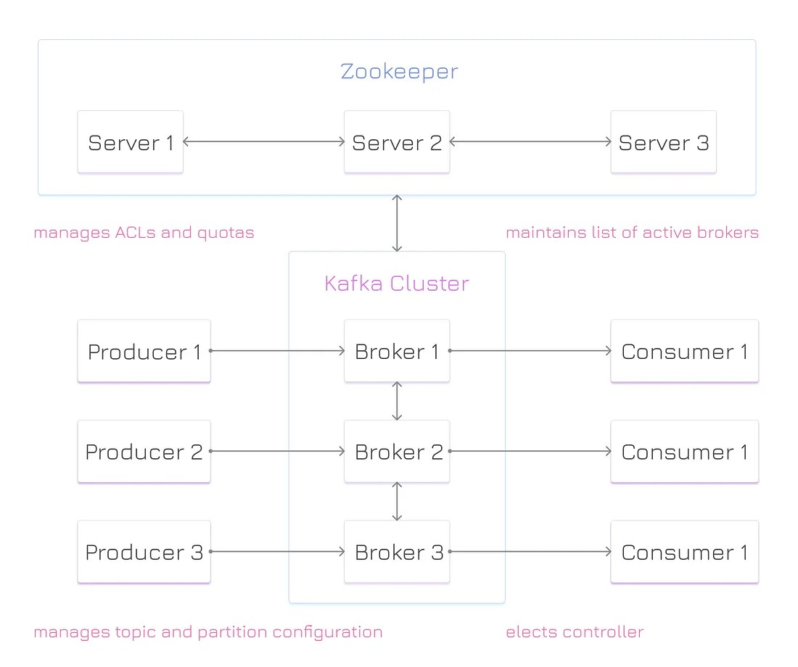
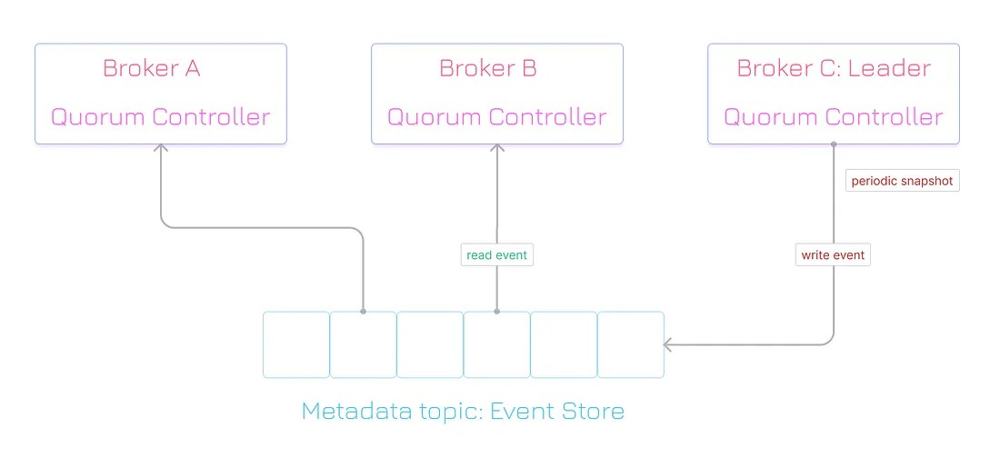

> @Author  : Lewis Tian (taseikyo@gmail.com)
>
> @Link    : github.com/taseikyo
>
> @Range   : 2024-11-24 - 2024-11-30

# Weekly #90

[readme](../README.md) | [previous](202411W3.md) | [next](202412W1.md)


\**Photo by [Fatma Sönmez](https://unsplash.com/@fsonmez) on [Unsplash](https://unsplash.com/photos/a-beach-filled-with-lots-of-sea-shells-under-a-cloudy-sky-zF-ZOyuL_is)*

## Table of Contents

- [algorithm](#algorithm-)
	- 两个线程交替打印1-100之间的奇数和偶数
	- N个线程交替打印1-100
- [review](#review-)
	- Kafka 架构的演变：从 ZooKeeper 到 KRaft（英文）
	- 构建高性能软件系统：架构风格与技术指南（英文）
- [tip](#tip-)
- [share](#share-)
	- 水坝式经营法

## algorithm [🔝](#weekly-90)

### 1. 两个线程交替打印1-100之间的奇数和偶数

> [print_event_odd.go](../code/print_event_odd.go)

```go
package main

import (
	"fmt"
	"sync"
)

func main() {
	var wg sync.WaitGroup
	ch := make(chan int)
	wg.Add(2)
	go func() {
		defer wg.Done()
		for i := 0; i < 100; i++ {
			if i%2 == 0 {
				fmt.Println("thread1: ", i)
			}
			ch <- 1
		}
	}()

	go func() {
		defer wg.Done()
		for i := 0; i < 100; i++ {
			if i%2 == 1 {
				fmt.Println("thread2: ", i)
			}
			<-ch
		}
	}()
	wg.Wait()
}
```

### 2. N个线程交替打印1-100

> [print_event_odd_n.go](../code/print_event_odd_n.go)

```go
package main

import (
	"fmt"
)

func main() {
	print(5)
}

func print(num int) {
	var chanSlice []chan int
	for i := 0; i < num; i++ {
		chanSlice = append(chanSlice, make(chan int))
	}
	quitChan := make(chan int)

	res := 1
	next := 0
	for i := 0; i < num; i++ {
		go func(i int) {
			for {
				<-chanSlice[i]
				if res > 100 {
					quitChan <- 1
					return
				}
				fmt.Println("thread", i, res)
				res++

				if next == num-1 {
					next = 0
				} else {
					next++
				}
				chanSlice[next] <- 1
			}

		}(i)
	}
	chanSlice[0] <- 1
	select {
	case <-quitChan:
		fmt.Println("exit")
	}

}
```

## review [🔝](#weekly-90)

### 1. [Kafka 架构的演变：从 ZooKeeper 到 KRaft（英文）](https://medium.com/@romanglushach/the-evolution-of-kafka-architecture-from-zookeeper-to-kraft-f42d511ba242)

Kafka 的架构最近从 ZooKeeper 转变为基于 quorum 的控制器，该控制器使用一种称为 Kafka Raft（简称 KRaft）的新共识协议。从 ZooKeeper 到 KRaft 的转变是一次重大的架构改革，从而简化了部署、增强了可扩展性并提高了性能。

1、ZooKeeper

在ZooKeeper模式（ZK）中，ZooKeeper集群作为协调服务，其中一个ZK节点作为领导者（leader），其他节点作为跟随者（followers）。ZK领导者会从Kafka代理（brokers）中选择一个控制器（controller），并将Kafka集群的元数据（metadata）与跟随者共享。



ZooKeeper 是一个分布式系统，它以类似于标准文件系统的层次结构命名空间来组织数据。命名空间由称为 znode 的数据寄存器组成。每个 znode 通过路径标识，路径是由斜杠分隔的一系列路径元素。

ZooKeeper在其命名空间中支持三种类型的znodes：

- 持久节点（Persistent）：这是默认类型，节点会一直存在于ZooKeeper中，直到被显式删除。
- 临时节点（Ephemeral）：这种类型的节点在创建它的会话断开时会被自动删除。临时节点不能拥有子节点。
- 顺序节点（Sequential）：这种类型的节点会在创建时被分配一个唯一的顺序编号（如ID），通常用于生成有序的序列号。

ZooKeeper 提供了一个可靠、快速且具有可扩展性的系统。它被设计为在一组称为“集群”（ensemble）的服务器上进行复制。每台服务器都维护一个内存中的状态镜像，同时还会将状态转换日志和快照存储在持久化存储中。

ZooKeeper 客户端会连接到一台服务器，但如果该服务器不可用，客户端可以切换到另一台服务器。读取请求由每台服务器的本地副本数据库提供服务。写入请求则通过一种协议进行处理。该协议涉及将所有写入请求转发到领导者服务器（leader server），领导者服务器使用 ZooKeeper 原子广播协议（ZAB 协议）来协调这些请求。

ZAB 协议是 ZooKeeper 的核心，它确保所有服务器保持同步。它保证了消息的可靠传递，同时还确保消息以完全顺序和因果顺序传递。该协议利用 TCP 进行通信，并在服务器之间建立点对点的 FIFO（先进先出）通道。


2、Kafka

Kafka 是一个分布式系统，提供高可用性和容错能力。然而，它需要一种方式来协调活跃的 Broker，并保持集群及其配置的一致性视图。

长期以来，Kafka 一直使用 ZooKeeper 作为其元数据管理工具，执行以下几个关键功能：

- 控制器选举（Controller Election）：ZooKeeper 对于选举控制器至关重要。每个 Broker 都会尝试在 ZooKeeper 中创建一个临时节点。第一个成功的 Broker 将成为控制器，并获得一个控制器纪元（controller epoch）。
- 集群成员管理（Cluster Membership）：ZooKeeper 还帮助管理集群中的 Broker 成员资格。当 Broker 连接到 ZooKeeper 实例时，会在一个组 znode 下创建一个临时 znode。如果 Broker 发生故障，该临时 znode 将被删除。
- 主题配置（Topic Configuration）：Kafka 将每个主题的配置集存储在 ZooKeeper 中。这些配置可以是特定于每个主题的，也可以是全局的。它还存储诸如现有主题列表、每个主题的分区数量以及副本位置等信息。
- 访问控制列表（ACLs）：Kafka 将所有主题的 ACL 存储在 ZooKeeper 中。这决定了谁或什么可以读取或写入每个主题。它还存储诸如消费者组列表和每个消费者组成员的信息。
- 配额（Quotas）：Kafka Broker 可以限制客户端使用的 Broker 资源。这些配额存储在 ZooKeeper 中。有两种类型的配额：基于字节速率阈值的网络带宽配额和基于 CPU 利用率阈值的请求速率配额。

3、困难与挑战

- 可扩展性（Scalability）：ZooKeeper 并不是为处理大量客户端或请求而设计的。随着 Kafka 集群规模和流量的增长，ZooKeeper 可能成为瓶颈，影响 Kafka 的性能和可用性。
- 复杂性（Complexity）：ZooKeeper 增加了 Kafka 架构的复杂性和依赖性。Kafka 用户和运维人员必须单独安装、配置、监控和排查 ZooKeeper 的问题。此外，ZooKeeper 有自己的配置参数、故障场景和安全机制，与 Kafka 不同。
- 一致性（Consistency）：ZooKeeper 保证强一致性，这意味着集群中的所有节点在任何给定时间都能看到相同的数据视图。然而，这也意味着 ZooKeeper 需要大多数节点（quorum）可用才能处理任何请求。如果无法达到多数，ZooKeeper 将无法处理请求并变得不可用。这也会影响 Kafka 的可用性，尤其是在网络分区或数据中心故障的情况下。
- 复杂且难以管理：ZooKeeper 的引入增加了 Kafka 系统的复杂性，使其更难以管理。
- 引入瓶颈：ZooKeeper 在活跃的 Kafka 控制器和 ZooKeeper 领导者之间引入了瓶颈。
- 元数据变更和故障转移较慢：元数据变更（更新）和故障转移的速度较慢。


4、KRaft

KRaft 是 Kafka Raft Metadata 模式的缩写，意味着 Kafka 使用 Raft 共识协议来管理自己的元数据，而不再依赖 ZooKeeper。



最初的 Kafka 架构依赖 ZooKeeper 来管理集群的元数据。然而，ZooKeeper 为 Kafka 引入了一些复杂性和限制。因此，一系列 Kafka 改进提案（KIPs）被提出，旨在用自管理的元数据仲裁（quorum）取代 ZooKeeper。该自管理模式的第一个版本作为早期访问功能在 Kafka 2.8 中发布。

自管理模式通过将元数据管理委托给 Kafka 中的新仲裁控制器服务（quorum controller service）来简化元数据管理。仲裁控制器采用事件源存储模型，并使用 Kafka Raft（KRaft）作为共识协议，以确保元数据在仲裁中的一致性和持久性。

KRaft 是基于事件的 Raft 共识协议的实现，类似于 ZooKeeper 使用的 ZAB 协议，但采用了事件驱动的设计。仲裁控制器维护一个事件日志来存储状态转换，这些日志会定期压缩为快照，以避免无限增长。

仲裁控制器以领导者-追随者模式运行，领导者控制器在 Kafka 的元数据主题中生成事件，而追随者控制器消费并应用这些事件。如果 Broker 发生故障或断开连接，它可以在重新加入时从最后一个提交的事件恢复。这最大限度地减少了停机时间。

与基于 ZooKeeper 的控制器相比，仲裁控制器具有一些优势，例如不需要从外部服务加载状态，并且所有提交的元数据记录都保存在内存中。此外，相同的事件驱动机制用于在集群中传播和同步所有元数据变更。

5、优势

- 简化（Simplicity）：KRaft 通过移除对独立协调服务的需求，简化了 Kafka 的架构。Kafka 用户和运维人员只需处理一个系统，而不是两个。此外，KRaft 使用与 Kafka 数据平面相同的配置参数、故障场景和安全机制，从而降低了学习曲线和运维开销。
- 可扩展性（Scalability）：KRaft 通过减少元数据存储的负载来提高 Kafka 的可扩展性。在 KRaft 模式下，只有控制器仲裁（一组 Broker 子集）参与 Raft 协议，而其余 Broker 仅与控制器仲裁通信。这减少了必须通过元数据存储的连接和请求数量，使 Kafka 能够在不影响元数据存储性能和可用性的情况下处理更多的 Broker 和主题。
- 可用性（Availability）：KRaft 通过允许元数据存储部分故障来提高 Kafka 的可用性。在 KRaft 模式下，只需要仲裁控制器来处理任何请求。如果某些控制器不可用或与集群的其他部分分区，剩余的控制器仍然可以处理请求并维护集群状态。这提高了 Kafka 对网络分区和数据中心故障的弹性。
- 简化的部署和管理：Kafka 用户不再需要运行和维护独立的 ZooKeeper 集群，从而降低了 Kafka 部署的运维复杂性和成本。此外，Kafka 用户可以利用现有的工具和 API 来管理 Kafka 集群，例如 Admin API、Config API 和 kafka-reassign-partitions 工具。
- 增强的安全性：KRaft 支持使用 SSL/TLS 或 SASL 机制对客户端-服务器通信进行加密和身份验证，从而保护 Kafka 元数据免受未经授权的访问或修改。

6、权衡

兼容性（Compatibility）：KRaft 与旧版本的 Kafka 或 ZooKeeper 不兼容。希望从 ZooKeeper 迁移到 KRaft 的用户必须遵循特定的流程，包括升级其 Broker 和客户端以支持 KRaft 模式，将其元数据从 ZooKeeper 格式转换为 KRaft 格式，并将其 Broker 从 ZooKeeper 模式切换到 KRaft 模式。这可能是一个复杂且具有风险的过程，需要仔细规划和测试。

一致性（Consistency）：KRaft 通过在某些情况下允许最终一致性来放宽 ZooKeeper 的强一致性保证。例如，如果控制器发生故障或离开集群，可能需要一些时间才能让另一个控制器接管其角色并更新其对集群状态的视图。在此期间，某些 Broker 或客户端可能会看到过时或不一致的元数据，直到它们刷新缓存或重新连接到新的控制器。这可能会导致某些操作（如创建或删除主题、重新分配分区或提交偏移量）出现临时错误或不一致。

7、从 ZooKeeper 迁移到 KRaft

从 ZooKeeper 迁移到 KRaft 是一个直接的过程，涉及升级到 Kafka 2.8 或更高版本并启用 KRaft 模式。自 2019 年 8 月以来，Kafka 经历了由 Collin McCabe 提出的 KIP-500 的重大架构改革，该提案移除了 Kafka 对 ZooKeeper 的依赖，转而使用自管理的元数据仲裁。这导致了 KRaft 模式的开发，该模式现已被标记为生产就绪。截至 Kafka 3.5，ZooKeeper 模式已被弃用，并将在 Kafka 4.0 发布时完全移除。

Kafka 从 ZooKeeper 到 KRaft 的转变是一次重大的架构改革，简化了部署，增强了可扩展性，并提高了性能。KRaft 模式消除了对独立 ZooKeeper 集群的需求，使 Kafka 集群的部署和管理更加容易。

KRaft 模式比 ZooKeeper 模式更具可扩展性，允许 Kafka 集群处理更多的流量和数据。KRaft 模式比 ZooKeeper 模式更快，从而降低了延迟并提高了吞吐量。

### 2. [构建高性能软件系统：架构风格与技术指南（英文）](https://romanglushach.medium.com/building-high-performing-software-systems-a-guide-to-architectural-styles-and-techniques-00dc89e08147)

高性能软件系统是指表现出卓越性能、可扩展性、可靠性和安全性的应用程序或系统。这些系统旨在处理大量数据、用户流量和复杂计算，同时保持最佳性能水平。高性能软件系统并不局限于任何特定行业或领域，它们可以应用于金融、医疗、电子商务、社交媒体、人工智能、数据分析和游戏等多个领域。

1、架构风格

架构风格是一组指导原则或约定，定义了如何构建和组织软件系统。它描述了系统的组件、它们的职责、它们的交互方式以及它们的依赖关系。架构风格还定义了系统的一些非功能性方面，例如可扩展性、性能、安全性、可测试性和可维护性。

架构风格并不是一套固定或严格的规则，而是一种可以适应和定制以满足项目特定需求和约束的通用方法或理念。没有一种适用于所有场景的最佳或最优架构风格，而是需要在选择时评估不同的权衡和考虑因素。

1.1、优势

- **模块化**：将复杂系统分解为更小、更简单的组件，这些组件可以独立开发、测试、部署和维护。
- **可重用性**：通过创建可重用的组件来避免代码和逻辑的重复，这些组件可以在系统的不同部分甚至不同系统之间共享。
- **可扩展性**：允许系统通过添加或修改组件来适应不断变化的需求和新功能，而不会影响现有组件。
- **可测试性**：通过隔离组件及其依赖关系，并在它们之间提供清晰的接口和契约，使系统更易于测试。
- **可维护性**：通过遵循一致和连贯的约定和原则，使系统更易于理解、修改、调试和重构。
- **解耦**：通过最小化组件之间共享或暴露的信息和行为量，减少组件之间的耦合或依赖性。

2、软件性能

软件性能是指软件系统在特定时间框架内以最优资源使用执行其预期功能的能力。它是软件开发和维护的关键方面，因为它直接影响用户体验、系统可靠性和整体效率。

软件性能可以定义为软件系统执行其预期功能并在指定时间框架内响应用户输入的能力的度量。

它包括以下方面：

- **响应时间**：系统响应用户输入或查询所需的时间。
- **吞吐量**：系统在给定时间框架内可以处理的任务或请求数量。
- **资源利用率**：系统使用硬件和软件资源（如CPU、内存、磁盘I/O和网络带宽）的效率。
- **可扩展性**：系统在不显著降低性能的情况下处理增加的工作负载或用户流量的能力。
- **可靠性**：系统一致地执行其预期功能且无错误或故障的能力。

3、软件系统的关键性能指标（KPIs）

关键性能指标（KPIs）是可衡量的值，用于展示软件系统如何有效地实现其预期目标。

一些常见的软件性能KPI包括：

- **响应时间**：平均响应时间、响应时间变异性和响应时间分布。
- **吞吐量**：单位时间内处理的请求数量，例如每秒请求数（RPS）或每分钟事务数（TPM）。
- **资源利用率**：CPU使用率、内存使用率、磁盘I/O、网络带宽和每秒数据库查询数。
- **可扩展性**：系统在不显著性能下降的情况下处理的用户数量、并发连接数或请求数。
- **可靠性**：平均故障间隔时间（MTBF）、平均恢复时间（MTTR）和错误率。

4、影响软件性能的因素

- **硬件资源**：硬件组件（如CPU、内存、存储和网络接口）的可用性、利用率和性能。
- **软件架构**：软件系统的设计和结构，包括层数、组件数量以及它们之间的交互。
- **算法复杂度**：软件中使用的算法的时间和空间复杂度，这可能会影响响应时间和资源利用率。
- **数据大小和增长**：系统处理和存储的数据量，随着数据集的增长，可能会影响性能。
- **用户行为**：用户活动的模式和强度，例如并发用户数量、请求频率和使用模式。
- **网络和I/O性能**：网络延迟、数据包丢失和I/O操作可能会影响系统检索和处理数据的能力。
- **资源竞争**：对共享资源（如CPU、内存和I/O设备）的竞争可能导致性能瓶颈。
- **干扰和噪声**：来自其他系统或后台进程的干扰，以及系统性能的随机波动，可能会影响软件性能。

5、测量和监控软件性能的方法

- **合成事务**：模拟用户交互以测量响应时间、吞吐量和资源利用率。
- **真实用户监控**：跟踪实际用户交互，从最终用户的角度评估性能。
- **负载测试**：在不同负载下测试系统，以评估其在不同工作负载下的可扩展性和性能。
- **压力测试**：在极端条件下（如高并发或大数据集）测试系统，以识别性能瓶颈。
- **最终用户体验监控**：监控用户体验指标，例如页面加载时间、错误率和用户满意度。
- **性能建模**：创建系统的数学模型，以预测不同条件下的性能并优化系统配置。
- **性能基准测试**：将系统的性能与行业标准基准或竞争系统进行比较。
- **根本原因分析**：通过分析、跟踪和日志记录等技术识别性能问题的根本原因。

6、应用架构风格的方式

- **整个系统**：定义系统整体的高级结构和组织，例如如何将其划分为子系统或模块，它们如何相互通信，以及它们如何与外部系统或服务交互。
- **子系统或模块**：定义系统内子系统或模块的内部结构和组织，例如如何将其划分为组件或类，它们如何相互协作，以及它们如何向其他子系统或模块暴露其功能。
- **组件或类**：定义子系统或模块内组件或类的内部结构和组织，例如如何将其划分为方法或函数，它们如何实现组件或类的逻辑和行为，以及它们如何访问数据或资源。

7、总结

构建高性能软件系统需要仔细的规划和执行。其中最重要的一个方面是系统的架构。软件系统的架构决定了系统的结构以及它在不同条件下的表现方式。

还有许多其他架构风格和技术可能适用于不同的上下文和场景，没有一种适用于所有软件系统的通用解决方案。关键是要理解系统的需求、约束和权衡，并选择和组合最适合您需求和目标的架构风格和技术。

## tip [🔝](#weekly-90)

## share [🔝](#weekly-90)

### 1. 水坝式经营法

水坝式经营源自日本企业家松下幸之助的管理理念，核心在于通过建立缓冲机制来应对不确定性，确保企业在市场波动中保持稳定。具体措施包括：

- 资金储备：预留部分资金应对突发状况。
- 库存管理：保持适量库存以应对需求波动。
- 人才储备：培养多技能员工以灵活应对变化。
- 技术储备：持续研发新技术以保持竞争力。

对个人的意义

将这一理念应用于个人生活，可以帮助更好地应对不确定性，提升抗风险能力：

- 财务规划：建立应急基金，确保在失业或突发支出时仍能维持生活。
- 时间管理：合理安排时间，预留缓冲应对突发事件。
- 技能提升：持续学习新技能，增强职业竞争力。
- 健康管理：保持健康生活方式，预防疾病，减少健康风险。


实际应用

- 财务：每月储蓄部分收入，建立应急基金。
- 职业：定期学习新技能，保持职业竞争力。
- 生活：制定灵活计划，预留时间应对突发情况。

[readme](../README.md) | [previous](202411W3.md) | [next](202412W1.md)
