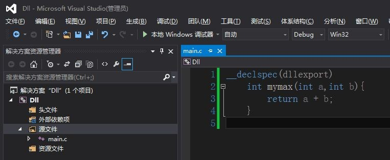
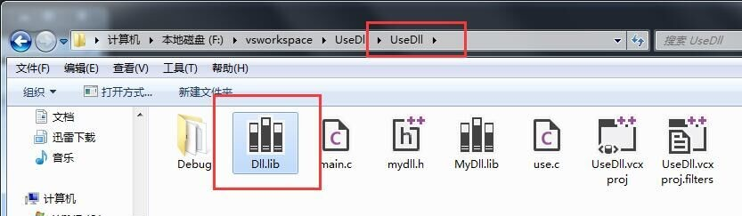

> @Author  : Lewis Tian (taseikyo@gmail.com)
>
> @Link    : github.com/taseikyo
>
> @Range   : 2024-12-01 - 2024-12-07

# Weekly #91

[readme](../README.md) | [previous](202411W4.md) | [next](202412W2.md)

本文总字数 11287 个，阅读时长约： 16 分 54 秒，统计数据来自：[算筹字数统计](http://www.xiqei.com/tools?p=tj)。


\**Photo by [Roelof van Wyk](https://unsplash.com/@roelofvwyk) on [Unsplash](https://unsplash.com/photos/a-sea-urchin-sitting-on-top-of-a-sandy-beach-FssdFnEoCo0)*

## Table of Contents

- [algorithm](#algorithm-)
- [review](#review-)
	- 五级页表
- [tip](#tip-)
	- C语言创建动态dll，并调用该dll(visual studio 2013环境下)
	- 在 C++ 中使用 cpuid 指令获得 CPU 信息
- [share](#share-)
	- 二八法则

## algorithm [🔝](#weekly-91)

## review [🔝](#weekly-91)

### 1. [五级页表（英文）](https://lwn.net/Articles/717293/)

> 作者：Jonathan Corbet  
> 2017年3月15日

2005年初，为Linux 2.6.10合并[四级页表补丁](https://lwn.net/Articles/117749/)是对当时新内核开发模式的早期测试。它证明了社区确实能够合并基础性变更并快速交付给用户——这与2.6.0版本之前普遍存在的多年发布周期形成了鲜明对比。而如今，为4.11-rc2版本（在合并窗口之外）合并五级页表的补丁甚至没有引起多少关注。然而，这一变化意义重大，它揭示了计算行业的发展方向。

页表的作用是将虚拟内存地址映射到实际存储数据的物理地址。从概念上讲，它是一个线性数组，通过虚拟地址（或至少是地址中的页帧号部分）索引，并返回关联物理页的页帧号。然而，这样的数组会非常庞大且极度浪费。大多数进程即使在32位系统上也不会使用完整的可用虚拟地址空间，而在64位系统上，它们甚至只使用了其中极小的一部分。因此，地址空间往往是稀疏分布的，导致该数组的大部分未被使用。

几十年来，硬件中实现的解决方案是将线性数组转换为表示地址空间的稀疏树。结果如下所示：


顶部的方框行表示64位虚拟地址的位。为了转换该地址，硬件将地址拆分为多个位字段。注意，在此方案中（对应于x86-64架构的地址使用方式），最高16位被丢弃；虚拟地址中只有低48位被使用。在使用的位中，最高9位（位39-47）用于索引页全局目录（PGD）；每个地址空间有一个单独的页。读取的值是页上层目录（PUD）的地址；虚拟地址的位30-38用于索引指定的PUD页，以获取页中间目录（PMD）的地址。通过位21-29，可以索引PMD以获取最低级别的页表，称为PTE。最后，虚拟地址的位12-20在索引PTE时，将返回包含数据的实际页的物理地址。虚拟地址的最低12位是页内的偏移量。

在页表的任何级别，指向下一级的指针可以为空，表示该范围内没有有效的虚拟地址。这种方案允许缺失大型子树，对应于地址空间中未映射的范围。中间级别还可以有特殊条目，表示它们直接指向一个（大）物理页，而不是指向更低级别的页表；这就是大页的实现方式。例如，一个2MB的大页可以直接在PMD级别找到，而无需中间的PTE页。

可以很快看出，转换虚拟地址的过程将是昂贵的，需要多次从主存中获取数据。这就是为什么转换后备缓冲区（TLB）对系统整体性能如此重要，以及为什么需要更少查找的大页也有助于性能提升。

值得注意的是，并非所有系统都使用四级页表。例如，32位系统使用三级甚至两级页表。内存管理代码的编写方式假设所有四级都存在；通过一些精心编写的代码，确保在内核配置为使用较少级别时，未使用级别的代码会被透明地省略。

在合并四级页表时，您的编辑曾写道：“现在x86-64用户可以拥有覆盖128TB内存的虚拟地址空间，这应该能让他们用上一段时间。”现在看来，“一段时间”可以量化为大约12年。不过，实际上真正的限制似乎是当前x86-64处理器可以寻址的64TB物理内存；正如Kirill Shutemov在[x86五级页表补丁](https://lwn.net/Articles/716916/)中指出的那样，已经有厂商推出了配备如此多内存的系统。

正如该领域常见的情况，解决方案是增加另一层间接性，即第五级页表。新的级别称为“P4D”，插入在PGD和PUD之间。添加这一级别的补丁已合并到4.11-rc2中，尽管目前没有任何硬件支持五级分页。虽然四级页表的添加引起了一些紧张，但五级补丁的合并被描述为“低风险”。目前，内存管理开发人员对添加新级别所需的变更已经有了很好的把握。

为即将推出的Intel处理器添加五级支持的补丁目前计划在4.12版本中发布。运行五级分页的系统将支持52位物理地址和57位虚拟地址。或者，正如Shutemov所说：“它将限制提高到128 PiB的虚拟地址空间和4 PiB的物理地址空间。这‘对任何人来说都足够了’。”新级别还允许创建512GB的大页。

当前的补丁还有一些未解决的问题。其中之一是Xen在启用五级页表的系统上无法工作；它将继续在四级系统上运行。还需要一个启动时标志，以允许在四级和五级分页之间切换，这样发行版就不需要提供两个不同的内核二进制文件。

另一个有趣的问题在补丁系列的[末尾](https://lwn.net/Articles/717300/)有所描述。似乎有一些程序“知道”虚拟地址中只有低48位是有效的。它们利用这一知识，将其他信息编码在最高位中。如果这些位突然成为地址本身的一部分，这些程序显然会崩溃。为了避免此类问题，当前形式的x86补丁默认不会在新的地址空间中分配内存。需要如此多内存且不玩弄虚拟地址的应用程序可以在调用mmap()时提供一个高于边界的地址提示，此时内核将理解可以访问高范围的映射。

任何想要尝试新模式的人现在都可以使用支持五级页表的QEMU进行测试。否则，就需要等待处理器的发布——以及购买配备如此多内存的机器的资金。当硬件可用时，内核应该已经准备好了。

## tip [🔝](#weekly-91)

### 1. [C语言创建动态dll，并调用该dll(visual studio 2013环境下)](https://blog.csdn.net/u014175572/article/details/50728783)

第一部分：创建动态 dll 库。

1、打开 visual studio 创建一个控制台应用程序。


2、选择 DLL，空项目。

  

3、点击源文件，创建一个 main.c 文件


4、在 main.c 中写入一个简单的函数，内容如下：

```c
__declspec(dllexport)
	int mymax(int a,int b){
		return a + b;
	}
```



5、编译生成。


6、在项目的目录有 dll 和 lib 两个生成好的文件。


第二部分：在新建项目中使用 dll。

7、新建一个 c 的控制台应用程序 UseDll，把 Dll.dll 放入 Debug 目录下。


8、把 Dll.lib 放入 UserDll 目录下。



9、在 UseDll 项目中新建一个源文件 use.c，代码如下：

```c
#include<stdio.h>
 
#pragma comment(lib,"Dll.lib")
 
int mymax(int a,int b);
 
int main(){
	printf("调用动态dll函数的结果：%d",mymax(5,6));
	getchar();
	return 0;
}
```


10、运行结果如下


### 2. [在 C++ 中使用 cpuid 指令获得 CPU 信息](https://www.cnblogs.com/freeman/archive/2005/08/30/226128.html)

1、什么是 cpuid 指令

CPUID 指令是 intel IA32 架构下获得 CPU 信息的汇编指令，可以得到 CPU 类型，型号，制造商信息，商标信息，序列号，缓存等一系列 CPU 相关的东西。

2、cpuid 指令的使用

cpuid 使用 eax 作为输入参数，eax，ebx，ecx，edx 作为输出参数，举个例子:

```asm
 __asm
 {
  mov eax, 1
  cpuid
  ...
 }
```


以上代码以 1 为输入参数，执行 cpuid 后，所有寄存器的值都被返回值填充。针对不同的输入参数 eax 的值，输出参数的意义都不相同。

为了更好的在 C++ 中使用 cpuid 指令，可以使用类对指令进行封装，在类中定义一个专门的函数负责 cpuid 的执行，他需要一个输入参数。还需要定义四个成员变量存储 cpuid 执行以后返回来的值。由于这四个寄存器都是 32 位长的，可以使用 unsinged long 类型变量存储。

```c++
typedef unsigned long DWORD
 class CPUID {
	public:
	  ...
	 private:
	  void Executecpuid(DWORD eax);
	// 用来实现 cpuid
	DWORD m_eax;
	// 存储返回的 eax
	DWORD m_ebx;
	// 存储返回的 ebx
	DWORD m_ecx;
	// 存储返回的 ecx
	DWORD m_edx;
	// 存储返回的 edx
	...
}
void CPUID::Executecpuid(DWORD veax) {
	// 因为嵌入式的汇编代码不能识别 类成员变量
	// 所以定义四个临时变量作为过渡
	DWORD deax;
	DWORD debx;
	DWORD decx;
	DWORD dedx;
	__asm {
		mov eax, veax ;将输入参数移入 eax
		   cpuid  ;执行 cpuid
		   mov deax, eax ;以下四行代码把寄存器中的变量存入临时变量
		   mov debx, ebx
		   mov decx, ecx
		   mov dedx, edx
	}
	m_eax = deax;
	// 把临时变量中的内容放入类成员变量
	m_ebx = debx;
	m_ecx = decx;
	m_edx = dedx;
}
```


这样就可以通过直接调用 Executecupid() 函数的方式来执行 cpuid 指令了，返回值存在类成员变量 m_eax, m_ebx, m_ecx 和 m_edx 中。

3、获得 CPU 的制造商信息 (Vender ID String)

把 eax = 0 作为输入参数，可以得到 CPU 的制造商信息。

cpuid 指令执行以后，会返回一个 12 字符的制造商信息，前四个字符的 ASC 码按低位到高位放在 ebx，中间四个放在 edx，最后四个字符放在 ecx。比如说，对于 intel 的 cpu，会返回一个 “GenuineIntel” 的字符串，返回值的存储格式为:

```
           31      23      15      07      00
        EBX| u (75)| n (6E)| e (65)| G (47)
        EDX| I (49)| e (65)| n (6E)| i (69)
        ECX| l (6C)| e (65)| t (74)| n (6E)
```

因此可以这样实现他：

```C++
string CPUID::GetVID() {
	char cVID[13];
	// 字符串，用来存储制造商信息
	memset(cVID, 0, 13);
	// 把数组清 0
	Executecpuid(0);
	// 执行 cpuid 指令，使用输入参数 eax = 0
	memcpy(cVID, &m_ebx, 4);
	// 复制前四个字符到数组
	memcpy(cVID+4, &m_edx, 4);
	// 复制中间四个字符到数组
	memcpy(cVID+8, &m_ecx, 4);
	// 复制最后四个字符到数组
	return string(cVID);
	// 以 string 的形式返回
}
```


4、获得 CPU 商标信息 (Brand String)

在我的电脑上点击右键，选择属性，可以在窗口的下面看到一条 CPU 的信息，这就是 CPU 的商标字符串。CPU 的商标字符串也是通过 cpuid 得到的。由于商标的字符串很长 (48 个字符)，所以不能在一次 cpuid 指令执行时全部得到，所以 intel 把它分成了 3 个操作，eax 的输入参数分别是 0x80000002,0x80000003,0x80000004，每次返回的 16 个字符，按照从低位到高位的顺序依次放在 eax, ebx, ecx, edx。因此，可以用循环的方式，每次执行完以后保存结果，然后执行下一次 cpuid。

```C++
string CPUID::GetBrand() {
	const DWORD BRANDID = 0x80000002;
	// 从 0x80000002 开始，到 0x80000004 结束
	char cBrand[49];
	// 用来存储商标字符串，48 个字符
	memset(cBrand, 0, 49);
	// 初始化为 0
	for (DWORD i = 0; i < 3; i++) {   // 依次执行 3 个指令
		Executecpuid(BRANDID + i);
		memcpy(cBrand + i*16, &m_eax, 16);
		// 每次执行结束后，保存四个寄存器里的 asc 码到数组
	}
	// 由于在内存中，m_eax, m_ebx, m_ecx, m_edx 是连续排列
	// 所以可以直接以内存 copy 的方式进行保存
	return string(cBrand);
	// 以 string 的形式返回
}
```


5、检测 CPU 特性 (CPU feature)

我 98 年初买第一台电脑的时候，CPU 能支持 MMX 就很了不起了。现在的 intel CPU，台式机的好点的都支持 Hyper-Threading 了，移动的要支持 Speed Sted。这些都是 CPU 的特性。CPU 的特性可以通过 cpuid 获得，参数是 eax = 1，返回值放在 edx 和 ecx，通过验证 edx 或者 ecx 的某一个 bit，可以获得 CPU 的一个特性是否被支持。比如说，edx 的 bit 32 代表是否支持 MMX，edx 的 bit 28 代表是否支持 Hyper-Threading，ecx 的 bit 7 代表是否支持 speed sted。下面就是获得 CPU 特性的例子：

```C++
bool CPUID::IsHyperThreading() {  // 判断是否支持 hyper-threading
	Executecpuid(1);
	// 执行 cpuid 指令，使用输入参数 eax = 1
	return m_edx & (1<<28);
	// 返回 edx 的 bit 28
}
bool CPUID::IsEST() {  // 判断是否支持 speed step
	Executecpuid(1);
	// 执行 cpuid 指令，使用输入参数 eax = 1
	return m_ecx & (1<<7);
	// 返回 ecx 的 bit 7
}
bool CPUID::IsMMX() {  // 判断是否支持 MMX
	Executecpuid(1);
	// 执行 cpuid 指令，使用输入参数 eax = 1
	return m_edx & (1<<23);
	// 返回 edx 的 bit 23
}
```

CPU 的特性还有很多，这只是平时我们听到比较多的三个，更多的特性请参考 intel 的资料。

6、获得 CPU 的缓存 (cache)
   
缓存，就是 CACHE，已经成为判断 CPU 性能的一项大指标。缓存信息包括：第几级缓存 (level)，缓存大小 (size)，通道数 (way)，吞吐量 (line size)。因此可以使用一个结构体来存储缓存信息。

```C++
struct CacheInfo {
	int level;
	// 第几级缓存
	int size;
	// 缓存大小，单位 KB
	int way;
	// 通道数
	int linesize;
	// 吞吐量
	CacheInfo() {    // 构造函数
		level = 0;
		size = 0;
		way = 0;
		linesize = 0;
	}
	CacheInfo(int clevel, int csize, int cway, int clinesize) { // 构造函数
		level = clevel;
		size = csize;
		way = cway;
		linesize = clinesize;
	}
}
;
```

缓存信息可以通过 eax = 2 的 cpuid 来得到（得到的不光有 cache 信息，还有其他的一些信息），返回值在 eax(高 24 位), ebx, ecx 和 edx，总共 15 个 BYTE 的信息，每个 BYTE 的值不同，代表的意义也不同，所以需要用一个哈希表存储各种不同 BYTE 的定义，可以定义一个 map 类型的类成员存储这些资料。我把资料上和缓存有关的信息存储如下：

```c++
m_cache[0x06] =  CacheInfo(1, 8, 4, 32);
m_cache[0x08] =  CacheInfo(1, 16, 4, 32);
m_cache[0x0a] =  CacheInfo(1, 8, 2, 32);
m_cache[0x0c] =  CacheInfo(1, 16, 4, 32);
m_cache[0x2c] =  CacheInfo(1, 32, 8, 64);
m_cache[0x30] =  CacheInfo(1, 32, 8, 64);
m_cache[0x60] =  CacheInfo(1, 16, 8, 64);
m_cache[0x66] =  CacheInfo(1, 8, 4, 64);
m_cache[0x67] =  CacheInfo(1, 16, 4, 64);
m_cache[0x68] =  CacheInfo(1, 32, 4, 64);

m_cache[0x39] =  CacheInfo(2, 128, 4, 64);
m_cache[0x3b] =  CacheInfo(2, 128, 2, 64);
m_cache[0x3c] =  CacheInfo(2, 256, 4, 64);
m_cache[0x41] =  CacheInfo(2, 128, 4, 32);
m_cache[0x42] =  CacheInfo(2, 256, 4, 32);
m_cache[0x43] =  CacheInfo(2, 512, 4, 32);
m_cache[0x44] =  CacheInfo(2, 1024, 4, 32);
m_cache[0x45] =  CacheInfo(2, 2048, 4, 32);
m_cache[0x79] =  CacheInfo(2, 128, 8, 64);
m_cache[0x7a] =  CacheInfo(2, 256, 8, 64);
m_cache[0x7b] =  CacheInfo(2, 512, 8, 64);
m_cache[0x7c] =  CacheInfo(2, 1024, 8, 64);
m_cache[0x82] =  CacheInfo(2, 256, 8, 32);
m_cache[0x83] =  CacheInfo(2, 512, 8, 32);
m_cache[0x84] =  CacheInfo(2, 1024, 8, 32);
m_cache[0x85] =  CacheInfo(2, 2048, 8, 32);
m_cache[0x86] =  CacheInfo(2, 512, 4, 64);
m_cache[0x87] =  CacheInfo(2, 1024, 8, 64);

m_cache[0x22] =  CacheInfo(3, 512, 4, 64);
m_cache[0x23] =  CacheInfo(3, 1024, 8, 64);
m_cache[0x25] =  CacheInfo(3, 2048, 8, 64);
m_cache[0x29] =  CacheInfo(3, 4096, 8, 64);
```


m_cache 是类成员，定义如下：

```C++
map<int, CacheInfo> m_cache; // Cache information table
```

在得到返回值以后，只需要遍历每一个 BYTE 的值，找到在 m_cache 中存在的元素，就可以得到 cache 信息了。代码如下：

```C++
typedef unsigned char BYTE;
DWORD CPUID::GetCacheInfo(CacheInfo& L1, CacheInfo& L2, CacheInfo& L3) {
	BYTE cValues[16];
	// 存储返回的 16 个 byte 值
	DWORD result = 0;
	// 记录发现的缓存数量
	Executecpuid(2);
	// 执行 cpuid，参数为 eax = 2
	memcpy(cValues, &m_eax, 16);
	// 把 m_eax, m_ebx, m_ecx 和 m_edx 存储到 cValue
	for (int i = 1; i < 16; i++) {    // 开始遍历，注意 eax 的第一个 byte 没有意义，需要跳过
		if (m_cache.find(cValues[i]) != m_cache.end()) { // 从表中查找此信息是否代表缓存
			switch (m_cache[cValues[i]].level) {  // 对号入座，保存缓存信息
				case 1:  // L1 cache
				L1 = m_cache[cValues[i]];
				break;
				case 2:  // L2 cache
				L2 = m_cache[cValues[i]];
				break;
				case 3:  // L3 cache
				L3 = m_cache[cValues[i]];
				break;
				default:
				     break;
			}
			result++;
		}
	}
	return result;
}
```

7、获得 CPU 的序列号

序列号无处不在！！CPU 的序列号用一个 96bit 的串表示，格式是连续的 6 个 WORD 值：XXXX-XXXX-XXXX-XXX-XXXX-XXXX。WORD 是 16 个 bit 长的数据，可以用 unsigned short 模拟：

```C++
typedef unsigned short WORD;
```

获得序列号需要两个步骤，首先用 eax = 1 做参数，返回的 eax 中存储序列号的高两个 WORD。用 eax = 3 做参数，返回 ecx 和 edx 按从低位到高位的顺序存储前 4 个 WORD。实现如下：

```C++
bool CPUID::GetSerialNumber(SerialNumber& serial) {
	Executecpuid(1);
	// 执行 cpuid，参数为 eax = 1
	bool isSupport = m_edx & (1<<18);
	// edx 是否为 1 代表 CPU 是否存在序列号
	if (false == isSupport) { // 不支持，返回 false
		return false;
	}
	memcpy(&serial.nibble[4], &m_eax, 4);
	// eax 为最高位的两个 WORD
	Executecpuid(3);
	// 执行 cpuid，参数为 eax = 3
	memcpy(&serial.nibble[0], &m_ecx, 8);
	// ecx 和 edx 为低位的 4 个 WORD
	return true;
}
```


8、后记

CPUID 还能获得很多信息，以上实现的都是最常见的。完整的代码和有关 cpuid 的资料我会用附件的形式附在文章结尾。昨天代码写完后拿给朋友看，朋友骂我使用了太多的 memcpy() 函数进行赤裸裸的内存操作... 其实我这么做的目的是提高程序的性能，减少代码量，但是可读性就降了下来，不喜欢这种风格的朋友可以自己改一下。还有，因为 CPUID 类只是提供了很多的接口，没有存储数据的功能，所以类以 Singleton 的方式设计，使用方法可以参考我代码中的 test2.cpp 文件。

代码：[cpuid-source.rar](../code/cpuid-source.rar)

## share [🔝](#weekly-91)

1. [二八法则](https://wiki.mbalib.com/wiki/%E4%BA%8C%E5%85%AB%E5%AE%9A%E5%BE%8B)

80/20法则（The 80/20 Rule）又称为帕累托法则(Pareto Principle）、二八定律、帕累托定律、最省力法则、不平衡原则、犹太法则、马特莱法则等。

80/20法则（The 80/20 Rule），又称为帕累托法则、帕累托定律、最省力法则或不平衡原则、犹太法则。此法则是由约瑟夫·朱兰（Joseph M. Juran）根据维尔弗雷多·帕累托本人当年对意大利20%的人口拥有80%的财产的观察而推论出来的。

80：20法则只是帕累托分布函数在特定常数时的一个特定值，其他极端的还有64：4等，在财富分配方面，意味着80%的财富被20%的人拥有，或者64%的财富属于4%的人。

财富按帕累托函数分布，但社会福利的目标是令这个函数变得尽量扁平，不是那么陡峭，令财富的分配不那么极端。

80/20的法则认为：原因和结果、投入和产出、努力和报酬之间本来存在着无法解释的不平衡。一般来说，投入和努力可以分为两种不同的类型：

- 多数，它们只能造成少许的影响；
- 少数，它们造成主要的、重大的影响。

一般情形下，产出或报酬是由少数的原因、投入和努力所产生的。原因与结果、投入与产出、努力与报酬之间的关系往往是不平衡的。若以数学方式测量这个不平衡，得到的基准线是一个80/20关系；结果、产出或报酬的80％取决于20％的原因、投入或努力。例如，世界上大约80％的资源是由世界上15％的人口所耗尽的；世界财富的80％为25％的人所拥有；在一个国家的医疗体系中，20％的人口与20％的疾病，会消耗80％的医疗资源。80/20原则表明在投入与产出、原因与结果以及努力与报酬之间存在着固有的不平衡。这说明少量的原因、投入和努力会有大量的收获、产出或回报。只有几件事情是重要的，大部分都微不足道。

80/20关系提供了一个较好的基准。一个典型的模式表明，80%的产出源自20%的投入；80%的结论源自20%的起因；80%的收获源自20%的努力。

80/20原则包含在任何时候对原因的静态分析，而不是动态的。使用 80/20原则的艺术在于确认哪些现实中的因素正在起作用并尽可能地被利用。

80/20这一数据仅仅是一个比喻和实用基准。真正的比例未必正好是80%：20%。 80/20原则表明在多数情况下该关系很可能是不平衡的，并且接近于80/20。

80/20原则极其灵活多用。“它能有效地适用于任何组织、任何组织中的功能和任何个人工作。”它最大的用处在于：当你分辨出所有隐藏在表面下的作用力时，你就可以把大量精力投入到最大生产力上并防止负面影响的发生。

80/20法则专家告诉我们，要遵守下列事项：

- 鼓励特殊表现，而非赞美全面的平均努力；
- 寻求捷径，而非全程参与；
- 选择性寻找，而非巨细无遗的观察；
- 在几件事情上追求卓越，不必事事都有好表现；
- 在日常生活中，找人来负责一些事务，我们可以让园艺师、汽车工人、装潢师和其他专业人士来发挥最大的效益，不需事必躬亲；
- 小心选择事业和雇员，如果可能，就自己当老板；
- 只做我们最能胜任且最能从中得到乐趣的事；
- 从生活的深层去探索，找出那些关键的20％，以达到80％的好处；
- 平静，少做一些，锁定少数能以80/20法则完成的目标，不必苦苦追求所有机会。当我们处于创造力巅峰，幸运女神眷顾的时候，务必善用这少有的“幸运时刻”。

[readme](../README.md) | [previous](202411W4.md) | [next](202412W2.md)
