> @Author  : Lewis Tian (taseikyo@gmail.com)
>
> @Link    : github.com/taseikyo
>
> @Range   : 2024-12-08 - 2024-12-14

# Weekly #92

[readme](../README.md) | [previous](202412W1.md) | [next](202412W3.md)


\**Photo by [Vitolda Klein](https://unsplash.com/@little_klein) on [Unsplash](https://unsplash.com/photos/woman-in-black-long-sleeve-shirt-with-white-scarf-zMcXi4Jwyng)*

## Table of Contents

- [algorithm](#algorithm-)
- [review](#review-)
	- e820简介
	- 烂大街的缓存穿透、缓存击穿和缓存雪崩，你真的懂了？
	- C++ 虚函数表剖析
- [tip](#tip-)
- [share](#share-)
	- 南风法则

## algorithm [🔝](#weekly-92)

## review [🔝](#weekly-92)

### 1. [e820简介](https://blog.csdn.net/gxfan/article/details/2962236)

e820 是和 BIOS 的一个中断相关的，具体说是 int 0x15。之所以叫 e820 是因为在用这个中断时 ax 必须是 0xe820。这个中断的作用是得到系统的内存布局。因为系统内存会有很多段，每段的类型属性也不一样，所以这个查询是 “迭代式” 的，每次求得一个段。

我们看内核源代码。主要涉及两个文件：`arch/x86/boot/memory.c` 和 `arch/x86/kernel/e820_32.c`。我们 已经很幸运了，这部分代码已经用 C 重写过了。你可能会奇怪，启动调用 e820 时我们还在实模式，怎么能用 C 呢？答案是，这里用的是 16 位的 C。gcc 早已 经支持. code16 gcc 模式了。

看 detect_memory_e820() 函数，里面就是 e820 的本质。它把 int 0x15 放到一个 do-while 循环里，每次得到的一个内存段放到 `struct e820entry` 里，而 `struct e820entry` 的结构正是 e820 返回结果的结构！而像其它启动时获得的结果一样，最终都会被放到 boot_params 里，e820 被放到了 `boot_params.e820_map`。

如果你对 `struct e820entry` 还有疑问，你可以看一下 `arch/x86/kernel/e820_32.c::print_memory_map()`，看看里面是怎么使用它的。

当然了，在 `arch/x86/boot/memory.c` 里，你还会看到另外两个利用 int 0x15 查询内存的函数，不过用途不一样了。

附：

boot_params 结构体定义，其中 E820MAX 定义为 128:

```c
struct e820entry {
	__u64 addr;
	/* start of memory segment */
	__u64 size;
	/* size of memory segment */
	__u32 type;
	/* type of memory segment */
}
__attribute__((packed));
struct boot_params {
	struct screen_info screen_info;
	/* 0x000 */
	struct apm_bios_info apm_bios_info;
	/* 0x040 */
	__u8  _pad2[12];
	/* 0x054 */
	struct ist_info ist_info;
	/* 0x060 */
	__u8  _pad3[16];
	/* 0x070 */
	__u8  hd0_info[16];
	/* obsolete! */
	/* 0x080 */
	__u8  hd1_info[16];
	/* obsolete! */
	/* 0x090 */
	struct sys_desc_table sys_desc_table;
	/* 0x0a0 */
	__u8  _pad4[144];
	/* 0x0b0 */
	struct edid_info edid_info;
	/* 0x140 */
	struct efi_info efi_info;
	/* 0x1c0 */
	__u32 alt_mem_k;
	/* 0x1e0 */
	__u32 scratch;
	/* Scratch field! */
	/* 0x1e4 */
	__u8  e820_entries;
	/* 0x1e8 */
	__u8  eddbuf_entries;
	/* 0x1e9 */
	__u8  edd_mbr_sig_buf_entries;
	/* 0x1ea */
	__u8  _pad6[6];
	/* 0x1eb */
	struct setup_header hdr;
	/* setup header */
	/* 0x1f1 */
	__u8  _pad7[0x290-0x1f1-sizeof(struct setup_header)];
	__u32 edd_mbr_sig_buffer[EDD_MBR_SIG_MAX];
	/* 0x290 */
	struct e820entry e820_map[E820MAX];
	/* 0x2d0 */
	__u8  _pad8[48];
	/* 0xcd0 */
	struct edd_info eddbuf[EDDMAXNR];
	/* 0xd00 */
	__u8  _pad9[276];
	/* 0xeec */
}
__attribute__((packed));
```

通过 bios 获取系统内存布局代码如下：

```C
static int detect_memory_e820(void) {
	int count = 0;
	u32 next = 0;
	u32 size, id;
	u8 err;
	struct e820entry *desc = boot_params.e820_map;
	do {
		size = sizeof(struct e820entry);
		/* Important: %edx is clobbered by some BIOSes,
		so it must be either used for the error output
		or explicitly marked clobbered. */
		asm("int $0x15; setc %0"
			: "=d" (err), "+b" (next), "=a" (id), "+c" (size), "=m" (*desc)
			: "D" (desc), "d" (SMAP), "a" (0xe820));
		/* BIOSes which terminate the chain with CF = 1 as opposed
		to %ebx = 0 don't always report the SMAP signature on
		the final, failing, probe. */
		if (err)
				 break;
		/* Some BIOSes stop returning SMAP in the middle of
		the search loop.  We don't know exactly how the BIOS
		screwed up the map at that point, we might have a
		partial map, the full map, or complete garbage, so
		just return failure. */
		if (id != SMAP) {
			count = 0;
			break;
		}
		count++;
		desc++;
	}
	while (next && count < E820MAX);
	return boot_params.e820_entries = count;
}
```

这个函数执行完毕后，boot_params.e820_map 就含有了系统内存布局图。

函数关键部分解释如下：

07 获取启动参数 boot_params 里的 e820_map 数组首地址。

15-18 通过中断 0x15 调用 bios 例程获得一个内存段的信息，这条语句是按照 AT&T 的汇编语法格式写的，具体语法可以查看相关资料。

### 2. [烂大街的缓存穿透、缓存击穿和缓存雪崩，你真的懂了？](https://www.cnblogs.com/12lisu/p/15732213.html)

#### 1、缓存穿透问题

大部分情况下，加缓存的目的是：为了减轻数据库的压力，提升系统的性能。

1.1 我们是如何用缓存的？

一般情况下，如果有用户请求过来，先查缓存，如果缓存中存在数据，则直接返回。如果缓存中不存在，则再查数据库，如果数据库中存在，则将数据放入缓存，然后返回。如果数据库中也不存在，则直接返回失败。

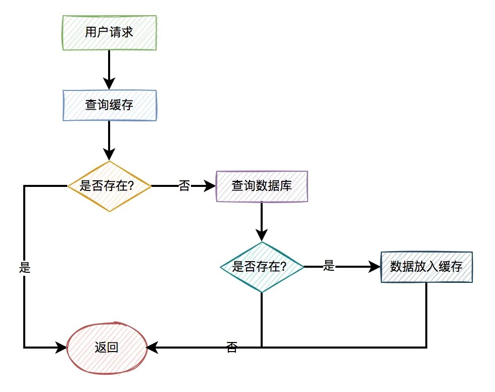


1.2 什么是缓存穿透？

但如果出现以下这两种特殊情况，比如：

- 用户请求的 id 在缓存中不存在。
- 恶意用户伪造不存在的 id 发起请求。

这样的用户请求导致的结果是：每次从缓存中都查不到数据，而需要查询数据库，同时数据库中也没有查到该数据，也没法放入缓存。也就是说，每次这个用户请求过来的时候，都要查询一次数据库。

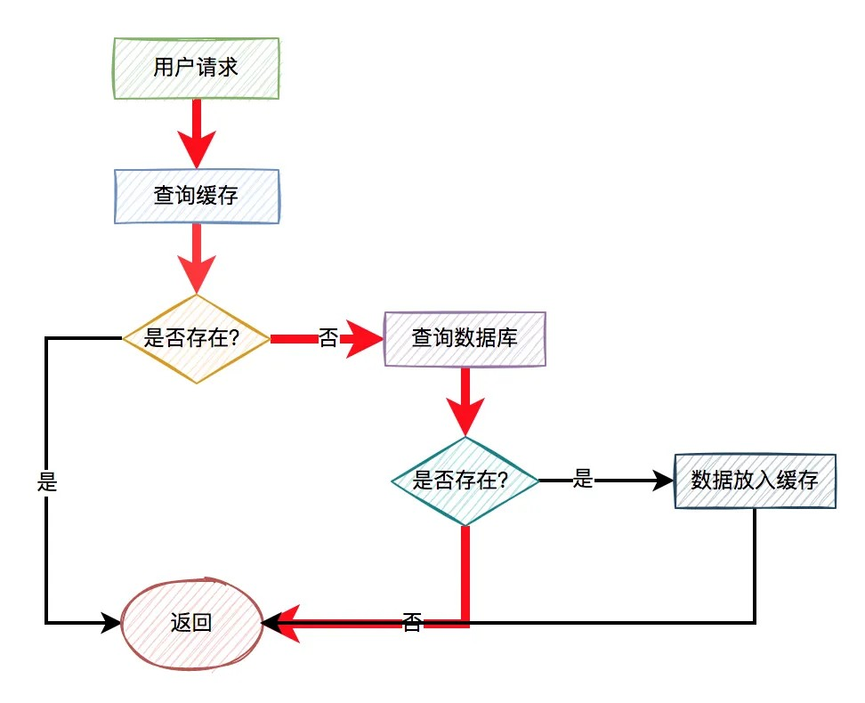

1.3 校验参数

我们可以对用户 id 做检验。

比如你的合法 id 是 15xxxxxx，以 15 开头的。如果用户传入了 16 开头的 id，比如：16232323，则参数校验失败，直接把相关请求拦截掉。这样可以过滤掉一部分恶意伪造的用户 id。

1.4 布隆过滤器

如果数据比较少，我们可以把数据库中的数据，全部放到内存的一个 map 中。这样能够非常快速的识别，数据在缓存中是否存在。如果存在，则让其访问缓存。如果不存在，则直接拒绝该请求。

但如果数据量太多了，有数千万或者上亿的数据，全都放到内存中，很显然会占用太多的内存空间。

那么，有没有办法减少内存空间呢？

答：这就需要使用布隆过滤器了。

布隆过滤器底层使用 bit 数组存储数据，该数组中的元素默认值是 0。布隆过滤器第一次初始化的时候，会把数据库中所有已存在的 key，经过一些列的 hash 算法（比如：三次 hash 算法）计算，每个 key 都会计算出多个位置，然后把这些位置上的元素值设置成 1。

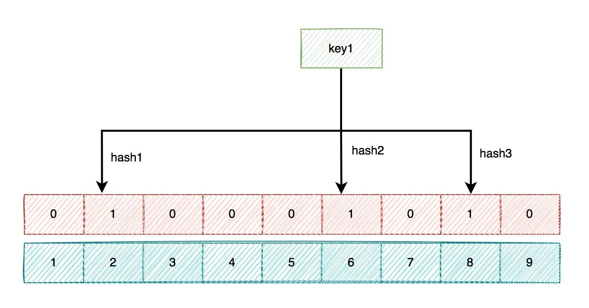

之后，有用户 key 请求过来的时候，再用相同的 hash 算法计算位置。

- 如果多个位置中的元素值都是 1，则说明该 key 在数据库中已存在。这时允许继续往后面操作。
- 如果有 1 个以上的位置上的元素值是 0，则说明该 key 在数据库中不存在。这时可以拒绝该请求，而直接返回。

使用布隆过滤器确实可以解决缓存穿透问题，但同时也带来了两个问题：

- 存在误判的情况。
- 存在数据更新问题。

先看看为什么会存在误判呢？

上面我已经说过，初始化数据时，针对每个 key 都是通过多次 hash 算法，计算出一些位置，然后把这些位置上的元素值设置成 1。

但我们都知道 hash 算法是会出现 hash 冲突的，也就是说不同的 key，可能会计算出相同的位置。

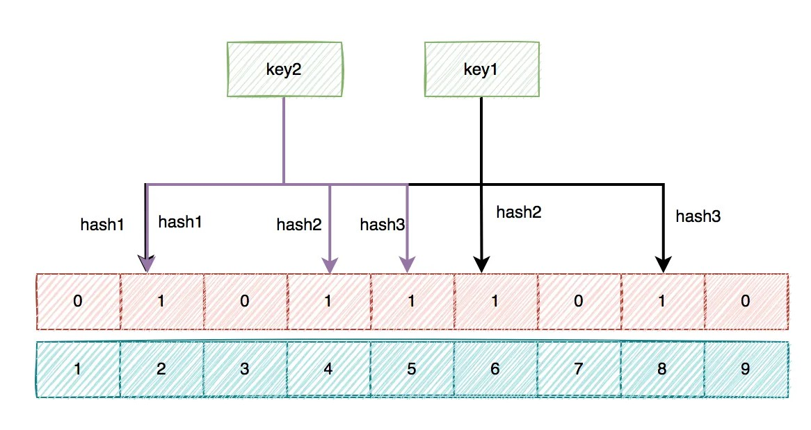

上图中的下标为 2 的位置就出现了 hash 冲突，key1 和 key2 计算出了一个相同的位置。

如果有几千万或者上亿的数据，布隆过滤器中的 hash 冲突会非常明显。

如果某个用户 key，经过多次 hash 计算出的位置，其元素值，恰好都被其他的 key 初始化成了 1。此时，就出现了误判，原本这个 key 在数据库中是不存在的，但布隆过滤器确认为存在。

> 如果布隆过滤器判断出某个 key 存在，可能出现误判。如果判断某个 key 不存在，则它在数据库中一定不存在。

通常情况下，布隆过滤器的误判率还是比较少的。即使有少部分误判的请求，直接访问了数据库，但如果访问量并不大，对数据库影响也不大。

此外，如果想减少误判率，可以适当增加 hash 函数，图中用的 3 次 hash，可以增加到 5 次。

其实，布隆过滤器最致命的问题是：如果数据库中的数据更新了，需要同步更新布隆过滤器。但它跟数据库是两个数据源，就可能存在数据不一致的情况。

比如：数据库中新增了一个用户，该用户数据需要实时同步到布隆过滤。但由于网络异常，同步失败了。

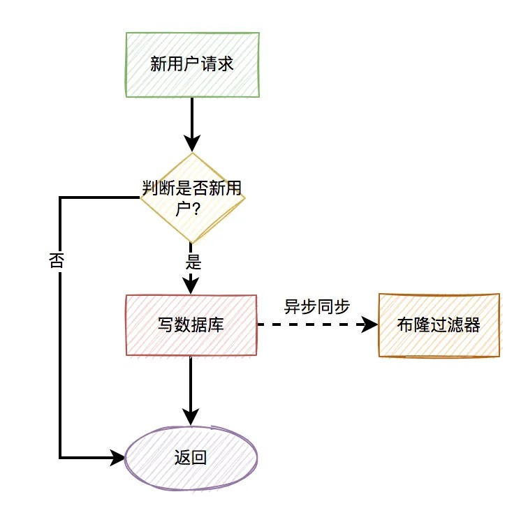

这时刚好该用户请求过来了，由于布隆过滤器没有该 key 的数据，所以直接拒绝了该请求。但这个是正常的用户，也被拦截了。

很显然，如果出现了这种正常用户被拦截了情况，有些业务是无法容忍的。所以，布隆过滤器要看实际业务场景再决定是否使用，它帮我们解决了缓存穿透问题，但同时了带来了新的问题。


1.5 缓存空值

上面使用布隆过滤器，虽说可以过滤掉很多不存在的用户 id 请求。但它除了增加系统的复杂度之外，会带来两个问题：

- 布隆过滤器存在误杀的情况，可能会把少部分正常用户的请求也过滤了。
- 如果用户信息有变化，需要实时同步到布隆过滤器，不然会有问题。

所以，通常情况下，我们很少用布隆过滤器解决缓存穿透问题。其实，还有另外一种更简单的方案，即：缓存空值。

当某个用户 id 在缓存中查不到，在数据库中也查不到时，也需要将该用户 id 缓存起来，只不过值是空的。这样后面的请求，再拿相同的用户 id 发起请求时，就能从缓存中获取空数据，直接返回了，而无需再去查一次数据库。

优化之后的流程图如下：

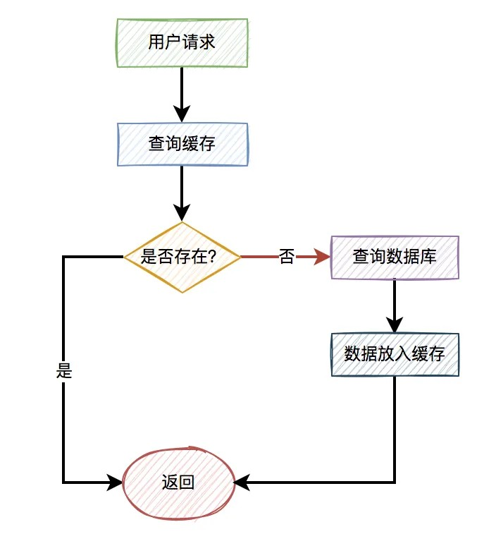

关键点是不管从数据库有没有查到数据，都将结果放入缓存中，只是如果没有查到数据，缓存中的值是空的罢了。

#### 2、缓存击穿问题

2.1 什么是缓存击穿？

有时候，我们在访问热点数据时。比如：我们在某个商城购买某个热门商品。

为了保证访问速度，通常情况下，商城系统会把商品信息放到缓存中。但如果某个时刻，该商品到了过期时间失效了。

此时，如果有大量的用户请求同一个商品，但该商品在缓存中失效了，一下子这些用户请求都直接怼到数据库，可能会造成瞬间数据库压力过大，而直接挂掉。

流程图如下：

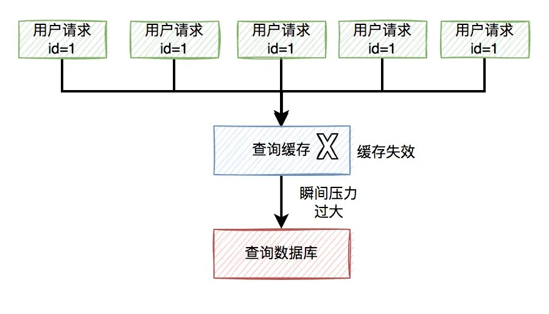

2.2 加锁

数据库压力过大的根源是，因为同一时刻太多的请求访问了数据库。

如果我们能够限制，同一时刻只有一个请求才能访问某个 productId 的数据库商品信息，不就能解决问题了？

答：没错，我们可以用加锁的方式，实现上面的功能。

2.3 自动续期

出现缓存击穿问题是由于 key 过期了导致的。那么，我们换一种思路，在 key 快要过期之前，就自动给它续期，不就 OK 了？

答：没错，我们可以用 job 给指定 key 自动续期。

比如说，我们有个分类功能，设置的缓存过期时间是 30 分钟。但有个 job 每隔 20 分钟执行一次，自动更新缓存，重新设置过期时间为 30 分钟。

此外，在很多请求第三方平台接口时，我们往往需要先调用一个获取 token 的接口，然后用这个 token 作为参数，请求真正的业务接口。一般获取到的 token 是有有效期的，比如 24 小时之后失效。

如果我们每次请求对方的业务接口，都要先调用一次获取 token 接口，显然比较麻烦，而且性能不太好。这时候，我们可以把第一次获取到的 token 缓存起来，请求对方业务接口时从缓存中获取 token。

同时，有一个 job 每隔一段时间，比如每隔 12 个小时请求一次获取 token 接口，不停刷新 token，重新设置 token 的过期时间。

2.4 缓存不失效

此外，对于很多热门 key，其实是可以不用设置过期时间，让其永久有效的。

比如参与秒杀活动的热门商品，由于这类商品 id 并不多，在缓存中我们可以不设置过期时间。在秒杀活动开始前，我们先用一个程序提前从数据库中查询出商品的数据，然后同步到缓存中，提前做预热。等秒杀活动结束一段时间之后，我们再手动删除这些无用的缓存即可。

#### 3、缓存雪崩问题

3.1 什么是缓存雪崩？

缓存雪崩是缓存击穿的升级版，缓存击穿说的是某一个热门 key 失效了，而缓存雪崩说的是有多个热门 key 同时失效。看起来，如果发生缓存雪崩，问题更严重。

缓存雪崩目前有两种：

- 有大量的热门缓存，同时失效。会导致大量的请求，访问数据库。而数据库很有可能因为扛不住压力，而直接挂掉。
- 缓存服务器 down 机了，可能是机器硬件问题，或者机房网络问题。总之，造成了整个缓存的不可用。

归根结底都是有大量的请求，透过缓存，而直接访问数据库了。

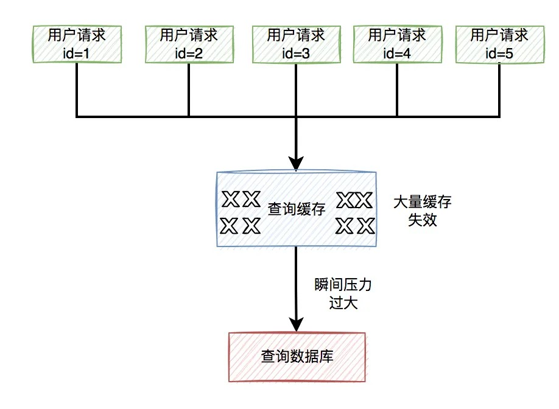

3.2 过期时间加随机数

为了解决缓存雪崩问题，我们首先要尽量避免缓存同时失效的情况发生。

这就要求我们不要设置相同的过期时间。可以在设置的过期时间基础上，再加个 1~60 秒的随机数。

3.3 高可用

针对缓存服务器 down 机的情况，在前期做系统设计时，可以做一些高可用架构。

比如：如果使用了 redis，可以使用哨兵模式，或者集群模式，避免出现单节点故障导致整个 redis 服务不可用的情况。使用哨兵模式之后，当某个 master 服务下线时，自动将该 master 下的某个 slave 服务升级为 master 服务，替代已下线的 master 服务继续处理请求。

3.4 服务降级

如果做了高可用架构，redis 服务还是挂了，该怎么办呢？

这时候，就需要做服务降级了。我们需要配置一些默认的兜底数据。程序中有个全局开关，比如有 10 个请求在最近一分钟内，从 redis 中获取数据失败，则全局开关打开。后面的新请求，就直接从配置中心中获取默认的数据。

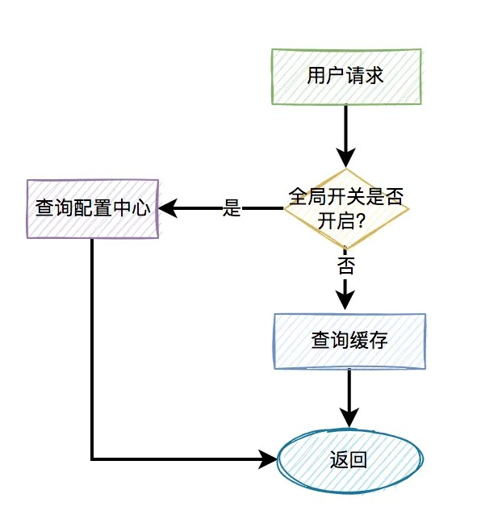

当然，还需要有个 job，每隔一定时间去从 redis 中获取数据，如果在最近一分钟内可以获取到两次数据（这个参数可以自己定），则把全局开关关闭。后面来的请求，又可以正常从 redis 中获取数据了。

需要特别说一句，该方案并非所有的场景都适用，需要根据实际业务场景决定。

### 3. [C++ 虚函数表剖析](https://zhuanlan.zhihu.com/p/75172640)

#### 一、概述

为了实现 C++ 的多态，C++ 使用了一种动态绑定的技术。这个技术的核心是虚函数表（下文简称虚表）。本文介绍虚函数表是如何实现动态绑定的。

#### 二、类的虚表

每个包含了虚函数的类都包含一个虚表。

我们知道，当一个类（A）继承另一个类（B）时，类 A 会继承类 B 的函数的调用权。所以如果一个基类包含了虚函数，那么其继承类也可调用这些虚函数，换句话说，一个类继承了包含虚函数的基类，那么这个类也拥有自己的虚表。

我们来看以下的代码。类 A 包含虚函数 vfunc1，vfunc2，由于类 A 包含虚函数，故类 A 拥有一个虚表。

```C++
class A {
public:
    virtual void vfunc1();
    virtual void vfunc2();
    void func1();
    void func2();
private:
    int m_data1, m_data2;
};
```

类 A 的虚表如图 1 所示。

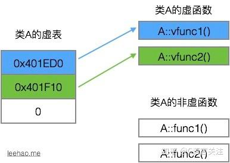

图 1：类 A 的虚表示意图

虚表是一个指针数组，其元素是虚函数的指针，每个元素对应一个虚函数的函数指针。需要指出的是，普通的函数即非虚函数，其调用并不需要经过虚表，所以虚表的元素并不包括普通函数的函数指针。
虚表内的条目，即虚函数指针的赋值发生在编译器的编译阶段，也就是说在代码的编译阶段，虚表就可以构造出来了。

#### 三、虚表指针

虚表是属于类的，而不是属于某个具体的对象，一个类只需要一个虚表即可。同一个类的所有对象都使用同一个虚表。

为了指定对象的虚表，对象内部包含一个虚表的指针，来指向自己所使用的虚表。为了让每个包含虚表的类的对象都拥有一个虚表指针，编译器在类中添加了一个指针，`*__vptr`，用来指向虚表。这样，当类的对象在创建时便拥有了这个指针，且这个指针的值会自动被设置为指向类的虚表。

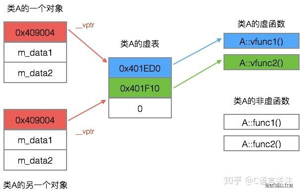

图 2：对象与它的虚表

上面指出，一个继承类的基类如果包含虚函数，那个这个继承类也有拥有自己的虚表，故这个继承类的对象也包含一个虚表指针，用来指向它的虚表。

#### 四、动态绑定

说到这里，大家一定会好奇 C++ 是如何利用虚表和虚表指针来实现动态绑定的。我们先看下面的代码。

```C++
class A {
public:
    virtual void vfunc1();
    virtual void vfunc2();
    void func1();
    void func2();
private:
    int m_data1, m_data2;
};
class B : public A {
public:
    virtual void vfunc1();
    void func1();
private:
    int m_data3;
};
class C: public B {
public:
    virtual void vfunc2();
    void func2();
private:
    int m_data1, m_data4;
};
```

类 A 是基类，类 B 继承类 A，类 C 又继承类 B。类 A，类 B，类 C，其对象模型如下图 3 所示。

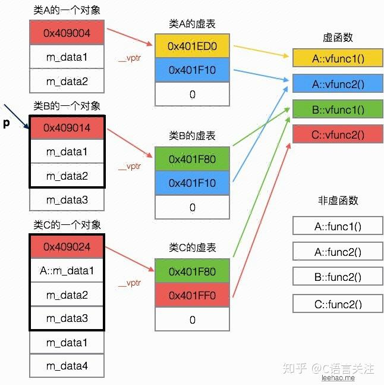

图 3：类 A，类 B，类 C 的对象模型

由于这三个类都有虚函数，故编译器为每个类都创建了一个虚表，即类 A 的虚表（A vtbl），类 B 的虚表（B vtbl），类 C 的虚表（C vtbl）。类 A，类 B，类 C 的对象都拥有一个虚表指针，`*__vptr`，用来指向自己所属类的虚表。

类 A 包括两个虚函数，故 A vtbl 包含两个指针，分别指向 `A::vfunc1()` 和 `A::vfunc2()`。

类 B 继承于类 A，故类 B 可以调用类 A 的函数，但由于类 B 重写了 `B::vfunc1()` 函数，故 B vtbl 的两个指针分别指向 `B::vfunc1()` 和 `A::vfunc2()`。

类 C 继承于类 B，故类 C 可以调用类 B 的函数，但由于类 C 重写了 `C::vfunc2()` 函数，故 C vtbl 的两个指针分别指向 `B::vfunc1()` （指向继承的最近的一个类的函数）和 `C::vfunc2()`。

虽然图 3 看起来有点复杂，但是只要抓住 “对象的虚表指针用来指向自己所属类的虚表，虚表中的指针会指向其继承的最近的一个类的虚函数” 这个特点，便可以快速将这几个类的对象模型在自己的脑海中描绘出来。

非虚函数的调用不用经过虚表，故不需要虚表中的指针指向这些函数。

假设我们定义一个类 B 的对象bObject。由于bObject是类 B 的一个对象，故bObject包含一个虚表指针，指向类 B 的虚表。

```C++
int main() {
    B bObject;
}
```

现在，我们声明一个类 A 的指针 p 来指向对象bObject。虽然p是基类的指针只能指向基类的部分，但是虚表指针亦属于基类部分，所以p可以访问到对象bObject的虚表指针。bObject的虚表指针指向类 B 的虚表，所以p可以访问到 B vtbl。如图 3 所示。

```C++
int main() {
    B bObject;
    A *p = & bObject;
}
```

当我们使用p来调用vfunc1()函数时，会发生什么现象？

```C++
int main() {
    B bObject;
    A *p = & bObject;
    p->vfunc1();
}
```

程序在执行 `p->vfunc1()` 时，会发现p是个指针，且调用的函数是虚函数，接下来便会进行以下的步骤。

首先，根据虚表指针 `p->__vptr` 来访问对象bObject对应的虚表。虽然指针p是基类 `A*` 类型，但是 `*__vptr` 也是基类的一部分，所以可以通过 `p->__vptr` 可以访问到对象对应的虚表。

然后，在虚表中查找所调用的函数对应的条目。由于虚表在编译阶段就可以构造出来了，所以可以根据所调用的函数定位到虚表中的对应条目。对于 `p->vfunc1()` 的调用，B vtbl 的第一项即是 vfunc1 对应的条目。

最后，根据虚表中找到的函数指针，调用函数。从图 3 可以看到，B vtbl 的第一项指向 `B::vfunc1()`，所以 `p->vfunc1()` 实质会调用 `B::vfunc1()` 函数。

如果p指向类 A 的对象，情况又是怎么样？

```C++
int main() {
    A aObject;
    A *p = &aObject;
    p->vfunc1();
}
```

当aObject在创建时，它的虚表指针 `__vptr` 已设置为指向 A vtbl，这样 `p->__vptr` 就指向 A vtbl。vfunc1在 A vtbl 对应在条目指向了 `A::vfunc1()` 函数，所以 `p->vfunc1()` 实质会调用 `A::vfunc1()` 函数。

可以把以上三个调用函数的步骤用以下表达式来表示：

```C++
(*(p->__vptr)[n])(p)
```

可以看到，通过使用这些虚函数表，即使使用的是基类的指针来调用函数，也可以达到正确调用运行中实际对象的虚函数。

我们把经过虚表调用虚函数的过程称为动态绑定，其表现出来的现象称为运行时多态。动态绑定区别于传统的函数调用，传统的函数调用我们称之为静态绑定，即函数的调用在编译阶段就可以确定下来了。

那么，什么时候会执行函数的动态绑定？这需要符合以下三个条件。

- 通过指针来调用函数
- 指针 upcast 向上转型（继承类向基类的转换称为 upcast，关于什么是 upcast，可以参考本文的参考资料）
- 调用的是虚函数

如果一个函数调用符合以上三个条件，编译器就会把该函数调用编译成动态绑定，其函数的调用过程走的是上述通过虚表的机制。

#### 五、总结

封装，继承，多态是面向对象设计的三个特征，而多态可以说是面向对象设计的关键。C++ 通过虚函数表，实现了虚函数与对象的动态绑定，从而构建了 C++ 面向对象程序设计的基石。

#### 参考资料

- 《C++ Primer》第三版，中文版，潘爱民等译
- http://www.learncpp.com/cpp-tutorial/125-the-virtual-table/
- 侯捷《C++ 最佳编程实践》视频，极客班，2015
- Upcasting and Downcasting, http://www.bogotobogo.com/cplusplus/upcasting_downcasting.php

## tip [🔝](#weekly-92)

## share [🔝](#weekly-92)

### 1. [南风法则](https://wiki.mbalib.com/wiki/%E5%8D%97%E9%A3%8E%E6%B3%95%E5%88%99)

“南风”法则，源于法国作家拉封丹写过的一则寓言：北风和南风比威力，看谁能把行人身上的大衣脱掉。北风首先来一个冷风凛冽寒冷刺骨，结果行人把大衣裹得紧紧的。南风则徐徐吹动，顿时风和日丽，行人因为觉得春意上身，始而解开纽扣，继而脱掉大衣，南风获得了胜利。

“南风”法则也叫做“温暖”法则，它来源于法国作家拉•封丹写的这则寓言。它告诉我们：温暖胜于严寒。运用到管理实践中，南风法则要求管理者要尊重和关心下属，时刻以下属为本，多点“人情味”，多注意解决下属日常生活中的实际困难，使下属真正感受到管理者给予的温暖。这样，下属出于感激就会更加努力积极地为企业工作，维护企业利益。

古语云：得民心者得天下！只有真正俘获了员工的心灵，员工才会为企业的发展死心塌地地工作。在企业管理中多点人情味，少些铜臭味，有助于培养员工对企业的认同感和忠诚度。有了这些，企业在竞争中就能无往而不胜。

俗话说：“良言一句三冬暖，恶语伤人六月寒”，有时候怀柔政策胜于激烈对抗。企业经营的核心是客户，把客户需要放在第一位，用和煦的春风吹化客户心中的坚冰，才能得到对方的信任和支持。

[readme](../README.md) | [previous](202412W1.md) | [next](202412W3.md)
