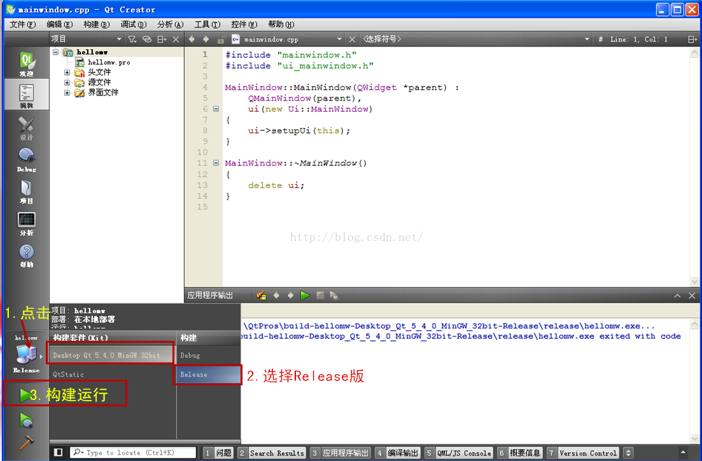
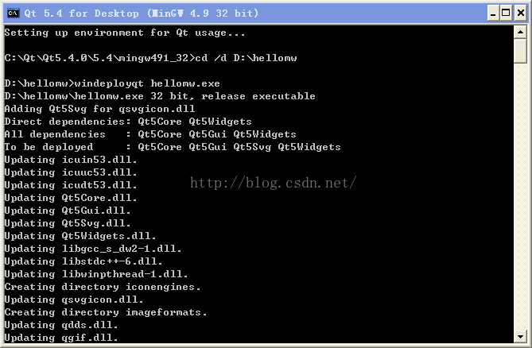
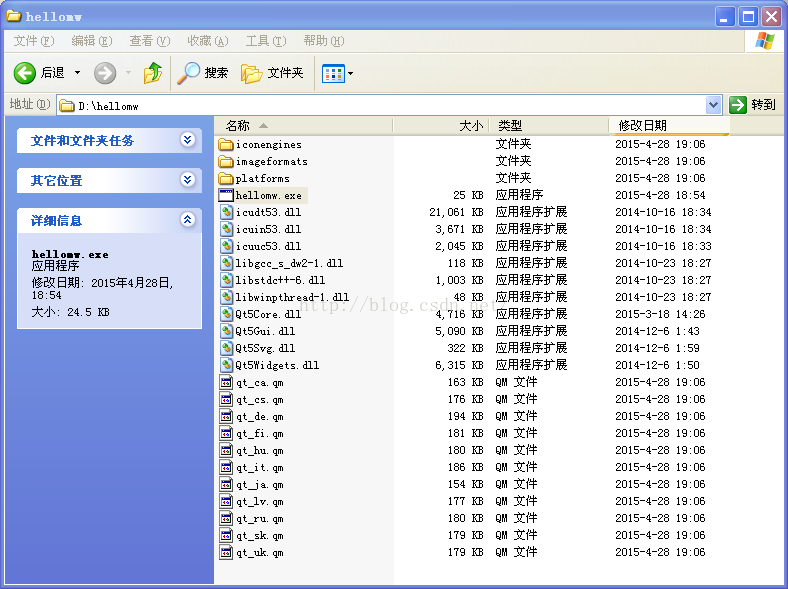
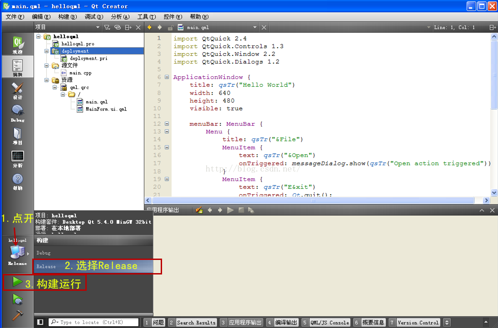
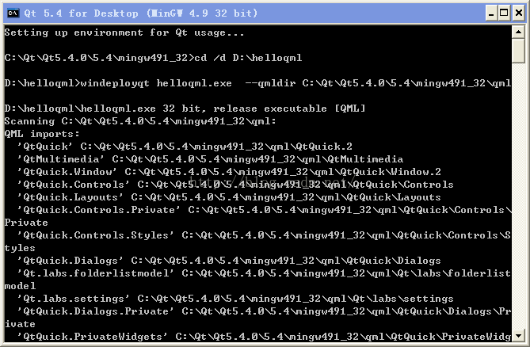
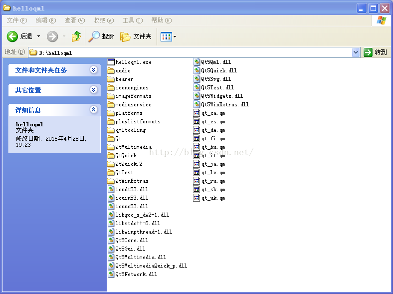

> @Author  : Lewis Tian (taseikyo@gmail.com)
>
> @Link    : github.com/taseikyo
>
> @Range   : 2024-12-15 - 2024-12-21

# Weekly #93

[readme](../README.md) | [previous](202412W2.md) | [next](202412W4.md)

本文总字数 10239 个，阅读时长约： 14 分 15 秒，统计数据来自：[算筹字数统计](http://www.xiqei.com/tools?p=tj)。


\**Photo by [Vitolda Klein](https://unsplash.com/@little_klein) on [Unsplash](https://unsplash.com/photos/boy-in-gray-sweater-standing-on-green-grass-field-during-daytime-buCxrpmH3FI)*

## Table of Contents

- [algorithm](#algorithm-)
- [review](#review-)
	- 比较 PyInstaller 和 Nuitka
- [tip](#tip-)
	- python的打包神器：Nuitka
	- Qt 自定义对话框形状、移动窗体
	- Qt 程序打包发布方法（使用官方提供的 windeployqt 工具）
- [share](#share-)
	- 不值得定律

## algorithm [🔝](#weekly-93)

## review [🔝](#weekly-93)

### 1. [比较 PyInstaller 和 Nuitka](https://zhuanlan.zhihu.com/p/463597594)

1、Python 版本兼容性

PyInstaller 最新版本 (目前是 4.8) 支持 Python3.6-3.10。Nuitka 最新版本 (目前是 0.6.19) 支持 Python2.6-2.7 和 Python3.3-3.10。

2、环境配置

PyInstaller 无需进行环境配置，只需要 PyInstaller 这个库就可以打包了。Nuitka 的打包环境要求会比较高，除了需要下载 Nuitka 这个库，还需要 MinGW64、ccache、Dependency Walker。

3、跨平台性

PyInstaller 和 Nuitka 都能在 Windows、MacOS 和 Linxu 系统上进行打包操作，并生成相应平台的可执行文件。

4、文档

PyInstaller 文档比 Nuitka 文档更加详细，条理性要更胜一筹。Nuitka 文档中写的英语不是很标准，有语法错误，有时候会比较难看懂作者想要表达的意思 (作者本人不是以英语为母语的，所以可以理解吧)。

5、流行度

PyInstaller 出来时间比 Nuitka 早，在国内流行程度也比较高 (国外不清楚)。通过百度搜索的结果数量可以知道目前 PyInstaller 被使用地更多。当然光从这一点上比较会不准确，大家可以从其他平台搜索结果上再比较下。

6、安全性

PyInstaller 在打包时将 py 文件编译成 pyc 文件，这个可以直接被反编译。你也可以通过 --key 命令在打包时进行加密，但也不安全。如果要做到更高程度的安全性，可以结合 Cython 来加密打包。Nuitka 是直接将 py 文件编译成 c 语言级别的文件，安全性上面更胜一筹。

7、打包速度

对于简单的程序，两者的打包速度都是差不多的。不过碰到一个相对来说较大的库时，Nuitka 会去编译这个库，导致它的打包速度非常非常非常地慢。当然，第三方库的代码是不需要加密的，所以我们可以通过 --nofollow-imports 命令不编译引入的库，通过 --include-data-dir 命令直接复制进来 (当然你也可以后期手动复制)。PyInstaller 默认是直接复制进来的，不会进行编译。

8、报错解决

最常见的报错其实是 ModuleNotFoundError，也就是找不到相应库或模块。这个其实是比较基础的报错，解决方法就是找到相应的库或模块，打包进去就可以。PyInstaller 用 --hidden-import 解决，Nuitka 用 --include-package 或 --include-module 解决。如果上面的命令都解决不掉，那就手动复制下。如果手动复制能够解决掉，那么重新打包时可以用 --add-data(PyInstaller 上的) 或者 --include-data-dir 和 --include-data-file(Nuitka 上的) 命令直接将相应库或模块打包进去。

另外从上面的流行度比较可以看出，PyInstaller 目前的报错解决方案是更多的，毕竟 Nuitka 也才刚刚兴起。

9、打包大小

相信大家都比较关心这一点。我们需要明确的事情是，PyInstaller 和 Nuitka 都有单文件和多文件打包模式，也就是打包成一个可执行文件和一个文件夹。一个误区就是，很多人把多文件模式打包后的 exe 同单文件打包模式后的 exe 进行比较。单文件打包模式把所有的依赖文件都放到了一个可执行文件中，而多文件模式是把依赖文件同可执行文件一起放在一个文件夹下的，所以单文件打包模式生成的可执行文件必然会大很多，两种打包模式后生成的可执行文件大小没有可比性。

要比的话肯定是在相同打包模式下进行比较，也就是说 pyinstaller -F 跟 nuitka --onefile 比，或者 pyinstaller -D 跟 nuitka --standalone 比。笔者就不进行打包演示了，因为单单拿在笔者自己电脑上的打包结果作为示例的话不够令人信服，请读者自己进行尝试。

不过不论是 PyInstaller 和 Nuitka，在 Windows 上打包时都可以用 UPX 进行压缩。在 PyInstaller 上我们可以用 --exclude-module 命令排除掉不必要的引入模块，从而减少包体大小。在 Nuitka 上使用 --onefile 命令打包时，zstandard 模块可以帮你减少包体大小。

10、打包后的启动速度

跟上面小节中讲的一样，不要拿多文件打包模式和单文件打包模式来比较，要比就比一样的。笔者在《PyInstaller 打包实战指南》和《Nuitka 打包实战指南》中都写过单文件打包模式下可执行文件的运行原理——都会先花时间把依赖文件解压到临时文件夹下，然后再启动主程序。如果是多文件打包模式，依赖已经在文件夹下了，那么可执行文件运行也就不会再先花时间解压，而是直接启动主程序。

笔者看到网上很多说 Nuitka 启动速度比 PyInstaller 快很多的，多半是犯了上面这个错误。其实启动速度从人眼角度来看的话不会相差很多，当然从毫秒计时上来看，Nuitka 还是有优势的，毕竟是编译成了 C。

## tip [🔝](#weekly-93)

### 1. [python的打包神器：Nuitka](https://www.lixiaofei2yy.website/python%E7%9A%84%E6%89%93%E5%8C%85%E7%A5%9E%E5%99%A8nuitka)

#### 一. pyinstaller和Nuitka使用感受

1.1 使用需求

这次也是由于项目需要，要将python的代码转成exe的程序，在找了许久后，发现了2个都能对python项目打包的工具——pyintaller和nuitka。

这2个工具同时都能满足项目的需要：

- 隐藏源码。这里的pyinstaller是通过设置key来对源码进行加密的；而nuitka则是将python源码转成C++（这里得到的是二进制的pyd文件，防止了反编译），然后再编译成可执行文件。
- 方便移植。用户使用方便，不用再安装什么python啊，第三方包之类的。

1.2 使用感受

2个工具使用后的最大的感受就是：

- pyinstaller体验很差！
	- 一个深度学习的项目最后转成的exe竟然有近3个G的大小（pyinstaller是将整个运行环境进行打包），对，你没听错，一个EXE有3个G！
	- 打包超级慢，启动超级慢。
- nuitka真香！
	- 同一个项目，生成的exe只有7M！
	- 打包超级快（1min以内），启动超级快。

#### 二. Nuitka的安装及使用

2.1 nuitka的安装

- 直接利用pip即可安装：`pip install Nuitka`
- 下载vs2019(MSVS)或者MinGW64，反正都是C++的编译器，随便下。

2.2 使用过程

对于第三方依赖包较多的项目（比如需要 import torch,tensorflow,cv2,numpy,pandas,geopy 等等）而言，这里最好打包的方式是只将属于自己的代码转成 C++，不管这些大型的第三方包！

以下是我 demo 的一个目录结构（这里使用了 pytq5 框架写的界面）：

```BASH
├─utils //源码1文件夹
├─src // 源码2文件夹
├─logo.ico // demo的图标
└─demo.py // main文件
```

使用以下命令（调试）直接生成 exe 文件：

```BASH
nuitka --standalone --show-memory --show-progress --nofollow-imports 
	--plugin-enable=qt-plugins --follow-import-to=utils,src 
	--output-dir=out --windows-icon-from-ico=./logo.ico demo.py
```

这里简单介绍下我上面的 nuitka 的命令：

- `--standalone`：方便移植到其他机器，不用再安装 python
- `--show-memory --show-progress`：展示整个安装的进度过程
- `--nofollow-imports`：不编译代码中所有的 import，比如 keras，numpy 之类的。
- `--plugin-enable=qt-plugins`：我这里用到 pyqt5 来做界面的，这里 nuitka 有其对应的插件。
- `--follow-import-to=utils,src`：需要编译成 C++ 代码的指定的 2 个包含源码的文件夹，这里用,来进行分隔。
- `--output-dir=out`：指定输出的结果路径为 out。
- `--windows-icon-from-ico=./logo.ico`：指定生成的 exe 的图标为 logo.ico 这个图标，这里推荐一个将图片转成 ico 格式文件的网站（比特虫）。
- `--windows-disable-console`：运行 exe 取消弹框。这里没有放上去是因为我们还需要调试，可能哪里还有问题之类的。

经过 1min 的编译之后，你就能在你的目录下看到：

```bash
├─utils //源码1文件夹
├─src // 源码2文件夹
├─out // 生成的exe文件夹
    ├─demo.build 
    └─demo.dist
		└─demo.exe // 生成的exe文件
├─logo.ico // demo的图标
└─demo.py // main文件
```

当然这里你会发现真正运行 exe 的时候，会报错：`no module named torch,cv2,tensorflow` 等等这些没有转成 C++ 的第三方包。

这里需要找到这些包（我的是在 `software\python3.7\Lib\site-packages` 下）复制（比如 numpy,cv2 这个文件夹）到 demo.dist 路径下。

至此，exe 能完美运行啦！

### 2. [Qt自定义对话框形状、移动窗体](https://blog.csdn.net/u012319493/article/details/52281192)

mainwindow.h

```C++
#ifndef MAINWINDOW_H
#define MAINWINDOW_H
#include <QMainWindow>
#include <QLabel>
#include <QMouseEvent>
namespace Ui {
	class MainWindow;
}
class MainWindow : public QMainWindow {
	Q_OBJECT
	public:
	    explicit MainWindow(QWidget *parent = 0);
	~MainWindow();
	protected:
	//重载基类的鼠标按下事件处理函数
	virtual void mousePressEvent(QMouseEvent *event);
	//重载基类的鼠标释放事件处理函数
	virtual void mouseReleaseEvent(QMouseEvent *event);
	//重载基类的鼠标移动事件处理函数
	virtual void mouseMoveEvent(QMouseEvent *event);
	private:
	    Ui::MainWindow *ui;
	QLabel *m_pObjBg;
	//对话框背景图片
	QPoint move_point;
	//鼠标按下位置
	bool mouse_press;
	//鼠标是否按下的标识
}
#endif // MAINWINDOW_H
```

mainwindow.cpp

```C++
#include "mainwindow.h"
#include "ui_mainwindow.h"
#include <QDebug>
MainWindow::MainWindow(QWidget *parent) :
    QMainWindow(parent),
    ui(new Ui::MainWindow) {
	//ui->setupUi(this);
	//设置界面背景透明
	QPalette palette = this->palette();
	palette.setBrush(QPalette::Window, QBrush(Qt::NoButton));
	//透明画刷
	setPalette(palette);
	//设置当前对话框的调色板
	setAutoFillBackground(true);
	//自动填充背景颜色
	setWindowFlags(Qt::FramelessWindowHint | Qt::Dialog | Qt::WindowStaysOnTopHint);
	//屏幕边框消失，窗体位于最前方
	setAttribute(Qt::WA_TranslucentBackground);
	//窗体透明
	//背景标签
	m_pObjBg = new QLabel(this);
	QPixmap pmpBg(":/bg3.png");
	m_pObjBg->setFixedSize(pmpBg.width(), pmpBg.height());
	//设置背景标签的大小和背景图标大小一致
	this->setFixedSize(pmpBg.width(), pmpBg.height());
	//设置背景标签样式表
	m_pObjBg->setStyleSheet("QLabel {background-image: url(:/bg3.png);}");
	m_pObjBg->move(0, 0);
	m_pObjBg->setVisible(true);
}
MainWindow::~MainWindow() {
	delete ui;
}
//重载基类的鼠标按下事件处理函数
void MainWindow:: mousePressEvent(QMouseEvent *event) {
	//只能是鼠标左键移动
	if(event->button() == Qt::LeftButton) {
		mouse_press = true;
	}
	/*
     * 窗口移动距离
     * globalPose(), 以桌面左上角为原点，绝对坐标
     * pos(), 窗体左上角（不含边框）的坐标，只要鼠标在窗体内，且窗体不动，坐标不变
     */
	move_point = event->globalPos() - pos();
}
//重载基类的鼠标释放事件处理函数
void MainWindow:: mouseReleaseEvent(QMouseEvent *event) {
	mouse_press = false;
}
//重载基类的鼠标移动事件处理函数
void MainWindow:: mouseMoveEvent(QMouseEvent *event) {
	//移动窗口
	if(mouse_press) {
		/*
         *  event->globalPos() - move_point
         * =event->globalPos() - (event->globalPos0() - pos0())
         * =pos() + (event->globalPos() - event->globalPos0())
         */
		move(event->globalPos() - move_point);
	}
}
```

运行结果：


### 3. [Qt 程序打包发布方法（使用官方提供的 windeployqt 工具）](https://blog.csdn.net/iw1210/article/details/51253458)

Qt 官方开发环境使用的动态链接库方式，在发布生成的 exe 程序时，需要复制一大堆 dll，如果自己去复制 dll，很可能丢三落四，导致 exe 在别的电脑里无法正常运行。因此 Qt 官方开发环境里自带了一个工具：windeployqt.exe。

以官方 Qt 5.4.0+MinGW 开发环境为例，windeployqt 工具在 `%QTDIR%\Qt5.4.0\5.4\mingw491_32\bin` 目录下，其中 QTDIR 是 Qt 的安装目录，是环境变量。

在集成开发环境 QtCreator 中可选择 “Qt Widgets Application” 或 “Qt Quick Application” 两种方式生成图形界面应用程序。

下面分别介绍这两种方式创建应用的发布方式。

#### 1、Qt Widgets Application

首先用 QtCreator 新建一个 Qt Widgets Application 项目，直接用默认的 QMainWindow 程序就可以了，项目名字假定是 hellomw。

然后以 Release 方式编译生成 exe 程序：



生成的程序运行正常之后，找到项目的生成目录，比如 项目源码路径：`C:\QtPros\hellomw\`

它的项目生成目录是 `C:\QtPros\build-hellomw-Desktop_Qt_5_4_0_MinGW_32bit-Release\`

进入这个文件夹，在进入它的子文件夹 release 里面，找到 hellomw.exe，将这个 exe 复制到一个新的单独的文件夹里用于发布，比如存到 `D:\hellomw\` 文件夹里面。

然后从开始菜单打开 Qt 命令行，输入命令：`cd /d D:\hellomw`
然后使用 windeployqt 工具命令：`windeployqt hellomw.exe`



然后可以在 `D:\hellomw` 文件夹里看到 windeployqt 工具自动复制的插件文件夹和 dll 文件、qm 文件。这时候得到的就完整的 exe 程序发布集合，依赖关系都解决好了。



把 `D:\hellomw` 文件夹 打包就可以发布了，不用自己一个个找 dll 文件了。`D:\hellomw` 文件夹里的 qm 文件是多国语言翻译文件，不需要可以删了，其他的都保留。

#### 2、Qt Quick Application

首先用 QtCreator 新建一个 Qt Quick Application 项目，直接用默认的项目模版，点击下一步生成项目，项目名字假定是 helloqml。
然后以 Release 方式编译生成 exe 程序：



然后找到项目的构建目录，比如项目源码目录 `C:\QtPros\helloqml`

它的构建目录是：`C:\QtPros\build-helloqml-Desktop_Qt_5_4_0_MinGW_32bit-Release\`

进入这个目录，再进入 release 子文件夹，找到 helloqml.exe ，复制到一个新的单独的文件夹里面，比如 `D:\helloqml\` 文件夹里面。

然后从开始菜单打开 Qt 命令行，进入 `D:\helloqml\` 文件夹：`cd /d D:\helloqml`
然后使用 windeployqt 工具命令：`windeployqt helloqml.exe --qmldir C:\Qt\Qt5.4.0\5.4\mingw491_32\qml`



注意不要跟完全一样照抄上条命令！`--qmldir` 是指出 Qt 库里面的 qml 文件夹位置，上面命令里 `C:\Qt\Qt5.4.0` 是 Qt 官方开发环境安装的文件夹，`C:\Qt\Qt5.4.0\5.4\mingw491_32` 是 Qt 类库的目录（QTDIR），因此使用的 --qmldir 后面写的是 `C:\Qt\Qt5.4.0\5.4\mingw491_32\qml` ，读者 Qt 环境安装路径不一样，要根据实际情况修改！

然后可以看到 `D:\helloqml` 文件夹里有一大堆文件，就是 QtQuick 程序需要的依赖文件。将整个 `D:\helloqml` 文件夹 打包就可以发布出去，在别的电脑上使用。



这个 `D:\helloqml` 文件夹里的东西很多，看不懂就不要删，老老实实打包发布就行了。

上面是最简单的程序发布，实际复杂程序可能还带一些图片文件、数据库文件、配置文件之类的，可以按自己需要添加这些文件到发布文件夹里面。

## share [🔝](#weekly-93)

### 1. [不值得定律](https://wiki.mbalib.com/wiki/%E4%B8%8D%E5%80%BC%E5%BE%97%E5%AE%9A%E5%BE%8B)

不值得定律最直观的表述是： **不值得做的事情，就不值得做好** ，这个定律似乎再简单不过了，但它的重要性却时时被人们疏忽。不值得定律反映出人们的一种心理，一个人如果从事的是一份自认为不值得做的事情，往往会保持冷嘲热讽，敷衍了事的态度。不仅成功率小，而且即使成功，也不会觉得有多大的成就感。

#### 不值得定律的三个因素

- 价值观。关于价值观我们已经谈了很多，只有符合我们价值观的事，我们才会满怀热情去做
- 个性和气质。一个人如果做一份与他的个性气质完全背离的工作，他是很难做好的，如一个好交往的人成了档案员，或一个害羞者不得不每天和不同的人打交道。
- 现实的处境。同样一份工作，在不同的处境下去做，给我们的感受也是不同的。例如，在一家大公司，如果你最初做的是打杂跑腿的工作，你很可能认为是不值得的，可是，一旦你被提升为领班或部门经理，你就不会这样认为了。

#### 如何避免“不值得”观念产生

一、树立正确的价值观

**观念变则态度变、态度变则行为变、行为变则结果变。** 只要我们树立良好的世界观与人生价值观，客观地看待事情，我们就能比较理性地看待值得与不值得这个问题，不会凡事先想到个人利益与得失，会想到公平、正义、他人与社会，只有这样你才会觉得有很多事都值得做。

二、丰富自已的人生阅历，不断补充知识，增强辨识能力

论语中说：“十五而上学、三十而立、四十不惑、五十知天命、六十而耳顺”，就是说人生是不断学习不断丰富不断提高的过程，我们随着年龄的增长知识与辨识能力也会越来越高，越来越能正确分辨哪些事情是值得做哪些事是不值得做。

三、换位思考

俗语说旁观者清当局者迷，往往自已置身其中很难看清楚是非曲直，只有跳出来以他人的眼光来看会有不同的看法。我们与对方或他人调换位置与角度来看问题，站在他们的立埸看会多一些理解与包容，看问题更全面、考虑更周到，这样你就会对一些当初认为不值得的事情产生改观。

四、善于听取他人意见，多听、多看、多想，三思而后行

每个人都有自已看不到、想不到的盲点，所以我们平时要多听、多看、多想,参考他人意见，使对某一事物的判断更准确，减少失误，避免过份不值得现象的出现。

#### 不值得定律的管理启示

许多人不知道自己应该做什么，结果做了些不值得做的事情。

下面有4个很好的理由说明了绝对不要做不值得做的事：

- 做不值得做的事，会让你误以为自己在完成某些事情。你耗时费力，得到的可能仅仅是一丝自我安慰和虚幻的满足感。
- 不值得做的事会消耗时间与精力。资源是稀缺的，用在一项活动上的资源不能再用在其他的活动上。
- 不值得做的事会赋予自己生命。记住社会学家韦伯的警告：一项活动的单纯规律性会逐渐演变为必然性。
- 不值得做的事会生生不息。做了不值得的事之后，接下来要为不值得之事继续提供值得后续的理由。不然你的精神无从寄托。

成功的秘诀是抓住重要的目标不放。所以，不要做自己的奴隶，不是每件事都必须做。很多事情只不过是在浪费我们大家的时间、精力和生命罢了。一流的人做一流的事，不该做的事，千万别去做。很多时候，做一件正确的事情，要比正确地做十件事情重要得多。

**总结一下，值得做的工作是：符合我们的价值观，适合我们的个性与气质，并能让我们看到期望。如果你的工作不具备这三个因素，你就要考虑换一个更合适的工作，并努力做好它。**

因此，对个人来说，应在多种可供选择的奋斗目标及价值观中挑选一种，然后为之而奋斗。“选择你所爱的，爱你所选择的”，才可能激发我们的奋斗毅力，也才可以心安理得。而对一个企业或组织来说，则要很好地分析员工的性格特性，合理分配工作，如让成就欲较强的职工单独或牵头来完成具有一定风险和难度的工作，并在其完成时给予定时的肯定和赞扬；让依附欲较强的职工更多地参加到某个团体中共同工作；让权力欲较强的职工担任一个与之能力相适应的主管。同时要加强员工对企业目标的认同感，让员工感觉到自己所做的工作是值得的，这样才能激发职工的热情。

**成功可以招引朋友，挫折可以考验朋友。——贺拉斯**

[readme](../README.md) | [previous](202412W2.md) | [next](202412W4.md)
