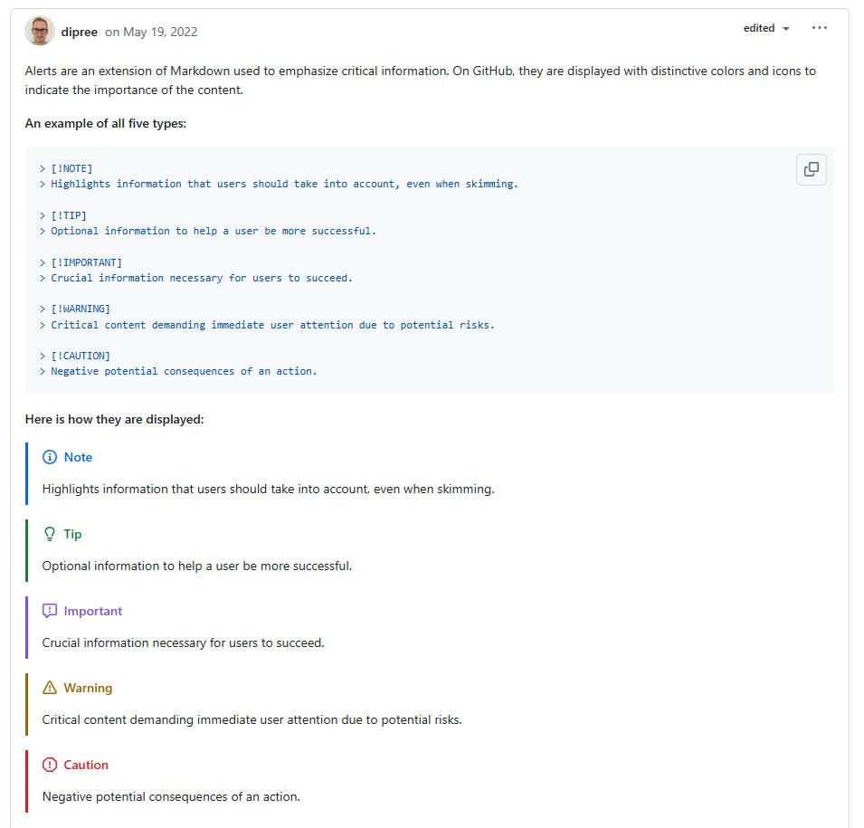

> @Author  : Lewis Tian (taseikyo@gmail.com)
>
> @Link    : github.com/taseikyo
>
> @Range   : 2024-12-22 - 2024-12-28

# Weekly #94

[readme](../README.md) | [previous](202412W3.md) | [next](202501W1.md)


\**Photo by [Eric Aiden](https://unsplash.com/@ericaiden) on [Unsplash](https://unsplash.com/photos/silhouette-of-woman-standing-near-aquarium-SywC065r66s)*

## Table of Contents

- [algorithm](#algorithm-)
- [review](#review-)
	- 从15年开发SumatraPDF：一款Windows开源应用中学到的经验（英文）
- [tip](#tip-)
	- github markdown alert box
- [share](#share-)

## algorithm [🔝](#weekly-94)

## review [🔝](#weekly-94)

### 1. [从15年开发SumatraPDF：一款Windows开源应用中学到的经验（英文）](https://blog.kowalczyk.info/article/2f72237a4230410a888acbfce3dc0864/lessons-learned-from-15-years-of-sumatrapdf-an-open-source-windows-app.html)

本文是SumatraPDF创始人Krzysztof Kowalczyk对自己15年开源项目经验的总结，主要包含以下核心观点：

1. 项目起源  
   SumatraPDF最初是作者在Palm工作时为Foleo设备开发的PDF阅读器副产品，意外成为Windows平台的开源应用。

2. 开发理念  
   - 保持轻量快速：坚持使用Win32 API而非GUI框架，自主实现核心功能（如JSON/HTML解析器）  
   - 简单至上：拒绝过度定制化，通过高级设置文件平衡功能与简洁性  
   - 持续优化：通过性能分析、内存检测等工具保证代码质量  

3. 维护经验  
   - 频繁发布：只要有用户可见改进就发布新版本  
   - 错误处理：建立自动崩溃报告系统，结合日志和压力测试  
   - 技术迭代：从Poppler切换到MuPDF引擎，支持多文档格式  

4. 开源哲学  
   - 像商业软件一样运营：建立官网、论坛、SEO优化  
   - 保持项目自主性：拒绝盲目跨平台，坚持Windows专注  
   - 对金钱的务实态度：开源不适合盈利，主要通过捐赠获得少量收入  

5. 个人感悟  
   - "一夜成功需要十年"：项目经历了长期积累  
   - "似水而行"：根据环境变化灵活调整方向  
   - 在无代码审查和QA团队情况下，通过严格自律保证质量  

文章展现了作者对技术纯粹性的追求，以及作为独立开发者在功能、质量和维护成本间的平衡智慧。最后提出未来可能向编辑功能和Web化发展的设想，延续其"似水而行"的哲学。

## tip [🔝](#weekly-94)

### 1. [github markdown alert box](https://github.com/orgs/community/discussions/16925)

```Markdown
> [!NOTE]  
> Highlights information that users should take into account, even when skimming.

> [!TIP]
> Optional information to help a user be more successful.

> [!IMPORTANT]  
> Crucial information necessary for users to succeed.

> [!WARNING]  
> Critical content demanding immediate user attention due to potential risks.

> [!CAUTION]
> Negative potential consequences of an action.
```

> [!NOTE]  
> Highlights information that users should take into account, even when skimming.

> [!TIP]
> Optional information to help a user be more successful.

> [!IMPORTANT]  
> Crucial information necessary for users to succeed.

> [!WARNING]  
> Critical content demanding immediate user attention due to potential risks.

> [!CAUTION]
> Negative potential consequences of an action.



## share [🔝](#weekly-94)

[readme](../README.md) | [previous](202412W3.md) | [next](202501W1.md)
