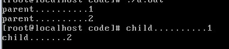
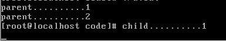

> @Author  : Lewis Tian (taseikyo@gmail.com)
>
> @Link    : github.com/taseikyo
>
> @Range   : 2025-01-05 - 2025-01-11

# Weekly #96

[readme](../README.md) | [previous](202501W1.md) | [next](202501W3.md)


\**Photo by [Denys Argyriou](https://unsplash.com/@argyriou) on [Unsplash](https://unsplash.com/photos/silhouette-man-with-layered-palm-tree-photograph-i76LC1sJdoI)*

## Table of Contents

- [algorithm](#algorithm-)
- [review](#review-)
	- 2024年底总结｜中年正道：祛魅熵减断舍离
	- Git Commit 规范
- [tip](#tip-)
	- return 0 与 exit(0)
- [share](#share-)

## algorithm [🔝](#weekly-96)

## review [🔝](#weekly-96)

### 1. [2024年底总结｜中年正道：祛魅熵减断舍离](https://www.jiemin.com/archives/1793.html)

“中年正道：祛魅、熵减、断舍离。” 这句话可以理解为一种面对中年人生状态的生活哲学和态度，主要涉及三个关键词：祛魅、熵减和断舍离。

1. 祛魅

- 含义：祛魅指的是去除不切实际的幻想和虚妄的追求，看清生活的本质。
- 中年视角：随着阅历的积累，中年人逐渐懂得“真实”比“光环”更重要，懂得生活不是为了取悦别人或追求表面的成功，而是要回归内心的宁静和真实的自我。
- 实践：放下不必要的面子、攀比心理和虚荣，接受自己的平凡，珍惜真实的幸福与平和。

2. 熵减

- 含义：熵是热力学概念，表示系统中的无序程度。熵减则意味着降低混乱，让生活更有秩序、更简洁。
- 中年视角：中年阶段，家庭、事业、人际关系往往达到复杂高峰，这时候需要有意识地“熵减”，减少生活中的无序感，专注于核心价值和重要的人事物。
- 实践：比如精简社交圈，拒绝无效社交，优化日常安排，提高生活效率，给自己的身体、心理减负。

3. 断舍离

- 含义：源自日本的生活哲学，强调通过“断绝不需要的东西，舍去多余的物品，脱离对物欲的执念”，从而获得内心的自由。
- 中年视角：在中年时期，人们的生活往往堆满了物质、琐事和情绪负担。学会断舍离，可以帮助人们轻装上阵，重新找回生活的掌控感和内心的平衡。
- 实践：清理家中不用的物品、整理复杂的人际关系、放下过去的遗憾和执念，将时间和精力聚焦于真正重要的事情上。

总结

这句话传达的是一种理性、成熟且积极的中年态度：放下虚幻，回归真实；减少混乱，追求秩序；清理多余，轻装前行。这样的生活方式有助于在中年这个人生关键时期，获得内外的平衡与安宁。

### 2. [Git Commit 规范](https://feflowjs.com/zh/guide/rule-git-commit.html)

Git commit日志基本规范

```
<type>(<scope>): <subject>
<BLANK LINE>
<body>
<BLANK LINE>
<footer>
```

type:

- feat： 新增 feature
- fix: 修复 bug
- docs: 仅仅修改了文档，比如 README, CHANGELOG, CONTRIBUTE等等
- style: 仅仅修改了空格、格式缩进、逗号等等，不改变代码逻辑
- refactor: 代码重构，没有加新功能或者修复 bug
- perf: 优化相关，比如提升性能、体验
- test: 测试用例，包括单元测试、集成测试等
- chore: 改变构建流程、或者增加依赖库、工具等
- revert: 回滚到上一个版本

格式要求：

```
# 标题行：50个字符以内，描述主要变更内容
#
# 主体内容：更详细的说明文本，建议72个字符以内。 需要描述的信息包括:
#
# * 为什么这个变更是必须的? 它可能是用来修复一个bug，增加一个feature，提升性能、可靠性、稳定性等等
# * 他如何解决这个问题? 具体描述解决问题的步骤
# * 是否存在副作用、风险?
#
# 尾部：如果需要的化可以添加一个链接到issue地址或者其它文档，或者关闭某个issue。
```

## tip [🔝](#weekly-96)

### 1. [return 0 与 exit(0)](http://blog.chinaunix.net/uid-28541347-id-3614892.html)

```c
#include "apue.h"
int fun() {
	int pid;
	if((pid=fork())<0)
	    printf("error\n");
	else if(pid==0) {
		printf("child..........1\n");
		//return 0;
		exit(0);
	} else {
		printf("parent..........1\n");
		return pid;
	}
}

int main(void) {
	int pid;
	pid=fun();
	if(pid==0) {
		printf("child.......2\n");
		exit(0);
	} else {
		printf("parent..........2\n");
		exit(2);
	}
}
```

我们知道当 `return 0` 和 `exit(0)` 用在主函数时候是相通的，但在分主函数中却是不能代替的。

看下面一段程序。当子函数调用 `return 0` 的时候，只是函数返回，子进程并没有结束；当子函数调用 `exit(0)`
 时，子进程结束。

运行结果：



return 0



exit(0)

## share [🔝](#weekly-96)

[readme](../README.md) | [previous](202501W1.md) | [next](202501W3.md)
