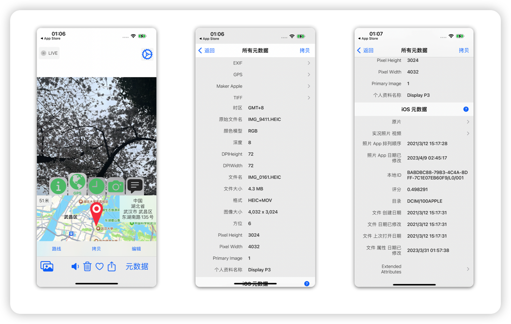

> @Author  : Lewis Tian (taseikyo@gmail.com)
>
> @Link    : github.com/taseikyo
>
> @Range   : 2025-01-12 - 2025-01-18

# Weekly #97

[readme](../README.md) | [previous](202501W2.md) | [next](202501W4.md)


\**Photo by [Andrey Zvyagintsev](https://unsplash.com/@zvandrei) on [Unsplash](https://unsplash.com/photos/woman-in-black-and-white-long-sleeve-shirt-standing-on-road-during-daytime-7N2NUZ9Vr40)*      

## Table of Contents

- [algorithm](#algorithm-)
- [review](#review-)
	- live 图原理介绍
- [tip](#tip-)
- [share](#share-)

## algorithm [🔝](#weekly-97)

## review [🔝](#weekly-97)

### 1. [live 图原理介绍](https://github.com/LLLLLayer/Live-Photos)

图片拥有属性，对于大多数图像文件格式，使用 [CGImageSource](https://developer.apple.com/documentation/imageio/cgimagesource) 类型可以有效地读取数据。可以使用 [The Photo Investigator](https://apps.apple.com/us/app/photo-investigator-view-edit/id571574618) 应用查看照片中的所有 Metadata：



拍摄照片时，Apple 相机会自动为照片添加不同种类的 Metadata。大多数元数据都很好理解，如位置存储在 GPS Metadata 中、相机信息位于 EXIF Metadata 中。

其中 [kCGImagePropertyMakerAppleDictionary](https://developer.apple.com/documentation/imageio/kcgimagepropertymakerappledictionary) 是 Apple 相机拍摄的照片的键值对字典。“17” 是 Maker Apple 中的 LivePhotoVideoIndex，是 Live Photo 的 Identifier Key，完整列表可以参考 [Apple Tags](https://exiftool.org/TagNames/Apple.html)。

Live Photo 需要有特殊 Metadata 的 JPEG 图像：

```Markdown
[kCGImagePropertyMakerAppleDictionary : [17 : <Identifier>]]
```

> [!NOTE]  
> 作者还介绍了如何 将 Live Photo 分解为照片和视频 以及 使用照片和视频创建 Live Photo

## tip [🔝](#weekly-97)

## share [🔝](#weekly-97)

[readme](../README.md) | [previous](202501W2.md) | [next](202501W4.md)
