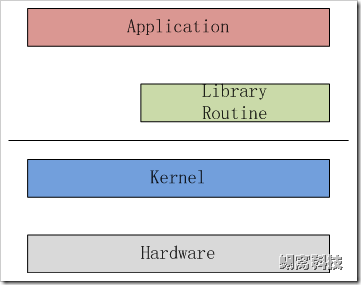
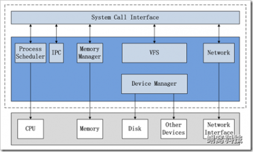
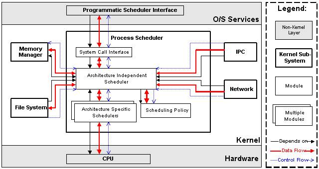
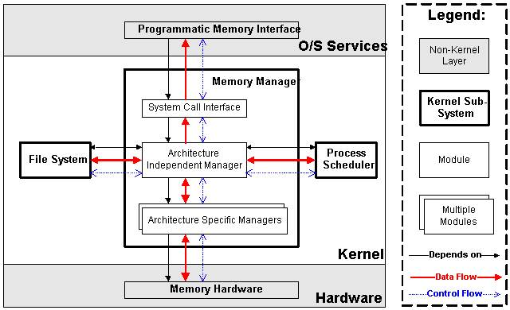
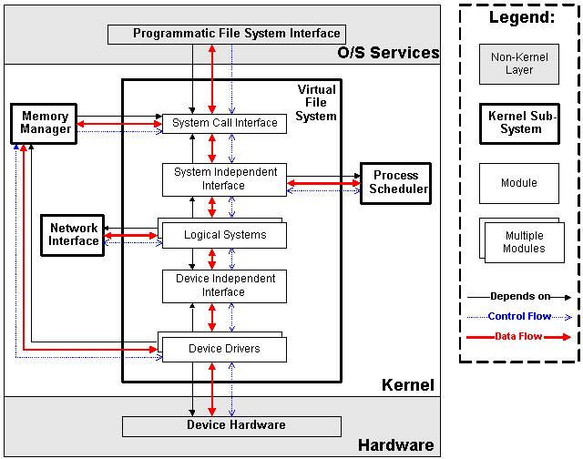
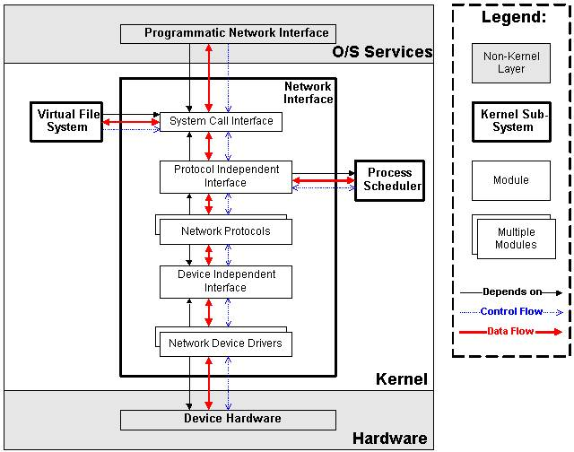
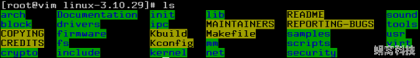

> @Author  : Lewis Tian (taseikyo@gmail.com)
>
> @Link    : github.com/taseikyo
>
> @Range   : 2025-01-19 - 2025-01-25

# Weekly #98

[readme](../README.md) | [previous](202501W3.md) | [next](202501W5.md)

本文总字数 9023 个，阅读时长约： 12 分 43 秒，统计数据来自：[算筹字数统计](http://www.xiqei.com/tools?p=tj)。


\**Photo by [Shin Shimami](https://unsplash.com/@shimami) on [Unsplash](https://unsplash.com/photos/a-woman-laying-on-top-of-a-bed-in-a-black-bra-rAqM0dye4nM)*

## Table of Contents

- [algorithm](#algorithm-)
- [review](#review-)
	- Linux 内核的整体架构
- [tip](#tip-)
	- c++与Python3互相调用
	- Markdown插入图片：本地图片、网络图片和Base64的详细示例
- [share](#share-)
	- 由 Flappy Bird 想到的技术观、哲学观和人生观

## algorithm [🔝](#weekly-98)

## review [🔝](#weekly-98)

### 1. [Linux 内核的整体架构](http://www.wowotech.net/linux_kenrel/11.html)

#### 1. 前言

本文和其它的 “Linux 内核分析” 文章都基于如下约定：

- 内核版本为 Linux 3.10.29（该版本是一个 long term 的版本，会被 Linux 社区持续维护至少 2 年），可以从下面的链接获取：https://www.kernel.org/pub/linux/kernel/v3.x/linux-3.10.29.tar.xz
- 鉴于嵌入式系统大多使用 ARM 处理器，因此涉及到体系结构部分的内容，都以 ARM 为分析对象

#### 2. Linux 内核的核心功能

如下图所示，Linux 内核只是 Linux 操作系统一部分。对下，它管理系统的所有硬件设备；对上，它通过系统调用，向 Library Routine（例如 C 库）或者其它应用程序提供接口。



因此，其核心功能就是：**管理硬件设备，供应用程序使用**。而现代计算机（无论是 PC 还是嵌入式系统）的标准组成，就是 CPU、Memory（内存和外存）、输入输出设备、网络设备和其它的外围设备。所以为了管理这些设备，Linux 内核提出了如下的架构。

#### 3. Linux 内核的整体架构

3.1 整体架构和子系统划分



上图说明了 Linux 内核的整体架构。根据内核的核心功能，Linux 内核提出了 5 个子系统，分别负责如下的功能：

1. Process Scheduler，也称作进程管理、进程调度。负责管理 CPU 资源，以便让各个进程可以以尽量公平的方式访问 CPU。
2. Memory Manager，内存管理。负责管理 Memory（内存）资源，以便让各个进程可以安全地共享机器的内存资源。另外，内存管理会提供虚拟内存的机制，该机制可以让进程使用多于系统可用 Memory 的内存，不用的内存会通过文件系统保存在外部非易失存储器中，需要使用的时候，再取回到内存中。
3. VFS（Virtual File System），虚拟文件系统。Linux 内核将不同功能的外部设备，例如 Disk 设备（硬盘、磁盘、NAND Flash、Nor Flash 等）、输入输出设备、显示设备等等，抽象为可以通过统一的文件操作接口（open、close、read、write 等）来访问。这就是 Linux 系统 “一切皆是文件” 的体现（其实 Linux 做的并不彻底，因为 CPU、内存、网络等还不是文件，如果真的需要一切皆是文件，还得看贝尔实验室正在开发的 "[Plan 9](http://plan9.bell-labs.com/plan9/)” 的）。
4. Network，网络子系统。负责管理系统的网络设备，并实现多种多样的网络标准。
5. IPC（Inter-Process Communication），进程间通信。IPC 不管理任何的硬件，它主要负责 Linux 系统中进程之间的通信。

3.2 进程调度（Process Scheduler)

进程调度是 Linux 内核中最重要的子系统，它主要提供对 CPU 的访问控制。因为在计算机中，CPU 资源是有限的，而众多的应用程序都要使用 CPU 资源，所以需要 “进程调度子系统” 对 CPU 进行调度管理。

进程调度子系统包括 4 个子模块（见下图），它们的功能如下：



1. Scheduling Policy，实现进程调度的策略，它决定哪个（或哪几个）进程将拥有 CPU。
2. Architecture-specific Schedulers，体系结构相关的部分，用于将对不同 CPU 的控制，抽象为统一的接口。这些控制主要在 suspend 和 resume 进程时使用，牵涉到 CPU 的寄存器访问、汇编指令操作等。
3. Architecture-independent Scheduler，体系结构无关的部分。它会和 “Scheduling Policy 模块” 沟通，决定接下来要执行哪个进程，然后通过“Architecture-specific Schedulers 模块”resume 指定的进程。
4. System Call Interface，系统调用接口。进程调度子系统通过系统调用接口，将需要提供给用户空间的接口开放出去，同时屏蔽掉不需要用户空间程序关心的细节。

3.3 内存管理（Memory Manager, MM)

内存管理同样是 Linux 内核中最重要的子系统，它主要提供对内存资源的访问控制。Linux 系统会在硬件物理内存和进程所使用的内存（称作虚拟内存）之间建立一种映射关系，这种映射是以进程为单位，因而不同的进程可以使用相同的虚拟内存，而这些相同的虚拟内存，可以映射到不同的物理内存上。

内存管理子系统包括 3 个子模块（见下图），它们的功能如下：



1. Architecture Specific Managers，体系结构相关部分。提供用于访问硬件 Memory 的虚拟接口。
2. Architecture Independent Manager，体系结构无关部分。提供所有的内存管理机制，包括：以进程为单位的 memory mapping；虚拟内存的 Swapping。
3. System Call Interface，系统调用接口。通过该接口，向用户空间程序应用程序提供内存的分配、释放，文件的 map 等功能。

3.4 虚拟文件系统（Virtual Filesystem, VFS）

传统意义上的文件系统，是一种存储和组织计算机数据的方法。它用易懂、人性化的方法（文件和目录结构），抽象计算机磁盘、硬盘等设备上冰冷的数据块，从而使对它们的查找和访问变得容易。因而文件系统的实质，就是 “存储和组织数据的方法”，文件系统的表现形式，就是 “从某个设备中读取数据和向某个设备写入数据”。

随着计算机技术的进步，存储和组织数据的方法也是在不断进步的，从而导致有多种类型的文件系统，例如 FAT、FAT32、NTFS、EXT2、EXT3 等等。而为了兼容，操作系统或者内核，要以相同的表现形式，同时支持多种类型的文件系统，这就延伸出了虚拟文件系统（VFS）的概念。VFS 的功能就是管理各种各样的文件系统，屏蔽它们的差异，以统一的方式，为用户程序提供访问文件的接口。

我们可以从磁盘、硬盘、NAND Flash 等设备中读取或写入数据，因而最初的文件系统都是构建在这些设备之上的。这个概念也可以推广到其它的硬件设备，例如内存、显示器（LCD）、键盘、串口等等。我们对硬件设备的访问控制，也可以归纳为读取或者写入数据，因而可以用统一的文件操作接口访问。Linux 内核就是这样做的，除了传统的磁盘文件系统之外，它还抽象出了设备文件系统、内存文件系统等等。这些逻辑，都是由 VFS 子系统实现。

VFS 子系统包括 6 个子模块（见下图），它们的功能如下：



1. Device Drivers，设备驱动，用于控制所有的外部设备及控制器。由于存在大量不能相互兼容的硬件设备（特别是嵌入式产品），所以也有非常多的设备驱动。因此，Linux 内核中将近一半的 Source Code 都是设备驱动，大多数的 Linux 底层工程师（特别是国内的企业）都是在编写或者维护设备驱动，而无暇估计其它内容（它们恰恰是 Linux 内核的精髓所在）。
2. Device Independent Interface， 该模块定义了描述硬件设备的统一方式（统一设备模型），所有的设备驱动都遵守这个定义，可以降低开发的难度。同时可以用一致的形势向上提供接口。
3. Logical Systems，每一种文件系统，都会对应一个 Logical System（逻辑文件系统），它会实现具体的文件系统逻辑。
4. System Independent Interface，该模块负责以统一的接口（快设备和字符设备）表示硬件设备和逻辑文件系统，这样上层软件就不再关心具体的硬件形态了。
5. System Call Interface，系统调用接口，向用户空间提供访问文件系统和硬件设备的统一的接口。

3.5 网络子系统（Net）

网络子系统在 Linux 内核中主要负责管理各种网络设备，并实现各种网络协议栈，最终实现通过网络连接其它系统的功能。在 Linux 内核中，网络子系统几乎是自成体系，它包括 5 个子模块（见下图），它们的功能如下：



1. Network Device Drivers，网络设备的驱动，和 VFS 子系统中的设备驱动是一样的。
2. Device Independent Interface，和 VFS 子系统中的是一样的。
3. Network Protocols，实现各种网络传输协议，例如 IP, TCP, UDP 等等。
4. Protocol Independent Interface，屏蔽不同的硬件设备和网络协议，以相同的格式提供接口（socket)。
5. System Call interface，系统调用接口，向用户空间提供访问网络设备的统一的接口。

至于 IPC 子系统，由于功能比较单纯，这里就不再描述了。

#### 4. Linux 内核源代码的目录结构

Linux 内核源代码包括三个主要部分：

1. 内核核心代码，包括第 3 章所描述的各个子系统和子模块，以及其它的支撑子系统，例如电源管理、Linux 初始化等
2. 其它非核心代码，例如库文件（因为 Linux 内核是一个自包含的内核，即内核不依赖其它的任何软件，自己就可以编译通过）、固件集合、KVM（虚拟机技术）等
3. 编译脚本、配置文件、帮助文档、版权说明等辅助性文件

下图示使用 ls 命令看到的内核源代码的顶层目录结构，具体描述如下。



```
include/ ---- 内核头文件，需要提供给外部模块（例如用户空间代码）使用。
kernel/ ---- Linux 内核的核心代码，包含了 3.2 小节所描述的进程调度子系统，以及和进程调度相关的模块。
mm/ ---- 内存管理子系统（3.3 小节）。
fs/ ---- VFS 子系统（3.4 小节）。
net/ ---- 不包括网络设备驱动的网络子系统（3.5 小节）。
ipc/ ---- IPC（进程间通信）子系统。
arch// ---- 体系结构相关的代码，例如 arm, x86 等等。  
	arch//mach- ---- 具体的 machine/board 相关的代码。  
	arch//include/asm ---- 体系结构相关的头文件。  
	arch//boot/dts ---- 设备树（Device Tree）文件。
init/ ---- Linux 系统启动初始化相关的代码。  
block/ ---- 提供块设备的层次。  
sound/ ---- 音频相关的驱动及子系统，可以看作 “音频子系统”。  
drivers/ ---- 设备驱动（在 Linux kernel 3.10 中，设备驱动占了 49.4 的代码量）。
lib/ ---- 实现需要在内核中使用的库函数，例如 CRC、FIFO、list、MD5 等。  
crypto/ ----- 加密、解密相关的库函数。  
security/ ---- 提供安全特性（SELinux）。  
virt/ ---- 提供虚拟机技术（KVM 等）的支持。  
usr/ ---- 用于生成 initramfs 的代码。  
firmware/ ---- 保存用于驱动第三方设备的固件。
samples/ ---- 一些示例代码。  
tools/ ---- 一些常用工具，如性能剖析、自测试等。
Kconfig, Kbuild, Makefile, scripts/ ---- 用于内核编译的配置文件、脚本等。
COPYING ---- 版权声明。  
MAINTAINERS ---- 维护者名单。  
CREDITS ---- Linux 主要的贡献者名单。  
REPORTING-BUGS ---- Bug 上报的指南。
Documentation, README ---- 帮助、说明文档。
```

#### 5. 附录

第 3 章各个子系统的架构图，拷贝自如下的网页：http://oss.org.cn/ossdocs/linux/kernel/a1/index.html

## tip [🔝](#weekly-98)

### 1. [c++与Python3互相调用](https://blog.csdn.net/cparent/article/details/9126587)

```C
#include <Python.h>
#include <string>
#include <codecvt>
int main(int argc, char** argv) {
	// 初始化Python
	//在使用Python系统前，必须使用Py_Initialize对其
	//进行初始化。它会载入Python的内建模块并添加系统路
	//径到模块搜索路径中。这个函数没有返回值，检查系统
	//是否初始化成功需要使用Py_IsInitialized。

	Py_Initialize();

	// 检查初始化是否成功
	if (!Py_IsInitialized()) {
	return -1;
	}

	// 添加当前路径
	//把输入的字符串作为Python代码直接运行，返回0
	//表示成功，-1表示有错。大多时候错误都是因为字符串
	//中有语法错误。
	PyRun_SimpleString("print(4+5)");
	PyRun_SimpleString("import sys");
	PyRun_SimpleString("sys.path.append('G:/pythonProject')");
	PyObject *pName, *pModule, *pDict, *pFunc, *pArgs, *pValue;

	std::wstring str = L"pytest";

	std::wstring_convert<std::codecvt_utf8<wchar_t>> conv;

	std::string sr = conv.to_bytes(str);
	// 载入名为pytest的脚本
	pName = PyUnicode_FromUnicode(str.c_str(), str.size());

	// pName = PyString_FromString("pytest");
	pModule = PyImport_ImportModule(sr.c_str());

	// pModule = PyImport_Import(pName);
	if (!pModule) {
	printf("can't find pytest.py");
	getchar();
	return -1;
	}
	pDict = PyModule_GetDict(pModule);
	if (!pDict) {
	return -1;
	}

	// 找出函数名为add的函数
	pFunc = PyDict_GetItemString(pDict, "add");
	if (!pFunc || !PyCallable_Check(pFunc)) {
	printf("can't find function [add]");
	getchar();
	return -1;
	}

	// 参数进栈
	pArgs = PyTuple_New(2);

	//  PyObject* Py_BuildValue(char *format, ...)
	//  把C++的变量转换成一个Python对象。当需要从
	//  C++传递变量到Python时，就会使用这个函数。此函数
	//  有点类似C的printf，但格式不同。常用的格式有
	//  s 表示字符串，
	//  i 表示整型变量，
	//  f 表示浮点数，
	//  O 表示一个Python对象。

	PyTuple_SetItem(pArgs, 0, Py_BuildValue("l", 3));
	PyTuple_SetItem(pArgs, 1, Py_BuildValue("l", 4));

	// 调用Python函数
	PyObject_CallObject(pFunc, pArgs);

	//下面这段是查找函数foo 并执行foo
	pFunc = PyDict_GetItemString(pDict, "foo");
	if (!pFunc || !PyCallable_Check(pFunc)) {
	printf("can't find function [foo]");
	getchar();
	return -1;
	}

	pArgs = PyTuple_New(1);
	PyTuple_SetItem(pArgs, 0, Py_BuildValue("l", 2));  //

	PyObject_CallObject(pFunc, pArgs);

	Py_DECREF(pName);
	Py_DECREF(pArgs);
	Py_DECREF(pModule);

	// 关闭Python
	Py_Finalize();

	system("pause");
	return 0;
}
```

```python
def add(a,b):
    print ("in python function add")
    print ("a = " + str(a))
    print ("b = " + str(b))
    print ("ret = " + str(a+b))
    return
def foo(a):
    print ("in python function foo")
    print ("a = " + str(a))
    print ("ret = " + str(a * a))
    return 
```

### 2. [Markdown插入图片：本地图片、网络图片和Base64的详细示例](https://developer.baidu.com/article/details/2746783)

一、插入本地图片

在 Markdown 中插入本地图片的语法很简单，只需要在文本中添加一个以 `!` 开头的行，后面跟着图片的路径。例如：

```

```

在这个例子中，`Alt text` 是图片的替代文本，当图片无法加载时，将显示这个文本。`/path/to/image.jpg` 是图片的路径，可以是相对路径或绝对路径。

二、插入网络图片

在 Markdown 中插入网络图片也很简单，只需要将图片的 URL 添加到 `` 的语法中即可。例如：

```

```

在这个例子中，`Alt text` 是图片的替代文本，`https://example.com/image.jpg` 是图片的 URL。

三、插入 Base64 编码的图片

Base64 是将二进制数据转换为可打印字符的一种编码方式。通过将图片转换为 Base64 编码，可以将图片直接嵌入到 Markdown 文件中，而无需使用外部文件。例如：

```
![Alt text][image-id]
[image-id]: data:image/png;base64,iVBORw0KGgoAAAANSUhEUgAAAAU... (Base64 encoded image data)

```

在这个例子中，`[image-id]` 是一个自定义的标识符，用于引用后面的 Base64 编码的图片数据。Base64 编码的图片数据被添加到 `[image-id]:` 后面，以 `data:image/png;base64,` 开头，后面跟着实际的 Base64 编码数据。

请注意，由于 Base64 编码的图片数据较长，直接在 Markdown 文件中写入可能会影响可读性。因此，建议将 Base64 编码的图片数据放在注释中或者单独的文件中，然后在 Markdown 文件中引用。

总结：在 Windows 上使用 Markdown 插入图片可以通过插入本地图片、网络图片和 Base64 编码的图片来实现。这些方法各有优缺点，根据实际情况选择最合适的方法即可。希望这个详细的例子能帮助你更好地在 Windows 上使用 Markdown 插入图片。

## share [🔝](#weekly-98)

### 1. [由 Flappy Bird 想到的技术观、哲学观和人生观](http://www.wowotech.net/tech_discuss/10.html)


1. 艺术的魅力
	- 艺术作品（如Flappy Bird）一旦发布，便脱离作者控制，引发多样解读，推动创新和文明发展。
	- 类比古典名著（如《红楼梦》），不同视角的解读丰富了作品内涵。
2. 简约的美
	- Flappy Bird 的成功源于极致简约的设计，以极简形式实现核心体验。
	- 将复杂问题简单化是最高境界（如乔布斯、Linux、Google），而将简单问题复杂化是下策。
3. 激励机制
	- 行为动机多样：恐惧、利益、名望、兴趣或纯粹愉悦。
	- 游戏中过分追求分数反而易失败，专注过程（如“心中无分”）更易成功，隐喻人生需放下执念。
4. 人生的浮沉
	- 游戏中的失败多发生于平淡阶段，而非极端挑战时，启示：
		- 生活中重大困难需“挺一下”即可度过；
		- 平淡时松懈易导致失败（如“生于忧患，死于安乐”）。

核心观点：Flappy Bird 不仅是游戏，更映射了艺术传播、简约设计、动机心理学和人生哲理，提醒人们专注过程、保持谦逊，在平凡中警惕松懈。

[readme](../README.md) | [previous](202501W3.md) | [next](202501W5.md)
