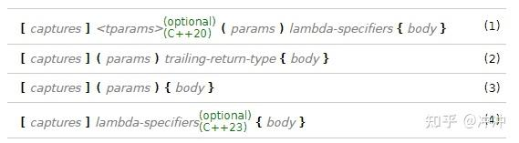

> @Author  : Lewis Tian (taseikyo@gmail.com)
>
> @Link    : github.com/taseikyo
>
> @Range   : 2025-01-26 - 2025-02-01

# Weekly #99

[readme](../README.md) | [previous](202501W4.md) | [next](202501W6.md)


\**Photo by [Sittinat Thurdnampetch](https://unsplash.com/@mosthurd) on [Unsplash](https://unsplash.com/photos/a-woman-holding-a-sparkler-in-her-hand-TpUvIVq6kcw)*

## Table of Contents

- [algorithm](#algorithm-)
- [review](#review-)
	- Linux 进程标识
- [tip](#tip-)
	- 在线PS工具
    - C++ Lambda 表达式
- [share](#share-)

## algorithm [🔝](#weekly-99)

## review [🔝](#weekly-99)

### 1. [Linux 进程标识](http://www.wowotech.net/process_management/process_identification.html)

一、概述

本文主要描述在 linux kernel 中如何标识一个或者一组和进程（线程）相关的实体，包括：

- 进程 ID（线程组 ID）
- 线程 ID
- 进程组 ID
- Session ID

需要强调的是本文 focus 在 identification，很多展开的内容会有一系列文档描述。

二、什么是进程 ID（线程组 ID）

一般而言，我们都会定义进程是一个正在执行的程序或者是一个程序的运行实例。程序是一个静态的概念，是存储在磁盘上的二进制可执行文件，包括程序代码和数据（正文段、数据段等）。当程序运行起来成为进程的时候，单纯的程序代码则不能清楚的描述进程，它还需要若干数据结构来描述程序的执行状态（硬件上下文和软件上下文）以及拥有的资源（如地址空间、打开的文件描述符等）。从内核的角度看，进程是一个和系统资源（CPU time、memory 等）分配相关的实体。

在 POSIX 标准中，系统定义了 getpid 函数来获取一个进程的 process ID。在 linux kernel 中，定义如下：

```C
asmlinkage long sys_getpid(void) {
	return current->tgid;
}
```

从字面上看 task_struct 中的 tgid 是 thread group ID，也就是线程组 ID，在 linux kernel 中，进程是有一个或者多个 thread 组成（POSIX 规定多个 thread 要共享一个进程 ID）。对于 linux kernel，每一个 thread 分配一个 task_struct（其中有一个 pid 的标识），这和大部分的 kernel 处理不一样，其他的 kernel 针对一个进程分配一个 task_struct，在该 task_struct 中嵌入了属于该进程的各个线程的数据。正因为如此，linux kernel 创建一个线程组的概念来映射到 POSIX 中的进程概念。

多线程的进程中第一个线程（主线程，group leader）的 pid 等于 tgid，之后，该线程组中的线程都有自己的 pid，但是共享 tgid，也就是传统意义上的进程 ID。task_struct 有一个 group_leader 成员，指向该 task 的 thread group leader，对于 group leader，该成员指向自己的 task_struct 数据结构。

三、什么是线程 ID

线程是进程中的一个实体，是被系统独立调度和分派的基本单位，线程自己不独立拥有系统资源，它是与同属一个进程的其它线程共享进程所拥有的全部资源（如地址空间、文件描述符和信号处理）。这首先表现在：所有线程都具有相同的地址空间（进程的地址空间），这意味着，线程可以访问该地址空间的每一个虚地址；此外，还可以访问进程所拥有的已打开文件、定时器、信号量等资源。进程是资源管理的最小单元，而线程是程序执行的最小单元。除了共享的进程资源，进程中的各个线程也属于自己的资源，具体包括：stack、PC counter 和 CPU 寄存器。

每个线程应该有自己的 ID，就是线程 ID，在 linux kernel 中，每一个 thread 分配一个 task_struct，该结构中的 pid 成员就是线程 ID。在 POSIX 标准中，定义了 pthread_self 来获取线程 ID，linux kernel 采用了 gettid 的系统调用来获取调用者的线程 ID。在 linux kernel 中，定义如下：

```C
asmlinkage long sys_gettid(void) {
	return current->pid;
}
```

POSIX 规定线程 ID 在所属进程中是唯一的，不过在 linux kernel 的实现中，thread ID 是全系统唯一的，当然，考虑到可移植性，Application software 不应该假设这一点。

四、什么是进程组 ID

每个进程属于一个进程组，每个进程组有一个 Leader 进程，也就是进程 ID 等于进程组 ID 的那个进程。进程组有生命周期，它的生命周期开始于进程组 leader 创建进程组，结束于进程组内的最后一个进程离开进程组（可能是进程退出, 或加入其他进程组）。进程组概念的提出主要是由于：

1、和 job control 相关，关于 job control，后续会专门的文档详细描述。

2、 Signal 可以发送给进程组的每一个进程（job control 也使用这个特性。例如 job control signal 会被送给 job（进程组）中的每一个进程）

3、进程同步的时候，父进程可以 wait for 进程组中的任何一个进程

在 POSIX 标准中，系统定义了 getpgid 函数来获取一个进程的 process group ID。在 linux kernel 中，定义如下：

```C
asmlinkage long sys_getpgid(pid_t pid) {
    if (!pid) {
        // 如果 pid 等于 0，那么需要获取当前进程的进程组 ID
        return process_group(current);
    } else {
        // 否则，获取 pid 标识的那个进程对应的进程组 ID
        int retval;
        struct task_struct * p;
        read_lock( & tasklist_lock);
        p = find_task_by_pid(pid);
        retval = -ESRCH;
        if (p) {
            // 是否有权利获取其他进程的进程组 ID
            retval = security_task_getpgid(p);
            if (!retval)
                retval = process_group(p);
        }
        read_unlock( & tasklist_lock);
        return retval;
    }
}

static inline pid_t process_group(struct task_struct * tsk) {
    return tsk->signal->pgrp;
}
```


task_struct 中的 signal 中的 pgrp 成员标识了进程组 ID。从 pgrp 的位置来看，进程组应该是和信号处理相关的，后续会专门的文档详细描述。

五、Session ID

和进程属于进程组类似，每个进程组都属于一个 session，每个 session 有一个 Leader 进程，也就是创建 session 的那个进程，session leader 的 ID 就等于该 session 的 ID。Session 概念的提出和用户登录以及终端编程相关，后续会专门的文档详细描述。

在 POSIX 标准中，系统定义了 getsid 函数来获取 session leader 进程的 process group ID。如果指定的 PID 不是 session leader，将返回错误，但是在 linux kernel 中没有完全遵守这个规定，getsid 函数总是能返回指定 PID 的 session ID，无论该 PID 指向的进程是否是 session leader，具体定义如下：

```C
asmlinkage long sys_getsid(pid_t pid) {
    if (!pid) {
        // 如果 pid 等于 0，那么需要获取当前进程的进程组 ID
        return process_session(current);
    } else {
        // 否则，获取 pid 标识的那个进程对应的进程组 ID
        int retval;
        struct task_struct * p;
        read_lock( & tasklist_lock);
        p = find_task_by_pid(pid);
        retval = -ESRCH;
        if (p) {
            retval = security_task_getsid(p);
            if (!retval)
                retval = process_session(p);
        }
        read_unlock( & tasklist_lock);

        return retval;
    }
}

static inline pid_t process_session(struct task_struct * tsk) {
    return signal_session(tsk->signal);
}

static inline pid_t signal_session(struct signal_struct * sig) {
    return sig->__session;
}
```

task_struct 中的 signal 中的 `__session` 成员标识了进程组 ID。

## tip [🔝](#weekly-99)

### 1. [在线PS工具](https://www.onlinephotosoft.com/)

该网页就是个在线 PS，好用！

### 2. [C++ Lambda 表达式](https://zhuanlan.zhihu.com/p/384314474)

c++ 在 c++11 标准中引入了 lambda 表达式，一般用于定义匿名函数，使得代码更加灵活简洁。lambda 表达式与普通函数类似，也有参数列表、返回值类型和函数体，只是它的定义方式更简洁，并且可以在函数内部定义。

最常见的 lambda 的表达式写法如下

```c++
auto plus = [] (int v1, int v2) -> int { return v1 + v2; }
int sum = plus(1, 2);
```

这里只是计算两个数的和，我们一般情况下肯定是不会这么用的，更多的时候，我们都是和 stl 的一些算法结合使用，例如自定义一个结构体的排序规则和打印。

```C++
struct Item {
    Item(int aa, int bb) : a(aa), b(bb) {} 
    int a;
    int b;
};
    
int main() {
    std::vector<Item> vec;
    vec.push_back(Item(1, 19));
    vec.push_back(Item(10, 3));
    vec.push_back(Item(3, 7));
    vec.push_back(Item(8, 12));
    vec.push_back(Item(2, 1));

    // 根据Item中成员a升序排序
    std::sort(vec.begin(), vec.end(),
        [] (const Item& v1, const Item& v2) { return v1.a < v2.a; });

    // 打印vec中的item成员
    std::for_each(vec.begin(), vec.end(),
        [] (const Item& item) { std::cout << item.a << " " << item.b << std::endl; });
    return 0;
}
```

在 c++ 的官方文档中，给出了 lamda 表达式的四种写法：



#### 四种表达式的含义

1. 完整的 lambda 表达式，包含了 lambda 表达式的所有成分。
1. 常量 lambda 表达式，捕获的变量都是常量，不能在 lambda 表达式的 body 中进行修改。
1. 和（2）基本一致，唯一的区别就是，lambda 表达式的函数返回值可以通过函数体推导出来。一般情况函数返回值类型明确或者没有返回值的情况下可以这样写。
1. lambda 表达式的函数没有任何参数，但是可以添加 lambda-specifiers，lambda-specifiers 是什么我们后续再介绍。

#### lambda 表达式各个成员的解释

- *captures* 捕获列表，lambda 可以把上下文变量以值或引用的方式捕获，在 body 中直接使用。
- *tparams* 模板参数列表(c++20 引入)，让 lambda 可以像模板函数一样被调用。
- *params* 参数列表，有一点需要注意，在 c++14 之后允许使用 auto 左右参数类型。
- *lambda-specifiers* lambda 说明符，一些可选的参数，这里不多介绍了，有兴趣的读者可以去官方文档上看。这里比较常用的参数就是 mutable 和 exception。其中，表达式 (1) 中没有 trailing-return-type，是因为包含在这一项里面的。
- *trailing-return-type* 返回值类型，一般可以省略掉，由编译器来推导。
- *body* 函数体，函数的具体逻辑。

#### 捕获列表

上面介绍完了 lambda 表达式的各个成分，其实很多部分和正常的函数没什么区别，其中最大的一个不同点就是捕获列表。我在刚开始用 lambda 表达式的时候，还一直以为这个没啥用，只是用一个 [] 来标志着这是一个 lambda 表达式。后来了解了才知道，原来这个捕获列表如此强大，甚至我觉得捕获列表就是 lambda 表达式的灵魂。下面先介绍几种常用的捕获方式。

- [] 什么也不捕获，无法 lambda 函数体使用任何
- [=] 按值的方式捕获所有变量
- [&] 按引用的方式捕获所有变量
- [=, &a] 除了变量 a 之外，按值的方式捕获所有局部变量，变量 a 使用引用的方式来捕获。这里可以按引用捕获多个，例如 [=, &a, &b,&c]。这里注意，如果前面加了 =，后面加的具体的参数必须以引用的方式来捕获，否则会报错。
- [&, a] 除了变量 a 之外，按引用的方式捕获所有局部变量，变量 a 使用值的方式来捕获。这里后面的参数也可以多个，例如 [&, a, b, c]。这里注意，如果前面加了 &，后面加的具体的参数必须以值的方式来捕获。
- [a, &b] 以值的方式捕获 a，引用的方式捕获 b，也可以捕获多个。
- [this] 在成员函数中，也可以直接捕获 this 指针，其实在成员函数中，[=]和 [&] 也会捕获 this 指针。


```C++
#include <iostream>

int main() {
    int a = 3;
    int b = 5;
    
    // 按值来捕获
    auto func1 = [a] { std::cout << a << std::endl; };
    func1();

    // 按值来捕获
    auto func2 = [=] { std::cout << a << " " << b << std::endl; };
    func2();

    // 按引用来捕获
    auto func3 = [&a] { std::cout << a << std::endl; };
    func3();

    // 按引用来捕获
    auto func4 = [&] { std::cout << a << " " << b << std::endl; };
    func4();
}
```

#### 编译器如何看待 Lambda 表达式

其实，编译器会把我们写的 lambda 表达式翻译成一个类，并重载 `operator()` 来实现。比如我们写一个 lambda 表达式为


```C++
auto plus = [] (int a, int b) -> int { return a + b; }
int c = plus(1, 2);
```

那么编译器会把我们写的表达式翻译为

```C++
// 类名是我随便起的
class LambdaClass {
public:
    int operator () (int a, int b) const {
        return a + b;
    }
};

LambdaClass plus;
int c = plus(1, 2);
```

调用的时候编译器会生成一个 Lambda 的对象，并调用 opeartor () 函数。（**备注：这里的编译的翻译结果并不和真正的结果完全一致，只是把最主要的部分体现出来，其他的像类到函数指针的转换函数均省略**）

上面是一种调用方式，那么如果我们写一个复杂一点的 lambda 表达式，表达式中的成分会如何与类的成分对应呢？我们再看一个 值捕获 例子。

```C++
int x = 1; int y = 2;
auto plus = [=] (int a, int b) -> int { return x + y + a + b; };
int c = plus(1, 2);
```

编译器的翻译结果为

```C++
class LambdaClass {
public:
    LambdaClass(int xx, int yy)
    : x(xx), y(yy) {}

    int operator () (int a, int b) const     {
        return x + y + a + b;
    }

private:
    int x;
    int y;
}

int x = 1; int y = 2;
LambdaClass plus(x, y);
int c = plus(1, 2);
```

其实这里就可以看出，值捕获时，编译器会把捕获到的值作为类的成员变量，并且变量是以值的方式传递的。需要注意的时，如果所有的参数都是值捕获的方式，那么生成的 operator() 函数是 const 函数的，是无法修改捕获的值的，哪怕这个修改不会改变 lambda 表达式外部的变量，如果想要在函数内修改捕获的值，需要加上关键字 mutable。向下面这样的形式。

```C++
int x = 1; int y = 2;
auto plus = [=] (int a, int b) mutable -> int { x++; return x + y + a + b; };
int c = plus(1, 2);
```

我们再来看一个引用捕获的例子。

```C++
int x = 1; int y = 2;
auto plus = [&] (int a, int b) -> int { x++; return x + y + a + b;};
int c = plus(1, 2);
```

编译器的翻译结果为

```C++
class LambdaClass {
public:
    LambdaClass(int& xx, int& yy)
    : x(xx), y(yy) {}

    int operator () (int a, int b) {
        x++;
        return x + y + a + b;
    }

private:
    int &x;
    int &y;
};

```

我们可以看到以引用的方式捕获变量，和值捕获的方式有 3 个不同的地方：1. 参数引用的方式进行传递; 2. 引用捕获在函数体修改变量，会直接修改 lambda 表达式外部的变量；3. opeartor() 函数不是 const 的。

针对上面的集中情况，我们把 lambda 的各个成分和类的各个成分对应起来就是如下的关系:

- 捕获列表，对应 LambdaClass 类的 private 成员。
- 参数列表，对应 LambdaClass 类的成员函数的 operator() 的形参列表
- mutable，对应 LambdaClass 类成员函数 operator() 的 const 属性 ，但是只有在捕获列表捕获的参数不含有引用捕获的情况下才会生效，因为捕获列表只要包含引用捕获，那 operator() 函数就一定是非 const 函数。
- 返回类型，对应 LambdaClass 类成员函数 operator() 的返回类型
- 函数体，对应 LambdaClass 类成员函数 operator() 的函数体。
- 引用捕获和值捕获不同的一点就是，对应的成员是否为引用类型。

## share [🔝](#weekly-99)

[readme](../README.md) | [previous](202501W4.md) | [next](202501W6.md)
