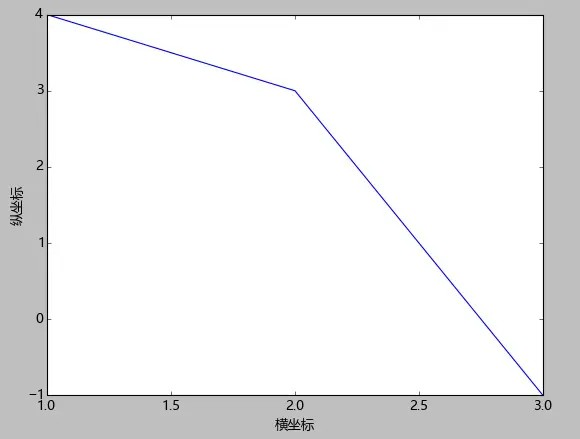

> @Author  : Lewis Tian (taseikyo@gmail.com)
>
> @Link    : github.com/taseikyo
>
> @Range   : 2025-02-02 - 2025-02-08

# Weekly #100

[readme](../README.md) | [previous](202501W5.md) | [next](202502W2.md)


\**Photo by [Dynamic Wang](https://unsplash.com/@dynamicwang) on [Unsplash](https://unsplash.com/photos/a-woman-taking-a-picture-of-herself-with-a-camera-efC8-MnHfXU)*

## Table of Contents

- [algorithm](#algorithm-)
- [review](#review-)
- [tip](#tip-)
	- python matplotlib 中文显示参数设置
- [share](#share-)

## algorithm [🔝](#weekly-100)

## review [🔝](#weekly-100)

## tip [🔝](#weekly-100)

### 1. [python matplotlib 中文显示参数设置](https://segmentfault.com/a/1190000005144275)

最近在学习 python 著名的绘图包 matplotlib 时发现，有时候图例等设置无法正常显示中文，于是就想把这个问题解决了。

PS：本文仅针对 Windows，其他平台仅供参考。


#### 原因

大致就是 matplotlib 库中没有中文字体。
我安装的 anaconda，这是对应的 matplotlib 的字体所在文件夹（怎么找到 matplotlib 配置文件夹所在，下面解决方案会叙述，easy man~）。

```
C:\Anaconda64\Lib\site-packages\matplotlib\mpl-data\fonts\ttf
```

#### 解决方案

现在整理一下我认为比较好的解决方案：

- 每次编写代码时进行参数设置

```python
#coding:utf-8
import matplotlib.pyplot as plt
plt.rcParams['font.sans-serif']=['SimHei'] #用来正常显示中文标签
plt.rcParams['axes.unicode_minus']=False #用来正常显示负号
#有中文出现的情况，需要u'内容'
```

- 一劳永逸（推荐）

```python
import matplotlib
matplotlib.matplotlib_fname() #将会获得matplotlib包所在文件夹
```

然后进入`C:\Anaconda64\Lib\site-packages\matplotlib\mpl-data`该文件夹下就能看到 **matplotlibrc** 配置文件。

1）打开该配置文件，找到下面这行：

```
#font.serif          : Bitstream Vera Serif, New Century Schoolbook, Century Schoolbook L, Utopia, ITC Bookman, Bookman, Nimbus Roman No9 L, Times New Roman, Times, Palatino, Charter, serif
```

然后，将前面的注释去掉！  
2）找中文字体放到 matplotlib 字体库中。  
在 Windows 文件夹下：`C:\Windows\Fonts\Microsoft YaHei UI`复制该字体，然后粘贴到`C:\Anaconda64\Lib\site-packages\matplotlib\mpl-data\fonts\ttf`文件夹，并给它重命名为`Vera.ttf`。

注明：这一步的作用其实就是将 matplotlib 中一个默认的字体替换为我们复制过来的中文字体，将这个中文字体命名改为 matplotlib 中有的字体名。

其实，还有其他方案，但是貌似在我这儿没成功。

#### 补充

坐标轴的负号正常显示：

```
#去掉了注释符号，同时，改为False
axes.unicode_minus  : False
```

#### 举例

```python
#coding:utf-8
import matplotlib.pyplot as plt
plt.plot((1,2,3),(4,3,-1))
plt.xlabel(u'横坐标')
plt.ylabel(u'纵坐标')
plt.show()
```



#### 最后

- [Michael 翔](https://link.segmentfault.com/?enc=0aJKqqAFi3nya1eHYvujLQ%3D%3D.1VAoVv%2F404hnKtC1E8NHiBpgv1P2BPucSwOWpn9JezI%3D)
- [matplotlib 中文乱码解决](https://link.segmentfault.com/?enc=GSdyPGLM50Av0QZh54XbUg%3D%3D.6SDt9xO8liE47gqNOgGYGJ7fctD1QhWVyqawkmhF%2BaHi%2BUWe0YwKrqacktpWrzLEEjsUtegKy5giKyvK7%2BzVJA%3D%3D)
- [官网 - Customizing matplotlib](https://link.segmentfault.com/?enc=TFQ%2FNVy3W%2BWKb1Eo5fvJZA%3D%3D.MrHlM8jBXGc556mTQ%2FQHs95k8MgS5s31f9gepdNk9VJ814uPtXpO7AGGqZIhEEv2)
- [matplotlib 中，修改配置文件，让它默认使用的字体就是中文字体](https://link.segmentfault.com/?enc=J5v1qIAve9soRAfOe7Kdsw%3D%3D.VcBoCjRkMnpa57u%2FVCt4hr0hHcdWqCCVBoEpyuvUBqkYmUUuMF8wbp58ouWdvAtG)
- [解决 matplotlib 中文乱码问题（Windows）](https://link.segmentfault.com/?enc=pYEeXcmKANXZ2qhwNVrqZw%3D%3D.nnHSqw8FqYkMF9aJIPoPahU4HXrAFlbBQgpWAd627AtUnZpfN2PZR8nsDEVkDJJa)
- [python 画图包 seaborn 和 matplotlib 中文字体显示](https://link.segmentfault.com/?enc=LFqX8ZysecJxs0RbHnOc7Q%3D%3D.vZQpFZyt1Bi2aEo7bmt0prMuY%2Bij5ZNQVEdJKQnW9kHHiH%2BkRFXkdgcLyfDdHsyxgrSUO%2FzLmykWyQ7aqbHv4aIo9odkuGVm2YfL3vhE3r4%3D)
- [如何在 matplotlib 里显示中文](https://link.segmentfault.com/?enc=IfYcKP89ajjnTNZQy%2Bl71w%3D%3D.caIwyrRfA8VZcXGSzlp5%2BfHxbXJmZZ7JhnOSGMyZx%2F8UDse635c1T%2Fd8dlG2jt3ncgAXHq4qJp0mEpvYIJeBTG5sN8LKOwLUw8eeOhwDU44NeZlwuhtrWKj9jOHtRF4u)

## share [🔝](#weekly-100)

[readme](../README.md) | [previous](202501W5.md) | [next](202502W2.md)
