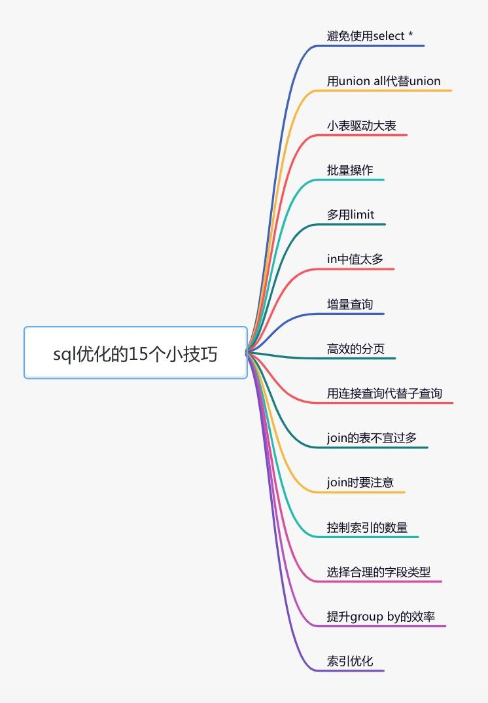
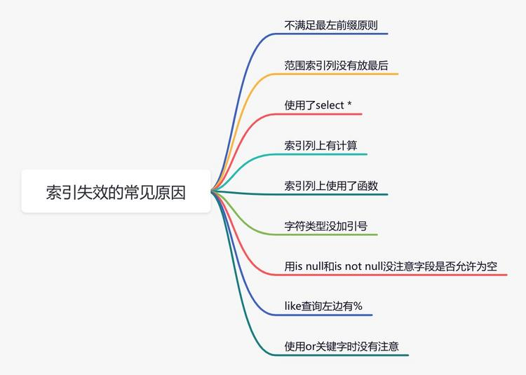

> @Author  : Lewis Tian (taseikyo@gmail.com)
>
> @Link    : github.com/taseikyo
>
> @Range   : 2025-02-02 - 2025-02-08

# Weekly #100

[readme](../README.md) | [previous](202501W5.md) | [next](202502W2.md)


\**Photo by [Dynamic Wang](https://unsplash.com/@dynamicwang) on [Unsplash](https://unsplash.com/photos/a-woman-taking-a-picture-of-herself-with-a-camera-efC8-MnHfXU)*

## Table of Contents

- [algorithm](#algorithm-)
- [review](#review-)
- [tip](#tip-)
	- python matplotlib 中文显示参数设置
	- 一文掌握提升 Python 代码质量的最佳伴侣工具：black、isort、flake8 和 mypy
	- SQL 优化的这 15 招，真香！ 
- [share](#share-)
	- 一分钟管理法

## algorithm [🔝](#weekly-100)

## review [🔝](#weekly-100)

## tip [🔝](#weekly-100)

### 1. [python matplotlib 中文显示参数设置](https://segmentfault.com/a/1190000005144275)

最近在学习 python 著名的绘图包 matplotlib 时发现，有时候图例等设置无法正常显示中文，于是就想把这个问题解决了。

PS：本文仅针对 Windows，其他平台仅供参考。


#### 原因

大致就是 matplotlib 库中没有中文字体。
我安装的 anaconda，这是对应的 matplotlib 的字体所在文件夹（怎么找到 matplotlib 配置文件夹所在，下面解决方案会叙述，easy man~）。

```
C:\Anaconda64\Lib\site-packages\matplotlib\mpl-data\fonts\ttf
```

#### 解决方案

现在整理一下我认为比较好的解决方案：

- 每次编写代码时进行参数设置

```python
#coding:utf-8
import matplotlib.pyplot as plt
plt.rcParams['font.sans-serif']=['SimHei'] #用来正常显示中文标签
plt.rcParams['axes.unicode_minus']=False #用来正常显示负号
#有中文出现的情况，需要u'内容'
```

- 一劳永逸（推荐）

```python
import matplotlib
matplotlib.matplotlib_fname() #将会获得matplotlib包所在文件夹
```

然后进入`C:\Anaconda64\Lib\site-packages\matplotlib\mpl-data`该文件夹下就能看到 **matplotlibrc** 配置文件。

1）打开该配置文件，找到下面这行：

```
#font.serif          : Bitstream Vera Serif, New Century Schoolbook, Century Schoolbook L, Utopia, ITC Bookman, Bookman, Nimbus Roman No9 L, Times New Roman, Times, Palatino, Charter, serif
```

然后，将前面的注释去掉！  
2）找中文字体放到 matplotlib 字体库中。  
在 Windows 文件夹下：`C:\Windows\Fonts\Microsoft YaHei UI`复制该字体，然后粘贴到`C:\Anaconda64\Lib\site-packages\matplotlib\mpl-data\fonts\ttf`文件夹，并给它重命名为`Vera.ttf`。

注明：这一步的作用其实就是将 matplotlib 中一个默认的字体替换为我们复制过来的中文字体，将这个中文字体命名改为 matplotlib 中有的字体名。

其实，还有其他方案，但是貌似在我这儿没成功。

#### 补充

坐标轴的负号正常显示：

```
#去掉了注释符号，同时，改为False
axes.unicode_minus  : False
```

#### 举例

```python
#coding:utf-8
import matplotlib.pyplot as plt
plt.plot((1,2,3),(4,3,-1))
plt.xlabel(u'横坐标')
plt.ylabel(u'纵坐标')
plt.show()
```


#### 最后

- [Michael 翔](https://link.segmentfault.com/?enc=0aJKqqAFi3nya1eHYvujLQ%3D%3D.1VAoVv%2F404hnKtC1E8NHiBpgv1P2BPucSwOWpn9JezI%3D)
- [matplotlib 中文乱码解决](https://link.segmentfault.com/?enc=GSdyPGLM50Av0QZh54XbUg%3D%3D.6SDt9xO8liE47gqNOgGYGJ7fctD1QhWVyqawkmhF%2BaHi%2BUWe0YwKrqacktpWrzLEEjsUtegKy5giKyvK7%2BzVJA%3D%3D)
- [官网 - Customizing matplotlib](https://link.segmentfault.com/?enc=TFQ%2FNVy3W%2BWKb1Eo5fvJZA%3D%3D.MrHlM8jBXGc556mTQ%2FQHs95k8MgS5s31f9gepdNk9VJ814uPtXpO7AGGqZIhEEv2)
- [matplotlib 中，修改配置文件，让它默认使用的字体就是中文字体](https://link.segmentfault.com/?enc=J5v1qIAve9soRAfOe7Kdsw%3D%3D.VcBoCjRkMnpa57u%2FVCt4hr0hHcdWqCCVBoEpyuvUBqkYmUUuMF8wbp58ouWdvAtG)
- [解决 matplotlib 中文乱码问题（Windows）](https://link.segmentfault.com/?enc=pYEeXcmKANXZ2qhwNVrqZw%3D%3D.nnHSqw8FqYkMF9aJIPoPahU4HXrAFlbBQgpWAd627AtUnZpfN2PZR8nsDEVkDJJa)
- [python 画图包 seaborn 和 matplotlib 中文字体显示](https://link.segmentfault.com/?enc=LFqX8ZysecJxs0RbHnOc7Q%3D%3D.vZQpFZyt1Bi2aEo7bmt0prMuY%2Bij5ZNQVEdJKQnW9kHHiH%2BkRFXkdgcLyfDdHsyxgrSUO%2FzLmykWyQ7aqbHv4aIo9odkuGVm2YfL3vhE3r4%3D)
- [如何在 matplotlib 里显示中文](https://link.segmentfault.com/?enc=IfYcKP89ajjnTNZQy%2Bl71w%3D%3D.caIwyrRfA8VZcXGSzlp5%2BfHxbXJmZZ7JhnOSGMyZx%2F8UDse635c1T%2Fd8dlG2jt3ncgAXHq4qJp0mEpvYIJeBTG5sN8LKOwLUw8eeOhwDU44NeZlwuhtrWKj9jOHtRF4u)

### 2. [一文掌握提升 Python 代码质量的最佳伴侣工具：black、isort、flake8 和 mypy](https://blog.csdn.net/fyfugoyfa/article/details/139896437)

在 Python 项目开发中，为了保持代码质量和提高开发效率，我们常需借助一些工具。今天，我将为大家介绍四个 Python 代码工程的得力助手：black、isort、flake8 和 mypy。

**本文的思维导图如下所示：**


使用这四个工具的有机结合，能够编写出**更为规范、整洁的 Python 代码**。然而，代码的具体质量仍然取决于开发者自身，工具只是辅助手段。请牢记这一点。

#### 一、black

1、什么是 Black？

Black 是一个开源的 Python 代码格式化工具，旨在提供一致的代码风格并提高代码的可读性和可维护性。它会自动将代码格式化为符合 PEP 8 规范的标准风格，因此被称为 “**零妥协代码格式化工具**”。

**Black 24.4.2 官方文档**：[https://black.readthedocs.io/en/stable/getting_started.html](https://black.readthedocs.io/en/stable/getting_started.html)

2、为什么使用 Black？

使用 Black 的主要原因如下：

- **一致性**：通过自动格式化代码，Black 确保了整个项目中的代码风格一致，减少了代码审查过程中的争议和耗时。
- **简化代码审查**：由于 Black 自动处理代码格式问题，开发者可以**将更多精力放在代码逻辑和功能上，而非格式细节**。
- **提高可读性**：Black 强制执行标准化的格式，使代码更容易阅读和理解，尤其是在团队合作中。
- **节省时间**：自动格式化代码可以显著减少开发者手动调整代码格式的时间，提高开发效率。

3、具体怎么做？

3.1、安装 Black

在命令行中使用 pip 安装 Black：

```bash
pip install black
```

如果需要在 Jupyter Notebook 中使用，则运行：

```bash
pip install black[jupyter]
```

需要注意的是，Black 需要 Python 3.8 以上的版本。

3.2、使用 Black

Black 使用非常简单，以下是一些基本用法：

- **格式化文件**：在命令行中运行以下命令即可格式化文件：

```bash
black your_file.py
```
    
- **格式化目录**：格式化目录中的所有 Python 文件：

```bash
black your_directory/
```
    
- **跳过字符串格式化**：如果项目要求保留单引号，可以使用 `-S` 选项：
    
```bash
black -S your_file.py
```

3.3、高级用法和配置

Black 还支持一些高级配置选项，可以通过命令行参数实现：

- **指定行宽**：使用 `--line-length` 选项来设置自定义代码最大行宽：
    
```bash
black --line-length 100 your_file.py
```

- **排除特定文件或目录**：使用 `--exclude` 选项排除特定的文件或目录：
    
```bash
black --exclude "tests/" your_directory/
```

- **仅检查不修改**：使用 `--check` 选项只检查格式而不修改文件：
    
```bash
black --check your_file.py
```

3.4、集成到 IDE 中

Black 可以集成到多种编辑器和 IDE 中，如 VS Code、PyCharm、Sublime Text 等。以 VS Code 为例，可以在扩展市场中搜索并安装 `Black Formatter` 扩展。

4、总结

Black 是一个强大的 Python 代码格式化工具，通过其自动化和一致性的特点，帮助开发者减少代码格式问题，提高代码审查效率和项目可维护性。无论是个人项目还是团队合作，Black 都能显著提升开发体验和代码质量。

#### 二、isort

1、是什么？

isort 是一个 Python 实用工具库，用于自动排序和格式化 Python 文件中的导入语句。它能够将导入语句按照字母顺序排列，并自动分组成不同的部分，例如标准库、第三方库和项目内部模块（自己封装、实现的模块）。

isort 官方文档：[https://pycqa.github.io/isort/](https://pycqa.github.io/isort/)

2、为什么？

导入语句规范化有助于提高代码的可读性和维护性，尤其在团队协作和大型项目中显得尤为重要。手动管理导入语句的顺序不仅耗时，而且容易出错。isort 自动化这一过程，确保所有导入语句都符合特定的格式和排序规则，从而减少代码审查过程中对导入顺序的讨论。

3、具体怎么做？

3.1、安装 isort

可以通过 `pip` 来安装 isort：

```bash
pip install isort
```

3.2、基本使用

- 对单个文件排序：
    
```bash
isort your_script.py
```

- 对整个项目中的所有 Python 文件排序：
    
```bash
isort .
```
    

3.3、进行配置

可以通过配置文件（如 `pyproject.toml`、`.isort.cfg`、`setup.cfg` 等）自定义 isort 的行为。例如，在 `pyproject.toml` 中：

```
[tool.isort]
profile = "black"
line_length = 88
```

上述配置指示 isort 使用与 `black` 代码格式化器兼容的配置，并将最大代码行长度设置为 88。

3.4、 集成到编辑器或持续集成流程

- **编辑器插件**：isort 提供了多种编辑器插件支持，包括 VSCode、PyCharm 等，方便在保存文件时自动排序导入语句。
- **预提交钩子（pre-commit hook）**：isort 官方支持 pre-commit，确保在代码提交前自动检查和修复导入语句的顺序。

3.5、检查导入顺序是否正确

使用 `-c` 或 `--check-only` 选项可以仅检查导入顺序是否正确，而不实际修改文件：

```bash
isort -c your_script.py
```

如果导入顺序不正确，会输出相应的错误信息。通过使用 isort，可以显著提高代码的一致性和可读性，特别是在大型项目和团队协作中，自动化工具的使用能够大幅减少手动操作的错误和时间消耗。

综上所述，isort 是一个强大且高效的工具库，可以帮助 Python 开发人员自动化和标准化导入语句的管理，为代码审查和维护提供了极大的便利。

#### 三、flake8

1、flake8 是什么？

**flake8** 是一个用于 Python 编程语言的静态代码分析工具，它结合了多个工具来检查代码质量和风格一致性。具体来说，flake8 集成了以下三种工具：

- **PyFlakes**：用于检查代码中的错误。
- **pycodestyle**：用于检查代码是否符合 PEP 8 编码规范。
- **Ned Batchelder 的 McCabe script**：用于检查代码的复杂度。

**flake8 官方文档**：[https://flake8.pycqa.org/en/latest/](https://flake8.pycqa.org/en/latest/)

2、为什么使用 flake8？

使用 flake8 有以下几个主要原因：

1.  **代码质量保障**：自动检测代码中的错误，帮助开发者在早期发现潜在问题。
2.  **风格一致性**：确保代码符合 PEP 8 标准，提升代码的可读性和一致性。
3.  **复杂度控制**：分析代码的复杂度，提醒开发者避免过于复杂的代码结构。
4.  **可扩展性强**：支持第三方插件，可以根据需要自定义检查规则。

3、具体怎么做？

3.1、安装 flake8

1.  打开终端（或命令行界面）。
    
2.  运行以下命令通过 `pip` 安装 flake8：
    
```bash
python -m pip install flake8

```

这条命令会自动安装 flake8 及其所有必要的依赖项。

3.2、使用 flake8

- **基本用法**：

- 检查特定文件：

```bash
flake8 path/to/code/to/check.py
```

- 检查整个目录：

```bash
flake8 path/to/code/
```

这将会递归检查目录下的所有文件。

- **选择特定的错误或警告**：

- 仅查看特定警告或错误：

```bash
flake8 --select E123,W503 path/to/code/
```

- 忽略特定的警告或错误：

```bash
flake8 --ignore E24,W504 path/to/code/
```

可以指定多个错误及警告，用逗号分隔。
- **配置 flake8**：

- 可以通过配置文件来设置全局和项目级的 flake8 选项，例如在项目根目录下创建一个 `.flake8` 文件，并配置其中的选项：

```
[flake8]
max-line-length = 88
exclude = venv, tests
```

这样可以避免在每次运行 flake8 时都重复输入相同的命令行参数。

通过以上步骤，您可以有效地使用 flake8 来帮助提升代码质量、保持风格一致性并控制复杂度。建议参考[官方文档](https://flake8.pycqa.org/en/latest/)获取更多详细的用法和配置示例。

#### 四、mypy

1、是什么？

mypy 是 Python 的一个静态类型检查工具。它通过**在代码中添加类型注解**，帮助开发者在编写代码时发现潜在的类型错误，从而提高代码质量和可读性。mypy 允许在 Python 这种动态类型语言中使用静态类型检查的优点。

mypy 官方文档：[https://mypy.readthedocs.io/en/stable/](https://mypy.readthedocs.io/en/stable/)

2、为什么？

使用 mypy 的主要原因有以下几点：

- **提高代码质量与可读性**：通过在代码中加入类型注解，可以使代码更加易读，明确变量和函数的预期类型，从而减少理解和维护代码所需的时间。
- **捕获潜在错误**：mypy 可以在代码运行前发现类型错误，避免运行时才发现的问题，从而减少调试时间。
- **文档化作用**：类型注解可以作为代码的一部分，有助于自动生成文档和辅助开发者理解代码。

3、具体怎么做？

3.1、安装 mypy

首先，你需要安装 mypy，可以使用以下 pip 命令：

```bash
pip install mypy
```

3.2、添加类型注释

在代码中添加类型注释，可以使用 Python 提供的 `typing` 模块。例如：

```bash
from typing import List, Tuple

def add_numbers(x: int, y: int) -> int:
    return x + y

def process_data(data: List[Tuple[str, int]]) -> None:
    for name, age in data:
        print(f"Name: {name}, Age: {age}")

data_list = [("Alice", 25), ("Bob", 30), ("Charlie", 22)]
process_data(data_list)

```

3.3、运行 mypy

**在添加了类型注释之后，可以使用 mypy 来进行类型检查**。运行以下命令：

```bash
mypy your_code.py
```

如果代码中有类型错误，mypy 会显示错误信息。例如：

```bash
def add(x: int, y: int) -> int:
    return x + y

result = add(10, "20")  # 错误：第二个参数应该是 int 类型
```

运行 mypy 后，会提示类似这样的错误信息：

```
error: Argument 2 to "add" has incompatible type "str"; expected "int"
```

3.4、配置 mypy

你还可以通过配置文件来定制 mypy 的行为。创建一个 mypy 配置文件（例如 `mypy.ini`），内容如下：

```
[mypy]
python_version = 3.8
warn_return_any = True
warn_unused_ignores = True
```

使用配置文件运行 mypy：

```
mypy --config-file mypy.ini your_code.py
```

通过这些步骤，开发者可以逐步将 mypy 集成到现有的项目中，逐步为代码添加类型注释，提升代码的质量和可维护性。

4、总结

mypy 是一个强大的工具，通过在 Python 代码中引入类型注解，帮助开发者在编写代码时发现潜在的类型错误，提升代码的质量和可读性。通过简单的安装、类型注释以及运行 mypy 进行检查，可以显著提高开发效率并减少错误发生。

- [Python 字符串应该用双引号还是单引号？](https://mp.weixin.qq.com/s/l2zMScNxyXEFOI-tWilVlw)
- [在 VSCode 中编写 Python 代码，代码规范工具介绍与推荐](https://mp.weixin.qq.com/s/5HDJXEFn3adwS1-y7zLjAg)
- [Python 中 20 个提高代码质量的测试工具](https://mp.weixin.qq.com/s/yOcVF7luSsLV5gfsKyek1w)
- [Python 工程的最佳伴侣：isort、flake8、black 和 mypy](https://mp.weixin.qq.com/s/oYPT9xWpg2DIuGamTopcgg)
- [PEP 8 – Style Guide for Python Code](https://peps.python.org/pep-0008/)
- [Google Python 风格指南 - 内容目录](https://zh-google-styleguide.readthedocs.io/en/latest/google-python-styleguide/contents.html)

### 3. [SQL 优化的这 15 招，真香！ ](https://www.cnblogs.com/12lisu/p/18654428)


#### 前言

sql 优化是一个大家都比较关注的热门话题，无论你在面试，还是工作中，都很有可能会遇到。

如果某天你负责的某个线上接口，出现了性能问题，需要做优化。那么你首先想到的很有可能是优化 sql 语句，因为它的改造成本相对于代码来说也要小得多。

那么，如何优化 sql 语句呢？

这篇文章从 15 个方面，分享了 sql 优化的一些小技巧，希望对你有所帮助。



#### 1 避免使用 select *

很多时候，我们写 sql 语句时，为了方便，喜欢直接使用`select *`，一次性查出表中所有列的数据。

**反例：**

```SQL
select * from user where id=1;
```

在实际业务场景中，可能我们真正需要使用的只有其中一两列。查了很多数据，但是不用，白白浪费了数据库资源，比如：内存或者 cpu。

此外，多查出来的数据，通过网络 IO 传输的过程中，也会增加数据传输的时间。

还有一个最重要的问题是：`select *`不会走`覆盖索引`，会出现大量的`回表`操作，而从导致查询 sql 的性能很低。

那么，如何优化呢？

**正例：**

```SQL
select name,age from user where id=1;
```

sql 语句查询时，只查需要用到的列，多余的列根本无需查出来。

#### 2 用 union all 代替 union

我们都知道 sql 语句使用`union`关键字后，可以获取排重后的数据。

而如果使用`union all`关键字，可以获取所有数据，包含重复的数据。

**反例：**

```SQL
(select * from user where id=1) 
union 
(select * from user where id=2);
```

排重的过程需要遍历、排序和比较，它更耗时，更消耗 cpu 资源。

所以如果能用 union all 的时候，尽量不用 union。

**正例：**

```SQL
(select * from user where id=1) 
union all
(select * from user where id=2);
```

除非是有些特殊的场景，比如 union all 之后，结果集中出现了重复数据，而业务场景中是不允许产生重复数据的，这时可以使用 union。

#### 3 小表驱动大表

小表驱动大表，也就是说用小表的数据集驱动大表的数据集。

假如有 order 和 user 两张表，其中 order 表有 10000 条数据，而 user 表有 100 条数据。

这时如果想查一下，所有有效的用户下过的订单列表。

可以使用`in`关键字实现：

```SQL
select * from order
where user_id in (select id from user where status=1)
```

也可以使用`exists`关键字实现：

```SQL
select * from order
where exists (select 1 from user where order.user_id = user.id and status=1)
```

前面提到的这种业务场景，使用 in 关键字去实现业务需求，更加合适。

为什么呢？

因为如果 sql 语句中包含了 in 关键字，则它会优先执行 in 里面的`子查询语句`，然后再执行 in 外面的语句。如果 in 里面的数据量很少，作为条件查询速度更快。

而如果 sql 语句中包含了 exists 关键字，它优先执行 exists 左边的语句（即主查询语句）。然后把它作为条件，去跟右边的语句匹配。如果匹配上，则可以查询出数据。如果匹配不上，数据就被过滤掉了。

这个需求中，order 表有 10000 条数据，而 user 表有 100 条数据。order 表是大表，user 表是小表。如果 order 表在左边，则用 in 关键字性能更好。

总结一下：

- `in` 适用于左边大表，右边小表。
- `exists` 适用于左边小表，右边大表。

不管是用 in，还是 exists 关键字，其核心思想都是用小表驱动大表。

#### 4 批量操作

如果你有一批数据经过业务处理之后，需要插入数据，该怎么办？

**反例：**

```
for(Order order: list){
   orderMapper.insert(order):
}
```

在循环中逐条插入数据。

```SQL
insert into order(id,code,user_id) 
values(123,'001',100);
```

该操作需要多次请求数据库，才能完成这批数据的插入。

但众所周知，我们在代码中，每次远程请求数据库，是会消耗一定性能的。而如果我们的代码需要请求多次数据库，才能完成本次业务功能，势必会消耗更多的性能。

那么如何优化呢？

**正例：**

```
orderMapper.insertBatch(list):
```

提供一个批量插入数据的方法。

```SQL
insert into order(id,code,user_id) 
values(123,'001',100),(124,'002',100),(125,'003',101);
```

这样只需要远程请求一次数据库，sql 性能会得到提升，数据量越多，提升越大。

但需要注意的是，不建议一次批量操作太多的数据，如果数据太多数据库响应也会很慢。批量操作需要把握一个度，建议每批数据尽量控制在 500 以内。如果数据多于 500，则分多批次处理。

#### 5 多用 limit

有时候，我们需要查询某些数据中的第一条，比如：查询某个用户下的第一个订单，想看看他第一次的首单时间。

**反例：**

```SQL
select id, create_date 
 from order 
where user_id=123 
order by create_date asc;
```

根据用户 id 查询订单，按下单时间排序，先查出该用户所有的订单数据，得到一个订单集合。 然后在代码中，获取第一个元素的数据，即首单的数据，就能获取首单时间。

```
List<Order> list = orderMapper.getOrderList();
Order order = list.get(0);
```

虽说这种做法在功能上没有问题，但它的效率非常不高，需要先查询出所有的数据，有点浪费资源。

那么，如何优化呢？

**正例：**

```SQL
select id, create_date 
 from order 
where user_id=123 
order by create_date asc 
limit 1;
```

使用`limit 1`，只返回该用户下单时间最小的那一条数据即可。

> 此外，在删除或者修改数据时，为了防止误操作，导致删除或修改了不相干的数据，也可以在 sql 语句最后加上 limit。

例如：

```SQL
update order set status=0,edit_time=now(3) 
where id>=100 and id<200 limit 100;
```

这样即使误操作，比如把 id 搞错了，也不会对太多的数据造成影响。

#### 6 in 中值太多

对于批量查询接口，我们通常会使用`in`关键字过滤出数据。比如：想通过指定的一些 id，批量查询出用户信息。

sql 语句如下：

```SQL
select id,name from category
where id in (1,2,3...100000000);
```

如果我们不做任何限制，该查询语句一次性可能会查询出非常多的数据，很容易导致接口超时。

这时该怎么办呢？

```SQL
select id,name from category
where id in (1,2,3...100)
limit 500;
```

可以在 sql 中对数据用 limit 做限制。

不过我们更多的是要在业务代码中加限制，伪代码如下：

```
public List<Category> getCategory(List<Long> ids) {
   if(CollectionUtils.isEmpty(ids)) {
      return null;
   }
   if(ids.size() > 500) {
      throw new BusinessException("一次最多允许查询500条记录")
   }
   return mapper.getCategoryList(ids);
}
```

还有一个方案就是：如果 ids 超过 500 条记录，可以分批用多线程去查询数据。每批只查 500 条记录，最后把查询到的数据汇总到一起返回。

不过这只是一个临时方案，不适合于 ids 实在太多的场景。因为 ids 太多，即使能快速查出数据，但如果返回的数据量太大了，网络传输也是非常消耗性能的，接口性能始终好不到哪里去。

#### 7 增量查询

有时候，我们需要通过远程接口查询数据，然后同步到另外一个数据库。

**反例：**

```SQL
select * from user;
```

如果直接获取所有的数据，然后同步过去。这样虽说非常方便，但是带来了一个非常大的问题，就是如果数据很多的话，查询性能会非常差。

这时该怎么办呢？

**正例：**

```SQL
select * from user 
where id>#{lastId} and create_time >= #{lastCreateTime} 
limit 100;
```

按 id 和时间升序，每次只同步一批数据，这一批数据只有 100 条记录。每次同步完成之后，保存这 100 条数据中最大的 id 和时间，给同步下一批数据的时候用。

通过这种增量查询的方式，能够提升单次查询的效率。

#### 8 高效的分页

有时候，列表页在查询数据时，为了避免一次性返回过多的数据影响接口性能，我们一般会对查询接口做分页处理。

在 mysql 中分页一般用的`limit`关键字：

```SQL
select id,name,age 
from user limit 10,20;
```

如果表中数据量少，用 limit 关键字做分页，没啥问题。但如果表中数据量很多，用它就会出现性能问题。

比如现在分页参数变成了：

```SQL
select id,name,age 
from user limit 1000000,20;
```

mysql 会查到 1000020 条数据，然后丢弃前面的 1000000 条，只查后面的 20 条数据，这个是非常浪费资源的。

那么，这种海量数据该怎么分页呢？

优化 sql：

```
select id,name,age 
from user where id > 1000000 limit 20;
```

先找到上次分页最大的 id，然后利用 id 上的索引查询。不过该方案，要求 id 是连续的，并且有序的。

还能使用`between`优化分页。

```SQL
select id,name,age 
from user where id between 1000000 and 1000020;
```

需要注意的是 between 要在唯一索引上分页，不然会出现每页大小不一致的问题。

#### 9 用连接查询代替子查询

mysql 中如果需要从两张以上的表中查询出数据的话，一般有两种实现方式：`子查询` 和 `连接查询`。

子查询的例子如下：

```SQL
select * from order
where user_id in (select id from user where status=1)
```

子查询语句可以通过`in`关键字实现，一个查询语句的条件落在另一个 select 语句的查询结果中。程序先运行在嵌套在最内层的语句，再运行外层的语句。

子查询语句的优点是简单，结构化，如果涉及的表数量不多的话。

但缺点是 mysql 执行子查询时，需要创建临时表，查询完毕后，需要再删除这些临时表，有一些额外的性能消耗。

这时可以改成连接查询。 具体例子如下：

```SQL
select o.* from order o
inner join user u on o.user_id = u.id
where u.status=1
```

#### 10 join 的表不宜过多

根据阿里巴巴开发者手册的规定，join 表的数量不应该超过`3`个。

**反例：**

```SQL
select a.name,b.name.c.name,d.name
from a 
inner join b on a.id = b.a_id
inner join c on c.b_id = b.id
inner join d on d.c_id = c.id
inner join e on e.d_id = d.id
inner join f on f.e_id = e.id
inner join g on g.f_id = f.id
```

如果 join 太多，mysql 在选择索引的时候会非常复杂，很容易选错索引。

并且如果没有命中中，nested loop join 就是分别从两个表读一行数据进行两两对比，复杂度是 n^2。

所以我们应该尽量控制 join 表的数量。

**正例：**

```SQL
select a.name,b.name.c.name,a.d_name 
from a 
inner join b on a.id = b.a_id
inner join c on c.b_id = b.id
```

如果实现业务场景中需要查询出另外几张表中的数据，可以在 a、b、c 表中`冗余专门的字段`，比如：在表 a 中冗余 d_name 字段，保存需要查询出的数据。

不过我之前也见过有些 ERP 系统，并发量不大，但业务比较复杂，需要 join 十几张表才能查询出数据。

所以 join 表的数量要根据系统的实际情况决定，不能一概而论，尽量越少越好。

#### 11 join 时要注意

我们在涉及到多张表联合查询的时候，一般会使用`join`关键字。

而 join 使用最多的是 left join 和 inner join。

- `left join`：求两个表的交集外加左表剩下的数据。
- `inner join`：求两个表交集的数据。

使用 inner join 的示例如下：

```SQL
select o.id,o.code,u.name 
from order o 
inner join user u on o.user_id = u.id
where u.status=1;
```

如果两张表使用 inner join 关联，mysql 会自动选择两张表中的小表，去驱动大表，所以性能上不会有太大的问题。

使用 left join 的示例如下：

```SQL
select o.id,o.code,u.name 
from order o 
left join user u on o.user_id = u.id
where u.status=1;
```

如果两张表使用 left join 关联，mysql 会默认用 left join 关键字左边的表，去驱动它右边的表。如果左边的表数据很多时，就会出现性能问题。

> 要特别注意的是在用 left join 关联查询时，左边要用小表，右边可以用大表。如果能用 inner join 的地方，尽量少用 left join。

#### 12 控制索引的数量

众所周知，索引能够显著的提升查询 sql 的性能，但索引数量并非越多越好。

因为表中新增数据时，需要同时为它创建索引，而索引是需要额外的存储空间的，而且还会有一定的性能消耗。

阿里巴巴的开发者手册中规定，单表的索引数量应该尽量控制在`5`个以内，并且单个索引中的字段数不超过`5`个。

mysql 使用的 B + 树的结构来保存索引的，在 insert、update 和 delete 操作时，需要更新 B + 树索引。如果索引过多，会消耗很多额外的性能。

那么，问题来了，如果表中的索引太多，超过了 5 个该怎么办？

这个问题要辩证的看，如果你的系统并发量不高，表中的数据量也不多，其实超过 5 个也可以，只要不要超过太多就行。

但对于一些高并发的系统，请务必遵守单表索引数量不要超过 5 的限制。

那么，高并发系统如何优化索引数量？

能够建联合索引，就别建单个索引，可以删除无用的单个索引。

将部分查询功能迁移到其他类型的数据库中，比如：Elastic Seach、HBase 等，在业务表中只需要建几个关键索引即可。

#### 13 选择合理的字段类型

`char`表示固定字符串类型，该类型的字段存储空间的固定的，会浪费存储空间。

```SQL
alter table order 
add column code char(20) NOT NULL;
```

`varchar`表示变长字符串类型，该类型的字段存储空间会根据实际数据的长度调整，不会浪费存储空间。

```SQL
alter table order 
add column code varchar(20) NOT NULL;
```

如果是长度固定的字段，比如用户手机号，一般都是 11 位的，可以定义成 char 类型，长度是 11 字节。

但如果是企业名称字段，假如定义成 char 类型，就有问题了。

如果长度定义得太长，比如定义成了 200 字节，而实际企业长度只有 50 字节，则会浪费 150 字节的存储空间。

如果长度定义得太短，比如定义成了 50 字节，但实际企业名称有 100 字节，就会存储不下，而抛出异常。

所以建议将企业名称改成 varchar 类型，变长字段存储空间小，可以节省存储空间，而且对于查询来说，在一个相对较小的字段内搜索效率显然要高些。

我们在选择字段类型时，应该遵循这样的原则：

1. 能用数字类型，就不用字符串，因为字符的处理往往比数字要慢。
2. 尽可能使用小的类型，比如：用 bit 存布尔值，用 tinyint 存枚举值等。
3. 长度固定的字符串字段，用 char 类型。
4. 长度可变的字符串字段，用 varchar 类型。
5. 金额字段用 decimal，避免精度丢失问题。

还有很多原则，这里就不一一列举了。

#### 14 提升 group by 的效率

我们有很多业务场景需要使用`group by`关键字，它主要的功能是去重和分组。

通常它会跟`having`一起配合使用，表示分组后再根据一定的条件过滤数据。

**反例：**

```SQL
select user_id,user_name from order
group by user_id
having user_id <= 200;
```

这种写法性能不好，它先把所有的订单根据用户 id 分组之后，再去过滤用户 id 大于等于 200 的用户。

分组是一个相对耗时的操作，为什么我们不先缩小数据的范围之后，再分组呢？

**正例：**

```SQL
select user_id,user_name from order
where user_id <= 200
group by user_id
```

使用 where 条件在分组前，就把多余的数据过滤掉了，这样分组时效率就会更高一些。

> 其实这是一种思路，不仅限于 group by 的优化。我们的 sql 语句在做一些耗时的操作之前，应尽可能缩小数据范围，这样能提升 sql 整体的性能。

#### 15 索引优化

sql 优化当中，有一个非常重要的内容就是：`索引优化`。

很多时候 sql 语句，走了索引，和没有走索引，执行效率差别很大。所以索引优化被作为 sql 优化的首选。

索引优化的第一步是：检查 sql 语句有没有走索引。

那么，如何查看 sql 走了索引没？

可以使用`explain`命令，查看 mysql 的执行计划。

例如：

```SQL
explain select * from `order` where code='002';
```

结果：


通过这几列可以判断索引使用情况，执行计划包含列的含义如下图所示：


如果你想进一步了解 explain 的详细用法，可以看看我的另一篇文章《[explain | 索引优化的这把绝世好剑，你真的会用吗？](https://mp.weixin.qq.com/s?__biz=MzkwNjMwMTgzMQ==&mid=2247490262&idx=1&sn=a67f610afa984ecca130a54a3be453ab)》

说实话，sql 语句没有走索引，排除没有建索引之外，最大的可能性是索引失效了。

下面说说索引失效的常见原因：



如果不是上面的这些原因，则需要再进一步排查一下其他原因。

此外，你有没有遇到过这样一种情况：明明是同一条 sql，只有入参不同而已。有的时候走的索引 a，有的时候却走的索引 b？

没错，有时候 mysql 会选错索引。

必要时可以使用`force index`来强制查询 sql 走某个索引。

至于为什么 mysql 会选错索引，后面有专门的文章介绍的，这里先留点悬念。

## share [🔝](#weekly-100)

### 1. [一分钟管理法](https://wiki.mbalib.com/wiki/%E4%B8%80%E5%88%86%E9%92%9F%E7%AE%A1%E7%90%86)

一分钟管理法（One Minute Management）

“一分钟管理法”是当今世界最流行的管理方法，它简单、实用，已经成为很多《财富》500强企业的实践指导原则，在管理学上也有着不容忽视的地位。

既然有了“一分钟管理法”，那么与之对应的就有了“一分钟经理”。如果我们把钟表上的一分钟读数作为一分钟经理的象征，那么“一分钟经理”必须要做到：每天抽出一分钟时间来注意一下我们所管理的人，并把他们作为你最重要的资源加以利用。

现在的经理要么只注重人的管理，要么只注重工作成果，他们的工作只收到了部分的成效，所以并不是一个完全的经理。一分钟经理则要求我们管理好自己和与自己共事的人，让你管理的人找到良好的自我感觉，从而事半功倍。

一分钟管理法的具体内容为：一分钟目标、一分钟赞美及一分钟惩罚。

一分钟目标

所谓一分钟目标，就是企业中的每个人都将自己的主要目标和职责明确地记在一张纸上。每一个目标及其检验标准，应该在250个字内表达清楚，一个人在一分钟内能读完。这样，便于每个人明确认识自己为何而干，如何去干，并且据此定期检查自己的工作。

一分钟赞美

一分钟赞美，就是人力资源激励。具体做法是企业的经理经常花费不长的时间，在职员所做的事情中，挑出正确的部分加以赞美。这样可以促使每位职员明确自己所做的事情，更加努力地工作，使自己的行为不断向完美的方向发展。

一分钟惩罚

一分钟惩罚，是指某件事情应该做好，但却没有做好，对有关的人员首先进行及时批评，指出其错误，然后提醒他，你是如何器重他，不满的是他此时此地的工作。这样，可使做错事的人乐于接受批评，感到愧疚，并注意避免同样错误的发生。

“一分钟”管理法则妙就妙在它大大缩短了管理过程，有立竿见影之效果。一分钟目标便于每个员工明确自己的工作职责，努力实现自己的工作目标；一分钟赞美可使每个职员更加努力地工作，使自己的行为趋向完善；一分钟惩罚可使做错事的人乐意接受批评，促使他今后工作更认真。

[readme](../README.md) | [previous](202501W5.md) | [next](202502W2.md)
