> @Author  : Lewis Tian (taseikyo@gmail.com)
>
> @Link    : github.com/taseikyo
>
> @Range   : 2025-02-09 - 2025-02-15

# Weekly #101

[readme](../README.md) | [previous](202502W1.md) | [next](202502W3.md)


\**Photo by [Dynamic Wang](https://unsplash.com/@dynamicwang) on [Unsplash](https://unsplash.com/photos/a-woman-standing-in-front-of-a-building-fCrnZF_OGLs)*

> 既要革命，就要有一个革命党。没有一个革命的党， 没有一个按照马克思列宁主义的革命理论和革命风格建立起来的革命党， 就不可能领导工人阶级和广大人民群众战胜帝国主义及其走狗。 —— 《全世界革命力量团结起来，反对帝国主义的侵略》（一九四八年十一月），《毛泽东选集》第四卷第一三六零页

## Table of Contents

- [algorithm](#algorithm-)
- [review](#review-)
	- 社会运转的秘密：阶层、认知与真相
	- 阿里二面：如何设计一个高并发系统？
- [tip](#tip-)
	- Github 实现 push 触发自动构建（包括提交代码到另一个仓库中和发布 npm）
- [share](#share-)
	- 领导力 | Leadership Challenge

## algorithm [🔝](#weekly-101)

## review [🔝](#weekly-101)

### 1. [社会运转的秘密：阶层、认知与真相](https://www.jiemin.com/archives/1755.html)

1、有一件事，我琢磨了很久都没弄明白，今天终于豁然开朗！

那些日赚百万的明星，在直播间里推销十块钱的商品，嗓子都喊哑了。

拥有自己博物馆的大咖，在直播间里推销二十块钱的小商品。

身价上亿的富太太，连续直播好几个小时不觉得累，拼命叫卖商品；

当富人们都开始关注穷人的小钱小财，说明这个社会的最后一滴血快要被吸干；

当然，直播是合法的，商品是合法的，大声叫卖也是合法的，每个环节都合法。但是把这些环节联合起来看，总感觉有些不妥，究竟哪里不妥？却又说不清楚。

违法的最高境界就是这样，它的每一个环节都是合法的，都能经得起法律的审查，但是联合起来却是一个非常荒诬的生意，对社会的危害极大。但你又无法对它采取行动，因为它每一个环节都是合法的。

2、所谓的规则，都是强者为弱者设定的一个界限，强者并不需要遵守规则。

后来我终于明白：我们在学校里学到的东西，老师教给我们的道理，和课本上描述的事迹，都需要反过来看，反过来学，反过来用，这就是活学活用。

如果我们不懂得变通，只知道老实工作，就会成为别人任意宰割的小绵羊。

什么叫成熟？就是发现了社会的丑恶面，还能和它和平共处。

切记：永远不要再相信社会上宣扬的那一套。

社会上只有两种人，一种是狼，另一种是羊。

狼的生存逻辑就是如何优雅的吃掉羊，羊的生存逻辑就是如何才能变成狼。

社会最愚蠢的人，就是那些只会讲道理，死抱着理论，又遵守规则的弱者。

3、为什么强者从来不遵守规则？

小时候我们一直在学习什么是对错，什么是道理，什么是文明。

长大后却发现我们都学反了，世界只认输赢，只认强弱，只认实力。

这是多么痛的人生领悟！

老实人最大的可悲是什么？他们总以为世界是“讲道理”的，结果被弄的遍体鳞伤后才发现，世界其实是“以强欺弱”的。

只要你失败了，哪怕是一个好人，也会成为大家鄙视的对象。

只要你成功了，哪怕是不择手段，也会被大家捧得高高在上。

做一个好人不仅得不到奖赏，反而因为安分守己和安贫乐道而遭到歧视；

做一个坏人并没有得到惩罚，反而因为赚到了钱而被歌颂和追捧。

这就是社会最混蛋的一面，跟我们小时候接受的教育完全是相反的。

4、我们所能直接获取的一切信息并不属于我们，只有当它们进入我们的大脑之后，经过我们的思考和审视，被我们过滤之后的那部分才属于我们。

这些东西被我们摄入、囤积起来，成为“认知”。我们所被告知的切道理和答案，并不属于我们。只有当他们进入我们的大脑后，在某一时刻跟我们的经历相结合，让我们恍然大悟：原来是这样的！

在这一刻才属于我们。看到的是信息，学到的是知识，悟到的才是智慧。

1:人民群众日益增长的智商，和落后套路之间的矛盾；

2:人们清醒了很痛苦，和糊涂了也很痛苦之间的矛盾。

3：房价再涨就出问题，和不涨也会出问题之间的矛盾。

4:现金拿在手里就贬值，和投出去就亏钱之间的矛盾。

5:想奋斗却无从下手，和想躺平却不安心之间的矛盾。

6:有事干就很焦虑，和没事干就陷入抑郁之间的矛盾。

5、一个非常残忍的真相：99%的人来到世界上都是为了凑数的，都是为了充当社会运转的辅料，是社会发展的冗余。

为了让大家看懂，先给大家看一个比喻，这个故事需要一定的智商才能看懂，大家一定要好好品，里面蕴含着天机，但能读懂的人寥寥无几！

主人对埋头拉磨的驴说：你真的很了不起，没有你，大家都得吃粗粮。驴憨厚的笑了笑，拉磨的步伐更快了。

晚上，主人全家一边吃着护磨的新粮，一边教育小孩：千万不要学那头蠢驴，一辈子都在围着磨盘转。

驴结束了一天的劳累，一边吃着玉米杆，一边对小驴说：快长大，我要教会你拉磨，这是最受人尊敬的职业！

这个世界最残忍的真相，莫过于：99%的勤奋努力、但认知低下的穷人，养活了1%的坐享其成的富人。

这99%的来人间都是为了凑数的，他们充当了社会运转的辅料，是为了帮助1%的人活得更好，实现各种自由。

当然，这1%的富人为了能够稳固自己的位置，不断的去设计各种规则去限制和操控那99%的穷人。

富人的财富都来自于穷人的劳动。穷人越努力，富人就越富有，这就是“勤劳致富”的真相。

富人会让穷人世世代代的穷下去，这样自己才可以坐享其成。为了实现这个目的，富歌颂勤奋是一种美德，高呼努力改变命运。

要让驴推磨，就必须蒙住驴的眼睛，让他们保持埋头苦干的状态，驴如果清醒了，这磨就推不下去了。

偶尔有一些穷人忽然觉醒了，开始升维思考，去钻研富人的心理和制度设计。就像“游戏角色”开始研究“游戏程序”一样，一旦它发现终身升级打怪毫无意义，就开始思考谁这一切的设计者？如何才能颠覆当前的规则？

如果穷人真的学会思考了，富人会非常焦虑，因为他们的地位随时都会被取代。为此，富人制造了大量心灵鸡汤，以及各种情绪安慰的口号，还有像直播、短视频、游戏、娱乐节目这样的奶头乐，让穷人沉沦。这个方法非常奏效，绝大多数穷人都深陷其中不可自拔。

所以这个时代最有意思的地方在于：穷人都在享受生活，因为各种快乐来的太容易了，而富人却在思考人生，思考如何设计更好的制度去奴役他们。

动富人的利益，如同动他们的性命，动穷人的认知，如同刨他们的祖坟。穷人的愚昧恰是富人利益的来源，把这个真相公之于众的人，会同时受到穷人和富人的打击，因为你动了富人的利益，毁灭了穷人的幻想。

反而是那些炮制安慰剂和迷幻药的人，会受到所有人的欢迎。

6、这世界就像一个大型传销集团，你刚一进来就要先给你彻底洗个脑。告诉你，这个东西叫做钱，那个东西叫做豪车，这个玩意是别墅，那个东西叫美女，宾利500万，中心小区20万一平米，你拥有这些东西你就是快乐的，你没有这些东西你就是个失败者，就得痛苦。然后呢，那你就拼命赚钱去吧，把我们这个传销集团做大做强。

其实你如果是个草原上的羊，每天在草地上跑几圈，饿了吃点草，累了就躺下，你没有金钱、权力、地位，你未必就不快乐，你根本就不需要这些东西。

为什么现在的生活压力会让你痛苦呢？其实并不是所谓的压力让你痛苦，而是这个社会体系要让你因为所谓的压力而觉得痛苦，要让你觉得你非常需要金钱、权力、地位，你们都在它的控制之下，它才能正常的运作。

那你要是把这个社会体系灌输给你的概念都丢掉，管你什么金钱权力地位，我不感兴趣，我就当个羊，一天吃几口草，高兴了就跳两下，不高兴了就躺下，你能把我怎么样呢？

你要是连我做个羊的权利都剥夺了，那我退出你这个糟糕的社会体系，不跟你们玩这个恶心的游戏了不就完了吗，你们继续恶心你们的，我去别的世界开心我的，多大个事情啊，谁吓唬谁啊，这宇宙大了去了，还非得在你们这里玩啊？

蚂蚁离开砂堆，来到花园，变成一只蝴蝶，砂堆里的蚂蚁继续在沙粒里争来抢去，生生不息。它们还真是可怜呢。

如果某一天你有了离开砂堆的勇气，那你就能找到你活着的意义了。

如何让人甘于劳动，告诉他们贫穷是因为懒惰导致的。为什么科技如此发达的今天，世界上依然存在大量的贫困人口，原因就是世界原本就是这样设计的。

假设一夜之间贫穷人都变富了，那么第二天富人就要自己洗衣服，自己下厨房做饭，还要自己去种田种菜养猪。

富人是绝对不允许这样的事情发生的。财富的生产离不开人的劳动，否则肥沃的田园就会变得荒凉，工厂的流水线就会变成废墟。

那么富人依靠什么来驱使贫穷人劳动呢？如果依靠法律强制执行，某一部分人必须劳动，一部分人坐享其成，那必然会产生强烈的矛盾。但是如果换一种方法呢？让一部分人永远的贫穷，并且告诉他们贫穷是因为不努力，不勤奋所导致的，那么他们就会毫无怨言的拼命干活，妄图通过勤劳致富。

我们再思考一个问题，富人如何让自己手里的钱更值钱，假设富人看中一个人，想用钱买这个人的自由，那么怎么才能降低成本。如果这个人出身富有，那么富人就要付出巨大的成本。但假设这个人出身贫寒，那么大概率用少量的钱就能达到目的，这就是富士康建在郑州，而不是杭州的原因。杭州穷人太少，劳动力成本比较昂贵。

观察我们身边的人，那些工作最卖力，最不敢违背老板的意愿，最不敢换工作的人，是不是那些有家庭有孩子，并且背负着巨额贷款的人，所以穷人越穷，雇佣他们的成本就越低，富人手里的金钱购买力也就越强。

社会的“真相”分为三个等级：

第一等是“鸡汤”，被普通大众掌握；大家信手拈来，比如培训课和各种短视频里的内容；

第二等是“绝学”，被社会精英掌握；需要深度学习才能吸收。

第三等是“帝王术”，被帝王将相掌握；属于天机，天机不可泄露，永远不会流落民间。

也因此，世界有三套逻辑：

第一套针对普罗大众，教人如何老老实实的做一棵韭菜；

第二套针对少部分精英，让他们成为一个有价值的人；

第三套针对极少数谋局者，帮他们更好的管理好世界；

尤其是第三套逻辑，只能在帝王中流传，帮助他们和管理世界。需要极高的缘分才能接触到这个层面的认知，比如张良就是得到了黄石公的真传，才帮刘邦得到了天下。

绝大部分人一生都在“鸡汤”中浸淫，稀里糊涂过一生；少数人能通过刻苦学习掌握了某一门技艺，可以安身立命；极少数人才能领悟到“天机”，他们看透世界的真相后保持缄默。

我经常说：世界始终被1%的人拨着走，剩余的99%的人总在生活在“鸡汤”里，每次等这些人一觉醒来，发现自己又被收割了，世界又变了。

根据认知的不同，社会也分了三大阶层：顶层，中层，和底层。

每个阶层掌握每个阶层的认知，上一层可以向下兼容下一层，下一层却很难能向上窥见上一层的认知。

阶层逆袭的本质就是认知的逆袭，认知升级的本质，其实就是偷学上一个阶层的认知。

这个世界最残忍的真相，莫过于大量勤奋努力、但认知低下的底层人，养活了少数看穿真相的顶层人。

底层人存在的最大目的，就是充当了社会运转的辅料，是为了帮助顶层人活得更好，实现各种自由。

底层人需要的是游戏、网购、直播、短视频、信息茧房、娱乐内容、垃圾食品等等，让自己麻醉

中层人需要的社会的认可、底层的崇拜、顶层的嘉奖、各种光环等等，他们自我感觉良好。

顶层需要的是更好的制度设计，让每个人都马不停蹄的去创造，让大家各归其位、各司其职，各按其时。

这就是人类运行的底层逻辑，古今中外、千百年来概莫能外。

最令人无奈的是，当你把这个逻辑告诉底层人，企图启他们的思考，让他们看到社会运转的真相时，他们反而是不满的，因为他们宁可继续活在心灵鸡汤和情绪安慰里，宁可当一头快乐的猪，直到被宰的那一刻。

的确，绝大部分底层人活着都是为了睡得更香，而不是为了觉醒。

因此，当你把真相公布于众，会招致三个阶层的不满，因为你动了顶层人的利益，破坏了中层人的舒适，毁灭底层人的幻想，会成为这三者共同的敌人。

相反，那些生产迷幻药的人，却会成为三者共同的朋友。也就是说：每个阶层都认为现状是最合理的，是不需要任何改变和进步的。

这就是世界运转的秘密。

——JieMin 发表于2024年02月01日 08时12分

### 2. [阿里二面：如何设计一个高并发系统？](https://www.cnblogs.com/12lisu/p/18567208)

#### 1、页面静态化

对于高并发系统的页面功能，我们必须要做静态化设计。

如果并发访问系统的用户非常多，每次用户访问页面的时候，都通过服务器动态渲染，会导致服务端承受过大的压力，而导致页面无法正常加载的情况发生。

我们可以使用Freemarker或Velocity模板引擎，实现页面静态化功能。

以商城官网首页为例，我们可以在Job中，每隔一段时间，查询出所有需要在首页展示的数据，汇总到一起，使用模板引擎生成到 html 文件当中。

然后将该html文件，通过shell脚本，自动同步到前端页面相关的服务器上。

#### 2、CDN 加速

虽说页面静态化可以提升网站网页的访问速度，但还不够，因为用户分布在全国各地，有些人在北京，有些人在成都，有些人在深圳，地域相差很远，他们访问网站的网速各不相同。

如何才能让用户最快访问到活动页面呢？

这就需要使用 CDN，它的全称是 Content Delivery Network，即内容分发网络。

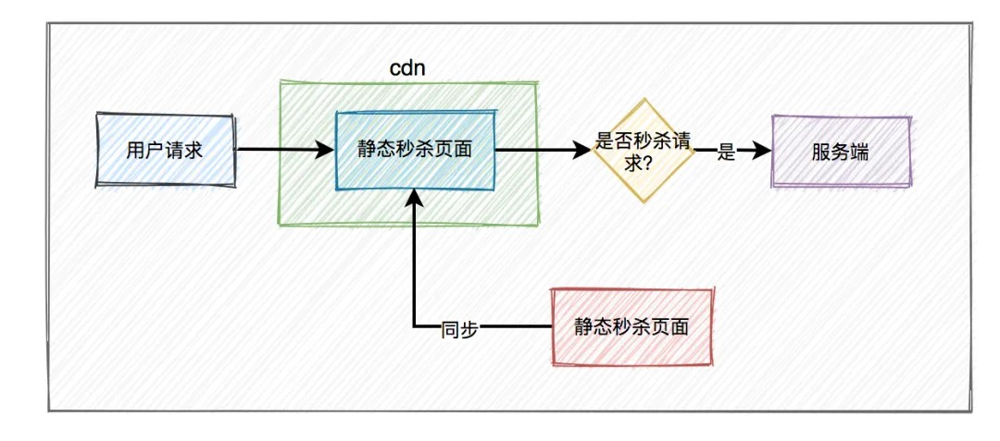

使用户就近获取所需内容，降低网络拥塞，提高用户访问响应速度和命中率。

CDN 加速的基本原理是：将网站的静态内容（如图片、CSS、JavaScript 文件等）复制并存储到分布在全球各地的服务器节点上。

当用户请求访问网站时，CDN 系统会根据用户的地理位置，自动将内容分发给离用户最近的服务器，从而实现快速访问。

国内常见的 CDN 提供商有阿里云 CDN、腾讯云 CDN、百度云加速等，它们提供了全球分布的节点服务器，为全球范围内的网站加速服务。

#### 3 缓存

在高并发的系统中，**缓存** 可以说是必不可少的技术之一。

目前缓存有两种：

基于应用服务器的内存缓存，也就是我们说的二级缓存。
使用缓存中间件，比如：Redis、Memcached 等，这种是分布式缓存。
这两种缓存各有优缺点。

二级缓存的性能更好，但因为是基于应用服务器内存的缓存，如果系统部署到了多个服务器节点，可能会存在数据不一致的情况。

而 Redis 或 Memcached 虽说性能上比不上二级缓存，但它们是分布式缓存，避免多个服务器节点数据不一致的问题。

缓存的用法一般是这样的：

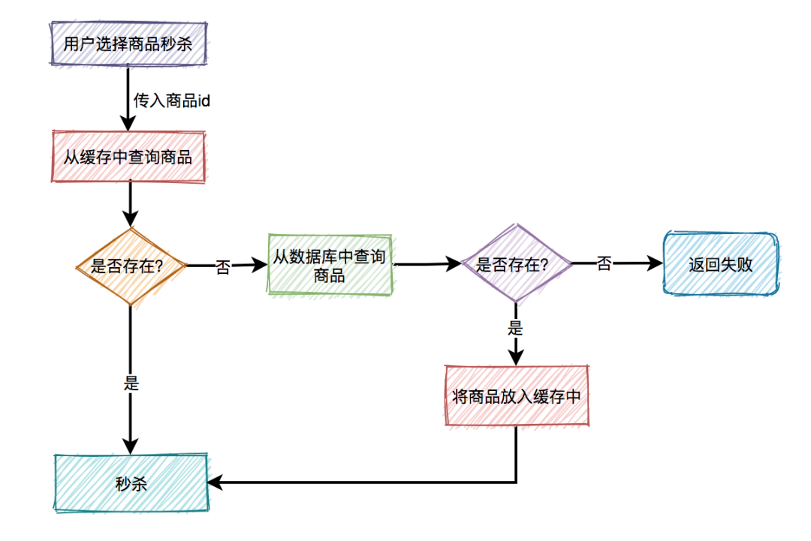

使用缓存之后，可以减轻访问数据库的压力，显著的提升系统的性能。

有些业务场景，甚至会分布式缓存和二级缓存一起使用。

比如获取商品分类数据，流程如下：

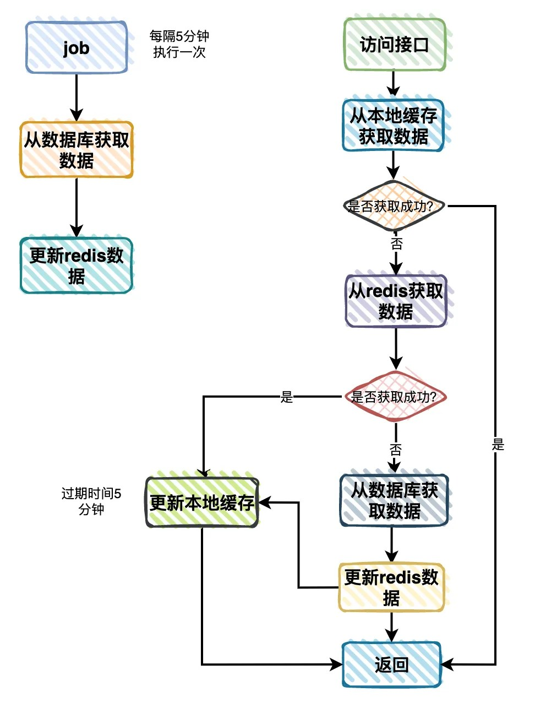

不过引入缓存，虽说给我们的系统性能带来了提升，但同时也给我们带来了一些新的问题，比如：《[数据库和缓存双向数据库一致性问题](https://mp.weixin.qq.com/s?__biz=MzkwNjMwMTgzMQ==&mid=2247493521&idx=1&sn=bff84e7a819d79e4b8eb7e722e96ddfc&chksm=c0e83f79f79fb66f2e7bf03a104580b404ea0a3c977846e428f13c1f12fbad46d4d778b2da14&token=902535653&lang=zh_CN&scene=21#wechat_redirect)》、《[缓存穿透、击穿和雪崩问题](https://mp.weixin.qq.com/s?__biz=MzkwNjMwMTgzMQ==&mid=2247491225&idx=1&sn=bfb14f28911efaa6e3a615870fff9a5c&chksm=c0ebc671f79c4f6718a63bbec91d79a4b05e1dd2a7c00ed9bf6a9f582abd4c6e5c870148ff89&token=902535653&lang=zh_CN&scene=21#wechat_redirect)》等。

我们在使用缓存时，一定要结合实际业务场景，切记不要为了缓存而缓存。

#### 4 异步

有时候，我们在高并发系统当中，某些接口的业务逻辑，没必要都同步执行。

比如有个用户请求接口中，需要做业务操作，发站内通知，和记录操作日志。为了实现起来比较方便，通常我们会将这些逻辑放在接口中同步执行，势必会对接口性能造成一定的影响。

接口内部流程图如下：

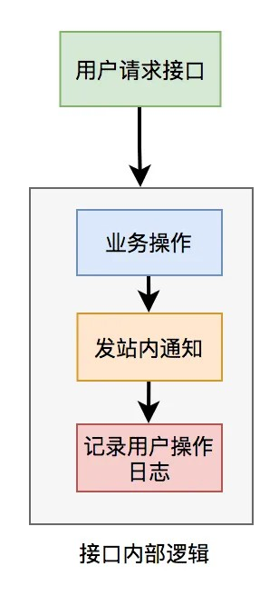

这个接口表面上看起来没有问题，但如果你仔细梳理一下业务逻辑，会发现只有业务操作才是核心逻辑，其他的功能都是非核心逻辑。

在这里有个原则就是：核心逻辑可以同步执行，同步写库。非核心逻辑，可以异步执行，异步写库。

上面这个例子中，发站内通知和用户操作日志功能，对实时性要求不高，即使晚点写库，用户无非是晚点收到站内通知，或者运营晚点看到用户操作日志，对业务影响不大，所以完全可以异步处理。

通常异步主要有两种：多线程 和 mq。

4.1 线程池

使用线程池改造之后，接口逻辑如下：

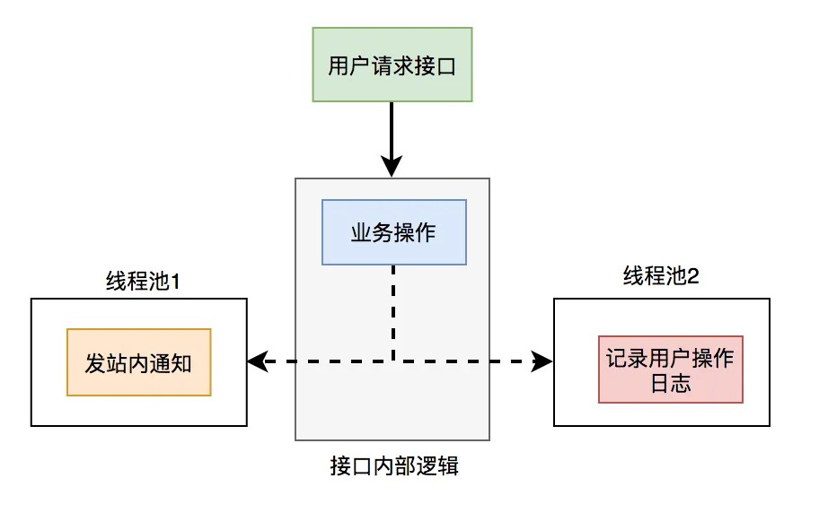

发站内通知和用户操作日志功能，被提交到了两个单独的线程池中。

这样接口中重点关注的是业务操作，把其他的逻辑交给线程异步执行，这样改造之后，让接口性能瞬间提升了。

但使用线程池有个小问题就是：如果服务器重启了，或者是需要被执行的功能出现异常了，无法重试，会丢数据。

那么这个问题该怎么办呢？

4.2 mq

使用 mq 改造之后，接口逻辑如下：

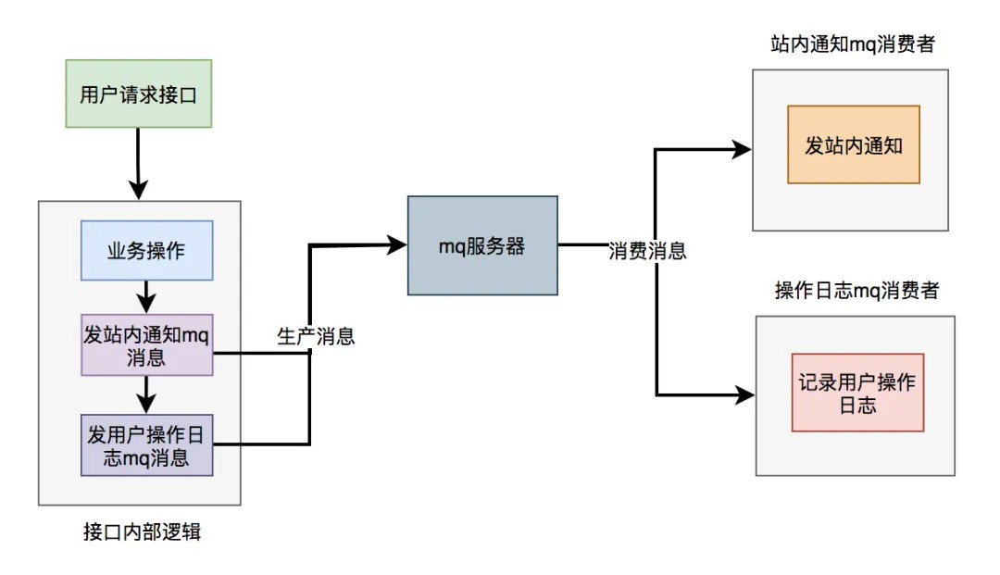

对于发站内通知和用户操作日志功能，在接口中并没真正实现，它只发送了 mq 消息到 mq 服务器。然后由 mq 消费者消费消息时，才真正的执行这两个功能。

这样改造之后，接口性能同样提升了，因为发送 mq 消息速度是很快的，我们只需关注业务操作的代码即可。

#### 5 多线程处理

在高并发系统当中，用户的请求量很大。

假如我们现在用 mq 处理业务逻辑。一下子有大量的用户请求，产生了大量的 mq 消息，保存到了 mq 服务器。而 mq 的消费者，消费速度很慢。可能会导致大量的消息积压问题。从而严重影响数据的实时性。我们需要对消息的消费者做优化。最快的方式是使用多线程消费消息，比如：改成线程池消费消息。

当然核心线程数、最大线程数、队列大小 和 线程回收时间，一定要做成配置的，后面可以根据实际情况动态调整。

这样改造之后，我们可以快速解决消息积压问题。除此之外，在很多数据导入场景，用多线程导入数据，可以提升效率。

#### 6 分库分表

有时候，高并发系统的吞吐量受限的不是别的，而是数据库。

当系统发展到一定的阶段，用户并发量大，会有大量的数据库请求，需要占用大量的数据库连接，同时会带来磁盘 IO 的性能瓶颈问题。

此外，随着用户数量越来越多，产生的数据也越来越多，一张表有可能存不下。由于数据量太大，sql 语句查询数据时，即使走了索引也会非常耗时。

这时该怎么办呢？

答：需要做分库分表。

如下图所示：

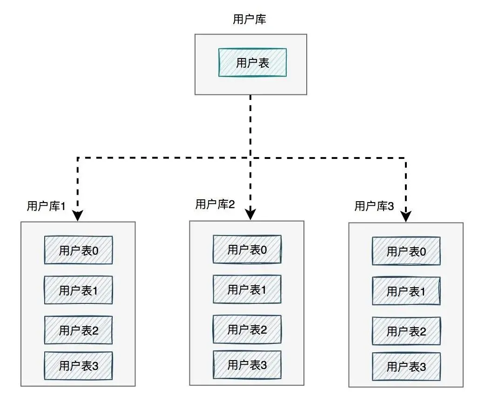


图中将用户库拆分成了三个库，每个库都包含了四张用户表。

如果有用户请求过来的时候，先根据用户 id 路由到其中一个用户库，然后再定位到某张表。

路由的算法挺多的：

- 根据 id 取模，比如：id=7，有 4 张表，则 7%4=3，模为 3，路由到用户表 3。
- 给 id 指定一个区间范围，比如：id 的值是 0-10 万，则数据存在用户表 0，id 的值是 10-20 万，则数据存在用户表 1。
- 一致性 hash 算法
- 分库分表主要有两个方向：垂直和水平。

说实话垂直方向（即业务方向）更简单。

在水平方向（即数据方向）上，分库和分表的作用，其实是有区别的，不能混为一谈。

- 分库：是为了解决数据库连接资源不足问题，和磁盘 IO 的性能瓶颈问题。
- 分表：是为了解决单表数据量太大，sql 语句查询数据时，即使走了索引也非常耗时问题。此外还可以解决消耗 cpu 资源问题。
- 分库分表：可以解决 数据库连接资源不足、磁盘 IO 的性能瓶颈、检索数据耗时 和 消耗 cpu 资源等问题。
- 如果在有些业务场景中，用户并发量很大，但是需要保存的数据量很少，这时可以只分库，不分表。

如果在有些业务场景中，用户并发量不大，但是需要保存的数量很多，这时可以只分表，不分库。

如果在有些业务场景中，用户并发量大，并且需要保存的数量也很多时，可以分库分表。

关于分库分表更详细的内容，可以看看我另一篇文章，里面讲的更深入《[阿里二面：为什么分库分表？](https://mp.weixin.qq.com/s?__biz=MzkwNjMwMTgzMQ==&mid=2247490459&idx=1&sn=1e4296228c00aa4203aab481575ac916&chksm=c0ebc373f79c4a658de7ce7f0d8cf30b1f45adb346c2386321779e7cf85a757a12337d3ae233&token=2041133408&lang=zh_CN&scene=21#wechat_redirect)》

#### 7 池化技术

其实不光是高并发系统，为了性能考虑，有些低并发的系统，也在使用池化技术，比如：数据库连接池、线程池等。

池化技术是多例设计模式的一个体现。

我们都知道创建和销毁数据库连接是非常耗时耗资源的操作。

如果每次用户请求，都需要创建一个新的数据库连接，势必会影响程序的性能。

为了提升性能，我们可以创建一批数据库连接，保存到内存中的某个集合中，缓存起来。

这样的话，如果下次有需要用数据库连接的时候，就能直接从集合中获取，不用再额外创建数据库连接，这样处理将会给我们提升系统性能。

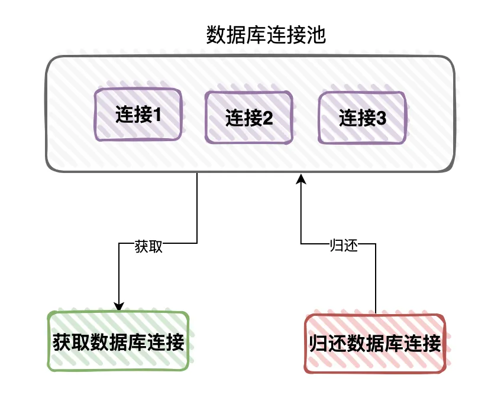

当然用完之后，需要及时归还。

目前常用的数据库连接池有：Druid、C3P0、hikari 和 DBCP 等。

#### 8 读写分离

不知道你有没有听说过 **二八原则**，在一个系统当中可能有 80% 是读数据请求，另外 20% 是写数据请求。

不过这个比例也不是绝对的。

我想告诉大家的是，一般的系统读数据请求会远远大于写数据请求。

如果读数据请求和写数据请求，都访问同一个数据库，可能会相互抢占数据库连接，相互影响。

我们都知道，一个数据库的数据库连接数量是有限，是非常宝贵的资源，不能因为读数据请求，影响到写数据请求吧？

这就需要对数据库做 **读写分离** 了。

于是，就出现了主从读写分离架构：

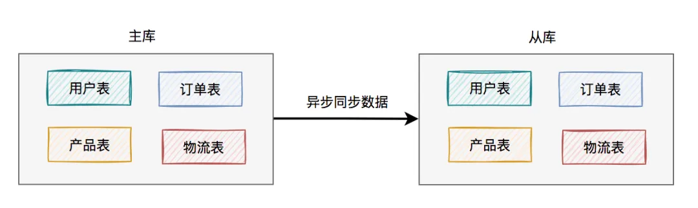

考虑刚开始用户量还没那么大，选择的是一主一从的架构，也就是常说的一个master，一个slave。

所有的写数据请求，都指向主库。一旦主库写完数据之后，立马异步同步给从库。这样所有的读数据请求，就能及时从从库中获取到数据了（除非网络有延迟）。

但这里有个问题就是：如果用户量确实有些大，如果 master 挂了，升级 slave 为 master，将所有读写请求都指向新 master。

但此时，如果这个新 master 根本扛不住所有的读写请求，该怎么办？

这就需要一主多从的架构了：

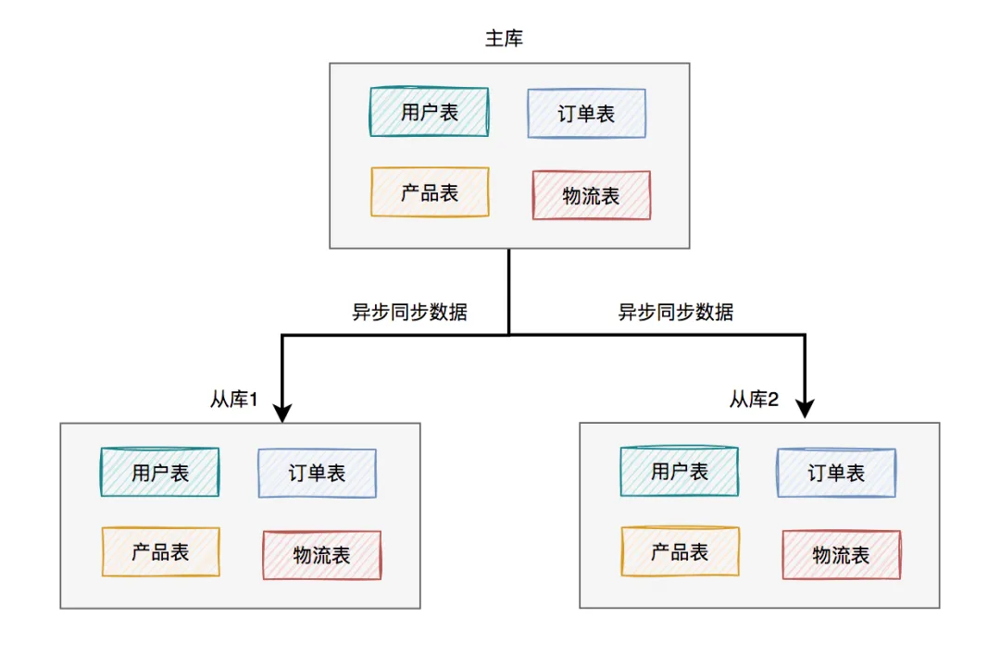


上图中我列的是一主两从，如果 master 挂了，可以选择从库 1 或从库 2 中的一个，升级为新 master。假如我们在这里升级从库 1 为新 master，则原来的从库 2 就变成了新 master 的的 slave 了。

调整之后的架构图如下：

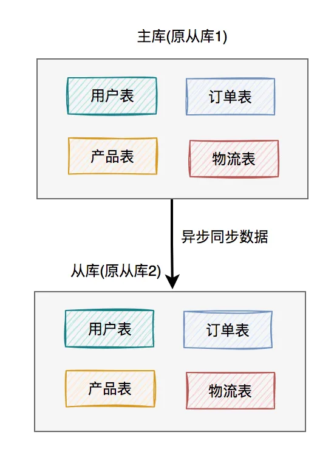

这样就能解决上面的问题了。

除此之外，如果查询请求量再增大，我们还可以将架构升级为一主三从、一主四从... 一主 N 从等。

#### 9 索引

在高并发的系统当中，用户经常需要查询数据，对数据库增加`索引`，是必不可少的一个环节。

尤其是表中数据非常多时，加了索引，跟没加索引，执行同一条 sql 语句，查询相同的数据，耗时可能会相差 N 个数量级。

虽说索引能够提升 SQL 语句的查询速度，但索引也不是越多越好。

在 insert 数据时，需要给索引分配额外的资源，对 insert 的性能有一定的损耗。

我们要根据实际业务场景来决定创建哪些索引，索引少了，影响查询速度，索引多了，影响写入速度。

很多时候，我们需要经常对索引做优化。

1. 可以将多个单个索引，改成一个联合索引。
2. 删除不要索引。
3. 使用 explain 关键字，查询 SQL 语句的执行计划，看看哪些走了索引，哪些没有走索引。
4. 要注意索引失效的一些场景。
5. 必要时可以使用 force index 来强制查询 sql 走某个索引。

如果你想进一步了解 explain 的详细用法，可以看看我的另一篇文章《[explain | 索引优化的这把绝世好剑，你真的会用吗？](https://mp.weixin.qq.com/s?__biz=MzkwNjMwMTgzMQ==&mid=2247490262&idx=1&sn=a67f610afa984ecca130a54a3be453ab&chksm=c0ebc23ef79c4b2869dea998e413c5cbea6aeeea01ee74efc7c1a5fc228baa7beca215adf3ea&token=751314179&lang=zh_CN&scene=21#wechat_redirect)》。

如果你想进一步了解哪些情况下索引会失效，可以看看我的另一篇文章《[聊聊索引失效的 10 种场景，太坑了](https://mp.weixin.qq.com/s?__biz=MzkwNjMwMTgzMQ==&mid=2247491626&idx=1&sn=18fc949c06f04fe8f4c29b6fc5c66f9c&chksm=c0e838c2f79fb1d45c6f9b2ab188bb4663414690bab0718a7d46beb875e6b83e5e67ec27d2ff&token=902535653&lang=zh_CN&scene=21#wechat_redirect)》。

#### 10 批处理

有时候，我们需要从指定的用户集合中，查询出有哪些是在数据库中已经存在的。

实现代码可以这样写：

```Java
public List<User> queryUser(List<User> searchList) {
    if (CollectionUtils.isEmpty(searchList)) {
        return Collections.emptyList();
    }

    List<User> result = Lists.newArrayList();
    searchList.forEach(user -> result.add(userMapper.getUserById(user.getId())));
    return result;
}
```

这里如果有 50 个用户，则需要循环 50 次，去查询数据库。我们都知道，每查询一次数据库，就是一次远程调用。

如果查询 50 次数据库，就有 50 次远程调用，这是非常耗时的操作。

那么，我们如何优化呢？

答：批处理。

具体代码如下：

```Java
public List<User> queryUser(List<User> searchList) {
    if (CollectionUtils.isEmpty(searchList)) {
        return Collections.emptyList();
    }
    List<Long> ids = searchList.stream().map(User::getId).collect(Collectors.toList());
    return userMapper.getUserByIds(ids);
}
```

提供一个根据用户 id 集合批量查询用户的接口，只远程调用一次，就能查询出所有的数据。

这里有个需要注意的地方是：id 集合的大小要做限制，最好一次不要请求太多的数据。要根据实际情况而定，建议控制每次请求的记录条数在 500 以内。

#### 11 集群

系统部署的服务器节点，可能会 down 机，比如：服务器的磁盘坏了，或者操作系统出现内存不足问题。

为了保证系统的高可用，我们需要部署多个节点，构成一个集群，防止因为部分服务器节点挂了，导致系统的整个服务不可用的情况发生。

集群有很多种：

1. 应用服务器集群
2. 数据库集群
3. 中间件集群
4. 文件服务器集群

我们以中间件 Redis 为例。

在高并发系统中，用户的数据量非常庞大时，比如用户的缓存数据总共大小有 40G，一个服务器节点只有 16G 的内存。

这样需要部署 3 台服务器节点。

该业务场景，使用普通的 master/slave 模式，或者使用哨兵模式都行不通。

40G 的数据，不能只保存到一台服务器节点，需要均分到 3 个 master 服务器节点上，一个 master 服务器节点保存 13.3G 的数据。

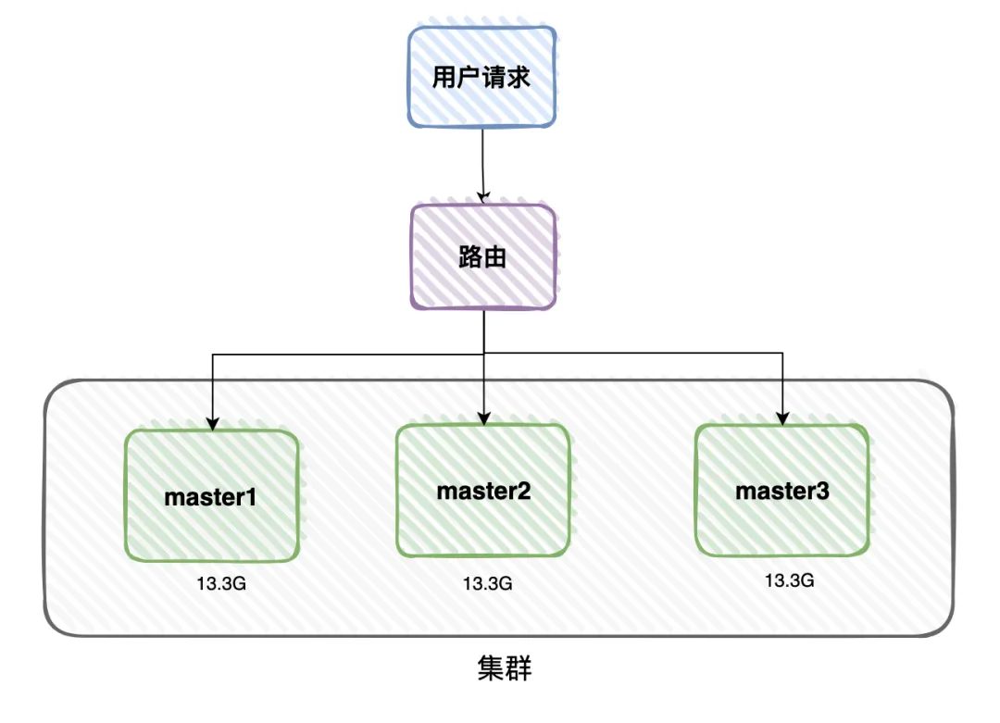

这用就构成了一个集群。

但这样有风险，为了防止其中一个 master 服务器节点挂掉，导致部分用户的缓存访问不了，还需要对数据做备份。

这样每一个 master，都需要有一个 slave，做数据备份。

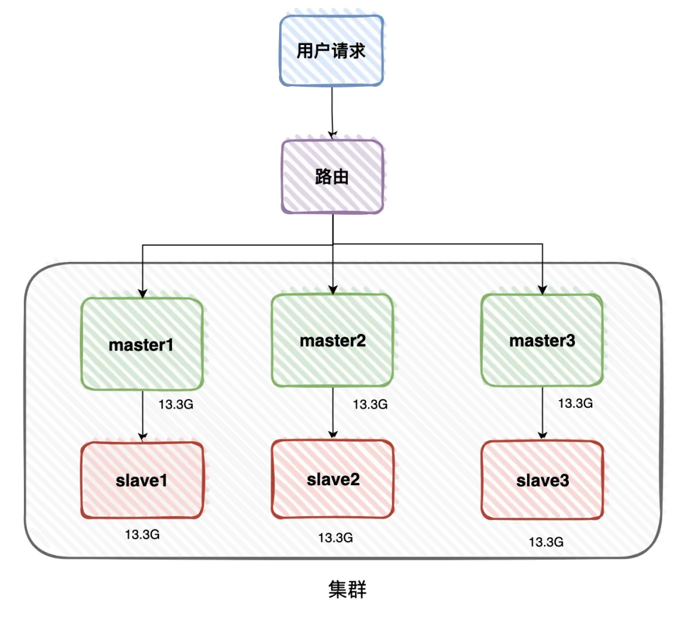

如果 master 挂了，可以将 slave 升级为新的 master，而不影响用户的正常使用。

#### 12 负载均衡

如果我们的系统部署到了多台服务器节点。那么哪些用户的请求，访问节点 a，哪些用户的请求，访问节点 b，哪些用户的请求，访问节点 c？

我们需要某种机制，将用户的请求，转发到具体的服务器节点上。

这就需要使用负载均衡机制了。

在 linux 下有Nginx、LVS、Haproxy等服务可以提供负载均衡服务。

在 SpringCloud 微服务架构中，大部分使用的负载均衡组件就是Ribbon、OpenFegin或SpringCloud Loadbalancer。

硬件方面，可以使用F5实现负载均衡。它可以基于交换机实现负载均衡，性能更好，但是价格更贵一些。

常用的负载均衡策略有：

- 轮询：每个请求按时间顺序逐一分配到不同的服务器节点，如果服务器节点 down 掉，能自动剔除。
- weight权重：weight 代表权重默认为 1，权重越高，服务器节点被分配到的概率越大。weight 和访问比率成正比，用于服务器节点性能不均的情况。
- ip hash：每个请求按访问 ip 的 hash 结果分配, 这样每个访客固定访问同一个服务器节点，它是解诀 Session 共享的问题的解决方案之一。
- 最少连接数：把请求转发给连接数较少的服务器节点。轮询算法是把请求平均的转发给各个服务器节点，使它们的负载大致相同；但有些请求占用的时间很长，会导致其所在的服务器节点负载较高。这时 least_conn 方式就可以达到更好的负载均衡效果。
- 最短响应时间：按服务器节点的响应时间来分配请求，响应时间短的服务器节点优先被分配。

当然还有其他的策略，在这里就不给大家一一介绍了。

#### 13 限流

对于高并发系统，为了保证系统的稳定性，需要对用户的请求量做限流。

特别是秒杀系统中，如果不做任何限制，绝大部分商品可能是被机器抢到，而非正常的用户，有点不太公平。

所以，我们有必要识别这些非法请求，做一些限制。那么，我们该如何现在这些非法请求呢？

目前有两种常用的限流方式：

- 基于 nginx 限流
- 基于 redis 限流

限流类型：

- 对同一用户限流
- 对同一 ip 限流
- 对接口限流
- 加验证码


#### 14 服务降级

前面已经说过，对于高并发系统，为了保证系统的稳定性，需要做限流。

但光做限流还不够。

我们需要合理利用服务器资源，保留核心的功能，将部分非核心的功能，我们可以选择屏蔽或者下线掉。

我们需要做服务降级。

我们在设计高并发系统时，可以预留一些服务降级的开关。

比如在秒杀系统中，核心的功能是商品的秒杀，对于商品的评论功能，可以暂时屏蔽掉。

在服务端的分布式配置中心，比如：apollo 中，可以增加一个开关，配置是否展示评论功能，默认是 true。

前端页面通过服务器的接口，获取到该配置参数。

如果需要暂时屏蔽商品评论功能，可以将 apollo 中的参数设置成 false。

此外，我们在设计高并发系统时，还可以预留一些兜底方案。

比如某个分类查询接口，要从 redis 中获取分类数据，返回给用户。但如果那一条 redis 挂了，则查询数据失败。

这时候，我们可以增加一个兜底方案。

如果从 redis 中获取不到数据，则从 apollo 中获取一份默认的分类数据。

目前使用较多的熔断降级中间件是：Hystrix 和 Sentinel。

- Hystrix 是 Netflix 开源的熔断降级组件。
- Sentinel 是阿里中间件团队开源的一款不光具有熔断降级功能，同时还支持系统负载保护的组件。

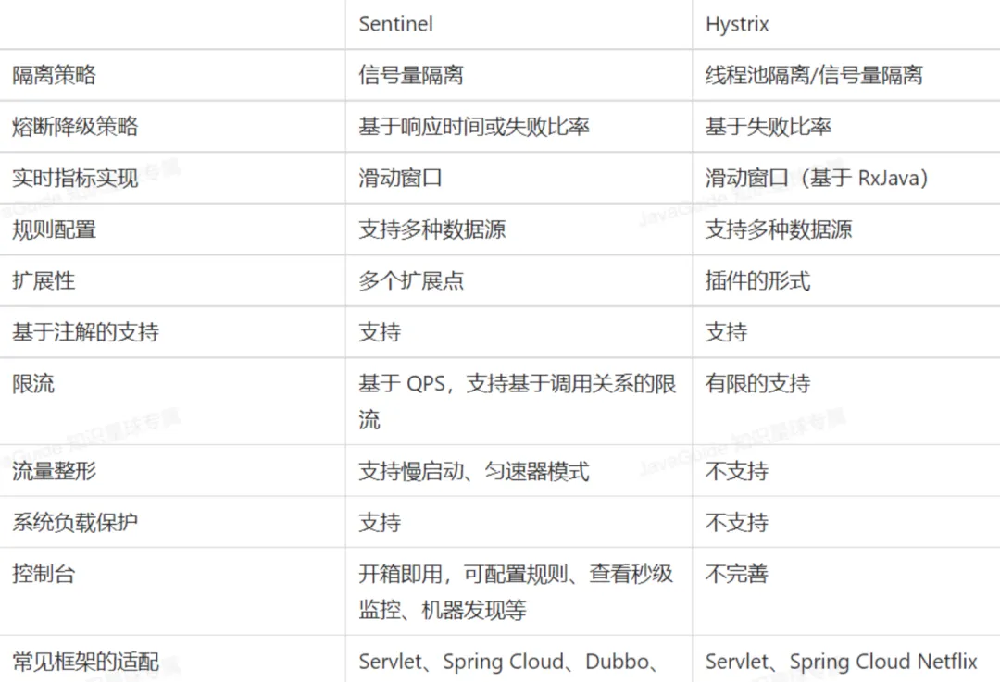

#### 15 故障转移

在高并发的系统当中，同一时间有大量的用户访问系统。

如果某一个应用服务器节点处于假死状态，比如 CPU 使用率 100% 了，用户的请求没办法及时处理，导致大量用户出现请求超时的情况。

如果这种情况下，不做任何处理，可能会影响系统中部分用户的正常使用。

这时我们需要建立故障转移机制。

当检测到经常接口超时，或者 CPU 打满，或者内存溢出的情况，能够自动重启那台服务器节点上的应用。

在 SpringCloud 微服务当中，可以使用Ribbon做负载均衡器。

Ribbon 是 Spring Cloud 中的一个负载均衡器组件，它可以检测服务的可用性，并根据一定规则将请求分发至不同的服务节点。在使用 Ribbon 时，需要注意以下几个方面：

- 设置请求超时时间，当请求超时时，Ribbon 会自动将请求转发到其他可用的服务上。
- 设置服务的健康检查，Ribbon 会自动检测服务的可用性，并将请求转发至可用的服务上。

此外，还需要使用Hystrix做熔断处理。

Hystrix 是 SpringCloud 中的一个熔断器组件，它可以自动地监测所有通过它调用的服务，并在服务出现故障时自动切换到备用服务。在使用 Hystrix 时，需要注意以下几个方面：

- 设置断路器的阈值，当故障率超过一定阈值后，断路器会自动切换到备用服务上。
- 设置服务的超时时间，如果服务在指定的时间内无法返回结果，断路器会自动切换到备用服务上。到其他的能够正常使用的服务器节点上。

#### 16 异地多活

有些高并发系统，为了保证系统的稳定性，不只部署在一个机房当中。

为了防止机房断电，或者某些不可逆的因素，比如：发生地震，导致机房挂了。

需要把系统部署到多个机房。

我们之前的游戏登录系统，就部署到了深圳、天津和成都，这三个机房。

这三个机房都有用户的流量，其中深圳机房占了 40%，天津机房占了 30%，成都机房占了 30%。

如果其中的某个机房突然挂了，流量会被自动分配到另外两个机房当中，不会影响用户的正常使用。

这就需要使用异地多活架构了。


用户请求先经过第三方的 DNS 服务器解析，然后该用户请求到达路由服务器，部署在云服务器上。

路由服务器，根据一定的算法，会将该用户请求分配到具体的机房。

异地多活的难度是多个机房需要做数据同步，如何保证数据的一致性？

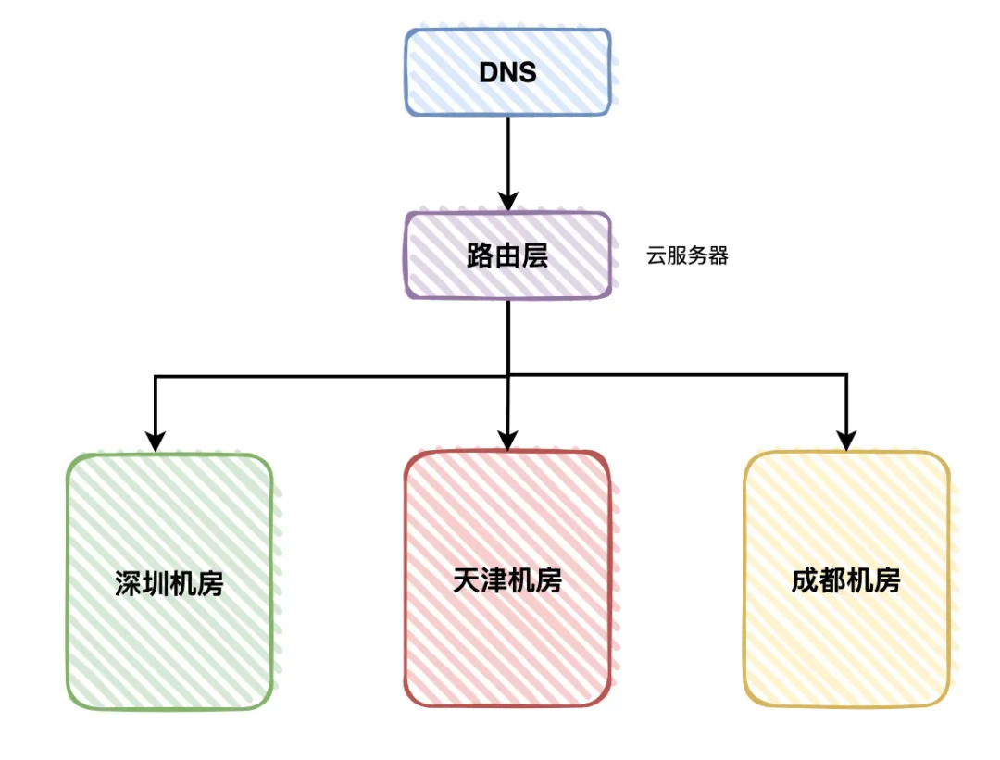

#### 17 压测

高并发系统，在上线之前，必须要做的一件事是做压力测试。

我们先要预估一下生产环境的请求量，然后对系统做压力测试，之后评估系统需要部署多少个服务器节点。

比如预估有 10000 的 qps，一个服务器节点最大支持 1000pqs，这样我们需要部署 10 个服务器节点。

但假如只部署 10 个服务器节点，万一突增了一些新的用户请求，服务器可能会扛不住压力。

因此，部署的服务器节点，需要把预估用户请求量的多一些，比如：按 3 倍的用户请求量来计算。

这样我们需要部署 30 个服务器节点。

压力测试的结果跟环境有关，在 dev 环境或者 test 环境，只能压测一个大概的趋势。

想要更真实的数据，我们需要在 pre 环境，或者跟生产环境相同配置的专门的压测环境中，进行压力测试。

目前市面上做压力测试的工具有很多，比如开源的有：Jemter、LoaderRunnder、Locust 等等。

收费的有：阿里自研的云压测工具 PTS。

#### 18 监控

为了出现系统或者 SQL 问题时，能够让我们及时发现，我们需要对系统做监控。

目前业界使用比较多的开源监控系统是：Prometheus。

它提供了 监控 和 预警 的功能。

架构图如下：

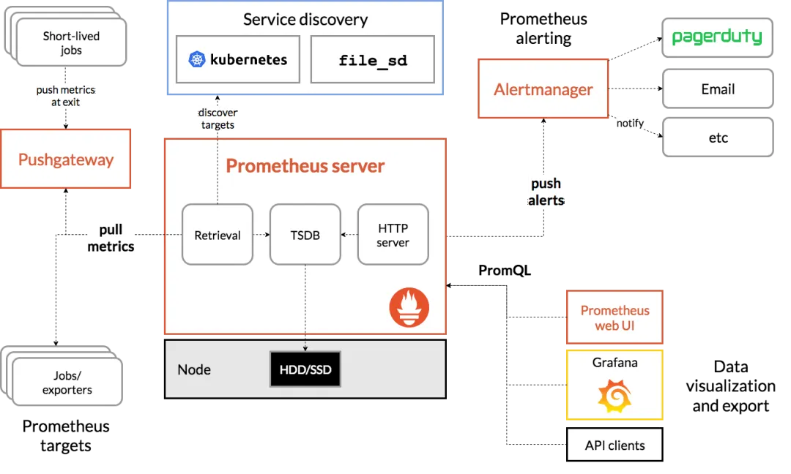

我们可以用它监控如下信息：

- 接口响应时间
- 调用第三方服务耗时
- 慢查询 sql 耗时
- cpu 使用情况
- 内存使用情况
- 磁盘使用情况
- 数据库使用情况

## tip [🔝](#weekly-101)

### 1. [Github 实现 push 触发自动构建（包括提交代码到另一个仓库中和发布 npm）](https://blog.csdn.net/mao871863224/article/details/137069803)

1、将指定内容自动更新到另一个代码仓库中

登录 https://github.com，创建 Personal access token：

1. github 右上角，点击头像，进入 Settings => Developer settings => Personal access tokens 下面的 Tokens (classic) 中，点击 Generate new token，选择 Generate new token (classic)
2. 跳出的页面中输入 github 密码进行验证，
3. Note 中填写此 token 的描述，过期时间自己选择，select scopes 中选择 repo（全选），点击 Generate token 按钮，即可生成一个 token，此时会显示具体 token 内容，记得一定要复制！！！（只此显示一次，后面都不会再次显示）

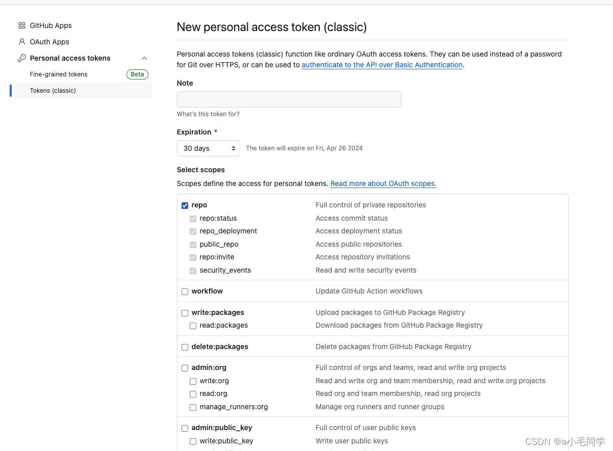

2、进入该代码仓库中新增 secret，按照下图新增一个 secret，对于需要用到的用户名、邮箱也可以在这里自定义添加，到这里配置基本结束

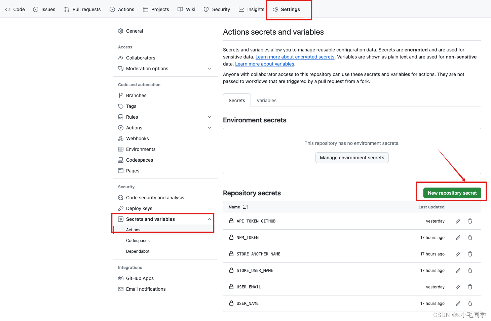

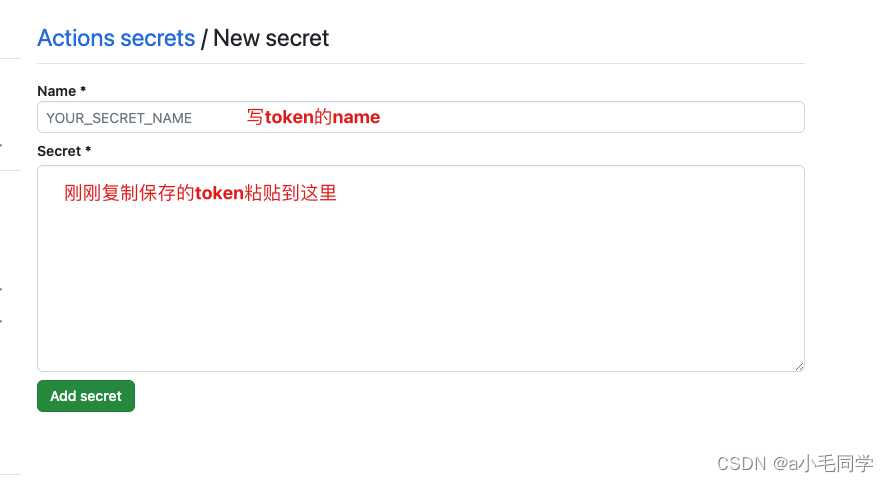

3、接下来点击 Actions 创建 wokeflows 脚本，目录在. guthub/workflows 目录下选择合适的工作流脚本文件

4、脚本文件内容如下（根据需要调整内容，复制后请把 // 后面的注释删掉）：

```YAML
name: update fe-toolkit-doc

on:
  push:
    branches:
      - master  // 这里替换为自己要触发的分支

jobs:
  build:
    runs-on: ubuntu-latest

    steps:
      - uses: actions/checkout@v2
      - name: Use Node.js
        uses: actions/setup-node@v2
        with:
          node-version: '18.x'
      - name: Install Dependencies
        run: npm i
      - name: Build
        run: npm run build:doc   // 替换为自己的打包命令

      - name: Clone destination repository
        run: |
          git clone https://这里是github的username:${{ secrets.API_TOKEN_GITHUB }}@github.com/这里是github的username/要提交代码的另一个仓库名称.git destination_repo

      - name: Backup all files in the repository
        run: |
         mkdir -p dist/backup  // 创建备份文件
         cp -r destination_repo/* dist/backup/

      - name: Remove all files from the repository
        run: |
          cd destination_repo
          git rm -r *

      - name: Commit and push changes
        run: |
          cd destination_repo
          git config --local user.email ${{ secrets.USER_EMAIL }}
          git config --local user.name ${{ secrets.USER_NAME }}
          git commit -m "Remove all files"
          git push origin master

      - name: Push to another repository
        uses: cpina/github-action-push-to-another-repository@main
        env:
          API_TOKEN_GITHUB: ${{ secrets.API_TOKEN_GITHUB }}
        with:
          source-directory: 'dist'   // 要提交的目标文件
          destination-github-username:  ${{ secrets.STORE_USER_NAME }}
          destination-repository-name: ${{ secrets.STORE_ANOTHER_NAME }}
          user-email: ${{ secrets.USER_EMAIL }}
          target-branch: master  // 目标分支
```

5、提交代码后到 Actions 下工作流查看进度和日志


## share [🔝](#weekly-101)

### 1. [领导力 | Leadership Challenge](https://wiki.mbalib.com/wiki/%E9%A2%86%E5%AF%BC%E5%8A%9B)

领导力 (Leadership Challenge) 可以被形容为一系列行为的组合，而这些行为将会激励人们跟随领导去要去的地方，不是简单的服从。根据领导力的定义，我们会看到它存在于我们周围，在管理层，在课堂，在球场，在政府，在军队，在上市跨国公司，在小公司直到一个小家庭，我们可以在各个层次，各个领域看到领导力，它是我们做好每一件事的核心。一个头衔或职务不能自动创造一个领导。

哈罗得 · 孔茨（Harold Koontz, 1908-1984）：**领导力是一种影响力，领导即是一种影响过程，是影响人们心甘情愿和满怀热情为实现组织目标而努力的艺术或者过程。**

美国前国务卿基辛格（Henry Kissenger）博士说：**领导就是要让他的人们，从他们现在的地方，带领他们去还没有去过的地方。**

通用汽车副总裁马克 • 赫根（Mark Hogan）对领导者的描述：**记住，是人使事 情发生，世界上最好的计划，如果没有人去执行，那它就没有任何意义。我努力让最聪明，最有创造性的人们在我周围。我的目标是永远为那些最优秀，最有天才的人们创造他们想要的工作环境。如果你尊敬人们并且永远保持你的诺言，你将会是一个领导者，不管你在公司的位置高低。**

“永远不要怀疑，一小组有思想和关心的公民可以改变这个世界，事情的确就只是这样。”——玛格丽特 · 米德（Margaret Mead）

“领导力就象美，它难以定义，但当你看到时，你就知道。——沃伦 · 班尼斯（Warren Bennis）

“一个领袖人物必须正直、诚实、顾及他人的感受，并且不把个人或小团体的利益和需要摆在一切衡量标准的首位。否则人们就不会追随他。”——约翰 • 科特（John Kurt）美国现任国务卿鲍威尔（Colin Powell）将军被认为，是一个深知如何去激励别人的人

关于领导力的研究首先是从领导研究开始的。从 19 世纪末 20 世纪初着重研究领导者人格特质的领导特质理论，到 40 年代探寻领导者在领导过程中的具体行为以及不同的领导行为对部属影响的领导行为理论，60 年代的研究与领导行为有关的情境因素对领导效力的潜在影响的领导权变理论（情境理论），以及之后的领导归因理论，交易型与转化型理论等，逐渐从领导者的人格特质和行为等个体研究扩展到整个组织情境交互作用的影响。

领导力的研究就是在这些关于领导的研究基础上应运而生，要弄明白什么是领导力，首先要清楚的是：什么是领导 (lead)？

领导不是职务地位，也不是少数人具有的特权专利，而是一种积极互动的目的明确的动力。通俗地讲，领导就是引导团队成员去实现目标的过程，主要包括以下几个方面：

- 引导：涉及到领导者的领导技巧, 包括授权和管理下属等。
- 团队成员：在团队中员工的人际关系、沟通、冲突管理以及团队建设和维持。
- 目标：涉及到企业的战略目标的制定和决策。
- 实现过程：涉及到战略实施中的执行，以目标为导向的组织变革和组织创新。

因此，作为优秀的领导者，就需要具备以上的能力，包括：引导、授权、关系管理、战略制定和执行管理、领导创新和组织变革的能力。

而领导力又是什么？有多少人试图定义领导力，就有多少领导力的相关定义。有人认为，领导者是处于组织变化和活动的核心地位，并努力实现愿景的人；也有人认为，领导力是一个人先天具有的，能够引导他人完成任务的特点和性格合成的；还有，领导力与领导者及其下属之间的权力关系有关，领导者具有权力，并运用它们影响他人；以及，领导力是一种达成目标的工具，协助团体内部成员实现其目标。定义虽然多种多样，但是都有核心概念。

- 领导行为是一个过程。
- 领导包含着相互影响。
- 领导在组织中发生。

所谓领导力，就是一种特殊的人际影响力，组织中的每一个人都会去影响他人，也要接受他人的影响，因此每个员工都具有潜在的和现实的领导力。在组织中，领导者和成员共同推动着团队向着既定的目标前进，从而构成一个有机的系统，在系统内部具有以下几个要素：领导者的个性特征和领导艺术，员工的主观能动性，领导者与员工之间的积极互动，组织目标的制定以及实现的过程。

系统是否正常取决于各要素能否协调地发展。而协调发展的关键就在于领导者和其他成员之间的互动，能否使领导行为双方互动形成统一的认识，情感和行为活动，是领导力正确发挥的必要条件。

[readme](../README.md) | [previous](202502W1.md) | [next](202502W3.md)
