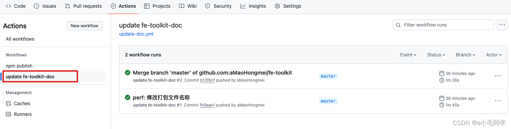

> @Author  : Lewis Tian (taseikyo@gmail.com)
>
> @Link    : github.com/taseikyo
>
> @Range   : 2025-02-09 - 2025-02-15

# Weekly #101

[readme](../README.md) | [previous](202502W1.md) | [next](202502W3.md)


\**Photo by [Dynamic Wang](https://unsplash.com/@dynamicwang) on [Unsplash](https://unsplash.com/photos/a-woman-standing-in-front-of-a-building-fCrnZF_OGLs)*

> 既要革命，就要有一个革命党。没有一个革命的党， 没有一个按照马克思列宁主义的革命理论和革命风格建立起来的革命党， 就不可能领导工人阶级和广大人民群众战胜帝国主义及其走狗。 —— 《全世界革命力量团结起来，反对帝国主义的侵略》（一九四八年十一月），《毛泽东选集》第四卷第一三六零页

## Table of Contents

- [algorithm](#algorithm-)
- [review](#review-)
	- 社会运转的秘密：阶层、认知与真相
- [tip](#tip-)
	- Github 实现 push 触发自动构建（包括提交代码到另一个仓库中和发布 npm）
- [share](#share-)

## algorithm [🔝](#weekly-101)

## review [🔝](#weekly-101)

### 1. [社会运转的秘密：阶层、认知与真相](https://www.jiemin.com/archives/1755.html)

1、有一件事，我琢磨了很久都没弄明白，今天终于豁然开朗！

那些日赚百万的明星，在直播间里推销十块钱的商品，嗓子都喊哑了。

拥有自己博物馆的大咖，在直播间里推销二十块钱的小商品。

身价上亿的富太太，连续直播好几个小时不觉得累，拼命叫卖商品；

当富人们都开始关注穷人的小钱小财，说明这个社会的最后一滴血快要被吸干；

当然，直播是合法的，商品是合法的，大声叫卖也是合法的，每个环节都合法。但是把这些环节联合起来看，总感觉有些不妥，究竟哪里不妥？却又说不清楚。

违法的最高境界就是这样，它的每一个环节都是合法的，都能经得起法律的审查，但是联合起来却是一个非常荒诬的生意，对社会的危害极大。但你又无法对它采取行动，因为它每一个环节都是合法的。

2、所谓的规则，都是强者为弱者设定的一个界限，强者并不需要遵守规则。

后来我终于明白：我们在学校里学到的东西，老师教给我们的道理，和课本上描述的事迹，都需要反过来看，反过来学，反过来用，这就是活学活用。

如果我们不懂得变通，只知道老实工作，就会成为别人任意宰割的小绵羊。

什么叫成熟？就是发现了社会的丑恶面，还能和它和平共处。

切记：永远不要再相信社会上宣扬的那一套。

社会上只有两种人，一种是狼，另一种是羊。

狼的生存逻辑就是如何优雅的吃掉羊，羊的生存逻辑就是如何才能变成狼。

社会最愚蠢的人，就是那些只会讲道理，死抱着理论，又遵守规则的弱者。

3、为什么强者从来不遵守规则？

小时候我们一直在学习什么是对错，什么是道理，什么是文明。

长大后却发现我们都学反了，世界只认输赢，只认强弱，只认实力。

这是多么痛的人生领悟！

老实人最大的可悲是什么？他们总以为世界是“讲道理”的，结果被弄的遍体鳞伤后才发现，世界其实是“以强欺弱”的。

只要你失败了，哪怕是一个好人，也会成为大家鄙视的对象。

只要你成功了，哪怕是不择手段，也会被大家捧得高高在上。

做一个好人不仅得不到奖赏，反而因为安分守己和安贫乐道而遭到歧视；

做一个坏人并没有得到惩罚，反而因为赚到了钱而被歌颂和追捧。

这就是社会最混蛋的一面，跟我们小时候接受的教育完全是相反的。

4、我们所能直接获取的一切信息并不属于我们，只有当它们进入我们的大脑之后，经过我们的思考和审视，被我们过滤之后的那部分才属于我们。

这些东西被我们摄入、囤积起来，成为“认知”。我们所被告知的切道理和答案，并不属于我们。只有当他们进入我们的大脑后，在某一时刻跟我们的经历相结合，让我们恍然大悟：原来是这样的！

在这一刻才属于我们。看到的是信息，学到的是知识，悟到的才是智慧。

1:人民群众日益增长的智商，和落后套路之间的矛盾；

2:人们清醒了很痛苦，和糊涂了也很痛苦之间的矛盾。

3：房价再涨就出问题，和不涨也会出问题之间的矛盾。

4:现金拿在手里就贬值，和投出去就亏钱之间的矛盾。

5:想奋斗却无从下手，和想躺平却不安心之间的矛盾。

6:有事干就很焦虑，和没事干就陷入抑郁之间的矛盾。

5、一个非常残忍的真相：99%的人来到世界上都是为了凑数的，都是为了充当社会运转的辅料，是社会发展的冗余。

为了让大家看懂，先给大家看一个比喻，这个故事需要一定的智商才能看懂，大家一定要好好品，里面蕴含着天机，但能读懂的人寥寥无几！

主人对埋头拉磨的驴说：你真的很了不起，没有你，大家都得吃粗粮。驴憨厚的笑了笑，拉磨的步伐更快了。

晚上，主人全家一边吃着护磨的新粮，一边教育小孩：千万不要学那头蠢驴，一辈子都在围着磨盘转。

驴结束了一天的劳累，一边吃着玉米杆，一边对小驴说：快长大，我要教会你拉磨，这是最受人尊敬的职业！

这个世界最残忍的真相，莫过于：99%的勤奋努力、但认知低下的穷人，养活了1%的坐享其成的富人。

这99%的来人间都是为了凑数的，他们充当了社会运转的辅料，是为了帮助1%的人活得更好，实现各种自由。

当然，这1%的富人为了能够稳固自己的位置，不断的去设计各种规则去限制和操控那99%的穷人。

富人的财富都来自于穷人的劳动。穷人越努力，富人就越富有，这就是“勤劳致富”的真相。

富人会让穷人世世代代的穷下去，这样自己才可以坐享其成。为了实现这个目的，富歌颂勤奋是一种美德，高呼努力改变命运。

要让驴推磨，就必须蒙住驴的眼睛，让他们保持埋头苦干的状态，驴如果清醒了，这磨就推不下去了。

偶尔有一些穷人忽然觉醒了，开始升维思考，去钻研富人的心理和制度设计。就像“游戏角色”开始研究“游戏程序”一样，一旦它发现终身升级打怪毫无意义，就开始思考谁这一切的设计者？如何才能颠覆当前的规则？

如果穷人真的学会思考了，富人会非常焦虑，因为他们的地位随时都会被取代。为此，富人制造了大量心灵鸡汤，以及各种情绪安慰的口号，还有像直播、短视频、游戏、娱乐节目这样的奶头乐，让穷人沉沦。这个方法非常奏效，绝大多数穷人都深陷其中不可自拔。

所以这个时代最有意思的地方在于：穷人都在享受生活，因为各种快乐来的太容易了，而富人却在思考人生，思考如何设计更好的制度去奴役他们。

动富人的利益，如同动他们的性命，动穷人的认知，如同刨他们的祖坟。穷人的愚昧恰是富人利益的来源，把这个真相公之于众的人，会同时受到穷人和富人的打击，因为你动了富人的利益，毁灭了穷人的幻想。

反而是那些炮制安慰剂和迷幻药的人，会受到所有人的欢迎。

6、这世界就像一个大型传销集团，你刚一进来就要先给你彻底洗个脑。告诉你，这个东西叫做钱，那个东西叫做豪车，这个玩意是别墅，那个东西叫美女，宾利500万，中心小区20万一平米，你拥有这些东西你就是快乐的，你没有这些东西你就是个失败者，就得痛苦。然后呢，那你就拼命赚钱去吧，把我们这个传销集团做大做强。

其实你如果是个草原上的羊，每天在草地上跑几圈，饿了吃点草，累了就躺下，你没有金钱、权力、地位，你未必就不快乐，你根本就不需要这些东西。

为什么现在的生活压力会让你痛苦呢？其实并不是所谓的压力让你痛苦，而是这个社会体系要让你因为所谓的压力而觉得痛苦，要让你觉得你非常需要金钱、权力、地位，你们都在它的控制之下，它才能正常的运作。

那你要是把这个社会体系灌输给你的概念都丢掉，管你什么金钱权力地位，我不感兴趣，我就当个羊，一天吃几口草，高兴了就跳两下，不高兴了就躺下，你能把我怎么样呢？

你要是连我做个羊的权利都剥夺了，那我退出你这个糟糕的社会体系，不跟你们玩这个恶心的游戏了不就完了吗，你们继续恶心你们的，我去别的世界开心我的，多大个事情啊，谁吓唬谁啊，这宇宙大了去了，还非得在你们这里玩啊？

蚂蚁离开砂堆，来到花园，变成一只蝴蝶，砂堆里的蚂蚁继续在沙粒里争来抢去，生生不息。它们还真是可怜呢。

如果某一天你有了离开砂堆的勇气，那你就能找到你活着的意义了。

如何让人甘于劳动，告诉他们贫穷是因为懒惰导致的。为什么科技如此发达的今天，世界上依然存在大量的贫困人口，原因就是世界原本就是这样设计的。

假设一夜之间贫穷人都变富了，那么第二天富人就要自己洗衣服，自己下厨房做饭，还要自己去种田种菜养猪。

富人是绝对不允许这样的事情发生的。财富的生产离不开人的劳动，否则肥沃的田园就会变得荒凉，工厂的流水线就会变成废墟。

那么富人依靠什么来驱使贫穷人劳动呢？如果依靠法律强制执行，某一部分人必须劳动，一部分人坐享其成，那必然会产生强烈的矛盾。但是如果换一种方法呢？让一部分人永远的贫穷，并且告诉他们贫穷是因为不努力，不勤奋所导致的，那么他们就会毫无怨言的拼命干活，妄图通过勤劳致富。

我们再思考一个问题，富人如何让自己手里的钱更值钱，假设富人看中一个人，想用钱买这个人的自由，那么怎么才能降低成本。如果这个人出身富有，那么富人就要付出巨大的成本。但假设这个人出身贫寒，那么大概率用少量的钱就能达到目的，这就是富士康建在郑州，而不是杭州的原因。杭州穷人太少，劳动力成本比较昂贵。

观察我们身边的人，那些工作最卖力，最不敢违背老板的意愿，最不敢换工作的人，是不是那些有家庭有孩子，并且背负着巨额贷款的人，所以穷人越穷，雇佣他们的成本就越低，富人手里的金钱购买力也就越强。

社会的“真相”分为三个等级：

第一等是“鸡汤”，被普通大众掌握；大家信手拈来，比如培训课和各种短视频里的内容；

第二等是“绝学”，被社会精英掌握；需要深度学习才能吸收。

第三等是“帝王术”，被帝王将相掌握；属于天机，天机不可泄露，永远不会流落民间。

也因此，世界有三套逻辑：

第一套针对普罗大众，教人如何老老实实的做一棵韭菜；

第二套针对少部分精英，让他们成为一个有价值的人；

第三套针对极少数谋局者，帮他们更好的管理好世界；

尤其是第三套逻辑，只能在帝王中流传，帮助他们和管理世界。需要极高的缘分才能接触到这个层面的认知，比如张良就是得到了黄石公的真传，才帮刘邦得到了天下。

绝大部分人一生都在“鸡汤”中浸淫，稀里糊涂过一生；少数人能通过刻苦学习掌握了某一门技艺，可以安身立命；极少数人才能领悟到“天机”，他们看透世界的真相后保持缄默。

我经常说：世界始终被1%的人拨着走，剩余的99%的人总在生活在“鸡汤”里，每次等这些人一觉醒来，发现自己又被收割了，世界又变了。

根据认知的不同，社会也分了三大阶层：顶层，中层，和底层。

每个阶层掌握每个阶层的认知，上一层可以向下兼容下一层，下一层却很难能向上窥见上一层的认知。

阶层逆袭的本质就是认知的逆袭，认知升级的本质，其实就是偷学上一个阶层的认知。

这个世界最残忍的真相，莫过于大量勤奋努力、但认知低下的底层人，养活了少数看穿真相的顶层人。

底层人存在的最大目的，就是充当了社会运转的辅料，是为了帮助顶层人活得更好，实现各种自由。

底层人需要的是游戏、网购、直播、短视频、信息茧房、娱乐内容、垃圾食品等等，让自己麻醉

中层人需要的社会的认可、底层的崇拜、顶层的嘉奖、各种光环等等，他们自我感觉良好。

顶层需要的是更好的制度设计，让每个人都马不停蹄的去创造，让大家各归其位、各司其职，各按其时。

这就是人类运行的底层逻辑，古今中外、千百年来概莫能外。

最令人无奈的是，当你把这个逻辑告诉底层人，企图启他们的思考，让他们看到社会运转的真相时，他们反而是不满的，因为他们宁可继续活在心灵鸡汤和情绪安慰里，宁可当一头快乐的猪，直到被宰的那一刻。

的确，绝大部分底层人活着都是为了睡得更香，而不是为了觉醒。

因此，当你把真相公布于众，会招致三个阶层的不满，因为你动了顶层人的利益，破坏了中层人的舒适，毁灭底层人的幻想，会成为这三者共同的敌人。

相反，那些生产迷幻药的人，却会成为三者共同的朋友。也就是说：每个阶层都认为现状是最合理的，是不需要任何改变和进步的。

这就是世界运转的秘密。

——JieMin 发表于2024年02月01日 08时12分

## tip [🔝](#weekly-101)

### 1. [Github 实现 push 触发自动构建（包括提交代码到另一个仓库中和发布 npm）](https://blog.csdn.net/mao871863224/article/details/137069803)

1、将指定内容自动更新到另一个代码仓库中

登录 https://github.com，创建 Personal access token：

1. github 右上角，点击头像，进入 Settings => Developer settings => Personal access tokens 下面的 Tokens (classic) 中，点击 Generate new token，选择 Generate new token (classic)
2. 跳出的页面中输入 github 密码进行验证，
3. Note 中填写此 token 的描述，过期时间自己选择，select scopes 中选择 repo（全选），点击 Generate token 按钮，即可生成一个 token，此时会显示具体 token 内容，记得一定要复制！！！（只此显示一次，后面都不会再次显示）


2、进入该代码仓库中新增 secret，按照下图新增一个 secret，对于需要用到的用户名、邮箱也可以在这里自定义添加，到这里配置基本结束


3、接下来点击 Actions 创建 wokeflows 脚本，目录在. guthub/workflows 目录下选择合适的工作流脚本文件

4、脚本文件内容如下（根据需要调整内容，复制后请把 // 后面的注释删掉）：

```YAML
name: update fe-toolkit-doc

on:
  push:
    branches:
      - master  // 这里替换为自己要触发的分支

jobs:
  build:
    runs-on: ubuntu-latest

    steps:
      - uses: actions/checkout@v2
      - name: Use Node.js
        uses: actions/setup-node@v2
        with:
          node-version: '18.x'
      - name: Install Dependencies
        run: npm i
      - name: Build
        run: npm run build:doc   // 替换为自己的打包命令

      - name: Clone destination repository
        run: |
          git clone https://这里是github的username:${{ secrets.API_TOKEN_GITHUB }}@github.com/这里是github的username/要提交代码的另一个仓库名称.git destination_repo

      - name: Backup all files in the repository
        run: |
         mkdir -p dist/backup  // 创建备份文件
         cp -r destination_repo/* dist/backup/

      - name: Remove all files from the repository
        run: |
          cd destination_repo
          git rm -r *

      - name: Commit and push changes
        run: |
          cd destination_repo
          git config --local user.email ${{ secrets.USER_EMAIL }}
          git config --local user.name ${{ secrets.USER_NAME }}
          git commit -m "Remove all files"
          git push origin master

      - name: Push to another repository
        uses: cpina/github-action-push-to-another-repository@main
        env:
          API_TOKEN_GITHUB: ${{ secrets.API_TOKEN_GITHUB }}
        with:
          source-directory: 'dist'   // 要提交的目标文件
          destination-github-username:  ${{ secrets.STORE_USER_NAME }}
          destination-repository-name: ${{ secrets.STORE_ANOTHER_NAME }}
          user-email: ${{ secrets.USER_EMAIL }}
          target-branch: master  // 目标分支
```

5、提交代码后到 Actions 下工作流查看进度和日志




## share [🔝](#weekly-101)

[readme](../README.md) | [previous](202502W1.md) | [next](202502W3.md)
