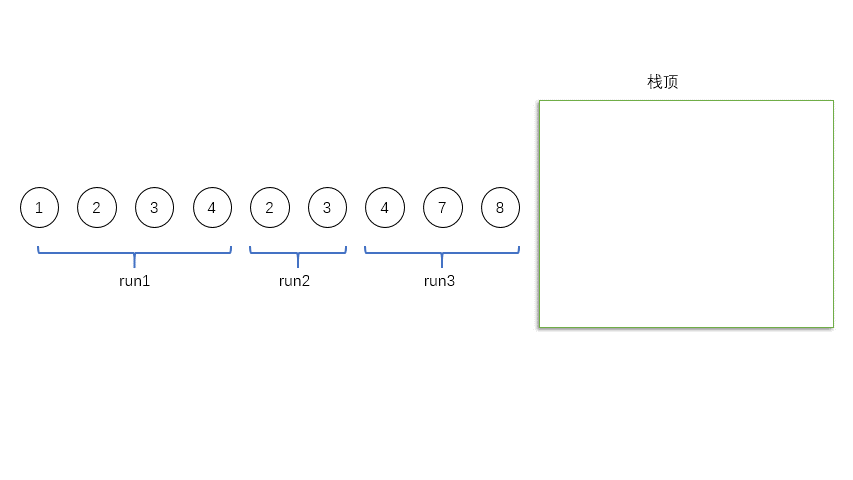
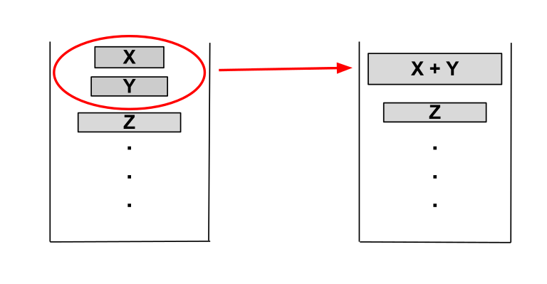
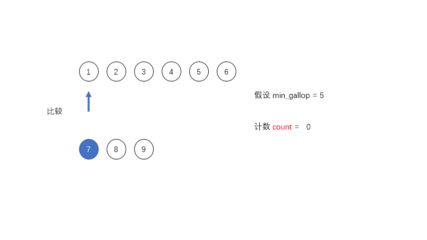

> @Author  : Lewis Tian (taseikyo@gmail.com)
>
> @Link    : github.com/taseikyo
>
> @Range   : 2025-02-16 - 2025-02-22

# Weekly #102

[readme](../README.md) | [previous](202502W2.md) | [next](202502W4.md)


\**Photo by [Alex Shaw](https://unsplash.com/@matt909) on [Unsplash](https://unsplash.com/photos/woman-in-black-coat-standing-near-brown-trees-during-daytime-g8sS1Kq7yRI)*

> 我党规定了中国革命的总路线和总政策，又规定了各项具体的工作路线和各项具体的政策。但是，许多同志往往记住了我党的具体的个别的工作路线和政策，忘记了我党的总路线和总政策。而如果真正忘记了我党的总路线和总政策，我们就将是一个盲目的不完全的不清醒的革命者，在我们执行具体工作路线和具体政策的时候，就会迷失方向，就会左右摇摆，就会贻误我们的工作。 —— 《在晋绥干部会议上的讲话》（一九四八年四月一日），《毛泽东选集》第四卷第一三一四页。

## Table of Contents

- [algorithm](#algorithm-)
- [review](#review-)
    - 世界上最快的排序算法——Timsort
- [tip](#tip-)
	- Git pre-commit hook 检测重复提交
- [share](#share-)

## algorithm [🔝](#weekly-102)

## review [🔝](#weekly-102)

### 1. [世界上最快的排序算法——Timsort](https://www.cnblogs.com/sunshuyi/p/12680918.html)

Timsort 是一个**自适应**的、**混合**的、**稳定**的排序算法，融合了归并算法和二分插入排序算法的精髓，在现实世界的数据中有着特别优秀的表现。它是由 Tim Peter 于 2002 年发明的，用在 Python 这个编程语言里面。这个算法之所以快，是因为它充分利用了现实世界的待排序数据里面，有很多子串是已经排好序的不需要再重新排序，利用这个特性并且加上合适的合并规则可以更加高效的排序剩下的待排序序列。

当 Timsort 运行在部分排序好的数组里面的时候，需要的比较次数要远小于 nlogn$nlogn$，也是远小于相同情况下的归并排序算法需要的比较次数。但是和其他的归并排序算法一样，最坏情况下的时间复杂度是 $O(nlogn)$ 的水平。但是在最坏的情况下，Timsort 需要的临时存储空间只有 $n/2$ ，在最好的情况下，需要的额外空间是常数级别的。从各个方面都能够击败需要 $O(n)$ 空间和稳定 $O(nlogn)$ 时间的归并算法。

#### 限制

在最初的 Tim 实现的版本中，对于长度小于 `64` 数组直接进行二分插入排序，不会进行复杂的归并排序，因为在小数组中插入排序的性能已经足够好。在 Java 中有略微的改变，这个阈值被修改成了 `32` ，据说在实际中 `32` 这个阈值能够得到更好的性能。

#### 二分插入排序

插入排序的逻辑是将排好序的数组之后的一个元素不停的向前移动交换元素直到找到合适的位置，如果这个新元素比前面的序列的最小的元素还要小，就要和前面的每个元素进行比较，浪费大量的时间在比较上面。采用二分搜索的方法直接找到这个元素应该插入的位置，就可以减少很多次的比较。虽然仍然是需要移动相同数量的元素，但是复制数组的时间消耗要小于元素间的一一互换。

比如对于 `[2,3,4,5,6,1]` ，想把 `1` 插入到前面，如果使用直接的插入排序，需要 5 次比较，但是使用二分插入排序，只需要 2 次比较就直到插入的位置，然后直接把 `2,3,4,5,6` 全部向后移动一位，把 `1` 放入第一位就完成了插入操作。

#### Run

首先介绍其中最重要的一个概念，英文叫做 `run` ，所谓的 `run` 就是一个连续上升（此处的上升包括两个元素相等的情况）或者下降（严格递减）的子串。

比如对于序列 `[1,2,3,4,3,2,4,7,8]` ，其中有三个 `run` ，第一个是 `[1,2,3,4]` ，第二个是 `[3,2]` ，第三个是 `[4,7,8]` ，这三个 `run` 都是单调的，在实际程序中对于单调递减的 `run` 会被 **反转成递增的序列** 。


在合并序列的时候，如果 `run` 的数量等于或者略小于 `2` 的幂次方的时候，效率是最高的；如果略大于 `2` 的幂次方，效率就会特别低。所以为了提高合并时候的效率，需要尽量控制每个 `run` 的长度，定义一个 `minrun` 表示每个 `run` 的最小长度，如果长度太短，就用二分插入排序把 `run` 后面的元素插入到前面的 `run` 里面。对于上面的例子，如果 `minrun=5` ，那么第一个 `run` 是不符合要求的，就会把后面的 `3` 插入到第一个 `run` 里面，变成 `[1,2,3,3,4]` 。


在执行排序算法之前，会计算出这个 `minrun` 的值（所以说这个算法是自适应的，会根据数据的特点来进行自我调整）， `minrun` 会从 32 到 64（包括）选择一个数字，使得数组的长度除以 `minrun` 等于或者略小于 `2` 的幂次方。比如长度是 `65` ，那么 `minrun` 的值就是 `33` ；如果长度是 `165` ， `minrun` 就是 `42` （注意这里的 Java 的 `minrun` 的取值会在 16 到 32 之间）。

这里用 Java 源码做示范：

```Java
private static int minRunLength(int n) {
    assert n >= 0;
    int r = 0;        // 如果低位任何一位是1，就会变成1
    while (n >= 64) { // 改成了64
        r |= (n & 1);
        n >>= 1;
    }
    return n + r;
}
```

#### 合并

在归并算法中合并是两两分别合并，第一个和第二个合并，第三个和第四个合并，然后再合并这两个已经合并的序列。但是在 Timsort 中，合并是连续的，每次计算出了一个 `run` 之后都有可能导致一次合并，这样的合并顺序能够在合并的同时保证算法的 **稳定性** 。

在 Timsort 中用一个 **栈** 来保存每个 `run` ，比如对于上面的 `[1,2,3,4,3,2,4,7,8]` 这个例子，栈底是 `[1,2,3,4]` ，中间是 `[3,2]` ，栈顶是 `[4,7,8]` ，每次合并仅限于栈里面相邻的两个 `run` 。



#### 合并条件

为了保证 Timsort 的合并平衡性，Tim 制定一个合并规则，对于在栈顶的三个`run`，用`X`、`Y`和`Z`分别表示他们的长度，其中`X`在栈顶，必须始终维持一下的两个规则：

$$Z > Y + X$$

$$Y > X$$

一旦有其中的一个条件不被满足， `Y` 这个子序列就会和 `X` 于 `Z` 中较小的元素合并形成一个新 `run` ，然后会再次检查栈顶的三个 `run` 看看是否仍然满足条件。如果不满足则会继续进行合并，直至栈顶的三个元素（如果只有两个 `run` 就只需要满足第二个条件）满足这两个条件。



所谓的合并的平衡性就是为了让合并的两个数组的大小尽量接近，提高合并的效率。所以在合并的过程中需要尽量保留这些 `run` 用于发现后来的模式，但是我们又想尽量快的合并内存层级比较高的 `run` ，并且栈的空间是有限的，不能浪费太多的栈空间。通过以上的两个限制，可以将整个栈从底部到顶部的 `run` 的大小变成严格递减的，并且收敛速度和 **斐波那契数列** 一样，这样就可以应用斐波那契数列和的公式根据数组的长度计算出需要的栈的大小，一定是比 $log_{1.618}N$ 要小的，其中 `N` 是数组的长度。

在最理想的情况下，这个栈从底部到顶部的数字应该是 `128` 、 `64` 、 `32` 、 `16` 、 `8` 、 `4` 、 `2` 、 `2` ，这样从栈顶合并到栈底，每次合并的两个 `run` 的长度都是相等的，都是完美的合并。

如果遇到不完美的情况比如 `500` 、 `400` 、 `1000` ，那么根据规则就会合并变成 `900` 、 `1000` ，再次检查规则之后发现还是不满足，于是合并变成了 `1900` 。

#### 合并内存消耗

不使用额外的内存合并两个 `run` 是很困难的，有这种原地合并算法，但是效率太低，作为 trade-off，可以使用少量的内存空间来达到合并的目的。

比如有两个相邻的 `run` 一前一后分别是 `A` 和 `B` ，如果 `A` 的长度比较小，那么就把 `A` 复制到临时内存里面，然后 **从小到大** 开始合并排序放入 `A` 和 `B` 原来的空间里面不影响原来的数据的使用。如果 `B` 的长度比较小， `B` 就会被放到临时内存里面，然后 **从大到小** 开始合并。

另外还有一个优化的点在于可以用二分法找到 `B[0]` 在 `A` 中应该插入的位置 `i` 以及 `A[A.length-1]` 在 `B` 中应该插入的位置 `j` ，这样在 `i` **之前** 和 `j` **之后** 的数据都可以放在原地不需要变化，进一步减小了 `A` 和 `B` 的大小，同时也是缩减了临时空间的大小。


#### 加速合并

在归并排序算法中合并两个数组就是一一比较每个元素，把较小的放到相应的位置，然后比较下一个，这样有一个缺点就是如果 `A` 中如果有大量的元素 `A[i...j]` 是小于 `B` 中某一个元素 `B[k]` 的，程序仍然会持续的比较 `A[i...j]` 中的每一个元素和 `B[k]` ，增加合并过程中的时间消耗。

为了优化合并的过程，Tim 设定了一个阈值 `MIN_GALLOP` ，如果 `A` 中连续 `MIN_GALLOP` 个元素比 `B` 中某一个元素要小，那么就进入 `GALLOP` 模式，反之亦然。默认的 `MIN_GALLOP` 值是 7。

在 `GALLOP` 模式中，首先通过二分搜索找到 `A[0]` 在 `B` 中的位置 `i0` ，把 `B` 中 `i0` 之前的元素直接放入合并的空间中，然后再在 `A` 中找到 `B[i0]` 所在的位置 `j0` ，把 `A` 中 `j0` 之前的元素直接放入合并空间中，如此循环直至在 `A` 和 `B` 中每次找到的新的位置和原位置的差值是小于 `MIN_GALLOP` 的，这才停止然后继续进行一对一的比较。



#### GALLOP 模式

GALLOP 搜索元素分为两个步骤，比如我们想找到 `A` 中的元素 `x` 在 `B` 中的位置

第一步是在 `B` 中找到合适的索引区间 $(2^k-1,2^{k+1}-1)$ 使得 `x` 在这个元素的范围内

第二步是在第一步找到的范围内通过二分搜索来找到对应的位置。

通过这种搜索方式搜索序列 `B` 最多需要 $2lgB$ 次的比较，相比于直接进行二分搜索的 $lg(B+1)$ 次比较，在数组长度比较短或者重复元素比较多的时候，这种搜索方式更加有优势。

这个搜索算法又叫做 **指数搜索**（exponential search），在 Peter McIlroy 于 1993 年发明的一种乐观排序算法中首次提出的。

#### 总结

总结一下上面的排序的过程：

1. 如果长度小于 `64` 直接进行插入排序
2. 首先遍历数组收集每个元素根据特定的条件组成一个 `run`
3. 得到一个 `run` 之后会把他放入栈中
4. 如果栈顶部几个的 `run` 符合合并条件，就会触发合并操作合并相邻的两个 `run` 留下一个 `run`
5. 合并操作会使用尽量小的内存空间和 GALLOP 模式来加速合并

## tip [🔝](#weekly-102)

### 1. Git pre-commit hook

> 方法来自 https://chatgpt.com/

1. 创建 Git pre-commit hook

Git hook 文件位于 `.git/hooks/pre-commit` ，默认没有激活。你需要手动创建或修改它。

```bash
touch .git/hooks/pre-commit
chmod +x .git/hooks/pre-commit
```

2. pre-commit shell 脚本版本

放在 `.git/hooks/pre-commit` 中：

```bash
#!/bin/bash
set -e

echo "🔍 pre-commit hook 正在执行：检查链接是否重复..."

# 提取新增链接（支持 Markdown 和裸链接）
new_links=$(git diff --cached --unified=0 | grep '^+' | grep -v '^+++' \
  | perl -nE '
      while (/\[[^\]]+\]\((https?:\/\/[^)]+)\)/g) { say $1 }
      while (/(https?:\/\/[^\s<>"'\''\)\]}]+)/g) { say $1 }
  ' | sort -u)

if [[ -z "$new_links" ]]; then
    echo "ℹ️  本次提交未新增链接，跳过检查。"
    exit 0
fi

echo "本次新增的链接："
echo "$new_links"

map_file=$(mktemp)
existing_md_files=$(find weekly -type f -name "20*.md" | grep -v -Ff <(git diff --cached --name-only))

for file in $existing_md_files; do
    perl -nE '
        while (/\[[^\]]+\]\((https?:\/\/[^)]+)\)/g) { say "$1\t'"$file"'" }
        while (/(https?:\/\/[^\s<>"'\''\)\]}]+)/g) { say "$1\t'"$file"'" }
    ' "$file" >> "$map_file"
done

conflict_found=false
while read -r link; do
    match=$(grep -F "$link" "$map_file" || true)
    if [[ -n "$match" ]]; then
        if [ "$conflict_found" = false ]; then
            echo "❌ 检测到重复链接，禁止提交："
            conflict_found=true
        fi
        echo "  - $link   ← 已出现在 $(echo "$match" | head -n1 | cut -f2)"
    fi
done <<< "$new_links"

rm -f "$map_file"

if [ "$conflict_found" = true ]; then
    exit 1
fi

echo "✅ 链接检查通过，继续提交。"
exit 0
```

3. 可以把 pre-commit 脚本存入版本控制，例如 `.githooks/pre-commit` ，然后在本地用：

```Bash
git config core.hooksPath .githooks
```

这样所有 clone 的人都会自动启用这套 hook。


## share [🔝](#weekly-102)

[readme](../README.md) | [previous](202502W2.md) | [next](202502W4.md)
