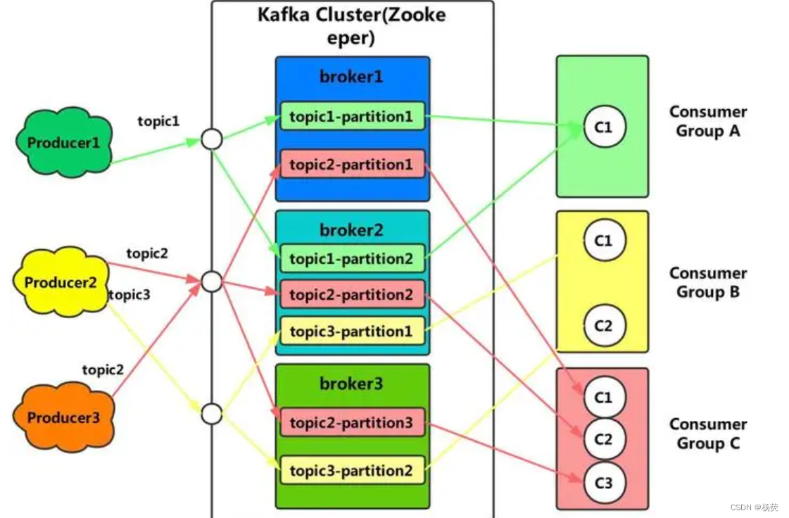

> @Author  : Lewis Tian (taseikyo@gmail.com)
>
> @Link    : github.com/taseikyo
>
> @Range   : 2025-02-23 - 2025-03-01

# Weekly #103

[readme](../README.md) | [previous](202502W3.md) | [next](202503W1.md)


\**Photo by [morefun_boy](https://unsplash.com/@equeen) on [Unsplash](https://unsplash.com/photos/woman-in-brown-coat-with-blue-and-white-face-mask-holding-white-smartphone-d91oY_igQgk)*

> 阶级斗争，一些阶级胜利了，一些阶级消灭了。这就是历史，这就是几千年的文明史。拿这个观点解释历史的就叫做历史的唯物主义，站在这个观点的反面的是历史的唯心主义。 —— 《丢掉幻想，准备斗争》（一九四九年八月十四日），《毛泽东选集》第四卷第一四九一页

## Table of Contents

- [algorithm 🔝](#algorithm-)
- [review 🔝](#review-)
    - [1. kafka 分布式的情况下，如何保证消息的顺序消费?](#1-kafka-分布式的情况下如何保证消息的顺序消费)
        - [一、什么是分布式](#一什么是分布式)
        - [二、kafka 介绍](#二kafka-介绍)
        - [三、消息的顺序消费](#三消息的顺序消费)
        - [四、如何保证消息的顺序消费](#四如何保证消息的顺序消费)
- [tip 🔝](#tip-)
    - [1. put,post,get 的区别](#1-putpostget-的区别)
    - [2. SQL 的五大约束作用、语法、应用场景及举例](#2-sql-的五大约束作用语法应用场景及举例)
    - [3. sublime text 保存时删除行尾空格](#3-sublime-text-保存时删除行尾空格)
- [share 🔝](#share-)
    - [1. 缄默效应](#1-缄默效应)

## algorithm [🔝](#weekly-103)

## review [🔝](#weekly-103)

### 1. [kafka 分布式的情况下，如何保证消息的顺序消费?](https://blog.csdn.net/yangyin1998/article/details/132217720)

#### 一、什么是分布式

分布式是指将计算任务分散到多个计算节点上进行并行处理的一种计算模型。在分布式系统中，多台计算机通过网络互联，共同协作完成任务。每个计算节点都可以独立运行，并且可以相互通和协调。这种分布式的架构可以提高计算能力和可靠性，充分利用集群资源，提高系统的扩展性和灵活性。常见的分布式系统包括分布式数据库、分布式文件系统、分布式计算等。分布式系统用于处理大规模的数据和复杂的计算任务，适用于各种领域，如互联网、云计算、大数据分析等。

#### 二、kafka 介绍

Kafka 是一种高性能、分布式的流式数据平台，由 Apache 基金会开发和维护。它的设计目标是实时、可持久地处理大规模的流式数据。

Kafka 的核心概念是一个分布式的发布 - 订阅消息系统。它以可扩展性和持久性为重点，通过将数据分割成多个分区并存储在多个服务器上来实现高吞吐量和故障容忍性。



Kafka 的架构主要由以下几个关键组件组成：

- Producer（生产者）：负责向 Kafka 的 Topic（主题）发布消息。生产者可以将消息发送到指定的 Topic，并指定消息的键（key），Kafka 将根据键将消息路由到对应的分区。
- Consumer（消费者）：消费者可以订阅一个或多个 Topic，并从分区中消费消息。Kafka 允许多个消费者组（consumer group）共同消费一个 Topic 中的消息，实现高吞吐量和负载均衡。
- Broker（代理）：Kafka 集群中的每个服务器都被称为代理。代理负责存储和处理消息，生产者和消费者与代理进行通信。
- Topic（主题）：消息在 Kafka 中通过主题进行分类和组织。一个主题可以有多个分区，每个分区可以在不同的代理上进行复制，以实现容错性。
- Partition（分区）：主题可以被分割成多个分区，每个分区在磁盘上都有自己的存储空间。分区提供了消息的有序性和并行处理的能力。

Kafka 具有高吞吐量、持久性、可扩展性和容错性的特点，广泛应用于数据处理、实时流处理、日志收集、事件驱动架构等场景。它可以处理海量的数据流，并保证数据的完整性和可靠性。同时，Kafka 提供了一组强大的 API 和工具，使得开发者能够轻松地构建、部署和管理基于 Kafka 的应用程序。

#### 三、消息的顺序消费

Kafka 的消息顺序消费是指消费者按照消息的顺序逐条消费消息的过程。Kafka 的分区（Partition）是消息的基本单位，每个分区中的消息按照顺序进行存储。在一个分区中，消息的顺序是有序的，这意味着先发送的消息会被存储在分区的前部，而后发送的消息会被追加到分区的末尾。

Kafka 通过分区的方式实现消息的顺序性，消费者可以订阅一个或多个分区来消费消息。当消费者从分区中拉取消息时，Kafka 会按照消息在分区中的顺序返回给消费者。这样就保证了消费者将按照消息的顺序进行消费。

需要注意的是，Kafka 的多个分区是并行处理的，每个分区的消息可以独立进行消费。因此，在多个分区并行消费的情况下，消费者之间的消息顺序可能无法保证。但是，对于单个分区的消息消费，Kafka 会确保按照消息的顺序进行消费。

为了实现消息的顺序消费，可以根据业务需求将相关消息发送到同一个分区，并且使用单个消费者实例来消费该分区的消息。这样就可以保证消息在整个分区中按照顺序进行处理。同时，Kafka 还提供了分区器（Partitioner）机制，可以根据消息的键（key）来决定消息被发送到哪个分区，从而进一步控制消息的顺序消费。

#### 四、如何保证消息的顺序消费

在 Java 中，可以使用 Kafka 的消费者 API 来实现消息的顺序消费。以下是几种可以考虑的方法：

单个分区消费：创建一个单独的消费者实例来消费一个分区的消息。这样可以确保在单个分区内的消息按顺序消费。但是需要注意，如果有多个分区，不同分区的消息仍可能以并发方式进行消费。

指定分区消费：通过指定消费者订阅的特定分区，可以确保只消费指定分区的消息。这样，可以通过将相关消息发送到同一个分区来保证消息的顺序消费。

按键分区：Kafka 允许根据消息的键（key）来决定将消息发送到哪个分区。如果消息的键是相同的，Kafka 会将它们发送到同一个分区。因此，可以根据消息的键来保证消息的顺序消费。

无论选择哪种方法，都应该注意以下几点：

- 设置消费者的 max.poll.records 参数，确保每次拉取的消息数量合适，以避免因一次拉取的消息过多而导致处理速度过慢。
- 在消费者处理消息时，确保消息处理的逻辑是线程安全的。
- 监听消费者的 onPartitionsRevoked 事件，以便在重新分配分区时进行必要的清理和准备工作。
- 使用 auto.offset.reset 参数设置消费者的 offset 重置策略，以决定当消费者启动时从哪个 offset 开始消费。

## tip [🔝](#weekly-103)

### 1. [put,post,get 的区别](https://blog.csdn.net/lyj15012351173/article/details/137829848)

PUT、POST 和 GET 是 HTTP 协议中的三种请求方法，它们各自具有不同的特点和适用场景。

PUT 方法主要用于向服务器发送数据，以更新或创建资源。该方法的特点包括：

- 参数传递：PUT 请求会将需要修改或创建的资源作为请求的主体发送给服务器，数据可以以 JSON、XML 或表单等形式进行传输。
- 可覆盖性：PUT 请求具有可覆盖性，即每次发送 PUT 请求，服务器都会使用请求中的数据完全替换原有的资源。如果资源不存在，则会创建新资源。
- 幂等性：PUT 方法具有幂等性，即多次发送相同的 PUT 请求，服务器的状态不会发生变化。
- 安全性：由于 PUT 请求可以修改资源，因此需要进行身份验证来确保请求的安全性。

POST 方法则用于向服务器提交数据进行处理请求（例如提交表单或者上传文件）。该方法的特点包括：

- 非幂等性：POST 方法的请求不具备幂等性，即多次发送相同的 POST 请求可能会导致不同的结果。
- 请求体传数据：POST 方法使用请求体来传递数据，可以发送大量数据，并且可以使用不同的 MIME 类型来传递不同类型的数据，如 JSON、XML 等。

GET 方法主要用于请求数据，即获取服务器上的资源。它的特点包括：

- 幂等性和安全性：GET 方法是幂等的和安全的，因为它只用于获取资源，而不会对服务器上的资源进行修改。
- 可见性：由于 GET 方法的参数出现在 URL 中，因此其他人可以看到这些参数，不适合传递敏感数据，如密码。
- 可缓存性：由于 GET 方法不会对服务器上的资源进行修改，所以响应可以被缓存，以提高效率。
- 长度限制：GET 请求对 URL 的长度有限制，这可能会导致请求失败。

### 2. [SQL 的五大约束作用、语法、应用场景及举例](https://blog.csdn.net/lyj15012351173/article/details/135667908)

SQL 的五大约束包括主键约束（PRIMARY KEY）、唯一性约束（UNIQUE）、外键约束（FOREIGN KEY）、非空约束（NOT NULL）和默认约束（DEFAULT）。

sql 约束的作用：主要是保证数据的完整性、准确性和一致性，从而确保数据库中存储的数据质量。

1. 主键约束（PRIMARY KEY）

确保某列必须要有唯一的标识符。

- 应用场景：用于唯一标识数据库表中的每条记录。
- 注意点：一个表中只能有一个主键，主键列的值必须是唯一的，不能为空。

举例

```SQL
CREATE TABLE Employees (
    EmployeeID int NOT NULL,
    FirstName varchar(50),
    LastName varchar(50),
    BirthDate date,
    PRIMARY KEY (EmployeeID)
);
```

在上述示例中，EmployeeID 被定义为主键，确保每个员工都有一个唯一的标识符。
当表被创建后，可以使用 ALTER TABLE 语句来添加或删除约束

```SQL
--添加
ALTER TABLE 表名   ADD PRIMARY KEY (列名);
--例子：将"user_info"表的"UserID"列设置为主键
ALTER TABLE user_info ADD PRIMARY KEY (UserID);
--删除
ALTER TABLE 表名  DROP  PRIMARY KEY ;
--例子:删除用户表的主键
ALTER TABLE user_info DROP PRIMARY KEY ;
```

2. 唯一性约束（UNIQUE）

唯一性约束确保在非主键列中不输入重复的值。

- 应用场景：用于防止在列中输入重复的值。
- 注意点：唯一性约束允许空值，但当和参与唯一性约束的任何值一起使用时，每列只允许一个空值。
- 举例

```SQL
CREATE TABLE Users (
    UserID int NOT NULL,
    Username varchar(50) NOT NULL,
    Email varchar(100),
    UNIQUE (Username),
    UNIQUE (Email)
);
```

在上述示例中，`Username`和`Email`字段都被定义为唯一约束，确保用户名和电子邮件地址都是唯一的。
    当表被创建后，可以使用 ALTER TABLE 语句来添加或删除约束

```SQL
--添加唯一约束
ALTER TABLE 表名 ADD UNIQUE (列名);
-- 例子
ALTER TABLE user_info ADD UNIQUE (USERID);
-- 删除唯一约束
ALTER TABLE 表名 DROP  KEY 字段名;
-- 例子
ALTER TABLE user_info DROP KEY USERID;
```

3. 外键约束（FOREIGN KEY）

外键约束用于强制参照完整性，提供单个字段或者多个字段的参照完整性。

- 应用场景：用于保证数据库表之间的关系，确保数据表中的数据符合某种引用完整性。
- 注意点：外键列的值必须在被参照表的相应列中有对应的数据。

```SQL
CREATE TABLE Orders (
    OrderID int NOT NULL,
    OrderNumber int NOT NULL,
    CustomerID int,
    PRIMARY KEY (OrderID),
    FOREIGN KEY (CustomerID) REFERENCES Customers(CustomerID)
);
```

`Orders`表中的`CustomerID`字段是一个外键，它引用另一个表`Customers`中的`CustomerID`字段，确保订单与客户的关联关系。

当表被创建后，可以使用 ALTER TABLE 语句来添加或删除约束
```SQL
--添加外键
ALTER TABLE 表名  ADD FOREIGN KEY 约束名(列名) REFERENCES 另一个表名 (列名);
-- 例子
ALTER TABLE user_role ADD FOREIGN KEY user_role_userid (userid) REFERENCES user_info (userid);
-- 删除外键
ALTER TABLE 表名 DROP FOREIGN KEY 约束名;
-- 例子
ALTER TABLE user_role DROP FOREIGN key user_role_userid ;
```

4. 非空约束（NOT NULL）

设置非空约束，该字段不能为空。

- 应用场景：用于确保某列必须有值，不能为 NULL。
- 注意点：非空约束是一种强制性的约束，它要求列中的值必须被指定，不能为 NULL。

```SQL
CREATE TABLE ContactDetails (
    ContactID int NOT NULL,
    Name varchar(100) NOT NULL,
    PhoneNumber varchar(20)
);
```

在上述示例中， `Name` 字段被定义为非空约束，确保联系人的姓名不能为空。

当表被创建后，可以使用 ALTER TABLE 语句来添加或删除约束

```SQL
--添加非空约束
ALTER TABLE 表名 MODIFY 列名 字段类型 NOT NULL;
-- 例子
ALTER TABLE user_info MODIFY userID varchar(64)  NOT NULL;
-- 删除非空约束
ALTER TABLE 表名 MODIFY 列名 字段类型 NULL;
-- 例子
ALTER TABLE user_info MODIFY userID varchar(64) NULL;
```

5. 默认约束（DEFAULT）

该数据的默认值。

- 应用场景：为没有提供输入值的字段或列提供默认值。
- 注意点：默认值必须满足列的数据类型的要求，如果未指定值则会自动使用默认值。

```SQL
CREATE TABLE Products (
    ProductID int NOT NULL,
    ProductName varchar(100),
    Price decimal(10, 2),
    DefaultStock int DEFAULT 0
);
```

在上述示例中， `DefaultStock` 字段被定义为默认约束，其默认值为 0。当插入新产品时，如果没有指定库存数量，则会默认给 0。

当表被创建后，可以使用 ALTER TABLE 语句来添加或删除约束

```SQL
--添加DEFAULT约束
ALTER TABLE 表名 ALTER 字段名  SET DEFAULT 默认值;
-- 例子
ALTER TABLE user_info ALTER CITY  SET DEFAULT '北京';
-- 删除DEFAULT约束
ALTER TABLE 表名 ALTER 字段名 DROP DEFAULT;
-- 例子
ALTER TABLE user_info ALTER CITY DROP DEFAULT;
```

### 3. [sublime text 保存时删除行尾空格](https://blog.csdn.net/liuchaoqi06/article/details/119761510)

打开 sublime text，点击在 Preferences - Settings 打开的用户配置中，加入以下一行：

```json
"trim_trailing_white_space_on_save": true
```

## share [🔝](#weekly-103)

### 1. [缄默效应](https://wiki.mbalib.com/wiki/%E7%BC%84%E9%BB%98%E6%95%88%E5%BA%94)

缄默效应 (the MUM effect)：滥用强迫手段只会招致沉默在人际交往中，做到基本上不使用强迫手段并不难。

在人际交往中，做到基本上不使用强迫手段并不难。人们虽然会在皮鞭面前屈服，可那不过是表面上的服从，内心却充满了反叛、仇恨的复杂感情。不仅在感情上，在日常生活中也存在着正确信息的传播受到限制的现象。对统治者，人们大都愿意挑对方喜欢的、迎合对方的话来说，尽量避免说让对方不快或有可能降低自身价值的话。这就叫 "缄默效应"。

职员在工作上犯了错误后因为害怕上司的威严而保持 "缄默"，这样上司便得不到正确的信息，结果就会因错误得不到及时纠正而造成日后的重大损失。从长远考虑，无论是在感情上还是在工作上都应尽量不使用强制手段。但对于上司或父母、教师等身份的人来说，强制手段不失为一种对下属或晚辈、学生发挥作用的简单快捷的好办法。同时，越是对自己的才干和人格魅力没有信心的人越会行使强制手段，因为他们自认为没有其他行之有效的办法去说服别人。

[readme](../README.md) | [previous](202502W3.md) | [next](202503W1.md)
