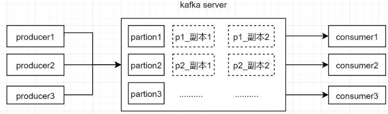
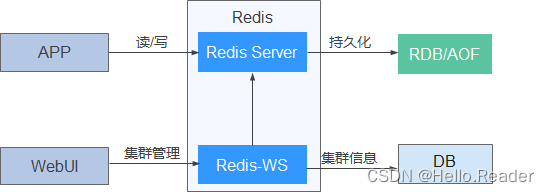
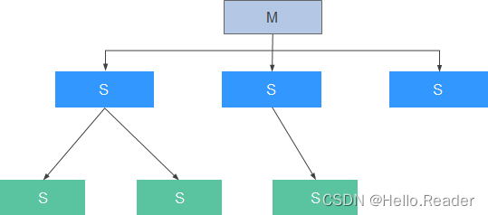
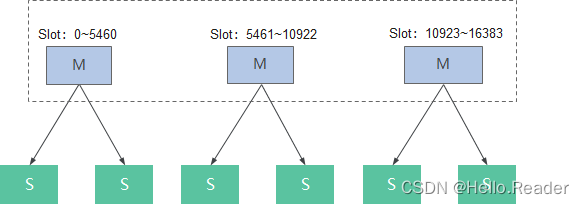

> @Author  : Lewis Tian (taseikyo@gmail.com)
>
> @Link    : github.com/taseikyo
>
> @Range   : 2025-03-02 - 2025-03-08

# Weekly #104

[readme](../README.md) | [previous](202502W4.md) | [next](202503W2.md)


\**Photo by [morefun_boy](https://unsplash.com/@equeen) on [Unsplash](https://unsplash.com/photos/a-woman-in-a-kimono-reaching-up-to-a-cherry-blossom-tree-UlVJyfUZWYs)*

## Table of Contents

- [algorithm 🔝](#algorithm-)
- [review 🔝](#review-)
    - [1. MySQL 的 COUNT 语句 --count (\*)、 count (常量)、 count (列名)](#1-mysql-的-count-语句---count--count-常量-count-列名)
        - [认识 COUNT](#认识-count)
        - [COUNT(列名)、COUNT(常量) 和 COUNT(\*) 之间的区别](#count列名count常量-和-count-之间的区别)
        - [COUNT(\*) 的优化](#count-的优化)
        - [COUNT(\*) 和 COUNT(1)](#count-和-count1)
        - [COUNT(字段)](#count字段)
    - [2. kafka 如何保证消息不丢失](#2-kafka-如何保证消息不丢失)
        - [生产者 (producer) 端处理](#生产者-producer-端处理)
        - [服务器端 (Broker) 端](#服务器端-broker-端)
        - [消费者（Consumer）处理](#消费者consumer处理)
    - [3. Redis 原理剖析](#3-redis-原理剖析)
        - [一、Redis 简介](#一redis-简介)
        - [二、Redis 结构](#二redis-结构)
        - [三、Redis 原理](#三redis-原理)
        - [四、Redis-Data-Sync](#四redis-data-sync)
- [tip 🔝](#tip-)
- [share 🔝](#share-)
    - [1. 泰罗定律](#1-泰罗定律)

## algorithm [🔝](#weekly-104)

## review [🔝](#weekly-104)

### 1. [MySQL 的 COUNT 语句 --count (\*)、 count (常量)、 count (列名)](https://lhrbest.blog.csdn.net/article/details/102658504)

关于数据库中行数统计，无论是 MySQL 还是 Oracle，都有一个函数可以使用，那就是 COUNT

但是，就是这个常用的 COUNT 函数，却暗藏着很多玄机，尤其是在面试的时候，一不小心就会被虐。 不信的话请尝试回答下以下问题：

> 1、COUNT 有几种用法？
>
> 2、COUNT(字段名) 和 COUNT(\*) 的查询结果有什么不同？
>
> 3、COUNT(1) 和 COUNT(\*) 之间有什么不同？
>
> 4、COUNT(1) 和 COUNT(\*) 之间的效率哪个更高？
>
> 5、为什么《阿里巴巴 Java 开发手册》建议使用 COUNT(\*)
>
> 6、MySQL 的 MyISAM 引擎对 COUNT(\*) 做了哪些优化？
>
> 7、MySQL 的 InnoDB 引擎对 COUNT(\*) 做了哪些优化？
>
> 8、上面提到的 MySQL 对 COUNT(\*) 做的优化，有一个关键的前提是什么？
>
> 9、SELECT COUNT(\*) 的时候，加不加 where 条件有差别吗？
>
> 10、COUNT(\*)、COUNT(1) 和 COUNT(字段名) 的执行过程是怎样的？

#### 认识 COUNT

关于 COUNT 函数，在 MySQL 官网中有详细介绍：

简单翻译一下：

- 1、COUNT(expr) ，返回 SELECT 语句检索的行中 expr 的值不为 NULL 的数量。 结果是一个 BIGINT 值。
- 2、如果查询结果没有命中任何记录，则返回 0
- 3、但是，值得注意的是， COUNT(\*) 的统计结果中，会包含值为 NULL 的行数。

```SQL
create table t_count(id int,id2 int);
insert into t_count values(null,null);
insert into t_count values(1,null);
insert into t_count values(null,1);
insert into t_count values(1,null);
insert into t_count values(null,1);
insert into t_count values(1,null);
insert into t_count values(null,null);
select count(*),count(id),count(id2),count(1) from t_count;
```

即以下表记录：

```BASH
root@localhost[lhrdb]> create table t_count(id int,id2 int);
Query OK, 0 rows affected (0.36 sec)
root@localhost[lhrdb]> insert into t_count values(null,null);
Query OK, 1 row affected (0.07 sec)

root@localhost[lhrdb]> insert into t_count values(1,null);
Query OK, 1 row affected (0.06 sec)

root@localhost[lhrdb]> insert into t_count values(null,1);
Query OK, 1 row affected (0.08 sec)

root@localhost[lhrdb]> insert into t_count values(1,null);
Query OK, 1 row affected (0.03 sec)

root@localhost[lhrdb]> insert into t_count values(null,1);
Query OK, 1 row affected (0.05 sec)

root@localhost[lhrdb]> insert into t_count values(1,null);
Query OK, 1 row affected (0.03 sec)

root@localhost[lhrdb]> insert into t_count values(null,null);
Query OK, 1 row affected (0.08 sec)

root@localhost[lhrdb]>
root@localhost[lhrdb]> select * from t_count;
+
| id   | id2  |
+
| NULL | NULL |
|    1 | NULL |
| NULL |    1 |
|    1 | NULL |
| NULL |    1 |
|    1 | NULL |
| NULL | NULL |
+
7 rows in set (0.00 sec)
```

查询结果如下：

```BASH
root@localhost[lhrdb]> select count(*),count(id),count(id2),count(1),count(2) from t_count;

+
| count(*) | count(id) | count(id2) | count(1) | count(2) |
+
|        7 |         3 |          2 |        7 |        7 |
+

1 row in set (0.00 sec)
```

除了 COUNT(id) 和 COUNT(\*) 以外，还可以使用 COUNT(常量) （如 COUNT(1) ）来统计行数，那么这三条 SQL 语句有什么区别呢？ 到底哪种效率更高呢？ 为什么《阿里巴巴 Java 开发手册》中强制要求不让使用 COUNT(列名) 或 COUNT(常量) 来替代 COUNT(\*) 呢？

#### COUNT(列名)、COUNT(常量) 和 COUNT(\*) 之间的区别

前面我们提到过 COUNT(expr) 用于做行数统计，统计的是 expr 不为 NULL 的行数，那么 COUNT(列名) 、 COUNT(常量) 和 COUNT(\*) 这三种语法中，expr 分别是 列名 、 常量 和 \* 。

那么 列名 、 常量 和 \* 这三个条件中， 常量 是一个固定值，肯定不为 NULL。 \* 可以理解为查询整行，所以肯定也不为 NULL，那么就只有 列名 的查询结果有可能是 NULL 了。

所以， COUNT(常量) 和 COUNT(\*) 表示的是直接查询符合条件的数据库表的行数。而 COUNT(列名) 表示的是查询符合条件的列的值不为 NULL 的行数。

除了查询得到结果集有区别之外， COUNT(\*) 相比 COUNT(常量) 和 COUNT(列名) 来讲， COUNT(\*) 是 SQL92 定义的标准统计行数的语法，因为他是标准语法，所以 MySQL 数据库对他进行过很多优化。

SQL92，是数据库的一个 ANSI/ISO 标准。它定义了一种语言（SQL）以及数据库的行为（事务、隔离级别等）。

#### COUNT(\*) 的优化

前面提到了 COUNT(\*) 是 SQL92 定义的标准统计行数的语法，所以 MySQL 数据库对他进行过很多优化。 那么，具体都做过哪些事情呢？

这里的介绍要区分不同的执行引擎。 MySQL 中比较常用的执行引擎就是 InnoDB 和 MyISAM。

MyISAM 和 InnoDB 有很多区别，其中有一个关键的区别和我们接下来要介绍的 COUNT(\*) 有关，那就是 MyISAM 不支持事务，MyISAM 中的锁是表级锁； 而 InnoDB 支持事务，并且支持行级锁。

因为 MyISAM 的锁是表级锁，所以同一张表上面的操作需要串行进行，所以， MyISAM 做了一个简单的优化，那就是它可以把表的总行数单独记录下来，如果从一张表中使用 COUNT(\*) 进行查询的时候，可以直接返回这个记录下来的数值就可以了，当然，前提是不能有 where 条件。

MyISAM 之所以可以把表中的总行数记录下来供 COUNT(\*) 查询使用，那是因为 MyISAM 数据库是表级锁，不会有并发的数据库行数修改，所以查询得到的行数是准确的。

但是，对于 InnoDB 来说，就不能做这种缓存操作了，因为 InnoDB 支持事务，其中大部分操作都是行级锁，所以可能表的行数可能会被并发修改，那么缓存记录下来的总行数就不准确了。

但是，InnoDB 还是针对 COUNT(\*) 语句做了些优化的。

在 InnoDB 中，使用 COUNT(\*) 查询行数的时候，不可避免的要进行扫表了，那么，就可以在扫表过程中下功夫来优化效率了。

从 MySQL 8.0.13 开始，针对 InnoDB 的 SELECT COUNT(\*) FROM tbl_name 语句，确实在扫表的过程中做了一些优化。 前提是查询语句中不包含 WHERE 或 GROUP BY 等条件。

我们知道，COUNT(\*) 的目的只是为了统计总行数，所以，他根本不关心自己查到的具体值，所以，他如果能够在扫表的过程中，选择一个成本较低的索引进行的话，那就可以大大节省时间。

我们知道，InnoDB 中索引分为聚簇索引（主键索引）和非聚簇索引（非主键索引），聚簇索引的叶子节点中保存的是整行记录，而非聚簇索引的叶子节点中保存的是该行记录的主键的值。

所以，相比之下，非聚簇索引要比聚簇索引小很多，所以 MySQL 会优先选择最小的非聚簇索引来扫表。 所以，当我们建表的时候，除了主键索引以外，创建一个非主键索引还是有必要的。

至此，我们介绍完了 MySQL 数据库对于 COUNT(\*) 的优化，这些优化的前提都是查询语句中不包含 WHERE 以及 GROUP BY 条件。

#### COUNT(\*) 和 COUNT(1)

介绍完了 COUNT(\*) ，接下来看看 COUNT(1) ，对于，这二者到底有没有区别，网上的说法众说纷纭。

有的说 COUNT(\*) 执行时会转换成 COUNT(1) ，所以 COUNT(1) 少了转换步骤，所以更快。

还有的说，因为 MySQL 针对 COUNT(\*) 做了特殊优化，所以 COUNT(\*) 更快。

那么，到底哪种说法是对的呢？ 看下 MySQL 官方文档是怎么说的：

> InnoDB handles SELECT COUNT(\*) and SELECT COUNT(1) operations in the same way. There is no performance difference.

画重点： same way , no performance difference 。 所以，对于 COUNT(1) 和 COUNT(\*)，MySQL 的优化是完全一样的，根本不存在谁比谁快！

那既然 COUNT(\*) 和 COUNT(1) 一样，建议用哪个呢？

建议使用 COUNT(\*) ！ 因为这个是 SQL92 定义的标准统计行数的语法，而且本文只是基于 MySQL 做了分析，关于 Oracle 中的这个问题，也是众说纷纭的呢。

#### COUNT(字段)

最后，就是我们一直还没提到的 COUNT(字段)，他的查询就比较简单粗暴了，就是进行全表扫描，然后判断指定字段的值是不是为 NULL，不为 NULL 则累加。

相比 COUNT(\*) ， COUNT(字段) 多了一个步骤就是判断所查询的字段是否为 NULL，所以他的性能要比 COUNT(\*) 慢。

### 2. [kafka 如何保证消息不丢失](https://blog.csdn.net/m0_62645012/article/details/139565489)

Kafka 发送消息是异步发送的，所以我们不知道消息是否发送成功，所以会可能造成消息丢失。而且 Kafka 架构是由生产者 - 服务器端 - 消费者三种组成部分构成的。要保证消息不丢失，那么主要有三种解决方法。



#### 生产者 (producer) 端处理

生产者默认发送消息代码如下：

```JAVA
import org.apache.kafka.clients.producer.Producer;
import org.apache.kafka.clients.producer.KafkaProducer;
import org.apache.kafka.clients.producer.ProducerRecord;
import java.util.Properties;

public class KafkaMessageProducer {

    public static void main(String[] args) {
        // 配置Kafka生产者
        Properties props = new Properties();
        props.put("bootstrap.servers", "localhost:9092"); // Kafka集群地址
        props.put("key.serializer", "org.apache.kafka.common.serialization.StringSerializer"); // 键的序列化器
        props.put("value.serializer", "org.apache.kafka.common.serialization.StringSerializer"); // 值的序列化器

        // 创建Kafka生产者实例
        Producer<String, String> producer = new KafkaProducer<>(props);

        String topic = "test"; // Kafka主题

        try {
            // 发送消息到Kafka
            for (int i = 0; i < 10; i++) {
                String message = "Message " + i;
                ProducerRecord<String, String> record = new ProducerRecord<>(topic, message);
                producer.send(record);
                System.out.println("Sent message: " + message);
            }
        } catch (Exception e) {
            e.printStackTrace();
        } finally {
            // 关闭Kafka生产者
            producer.close();
        }
    }
}
```

生产者端要保证消息发送成功，可以有两个方法：

1. 把异步发送改成同步发送，这样 producer 就能实时知道消息的发送结果。

要将 Kafka 发送方法改为同步发送，可以使用 `send()` 方法的返回值 `Future<RecordMetadata>`， 并调用 `get()` 方法来等待发送完成。

以下是将 Kafka 发送方法改为同步发送的示例代码：

```JAVA
import org.apache.kafka.clients.producer.Producer;
import org.apache.kafka.clients.producer.KafkaProducer;
import org.apache.kafka.clients.producer.ProducerRecord;
import java.util.Properties;
import java.util.concurrent.ExecutionException;
import org.apache.kafka.clients.producer.RecordMetadata;

public class KafkaMessageProducer {

    public static void main(String[] args) {
        // 配置 Kafka 生产者
        Properties props = new Properties();
        props.put("bootstrap.servers", "localhost:9092"); // Kafka 集群地址
        props.put("key.serializer", "org.apache.kafka.common.serialization.StringSerializer"); // 键的序列化器
        props.put("value.serializer", "org.apache.kafka.common.serialization.StringSerializer"); // 值的序列化器

        // 创建 Kafka 生产者实例
        Producer<String, String> producer = new KafkaProducer<>(props);

        String topic = "test"; // Kafka 主题

        try {
            // 发送消息到 Kafka
            for (int i = 0; i < 10; i++) {
                String message = "Message " + i;
                ProducerRecord<String, String> record = new ProducerRecord<>(topic, message);
                RecordMetadata metadata = producer.send(record).get(); // 同步发送并等待发送完成
                System.out.println("Sent message: " + message + ", offset: " + metadata.offset());
            }
        } catch (InterruptedException | ExecutionException e) {
            e.printStackTrace();
        } finally {
            // 关闭 Kafka 生产者
            producer.close();
        }
    }
}
```

在这个示例代码中，通过调用 `send(record).get()` 实现了同步发送，其中 `get()` 方法会阻塞当前线程，直到发送完成并返回消息的元数据。

2. 添加异步回调函数来监听消息发送的结果，如果发送失败，可以在回调函数里重新发送。

要保持发送消息成功并添加回调函数，你可以在发送消息的时候指定一个回调函数作为参数。回调 函数将在消息发送完成后被调用，以便你可以在回调函数中处理发送结果。

```JAVA
import org.apache.kafka.clients.producer.Producer;
import org.apache.kafka.clients.producer.KafkaProducer;
import org.apache.kafka.clients.producer.ProducerRecord;
import java.util.Properties;
import org.apache.kafka.clients.producer.Callback;
import org.apache.kafka.clients.producer.RecordMetadata;

public class KafkaMessageProducer {

    public static void main(String[] args) {
        // 配置 Kafka 生产者
        Properties props = new Properties();
        props.put("bootstrap.servers", "localhost:9092"); // Kafka 集群地址
        props.put("key.serializer", "org.apache.kafka.common.serialization.StringSerializer"); // 键的序列化器
        props.put("value.serializer", "org.apache.kafka.common.serialization.StringSerializer"); // 值的序列化器

        // 创建 Kafka 生产者实例
        Producer<String, String> producer = new KafkaProducer<>(props);

        String topic = "test"; // Kafka 主题

        try {
            // 发送消息到 Kafka
            for (int i = 0; i < 10; i++) {
                String message = "Message " + i;
                ProducerRecord<String, String> record = new ProducerRecord<>(topic, message);

                // 发送消息并指定回调函数
                producer.send(record, new Callback() {
                    @Override
                    public void onCompletion(RecordMetadata metadata, Exception exception) {
                        if (exception == null) {
                            System.out.println("Sent message: " + message + ", offset: " + metadata.offset());
                        } else {
                            // 这里重新发送消息
                            producer.send(record);
                            exception.printStackTrace();
                        }
                    }
                });
            }
        } finally {
            // 关闭 Kafka 生产者
            producer.close();
        }
    }
}
```

在这个示例代码中，我们使用了 `send(record, callback)` 方法来发送消息，并传递了一个实现了 Callback 接口的匿名内部类作为回调函数。当消息发送完成后，回调函数的 `onCompletion()` 方法会被调用。你可以根据 RecordMetadata 和 Exception 参数来处理发送结果。

另外 producer 还提供了一个重试参数，这个参数叫 retries，如果因为网络问题或者 Broker 故障导致 producer 发送消息失败，那么 producer 会根据这个参数的值进行重试发送消息。

#### 服务器端 (Broker) 端

Kafka Broker（服务器端）通过以下方式来确保生产者端消息发送的成功和不丢失：

1. 消息持久化（异步刷盘）：Kafka Broker 将接收到的消息持久化到磁盘上的日志文件中。这样即使在消息发送后发生故障，Broker 能够恢复并确保消息不会丢失。（注意：持久化是由操作系统调度的，如果持久化之前系统崩溃了，那么就因为不能持久化导致数据丢失，但是 Kafka 没提供同步刷盘策略）

2. 复制与高可用性：Kafka 支持分布式部署，可以将消息分布到多个 Broker 上形成一个 Broker 集群。在集群中，消息被复制到多个副本中，以提供冗余和高可用性。生产者发送消息时，它可以将消息发送到任何一个 Broker，然后 Broker 将确保消息在集群中的所有副本中都被复制成功。

3. 消息提交确认：当生产者发送消息后，在收到 Broker 的确认响应之前，生产者会等待。如果消息成功写入并复制到了指定的副本中，Broker 会发送确认响应给生产者。如果生产者在指定的时间内没有收到确认响应，它将会尝试重新发送消息，以确保消息不会丢失。

4. 可靠性设置（同步刷盘）：生产者可以配置一些参数来提高消息发送的可靠性。例如，可以设置 `acks` 参数来指定需要收到多少个 Broker 的确认响应才认为消息发送成功。可以将 `acks` 设置为 `"all"`，表示需要收到所有副本的确认响应才算发送成功。

总之，Kafka Broker 通过持久化和复制机制，以及消息确认和可靠性设置，确保生产者端的消息发送成功且不丢失。同时，应注意及时处理可能的错误情况，并根据生产者端需求和场景合理配置相应的参数。

对于使用 YAML 文件进行 Kafka 配置的情况，你可以按照以下格式设置 acks 参数：

```YAML
# Kafka生产者配置
producer:
  bootstrap.servers: your-kafka-server:9092
  acks: all        # 设置acks参数为"all"
  key.serializer: org.apache.kafka.common.serialization.StringSerializer
  value.serializer: org.apache.kafka.common.serialization.StringSerializer
```

#### 消费者（Consumer）处理

Kafka Consumer 默认会确保消息的至少一次传递（at least once delivery）。这意味着当 Consumer 完成对一条消息的处理后，会向 Kafka 提交消息的偏移量（offset），告知 Kafka 这条消息已被成功处理。如果 Consumer 在处理消息时发生错误，可以通过回滚偏移量来重试处理之前的消息。

以下是一些确保消息消费成功的方法：

- 使用自动提交偏移量（Auto Commit Offsets）
- 手动提交偏移量（Manual Commit Offsets）
- 设置消费者的最大重试次数：
- 设置适当的消费者参数

尽管 Kafka 提供了可靠的消息传递机制，但仍然需要在消费者端实现适当的错误处理和重试逻辑，以处理可能发生的错误情况。

### 3. [Redis 原理剖析](https://blog.csdn.net/weixin_43114209/article/details/132401778)

#### 一、Redis 简介

Redis 是一个开源的，基于网络的，高性能的 key-value 数据库，弥补了 memcached 这类 key-value 存储的不足，在部分场合可以对关系数据库起到很好的补充作用，满足实时的高并发需求。

Redis 跟 memcached 类似，不过数据可以持久化，而且支持的数据类型很丰富。支持在服务器端计算集合的并、交和补集 (difference) 等，还支持多种排序功能。

> 说明： Redis 客户端跟服务端间的网络数据传输未加密，建议不要使用 Redis 存取敏感数据，否则可能存在安全风险。

#### 二、Redis 结构

Redis 包含 Redis Server 与 Redis-WS，如下图所示



- Redis Server：Redis 组件的核心模块，负责 Redis 协议的数据读写、数据持久化、主从复制、集群功能。
- Redis-WS：Redis WebService 管理模块，主要负责 Redis 集群的创建、扩容、减容、查询、删除等操作，集群管理信息存入 DB 数据库。

#### 三、Redis 原理

- Redis 持久化
    - RDB 持久化：可以在指定的时间间隔内生成数据集的时间点快照（point-in-time snapshot）。
    - AOF 持久化：记录服务器执行的所有写操作命令，并在服务器启动时，通过重新执行这些命令来还原数据集。 AOF 文件中的命令全部以 Redis 协议的格式来保存，新命令会被追加到文件的末尾。Redis 还可以在后台对 AOF 文件进行重写，使得 AOF 文件的体积不会超出保存数据集状态所需的实际大小。

Redis 可以同时使用 AOF 持久化和 RDB 持久化。在这种情况下，当 Redis 重启时，它会优先使用 AOF 文件来还原数据集，因为 AOF 文件保存的数据集通常比 RDB 文件所保存的数据集更完整。用户也可以关闭持久化功能，让数据只在服务器运行时存在。

- Redis 运行模式

Redis 实例可以部署在一个或多个节点上，且一个节点上也可以部署一个或多个 Redis 实例（每个节点上 Redis 实例的个数由软件根据节点硬件资源情况计算得出）。

最新版本的 Redis 支持集群功能，可以将多个 Redis 实例组合为一个 Redis 集群，从而对外提供一个分布式 key-value 数据库。集群通过分片（sharding）来进行数据共享，并提供复制和故障转移功能。

单实例模式



- 一个主实例（master）可以对应有多个从实例（slave），从实例本身还可连接从实例。
- 发给主实例的命令请求，主实例会实时同步给从实例进行处理。
- 主实例宕机，从实例不会自动升主。
- 从实例默认只读，在配置了 “slave-read-only” 为 no 时，从实例也可写。但从实例重启后，会从主实例同步数据，之前写入从实例的数据丢失。
- 多层级从实例的结构，相对所有从实例都直接连接在主实例下的结构，由于减少了主实例需要直接同步的从实例个数，一定程度上能提升主实例的业务处理性能。

集群模式



- 多个 Redis 实例组合为一个 Redis 集群，共 16384 个槽位均分到各主实例上。
- 集群中的每个实例都记录有槽位与实例的映射关系，客户端也记录了槽位与实例的映射。客户端根据 key 进行哈希计算，然后和 16384 进行取模运算，得到槽位值。根据槽位 - 实例映射，将消息直接发送到对应实例处理。
- 默认情况，从实例不能读不能写，在线执行 readonly 命令可使从实例可读。
- 主实例故障，由集群中剩余的主实例选举出一个从实例升主，需要半数以上主实例运行状态 “良好” 才能选举。
- cluster-require-full-coverage 配置项指示集群是否要求完整，若配置为 yes，则其中一组主从都故障时，集群状态为故障，整个集群不能处理命令；若配置为 no，则半数以上主实例运行状态 “良好”，集群状态是 “良好”。
- Redis 集群可以进行扩容、减容（新实例加入集群或 Redis 实例退出集群），并进行槽位迁移。

#### 四、Redis-Data-Sync

Redis-Data-Sync 是一个用于主备集群 Redis 服务之间的数据同步工具。该工具从主集群中实时同步逻辑集群内的数据到备集群，在备集群上提供一个主集群中 Redis 服务的数据副本。

## tip [🔝](#weekly-104)

## share [🔝](#weekly-104)

### 1. [泰罗定律](https://wiki.mbalib.com/wiki/%E6%B3%B0%E7%BD%97%E5%AE%9A%E5%BE%8B)

泰罗定律是指在引进最好的制度之后，获得成功的程度就同管理人员的能力、言行一致及其职权受到尊重成正比例。

管理的秘诀在于合理地授权。所谓授权，就是指为帮助下属完成任务，领导者将所属权力的一部分和与其相应的责任授予下属。使领导者能够做领导的事，下属能够做下属的事，这就是授权所应达到的目的。

合理地授权可以使领导者摆脱能够由下属完成的日常任务，自己专心处理重大决策问题，还有助于培养下属的工作能力，有利于提高士气。授权是否合理是区分领导者才能高低的重要标志，正如韩非子所说的那样 "下君尽己之能，中君尽人之力，上君尽人之智"。领导者要成为 "上君"，就必须对下属进行合理地授权。

适当放权既能给下属留下发展自己的空间，又能使管理者抽出更多的时间去督导员工的工作，提高整个团队的工作效率就顺理成章了。

授权并非一蹴可成，不能说一句 "这件事交给你" 就以为完成了授权。授权一事需要授权者和被授权者双方密切的合作，彼此态度诚恳，相互沟通了解。在授权的时候，授权者必须有心理准备，明确授予下属完成任务所必须的权力和责任，使他完全理解自己的任务、权力和责任。做到这些后，就要让接任者依他自己的方式处理事情，不要随意干涉，并且随时给予支持、扶助。合理地授权并非对下属放任自流、撒手不管。授权者要保留监督的权利，在受权者出现不可原谅的错误时，随时取消他的受权资格。

合理的授权，有利于调动下属在工作中的积极性、主动性和创造性，激发下属的工作情绪，增长其才干，使上级领导的思想意图为群体成员所接受。善于授权的企业经理能够创造一种 "领导气候"，使下属在此 "气候" 中自愿从事富有挑战意义的工作。授权可以发现人才，利用人才，锻炼人才，使企业的工作出现一个朝气蓬勃、生龙活虎的局面。

[readme](../README.md) | [previous](202502W4.md) | [next](202503W2.md)
