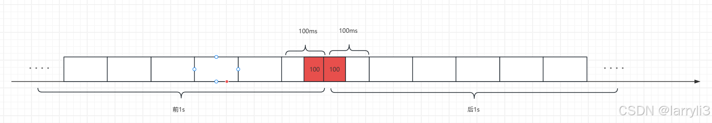

> @Author  : Lewis Tian (taseikyo@gmail.com)
>
> @Link    : github.com/taseikyo
>
> @Range   : 2025-03-09 - 2025-03-15

# Weekly #105

[readme](../README.md) | [previous](202503W1.md) | [next](202503W3.md)


\**Photo by [photo nic](https://unsplash.com/@chiro) on [Unsplash](https://unsplash.com/photos/macro-shot-of-white-veil-H3SStjMB7XY)*

> 什么人站在革命人民方面，他就是革命派，什么人站在帝国主义封建主义官僚资本主义方面，他就是反革命派。什么人只是口头上站在革命人民方面而在行动上则另是一样，他就是一个口头革命派，如果不但在口头上而且在行动上也站在革命人民方面，他就是一个完全的革命派。 —— 在中国人民政治协商会议第一届全国委员会第二次会议上的闭幕词（一九五零年六月二十三日），一九五零年六月二十四日《人民日报》

## Table of Contents

- [algorithm 🔝](#algorithm-)
- [review 🔝](#review-)
    - [1. 《C++11》各种初始化方式的详细列举与对比](#1-c11各种初始化方式的详细列举与对比)
        - [1. C++98/C++03 的初始化方式](#1-c98c03-的初始化方式)
        - [2. C++11 及之后的初始化方式](#2-c11-及之后的初始化方式)
        - [3. 各种初始化方式的对比](#3-各种初始化方式的对比)
        - [4. 深入理解 C++11 及以后的新特性](#4-深入理解-c11-及以后的新特性)
    - [2. 常见软件设计模式介绍：三层架构、MVC、SSM、EDD、DDD](#2-常见软件设计模式介绍三层架构mvcssmeddddd)
        - [三层架构（View Service Dao）](#三层架构view-service-dao)
        - [MVC（Model View Controller）](#mvcmodel-view-controller)
        - [SSM（Spring SpringMVC MyBatis）](#ssmspring-springmvc-mybatis)
        - [EDD（Event Driven Design）](#eddevent-driven-design)
        - [DDD（Domain Driven Design）](#ddddomain-driven-design)
        - [DDD 和 MVC 对比](#ddd-和-mvc-对比)
        - [实体类：VO、DTO、PO、DO、Form](#实体类vodtopodoform)
    - [3. 常见限流算法总结](#3-常见限流算法总结)
        - [一、计数器限流算法](#一计数器限流算法)
        - [二、滑动窗口限流算法](#二滑动窗口限流算法)
        - [三、漏桶算法](#三漏桶算法)
        - [四、令牌桶算法](#四令牌桶算法)
- [tip 🔝](#tip-)
- [share 🔝](#share-)
    - [1. 421 法则](#1-421-法则)

## algorithm [🔝](#weekly-105)

## review [🔝](#weekly-105)

### 1. [《C++11》各种初始化方式的详细列举与对比](https://lizhuo.blog.csdn.net/article/details/144970023)

#### 1. C++98/C++03 的初始化方式

在 C++98 和 C++03 中，主要有以下几种初始化方式：

1. 直接初始化（Direct Initialization）

使用构造函数直接初始化对象。

```C++
int a(5);
std::vector<int> v(5, 1);
```

2. 复制初始化（Copy Initialization）

使用赋值操作符 = 进行初始化。

```C++
int b = 5;
std::vector<int> w = std::vector<int>(5, 1);
```

- 3. 动态初始化（Dynamic Initialization）

使用 `new` 关键字动态分配内存并初始化对象。

```C++
int* p = new int(5);
std::vector<int>* vec = new std::vector<int>(5, 1);
```

4. 列表初始化（List Initialization）

在 C++98/C++03 中并不支持列表初始化，但可以使用初始化列表来初始化数组。

```C++
int arr[5] = {1, 2, 3, 4, 5};
```

#### 2. C++11 及之后的初始化方式

C++11 引入了列表初始化，并对其他初始化方式进行了改进。以下是 C++11 及之后的初始化方式：

1. 列表初始化（List Initialization）

使用大括号 `{}` 来初始化对象。

```C++
int a = {5};
std::vector<int> v = {1, 2, 3};
```

命名列表初始化

可以为元组或结构体的成员命名（C++20 支持）。

```C++
struct Point {
    int x;
    int y;
};

Point p = { .x = 1, .y = 2 };
```

2. 直接初始化（Direct Initialization）

C++11 继续支持直接初始化。

```C++
int a(5);
std::vector<int> v(5, 1);
```

3. 复制初始化（Copy Initialization）

C++11 继续支持复制初始化。

```C++
int b = 5;
std::vector<int> w = {1, 2, 3};
```

4. 动态初始化（Dynamic Initialization）

C++11 继续支持动态初始化。

```C++
int* p = new int(5);
std::vector<int>* vec = new std::vector<int>{1, 2, 3};
```

5. 统一初始化（Uniform Initialization）

C++11 引入的统一初始化方式，使用大括号 `{}`，可以用于所有类型的对象。

```C++
int a{5};
std::vector<int> v{1, 2, 3};
```

6. 初始化类的非静态成员

在类定义中，可以直接使用列表初始化来初始化非静态成员。

```C++
struct Point {
    int x{0};
    int y{0};
};
```

7. 结构体和类的初始化

C++11 允许使用列表初始化来初始化结构体和类。

```C++
struct Point {
    int x;
    int y;
};

Point p{1, 2};
```

#### 3. 各种初始化方式的对比

| 初始化方式 | C++98/C++03 | C++11 及之后 |
|---|---|---|
| 直接初始化 | √ | √ |
| 复制初始化 | √ | √ |
| 动态初始化 | √ | √ |
| 列表初始化 | × | √ |
| 统一初始化 | × | √ |
| 防止窄化转换 | × | √ (仅列表初始化) |
| 初始化类的非静态成员 | × | √ (仅列表初始化) |
| 命名初始化 | × | √ (C++20) |

#### 4. 深入理解 C++11 及以后的新特性

在 C++ 中，特别是 C++11 及以后的版本中，以下几个概念是非常重要的，它们帮助开发者编写更安全和更易于维护的代码。

1. 防止窄化转换

定义：窄化转换（Narrowing Conversion）是指将一个较大范围的类型转换为一个较小范围的类型，这种转换可能会导致数据丢失。例如，将 `double` 转换为 `int`，或者将 `long` 转换为 `short`。

示例：

```C++
double d = 3.14;
int a = d;
```

在 C++11 中，使用列表初始化（如 `{}`）时，编译器会检查是否存在窄化转换。如果存在，编译器会报错，从而防止潜在的数据丢失。

```C++
int a = {3.14};
```

优点：

- 安全性：防止了意外的数据丢失，增强了代码的安全性。
- 可读性：通过编译器的错误提示，开发者可以更清晰地了解潜在的问题。

2. 初始化类的非静态成员

定义：在 C++11 中，可以在类的定义中直接使用列表初始化来初始化非静态成员变量。这种方式使得类的构造更加简洁和直观。

示例：

```C++
struct Point {
    int x{0};
    int y{0};
};

Point p;
```

优点：

- 简洁性：在类定义中直接初始化成员变量，减少了构造函数的复杂性。
- 可读性：使得类的默认状态更加明确，便于理解。

3. 命名初始化

定义：命名初始化（Named Initialization）是指在初始化结构体或类时，可以为成员指定名称。这种特性在 C++20 中得到了正式支持，但在 C++11 中并没有直接的命名初始化语法。

示例（C++20）

```C++
struct Point {
    int x;
    int y;
};

Point p{.x = 1, .y = 2};
```

优点：

- 可读性：通过为成员命名，代码的可读性大大提高，特别是在结构体或类有多个成员时。
- 灵活性：可以在初始化时只指定部分成员，未指定的成员会使用默认值。

注意：在 C++11 中，虽然没有直接的命名初始化语法，但可以通过构造函数或其他方式实现类似的效果。

### 2. [常见软件设计模式介绍：三层架构、MVC、SSM、EDD、DDD](https://blog.csdn.net/footless_bird/article/details/144421357)

#### 三层架构（View Service Dao）

三层架构是指：视图层 view（表现层），服务层 service（业务逻辑层），持久层 Dao（数据访问层）

- 表现层：直接跟前端打交互（一是接收前端 ajax 请求，二是返回 json 数据给前端）
- 业务逻辑层：一是处理表现层转发过来的前端请求（也就是具体业务），二是将从持久层获取的数据返回到表现层。
- 数据访问层：负责数据库的访问（可以访问数据库、二进制文件、文本文件等），是对数据库，而不是对数据的操作，直接操作数据库完成 CRUD，并将获得的数据返回到上一层（也就是业务逻辑层）。

三层架构的出现是为了降低耦合度。

使用面向抽象编程，也就是上层对下层的调用，直接通过接口来完成，而下层对上层的真正服务提供者，是下层实现的接口实现类。实现类是可以更换的，这就实现了层间的解耦合。

实际项目中的包命名结构，其实就是三层架构的体现：


#### MVC（Model View Controller）

MVC 是软件工程中的一种软件架构模式，它是一种分离业务逻辑与显示界面的设计方法，它把软件系统分为三个基本部分：模型（model）、视图（view）、控制器（controller）

MVC 架构提供了一种结构化的方法来开发软件，特别是 Web 应用程序，通过将业务逻辑、用户界面和用户输入分离开来，以提高代码的可重用性、可维护性和可扩展性。

MVC 框架的核心组件：

- 模型（Model）：负责管理数据和业务逻辑，通常包括数据的存取和业务规则的处理。模型与视图和控制器分离，确保数据的完整性和一致性。model 一般分为以下两类：
    - 数据承载 bean：是指专门承载业务数据的实体类，比如 Student，User 等。
    - 业务承载 bean：是指进行业务处理的 Service 或者 Dao 对象，专门处理用户的请求。
- 视图（View）：负责展示数据给用户，通常是通过用户界面呈现。视图从模型中获取数据，但不处理数据。
- 控制器（Controller）：负责处理用户的输入，控制程序的流程。控制器接收用户的请求，调用模型获取数据，然后选择合适的视图来展示数据。

MVC 框架的优势：

- 高内聚低耦合：MVC 框架通过将应用程序分为三个独立的部分，减少了各部分之间的依赖，提高了代码的模块化和重用性。
- 易于维护：由于各个部分职责明确，当需要修改功能时，只需关注相关的部分，不会影响到其他部分。
- 可扩展性：当需要添加新的功能时，可以很容易地在现有架构上添加新的模型、视图或控制器，而不需要重写整个应用程序。

#### SSM（Spring SpringMVC MyBatis）

SSM：即 Spring 、SpringMVC、与 MyBatis 三个框架：
- Spring：以整个应用大管家的身份出现。整个应用中所有 Bean 的生命周期行为，均由 Spring 来管理。即整个应用中所有对象的创建、初始化、销毁，及对象间关联关系的维护，均由 Spring 进行管理。
- SpringMVC：作为 Controller 层的实现者，完成用户的请求接收功能。SpringMVC 的 Controller 作为整个应用的控制器，完成用户请求的转发及对用户的响应。Spring MVC 是主流的 Web 框架。
- MyBatis：作为 Dao 层的实现者，完成对数据库的增、删、改、查功能

#### EDD（Event Driven Design）

事件驱动设计（Event Driven Design，EDD）是一种软件设计范式，其中程序的执行流由外部事件（如用户输入、系统信号、网络数据等）来决定。这种设计方法广泛应用于图形用户界面（GUI）、网络服务器、实时系统等领域，旨在提高系统的响应能力和灵活性。

事件驱动设计是一种强大且灵活的设计模式，特别适用于需要处理大量异步操作和实时数据流的系统。通过解耦组件、提高灵活性和响应性，事件驱动设计可以帮助构建高效、可扩展的应用程序。然而，它也带来了复杂性和调试困难等挑战，需要在设计和实现时仔细权衡。

事件驱动设计的核心要素：

- 事件源（Event Source）：产生事件的对象或系统组件。例如，用户点击按钮、传感器数据更新等。
- 事件（Event）：表示系统中发生的一个有意义的变化或动作。例如，鼠标点击事件、键盘输入事件等。
- 事件队列（Event Queue）：用于存储未处理的事件，确保事件按照发生的顺序被处理。
- 事件监听器（Event Listener）：对特定事件感兴趣的对象，负责处理事件。例如，按钮点击事件的处理函数。
- 事件调度器（Event Scheduler）：负责从事件队列中取出事件并分派给相应的事件监听器。
- 回调函数（Callback Function）：事件发生时，系统会调用预先注册的回调函数来处理事件。

事件驱动设计的优点：

- 提高响应能力：事件驱动设计使得系统能够快速响应外部事件，提高了用户体验。
- 解耦组件：事件驱动设计通过事件和监听器的机制，解耦了事件发送者和接收者之间的联系，使得系统组件更加独立和可重用。
- 简化并发处理：事件驱动设计通常采用单线程的事件循环来处理事件，避免了多线程编程中的复杂性和潜在的死锁问题。
- 易于扩展：由于组件之间的低耦合性，新的组件可以很容易地添加到系统中，只要它们能够产生或处理相应的事件。这使得系统能够方便地适应不断变化的业务需求。

事件驱动设计的应用场景：
- 图形用户界面（GUI）：几乎所有现代 GUI 框架（如 Qt、Java Swing、WPF 等）都采用了事件驱动设计。
- 网络服务器：许多高性能网络服务器（如 Node.js 、Nginx 等）采用事件驱动设计来处理大量的并发连接。
- 游戏开发：游戏中的许多交互和动画效果都依赖于事件驱动设计。
- 嵌入式系统：许多嵌入式系统（如智能家居设备、工业控制系统等）采用事件驱动设计来处理实时事件。

#### DDD（Domain Driven Design）

DDD 是通过 **领域划分** 和 **领域建模** 等一些列手段来控制软件复杂度的方法论，主要是用来指导如何解耦业务系统，划分业务模块，定义业务领域模型及其交互。

开发过程不再以数据模型为起点，而是以领域模型为出发点，领域模型对应业务实体。

程序中主要表现为类、聚合根和值对象，更加关注业务语义的显性化表达，而不是数据的存储和数据之间的关系。

领域驱动的研发过程为：需求分析 ----> 领域分析 ----> 领域建模 ----> 核心业务逻辑 ----> 技术细节（DB、Cache、Message...）

数据驱动的研发过程为：需求分析 ----> 数据建模（ER 图） ----> 建库建表，写 DAO 层 ----> 编写业务逻辑

#### DDD 和 MVC 对比

- DDD 是领域驱动设计，侧重领域拆分，MVC 是软件架构设计，侧重代码拆分。这两个是不同角度描述不同问题的，完全可以协同工作，没有谁替代谁一说。这两者都是通用的跨语言的软件架构思想。
- 现在的微服务都是按照业务拆分的，它们可以拆出来复用，甚至做中台，广义来说也可以算是领域拆分，是一种 DDD 的思想。
- MVC 是技术层面基于分层的软件架构，是一种范式代码分层

#### 实体类：VO、DTO、PO、DO、Form

- VO（View Object）：视图对象，主要对应界面显示的数据对象。对于一个 WEB 页面，或者 SWT、SWING 的一个界面，用一个 VO 对象对应整个界面的值。
- DTO（Data Transfer Object）：数据传输对象，主要用于远程调用等需要大量传输对象的地方。比如一张表有 100 个字段，那么对应的 PO 就有 100 个属性。但是界面上只要显示 10 个字段，客户端用 WEB service 来获取数据，没有必要把整个 PO 对象传递到客户端，这时就可以用只有这 10 个属性的 DTO 来传递结果到客户端，这样也不会暴露服务端表结构。到达客户端以后，如果用这个对象来对应界面显示，那此时它的身份就转为 VO。在这里，泛指用于展示层与服务层之间的数据传输对象。
- DO（Domain Object）：领域对象，就是从现实世界中抽象出来的有形或无形的业务实体。
- PO（Persistent Object）：持久化对象，它跟持久层（通常是关系型数据库）的数据结构形成一一对应的映射关系，如果持久层是关系型数据库，那么，数据表中的每个字段（或若干个）就对应 PO 的一个（或若干个）属性。最形象的理解就是一个 PO 就是数据库中的一条记录，好处是可以把一条记录作为一个对象处理，可以方便的转为其它对象。
- Form ：表单对象，一般用于在 Controller 层接收前端参数。

### 3. [常见限流算法总结](https://blog.csdn.net/mydearlarry/article/details/144171890)

常见的限流算法如下：

- 计数器限流算法
- 滑动窗口限流算法
- 漏桶算法
- 令牌桶算法

#### 一、计数器限流算法

算法概述：定义一个时间窗口和最大的请求数，统计在时间窗口内的请求数量，如果超过了最大请求数就会触发限流。

代码实现：

```JAVA
private final static int MAX_COUNT = 20; //单位时间内允许的最大请求数量
private final static long TIME_WINDOW = 1000L;//单位时间
private long timestamp = System.currentTimeMillis();//当前时间
private int count = 0;


@Override
public synchronized boolean limit() {
    long now = System.currentTimeMillis();
    if(timestamp + TIME_WINDOW > now){
        //在时间窗口内，判断请求数量是否超过限制
        return ++count > MAX_COUNT;
    }else{
        //开启一个新的计数窗口
        timestamp = System.currentTimeMillis();
        count = 1;
    }
    return false;
}
```

问题分析：

这种固定窗口的实现最简单，但是存在的问题也最明显。关键点在于他的窗口是固定的，无法处理在 **窗口边界** 处的流量。假想一下如果请求发生在前一个窗口的后半段和后一个窗口的前半段，他们在各自的窗口内都没有超过最大请求数，但是加在一起可能达到 2N 倍的请求。如下图前 1s 最后请求量 100，后 1s 开始请求量也是 100，他们在各自的窗口内都没有超过 100，但是加在一起达到了 200.



所以这种限流实现，很少用在实际的生产中，他的存在主要是为了引出滑动窗口限流算法。

#### 二、滑动窗口限流算法

算法概述：为了解决固定窗口边界的问题，滑动窗口统计的时间窗口不再是固定的，他会在新的请求到来的时候动态的计算一个时间窗口，也就是 （当前请求时间 - 窗口时间），来实现窗口的动态滑动更新。

这里提供纯 JAVA 和 Redis+Lua 两种实现方式。其中纯 JAVA 实现适用于单体服务，而 Redis 更适用于分布式服务。

1. JAVA 实现

定义一个双端队列 Deque<Long>，队列中存放的是每个请求发生的时间。每当有新的请求发生的时候，先计算当前的窗口（now - TIME_WINDOW），将窗口之外的请求出队。然后再统计窗口内的请求数量是否超过最大值。

```Java
//时间窗口
private final static long TIME_WINDOW = 1000L;
//单位时间内的最大访问量
private final static int MAX_COUNT = 20;
//定义一个队列来放请求
private final Deque<Long> requestQueue = new LinkedList<>();


@Override
public synchronized boolean limit() {
    long now = System.currentTimeMillis();
    long startTime = now - TIME_WINDOW;
    while(!requestQueue.isEmpty() && requestQueue.peekFirst() < startTime){
        //排除在窗口外的请求
        requestQueue.pollFirst();
    }

    int curReqCount = requestQueue.size();
    if (++curReqCount > MAX_COUNT){
        return true;
    }
    requestQueue.addLast(now);
    return false;
}
```

2. Redis 实现

基于 redis 中的 zset 数据结构，原理和上面一样。 每当有请求进来的时候

1. 先计算新窗口，删除窗口前的数据，这里用的是 zremrangeByScore 方法。 其中 score 存的是每个请求的时间 `redis.call('zremrangeByScore', KEYS[1], 0, tonumber(ARGV[2])-tonumber(ARGV[1]))`
2. 判断请求是否超过阈值，如果超过直接拒绝，如果没有就调用 zadd 方法将请求添加的 set 中。
3. 将 redis 操作都封装到 LUA 脚本中，保证了操作的原子性。

```JAVA
@Autowired
private StringRedisTemplate redisTemplate;
//LUA脚本
private static DefaultRedisScript<Long> redisScript;
//时间窗口
private final static long TIME_WINDOW = 1000L;
//单位时间内的最大访问量
private final static int MAX_COUNT = 3;

static {
    redisScript = new DefaultRedisScript<>();
    redisScript.setResultType(Long.class);
    redisScript.setScriptSource(new ResourceScriptSource(new ClassPathResource("limit.lua")));
}

@Override
public boolean limit() {
    //可以根据业务来设定唯一的key
    String key = "UNIQUE_BY_BUSINESS";
    //当前请求时间
    long now = System.currentTimeMillis();
    //value不要直接设置为当前时间戳，高并发的情况下可能导致分数一样，而set集合中重复的元素是会覆盖的，导致统计的请求数少于实际的
    //可以采用雪花算法或者UUID
    //hutool工具类提供的雪花算法
    long value = IdUtil.getSnowflake().nextId();
    try {
        Long res = redisTemplate.execute(redisScript, Collections.singletonList(key), String.valueOf(TIME_WINDOW), String.valueOf(now), String.valueOf(MAX_COUNT), String.valueOf(value));
        return Objects.nonNull(res) && res.intValue() == 1;
    } catch (Exception e) {
        //redis挂了或者lua执行出错了， 需要系统告警，这里先放行
        System.out.println("execute lua fail ====" + e.getCause());
        return false;
    }
}
```

```Lua
--KEYS[1]: key
--ARGV[1]: 窗口
--ARGV[2]: 当前时间戳score
--ARGV[3]: 阈值
--ARGV[4]: scoreValue
--1.删除开始窗口前的数据
redis.call('zremrangeByScore', KEYS[1], 0, tonumber(ARGV[2])-tonumber(ARGV[1]))
--2.统计当前元素数量
local res = redis.call('zcard', KEYS[1])
--3.是否超过阈值
if (res == nil) or (res < tonumber(ARGV[3])) then
    redis.call('zadd', KEYS[1], ARGV[2], ARGV[4])
    redis.call('expire', KEYS[1], tonumber(ARGV[1])/1000)
    return 0
else
    return 1
end
```

#### 三、漏桶算法

漏桶算法，将请求放到一个桶中，桶以固定的速率放出请求，超过桶容量的请求将被拒绝。

- 优点：稳定的流量控制，易于实现。
- 缺点：缺乏弹性，无法应对突发流量。

适用于稳定流量处理，且对突发流量要求不高。比如视频流的传输，以恒定速率进行传输避免卡顿。

#### 四、令牌桶算法

每个请求到的时候会先尝试从令牌桶中获取令牌，如果获取成功放行，失败则限流。令牌以一定的速率添加，可以自己控制添加令牌的速度，使得限流更加平滑。

- 优点：灵活性高，令牌桶算法可以根据实际情况动态调整生成令牌的速率，从而实现较高精度的限流。

比如 Sentinel 中的预热模式限流就是采用令牌桶算法来实现的，适用于系统刚启动的时候需要创建各种资源，此时并发能力相对较差，等后续系统稳定后并发能力会逐渐提升。这时候只要控制开始的时候令牌生成的速度慢一些，等系统稳定后在提升令牌生成速度。

Redisson 和 guava 中都有令牌桶算法的实现，可以直接用

Redisson 实现

```Java
<dependency>
    <groupId>org.redisson</groupId>
    <artifactId>redisson</artifactId>
    <version>3.27.2</version>
</dependency>
```

```Java
//引入redisson客户端
@Bean
public RedissonClient redissonClient(){

    Config config = new Config();
    config.useSingleServer().setAddress("redis://ip:port").setPassword("password");
    return Redisson.create(config);
}


//具体实现
@Autowired
private RedissonClient redissonClient;

private RRateLimiter rateLimiter;
//单位时间内添加令牌的速度
private static final long RATE = 3;
//时间间隔
private static final long INTERVAL = 1;

@PostConstruct
public void init(){
    rateLimiter = redissonClient.getRateLimiter("uniqueKey");
    rateLimiter.setRate(RateType.OVERALL, RATE, INTERVAL, RateIntervalUnit.SECONDS);
}


@Override
public boolean limit() {
    return !rateLimiter.tryAcquire();
}
```

Guava 实现

```Java
<dependency>
    <groupId>com.google.guava</groupId>
    <artifactId>guava</artifactId>
    <version>33.3.1-jre</version>
</dependency>
```

```Java
private RateLimiter rateLimiter;

@PostConstruct
public void init(){
    rateLimiter = RateLimiter.create(3);
}

@Override
public boolean limit() {
    return !rateLimiter.tryAcquire();
}
```

## tip [🔝](#weekly-105)

## share [🔝](#weekly-105)

### 1. [421 法则](https://wiki.mbalib.com/wiki/421%E6%B3%95%E5%88%99)

421 法则，是指市场的 421 法则。有序的市场具备如下特征：在一定的地域范围内，当涉及某一消费领域时，在绝大部分消费者头脑中有几乎相同的品牌排序。在市场占有率上，第一被想到的品牌占 40% 左右，在其他名次上，有近似成倍递减的特点，也就是说第二位和第三位的排序分别占 20% 和 10% 左右。

在这个世界看上去是复杂无序的，但实际上世间万物都有看自己的秩序，它们都是按照自己的规律在不断地发展。

市场也是如此，可能在很多人眼里，市场是个无序的集合体，在市场上面充满了不可预料的事情，很多人感到茫然。

其实，市场也是有序的，当然我们不能否认有些市场的无序性，那是因为它们还不成熟。我们首先来看一看有序市场的相关概念。一个市场如果能够被称为有序市场，会具备如下特征：在一定的地域范围内，当涉及某一消费领域时，在绝大部分消费者头脑中有几乎相同的品牌排序。在市场占有率上，第一被想到的品牌占 40% 左右，在其他名次上，有近似成倍递减的特点，也就是说第二位和第三位的分别占 20% 和 10% 左右，这也就是我们所说的 421 法则。

有序市场的一个重要特点是：一旦形成就具有相对的稳定性。它建立了很高的进入门槛，市场机会相对小，当市场条件不具备的情况下，这个市场几乎不可能再创 “名牌”，这个市场很少打价格战。

[readme](../README.md) | [previous](202503W1.md) | [next](202503W3.md)
