> @Author  : Lewis Tian (taseikyo@gmail.com)
>
> @Link    : github.com/taseikyo
>
> @Range   : 2025-03-16 - 2025-03-22

# Weekly #106

[readme](../README.md) | [previous](202503W2.md) | [next](202503W4.md)


\**Photo by [Xueliang Chen](https://unsplash.com/@neko3000) on [Unsplash](https://unsplash.com/photos/a-woman-sitting-on-a-bench-next-to-a-tree-UtTeNR8pnN4)*

> 在拿枪的敌人被消灭以后，不拿枪的敌人依然存在，他们必然地要和我们作拚死的斗争，我们决不可以轻视这些敌人。如果我们现在不是这样地提出问题和认识问题，我们就要犯极大的错误。 —— 《在中国共产党第七届中央委员会第二次全体会议上的报告》（一九四九年三月五日），《毛泽东选集》第四卷第一四二八页

-[toc]

## algorithm [🔝](#weekly-106)

## review [🔝](#weekly-106)

### 1. [Apache Flink 从入门到放弃——Flink 简介（一）](https://blog.csdn.net/LXWalaz1s1s/article/details/124538461)

#### 1. 计算引擎的发展历史

随着大数据的发展，大数据的存储、计算、运用百花齐放；而大数据的计算中最重要的就是计算引擎，时至今日，很多人将大数据引擎分为四代，分别是：

1. 第一代，Hadoop 承载的 MapReduce，将计算分为 Map 和 Reduce 两个阶段，同时采用 Hadoop 集群的分布式计算原理来实现数据的计算，但是 MapReduce 存在很明显的缺点
	1. 针对多个迭代计算只能用多个 Job 的多次 MapReduce 串联完成
	2. 大量的中间结果要溢写到磁盘，因此存在大量的磁盘交互，效率十分低下；
2. 第二代，带有 DAG（Directed Acyclic Graph 有向无环图）框架的计算引擎，如 Tez 以及调度的 Oozie，在第一代的基础上增加了 DAG，但是运算效率还是达不到许多需求的要求；
3. 第三代，以 Spark 为代表的内存计算引擎，赢得了内存计算的飞速发展，第三代计算引擎的特点是主要不仅 DAG（有向无环图），也以内存为赌注，强调计算的实时性型，是目前批处理的佼佼者，给用户十分友好的体验，一度被人认为要在计算引擎上一统天下的；
4. 随着实时计算需求的迫切性，各种迭代计算的性能以及对流式计算和 SQL 的支持，以 Spark Streming 为例也支持流式计算，而且能解决 99% 的流式计算要求，但是 Spark Streaming 设计理念里面认为流是批的极限，即微批（micro-batch）就是流式，所以有个致命的缺点就是攒批；因为这个缺点的存在，剩下的 1% 的流式运算并不太适合 Spark，而 Flink 就很好的规避了这个缺点，认为批是流的特例，把数据计算归为有界和无界的，有界的数据就是批处理，无界的数据就是流式，而且以流批一体为终极计算目标，Flink 就被归在第四类内，从这里开始时就正式揭开 Flink 的面纱！

#### 2. 什么是 Flink

1、概念

Apache Flink 是一个分布式大数据计算引擎，可以对有界的数据和无界的数据进行有状态的计算，可部署在各种集群环境中，对各种大小数据规模进行快速计算。

Flink 是一个流式大数据处理引擎。而内存执行速度和任意规模，突出了 Flink 的两个特点：速度快、可扩展性强。

框架图：

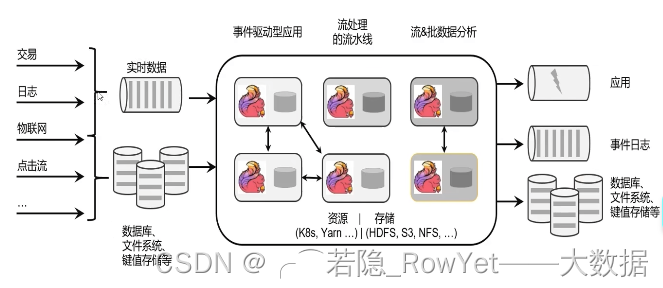

2、什么是有界的数据流和无界数据流？什么是状态？

在 Flink 的设计理念中，将数据分为有界数据和无界数据，如图 2.2；

- 有界数据(Bounded data)：定义了数据的开始和结束，也就是批处理的本质；
- 无界数据(Unbounded data)： 数据定义了开始，但是没有结束，因此需要连续不断的处理计算，如基于事件的有序驱动。

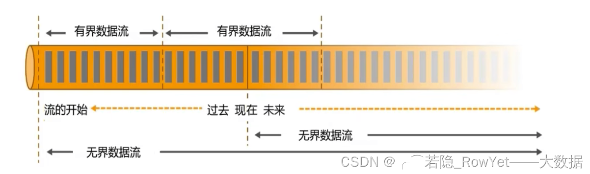

- Flink的状态：Flink 内置的很多算子，包括源 source，数据存储 sink 都是有状态的。在 Flink 中，状态始终与特定算子相关联。Flink 会以checkpoint的形式对各个任务的 状态进行快照，用于保证故障恢复时的状态一致性。Flink 通过状态后端来管理状态 和 checkpoint 的存储，状态后端也可以有不同的配置选择，为什么算子需要状态?

- 实现算子的逻辑（作为一种中间状态）;
- 错误恢复，往往计算并不能一步到位，如果没有记录状态，一旦中单有算子出错，代表整个计算要从头算起。

3、Flink 的特点

Flink 区别与传统数据处理框架的特性如下：

1. 支持java(主)和scala api(真香)，新版本支持python api;
2. 流 (dataStream) 批(dataSet)一体化，支持事件处理和无序处理通过 DataStreamAPI，基于 DataFlow 数据流模型，在不同的时间语义 (事件时间，摄取时间、处理时间) 下支持灵活的窗口(时间，滑动、翻滚，会话，自定义触发器;
3. 支持有状态计算的 Exactly-once(仅处理一次) 容错保证，支持基干轻量级分布式快照 checkpoint 机制实现的容错，支持 savepoints 机制，一般手动触发，在升级应用或者处理历史数据是能够做到无状态丢失和最小停机时间；
4. 兼容 hadoop 的 mapreduce，集成 YARN、HDFS、Hbase 和其它 hadoop 生态系统的组件，支持大规模的集群模式，支持 yarn、mesos。可运行在成千上万的节点上，可以连接到最常用的存储系统，如 Apache Kafka、 Apache Cassandra、Elasticsearch、JDBC、 Kinesis 和（分布式）文件系统，如 HDFS 和 S3。
5. 在 dataSet(批处理)API 中内置支持迭代程序
6. 图处理 (批) 机器学习 (批) 复杂事件处理(流)
7. 自动反压机制加高可用。本身高可用的设置，加上与 K8s，YARN 和 Mesos 的紧密集成，再加上从故障中快速恢复和动态扩展任务的能力，Flink 能做到以极少的停机时间 7x24 全天候运行，能够更新应用程序代码并将作业（jobs）迁移到不同的 Flink 集群，而不会丢失应用程序的状态。
8. 高效的自定义内存管理，结果的准确性， Flink 提供了事件时间（event-time）和处理时间（processing-time）
9. 语义。对于乱序事件流，事件时间语义仍然能提供一致且准确的结果。
10. 健壮的切换能力在 in-memory 和 out-of-core 中
11. 高吞吐和低延迟。每秒处理数百万个事件，毫秒级延迟。

4、Flink 的应用

- 批处理和流处理
- 流数据更真实地反应了我们的生活方式
- 低延时、高吞吐、结果准确和良好的容错性
- 流批一体的终极目标

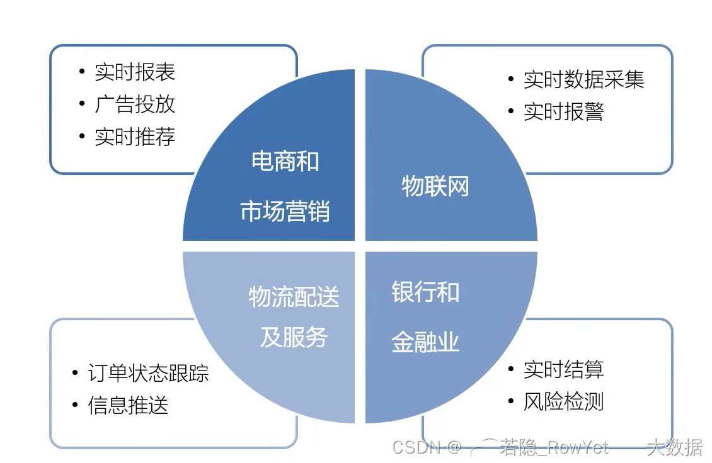

5、流批架构的演变

1. 传统关系型数据的系统架构，如 MySQL、SQL Server 为后台数据库的 OLTP 系统

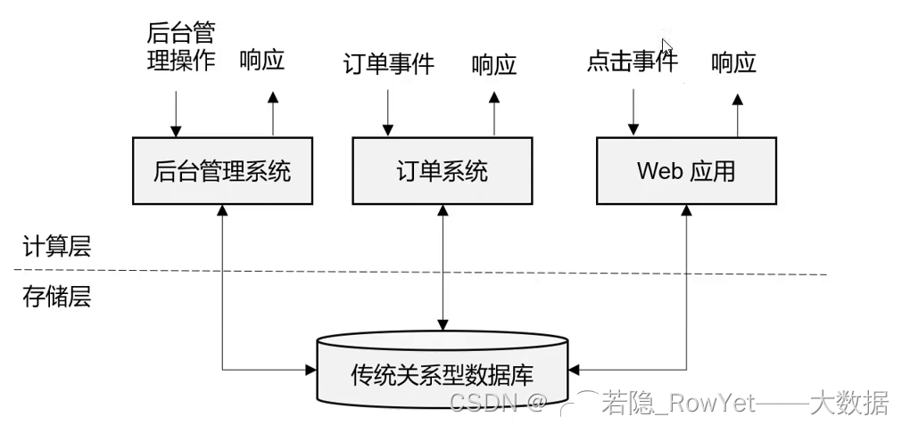

2. 有状态的流处理，因为传统的 OLTP 不太好满足 OLAP 的数据分析而诞生，即将应用逻辑和本地状态存在内存，同时定期存盘持久化，保证数据的不被丢失，此种框架以 storm 为代表，但是也存在必然缺陷，那就是数据在分布式的机器下，因为网络等不稳定因素，无法保证有序和精准的一次性消费。


3. lambda 架构，即用每一段时间的批处理数据刷新最新的数据，而当时最新的数据用流处理来做增量，可以理解为批处理做一次覆盖，流处理做实时增量，因为有批处理的保证，数据最终一致性得到保证，缺点是维护两套架构，工程量比较大；

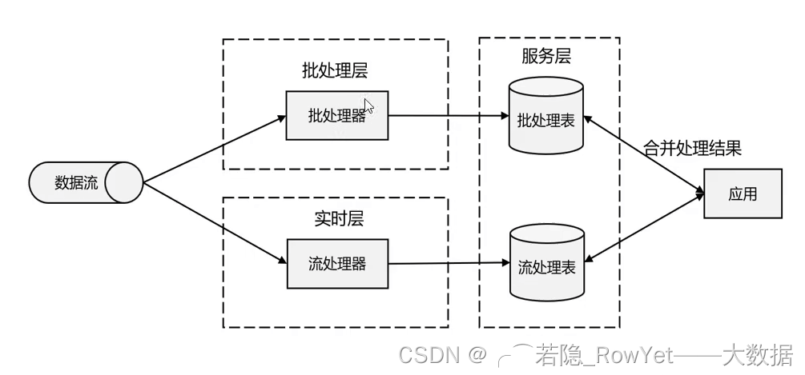

4. 实时数仓框

1）事件驱动型实时数仓，前端运用的事件触发（如点击按钮、扫码等）将关键性的数据变化写入消息队列（kafka，RabbitMQ 等），然后利用 Flink 消费消息队列的数据进行处理，处理后的数据可以持久化存储到各大存储组件内（hive，hbase，hdfs 等），也可以重新写回到消息队列内供下一个运用使用；

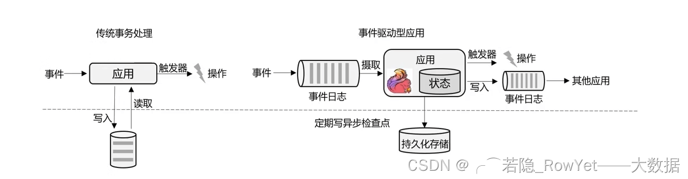

2） 数据分析实时数仓型，主要就是通过根据 OLTP 系统后端数据库的 change log，来实时定期更新至数据数仓的存储媒介（HDFS、Hbase、ElasticSearch、KuDu、ClickHouse）等内，再外接可视化报（apache superset）表实时呈现数据；

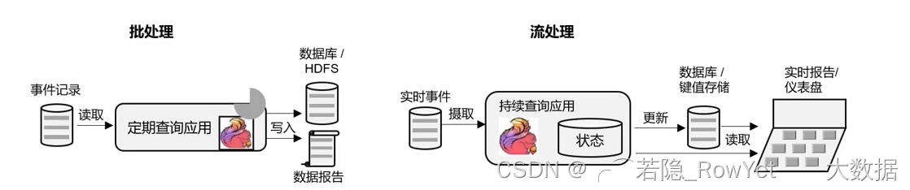

5、Flink 的分层 API

- 越顶层越抽象，表达含义越简明，使用越方便
- 越底层越具体，表达能力越丰富，使用越灵活
- Flink 版本更新迭代最主要原因之一：丰富上层 API 的内容，让 Flink 越来越容易的被使用；

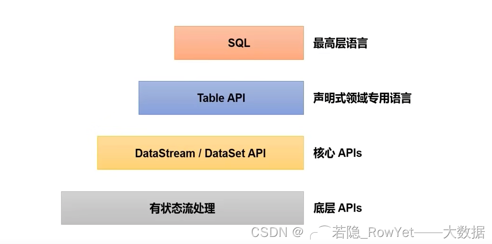

6、Flink VS Spark

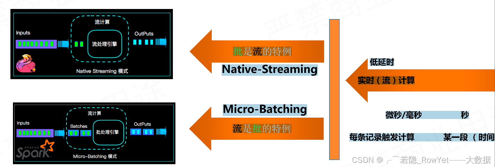

- Spark 认为流是批的特例，采用微批的概念，输入数据流进来后 Spark Stream 将数据切割成一个个微批（Micro-batch）处理；
- Flink 将数据分为有界数据和无界数据，有界的数据就是批处理，无界的数据就是流计算；

- Spark 采用 RDD 模型，Spark Streaming 的 DStream 实际上也就是一组小批数据 RDD 的集合
- Flink 基本数据模型是数据流，以及事件（Event）序列；

- Spark 是批计算，将 DAG 划分为不同的 stage，一个完成后才可以计算下一个；
- Flink 是标准的流执行模式，一个事件在一个节点处理完后可以直接发往下一个节点进行处理。

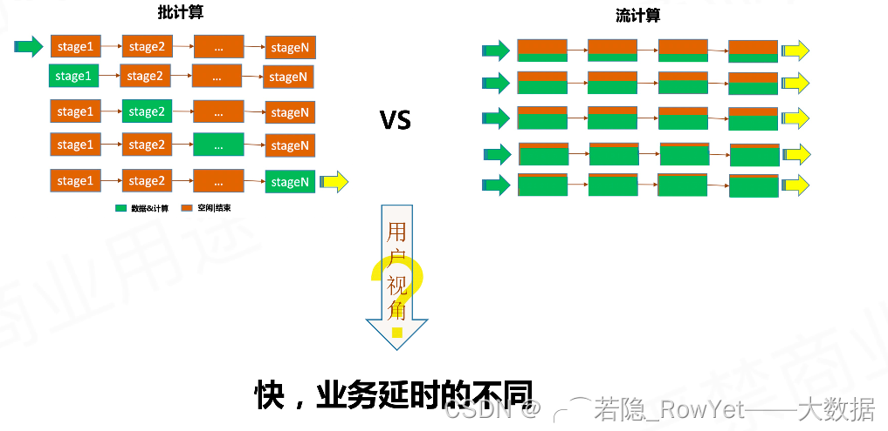

Spark 和 Flink 可以说目前是各擅胜场，批处理领域 Spark 称王，而在流处理方面 Flink 当仁不让。具体到项目应用中，不仅要看是流处理还是批处理，还需要在延迟、吞吐量、可靠性，以及开发容易度、公司 IT 能力等多个方面进行权衡。

那如果现在要学习一门框架的话，优先选 Spark 还是 Flink 呢？其实我们可以看到，不同的框架各有利弊，同时它们也在互相借鉴、取长补短、不断发展，至于未来是 Spark 还是 Flink、甚至是其他新崛起的处理引擎一统江湖，都是有可能的，咱们就且看今日之域中，尽是谁家之天下？

### 2. [Apache Flink 从入门到放弃——快速上手（Java 版）（二）](https://blog.csdn.net/LXWalaz1s1s/article/details/124561252)

#### 1、环境准备和创建项目

- Java(JDK) 1.8
- Flink 1.3.0
- IDEA
- CentOS 7 Or MacOS
- Scala 2.12
- sfl4j 1.7.30

利用IDEA创建Java的Maven项目FlinkTutorial，创建项目时的一些参数填写；

```xml
<name>FlinkTutorial</name>
<groupId>com.rowyet</groupId>
<artifactId>FlinkTutorial</artifactId>
<version>1.0-SNAPSHOT</version>
```

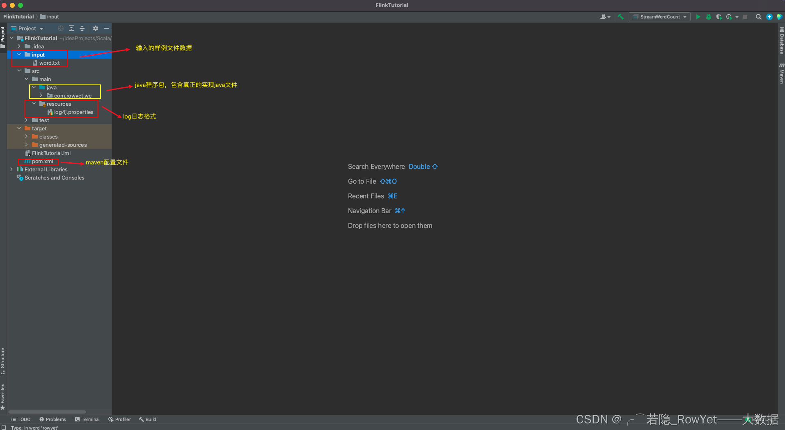

输入的样例文件：项目目录下新建文件夹input，新建一个 txt 文件word.txt，内容如下：

```Markdown
hello world
hello flink
hello java
hello rowyet
```

maven配置文件：pom.xml 内容如下：

```xml
<?xml version="1.0" encoding="UTF-8"?>
<project xmlns="http://maven.apache.org/POM/4.0.0"
         xmlns:xsi="http://www.w3.org/2001/XMLSchema-instance"
         xsi:schemaLocation="http://maven.apache.org/POM/4.0.0 http://maven.apache.org/xsd/maven-4.0.0.xsd">
    <modelVersion>4.0.0</modelVersion>

    <groupId>com.rowyet</groupId>
    <artifactId>FlinkTutorial</artifactId>
    <version>1.0-SNAPSHOT</version>

    <properties>
        <maven.compiler.source>8</maven.compiler.source>
        <maven.compiler.target>8</maven.compiler.target>
        <flink.version>1.13.0</flink.version>
        <java.version>1.8</java.version>
        <scala.banary.version>2.12</scala.banary.version>
        <slf4j.version>1.7.30</slf4j.version>
    </properties>

    <dependencies>
        <!--引入Flink相关的依赖-->
        <!-- https://mvnrepository.com/artifact/org.apache.flink/flink-java -->
        <dependency>
            <groupId>org.apache.flink</groupId>
            <artifactId>flink-java</artifactId>
            <version>${flink.version}</version>
        </dependency>

        <!-- https://mvnrepository.com/artifact/org.apache.flink/flink-streaming-java -->
        <dependency>
            <groupId>org.apache.flink</groupId>
            <artifactId>flink-streaming-java_${scala.banary.version}</artifactId>
            <version>${flink.version}</version>
        </dependency>

        <!-- https://mvnrepository.com/artifact/org.apache.flink/flink-clients -->
        <dependency>
            <groupId>org.apache.flink</groupId>
            <artifactId>flink-clients_${scala.banary.version}</artifactId>
            <version>${flink.version}</version>
        </dependency>

        <!--引入日志相关的依赖-->
        <!-- https://mvnrepository.com/artifact/org.slf4j/slf4j-api -->
        <dependency>
            <groupId>org.slf4j</groupId>
            <artifactId>slf4j-api</artifactId>
            <version>${slf4j.version}</version>
        </dependency>

        <!-- https://mvnrepository.com/artifact/org.slf4j/slf4j-log4j12 -->
        <dependency>
            <groupId>org.slf4j</groupId>
            <artifactId>slf4j-log4j12</artifactId>
            <version>${slf4j.version}</version>
            <type>pom</type>
            <scope>test</scope>
        </dependency>

        <!-- https://mvnrepository.com/artifact/org.apache.logging.log4j/log4j-to-slf4j -->
        <dependency>
            <groupId>org.slf4j</groupId>
            <artifactId>slf4j-log4j12</artifactId>
            <version>${slf4j.version}</version>
        </dependency>
    </dependencies>
</project>
```

log 日志格式：在 resources 下新建日志文件 log4j.propertries，内容如下：

```Markdown
### 设置###
log4j.rootLogger = error,stdout

### 输出信息到控制抬 ###
log4j.appender.stdout = org.apache.log4j.ConsoleAppender
log4j.appender.stdout.layout = org.apache.log4j.PatternLayout
log4j.appender.stdout.layout.ConversionPattern = %-4r [%t] %-5p %c %x -%m%n
```

最后，在 src/main/java 下新建 Java 包 com.rowyet.wc，开始编写 Flink 的练手项目；

#### 2、DataSet API 批处理实现 word count

com.rowyet.wc 包下创建 Java class 文件 BatchWorldCount，内容如下：

```java
package com.rowyet.wc;

import org.apache.flink.api.common.typeinfo.Types;
import org.apache.flink.api.java.ExecutionEnvironment;
import org.apache.flink.api.java.operators.AggregateOperator;
import org.apache.flink.api.java.operators.DataSource;
import org.apache.flink.api.java.operators.FlatMapOperator;
import org.apache.flink.api.java.operators.UnsortedGrouping;
import org.apache.flink.api.java.tuple.Tuple2;
import org.apache.flink.util.Collector;

public class BatchWorldCount {
    public static void main(String[] args) throws Exception {
        // 1. 创建执行环境
        ExecutionEnvironment env = ExecutionEnvironment.getExecutionEnvironment();

        // 2. 从文件中读取数据
        DataSource<String> lineDataSource = env.readTextFile("input/word.txt");

        // 3. 将每行数据进行分词，转换成二元组类型，利用java lambda表达式实现flatMap
        FlatMapOperator<String, Tuple2<String, Long>> wordAndOneTuple = lineDataSource.flatMap((String line, Collector<Tuple2<String, Long>> out) ->
        {
            String[] words = line.split(" ");
            for (String word : words) {
                out.collect(Tuple2.of(word, 1L));
            }
        }).returns(Types.TUPLE(Types.STRING, Types.LONG));

        // 4. 按照word进行分组，利用word的索引0，即第一个元素进行分组
        UnsortedGrouping<Tuple2<String, Long>> wordAndOneGroup = wordAndOneTuple.groupBy(0);

        // 5. 分组内进行聚合统计，根据word分组后的索引1，即第二个元素进行求和
        AggregateOperator<Tuple2<String, Long>> sum = wordAndOneGroup.sum(1);

        // 6. 打印结果
        sum.print();
    }
}
```

运行结果：

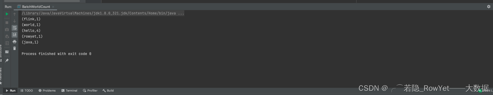

#### 3. DataSet API VS DataStream API

在 Flink 1.12 版本开始，官方就推荐使用 DataSteam API，在提交任务时只需要通过以下 shell 参数指定模式为 BATCH 即可；

```bash
bin/flink run -Dexecution.runtime-mode=BATCH BatchWorldCount.jar
```

如此一来，DataSet API 就已经处于软弃用(soft deprecated)的状态，而且实际应用中只需要维护一套 DataStream API 即可，真正的向 **流批一体** 迈进。

#### 4. DataStream API 流处理实现 word count

1、有界的流处理

com.rowyet.wc 包下创建 Java class 文件 BoundedStreamWordCount，内容如下：

```java
package com.rowyet.wc;

import org.apache.flink.api.common.typeinfo.Types;
import org.apache.flink.api.java.tuple.Tuple2;
import org.apache.flink.streaming.api.datastream.DataStreamSource;
import org.apache.flink.streaming.api.datastream.KeyedStream;
import org.apache.flink.streaming.api.datastream.SingleOutputStreamOperator;
import org.apache.flink.streaming.api.environment.StreamExecutionEnvironment;
import org.apache.flink.util.Collector;

public class BoundedStreamWordCount {
    public static void main(String[] args) throws Exception {
        // 1. 创建流式的执行环境
        StreamExecutionEnvironment env = StreamExecutionEnvironment.getExecutionEnvironment();

        // 2. 读取文件
        DataStreamSource<String> lineDataStreamSource = env.readTextFile("input/word.txt");

        // 3. 转化计算
        SingleOutputStreamOperator<Tuple2<String, Long>> wordAndOneTuple = lineDataStreamSource.flatMap((String line, Collector<Tuple2<String, Long>> out) -> {
                    String[] words = line.split(" ");
                    for (String word : words) {
                        out.collect(Tuple2.of(word, 1L));
                    }
                }
        ).returns(Types.TUPLE(Types.STRING, Types.LONG));

        // 4. 分组
        KeyedStream<Tuple2<String, Long>, String> wordAndOneKeyedStream = wordAndOneTuple.keyBy(data -> data.f0);

        // 5. 求和
        SingleOutputStreamOperator<Tuple2<String, Long>> sum = wordAndOneKeyedStream.sum(1);

        // 6. 打印
        sum.print();

        // 7. 启动执行
        env.execute();


    }
}
```

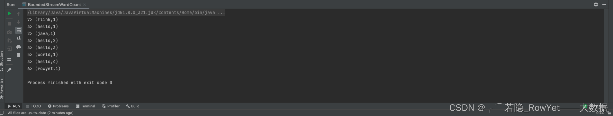

发现跟之前的运行结果有些不一样，具体区别在哪呢？

- 数据出现无序了，而且是来一条处理一条，最终的结果才是准确的结果；
- 结果前面有一个序号，而且相同的 word 序号相同，这是因为Flink最终运行在分布式的集群内，而这个序号是 IDEA 模拟分布式集群，代表你的 CPU 的核数的一个 CPU 序号，博主的 CPU 是 8 核的（可以理解为有 CPU8 个），所以序号不会大于 8，以此类推自己的 CPU 总核数和运行结果，至于为什么相同的 word 序号是一样的，是因为相同的 word 作为分区的 key，最终肯定要在同一个处理器上才可以进行后续的 sum 统计呢。

2、无界的流处理

这里利用 linux 的 netcat 命令监听端口 7777 的连续不断输入的 word 为例，实现无界的流处理 word count 的统计；

com.rowyet.wc 包下创建 Java class 文件 StreamWordCount，内容如下：

```Java
package com.rowyet.wc;

import org.apache.flink.api.common.typeinfo.Types;
import org.apache.flink.api.java.tuple.Tuple2;
import org.apache.flink.api.java.utils.ParameterTool;
import org.apache.flink.streaming.api.datastream.DataStreamSource;
import org.apache.flink.streaming.api.datastream.KeyedStream;
import org.apache.flink.streaming.api.datastream.SingleOutputStreamOperator;
import org.apache.flink.streaming.api.environment.StreamExecutionEnvironment;
import org.apache.flink.util.Collector;


public class StreamWordCount {
    public static void main(String[] args) throws Exception {
        // 1. 创建流式环境
        StreamExecutionEnvironment env = StreamExecutionEnvironment.getExecutionEnvironment();

        // 2. 读取文本流
       // DataStreamSource<String> lineDataSource = env.socketTextStream("127.0.0.1", 7777);  //测试可以写死参数

        //生产中一般，通过main函数后接参数实现
        ParameterTool parameterTool = ParameterTool.fromArgs(args);
        String host = parameterTool.get("host");
        int port = parameterTool.getInt("port");

        // 运行时在菜单栏Run—>Edit Configuration—>Program arguments文本框内填入  --host "127.0.0.1" --port 7777
        DataStreamSource<String> lineDataSource = env.socketTextStream(host, port);


        // 3. 转换处理
        SingleOutputStreamOperator<Tuple2<String, Long>> wordOneTuple = lineDataSource.flatMap((String line, Collector<Tuple2<String, Long>> out) ->
                {
                    String[] words = line.split(" ");
                    for (String word : words) {
                        out.collect(Tuple2.of(word, 1L));
                    }
                }
        ).returns(Types.TUPLE(Types.STRING, Types.LONG));

        // 4. 分组
        KeyedStream<Tuple2<String, Long>, String> wordAndOneKeyedStream = wordOneTuple.keyBy(data -> data.f0);

        // 5. 求和
        SingleOutputStreamOperator<Tuple2<String, Long>> sum = wordAndOneKeyedStream.sum(1);

        // 6. 输出
        sum.print();

        // 7. 启动执行
        env.execute();

    }
}
```

运行：

1. 在某一台 Linux 或者 MacOS 开启netcat命令监听本地7777端口，博主的是本地的 MacOS 终端, 指令是:

```bash
nc -lk 7777
# 回车启动，先不要输入内容
```

2. 启动刚刚写好的 Java Class 文件 StreamWordCount, 暂时看不到任何东西，一直等待输出的空白输出框

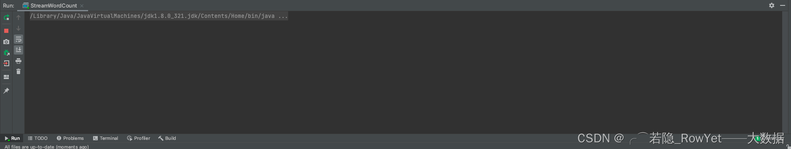


3. 在步骤 1 的 MacOS 终端启动的netcat环境内输入一些聊天消息

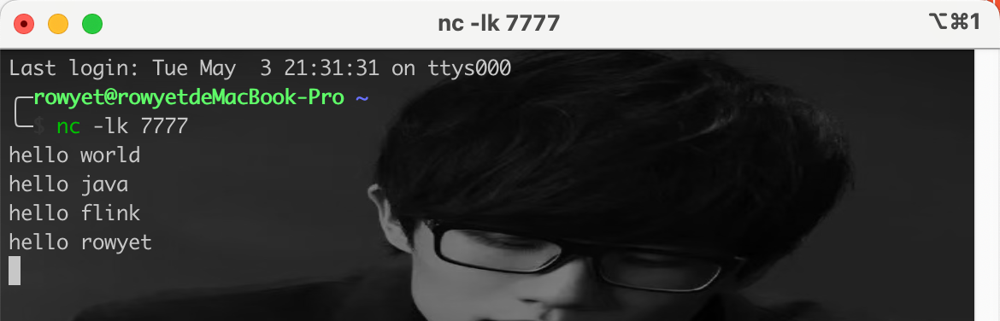

4. 最中在 IDEA 的运行结果内会实时得到运算结果

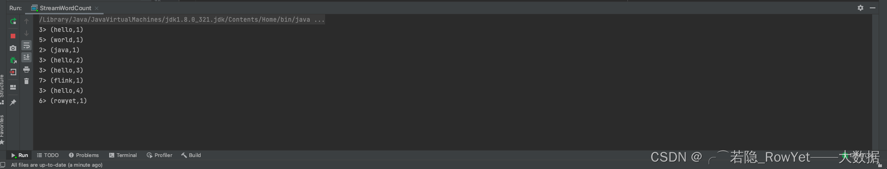

## tip [🔝](#weekly-106)

## share [🔝](#weekly-106)

[readme](../README.md) | [previous](202503W2.md) | [next](202503W4.md)
