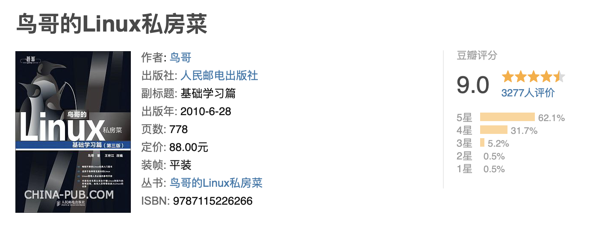

# Weekly #107

@Range: 2025-03-22 - 2025-03-29

@City: Hangzhou

[readme](../README.md) | [previous](202503W3.md) | [next](202504W1.md)

\**Photo by [Chou Wolf](https://unsplash.com/@thezsc) on [Unsplash](https://unsplash.com/photos/a-tree-with-white-flowers-in-front-of-a-building-G4g9UTdBi_8)*

> 帝国主义者和国内反动派决不甘心于他们的失败，他们还要作最后的挣扎。在全国平定以后，他们也还会以各种方式从事破坏和捣乱，他们将每日每时企图在中国复辟。这是必然的，毫无疑义的，我们务必不要松懈自己的警惕性。 —— 在中国人民政治协商会议第一届全体会议上的开幕词（一九四九年九月二十一日），一九四九年九月二十二日《人民日报》

-[toc]

## algorithm [🔝](#weekly-107)

## review [🔝](#weekly-107)

### 1. [搜索引擎技术](https://www.bilibili.com/video/BV1Wr421b7uP)

> 发布时间：2024-04-03

同样也是由 [王树森](https://space.bilibili.com/1369507485) 带来的一门公开课，这门课从工业界的视角讲解现代搜索引擎技术。这是第一节课，解释一些搜索引擎的基本概念，包括查询词 (query)、文档 (document)、查询建议、搜索结果页、曝光、点击、点击率、有点比、通用搜索（通搜）、垂直搜索（垂搜）。

## tip [🔝](#weekly-107)

### 1. [2025年最新超详细大数据学习路线](https://javabetter.cn/xuexiluxian/bigdata.html)

> 发布时间：2025-01-01

#### 关于大数据

- 1991 年，数据仓库改变诞生
- 2005 年，Hadoop 诞生
- 2010 年，数据湖的概念出现
- 201X 年，大数据平台出现
- 2016 年，阿里提出数据中台的概念

大数据处理框架可以分为：

- 数据采集：大数据处理的第一步，第一种是通过 Sqoop 或者 Cannal 等工具进行定时抽取或者实时同步；第二种是各种埋点日志，通过 Flume 进行实时收集。
- 数据存储：大数据处理的第二步，将数据存储到 HDFS 中，实时日志流情况下通过 Kafka 输出给后面的流式计算引擎。
- 数据分析：大数据的核心环节，包括离线处理和流处理两种方式，对应的计算引擎包括 MapReduce、Spark、Flink 等，处理完的结果会保存到已经提前设计好的数据仓库中，或者 HBase、Redis、RDBMS 等各种存储系统上。
- 数据应用：数据可视化、AI 使用等。

#### 大数据的学习路线

Linux 基础

构建工具

Maven，二哥的Java进阶之路上有教程：https://javabetter.cn/maven/maven.html

框架学习

- 日志收集框架：Flume、Logstash、Filebeat
- 分布式文件存储系统：Hadoop HDFS
- 数据库系统：Mongodb、HBase
- 分布式计算框架：
	- 批处理框架：Hadoop MapReduce
	- 流处理框架：Storm
	- 混合处理框架：Spark、Flink
- 查询分析框架：Hive 、Spark SQL 、Flink SQL、 Pig、Phoenix
- 集群资源管理器：Hadoop YARN
- 分布式协调服务：Zookeeper
- 数据迁移工具：Sqoop
- 任务调度框架：Azkaban、Oozie
- 集群部署和监控：Ambari、Cloudera Manager
- 列出的这些主流框架，社区都比较活跃，学习资源也比较丰富。

优质书籍

- 《hadoop 权威指南 (第四版)》 2017 年
- 《Kafka 权威指南》 2017 年
- 《从 Paxos 到 Zookeeper 分布式一致性原理与实践》 2015 年
- 《Spark 技术内幕 深入解析 Spark 内核架构设计与实现原理》 2015 年
- 《HBase 权威指南》 2012 年
- 《Hive 编程指南》 2013 年

视频教程： [尚硅谷](https://space.bilibili.com/302417610/search?keyword=%E5%A4%A7%E6%95%B0%E6%8D%AE)

## share [🔝](#weekly-107)

[readme](../README.md) | [previous](202503W3.md) | [next](202504W1.md)
