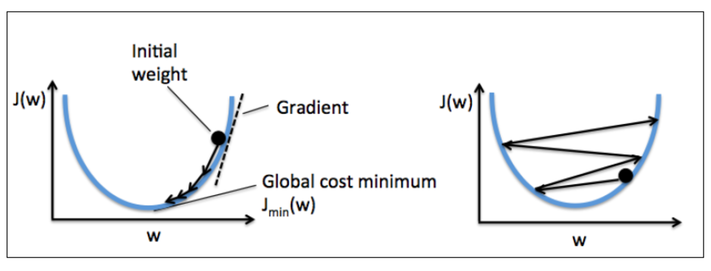

# Weekly #107

@Range: 2025-03-22 - 2025-03-29

@City: Hangzhou

[readme](../README.md) | [previous](202503W3.md) | [next](202504W1.md)

\**Photo by [Chou Wolf](https://unsplash.com/@thezsc) on [Unsplash](https://unsplash.com/photos/a-tree-with-white-flowers-in-front-of-a-building-G4g9UTdBi_8)*

> 帝国主义者和国内反动派决不甘心于他们的失败，他们还要作最后的挣扎。在全国平定以后，他们也还会以各种方式从事破坏和捣乱，他们将每日每时企图在中国复辟。这是必然的，毫无疑义的，我们务必不要松懈自己的警惕性。 —— 在中国人民政治协商会议第一届全体会议上的开幕词（一九四九年九月二十一日），一九四九年九月二十二日《人民日报》

-[toc]

## algorithm [🔝](#weekly-107)

## review [🔝](#weekly-107)

### 1. [搜索引擎技术](https://www.bilibili.com/video/BV1Wr421b7uP)

> 发布时间：2024-04-03

同样也是由 [王树森](https://space.bilibili.com/1369507485) 带来的一门公开课，这门课从工业界的视角讲解现代搜索引擎技术。这是第一节课，解释一些搜索引擎的基本概念，包括查询词 (query)、文档 (document)、查询建议、搜索结果页、曝光、点击、点击率、有点比、通用搜索（通搜）、垂直搜索（垂搜）。

### 2. [不能更简单通俗的机器学习基础名词解释](https://zhuanlan.zhihu.com/p/25862224)

> 发布时间：2017-03-19

#### train? valid? or test?

机器学习最明显的一个特点是需要大量的数据。特别对监督学习来说，就是需要大量的带标签数据（labeled data）。

很多入门的朋友很快就会遇见模型训练和测试这两个阶段，进而也就了解到带标签数据是要被划分成两个部分的：训练集 (training set) 与测试集(test set)。这两个概念也很直观，大部分朋友非常快就能接受。

可是到后面，在我们需要为机器学习模型调参的时候，半路杀出来了个交叉验证 (cross validation) 阶段，这个对应的数据集也有个名字，叫做验证集 (validation set)。

这里我给你们来个非常形象的类比！别眨眼！

训练集 → 题解大全

验证集 → 模拟考试

测试集 → 高考！

机器学习算法是个笨学生，他没法直接从人类教师那里学会抽象的概念，于是唯一有效的策略就是天赋不足勤来补：玩命刷题！ 想想看带标签的训练数据，是不是很像你平时做的习题册呢？ 数据本身是题目，标签是正确答案。所以机器学习算法能够通过大量做题来学会抽象概念。

你说你学会了东西，但空口无凭啊，你得通过考试来证明自己！于是就有了测试集。测试集相当于考试的原因是，你只能看到题目（数据）而无法得知答案（标签）。你只能在交卷之后等老师给你打分。

于是就有朋友发问了：“那我一遍一遍考试来证明自己不就好？我大学挂科补考还少么？”。如果那场考试是高考怎么办？

所以我们需要模拟考试，也就是验证集。我们可以获得验证集的标签，但是我们假装得不到，让自己以考试的心态去面对，过后也就能通过自己对答案来了解自己到底学会了多少，而这种几乎没有成本的考试我们想进行多少次都行！这就是验证集存在的意义！你的模型只能在测试集上面跑一次，一考定终身！

我们需要验证集的真正原因是：防止机器学习算法作弊！我们训练一个机器学习模型不是为了让它在那有限的带标签数据 high 个够，而是要将模型应用于真实世界。绝大多数情况下，我们无法直接从真实世界获得答案，我们能收集到的数据是没有标签的裸数据，我们需要高效准确的机器学习模型为我们提供答案。不能直接使用测试集不是因为我们负担不起在测试集上跑模型的成本（事实上几乎为 0），而是因为我们不能泄露测试集的信息。

试想一下，假如你搞到了真正的高考题和答案，你一遍又一遍地去做这套题目，会发生什么？也许你会成为高考状元，可是你真的学会这些知识了吗？你能够再去做一套高考题并且拿高分吗？你能够去当家教向学弟学妹传授你的知识和解答他们的问题吗？ 偷窥到了测试集的机器学习模型就是废品，没有人需要它，它也做不了任何有用的事情。

切记，你的机器学习模型只能在测试集上跑一次，一考定终身！

#### 过拟合 (overfit) 和欠拟合 (underfit)

过拟合的模型是个真正的书呆子，玩命刷题解大全 (Demidovich)，但是只记住了所有的习题和答案，去做模拟考试就直接傻掉了。

欠拟合的模型就是个不听课还懒惰的学渣，连习题册上的题目都搞不懂，别说模拟考试了。

#### accuracy? precision? recall?

accuracy 就是百分制的考试分数。

这里先说一下 precision 和 recall 哪来的。想象你在做一套全都是判断题的考试题，你的答案总会跟正确答案有些出入。

真阳性、假阳性、假阴性和真阴性

对比上面的表格很容易看出，你做对的题会对应着 真 (True) 这个前缀，对了就对了，不管啦。而你做错的题则带了 假 (False) 的前缀，做错的题分两种：你回答真但答案是假，这是假阳性；你回答为假但是答案为真，则为假阴性。很明显，阳性阴性是对应着你的回答。

假设你有一个大小为 1000 的带布尔标签数据集， 里面的 “真” 样本只有 100 个不到，剩下的都是 “假” 样本。想象你训练了一个模型，不管输入什么数据，它都只给出 “假” 的预测。这显然是个失败模型，也就比停了的钟好一点，但是它在你这个数据上可能能拿到 90 分以上哦？ 很明显，这个时候 accuracy 已经失去它的作用了。

是时候让乱七八糟的概念上场了。

precision

多做多错 少做少错 不做不错

precision 和 recall 一般只在有倾斜数据集的时候出来玩。我们一般把数量较少的样本叫阳性样本，一般情况下我们也只关心阳性样本的预测结果。最常见的倾斜数据例子是癌症检查，得了癌症的不幸的人就是阳性样本，相对于健康的大众，他们是稀少的存在。

$$ precision = \frac{True Positive}{True Positive + False Positive} $$

精确率 等于 真阳性 与 所有被预测为阳性的样本 之比。

为什么说多做多错少做少错的理由很明显了吧？ 如果模型预测为阳性的样本越少，那么它犯错的可能性也就越小，也就是说精确率越高了。

recall

宁可错杀，不能放过

$$ recall = \frac{True Positive}{True Positive + False Negative} $$

召回率 等于 真阳性 与 所有真正的阳性样本 之比

recall 的公式里并没有假阳项，这说明它不关心自己冤枉了多少人，只要假阴的数量越少越好，恐怖分子一定不能漏了。

precision vs recall:

#### learning rate？

学习率通常都会用步子的大小来形象比喻：

步子迈大了容易扯着蛋... 你会得到一个发散思维很强的模型...

步子走得太小啊... 你听说过闪电么？

计算完梯度以后，模型就需要更新它的参数了。loss 函数的梯度指出了一个让 loss 函数提升最快的方向（没错是提升），学习率控制我们应该朝反方向走多远，学习率太大了可能会越过最低点，变得难以收敛甚至会发散。学习率调低一般就能避免走过头 （overshoot） 的问题了，但是调太低会让模型半天不挪窝，于是模型会收敛得很慢。这对小规模的机器学习问题影响不大，但是这个大数据时代是无法接受的。针对当前问题找一个合适的学习率很重要（机器玄学入门第一步），可惜一般只能靠猜靠试，现在有一些能帮你调整的学习率的算法，太超纲就不说了。

## tip [🔝](#weekly-107)

### 1. [2025年最新超详细大数据学习路线](https://javabetter.cn/xuexiluxian/bigdata.html)

> 发布时间：2025-01-01

#### 关于大数据

- 1991 年，数据仓库改变诞生
- 2005 年，Hadoop 诞生
- 2010 年，数据湖的概念出现
- 201X 年，大数据平台出现
- 2016 年，阿里提出数据中台的概念

大数据处理框架可以分为：

- 数据采集：大数据处理的第一步，第一种是通过 Sqoop 或者 Cannal 等工具进行定时抽取或者实时同步；第二种是各种埋点日志，通过 Flume 进行实时收集。
- 数据存储：大数据处理的第二步，将数据存储到 HDFS 中，实时日志流情况下通过 Kafka 输出给后面的流式计算引擎。
- 数据分析：大数据的核心环节，包括离线处理和流处理两种方式，对应的计算引擎包括 MapReduce、Spark、Flink 等，处理完的结果会保存到已经提前设计好的数据仓库中，或者 HBase、Redis、RDBMS 等各种存储系统上。
- 数据应用：数据可视化、AI 使用等。

#### 大数据的学习路线

Linux 基础

构建工具

Maven，二哥的Java进阶之路上有教程：https://javabetter.cn/maven/maven.html

框架学习

- 日志收集框架：Flume、Logstash、Filebeat
- 分布式文件存储系统：Hadoop HDFS
- 数据库系统：Mongodb、HBase
- 分布式计算框架：
	- 批处理框架：Hadoop MapReduce
	- 流处理框架：Storm
	- 混合处理框架：Spark、Flink
- 查询分析框架：Hive 、Spark SQL 、Flink SQL、 Pig、Phoenix
- 集群资源管理器：Hadoop YARN
- 分布式协调服务：Zookeeper
- 数据迁移工具：Sqoop
- 任务调度框架：Azkaban、Oozie
- 集群部署和监控：Ambari、Cloudera Manager
- 列出的这些主流框架，社区都比较活跃，学习资源也比较丰富。

优质书籍

- 《hadoop 权威指南 (第四版)》 2017 年
- 《Kafka 权威指南》 2017 年
- 《从 Paxos 到 Zookeeper 分布式一致性原理与实践》 2015 年
- 《Spark 技术内幕 深入解析 Spark 内核架构设计与实现原理》 2015 年
- 《HBase 权威指南》 2012 年
- 《Hive 编程指南》 2013 年

视频教程： [尚硅谷](https://space.bilibili.com/302417610/search?keyword=%E5%A4%A7%E6%95%B0%E6%8D%AE)

## share [🔝](#weekly-107)

### 1. [马太效应](https://zh.wikipedia.org/zh-cn/%E9%A9%AC%E5%A4%AA%E6%95%88%E5%BA%94)

马太效应（英语：Matthew effect），指科学界的名声累加的一种反馈现象，最早由美国社会学家罗伯特·莫顿于1968年提出。其名称来自于《新约圣经·马太福音》中第13章和一对相似的经文（按才干受责任的比喻）—— 《马太福音》第25章第29节、《路加福音》第19章第11-26节：

“	凡有的，还要加给他，叫他有余；凡没有的，连他所有的也要夺去。	” ——《马太福音》第25章第29节（和合本）

“	因为凡是有的，还要给他，叫他富裕；那没有的，连他所有的，也要由他手中夺去。	” ——《玛窦福音》第25章第29节（思高本）

类似的有道德经“天之道，损有余而补不足。人之道，则不然，损不足以奉有余”。简言之，就是“赢者全拿”效应。

经济学：

马太效应为强者愈强弱者越弱之现象，即是贫者愈贫富者愈富。现实中就是指，只要获得了每一点的成功，就会产生累积优势，使之拥有更大的机会获得更卓越的成就。也是造就了贫富差距的原因之一。

社会心理学：

在教育方面的长期马太效应被运用在心理学家基思·斯塔诺威克的研究中，他曾广泛做了对阅读能力和语言残疾的研究。斯塔诺威克用“马太效应”一词，来形容早期成功获取阅读能力，通常会导致作为学习者成人后的成功这一现象，而如若没有能在头三年或四年中获得阅读能力，将可能造成长期的、学习不同新技能的困难。

儿童在开始阅读方面的落后，也将增加他们与同龄人之间的差距。后来，当学生需要“从阅读中学习”（其中，然后才学习阅读），他们的阅读困难会进一步造成学习大多数其他科目的问题。这样，他们的知识和能力会逐步下降，并进一步在学业上落后，跌幅会比同龄人越发增高。

学生阅读能力愈高，对词汇和世界知识的增长愈快、愈多，这结果进一步提升阅读能力，两者良性地循环；阅读能力愈低，对词汇和世界知识的增长愈慢、愈少，这结果进一步妨碍阅读能力的发展，两者恶性地循环。于是，高阅读能力的儿童，与低阅读能力的儿童，在语文能力、对世界的认识等智能上的表现，差异只会愈来愈大，贫者愈贫，富者愈富，始终无法修补。

因此，如果教师和家长对能力落后的儿童抱持观望，期望他们的阅读能力能随年岁增长而自然赶及，这种想法实在不切实际。

[readme](../README.md) | [previous](202503W3.md) | [next](202504W1.md)
