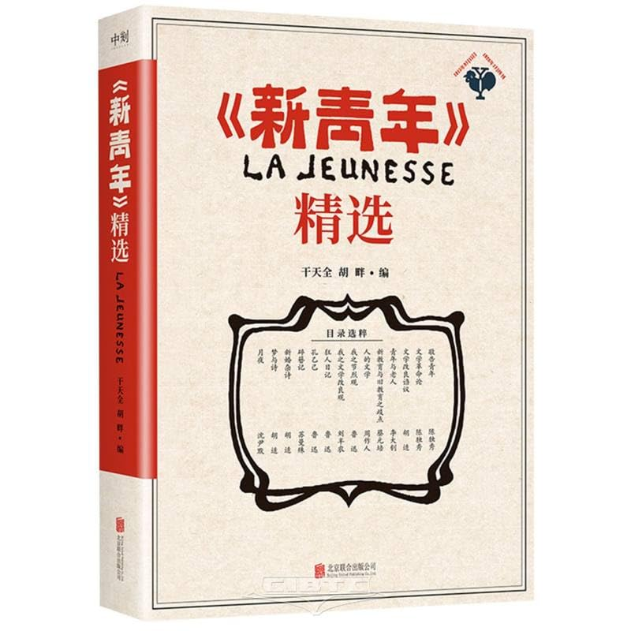
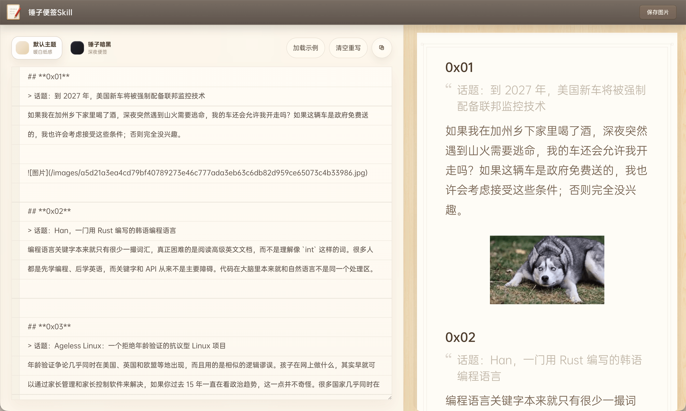

# Weekly #109

@Range : 2026-07-12 - 2026-07-18

@City: Xiaogan

[readme](../README.md) | [previous](202607W2.md) | [next](202607W4.md)

本文总字数 8432 个，阅读时长约：28 分 30 秒，统计数据来自：[汤圆工具箱](https://zishutongji.zaixianapp.cn/)。


\**Photo by [Rowny Law](https://unsplash.com/@rowny520) on [Unsplash](https://unsplash.com/photos/a-woman-holding-a-jar-with-lights-in-it-ly-H0vDRJ4o)*

> 我们还要告诉人民，告诉同志们，道路是曲折的。在革命的道路上还有许多障碍物，还有许多困难。我们党的七次代表大会设想过许多困难，我们宁肯把困难想得更多一些。有些同志不愿意多想困难。但是困难是事实，有多少就得承认多少，不能采取“不承认主义”。我们要承认困难，分析困难，向困难作斗争。世界上没有直路，要准备走曲折的路，不要贪便宜。不能设想，哪一天早上，一切反动派会统统自己跪在地下。总之，前途是光明的，道路是曲折的。我们面前困难还多，不可忽视。我们和全体人民团结起来，共同努力，一定能够排除万难，达到胜利的目的。 ——《关于重庆谈判》（1945年10月17日）

本周最爱 🎵 ：[Always Online](https://music.163.com/#/song?id=108485)

<iframe frameborder="no" border="0" marginwidth="0" marginheight="0" width=330 height=86 src="//music.163.com/outchain/player?type=2&id=108485&auto=1&height=66"></iframe>

## Table of Contents

- [algorithm 🔝](#algorithm-)
    - [1. 合并两个有序数组](#1-合并两个有序数组)
        - [Desc](#desc)
        - [Code](#code)
    - [2. 多数元素](#2-多数元素)
        - [Desc](#desc)
        - [Code](#code)
    - [3. 轮转数组](#3-轮转数组)
        - [Desc](#desc)
        - [Code](#code)
    - [4. 最后一个单词的长度](#4-最后一个单词的长度)
        - [Desc](#desc)
        - [Code](#code)
- [review 🔝](#review-)
    - [1. 脑腐状态：一整套收割注意力的产业复合体](#1-脑腐状态一整套收割注意力的产业复合体)
    - [2. 马克思学说 —— 陈独秀](#2-马克思学说--陈独秀)
        - [（一）剩馀价值](#一剩馀价值)
        - [（二）唯物史观](#二唯物史观)
        - [（三）阶级争斗](#三阶级争斗)
        - [（四）劳工专政](#四劳工专政)
- [tip 🔝](#tip-)
    - [1. 锤子便签Skill](#1-锤子便签skill)
- [share 🔝](#share-)
    - [1. 情绪没有好坏，它是我们对外界的一种反应](#1-情绪没有好坏它是我们对外界的一种反应)

## algorithm [🔝](#weekly-109)

### 1. [合并两个有序数组](https://leetcode.cn/problems/merge-sorted-array/description)

#### Desc

给你两个按 非递减顺序 排列的整数数组 nums1 和 nums2，另有两个整数 m 和 n ，分别表示 nums1 和 nums2 中的元素数目。

请你 合并 nums2 到 nums1 中，使合并后的数组同样按 非递减顺序 排列。

注意：最终，合并后数组不应由函数返回，而是存储在数组 nums1 中。为了应对这种情况，nums1 的初始长度为 m + n，其中前 m 个元素表示应合并的元素，后 n 个元素为 0 ，应忽略。nums2 的长度为 n 。

#### Code

[88.merge-sorted-array.go](../code/leetcode2026/88.merge-sorted-array.go)

> 执行用时分布 0ms 击败 100.00%
>
> 消耗内存分布 4.01MB 击败 85.84%

### 2. [多数元素](https://leetcode.cn/problems/majority-element/description)

#### Desc

给定一个大小为 n 的数组 nums ，返回其中的多数元素。多数元素是指在数组中出现次数 大于 ⌊ n/2 ⌋ 的元素。

你可以假设数组是非空的，并且给定的数组总是存在多数元素。

进阶：尝试设计时间复杂度为 O(n)、空间复杂度为 O(1) 的算法解决此问题。

#### Code

最直白的想法莫过于排序之后取中间的数，本来以为时间会很慢，结果发现还是挺快的

[169.majority-element.go](../code/leetcode2026/169.majority-element.go)

> 执行用时分布 0ms 击败 100.00%
>
> 消耗内存分布 7.98MB 击败 65.22%

但是还有进阶的要求，需要保证时间复杂度是 O(n)，排序显然不满足，真正面试的时候也不会让你用上述排序的方法解，所以还是需要考虑考虑优化解法。

没想出来，还是看评论的，以打擂台赛的思想作为出发点，默认第一个数字为擂主，依次遍历，若下一个元素相同说明胜了一场，否则表示输了一场，若胜负数归零，则下一个数字成为擂主。

由于数组中必有一个数大于一半，所以该数字的胜负数必定大于 0，则用此方法可以选出。

```golang
func majorityElement(nums []int) int {
    var res, count int
    for _, v := range nums {
        if count == 0 {
            res = v
        }
        if res == v {
            count++
        } else {
            count--
        }
    }

    return res
}
```

> 执行用时分布 0ms 击败 100.00%
>
> 消耗内存分布 8.04MB 击败 36.67%

### 3. [轮转数组](https://leetcode.cn/problems/rotate-array/description/)

#### Desc

给定一个整数数组 nums，将数组中的元素向右轮转 k 个位置，其中 k 是非负数。

示例 1:

```
输入: nums = [1,2,3,4,5,6,7], k = 3
输出: [5,6,7,1,2,3,4]
解释:
向右轮转 1 步: [7,1,2,3,4,5,6]
向右轮转 2 步: [6,7,1,2,3,4,5]
向右轮转 3 步: [5,6,7,1,2,3,4] 
```

#### Code

最直观的解法就是新建数组，保存后 k 位，然后复制和移动就完事了。

测试集里面有坑，会出现 k 比数组长度大的情况，我第一次以为大于就是不调整，结果是取模，挺搞的。

[189.rotate-array.go](../code/leetcode2026/189.rotate-array.go)

> 执行用时分布 0ms 击败 100.00%
>
> 消耗内存分布 10.08MB 击败 66.99%

进阶解法是要求使用 O(1) 的存储。

也有一个很直观的想法，用一个变量存储最后一位，然后整体往后调整位置，最后将变量放置在第一位，这样一轮下来就将最后一位调整至最前面，循环 k 次就好了：

```golang
func rotate(nums []int, k int) {
	if k == 0 {
		return
	}
	if k > len(nums) {
		k = k % len(nums)
	}
	for i := 0; i < k; i++ {
		rotateOne(nums)
	}
}

func rotateOne(nums []int) {
	res := nums[len(nums)-1]
	for i := len(nums) - 1; i >= 1; i-- {
		nums[i] = nums[i-1]
	}
	nums[0] = res
}
```

但是这样效率很低：

> 执行用时分布 1880ms 击败 3.57%
>
> 消耗内存分布 10.70MB 击败 5.13%

真正的进阶解法，考虑把整个数字逆序一下，再分别两前后两个部分逆序就好了，非常高效：

```golang
func rotate(nums []int, k int) {
	if k == 0 {
		return
	}
	if k > len(nums) {
		k = k % len(nums)
	}
	reverse(nums, 0, len(nums)-1)
    reverse(nums, 0, k-1)
    reverse(nums, k, len(nums)-1)
}

func reverse(nums []int, l, r int) {
	for l < r {
		tmp := nums[l]
		nums[l] = nums[r]
		nums[r] = tmp
		l++
		r--
	}
}
```

> 执行用时分布 0ms 击败 100.00%
>
> 消耗内存分布 10.32MB 击败 10.64%

### 4. [最后一个单词的长度](https://leetcode.cn/problems/length-of-last-word/description)

#### Desc

给你一个字符串 s，由若干单词组成，单词前后用一些空格字符隔开。返回字符串中 最后一个 单词的长度。

单词 是指仅由字母组成、不包含任何空格字符的最大子字符串。

#### Code

这题也很简单，两次从后往前遍历，第一次找到最后一个单词的最后位置，第二次找到开始位置。

[58.length-of-last-word.go](../code/leetcode2026/58.length-of-last-word.go)

## review [🔝](#weekly-109)

### 1. [脑腐状态：一整套收割注意力的产业复合体](https://jshamsul.com/essays/2026-04-12-brainrot-industrial-complex)

文章存档：[2026-04-12-brainrot-industrial-complex.md](../blog/2026/07/2026-04-12-brainrot-industrial-complex.md)

“脑腐” 早已是年轻人的日常自嘲：长时间刷短视频后头脑空洞，难以沉心阅读，丧失深度思考能力。多数人归咎于自制力差，实则这是一套成熟的 “脑腐产业复合体”。

该概念脱胎于军工复合体，指平台、资本、创作者形成共生利益链，以榨取大众注意力牟利。无限下拉信息流、高刺激短内容、自动循环播放都是刻意设计，精准抓住人空虚、焦虑的情绪，持续刺激多巴胺，用廉价快感填满碎片时间。

从古至今娱乐都会分散人心，但过去的娱乐存在边界。如今互联网 24 小时贴身渗透，将人性弱点商业化。长期被动接收算法投喂的碎片化内容，大脑会适应零思考的低门槛信息，专注力与自省能力持续衰退，这就是 “脑腐” 的本质。分心不再是小毛病，而是思绪被不断撕裂的精神损耗。

普通人无力改变行业规则，但可以自我救赎。首先建立觉察，想刷手机时停顿片刻，分清是主动求知还是逃避空虚；其次远离无目的推荐页，主动筛选信息，减少算法被动投喂；最后刻意留出无电子设备的空白时间，锻炼大脑深度思考的能力。

无限流量模式只是商业选择，并非互联网的唯一形态。平台本可以设计尊重专注力的产品，而非把人当作流量原料。

不必责怪容易分心的自己，你只是被一套消耗心智的体系裹挟。保持清醒，主动掌控信息输入，守住独立思考，才能不被碎片化浪潮吞噬。

### 2. 马克思学说 —— 陈独秀

昨天（7.14）在图书馆找书，不出意外没找到。于是在书架上随机找书，意外的发现了 [《新青年》精选](https://book.douban.com/subject/36473980/) 这本书，看了几篇，其中一篇我觉得不错，于是全文摘录过来：



#### （一）剩馀价值

马克思是一个大经济学者，他的学说代表社会主义的经济学和斯密亚丹代表个人主义的经济学一样，在这一点无论赞成马克思或是反对者都应该一致承认。

马克思底经济学说，和以前个人主义的经济学说不同之特点，是在说明剩馀价值之如何成立及实现。二千几百页的《资本论》里面所反复说明的，可以说目的就是在说明剩馀价值这件事。斯密亚丹也曾说过：“在土地未私有资本未集聚的最初状态，劳动者所生产的东西全属劳动者自已所有。（见《原富》一卷六六页。）又说：“劳动者自己享有全部生产品的最初状态，土地私有资木集聚之后便不行了。”（见《原富》一卷六四页。）这两段明明说因为土地和资本私有底缘故，劳动者不能得著所做的生产品全部分，只得著一部分。那剩馀的部分归了何人呢？照马克思底学说，这就叫做剩馀价值，是归了资本家底荷包，资本家夺取了劳动者底剩馀价值，做为他私有的资本，再生产再掠夺，以次递增，资本是这样集聚起来的，资本制度就是这样发达起来的。话虽这样简单，但是要真实明白剩馀价值是什么，以及他是如何成立如何实现和分配的，本是一件很烦难的事，现在不得不略略说明一下。

要明白马克思所说的剩馀价值是什么，首先要明白马克思所指的价值是什么，其次要明白马克思所说的劳动价值是什么及劳动价值如何定法。斯密亚丹以来的经济学者，对于凡物之价格都分为自然价格（Natural Price）、市场价格（Market Price）两种。剩馀价值所指的价值，是自然价格所表现的抽象价值，不是市场价格所表现的具体价值，我们千万不可弄错。劳动价值也分二种；（一）劳动力自身之价值，即是劳动者每月拿若干工钱把劳动力卖给资本家之价值；（二）劳动生产品之价值，即是劳动者每月做出若干生产品之价值。这两种劳动价值是如何定的呢？照马克思底意思是说；凡两件货物互换，这两件货物一定有什么相同的地方，譬如拿若干布匹换若干面粉，这两样货物形式不同，物理的性质不同，用处不同，他们相同的地方只是都为劳动所作的结果；因此所费劳动相等的货物价值亦相等，用十二小时做成的货物，价值比用六小时做成的货物高一倍，一个茶碗价值二角，一个茶壶价值一元，壶底价值比碗大四倍，是因为做壶所用的劳动比做碗的多四倍。所以马克思说；“一切用劳力所制造的商品（就是货物）之价值，乃是由制造时所需社会的劳动分量而定。（劳动分量，就是劳动时间长短的意思。社会的劳动，是与个别劳动不同的意思；个别劳动有个别勤惰巧拙以及工具精粗的差异，所谓社会的劳动，是指在一定时代的社会状况之下，将这些个别的差异都作为平均程度，因此社会的劳动也叫做平均的劳动）。劳动者把劳动力卖给资本家，因此劳动力自身也是一种商品，所以马克思说：“劳动力这种商品底价值，乃是由培养他所需的劳动分量，也就是制造劳动者及其家族生活品所需的劳动分量而定。”马克思所谓制造一切商品所费的劳动分量，乃是兼“生的劳动”（制造该商品时所费的劳动）和“死的劳动”（制造该商品时所用原料、工具、建筑等以前所费的劳动）二种而言，这也是我们不可忽略的。

马克思的价值及劳动价值公例，略如以上所说，以下再说剩馀价值是什么。

剩馀价值究竟是什么呢？乃是货物的价值与制造这货物所费的价值（兼生的劳动之价值及死的劳动之价值而言）之差额；例如费一万元生产一万五千元的货物，在这货物一万五千元的价值中，除去生产这货物所费一万元的价值，所剩馀的五千元就是剩馀价值。说详细一点，当分为剩馀价值之成立及剩馀价值之实现和分配二部分。

剩馀价值是如何成立的呢？照马克思说：剩馀价值是在生产过程中成立的，不是在流通过程中成立的，这个意思十分重要我们也千万不可弄错。此话怎讲？因为马克思所指出的剩馀价值，虽然要在流通过程中才能够实际归到资本家底荷包，但是夺取底方法和剩馀价值底本质，都不是指流通过程中一件一件生产品的卖价，乃是指生产过程中劳动者为资本察所做“剩馀劳动”的价值。“剩馀劳动”又是什么呢？是因为近代利用机器，制造业底规模一天大似一天，手工的生产品比机器的生产品货色不好价钱又贵，因此手工业一天败似一天。于是由手工工业时代变了机器工业时代，由家庭工业时代变了工厂工业时代，由独立生产时代变了共同生产时代，这就叫作“产业革命”。自产业革命以来，所有生产所必需的工具（土地、矿、房屋、机器、原料等）都为资本家所占有，资本家以外的人，除了将自身底劳动力卖给资本家，便做不成工，便得不著生活费用。资家给他们多少生活费用（即工钱）呢？照马克思的价值公例，一切商品之价值常与制选此商品时所费的劳力相等，劳力（也是一种商品）之价值（即工钱）也常与培养这劳力所需的劳动（即制造劳动者所必需的生活品之劳动）相等那么，譬如一个劳动者每日所需的生活品值六小时的劳动分量，照理他每日做工六小时便已产出他生活品的价值，然而资本家往往要劳动者每日做工十二小时，所给工钱只值六小时的生活品，其余六小时，在实际上劳动者未曾得著工钱，是替资本家白做了，这白做的六小时就叫作“剩馀劳动”；生产品之全部价值都是劳动者做出来的，而劳动者所得只一部分与六小时劳动价值相等的工钱，其余部分由六小时剩馀劳动而生的价值，就叫作“剩佘价值”。

剩馀价值是如何实现和分配的呢？剩馀价值虽然成立在生产过程中，但是必须到了流通过程中才能够实现。资本家雇用劳动者产出一定价值的货物，剩馀价值的本质及作用固然已经包含在这货物之中；然必待将这货物卖给消费者，把这货物底价值变成市场价格，剩馀价值变成货币归到资本家底荷包，这时剩馀价值才算实现。譬如一资本家费价值五成的劳动工钱，造成价值十成的棉纱，这时剩馀价值五成固然已经由剩馀劳动五成在生产过程中成立了，然必待将棉纱卖给消费者，将价值十成的货物变成价格十成的货币归到资木家底荷包，那时五成剩馀价值才算实现了。这是因为生产者不能将货物直接卖给最后消费者，中间必须经过贩卖者之手，贩卖者须得一定资本及劳力之报酬，于是生产者不得不在价值以下的价格卖出他的货物。僻如用价值五成工钱造成价值十成的棉纱，因为贩卖者之报酬，价值十成的棉纱至多只能卖得价格八成的货币，因此五成剩馀价值中，制造棉纱的资本家只能得著三成，其余二成是归了贩卖棉纱的资本家；制造棉纱的资本家若是向他资本家借过资本，便须拿一部分剩馀价值付他资本家的利息；纱厂底地基若是向地主租的，又须拿一部分剩馀价值付地租。剩馀价值大概是如此分配的，各种资本家分配所余才是制造棉纱的资本家实际得著的剩馀价值。所以说：剩馀价值是在生产过程中成立的，是在流通过程中实现的。

资本家底资本是夺取劳动者剩馀价值变成的，剩馀价值是剩馀劳动之价值变成的；工作时间越长，剩馀劳动越加多；工钱越少，剩馀劳动也越加多；出产能力越提高，剩馀劳动也越加多。所以资本家想扩张剩馀价值，天天在那里提高出产能力，天天在那里反对增加工钱反对减少作时间，拿剩馀价值变成货币，又拿货币制造商品增加剩馀价值，再拿剩馀价值变成货币，如此利上生利，这就叫作“资本主义的生产方法”。资本主义的生产营业底规模一天大过一天，掠夺兼并底规模也一天大过一天，加上交通机关一天便利过一天，殖民地新市场一天扩大过一天，精巧的机器一天增多过一天，大银行大公司便一天发达过一天，从前的小工业都跟随著这些制度之发展，逐渐被大工业吸收了压倒了。这种吸收压倒底结果，便是把全社会的资本聚集在少数人手里，这就叫作“资本集中”在从前小工业时代，资本不集中，因此产业不能发达，所以资本集中使生产能力增加产业规模扩大，资本主义的生产方法好过以前的生产方法只在这一点。但是在财产私有制度之下，把全社会的财产大部分集中在少数资本家手里，便自然发生以下各项结果：（一）无财产的佣工渐渐增多（二）生产能力增加而无产佣工的购买能力不能随之增加，因以造成“生产过剩”的结果，生产过剩又必然造成“市场缩小经济恐慌”和“工人失业”两种结果。合起这几项结果，无产佣工的困苦一天比天沉重，而他们的人数却一天比一天增多，他们的团结也就一天比一天庞大，这个随著资本集中产业扩张而集中而扩张的无产阶级，必有团结起来，夺取国家政权，用政权没收一切生产工具为国有，毁灭资本主义生产方法之一日。

象以上所说资本主义的生产方法怎样利用机器对手工业起了产业革命，怎样夺取剩馀价值集中资本，怎样造成大规模的产业组织，同时便造成了大规模的无产阶级，又怎样造成无产阶级对于资本主义革命之危机，这种种历史上经济制度之必然的变化，在马克思学说里叫作“经济的历史观察”，又叫作“唯物的历史观察”。

#### （二）唯物史观

马克思的唯物史观学说虽然没有专书，但是他所著的《经济学批评》、《共产党宣言》、《哲学之贫困》三种书里都曾说明过这项道理。综合上列三书中所说明的唯物史观之要旨有二：

其一说明人类文化之变动。大意是说：社会生产关系之总和为构成社会经济的基础，法律、政治都建筑在这基础上面。一切制度、文物、时代精神的构造都是跟著经济的构造变化而变化的，经济的构造是跟著生活资料之生产方法变化而变化的。不是人的意识决定人的生活，倒是人的社会生活决定人的意识。

其二说明社会制度之变动。大意是说：社会的生产力和社会制度有密切的关系，生产力有变动，社会制度也要跟著变动，因为经济的基础（即生产力）有了变动，在这基础上面的建筑物自然也要或徐或速的革起命来，所以手臼造出了封建诸侯的社会，蒸汽制粉机造出了资本家的社会。一种生产力所造出的社会制虔，当初虽然助长生产力发展，后来生产力发展到这社会制度（即法律经济等制度）不能够容他更发展的程度，那时助长生产力的社会制度反变为生产力之障碍物，这障碍物内部所包涵的生产力仍是发展不已，两下冲突起来，结果，旧社会制度崩坏，新的继起，这就是社会革命；新起的社会制度将来到了不能与生产力适合的时候，他的崩坏亦复如是。但是一个社会制度，非到了生产力在其制度内更无发展之余地时，决不会崩坏。新制度之物质的生存条件，在旧制度的母胎内未完全成立以前，决不能产生，至少也须在成立过程中才能产生。

马克思社会主义所以称为科学的不是空想的，正因为他能以唯物史观的见解，说明资本主义的生产方法和资本主义的社会制度所以成立所以发达所以崩坏，都是经济发展之自然结果，是能够在客观上说明必然的因果，不是在主观上主张当然的理想，这是马克思社会主义和别家空想的社会主义不同之要点。

有人以为马克思唯物史观是一种自然进化说，和他的阶级争斗之革命说未免矛盾。其实马克思的革命说乃指经济自然进化的结果，和空想家的革命说不同；马克思的阶级争斗说乃指人类历史进化之自然现象，并非一种超自然的玄想。所以唯物史观说和阶级争斗说不但不矛盾，并且可以互相证明。

马克思底好友恩格斯曾述说马克思的意见道：“在历史各时代，必然有他的生产分配之特殊方法，又必然由这种特殊方法造出一种社会制度，那时代的政治和文明之历史，都建设在那个基础上面，依据那个基础说明。所以人类全历史是阶级争斗的历史，即是掠夺阶级和被掠夺阶级，压制阶级和被压制阶级对抗的历史。这些阶级争斗的历史相连相续，构成社会进化之阶级，到了现在又达到一种新阶级，被掠夺被压制的阶级（即无产劳动者）要脱离掠夺压制阶级（即绅士、〔军〕阀、资本家）的权力，将自己解放出来；同时还要将一切掠夺压制和阶级差别、阶级争斗完全铲除，永远把社会全体解放出来。”这一段话可以说是把唯物史观说和阶级争斗说打成一片了。

#### （三）阶级争斗

一八四八年马克思和恩格斯共著的《共产党宣言》，是马克思社会主义最重要的书，这书底精髓，正是根据唯物史观来说明阶级争斗的。其中要义有二

（一）一切过去社会底历史都是阶级争斗底历史。例如在古代有贵族与平民，自由民与奴隶；在中世纪有封建领主与农奴，行东与佣工；这些压制阶级与被压制阶级，自来都是站在反对的地位，不断的明争暗斗。封建废了，又发生了近代有产者与无产者这两个阶级新的对抗，新的争斗。

（二）阶级之成立和争斗崩坏都是经济发展之必然结果。例如欧洲在封建时代的工业组织之下，生产事业是由同行组合一手把持的，到了发见了印度、中国等市场和美洲、非洲等殖民地的时候，便不能应付新市场需要底增加了，于是手工工场组织应运而生，各业行东遂被工场制造家所挤倒，接著市场日渐扩大，需要日渐增加，交通机关和交换方法都日渐发展。这时手工工场组织也不能应付了，于是又有蒸汽及大机器出来演成产业革命，从此手工工业又被大规模的近代产业所挤倒，近代的有产阶级便是这样成立的。近代产业建设了世界的市场，有了这些市场商业、航业、陆路交通都跟著发达，这些发达又转而促进产业发达，产业、商业、航业、铁路既这样发达，有产阶级也跟著照样发达，资本越加多，产业越扩大，将中世纪留下的一切阶级都尽情推倒了。由此可知，近代有产阶级乃是长期发达和生产及交换方法叠次革命底结果。由此可知做有产阶级基础的生产和交换方法，是萌芽在封建社会里面，这种生产和交换方法发展到一定地步，封建社会的生产和交换制度（即农业手工封建的制度）便不能和那已经发展的生产力适合，这种制度便成了生产力底障碍物，便必然要崩坏，结局果然崩坏了，封建的制度倒了，自由竞争的制度代之而兴，适合这自由竞争的社会及政治制度也就跟著出现，有产阶级底经济及政治权力也就跟著得到了。有产阶级得势以后，造成了极雄大惊人的生产力（象工业、农业、轮船、铁道、电报、运河等），惹起这般大规模生产及交换的社会，将人口财产及生产机关都集中了，建设了许多都市，将乡村人口移到都市，使乡村屈服在都市支配之下，使多数人民脱离了朴素的乡村生活，使野蛮和未开化国屈服于文明国，农业国屈服于工业国，东洋屈服于西洋。但是到了有产阶级底生产力发展到了与有产阶级社会底制度不适合的时候，社会制度就成了社会生产障碍物，有产阶级及有产阶级社会底制度也是必然要崩坏的崩坏底征兆就是商业上的恐慌，这种慌隔了一定期间便反复发生，一回凶过一回，常常震动有产阶级社会底全部。这恐慌发生底缘故，是由于资本主义的生产方法所造成的生产过剩，是由于有产阶级社会底制度过于狭小，不能包容那过于发展的大生产力。有产阶级救济这种恐慌的方法，不外一面开辟新市场，一而尽量剥削旧市场，这只能救济一时，终是朝著更广大更凶猛的恐慌方面走去，如此，有产阶级颠覆封建制度的武器现在却向著有产阶级自身了。有产阶级不但造成了致自已死亡的武器，还培养了一些使用武器的人，这些人就是近代的劳动阶级，也就是无产阶级。

无产阶级是跟著有产阶级照同一的比例发达起来的，近代产业发展的结果，一般小资产的小商人小工业家，一方面因为他们的专门技能为新生产方法所压倒，一方面因为他们的小资本为大规模的产业所压倒，都不断的降到无产阶级，可是一方面产业愈加发展，一方面无产阶级不但人数愈加增多，而且渐次集中结成大团体，因为生活不安，对于有产阶级渐次增长阶级抵抗底觉悟，发生争斗，始于罢工，终于革命。有产阶级存在根本底条件，是在资本成立及蓄积资本底重要条件，是在工钱制度；工钱制度，全靠劳动相互竞争。但有产阶级既已促进了产业进步，便已经使劳动者从竞争的孤立变成协力的团结了；近代产业发达，使有产阶级的生产及占有之基础从根破坏；有产阶级所造成的首先就是自身的坟墓，有产阶级之倾覆及无产阶级之胜利，都是不能免的事。

马克思说明阶级争斗大略如此，我们实在找不出和唯物史观有矛盾的地方。

#### （四）劳工专政

从前有产阶级和封建制度争斗时，是掌了政权才真实打倒了封建，才完成了争斗之目的；现在无产阶级和有产阶级争斗，也必然要掌握政权利用政权来达到他们争斗之完全目的，这是很明白易解的事。所以马克思在《共产党宣言》里说：

“从前一切阶级一旦得了政权，没有不拼你使社会屈从他们的分配方法，巩固他们已得的地位。”

“有产阶级发达一步，他们政治上的权力也跟著发达一步。……自他们成为有产阶级后，近代代议制度家底政权都被他们一手把持。”

“劳动阶级第一步事业就是必须握得政权。”

“劳动阶级革命，第一步就是使他们跑上权力阶级的地位，也就是民主主义底战胜。既达到第一步，劳动阶级就利用政权渐次夺取资本阶级的一切资本，将一切生产工具集中在国家手里，就是集中在组织为支配阶级的劳动者手里；……其初少不得要用强迫手段对付私有财产和资本家的生产方法，才得达到这种目的。”

“原来政权这样东西不过是一个阶级压制一个阶级一种有组织的权力；劳动者和资本家战斗的时候，迫于情势，自己不能不组织一个阶级，而且不能不用革命的乎段去占领支配阶级的地位，不得不用权力去破坏旧的生产方法。”

他又在所著《法兰西内乱》里说：

“劳动阶级要想达到自己阶级之目的，单靠掌握现存的国家是不成功的。”

他又在所著《哥达纲领批判》里说：

“由资本主义的社会移到社会主义的社会之中间，必然有一个政治的过渡时期。这政治的过渡时期，就是劳工专政。”

1922年7月1日《新青年》第九卷第六号 署名：陈独秀

## tip [🔝](#weekly-109)

### 1. [锤子便签Skill](https://github.com/zhaoolee/notes)

一个锤子便签风格的导出器，支持暖白纸感，深夜便签两个主题。

在线版：https://notes.fangyuanxiaozhan.com/



## share [🔝](#weekly-109)

### 1. [情绪没有好坏，它是我们对外界的一种反应](https://www.bilibili.com/video/BV18x411s7rv?p=2)

这是曾仕强的《情绪管理》公开课，看了前两节课，做了一个简单总结。

情绪管理是人生的必修课。人不可能完全没有情绪，但关键在于学会合理疏导、掌控自我，别拿他人的过错消耗、惩罚自己。

情绪本身并无好坏之分，只是我们面对外界刺激生出的本能反应，随之而来会产生喜悦、愤怒等主观感受，也容易催生冲动行为。不妨把情绪当作提醒自己的信号，在行动前多一分斟酌，三思而后行。

[readme](../README.md) | [previous](202607W2.md) | [next](202607W4.md)
