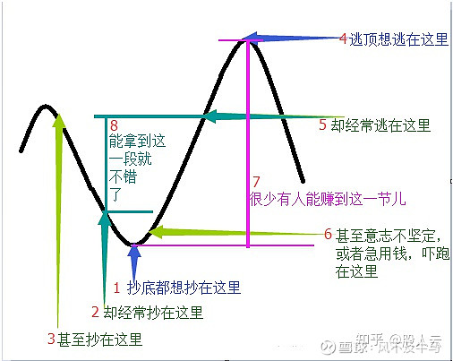
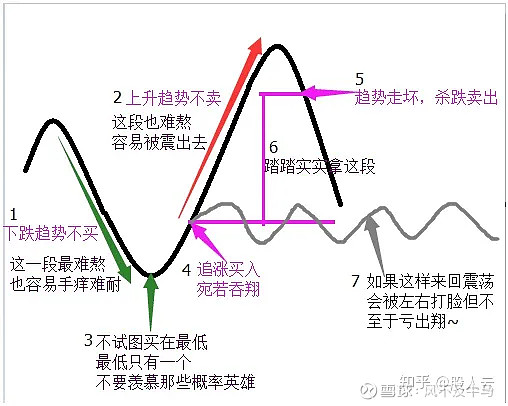
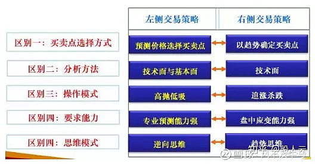

# Weekly #110

@Range : 2026-07-19 - 2026-07-25

@City: Xiaogan

[readme](../README.md) | [previous](202607W3.md) | [next](202607W5.md)


\**Photo by [Rowny Law](https://unsplash.com/@rowny520) on [Unsplash](https://unsplash.com/photos/woman-in-white-long-sleeve-shirt-standing-near-body-of-water-during-night-time-oSUyQY1Pf1g)*

-[toc]

## algorithm [🔝](#weekly-110)

### 1. [字母异位词分组](https://leetcode.cn/problems/group-anagrams/description)

#### Desc

给你一个字符串数组，请你将 字母异位词 组合在一起。可以按任意顺序返回结果列表。

示例 1:

输入: strs = ["eat", "tea", "tan", "ate", "nat", "bat"]

输出: [["bat"],["nat","tan"],["ate","eat","tea"]]

解释：

- 在 strs 中没有字符串可以通过重新排列来形成 "bat"。
- 字符串 "nat" 和 "tan" 是字母异位词，因为它们可以重新排列以形成彼此。
- 字符串 "ate" ，"eat" 和 "tea" 是字母异位词，因为它们可以重新排列以形成彼此。

#### Code

[49.group-anagrams](../code/leetcode2026/group-anagrams)

> 执行用时分布 13ms 击败 27.16%
>
> 消耗内存分布 9.14MB 击败 89.04%

## review [🔝](#weekly-110)

## tip [🔝](#weekly-110)

### 1. Git HTTP 代理与 SSH 代理原理说明

> 注：解决方案来自 ChatGPT
>
> 实际 ssh 配置
> ```
> Host github.com
>     HostName github.com
>     User git
>     ProxyCommand "D:\ScoopApps\apps\git\current\mingw64\bin\connect.exe" -S 127.0.0.1:7890 %h %p
> ```

#### 1. 问题背景

执行：

``` bash
git clone git@github.com:taseikyo/xxx.git
```

发现速度很慢：

``` text
Receiving objects: 0% (80/13054), 2.02 MiB | 17.00 KiB/s
```

虽然 `.gitconfig` 中配置了：

``` ini
[http]
    proxy = socks5://127.0.0.1:7890

[https]
    proxy = socks5://127.0.0.1:7890
```

但速度没有提升。

原因是：

> git clone 使用的是 SSH 协议，而 `.gitconfig` 中配置的是 HTTP/HTTPS
> 代理，两者不是同一个网络通道。

#### 2. Git 的两种连接方式

GitHub 支持两种常见访问方式。

2.1 HTTPS 模式

示例：

``` bash
git clone https://github.com/taseikyo/xxx.git
```

连接流程：

```
    Git
     |
     | HTTP/HTTPS 请求
     |
     Git HTTP Client
     |
     http.proxy 配置
     |
     SOCKS5代理(127.0.0.1:7890)
     |
     代理软件
     |
     GitHub:443
```

这种方式会读取：

``` ini
[http]
    proxy = socks5://127.0.0.1:7890

[https]
    proxy = socks5://127.0.0.1:7890
```

因为 Git 内置 HTTP 客户端，可以控制 HTTP 请求。

2.2 SSH 模式

示例：

``` bash
git clone git@github.com:taseikyo/xxx.git
```

连接流程：

```
    Git
     |
     | 调用 ssh 命令
     |
     OpenSSH
     |
     github.com:22
     |
     GitHub SSH Server
```

这里 Git 不负责建立网络连接。

实际过程：

```
    git clone
        |
        +-- 调用 ssh
                |
                +-- ssh 连接 github.com
```

所以：

``` ini
http.proxy
https.proxy
```

不会生效。

#### 3. 两种代理配置的区别

3.1 Git HTTP 代理

配置位置：

```
~/.gitconfig
```

示例：

``` ini
[http]
    proxy = socks5://127.0.0.1:7890
```

作用：

- 代理 Git 的 HTTP 请求
- 只影响 HTTPS 类型的 Git 地址

例如：

``` bash
git clone https://github.com/user/repo.git
```

3.2 SSH 代理

配置位置：

```
~/.ssh/config
```

示例：

``` sshconfig
Host github.com
    HostName github.com
    User git
    ProxyCommand connect -S 127.0.0.1:7890 %h %p
```

作用：

- 代理 SSH TCP 连接
- 影响 SSH 类型 Git 地址

例如：

``` bash
git clone git@github.com:user/repo.git
```

#### 4. ProxyCommand 原理

SSH 默认：

```
    ssh
     |
     TCP连接
     |
     github.com:22
```

配置：

``` sshconfig
ProxyCommand connect -S 127.0.0.1:7890 %h %p
```

后：

```
    ssh
     |
     ProxyCommand
     |
     SOCKS5 127.0.0.1:7890
     |
     代理软件
     |
     GitHub:22
```

含义：

`-S 127.0.0.1:7890` 表示使用 SOCKS5 代理。

`%h` 表示目标主机：`github.com`

`%p` 表示目标端口：`22`

最终类似执行：

``` bash
connect -S 127.0.0.1:7890 github.com 22
```

#### 5. 两种代理所在层级

```
                    Git
                     |
            +--------+---------+
            |                  |
          HTTPS              SSH
            |                  |
     http.proxy          ssh config
            |                  |
     Git HTTP层          OpenSSH层
            |                  |
     SOCKS5              ProxyCommand
            |                  |
            +--------+---------+
                     |
                 代理软件
                     |
                 外部节点
                     |
                  GitHub
```

#### 6. 为什么 SSH 不读取 gitconfig？

因为 Git 和 SSH 是两个独立程序。

Git：负责版本控制

SSH：负责安全通信

执行：

``` bash
ssh git@github.com
```

时，甚至不需要安装 Git。

因此：

Git 配置：`~/.gitconfig`

SSH 配置：`~/.ssh/config`

互不影响。

#### 7. 推荐配置方式

7.1 HTTPS

保留：

``` ini
[http]
    proxy = socks5://127.0.0.1:7890

[https]
    proxy = socks5://127.0.0.1:7890
```

用于：

``` bash
git clone https://github.com/xxx.git
```

7.2 SSH

增加：

``` sshconfig
Host github.com
    HostName github.com
    User git
    ProxyCommand connect -S 127.0.0.1:7890 %h %p
```

用于：

``` bash
git clone git@github.com:xxx.git
```

#### 8. GitHub SSH 443 端口方案

如果网络环境限制 22 端口，可以使用 GitHub SSH 443：

``` sshconfig
Host github.com
    HostName ssh.github.com
    User git
    Port 443
```

连接：`SSH -> 443端口` 通常比：`SSH -> 22端口` 稳定。

#### 9. SSH 连接复用优化

可以增加：

``` sshconfig
Host github.com
    HostName github.com
    User git
    ProxyCommand connect -S 127.0.0.1:7890 %h %p
    ControlMaster auto
    ControlPath ~/.ssh/control-%r@%h:%p
    ControlPersist 10m
```

作用：

第一次建立 SSH 连接后，后续：

``` bash
git pull
git push
```

可以复用已有连接，减少握手时间。

#### 10. 总结

| 类型  | 地址形式           | 使用配置      | 代理层     |
|-------|--------------------|---------------|------------|
| HTTPS | https://github.com | `.gitconfig`  | Git HTTP层 |
| SSH   | git@github.com     | `.ssh/config` | OpenSSH层  |

核心区别：

> `.gitconfig` 代理 Git 的 HTTP 请求，`.ssh/config` 代理 SSH
> 建立的网络连接。

之前 clone 慢的原因：

> 使用 SSH 协议，但只配置了 HTTP 代理，所以 SSH 连接没有经过代理。

配置 `ProxyCommand` 后，SSH 流量经过 SOCKS5 代理，因此速度恢复。


### 2. [什么是左侧交易和右侧交易？](https://xueqiu.com/9130951873/243826713)

> 文章发表于 2023-03-08 15：50
>
> 这里只挑了一部分，全部点原文查看

说到 “左侧交易与右侧交易” 想必有很多人都不是很明白是什么意思，所以今天就给大家简单的科普一下 “左、右侧交易” 的运用!

1、在股价上涨时，以股价顶部为界，凡在 “顶部” 尚未形成的左侧高抛，属左侧交易，而在 “顶部” 回落后的杀跌，属右侧交易;

2、在股价下跌时，以股价底部为界，凡在 “底部” 左侧就低吸者，属左侧交易，而在见底回升后的追涨，属右侧交易;

3、有时同样一个价位，却有左侧交易与右侧交易之区别。

画图来描述，左侧交易是个这个样子：



左侧交易：常见于机构。操盘手的交易方式;

特点：空间测算、资金分仓、节奏把握、关键点抢点等等;

难点：战胜恐惧、精准的空间测算、市场节奏的精准把握和抢点的技能;

对散户来讲：看难实易。

而右侧是这个样子：



右侧交易的致命伤：易懂易学但错多对少;

1、在确认技术中，没有考虑到人性的弱点;

2、散户在接受的常规教育中，并没有得到正真关于指标和形态的真假辨别学习，所以真假难辨。

两种策略对比：



【利用 MACD 进行左、右侧交易：】

1、 左侧买入条件：最高 MACD - 当前 MACD>5，即 MACD 红柱 “抽脚”;

2、 左侧卖出条件：最低 MACD - 当前 MACD>5，即 MACD 红柱 “缩头”;

3、 右侧买入条件：DIF-DEA>5，首个明显绿柱;

4、 右侧卖出条件：DIF–DEA<5，首个明显绿柱。

【左侧交易和右侧交易的各自特点：】

右侧交易 承担不确定性风险较小，时间成本低、交易成本高;

左侧交易 承担不确定性风险较大，时间成本高、交易成本低;

右侧交易，右进右出，杀跌追涨者，属于趋势交易;

左侧交易，左进左出，逃顶抄底者，属于主观交易;

主题投资，右进左出，追涨逃顶者，适用短线博差;

价值投资，左进右出，抄底杀跌者，适用长线买卖。

## share [🔝](#weekly-110)

[readme](../README.md) | [previous](202607W3.md) | [next](202607W5.md)
