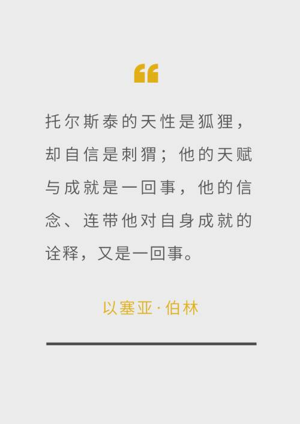

# Weekly #111

@Range : 2026-07-26 - 2026-08-01

@City: Xiaogan

[readme](../README.md) | [previous](202607W4.md) | [next](202608W1.md)


\**Photo by [Elist Nguyen](https://unsplash.com/@hieuanhcauam) on [Unsplash](https://unsplash.com/photos/young-woman-winks-holding-a-bouquet-of-flowers-f_dlY-OgnjY)*

本周最爱 🎵 ：[可不可以 - 张紫豪](https://music.163.com/#/song?id=553755659)

<iframe frameborder="no" border="0" marginwidth="0" marginheight="0" width=330 height=86 src="//music.163.com/outchain/player?type=2&id=553755659&auto=1&height=66"></iframe>

-[toc]

## algorithm [🔝](#weekly-111)

### 1. [移动零](https://leetcode.cn/problems/move-zeroes/description/?envType=study-plan-v2&envId=top-100-liked)

#### Desc

给定一个数组 nums，编写一个函数将所有 0 移动到数组的末尾，同时保持非零元素的相对顺序。

请注意 ，必须在不复制数组的情况下原地对数组进行操作。

示例 1:

```
输入: nums = [0,1,0,3,12]
输出: [1,3,12,0,0]
```

示例 2:

```
输入: nums = [0]
输出: [0]
```

#### Code

```golang
func moveZeroes(nums []int) {
	a := 0
	for i := 0; i < len(nums); i++ {
		if nums[i] != 0 {
			if nums[a] == 0 {
				nums[i], nums[a] = nums[a], nums[i]
			}
			a += 1
		}
	}
}
```

这题是典型的双指针，前一个指针遍历，后一个指针指向 0 的位置，一旦发现不为 0 的值，就与 0 的位置进行交换。

[283.move-zeroes](../code/leetcode2026/283.move-zeroes.go)

### 2. [三数之和](https://leetcode.cn/problems/3sum/description/?envType=study-plan-v2&envId=top-100-liked)

#### Desc

给你一个整数数组 nums ，判断是否存在三元组 `[nums[i], nums[j], nums[k]]` 满足 i != j、i != k 且 j != k ，同时还满足 `nums[i] + nums[j] + nums[k] == 0` 。请你返回所有和为 0 且不重复的三元组。

注意：答案中不可以包含重复的三元组。

#### Code

实现了一个最简单的版本，效率很低：

```golang
func threeSum(nums []int) [][]int {
	cache := make(map[int]int)
	for idx, v := range nums {
		cache[v] = idx
	}

	res := make([][]int, 0)
	for i := 0; i < len(nums); i++ {
		for j := i + 1; j < len(nums); j++ {
			target := 0 - nums[i] - nums[j]
			if idx, ok := cache[target]; ok && idx != i && idx != j {
				tmp := []int{nums[i], nums[j], target}
				sort.Ints(tmp)
				flag := false
				for _, old := range res {
					if old[0] == tmp[0] && old[1] == tmp[1] && old[2] == tmp[2] {
						flag = true
						break
					}
				}
				if !flag {
					res = append(res, tmp)
				}
			}
		}
	}

	return res
}
```

瞄了一眼效率较高的解法，别人是先排序，后二分查找，中间会去重，代码如下：

```golang
func threeSum(nums []int) [][]int {
	sort.Ints(nums)
	result := make([][]int, 0)
	for i := 0; i < len(nums)-2; i++ {
		if nums[i] > 0 {
			break
		} // 如果当前数字大于0，则三数之和一定大于0，所以结束循环
		if i > 0 && nums[i] == nums[i-1] {
			continue
		} // 去重
		r := len(nums) - 1
		l := i + 1
		for l < r {
			sum := nums[i] + nums[l] + nums[r]
			if sum == 0 {
				re := []int{nums[i], nums[l], nums[r]}
				result = append(result, re)
				for l < r && nums[l] == nums[l+1] {
					l++
				}
				for l < r && nums[r] == nums[r-1] {
					r--
				}
				l++
				r--
			} else if sum < 0 {
				l++
			} else if sum > 0 {
				r--
			}
		}
	}

	return result
}
```


方法确实很优雅，首先排序后小的数在前面，那么第一个数大于 0 的话，看到不会存在另外两个更大的数跟它加起来能等于 0，这样就排除了一部分测试集。

再一个就是去重，由于排好序了，去重就很自然了，比起我那个去重优雅得多。

[283.move-zeroes.go](../code/leetcode2026/283.move-zeroes.go)

### 3. [盛最多水的容器](https://leetcode.cn/problems/container-with-most-water/description/?envType=study-plan-v2&envId=top-100-liked)

#### Desc

给定一个长度为 n 的整数数组 height 。有 n 条垂线，第 i 条线的两个端点是 (i, 0) 和 `(i, height[i])` 。

找出其中的两条线，使得它们与 x 轴共同构成的容器可以容纳最多的水。

返回容器可以储存的最大水量。

说明：你不能倾斜容器。


```
输入：[1,8,6,2,5,4,8,3,7]
输出：49
解释：图中垂直线代表输入数组 [1,8,6,2,5,4,8,3,7]。在此情况下，容器能够容纳水（表示为蓝色部分）的最大值为 49。
```

#### Code

直观的解法就是双重遍历，如下所示，提交一波结果超时了：

```golang
func maxArea(height []int) int {
	count := 0
	for i := 0; i < len(height); i++ {
		for j := i + 1; j < len(height); j++ {
			h := min(height[i], height[j])
			w := j - i
			v := h * w
			if v > count {
				count = v
			}
		}
	}

	return count
}
```

看了下题解，是双指针，初始化的时候分别指向两个端点，然后每次移动短的，如果短的板不动的话，取到的水永远不会比上次多。

```golang
func maxArea(height []int) int {
	count, left, right := 0, 0, len(height)-1
	for left < right {
		count = max(count, (right-left)*min(height[left], height[right]))
		if height[left] < height[right] {
			left++
		} else {
			right--
		}
	}

	return count
}
```

[11.container-with-most-water.go](../code/leetcode2026/11.container-with-most-water.go)

## review [🔝](#weekly-111)

### 1. 重读《为人民服务》

今天刷到【潜伏】的解说，看到余则成读这段，于是重新看了一遍，现全文摘过来：

#### 为人民服务

（一九四四年九月八日）

毛泽东

我们的共产党和共产党所领导的八路军、新四军，是革命的队伍。我们这个队伍完全是为着解放人民的，是彻底地为人民的利益工作的。张思德同志就是我们这个队伍中的一个同志。

人总是要死的，但死的意义有不同。中国古时候有个文学家叫做司马迁的说过：“人固有一死，或重于泰山，或轻于鸿毛。”为人民利益而死，就比泰山还重；替法西斯卖力，替剥削人民和压迫人民的人去死，就比鸿毛还轻。张思德同志是为人民利益而死的，他的死是比泰山还要重的。

因为我们是为人民服务的，所以，我们如果有缺点，就不怕别人批评指出。不管是什么人，谁向我们指出都行。只要你说得对，我们就改正。你说的办法对人民有好处，我们就照你的办。“精兵简政”这一条意见，就是党外人士李鼎铭先生提出来的；他提得好，对人民有好处，我们就采用了。只要我们为人民的利益坚持好的，为人民的利益改正错的，我们这个队伍就一定会兴旺起来。

我们都是来自五湖四海，为了一个共同的革命目标，走到一起来了。我们还要和全国大多数人民走这一条路。我们今天已经领导着有九千一百万人口的根据地，但是还不够，还要更大些，才能取得全民族的解放。 **我们的同志在困难的时候，要看到成绩，要看到光明，要提高我们的勇气。** 中国人民正在受难，我们有责任解救他们，我们要努力奋斗。要奋斗就会有牺牲，死人的事是经常发生的。但是我们想到人民的利益，想到大多数人民的痛苦，我们为人民而死，就是死得其所。不过，我们应当尽量地减少那些不必要的牺牲。我们的干部要关心每一个战士，一切革命队伍的人都要互相关心，互相爱护，互相帮助。

今后我们的队伍里，不管死了谁，不管是炊事员，是战士，只要他是做过一些有益的工作的，我们都要给他送葬，开追悼会。这要成为一个制度。这个方法也要介绍到老百姓那里去。村上的人死了，开个追悼会。用这样的方法，寄托我们的哀思，使整个人民团结起来。

### 2. [整个生命只是当下这一刻的叠加](https://www.jiemin.com/archives/1802.html)

> 本文发布时间：JieMin 发表于2025年05月09日 18时05分

《金刚经》的一句话是这样说的：「应无所住，而生其心」。大概意思就是说：不要沉迷于痛苦和抓住痛苦。痛苦来了，就让它发生，然后让它流走。 **你需要成为生命的管道，而不是容器。** 你必须懂得如何将自己摆在第一顺位，学会爱自己。

你要允许自己犯错误，接受自己不好的一面，只活在当下，只享受当下，只体验当下。 **根本没有过去也没有未来，整个生命只是当下这一刻的叠加。** 遇桥就架桥，遇水就蹚水，车到山前必有路，其实你只对自己重要，你对这个世界是没有意义的，你就是你全世界最重要的人。

所以放下执念，把自己当成一棵树，把经历当成一阵风，那些人和事只是在某些时刻经过了你。经历了，就让它过去，过去了就不再思虑。

其实，我们只是来体验生命，什么都拥有不了，什么都留不住的。所以不需要证明什么，更没有什么事情是一定要实现的。

因为我们死了之后，这个世界上将不会有我们存在过的任何痕迹。什么虚荣，什么面子，什么功名利禄，什么人情世故，都没有意义了。 **死亡本身并不可怕，可怕的是到死的那一刻，却发现，我们从来没有真正的活过。**

我们来到这个世界，就是不断的尝试，收获感受，然后放下。看看花怎么开，看看水怎么流，看看太阳如何升起，看看夕阳如何落下。经历有趣的事，遇见难忘的人，生活原本沉闷，但跑起来不就有风了。所以你是按部就班的去完成人生清单，还是让每一天都过得充实快乐呢？

### 3. [2026 年，还有必要学编程吗？（Medium）](https://medium.com/data-science-collective/should-you-still-learn-to-code-in-2026-034685e17707)

> 该文发布于 2026-2-23， [文章存档](../blog/2026/07/should-you-still-learn-to-code-in-2026.md) ， [全文翻译](../blog/2026/07/should-you-still-learn-to-code-in-2026-cn.md)

本文作者是亚马逊资深机器学习应用科学家，结合自身工作、行业就业数据，解答2026 年是否还有必要学习编程，核心观点：AI 会替代基础编码，但懂代码、懂系统的开发者依旧稀缺，编程学习仍有巨大价值。

#### 一、行业现状：岗位结构两极分化

低端纯编码岗位萎缩：传统 “计算机程序员” 岗位两年减少 27%，预计持续下滑；大量 AI 工具普及（93% 开发者在用，AI 生成代码占比持续走高），标准化翻译需求被 AI 接管。

高阶开发岗稳定增长：软件工程师岗位基本持平，至 2034 年需求预计上涨 15%；市场只是结构洗牌，AI 相关技能招聘需求逆势上涨。

AI 代码存在明显缺陷：近半数开发者不信任 AI 产出，AI 代码看似正确实则暗藏漏洞，调试成本更高，最终责任仍由人承担。

#### 二、AI 重塑开发工作，人的核心价值转移

软件开发分为三段：需求规划（编码前）、写代码（编码中）、上线运维复盘（编码后）。

AI 仅简化中间纯编码环节，前置需求梳理、后置生产运维、故障处理、跨部门沟通、风险管控等工作反而变得更重要；

AI 只负责执行，线上事故、安全漏洞、合规问题的追责、解释、兜底全部落在人类身上；

AI 是能力放大器：基础扎实的人用 AI 大幅提效，基础薄弱者会被 AI 放大代码缺陷。

#### 三、必须学代码的底层逻辑

不懂代码就无法审核、排查 AI 生成的程序，无法做架构、并发、数据库等系统层面的决策；

AI 只能快速完成 80% 基础代码，保障系统稳定、贴合业务需求的最后 20% 依赖人的专业判断；

零基础仅靠 AI 只能做简易 Demo，无法开发承担真实业务风险的生产级项目。

#### 四、2026 年全新编程学习三步法

打基础：吃透一门语言、数据结构、数据库、测试等底层原理，AI 只用来解惑，不代做练习；

学会和 AI 协作：精准写提示词、人工审核 AI 代码、规范代码评审，借助工具提效但不放弃校验；

培养工程师核心软实力：权衡技术取舍、撰写设计文档、向非技术人员讲清方案、建立故障应急思维，做到全流程把控产品。

#### 五、反驳 “编程已死” 的论调

历史上每一次编程技术革新（编译器、高级语言等）都曾宣称程序员会消失，但行业规律是：机械化编码工作被自动化替代，懂底层系统、能做决策的人才需求持续上涨；短期 AI 也无法替代人类的判断力与责任承担能力。

#### 六、客观现实

当下初级开发求职难度高于 2021 年，但找对学习路径与项目方向仍能入行；不要听信行业唱衰言论，系统学习编程依然具备长期职业价值。

## tip [🔝](#weekly-111)

## share [🔝](#weekly-111)

### 1. [刺猬与狐狸：世间的两种人格](https://www.thepaper.cn/newsDetail_forward_9341174)

> 本文发布时间：2020-09-26 08:54

世间诸人，无非两类，要么是狐狸人格，要么是刺猬本性。

这一说法本来出自希腊诗人阿基洛科斯（Arkhilokhos），他的诗句中曾有一句：

「狐狸多知，而刺猬有一大知。」

但这个说法真正为人熟知，却是因为20世纪思想家、观念史家以赛亚·伯林（Isaiah Berlin）的一篇论文《刺猬与狐狸》，这篇论文讲的是托尔斯泰的作品与思想。


\**以赛亚·伯林，英国哲学家、观念史学家和政治理论家，20世纪最杰出的自由思想家之一，以对政治和道德理论的贡献而闻名。*

在以赛亚·伯林看来，希腊诗人的这句话，原意是：

「狐狸机巧百出，不出刺猬一计防御。」

可是，在伯林看来，这其实是两种截然不同的人格。狐狸不是说一个人鬼点子多，刺猬也不是说一根筋，而是说人有两种根本不同的面向。狐狸是百科全书式的，知道很多事，甚至经常「彼此矛盾」，而刺猬则寻求万事皆一以贯之。

西方狐狸的佼佼者有亚里士多德、蒙田、普希金、巴尔扎克。狐狸的思想活泼、零散、漫射，往往反对唯一、绝对的观念、道理。优秀的狐狸知识广博，眼界高远，事事观察入微，才思泉涌。生活之中，这种人一生诗性十足，宁可饱览世间瑰丽景色，而大多不愿龟缩一地，坐井观天。

「大狐狸」钱钟书一生博览群书，其名著《管锥编》不拘泥于学科疆域，旁征博引，其间不乏洞见。追忆起钱钟书先生，史学家余英时就断言道，他是不讲究，也不相信系统的，凡是小处才见其真知灼识。

另一位 「狐狸」大家鲁迅，常被误解成 「刺猬」。他看似拥有一套成熟的革命思想，但本性却是活脱脱的大狐狸。台湾知名文学家李欧梵说，鲁迅的短篇小说读来像抒情散文，意韵深远，思想深刻，却没有固定的体系。

不管是钱钟书、还是鲁迅，他们思想深邃，锋芒尽显篇章，但不热衷抽象理论，构建庞大体系。反过来说，坚持不懈地追求体系、真理等独一要义，就是刺猬比较显著的本性。

刺猬凡事以一招应对，这一招就是他们深信不疑的思想体系和原则。刺猬以不变应万变，秉持一贯的原则，思考倾向一元论，追求唯一、确定的真理。他们多是知行合一的，追求价值与行为的融贯一体。一旦信奉某个原则、价值，他们就把这套思想贯穿到生活细节之中。

要说臻至极致的刺猬，莫过于钻研形而上学的哲学家，柏拉图、黑格尔、罗尔斯均是如此。他们一生苦苦寻觅世界真知，并统摄于洞穴理论、精神现象学、无知之幕等哲学理念当中。文学家陀思妥耶夫斯基、易卜生、普鲁斯特等，也在刺猬家族中有一席之地。写作之中暗含了结构、观念和世界观。

但刺猬和狐狸的区分也不必当真，以塞亚·伯林自己就说，这种二分法是一种「简行」的分类，如果严格用这套标尺去衡量所有人，未免会有些迂腐，也一定会落入荒谬。之所以这么去区分，也只是为了提供一种视角而已。

事实上，也确实有很多人难以区分，在他们身上能看到狐狸，也能看到刺猬。甚至可以说，如果一个人不先成为狐狸，也不太可能成为一只真正深刻的刺猬。比如托尔斯泰，就是伯林认为很难说是狐狸还是刺猬的一位大师。伯林说：

「托尔斯泰的天性是狐狸，却自信是刺猬；他的天赋与成就是一回事，他的信念、连带他对自身成就的诠释，又是一回事。」



可见，人性的复杂还是极难简化。狐狸和刺猬，只是推至极端的人格，绝大多数人是挣扎于二者之间的，甚至许多作家自己也分辨不清自己究竟是狐狸还是刺猬。
至于伯林自己呢，他将自己定义为狐狸，认为狐狸虽然学识渊博，但是不够专注，很难成大事，所以他渴望成为「刺猬」。不管是哪一种人格，伯林的一生都难以用一个词语就能概括，这也是他到现在依然如此迷人的原因吧。

[readme](../README.md) | [previous](202607W4.md) | [next](202608W1.md)
