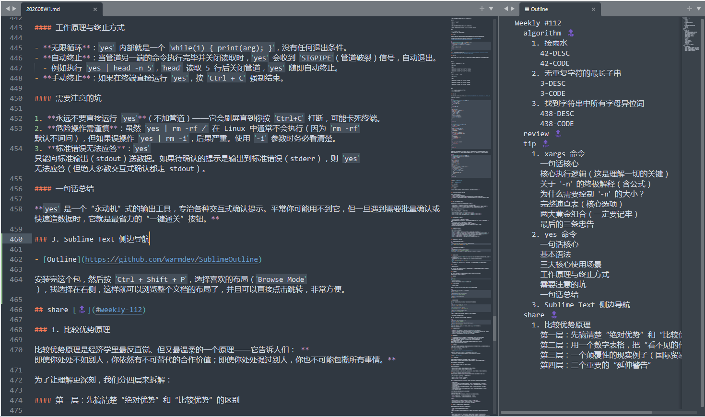

# Weekly #112

@Range : 2026-08-02 - 2026-08-08

@City: Hangzhou

[readme](../README.md) | [previous](202607W5.md) | [next](202607W7.md)


\**Photo by [DAN MA](https://unsplash.com/@dandan1943) on [Unsplash](https://unsplash.com/photos/two-women-wearing-white-and-red-traditional-dress-holding-flowers-qSzBVbkGGEw)*

-[toc]

## algorithm [🔝](#weekly-112)

### 1. [接雨水](https://leetcode.cn/problems/trapping-rain-water/description/?envType=study-plan-v2&envId=top-100-liked)

#### 42-DESC

给定 n 个非负整数表示每个宽度为 1 的柱子的高度图，计算按此排列的柱子，下雨之后能接多少雨水。

示例 1：


> 输入：height = [0,1,0,2,1,0,1,3,2,1,2,1]
>
> 输出：6
>
> 解释：上面是由数组 [0,1,0,2,1,0,1,3,2,1,2,1] 表示的高度图，在这种情况下，可以接 6 个单位的雨水（蓝色部分表示雨水）。

示例 2：

> 输入：height = [4,2,0,3,2,5]
>
> 输出：9

#### 42-CODE

[42.trapping-rain-water.go](../code/leetcode2026/42.trapping-rain-water.go)

这是一道 hard 题，很明显的动态规划味道，看了下题解，然后尝试写出来。

`leftMax[i]` 表示 i 左边最高的柱子（包括 i），也即： $ leftMax[i] = max(leftMax[i-1], height[i]) $ ， $ leftMax[0] = height[0] $； `rightMax[i]` 表示 i 右边最高的柱子（包括 i）， $ rightMax[i] = max(rightMax[i+1], height[i]) $， $ rightMax[n-1] = height[n-1] $。

那么仅仅考虑 i 位置的雨水量就是 $ min(leftMax[i], rightMax[i]) - height[i] $ ，把所有位置的雨水量加起来就是总雨水了。

```golang
func trap(height []int) int {
	length := len(height)
	leftMax := make([]int, length)
	rightMax := make([]int, length)
	if length < 2 {
		return 0
	}

	leftMax[0] = height[0]
	rightMax[length-1] = height[length-1]
	for i := 1; i < length; i++ {
		leftMax[i] = max(leftMax[i-1], height[i])
	}

	for i := length - 2; i >= 0; i-- {
		rightMax[i] = max(rightMax[i+1], height[i])
	}

	total := 0
	for i := 0; i < length; i++ {
		total += min(leftMax[i], rightMax[i]) - height[i]
	}

	return total
}
```

还有个双指针解法，left 和 right 两个指针从两端向中间移动。同时维护 left_max 和 right_max。

- 如果 `height[left] < height[right]`，说明 **位置 `left` 的盛水量被 `left_max` 决定** （因为右侧有更高的 `height[right]` 作为挡板）。
- 反之，如果 `height[left] >= height[right]`，说明 **位置 `right` 的盛水量被 `right_max` 决定**。

```go
func trap(height []int) int {
	if len(height) < 2 {
		return 0
	}
	leftMax, rightMax, total := 0, 0, 0
	left, right := 0, len(height)-1
	for left < right {
		if height[left] < height[right] {
			if height[left] >= leftMax {
				leftMax = height[left]
			} else {
				total += leftMax - height[left]
			}
			left++
		} else {
			if height[right] >= rightMax {
				rightMax = height[right]
			} else {
				total += rightMax - height[right]
			}
			right--
		}
	}

	return total
}
```

### 2. [无重复字符的最长子串](https://leetcode.cn/problems/longest-substring-without-repeating-characters/?envType=study-plan-v2&envId=top-100-liked)

#### 3-DESC

给定一个字符串 s ，请你找出其中不含有重复字符的 最长 子串 的长度。

示例 1:

> 输入: s = "abcabcbb"
>
> 输出: 3
>
> 解释: 因为无重复字符的最长子串是 "abc"，所以其长度为 3。注意 "bca" 和 "cab" 也是正确答案。

示例 2:

> 输入: s = "bbbbb"
>
> 输出: 1
>
> 解释: 因为无重复字符的最长子串是 "b"，所以其长度为 1。

示例 3:

> 输入: s = "pwwkew"
>
> 输出: 3
>
> 解释: 因为无重复字符的最长子串是 "wke"，所以其长度为 3。
>
> 请注意，你的答案必须是 子串 的长度，"pwke" 是一个子序列，不是子串。

提示：

- 0 <= s.length <= 105
- s 由英文字母、数字、符号和空格组成

#### 3-CODE

本质也是个双指针问题，前面的指针往前遍历，查看是否出现重复字符，若出现，则后面指针向前移动。

[3.longest-substring-without-repeating-characters.go](../code/leetcode2026/3.longest-substring-without-repeating-characters.go)

```go
func lengthOfLongestSubstring(s string) (ans int) {
	for i, j := 0, 0; j < len(s); j++ {
		for strings.Contains(s[i:j], string(s[j])) {
			i++
		}
		ans = max(ans, j-i+1)
	}
	return
}
```

### 3. [找到字符串中所有字母异位词](https://leetcode.cn/problems/find-all-anagrams-in-a-string/description/?envType=study-plan-v2&envId=top-100-liked)

#### 438-DESC

给定两个字符串 s 和 p，找到 s 中所有 p 的 异位词 的子串，返回这些子串的起始索引。不考虑答案输出的顺序。

示例 1:

> 输入: s = "cbaebabacd", p = "abc"
>
> 输出: [0,6]
>
> 解释:
>
> 起始索引等于 0 的子串是 "cba", 它是 "abc" 的异位词。
>
> 起始索引等于 6 的子串是 "bac", 它是 "abc" 的异位词。

示例 2:

> 输入: s = "abab", p = "ab"
>
> 输出: [0,1,2]
>
> 解释:
>
> 起始索引等于 0 的子串是 "ab", 它是 "ab" 的异位词。
>
> 起始索引等于 1 的子串是 "ba", 它是 "ab" 的异位词。
>
> 起始索引等于 2 的子串是 "ab", 它是 "ab" 的异位词。

提示:

- 1 <= s.length, p.length <= 3 * 104
- s 和 p 仅包含小写字母

#### 438-CODE

[438.find-all-anagrams-in-a-string.go](../code/leetcode2026/438.find-all-anagrams-in-a-string.go)

依旧暴力起手，依旧超时 ;0

```golang
func findAnagrams(s string, p string) []int {
	if len(s) <= len(p) {
		if equal(s, p) {
			return []int{0}
		}

		return []int{}
	}

	res := []int{}
	for i := 0; i < len(s); i++ {
		end := i + len(p)
		if end > len(s) {
			end = len(s)
		}
		subStr := s[i:end]
		if equal(subStr, p) {
			res = append(res, i)
		}

	}

	return res
}

func equal(s string, p string) bool {
	if len(s) < len(p) {
		return false
	}
	cache := make(map[byte]int)
	for i := 0; i < len(s); i++ {
		cache[s[i]]++
	}
	for i := 0; i < len(p); i++ {
		if _, ok := cache[p[i]]; !ok {
			return false
		}
		cache[p[i]]--
		if cache[p[i]] < 0 {
			return false
		}
	}

	for _, v := range cache {
		if v != 0 {
			return false
		}
	}

	return true
}
```

还是看题解了：用滑动窗口枚举 s 的所有长为 n 的子串 t。在滑的同时，维护 t 的每种字母的出现次数。如果 t 的每种字母的出现次数，和 p 的每种字母的出现次数都相同，那么 t 是 p 的异位词，把 t 左端点下标加入答案。

```golang
func findAnagrams(s string, p string) []int {
	// 先判断特殊情况，如果 S 比 P 小，就直接返回空
	if len(s) < len(p) {
		return nil
	}
	need := [26]int{}
	for i := range p {
		need[p[i]-'a']++
	}
	window := [26]int{}
	left := 0
	res := []int{}
	for right := 0; right < len(s); right++ {
		window[s[right]-'a']++
		if right-left+1 == len(p) {
			if window == need {
				res = append(res, left)
			}
			window[s[left]-'a']--
			left++
		}
	}
	return res
}
```

### 4. [和为 K 的子数组](https://leetcode.cn/problems/subarray-sum-equals-k/description/?envType=study-plan-v2&envId=top-100-liked)

#### 560-DESC

给你一个整数数组 nums 和一个整数 k ，请你统计并返回 该数组中和为 k 的子数组的个数 。

子数组是数组中元素的连续非空序列。

示例 1：

> 输入：nums = [1,1,1], k = 2
>
> 输出：2

示例 2：

> 输入：nums = [1,2,3], k = 3
>
> 输出：2

提示：

- 1 <= nums.length <= 2 * 104
- -1000 <= nums[i] <= 1000
- -107 <= k <= 107

#### 560-CODE

[560.subarray-sum-equals-k.go](../code/leetcode2026/560.subarray-sum-equals-k.go)

依旧暴力起手，还以为会超时，结果过了：

```golang
func subarraySum(nums []int, k int) int {
	res := 0
	for i := 0; i < len(nums); i++ {
		tmp := 0
		for j := i; j < len(nums); j++ {
			tmp += nums[j]
			if tmp == k {
				res++
			}
		}
	}

	return res
}
```

一个前缀和的解法， `s[i] = nums[0] + ... nums[i]`，那么 `s[j] - s[i-1] = nums[i] + ... nums[j]`，所以题目就转化为 `s[j] - s[i-1] = k`，进一步 `s[j] + (- s[i-1]) = k`，题目变成两数之和了。

但是其实不用求出 prefixSum 数组：

- 其实我们不关心具体是哪两项的前缀和之差等于k，只关心等于 k 的前缀和之差出现的次数c，就知道了有c个子数组求和等于k。
- 遍历 nums 之前，我们让 -1 对应的前缀和为 0，这样通式在边界情况也成立。即在遍历之前，map 初始放入 0:1 键值对（前缀和为0出现1次了）。
- 遍历 nums 数组，求每一项的前缀和，统计对应的出现次数，以键值对存入 map。
- 边存边查看 map，如果 map 中存在 key 为「当前前缀和 - k」，说明这个之前出现的前缀和，满足「当前前缀和 - 该前缀和 == k」，它出现的次数，累加给 count。

```golang
func subarraySum(nums []int, k int) int {
	count := 0
	hash := map[int]int{0: 1}
	preSum := 0

	for i := 0; i < len(nums); i++ {
		preSum += nums[i]
		if hash[preSum-k] > 0 {
			count += hash[preSum-k]
		}
		hash[preSum]++
	}
	return count
}
```

这个解法的关键点在于 map 初始化的 `0:1`，这个表示什么都不取的时候出现的次数，为了保证当取第一个元素的时候恰好为 k，count 能加一。

### 5. [滑动窗口最大值](https://leetcode.cn/problems/sliding-window-maximum/description/?envType=study-plan-v2&envId=top-100-liked)

#### 239-DESC

给你一个整数数组 nums，有一个大小为 k 的滑动窗口从数组的最左侧移动到数组的最右侧。你只可以看到在滑动窗口内的 k 个数字。滑动窗口每次只向右移动一位。

返回 滑动窗口中的最大值 。

示例 1：

> 输入：nums = [1,3,-1,-3,5,3,6,7], k = 3
>
> 输出：[3,3,5,5,6,7]
>
> 解释：
>
> 滑动窗口的位置                最大值
>
> ---------------               -----
>
> [1  3  -1] -3  5  3  6  7       3
>
> 1 [3  -1  -3] 5  3  6  7       3
>
> 1  3 [-1  -3  5] 3  6  7       5
>
> 1  3  -1 [-3  5  3] 6  7       5
>
> 1  3  -1  -3 [5  3  6] 7       6
>
> 1  3  -1  -3  5 [3  6  7]      7

示例 2：

> 输入：nums = [1], k = 1
>
> 输出：[1]

提示：

- 1 <= nums.length <= 105
- -104 <= nums[i] <= 104
- 1 <= k <= nums.length

#### 239-CODE

- [239.sliding-window-maximum.go](../code/leetcode2026/239.sliding-window-maximum.go)

这题的关键在于如何用一个数据结构保存当前窗口可能存在的最大值，并在移动过程中踢掉不在窗口内的值：

```golang
// maxSlidingWindow 函数用于求解滑动窗口中的最大值
// 参数 nums 是一个整数切片，代表输入的数组
// 参数 k 是一个整数，代表滑动窗口的大小
func maxSlidingWindow(nums []int, k int) []int {
	// 定义一个栈（这里用切片模拟），用于存储当前窗口内可能是最大值的元素的索引
	var stack []int
	// 定义一个结果切片，用于存储每个滑动窗口的最大值
	var res []int
	// 遍历输入数组 nums
	for i, v := range nums {
		// 当栈不为空，并且当前元素 v 大于等于栈顶元素对应的数组值时
		for len(stack) > 0 && v >= nums[stack[len(stack)-1]] {
			// 弹出栈顶元素，因为栈顶元素对应的数组值不可能是当前或后续窗口的最大值了
			stack = stack[:len(stack)-1]
		}
		// 将当前元素的索引 i 压入栈中
		stack = append(stack, i)
		// 如果当前索引 i 减去窗口大小 k 再加 1 大于栈底元素（即栈中第一个元素）的索引
		if i-k+1 > stack[0] {
			// 说明栈底元素已经不在当前窗口内了，将其从栈中移除
			stack = stack[1:]
		}
		// 如果当前索引 i 加 1 大于等于窗口大小 k，说明已经形成了一个完整的窗口
		if i+1 >= k {
			// 栈底元素对应的数组值就是当前窗口的最大值，将其添加到结果切片中
			res = append(res, nums[stack[0]])
		}
	}
	// 返回结果切片
	return res
}
```

### 6. [最小覆盖子串](https://leetcode.cn/problems/minimum-window-substring/description/?envType=study-plan-v2&envId=top-100-liked)

#### 76-DESC

给定两个字符串 s 和 t，长度分别是 m 和 n，返回 s 中的 最短窗口 子串，使得该子串包含 t 中的每一个字符（包括重复字符）。如果没有这样的子串，返回空字符串 ""。

测试用例保证答案唯一。

示例 1：

> 输入：s = "ADOBECODEBANC", t = "ABC"
>
> 输出："BANC"
>
> 解释：最小覆盖子串 "BANC" 包含来自字符串 t 的 'A'、'B' 和 'C'。

示例 2：

> 输入：s = "a", t = "a"
>
> 输出："a"
>
> 解释：整个字符串 s 是最小覆盖子串。

示例 3:

> 输入: s = "a", t = "aa"
>
> 输出: ""
>
> 解释: t 中两个字符 'a' 均应包含在 s 的子串中，
>
> 因此没有符合条件的子字符串，返回空字符串。

提示：

- m == s.length
- n == t.length
- 1 <= m, n <= 105
- s 和 t 由英文字母组成

进阶：你能设计一个在 O(m + n) 时间内解决此问题的算法吗？

#### 76-CODE

- [76.minimum-window-substring.go](../code/leetcode2026/76.minimum-window-substring.go)

这题的思路是用一个滑动窗口来统计最小满足覆盖要求的子串，不断向右扩张，直到满足了覆盖要求。由于在扩张过程中可能混入了不需要的字符，因此从左边开始缩小窗口，直到无法满足覆盖要求，然后就是新一轮的扩张。在过程中统计最小窗口的起点和大小，即是所求。

```golang
func minWindow(s string, t string) string {
	if len(t) > len(s) {
		return ""
	}

	need, window := make(map[byte]int, 0), make(map[byte]int, 0)
	left, right, start, minLen := 0, 0, 0, 0
	match := 0

	for i, _ := range t {
		need[t[i]]++
	}
	for right < len(s) {
		ch := s[right]
		if v, ok := need[ch]; ok {
			window[ch]++
			// 当前字符出现次数匹配
			if window[ch] == v {
				match++
			}
		}
		// 当前窗口子串匹配
		for match == len(need) {
			if minLen == 0 || minLen > right-left+1 {
				minLen = right - left + 1
				start = left
			}
			ch := s[left]
			if v, ok := need[ch]; ok {
				window[ch]--
				if window[ch] < v {
					match--
				}
			}
			left++
		}
		right++
	}

	return s[start : start+minLen]
}
```

## review [🔝](#weekly-112)

## tip [🔝](#weekly-112)

### 1. xargs 命令

> 总结来自 deepseek

#### 一句话核心

**`xargs` 从标准输入读取数据，将其拆分为“参数包”，然后反复执行指定的命令。**

#### 核心执行逻辑（这是理解一切的关键）

`xargs` 的工作流程分为三步：
1. **读取**：从管道或文件读取一串文本。
2. **拆分**：默认按**空格、制表符或换行符**将这些文本拆分成一个个独立的“条目”（参数）。
3. **打包执行**：将拆分好的条目**打包成组**，每组作为参数传给命令执行。**打包的个数，就是由 `-n` 决定的。**

#### 关于 `-n` 的终极解释（含公式）

`-n N` 的含义是：**每一组（每一次执行）最多包含 N 个参数**。

- **执行次数公式**：**总执行次数 = 总参数个数 ÷ N（结果向上取整）**
- **极端情况 `-n 1`**：每组只有 1 个参数 → 总参数个数是多少，命令就执行多少次（**最慢，但最精细**）。
- **默认情况（不加 `-n`）**：一次性把所有参数塞进一组（**最快，但可能因参数过长而报错**）。

假设输入有 **5 个参数**：`1 2 3 4 5`

| 写法 | 打包方式（每组参数） | 命令执行次数 |
| :--- | :--- | :--- |
| `xargs echo`（默认） | 第1组：`1 2 3 4 5` | **执行 1 次** |
| `xargs -n 2 echo` | 第1组：`1 2`<br>第2组：`3 4`<br>第3组：`5` | **执行 3 次** |
| `xargs -n 1 echo` | 第1组：`1`<br>第2组：`2`<br>... 第5组：`5` | **执行 5 次** |

#### 为什么需要控制 `-n` 的大小？

- **`-n` 太大（或不加）**：进程启动少，**速度快**。但如果参数数量超级多（如几百万个文件），会触发命令参数长度限制（ARG_MAX），导致 **“参数列表过长”** 错误。
- **`-n` 太小（如 `-n 1`）**：每次只处理一个，**绝对安全**，不会触发参数长度限制。但每处理一个就要启动一次进程，**效率极低**。
- **最佳实践**：找平衡点。普通场景用默认即可；超大文件量建议用 `-n 100` 或 `-n 500`，既不出错，又能大幅减少进程启动次数。

#### 完整速查表（核心选项）

| 选项 | 作用 | 一句话场景 |
| :--- | :--- | :--- |
| **`-n N`** | **每批传 N 个参数**（见上文详解） | 控制执行频率，避免参数过长。 |
| **`-0`** | **以空字符（null）分隔**输入 | **处理文件名必须加！** 配合 `find -print0` 防空格乱码。 |
| **`-I {}`** | 用 `{}` 占位，把参数**插入命令中间** | 例如 `mv {} /tmp/`，或同时执行 `cp` 和 `rm`。 |
| **`-P N`** | **并行**启动 N 个进程同时处理 | 处理大量独立任务时加速（如压缩图片）。 |
| **`-p`** | 执行前**询问确认** | 执行 `rm -rf` 前的最后一道保险。 |
| **`-t`** | 执行前**打印命令** | 调试时查看 `xargs` 实际拼出的命令长什么样。 |

#### 两大黄金组合（一定要记牢）

**1. 绝对安全的删除/移动（防空格）**
```bash
# -print0 生成 null 分隔，-0 按 null 读取，完美适配所有文件名
find . -name "*.tmp" -print0 | xargs -0 rm
```

**2. 灵活的批量操作（插入中间位置）**
```bash
# 将当前目录所有 .txt 移动到 ../backup/ 文件夹
ls *.txt | xargs -n 1 -I {} mv {} ../backup/
# 注：-I 隐含了 -n 1，所以这里 -n 1 可省略，写成 xargs -I {} mv {} ../backup/
```

#### 最后的三条忠告

1. **处理文件名时，永远记住 `-0` 优先于 `-n`**：不先用 `-0` 分隔，包含空格的文件名会被拆成两个参数，这时候 `-n` 设置得再小也没用。
2. **危险操作前先 `echo` 测试**：将目标命令换成 `echo`，看打印出来的分组是否如你所愿。
   ```bash
   find . -name "*.log" | xargs -n 3 echo
   ```
3. **追求速度加 `-P`，追求安全加 `-p`**，二者不可兼得。一般生产环境慎重使用 `-P`，避免系统资源耗尽。

### 2. yes 命令

> 总结来自 deepseek

`yes` 是 Linux 中最“简单粗暴”的命令之一。它的功能极度单一：**不断重复输出你指定的字符串**（默认输出 `y`），直到进程被手动终止或管道关闭。

#### 一句话核心

`yes` 是一个**自动应答机**，专门用来向那些需要人工确认（交互式）的命令，自动输出 `y` 或任意指定的内容，从而实现**全自动执行**。

#### 基本语法

```bash
yes [字符串]
```
- 不加字符串：无限输出 `y`
- 加字符串：无限输出该字符串（如 `yes n` 会无限输出 `n`）

#### 三大核心使用场景

1. 自动确认（最常用）

当你运行一个会问 `Are you sure? [y/N]` 的命令时，`yes` 可以帮你自动回答。

```bash
# 自动删除所有 .txt 文件（绕过 rm -i 的逐个确认）
yes | rm -i *.txt

# 自动同意安装软件包（绕过 apt 的确认提示）
yes | sudo apt-get install 软件包名

# 自动回答 "n"（常用于取消某些操作）
yes n | 命令
```

2. 批量生成测试数据

利用 `yes` 输出无限流的特点，结合 `head` 可以快速生成大文件或填充数据。

```bash
# 生成 1000 行 "yes" 字符串，写入 test.txt
yes | head -n 1000 > test.txt

# 生成 100 行 "HelloWorld"，写入文件
yes "HelloWorld" | head -n 100 > hello.txt

# 快速产生 1GB 的大文件（用于磁盘写入测试）
yes | head -c 1G > bigfile.bin
```
**注意**：生成超大文件时，直接用 `dd` 效率更高，但 `yes` 胜在语法极简。

3. 配合 `xargs` 进行批量并行或占位

由于 `yes` 会产生无限流，它可以作为 `xargs` 的恒定输入源。

```bash
# 每秒打印一次 "yes"（配合 xargs -n 1）
yes | xargs -n 1 echo "当前输出:"

# 经典技巧：并行执行命令（启用 4 个进程，每个都运行 sleep 5）
yes | xargs -P 4 -n 1 sleep 5
```
*原理：`yes` 持续输出行，`xargs -n 1` 每次拿一行去执行 sleep，`-P 4` 保证同时有 4 个进程在跑，从而实现并发。*

#### 工作原理与终止方式

- **无限循环**：`yes` 内部就是一个 `while(1) { print(arg); }`，没有任何退出条件。
- **自动终止**：当管道另一端的命令执行完毕并关闭读取时，`yes` 会收到 `SIGPIPE`（管道破裂）信号，自动退出。
  - 例如执行 `yes | head -n 5`，`head` 读取 5 行后关闭管道，`yes` 随即自动终止。
- **手动终止**：如果在终端直接运行 `yes`，按 `Ctrl + C` 强制结束。

#### 需要注意的坑

1. **永远不要直接运行 `yes`**（不加管道）——它会刷屏直到你按 `Ctrl+C` 打断，可能卡死终端。
2. **危险操作需谨慎**：虽然 `yes | rm -rf /` 在 Linux 中通常不会执行（因为 `rm -rf` 默认不询问），但如果误操作 `yes | rm -i`，后果严重。使用 `-i` 参数时务必看清楚。
3. **标准错误无法应答**：`yes` 只能向标准输出（stdout）送数据。如果待确认的提示是输出到标准错误（stderr），则 `yes` 无法应答（但绝大多数交互式确认都走 stdout）。

#### 一句话总结

**`yes` 是一个“永动机”式的输出工具，专治各种交互式确认提示。平常你可能用不到它，但一旦遇到需要批量确认或快速造数据时，它就是最省力的“一键通关”按钮。**

### 3. Sublime Text 侧边导航

- [Outline](https://github.com/warmdev/SublimeOutline)

安装完这个包，然后按 `Ctrl + Shift + P`，选择喜欢的布局（`Browse Mode`），我选择在右侧，这样就可以浏览整个文档的布局了，并且可以直接点击跳转，非常方便。



### 4. 为什么海拔越高，温度越低？

“海拔越高温度越低”和“高楼层是否比一楼更冷”是两个相关但原理不完全相同的问题。

简单来说，对于室外开放空间，**海拔越高，温度通常越低**，这是由大气受热方式决定的。但对于城市中的高楼室内，情况则复杂得多，**高楼层并不一定比一楼更冷，甚至夏天可能更热**。

#### 为什么海拔越高，温度越低？

这个现象的科学名称叫**气温垂直递减率**。其核心原理并非“离太阳越远”，而是因为大气的“加热”方式很特别：

1. **大地是主要热源**：太阳光（主要是短波辐射）大部分会穿透大气，直接加热地面。
2. **地面“二次加热”空气**：被晒热的地面本身成为一个热源，会释放出**长波辐射**来加热靠近它的空气。
3. **热量自下而上递减**：这个过程就像是“在空气底部点了一把火”，离地面这个“火源”越近越暖和，越远则越冷。
4. **空气稀薄，锁热能力弱**：高海拔地区空气更稀薄，能吸收和保存的热量也更少。

因此，平均来说，**海拔每升高100米，气温大约下降0.6℃**。这也是高山常年积雪、成为避暑胜地的原因。

#### 高楼层一定比一楼更冷吗？——不一定

将“海拔越高越冷”的规律直接套用到城市高楼上，是一种常见的误解。高楼内的温度受到多种因素的综合影响，结论远比这复杂。

1. 室外空气：遵循规律，但温差极小
在无遮挡的室外，高楼外部的空气温度确实会随高度增加而略有下降。不过，这个温差非常微弱。一项针对广州某校园建筑的研究显示，不同楼层的外部空气垂直温差，**白天最高也仅约0.75℃**。这和山区每百米降0.6℃的效应相比，几乎可以忽略。

2. 室内温度：受多种因素主导，规律相反
高层室内的温度，更多是由建筑本身的设计和环境决定，结论往往和“越高越冷”相反。

- **夏天：顶层更热**：这是最普遍的体验。因为顶楼和高层直接暴露在阳光下，吸收的太阳辐射远多于被树荫或周边建筑遮挡的低楼层。有媒体实测发现，高温天顶楼室温可能比底楼**高出1-2℃**，甚至更接近室外温度。一项研究也证实，白天高楼层比低楼层**高出约0.75℃**。

- **冬天：高楼层感觉更冷（体感冷）**：虽然实测温差不大，但高楼层在冬天常感觉更冷。这主要是因为：
    - **更大的风**：高层建筑周围风速更大，没有遮挡，寒风会加速带走室内热量，产生“风冷效应”。
    - **更多的热量流失**：顶层和外墙暴露面积大，若保温不佳，冬天热量更容易散失。

| 季节 | 温度对比 | 主要原因 |
| :--- | :--- | :--- |
| 夏季 | 顶层/高层 > 低层 | 高楼层接受更多太阳辐射，低楼层有地面、植被等遮阴。 |
| 冬季 | 顶层/高层 ≈ 或 < 低层（体感更冷） | 高楼层受大风影响，热量流失快；低层相对避风。 |

此外，建筑的**朝向**（朝南暖、朝北冷）、**周边环境**（是否有遮挡）以及**建筑保温**等因素，对室内温度的影响可能比楼层本身更大。

#### 总结

- 在广阔的户外：“海拔越高温度越低”是成立的，主要因为地面是加热空气的主要热源。
- 在城市高楼里：情况更复杂。室外空气的垂直温差极小。室内温度则受太阳辐射、风力、建筑保温等多重因素影响，夏天通常是高层更热，冬天则是高层因风寒效应而感觉更冷。

## share [🔝](#weekly-112)

### 1. 比较优势原理

比较优势原理是经济学里最反直觉、但又最温柔的一个原理——它告诉人们： **即使你处处不如别人，你依然有不可替代的合作价值；即使你处处强过别人，你也不可能包揽所有事情。**

为了让理解更深刻，我们分四层来拆解：

#### 第一层：先搞清楚“绝对优势”和“比较优势”的区别

这是大多数人混淆的地方：

- 绝对优势：指生产同一样东西，你比对方用的资源更少（更快、更便宜）。
- 比较优势：指生产同一样东西，你比对方付出的机会成本更低。

比较优势不看“绝对速度”，只看“相对代价”。真正的分工合作，不取决于谁更能干，而取决于谁的牺牲更小。

#### 第二层：用一个数字表格，把“看不见的代价”算出来
假设你和小王是邻居，都要处理**打扫卫生**和**写工作报告**两件事。各自的效率如下（单位：小时）：

| 任务 | 你（耗时） | 小王（耗时） | 谁的绝对优势？ |
| :--- | :--- | :--- | :--- |
| 打扫卫生 | 1小时 | **2小时** | 你（更快） |
| 写报告 | **2小时** | 4小时 | 你（更快） |

你看，**你在两件事上都比小王强**（绝对优势）。按直觉，你应该全包了？但比较优势的计算会告诉你答案：

- **你的机会成本**：
	- 花1小时打扫，你就少了1小时写报告（只能写半份）。所以，**你打扫1次的机会成本 = 0.5份报告**。
	- 花2小时写1份报告，你就少了2小时打扫（能打扫2次）。所以，**你写1份报告的机会成本 = 2次打扫**。
- **小王的机会成本**：
	- 花2小时打扫，他就少了2小时写报告（只能写半份）。所以，**小王打扫1次的机会成本 = 0.5份报告**。（注意：和你一样！）
	- 花4小时写1份报告，他就少了4小时打扫（能打扫2次）。所以，**小王写1份报告的机会成本 = 2次打扫**。（哎？居然也和你一样？）

*（为了体现区分度，我们调换一下数字，让对比更鲜明）*

**修正后的经典例子（假设）：**
你打扫1小时，写报告3小时；小王打扫3小时，写报告1小时（小王写报告有绝对优势）。

- **你**：打扫的机会成本 = 1/3份报告；写报告的机会成本 = 3次打扫。
- **小王**：打扫的机会成本 = 3份报告；写报告的机会成本 = 1/3次打扫。

**结论**：

- 你打扫的**机会成本（1/3份报告）**远低于小王（3份报告）→ **你擅长打扫**。
- 小王写报告的**机会成本（1/3次打扫）**远低于你（3次打扫）→ **小王擅长写报告**。
- 如果你们各自包揽擅长的，然后交换，**两人总工时最少，总产出最大**。

#### 第三层：一个颠覆性的现实例子（国际贸易的基石）

国家层面最经典的例子是**美国和中国**（或美国与越南）：

- **美国**生产芯片和衣服都比越南快（绝对优势）。
- **但**，美国生产1颗芯片的时间，如果用来做衣服能做100件；而越南生产1颗芯片的时间，如果用来做衣服只能做20件。

那么：

- 美国生产芯片的**机会成本**是“放弃100件衣服”；越南生产芯片的**机会成本**是“放弃20件衣服”。
- **越南放弃的东西更少（20 < 100）**，所以越南在生产衣服上具有**比较优势**（即便它效率低）。
- 因此，美国集中资源搞芯片，越南集中资源搞服装厂，然后交换。美国得到了比自己做更多的衣服，越南得到了原本靠自己永远做不出来的芯片——**双方都获利**。这就是全球化分工的底层逻辑。

#### 第四层：三个重要的“延伸警告”

1. **它只告诉你“该不该做”，不告诉你“分蛋糕”**：比较优势让总蛋糕变大了，但没保证分得公平。蛋糕做大后，强者（美国）可能拿走了90%，弱者可能只拿10%。如果弱者觉得吃亏，贸易就可能破裂——所以现实中需要谈判和再分配。
2. **它依赖“流动性”**：假设你一直做擅长的事，但突然AI（新技术）出现了，把你擅长的事替代了。如果你的技能完全无法迁移（不流动），比较优势就会失效，你就会被“锁定”在低端陷阱里。所以，**比较优势不是一成不变的**，它会随着技术进步和人力资本投资而动态变化。
3. **不可滥用“剥削论”**：很多人说“越南工人被美国资本家剥削”。但从比较优势看，越南工人之所以有这份工作，恰恰是因为美国资本放弃了做衣服（机会成本太高）。这份工作给越南工人带来的工资，虽然低于美国，但**高于越南工人留在农田里的收入**——这就是他们愿意进厂的理性原因。

**最后，给你一个有用的生活总结：**

- 职业选择上，不要总盯着“我哪里不如别人”，而要问“**我做哪件事，放弃的东西最少？**”
- 如果你是个全能牛人，你最该做的不是自己搞定所有琐事，而是**把你不擅长（或机会成本极高）的事外包**，比如雇人打扫、修图、开车——哪怕你自己也能干，但把时间省下来做你最核心的事，才是真正的“赢家思维”。

[readme](../README.md) | [previous](202607W5.md) | [next](202607W7.md)
