# Weekly #114

@Range : 2026-08-16 - 2026-08-22

@City: Hangzhou

[readme](../README.md) | [previous](202608W2.md) | [next](202608W4.md)


\**Photo by [Alex Shaw](https://unsplash.com/@matt909) on [Unsplash](https://unsplash.com/photos/woman-in-white-dress-kissing-woman-in-white-dress-IJ6sk4NQuGw)*

-[toc]

## algorithm [🔝](#weekly-114)

### 1. [73.矩阵置零](https://leetcode.cn/problems/set-matrix-zeroes/description/?envType=study-plan-v2&envId=top-100-liked)

#### 73-DESC

给定一个 m x n 的矩阵，如果一个元素为 0 ，则将其所在行和列的所有元素都设为 0 。请使用 原地 算法。

**示例 1：**

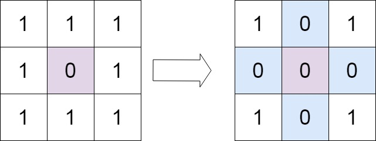

> 输入：matrix = [[1,1,1],[1,0,1],[1,1,1]]
>
> 输出：[[1,0,1],[0,0,0],[1,0,1]]

**示例 2：**

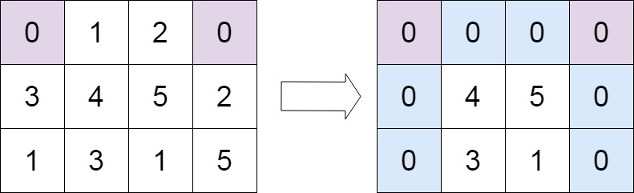

> 输入：matrix = [[0,1,2,0],[3,4,5,2],[1,3,1,5]]
>
> 输出：[[0,0,0,0],[0,4,5,0],[0,3,1,0]]

提示：

- m == matrix.length
- n == matrix[0].length
- 1 <= m, n <= 200
- -231 <= matrix[i][j] <= 231 - 1

进阶：

- 一个直观的解决方案是使用  O(mn) 的额外空间，但这并不是一个好的解决方案。
- 一个简单的改进方案是使用 O(m + n) 的额外空间，但这仍然不是最好的解决方案。
- 你能想出一个仅使用常量空间的解决方案吗？

#### 73-CODE

- [73.set-matrix-zeroes.go](../code/leetcode2026/73.set-matrix-zeroes.go)

最直观的解法是用两个数组标记需要被置零的行和列，即：遍历整个矩阵，如果发现 `matrix[i][j] == 0`，则将 `row[i]` 和 `col[j]` 标记为 true。

再次遍历整个矩阵，如果当前元素所在的行 `row[i]` 或列 `col[j]` 被标记为 true，则将该元素置为 0

```Markdown
func setZeroes(matrix [][]int) {
    m, n := len(matrix), len(matrix[0])
    rows := make([]bool, m)
    cols := make([]bool, n)

    // 记录哪些行和列需要置零
    for i := 0; i < m; i++ {
        for j := 0; j < n; j++ {
            if matrix[i][j] == 0 {
                rows[i] = true
                cols[j] = true
            }
        }
    }

    // 根据记录置零
    for i := 0; i < m; i++ {
        for j := 0; j < n; j++ {
            if rows[i] || cols[j] {
                matrix[i][j] = 0
            }
        }
    }
}
```

进阶解法：利用矩阵的第一行和第一列来充当解法一中的两个标记数组，由于第一行和第一列本身也可能包含 0，它们的原始状态会被覆盖，所以需要用两个额外的布尔变量 (row0, col0) 来单独记录它们是否原本就包含 0。

- 预处理：检查第一行和第一列是否原本就有 0，并分别用 row0 和 col0 记录。
- 标记：遍历除第一行和第一列之外的所有元素。如果 `matrix[i][j] == 0`，则将对应的标记位置 `matrix[i][0]` 和 `matrix[0][j]` 置为 0。
- 置零：再次遍历除第一行和第一列之外的所有元素。如果 `matrix[i][0] == 0` 或 `matrix[0][j] == 0`，则将 `matrix[i][j]` 置为 0。
- 收尾：根据步骤1中记录的 row0 和 col0，决定是否将第一行和第一列全部置零。
- 复杂度：时间复杂度 `O(m * n)`，空间复杂度 `O(1)`。

```Markdown
func setZeroes(matrix [][]int) {
    m, n := len(matrix), len(matrix[0])
    row0HasZero := false
    col0HasZero := false

    // 检查第一行是否有零
    for j := 0; j < n; j++ {
        if matrix[0][j] == 0 {
            row0HasZero = true
            break
        }
    }
    // 检查第一列是否有零
    for i := 0; i < m; i++ {
        if matrix[i][0] == 0 {
            col0HasZero = true
            break
        }
    }

    // 使用第一行和第一列作为标记
    for i := 1; i < m; i++ {
        for j := 1; j < n; j++ {
            if matrix[i][j] == 0 {
                matrix[i][0] = 0
                matrix[0][j] = 0
            }
        }
    }

    // 根据标记置零（除了第一行和第一列）
    for i := 1; i < m; i++ {
        for j := 1; j < n; j++ {
            if matrix[i][0] == 0 || matrix[0][j] == 0 {
                matrix[i][j] = 0
            }
        }
    }

    // 处理第一行
    if row0HasZero {
        for j := 0; j < n; j++ {
            matrix[0][j] = 0
        }
    }
    // 处理第一列
    if col0HasZero {
        for i := 0; i < m; i++ {
            matrix[i][0] = 0
        }
    }
}
```

### 2. [54.螺旋矩阵](https://leetcode.cn/problems/spiral-matrix/description/?envType=study-plan-v2&envId=top-100-liked)

#### 54-DESC

给你一个 m 行 n 列的矩阵 matrix ，请按照 顺时针螺旋顺序 ，返回矩阵中的所有元素。

示例 1：

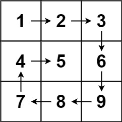

> 输入：matrix = [[1,2,3],[4,5,6],[7,8,9]]
>
> 输出：[1,2,3,6,9,8,7,4,5]

示例 2：

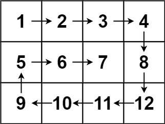

> 输入：matrix = [[1,2,3,4],[5,6,7,8],[9,10,11,12]]
>
> 输出：[1,2,3,4,8,12,11,10,9,5,6,7]

提示：

- m == matrix.length
- n == matrix[i].length
- 1 <= m, n <= 10
- -100 <= matrix[i][j] <= 100

#### 54-CODE

- [54.spiral-matrix.go](../code/leetcode2026/54.spiral-matrix.go)

解法还是很直观的，遍历四个方向，需要四个变量标记边界：row、col、rowLen、colLen，就是模型实际遍历的矩形，每遍历一次就“内陷”一次，因此 row 和 col 会加一，而 rowLen 和 colLen 会减二。

需要注意的是对于左/上需要判断是否只有一行/一列，因为单行/单列只需要遍历一次就好了，再来一遍会重复。

```go
func spiralOrder(matrix [][]int) []int {
	if len(matrix) == 0 {
		return []int{}
	}
	rowLen, colLen := len(matrix), len(matrix[0])
	row, col := 0, 0
	res := make([]int, 0, rowLen*colLen)

	for rowLen > 0 && colLen > 0 {
		// 右
		for i := col; i < col+colLen; i++ {
			res = append(res, matrix[row][i])
		}
		// 下
		for i := row + 1; i < row+rowLen; i++ {
			res = append(res, matrix[i][col+colLen-1])
		}
		// 左：确保不止一行
		if rowLen > 1 {
			for i := col + colLen - 2; i >= col; i-- {
				res = append(res, matrix[row+rowLen-1][i])
			}
		}
		// 上：确保不止一列
		if colLen > 1 {
			for i := row + rowLen - 2; i > row; i-- {
				res = append(res, matrix[i][col])
			}
		}

		row++
		col++
		rowLen -= 2
		colLen -= 2
	}
	return res
}
```

### 3. [48.旋转图像](https://leetcode.cn/problems/rotate-image/description/?envType=study-plan-v2&envId=top-100-liked)

#### 48-DESC

给定一个 n × n 的二维矩阵 matrix 表示一个图像。请你将图像顺时针旋转 90 度。

你必须在 原地 旋转图像，这意味着你需要直接修改输入的二维矩阵。请不要 使用另一个矩阵来旋转图像。

示例 1：

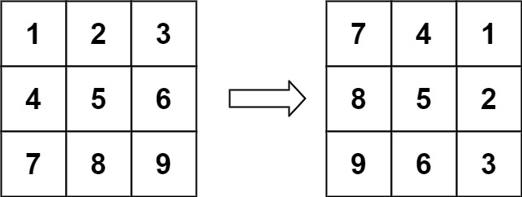

> 输入：matrix = [[1,2,3],[4,5,6],[7,8,9]]
>
> 输出：[[7,4,1],[8,5,2],[9,6,3]]

示例 2：

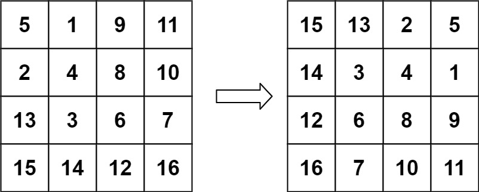

> 输入：matrix = [[5,1,9,11],[2,4,8,10],[13,3,6,7],[15,14,12,16]]
>
> 输出：[[15,13,2,5],[14,3,4,1],[12,6,8,9],[16,7,10,11]]

提示：

- n == matrix.length == matrix[i].length
- 1 <= n <= 20
- -1000 <= matrix[i][j] <= 1000

#### 48-CODE

- [48.rotate-image.go](../code/leetcode2026/48.rotate-image.go)

题目要求顺时针旋转 90 度，有个技巧是通过两步实现，第一步：右上和左下对折；第二部，左右对折。

```go
func rotate(matrix [][]int) {
    // 右上 - 左下
    for i := 0; i < len(matrix); i++ {
        for j := 0; j < i; j++ {
            matrix[i][j], matrix[j][i] = matrix[j][i], matrix[i][j]
        }
    }
    // 水平对调
    for _, row := range matrix {
        i, j := 0, len(row) - 1
        for i < j {
            row[i], row[j] = row[j], row[i]
            i++
            j--
        }
    }
}
```

### 4. [240.搜索二维矩阵 II](https://leetcode.cn/problems/search-a-2d-matrix-ii/description/?envType=study-plan-v2&envId=top-100-liked)

#### 240-DESC

编写一个高效的算法来搜索 m x n 矩阵 matrix 中的一个目标值 target 。该矩阵具有以下特性：

每行的元素从左到右升序排列。
每列的元素从上到下升序排列。

示例 1：

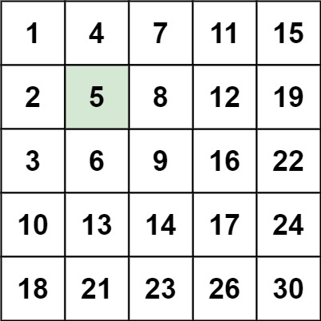

> 输入：matrix = [[1,4,7,11,15],[2,5,8,12,19],[3,6,9,16,22],[10,13,14,17,24],[18,21,23,26,30]], target = 5
>
> 输出：true

示例 2：

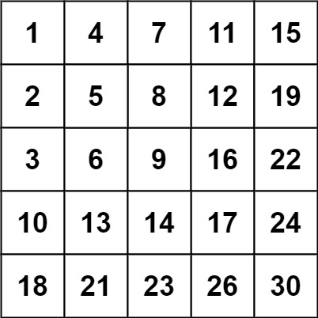

> 输入：matrix = [[1,4,7,11,15],[2,5,8,12,19],[3,6,9,16,22],[10,13,14,17,24],[18,21,23,26,30]], target = 20
>
> 输出：false

提示：

- m == matrix.length
- n == matrix[i].length
- 1 <= n, m <= 300
- -109 <= matrix[i][j] <= 109
- 每行的所有元素从左到右升序排列
- 每列的所有元素从上到下升序排列
- -109 <= target <= 109

#### 240-CODE

- [240.search-a-2d-matrix-ii.go](../code/leetcode2026/240.search-a-2d-matrix-ii.go)

直观的解法，每一行做二分查找：

```Markdown
func searchMatrix(matrix [][]int, target int) bool {
    n := len(matrix[0])
    for _, row := range matrix {
        if target == row[0] || target == row[n-1] {
            return true
        }
        if target < row[0] {
            return false
        }
        if target > row[n-1] {
            continue
        }
        i, j, mid := 0, n-1, 0
        for i <= j {
            mid = (j-i)/2 + i
            if row[mid] > target {
                j = mid - 1
            } else if row[mid] < target {
                i = mid + 1
            } else {
                return true
            }
        }

    }

    return false
}
```

有一个巧妙的解法，从 **右上角** 进行查找，因为右上角是一行的最大值，而是一列的最小值，所以查找过程是：

- 若比它大，那就在下一行
- 若比它小，那就在前一列

```golang
func searchMatrix(matrix [][]int, target int) bool {
    // 从右上角模仿二叉搜索树的形式往左下角寻找
    for row, col := 0, len(matrix[0]) - 1; row < len(matrix) && col >= 0; {
        if matrix[row][col] > target {
            col -= 1
        } else if matrix[row][col] < target {
            row += 1
        } else {
            return true
        }
    }
    return false
}
```

### 5. [160.相交链表](https://leetcode.cn/problems/intersection-of-two-linked-lists/description/?envType=study-plan-v2&envId=top-100-liked)

#### 160-DESC

给你两个单链表的头节点 headA 和 headB ，请你找出并返回两个单链表相交的起始节点。如果两个链表不存在相交节点，返回 null 。

图示两个链表在节点 c1 开始相交：

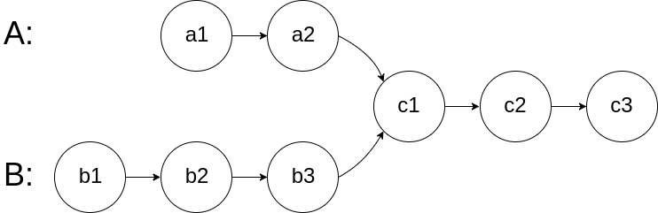

题目数据 保证 整个链式结构中不存在环。

注意，函数返回结果后，链表必须 保持其原始结构 。

自定义评测：

评测系统 的输入如下（你设计的程序 不适用 此输入）：

- intersectVal - 相交的起始节点的值。如果不存在相交节点，这一值为 0
- listA - 第一个链表
- listB - 第二个链表
- skipA - 在 listA 中（从头节点开始）跳到交叉节点的节点数
- skipB - 在 listB 中（从头节点开始）跳到交叉节点的节点数

评测系统将根据这些输入创建链式数据结构，并将两个头节点 headA 和 headB 传递给你的程序。如果程序能够正确返回相交节点，那么你的解决方案将被 视作正确答案 。

示例 1：

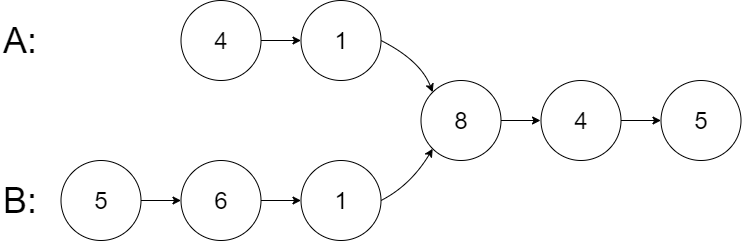

> 输入：intersectVal = 8, listA = [4,1,8,4,5], listB = [5,6,1,8,4,5], skipA = 2, skipB = 3
>
> 输出：Intersected at '8'
>
> 解释：相交节点的值为 8 （注意，如果两个链表相交则不能为 0）。
>
> 从各自的表头开始算起，链表 A 为 [4,1,8,4,5]，链表 B 为 [5,6,1,8,4,5]。
>
> 在 A 中，相交节点前有 2 个节点；在 B 中，相交节点前有 3 个节点。
>
> — 请注意相交节点的值不为 1，因为在链表 A 和链表 B 之中值为 1 的节点 (A 中第二个节点和 B 中第三个节点) 是不同的节点。换句话说，它们在内存中指向两个不同的位置，而链表 A 和链表 B 中值为 8 的节点 (A 中第三个节点，B 中第四个节点) 在内存中指向相同的位置。

示例 2：

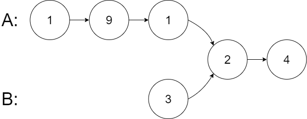

> 输入：intersectVal = 2, listA = [1,9,1,2,4], listB = [3,2,4], skipA = 3, skipB = 1
>
> 输出：Intersected at '2'
>
> 解释：相交节点的值为 2 （注意，如果两个链表相交则不能为 0）。
>
> 从各自的表头开始算起，链表 A 为 [1,9,1,2,4]，链表 B 为 [3,2,4]。
>
> 在 A 中，相交节点前有 3 个节点；在 B 中，相交节点前有 1 个节点。

示例 3：

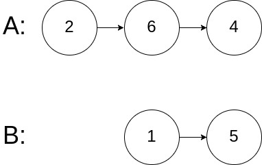

> 输入：intersectVal = 0, listA = [2,6,4], listB = [1,5], skipA = 3, skipB = 2
>
> 输出：No intersection
>
> 解释：从各自的表头开始算起，链表 A 为 [2,6,4]，链表 B 为 [1,5]。
>
> 由于这两个链表不相交，所以 intersectVal 必须为 0，而 skipA 和 skipB 可以是任意值。
>
> 这两个链表不相交，因此返回 null 。

提示：

- listA 中节点数目为 m
- listB 中节点数目为 n
- 1 <= m, n <= 3 * 104
- 1 <= Node.val <= 105
- 0 <= skipA <= m
- 0 <= skipB <= n
- 如果 listA 和 listB 没有交点，intersectVal 为 0
- 如果 listA 和 listB 有交点，intersectVal == listA[skipA] == listB[skipB]

进阶：你能否设计一个时间复杂度 O(m + n) 、仅用 O(1) 内存的解决方案？

#### 160-CODE

- [160.intersection-of-two-linked-lists.go](../code/leetcode2026/160.intersection-of-two-linked-lists.go)

这题还是很简单的，首先遍历一次，计算两个链表的长度，然后长的先走几步使得两个链表处于同一起跑点，然后再遍历，若相同则返回节点，否则不存在。

```go
/**
 * Definition for singly-linked list.
 * type ListNode struct {
 *     Val int
 *     Next *ListNode
 * }
 */
func getIntersectionNode(headA, headB *ListNode) *ListNode {
    cntA, cntB := 0, 0
    pa, pb := headA, headB
    for pa != nil {
        cntA++
        pa = pa.Next
    }
    for pb != nil {
        cntB++
        pb = pb.Next
    }
    pa, pb = headA, headB
    if cntA > cntB {
        for i := cntA - cntB; i > 0; i-- {
            pa = pa.Next
        }
    } else if cntA < cntB {
        for i := cntB - cntA; i > 0; i-- {
            pb = pb.Next
        }
    }

    for pa != nil {
        if pa == pb {
            return pa
        }
        pa = pa.Next
        pb = pb.Next
    }

    return nil
}
```

还有一个非常巧妙的解法：通过让两个指针“走完自己的路，再去走对方的路”，来消除两条链表长度差带来的影响：

我们假设：

- 链表A的不相交部分有 a 个节点。
- 链表B的不相交部分有 b 个节点。
- 两个链表的公共相交部分有 c 个节点

情况一：链表相交 (c > 0)

- 指针 p1 走过的路径是：A链表全部 (a+c) + B链表的不相交部分 (b)，总步数为 a + c + b。
- 指针 p2 走过的路径是：B链表全部 (b+c) + A链表的不相交部分 (a)，总步数为 b + c + a。
- 两者走过的总步数 相等 (a + b + c)。因此，它们会同时到达相交部分的第一个节点。

情况二：链表不相交 (c = 0)

- 指针 p1 会走完 A链表 (a) + B链表 (b)，总步数 a + b。
- 指针 p2 会走完 B链表 (b) + A链表 (a)，总步数 b + a。
- 两者走过的总步数同样 相等。因此，它们会同时到达链表的末尾，即都变为 null。

无论是哪种情况，两个指针走过的总路程都相同，这保证了它们最终会“相遇”（在交点或null处）。

```go
/**
 * Definition for singly-linked list.
 * type ListNode struct {
 *     Val int
 *     Next *ListNode
 * }
 */
func getIntersectionNode(headA, headB *ListNode) *ListNode {
    if headA == nil || headB == nil {
        return nil
    }
    p1, p2 := headA, headB
    for p1 != p2 {
        if p1 == nil {
            p1 = headB
        } else {
            p1 = p1.Next
        }
        if p2 == nil {
            p2 = headA
        } else {
            p2 = p2.Next
        }
    }
    return p1
}
```

### 6. [206.反转链表](https://leetcode.cn/problems/reverse-linked-list/description/?envType=study-plan-v2&envId=top-100-liked)

#### 206-DESC

给你单链表的头节点 head ，请你反转链表，并返回反转后的链表。

示例 1：

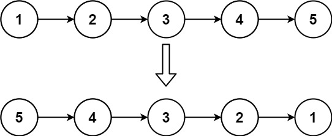

> 输入：head = [1,2,3,4,5]
>
> 输出：[5,4,3,2,1]

示例 2：

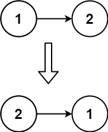

> 输入：head = [1,2]
>
> 输出：[2,1]

示例 3：

> 输入：head = []
>
> 输出：[]

提示：

- 链表中节点的数目范围是 [0, 5000]
- -5000 <= Node.val <= 5000

进阶：链表可以选用迭代或递归方式完成反转。你能否用两种方法解决这道题？

#### 206-CODE

直接通过递归可得：

```go
/**
 * Definition for singly-linked list.
 * type ListNode struct {
 *     Val int
 *     Next *ListNode
 * }
 */
func reverseList(head *ListNode) *ListNode {
    if head == nil || head.Next == nil {
        return head
    }

    p := reverseList(head.Next)
    // 将当前 head 节点，添加到已反转链表的末尾
    // 此时 head.Next 是已反转链表的尾节点（即原链表的倒数第二个节点）
    head.Next.Next = head
    head.Next = nil
    return p
}
```

迭代版本：

```go
/**
 * Definition for singly-linked list.
 * type ListNode struct {
 *     Val int
 *     Next *ListNode
 * }
 */
func reverseList(head *ListNode) *ListNode {
    var newHead *ListNode
    for head != nil {
        tmp := head.Next
        head.Next = newHead
        newHead = head
        head = tmp
    }
    return newHead
}
```

### 7. [234.回文链表](https://leetcode.cn/problems/palindrome-linked-list/description/?envType=study-plan-v2&envId=top-100-liked)

#### 234-DESC

给你一个单链表的头节点 head ，请你判断该链表是否为回文链表。如果是，返回 true ；否则，返回 false 。

示例 1：
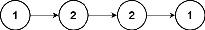

> 输入：head = [1,2,2,1]
>
> 输出：true

示例 2：


> 输入：head = [1,2]
>
> 输出：false

提示：

- 链表中节点数目在范围[1, 105] 内
- 0 <= Node.val <= 9

进阶：你能否用 O(n) 时间复杂度和 O(1) 空间复杂度解决此题？

#### 234-CODE

这道题要使用前面的反转，思路很简单，先遍历一遍，拿到链表长度，然后从中间断开，后半段反转，然后跟前半段比较：

```go
/**
 * Definition for singly-linked list.
 * type ListNode struct {
 *     Val int
 *     Next *ListNode
 * }
 */
func isPalindrome(head *ListNode) bool {
    count := 0
    p := head
    for p != nil {
        p = p.Next
        count++
    }
    count = (count + 1) / 2
    p, q := head, head
    for count > 0 {
        q = q.Next
        count--
    }
    q = reverseList(q)
    for q != nil {
        if p.Val != q.Val {
            return false
        }
        p = p.Next
        q = q.Next
    }

    return true
}

func reverseList(head *ListNode) *ListNode {
    var newHead *ListNode
    for head != nil {
        tmp := head.Next
        head.Next = newHead
        newHead = head
        head = tmp
    }
    return newHead
}
```

### 8. [141.环形链表](https://leetcode.cn/problems/linked-list-cycle/description/?envType=study-plan-v2&envId=top-100-liked)

#### 141-DESC

给你一个链表的头节点 head ，判断链表中是否有环。

如果链表中有某个节点，可以通过连续跟踪 next 指针再次到达，则链表中存在环。 为了表示给定链表中的环，评测系统内部使用整数 pos 来表示链表尾连接到链表中的位置（索引从 0 开始）。注意：pos 不作为参数进行传递 。仅仅是为了标识链表的实际情况。

如果链表中存在环 ，则返回 true 。 否则，返回 false 。

示例 1：

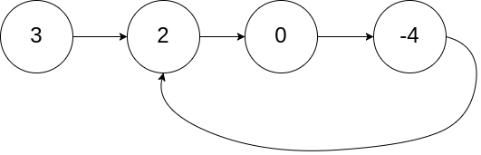

> 输入：head = [3,2,0,-4], pos = 1
>
> 输出：true
>
> 解释：链表中有一个环，其尾部连接到第二个节点。

示例 2：

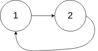

> 输入：head = [1,2], pos = 0
>
> 输出：true
>
> 解释：链表中有一个环，其尾部连接到第一个节点。

示例 3：

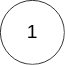

> 输入：head = [1], pos = -1
>
> 输出：false
>
> 解释：链表中没有环。

提示：

- 链表中节点的数目范围是 [0, 104]
- -105 <= Node.val <= 105
- pos 为 -1 或者链表中的一个 有效索引 。

进阶：你能用 O(1)（即，常量）内存解决此问题吗？

#### 141-CODE

- [141.linked-list-cycle.go](../code/leetcode2026/141.linked-list-cycle.go)

典型的快慢指针的题目：

```go
/**
 * Definition for singly-linked list.
 * type ListNode struct {
 *     Val int
 *     Next *ListNode
 * }
 */
func hasCycle(head *ListNode) bool {
    fast, slow := head, head
    for fast != nil && fast.Next != nil {
        slow = slow.Next
        fast = fast.Next.Next
        if fast == slow {
            return true
        }
    }

    return false
}
```

### 9. [142.环形链表 II](https://leetcode.cn/problems/linked-list-cycle-ii/description/?envType=study-plan-v2&envId=top-100-liked)

#### 142-DESC

给定一个链表的头节点  head ，返回链表开始入环的第一个节点。 如果链表无环，则返回 null。

如果链表中有某个节点，可以通过连续跟踪 next 指针再次到达，则链表中存在环。 为了表示给定链表中的环，评测系统内部使用整数 pos 来表示链表尾连接到链表中的位置（索引从 0 开始）。如果 pos 是 -1，则在该链表中没有环。注意：pos 不作为参数进行传递，仅仅是为了标识链表的实际情况。

不允许修改 链表。

示例 1：


> 输入：head = [3,2,0,-4], pos = 1
>
> 输出：返回索引为 1 的链表节点
>
> 解释：链表中有一个环，其尾部连接到第二个节点。

示例 2：


> 输入：head = [1,2], pos = 0
>
> 输出：返回索引为 0 的链表节点
>
> 解释：链表中有一个环，其尾部连接到第一个节点。

示例 3：


> 输入：head = [1], pos = -1
>
> 输出：返回 null
>
> 解释：链表中没有环。

提示：

- 链表中节点的数目范围在范围 [0, 104] 内
- -105 <= Node.val <= 105
- pos 的值为 -1 或者链表中的一个有效索引

进阶：你是否可以使用 O(1) 空间解决此题？

#### 412-CODE

- [141.linked-list-cycle-ii.go](../code/leetcode2026/141.linked-list-cycle-ii.go)

假设：

- a：链表头节点到环入口节点的距离。
- b：环入口节点到快慢指针第一次相遇节点的距离。
- c：相遇节点沿环继续走到环入口节点的距离。

当快慢指针在环内第一次相遇时：

- 慢指针 slow 走过的距离是 a + b。
- 快指针 fast 走过的距离是 a + b + n*(b+c)，其中 n 是快指针在环内多走的圈数。

因为快指针速度是慢指针的2倍，所以：

> 2 * (a + b) = a + b + n*(b+c)
>
> a + b = n*(b+c)
>
> a = n*(b+c) - b
>
> a = (n-1) * (b+c) + c

结论：a 等于 c 加上 (n-1) 圈环的长度。

这意味着：当一个指针从链表头部出发，另一个指针从相遇点出发，两者以相同的速度前进，它们最终一定会在环的入口节点相遇。

```go
/**
 * Definition for singly-linked list.
 * type ListNode struct {
 *     Val int
 *     Next *ListNode
 * }
 */
func detectCycle(head *ListNode) *ListNode {
    if head == nil || head.Next == nil {
        return nil
    }

    // 1. 第一阶段：判断是否有环
    slow, fast := head, head
    for fast != nil && fast.Next != nil {
        slow = slow.Next
        fast = fast.Next.Next
        if slow == fast {
            // 有环，进入第二阶段
            // 2. 第二阶段：找到环的入口
            ptr := head
            for ptr != slow {
                ptr = ptr.Next
                slow = slow.Next
            }
            return ptr // 环的入口节点
        }
    }

    return nil
}
```

### 10. [21.合并两个有序链表](https://leetcode.cn/problems/merge-two-sorted-lists/description/?envType=study-plan-v2&envId=top-100-liked)

#### 21-DESC

将两个升序链表合并为一个新的 升序 链表并返回。新链表是通过拼接给定的两个链表的所有节点组成的。

示例 1：

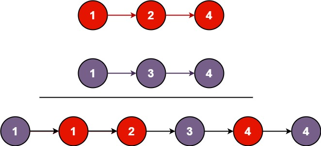

> 输入：l1 = [1,2,4], l2 = [1,3,4]
>
> 输出：[1,1,2,3,4,4]

示例 2：

> 输入：l1 = [], l2 = []
>
> 输出：[]

示例 3：

> 输入：l1 = [], l2 = [0]
>
> 输出：[0]

提示：

- 两个链表的节点数目范围是 [0, 50]
- -100 <= Node.val <= 100
- l1 和 l2 均按 非递减顺序 排列

#### 21-CODE

- [21.merge-two-sorted-lists.go](../code/leetcode2026/21.merge-two-sorted-lists.go)

简单方法，遍历完存到数组，然后遍历数组建立链表

```go
/**
 * Definition for singly-linked list.
 * type ListNode struct {
 *     Val int
 *     Next *ListNode
 * }
 */
func mergeTwoLists(list1 *ListNode, list2 *ListNode) *ListNode {
    res := make([]int, 0)
    for list1 != nil && list2 != nil {
        if list1.Val < list2.Val {
            res = append(res, list1.Val)
            list1 = list1.Next
        } else {
            res = append(res, list2.Val)
            list2 = list2.Next
        }
    }
    for list1 != nil {
        res = append(res, list1.Val)
        list1 = list1.Next
    }
    for list2 != nil {
        res = append(res, list2.Val)
        list2 = list2.Next
    }

    var head, p *ListNode
    for _, v := range res {
        if head == nil {
            head = &ListNode{
                Val: v,
            }
            p = head
        } else {
            p.Next = &ListNode{
                Val: v,
            }
            p = p.Next
        }
    }

    return head
}
```

还有个解法是直接遍历，不用存储：

```go
func mergeTwoLists(list1 *ListNode, list2 *ListNode) *ListNode {
    head := &ListNode{}
    p := head
    for list1 != nil && list2 != nil {
        if list1.Val < list2.Val {
            p.Next = list1
            list1 = list1.Next
        } else {
            p.Next= list2
            list2 = list2.Next
        }
        p = p.Next
    }
    if list1 != nil {
        p.Next = list1
    } else {
        p.Next = list2
    }
    return head.Next
}
```


## review [🔝](#weekly-114)

## tip [🔝](#weekly-114)

## share [🔝](#weekly-114)

[readme](../README.md) | [previous](202608W2.md) | [next](202608W4.md)
