# Weekly #114

@Range : 2026-08-16 - 2026-08-22

@City: Hangzhou

[readme](../README.md) | [previous](202608W2.md) | [next](202608W4.md)


\**Photo by [Alex Shaw](https://unsplash.com/@matt909) on [Unsplash](https://unsplash.com/photos/woman-in-white-dress-kissing-woman-in-white-dress-IJ6sk4NQuGw)*

-[toc]

## algorithm [🔝](#weekly-114)

### 1. [73.矩阵置零](https://leetcode.cn/problems/set-matrix-zeroes/description/?envType=study-plan-v2&envId=top-100-liked)

#### 73-DESC

给定一个 m x n 的矩阵，如果一个元素为 0 ，则将其所在行和列的所有元素都设为 0 。请使用 原地 算法。

**示例 1：**


> 输入：matrix = [[1,1,1],[1,0,1],[1,1,1]]
>
> 输出：[[1,0,1],[0,0,0],[1,0,1]]

**示例 2：**


> 输入：matrix = [[0,1,2,0],[3,4,5,2],[1,3,1,5]]
>
> 输出：[[0,0,0,0],[0,4,5,0],[0,3,1,0]]

提示：

- m == matrix.length
- n == matrix[0].length
- 1 <= m, n <= 200
- -231 <= matrix[i][j] <= 231 - 1

进阶：

- 一个直观的解决方案是使用 O(mn) 的额外空间，但这并不是一个好的解决方案。
- 一个简单的改进方案是使用 O(m + n) 的额外空间，但这仍然不是最好的解决方案。
- 你能想出一个仅使用常量空间的解决方案吗？

#### 73-CODE

- [73.set-matrix-zeroes.go](../code/leetcode2026/73.set-matrix-zeroes.go)

最直观的解法是用两个数组标记需要被置零的行和列，即：遍历整个矩阵，如果发现 `matrix[i][j] == 0`，则将 `row[i]` 和 `col[j]` 标记为 true。

再次遍历整个矩阵，如果当前元素所在的行 `row[i]` 或列 `col[j]` 被标记为 true，则将该元素置为 0

```Markdown
func setZeroes(matrix [][]int) {
    m, n := len(matrix), len(matrix[0])
    rows := make([]bool, m)
    cols := make([]bool, n)

    // 记录哪些行和列需要置零
    for i := 0; i < m; i++ {
        for j := 0; j < n; j++ {
            if matrix[i][j] == 0 {
                rows[i] = true
                cols[j] = true
            }
        }
    }

    // 根据记录置零
    for i := 0; i < m; i++ {
        for j := 0; j < n; j++ {
            if rows[i] || cols[j] {
                matrix[i][j] = 0
            }
        }
    }
}
```

进阶解法：利用矩阵的第一行和第一列来充当解法一中的两个标记数组，由于第一行和第一列本身也可能包含 0，它们的原始状态会被覆盖，所以需要用两个额外的布尔变量 (row0, col0) 来单独记录它们是否原本就包含 0。

- 预处理：检查第一行和第一列是否原本就有 0，并分别用 row0 和 col0 记录。
- 标记：遍历除第一行和第一列之外的所有元素。如果 `matrix[i][j] == 0`，则将对应的标记位置 `matrix[i][0]` 和 `matrix[0][j]` 置为 0。
- 置零：再次遍历除第一行和第一列之外的所有元素。如果 `matrix[i][0] == 0` 或 `matrix[0][j] == 0`，则将 `matrix[i][j]` 置为 0。
- 收尾：根据步骤1中记录的 row0 和 col0，决定是否将第一行和第一列全部置零。
- 复杂度：时间复杂度 `O(m * n)`，空间复杂度 `O(1)`。

```Markdown
func setZeroes(matrix [][]int) {
    m, n := len(matrix), len(matrix[0])
    row0HasZero := false
    col0HasZero := false

    // 检查第一行是否有零
    for j := 0; j < n; j++ {
        if matrix[0][j] == 0 {
            row0HasZero = true
            break
        }
    }
    // 检查第一列是否有零
    for i := 0; i < m; i++ {
        if matrix[i][0] == 0 {
            col0HasZero = true
            break
        }
    }

    // 使用第一行和第一列作为标记
    for i := 1; i < m; i++ {
        for j := 1; j < n; j++ {
            if matrix[i][j] == 0 {
                matrix[i][0] = 0
                matrix[0][j] = 0
            }
        }
    }

    // 根据标记置零（除了第一行和第一列）
    for i := 1; i < m; i++ {
        for j := 1; j < n; j++ {
            if matrix[i][0] == 0 || matrix[0][j] == 0 {
                matrix[i][j] = 0
            }
        }
    }

    // 处理第一行
    if row0HasZero {
        for j := 0; j < n; j++ {
            matrix[0][j] = 0
        }
    }
    // 处理第一列
    if col0HasZero {
        for i := 0; i < m; i++ {
            matrix[i][0] = 0
        }
    }
}
```

### 2. [54.螺旋矩阵](https://leetcode.cn/problems/spiral-matrix/description/?envType=study-plan-v2&envId=top-100-liked)

#### 54-DESC

给你一个 m 行 n 列的矩阵 matrix ，请按照 顺时针螺旋顺序 ，返回矩阵中的所有元素。

示例 1：


> 输入：matrix = [[1,2,3],[4,5,6],[7,8,9]]
>
> 输出：[1,2,3,6,9,8,7,4,5]

示例 2：


> 输入：matrix = [[1,2,3,4],[5,6,7,8],[9,10,11,12]]
>
> 输出：[1,2,3,4,8,12,11,10,9,5,6,7]

提示：

- m == matrix.length
- n == matrix[i].length
- 1 <= m, n <= 10
- -100 <= matrix[i][j] <= 100

#### 54-CODE

- [54.spiral-matrix.go](../code/leetcode2026/54.spiral-matrix.go)

解法还是很直观的，遍历四个方向，需要四个变量标记边界：row、col、rowLen、colLen，就是模型实际遍历的矩形，每遍历一次就“内陷”一次，因此 row 和 col 会加一，而 rowLen 和 colLen 会减二。

需要注意的是对于左/上需要判断是否只有一行/一列，因为单行/单列只需要遍历一次就好了，再来一遍会重复。

```go
func spiralOrder(matrix [][]int) []int {
	if len(matrix) == 0 {
		return []int{}
	}
	rowLen, colLen := len(matrix), len(matrix[0])
	row, col := 0, 0
	res := make([]int, 0, rowLen*colLen)

	for rowLen > 0 && colLen > 0 {
		// 右
		for i := col; i < col+colLen; i++ {
			res = append(res, matrix[row][i])
		}
		// 下
		for i := row + 1; i < row+rowLen; i++ {
			res = append(res, matrix[i][col+colLen-1])
		}
		// 左：确保不止一行
		if rowLen > 1 {
			for i := col + colLen - 2; i >= col; i-- {
				res = append(res, matrix[row+rowLen-1][i])
			}
		}
		// 上：确保不止一列
		if colLen > 1 {
			for i := row + rowLen - 2; i > row; i-- {
				res = append(res, matrix[i][col])
			}
		}

		row++
		col++
		rowLen -= 2
		colLen -= 2
	}
	return res
}
```

### 3. [48.旋转图像](https://leetcode.cn/problems/rotate-image/description/?envType=study-plan-v2&envId=top-100-liked)

#### 48-DESC

给定一个 n × n 的二维矩阵 matrix 表示一个图像。请你将图像顺时针旋转 90 度。

你必须在 原地 旋转图像，这意味着你需要直接修改输入的二维矩阵。请不要 使用另一个矩阵来旋转图像。

示例 1：


> 输入：matrix = [[1,2,3],[4,5,6],[7,8,9]]
>
> 输出：[[7,4,1],[8,5,2],[9,6,3]]

示例 2：


> 输入：matrix = [[5,1,9,11],[2,4,8,10],[13,3,6,7],[15,14,12,16]]
>
> 输出：[[15,13,2,5],[14,3,4,1],[12,6,8,9],[16,7,10,11]]

提示：

- n == matrix.length == matrix[i].length
- 1 <= n <= 20
- -1000 <= matrix[i][j] <= 1000

#### 48-CODE

- [48.rotate-image.go](../code/leetcode2026/48.rotate-image.go)

题目要求顺时针旋转 90 度，有个技巧是通过两步实现，第一步：右上和左下对折；第二部，左右对折。

```go
func rotate(matrix [][]int) {
    // 右上 - 左下
    for i := 0; i < len(matrix); i++ {
        for j := 0; j < i; j++ {
            matrix[i][j], matrix[j][i] = matrix[j][i], matrix[i][j]
        }
    }
    // 水平对调
    for _, row := range matrix {
        i, j := 0, len(row) - 1
        for i < j {
            row[i], row[j] = row[j], row[i]
            i++
            j--
        }
    }
}
```

### 4. [240.搜索二维矩阵 II](https://leetcode.cn/problems/search-a-2d-matrix-ii/description/?envType=study-plan-v2&envId=top-100-liked)

#### 240-DESC

编写一个高效的算法来搜索 m x n 矩阵 matrix 中的一个目标值 target 。该矩阵具有以下特性：

每行的元素从左到右升序排列。
每列的元素从上到下升序排列。

示例 1：


> 输入：matrix = [[1,4,7,11,15],[2,5,8,12,19],[3,6,9,16,22],[10,13,14,17,24],[18,21,23,26,30]], target = 5
>
> 输出：true

示例 2：


> 输入：matrix = [[1,4,7,11,15],[2,5,8,12,19],[3,6,9,16,22],[10,13,14,17,24],[18,21,23,26,30]], target = 20
>
> 输出：false

提示：

- m == matrix.length
- n == matrix[i].length
- 1 <= n, m <= 300
- -109 <= matrix[i][j] <= 109
- 每行的所有元素从左到右升序排列
- 每列的所有元素从上到下升序排列
- -109 <= target <= 109

#### 240-CODE

- [240.search-a-2d-matrix-ii.go](../code/leetcode2026/240.search-a-2d-matrix-ii.go)

直观的解法，每一行做二分查找：

```Markdown
func searchMatrix(matrix [][]int, target int) bool {
    n := len(matrix[0])
    for _, row := range matrix {
        if target == row[0] || target == row[n-1] {
            return true
        }
        if target < row[0] {
            return false
        }
        if target > row[n-1] {
            continue
        }
        i, j, mid := 0, n-1, 0
        for i <= j {
            mid = (j-i)/2 + i
            if row[mid] > target {
                j = mid - 1
            } else if row[mid] < target {
                i = mid + 1
            } else {
                return true
            }
        }

    }

    return false
}
```

有一个巧妙的解法，从 **右上角** 进行查找，因为右上角是一行的最大值，而是一列的最小值，所以查找过程是：

- 若比它大，那就在下一行
- 若比它小，那就在前一列

```golang
func searchMatrix(matrix [][]int, target int) bool {
    // 从右上角模仿二叉搜索树的形式往左下角寻找
    for row, col := 0, len(matrix[0]) - 1; row < len(matrix) && col >= 0; {
        if matrix[row][col] > target {
            col -= 1
        } else if matrix[row][col] < target {
            row += 1
        } else {
            return true
        }
    }
    return false
}
```

### 5. [160.相交链表](https://leetcode.cn/problems/intersection-of-two-linked-lists/description/?envType=study-plan-v2&envId=top-100-liked)

#### 160-DESC

给你两个单链表的头节点 headA 和 headB ，请你找出并返回两个单链表相交的起始节点。如果两个链表不存在相交节点，返回 null 。

图示两个链表在节点 c1 开始相交：


题目数据 保证 整个链式结构中不存在环。

注意，函数返回结果后，链表必须 保持其原始结构 。

自定义评测：

评测系统 的输入如下（你设计的程序 不适用 此输入）：

- intersectVal - 相交的起始节点的值。如果不存在相交节点，这一值为 0
- listA - 第一个链表
- listB - 第二个链表
- skipA - 在 listA 中（从头节点开始）跳到交叉节点的节点数
- skipB - 在 listB 中（从头节点开始）跳到交叉节点的节点数

评测系统将根据这些输入创建链式数据结构，并将两个头节点 headA 和 headB 传递给你的程序。如果程序能够正确返回相交节点，那么你的解决方案将被 视作正确答案 。

示例 1：


> 输入：intersectVal = 8, listA = [4,1,8,4,5], listB = [5,6,1,8,4,5], skipA = 2, skipB = 3
>
> 输出：Intersected at '8'
>
> 解释：相交节点的值为 8 （注意，如果两个链表相交则不能为 0）。
>
> 从各自的表头开始算起，链表 A 为 [4,1,8,4,5]，链表 B 为 [5,6,1,8,4,5]。
>
> 在 A 中，相交节点前有 2 个节点；在 B 中，相交节点前有 3 个节点。
>
> — 请注意相交节点的值不为 1，因为在链表 A 和链表 B 之中值为 1 的节点 (A 中第二个节点和 B 中第三个节点) 是不同的节点。换句话说，它们在内存中指向两个不同的位置，而链表 A 和链表 B 中值为 8 的节点 (A 中第三个节点，B 中第四个节点) 在内存中指向相同的位置。

示例 2：


> 输入：intersectVal = 2, listA = [1,9,1,2,4], listB = [3,2,4], skipA = 3, skipB = 1
>
> 输出：Intersected at '2'
>
> 解释：相交节点的值为 2 （注意，如果两个链表相交则不能为 0）。
>
> 从各自的表头开始算起，链表 A 为 [1,9,1,2,4]，链表 B 为 [3,2,4]。
>
> 在 A 中，相交节点前有 3 个节点；在 B 中，相交节点前有 1 个节点。

示例 3：


> 输入：intersectVal = 0, listA = [2,6,4], listB = [1,5], skipA = 3, skipB = 2
>
> 输出：No intersection
>
> 解释：从各自的表头开始算起，链表 A 为 [2,6,4]，链表 B 为 [1,5]。
>
> 由于这两个链表不相交，所以 intersectVal 必须为 0，而 skipA 和 skipB 可以是任意值。
>
> 这两个链表不相交，因此返回 null 。

提示：

- listA 中节点数目为 m
- listB 中节点数目为 n
- 1 <= m, n <= 3 * 104
- 1 <= Node.val <= 105
- 0 <= skipA <= m
- 0 <= skipB <= n
- 如果 listA 和 listB 没有交点，intersectVal 为 0
- 如果 listA 和 listB 有交点，intersectVal == listA[skipA] == listB[skipB]

进阶：你能否设计一个时间复杂度 O(m + n) 、仅用 O(1) 内存的解决方案？

#### 160-CODE

- [160.intersection-of-two-linked-lists.go](../code/leetcode2026/160.intersection-of-two-linked-lists.go)

这题还是很简单的，首先遍历一次，计算两个链表的长度，然后长的先走几步使得两个链表处于同一起跑点，然后再遍历，若相同则返回节点，否则不存在。

```go
/**
 * Definition for singly-linked list.
 * type ListNode struct {
 *     Val int
 *     Next *ListNode
 * }
 */
func getIntersectionNode(headA, headB *ListNode) *ListNode {
    cntA, cntB := 0, 0
    pa, pb := headA, headB
    for pa != nil {
        cntA++
        pa = pa.Next
    }
    for pb != nil {
        cntB++
        pb = pb.Next
    }
    pa, pb = headA, headB
    if cntA > cntB {
        for i := cntA - cntB; i > 0; i-- {
            pa = pa.Next
        }
    } else if cntA < cntB {
        for i := cntB - cntA; i > 0; i-- {
            pb = pb.Next
        }
    }

    for pa != nil {
        if pa == pb {
            return pa
        }
        pa = pa.Next
        pb = pb.Next
    }

    return nil
}
```

还有一个非常巧妙的解法：通过让两个指针“走完自己的路，再去走对方的路”，来消除两条链表长度差带来的影响：

我们假设：

- 链表A的不相交部分有 a 个节点。
- 链表B的不相交部分有 b 个节点。
- 两个链表的公共相交部分有 c 个节点

情况一：链表相交 (c > 0)

- 指针 p1 走过的路径是：A链表全部 (a+c) + B链表的不相交部分 (b)，总步数为 a + c + b。
- 指针 p2 走过的路径是：B链表全部 (b+c) + A链表的不相交部分 (a)，总步数为 b + c + a。
- 两者走过的总步数 相等 (a + b + c)。因此，它们会同时到达相交部分的第一个节点。

情况二：链表不相交 (c = 0)

- 指针 p1 会走完 A链表 (a) + B链表 (b)，总步数 a + b。
- 指针 p2 会走完 B链表 (b) + A链表 (a)，总步数 b + a。
- 两者走过的总步数同样 相等。因此，它们会同时到达链表的末尾，即都变为 null。

无论是哪种情况，两个指针走过的总路程都相同，这保证了它们最终会“相遇”（在交点或null处）。

```go
/**
 * Definition for singly-linked list.
 * type ListNode struct {
 *     Val int
 *     Next *ListNode
 * }
 */
func getIntersectionNode(headA, headB *ListNode) *ListNode {
    if headA == nil || headB == nil {
        return nil
    }
    p1, p2 := headA, headB
    for p1 != p2 {
        if p1 == nil {
            p1 = headB
        } else {
            p1 = p1.Next
        }
        if p2 == nil {
            p2 = headA
        } else {
            p2 = p2.Next
        }
    }
    return p1
}
```

### 6. [206.反转链表](https://leetcode.cn/problems/reverse-linked-list/description/?envType=study-plan-v2&envId=top-100-liked)

#### 206-DESC

给你单链表的头节点 head ，请你反转链表，并返回反转后的链表。

示例 1：


> 输入：head = [1,2,3,4,5]
>
> 输出：[5,4,3,2,1]

示例 2：


> 输入：head = [1,2]
>
> 输出：[2,1]

示例 3：

> 输入：head = []
>
> 输出：[]

提示：

- 链表中节点的数目范围是 [0, 5000]
- -5000 <= Node.val <= 5000

进阶：链表可以选用迭代或递归方式完成反转。你能否用两种方法解决这道题？

#### 206-CODE

直接通过递归可得：

```go
/**
 * Definition for singly-linked list.
 * type ListNode struct {
 *     Val int
 *     Next *ListNode
 * }
 */
func reverseList(head *ListNode) *ListNode {
    if head == nil || head.Next == nil {
        return head
    }

    p := reverseList(head.Next)
    // 将当前 head 节点，添加到已反转链表的末尾
    // 此时 head.Next 是已反转链表的尾节点（即原链表的倒数第二个节点）
    head.Next.Next = head
    head.Next = nil
    return p
}
```

迭代版本：

```go
/**
 * Definition for singly-linked list.
 * type ListNode struct {
 *     Val int
 *     Next *ListNode
 * }
 */
func reverseList(head *ListNode) *ListNode {
    var newHead *ListNode
    for head != nil {
        tmp := head.Next
        head.Next = newHead
        newHead = head
        head = tmp
    }
    return newHead
}
```

### 7. [234.回文链表](https://leetcode.cn/problems/palindrome-linked-list/description/?envType=study-plan-v2&envId=top-100-liked)

#### 234-DESC

给你一个单链表的头节点 head ，请你判断该链表是否为回文链表。如果是，返回 true ；否则，返回 false 。

示例 1：


> 输入：head = [1,2,2,1]
>
> 输出：true

示例 2：


> 输入：head = [1,2]
>
> 输出：false

提示：

- 链表中节点数目在范围[1, 105] 内
- 0 <= Node.val <= 9

进阶：你能否用 O(n) 时间复杂度和 O(1) 空间复杂度解决此题？

#### 234-CODE

这道题要使用前面的反转，思路很简单，先遍历一遍，拿到链表长度，然后从中间断开，后半段反转，然后跟前半段比较：

```go
/**
 * Definition for singly-linked list.
 * type ListNode struct {
 *     Val int
 *     Next *ListNode
 * }
 */
func isPalindrome(head *ListNode) bool {
    count := 0
    p := head
    for p != nil {
        p = p.Next
        count++
    }
    count = (count + 1) / 2
    p, q := head, head
    for count > 0 {
        q = q.Next
        count--
    }
    q = reverseList(q)
    for q != nil {
        if p.Val != q.Val {
            return false
        }
        p = p.Next
        q = q.Next
    }

    return true
}

func reverseList(head *ListNode) *ListNode {
    var newHead *ListNode
    for head != nil {
        tmp := head.Next
        head.Next = newHead
        newHead = head
        head = tmp
    }
    return newHead
}
```

### 8. [141.环形链表](https://leetcode.cn/problems/linked-list-cycle/description/?envType=study-plan-v2&envId=top-100-liked)

#### 141-DESC

给你一个链表的头节点 head ，判断链表中是否有环。

如果链表中有某个节点，可以通过连续跟踪 next 指针再次到达，则链表中存在环。 为了表示给定链表中的环，评测系统内部使用整数 pos 来表示链表尾连接到链表中的位置（索引从 0 开始）。注意：pos 不作为参数进行传递 。仅仅是为了标识链表的实际情况。

如果链表中存在环 ，则返回 true 。 否则，返回 false 。

示例 1：


> 输入：head = [3,2,0,-4], pos = 1
>
> 输出：true
>
> 解释：链表中有一个环，其尾部连接到第二个节点。

示例 2：


> 输入：head = [1,2], pos = 0
>
> 输出：true
>
> 解释：链表中有一个环，其尾部连接到第一个节点。

示例 3：


> 输入：head = [1], pos = -1
>
> 输出：false
>
> 解释：链表中没有环。

提示：

- 链表中节点的数目范围是 [0, 104]
- -105 <= Node.val <= 105
- pos 为 -1 或者链表中的一个 有效索引 。

进阶：你能用 O(1)（即，常量）内存解决此问题吗？

#### 141-CODE

- [141.linked-list-cycle.go](../code/leetcode2026/141.linked-list-cycle.go)

典型的快慢指针的题目：

```go
/**
 * Definition for singly-linked list.
 * type ListNode struct {
 *     Val int
 *     Next *ListNode
 * }
 */
func hasCycle(head *ListNode) bool {
    fast, slow := head, head
    for fast != nil && fast.Next != nil {
        slow = slow.Next
        fast = fast.Next.Next
        if fast == slow {
            return true
        }
    }

    return false
}
```

### 9. [142.环形链表 II](https://leetcode.cn/problems/linked-list-cycle-ii/description/?envType=study-plan-v2&envId=top-100-liked)

#### 142-DESC

给定一个链表的头节点  head ，返回链表开始入环的第一个节点。 如果链表无环，则返回 null。

如果链表中有某个节点，可以通过连续跟踪 next 指针再次到达，则链表中存在环。 为了表示给定链表中的环，评测系统内部使用整数 pos 来表示链表尾连接到链表中的位置（索引从 0 开始）。如果 pos 是 -1，则在该链表中没有环。注意：pos 不作为参数进行传递，仅仅是为了标识链表的实际情况。

不允许修改 链表。

示例 1：


> 输入：head = [3,2,0,-4], pos = 1
>
> 输出：返回索引为 1 的链表节点
>
> 解释：链表中有一个环，其尾部连接到第二个节点。

示例 2：


> 输入：head = [1,2], pos = 0
>
> 输出：返回索引为 0 的链表节点
>
> 解释：链表中有一个环，其尾部连接到第一个节点。

示例 3：


> 输入：head = [1], pos = -1
>
> 输出：返回 null
>
> 解释：链表中没有环。

提示：

- 链表中节点的数目范围在范围 [0, 104] 内
- -105 <= Node.val <= 105
- pos 的值为 -1 或者链表中的一个有效索引

进阶：你是否可以使用 O(1) 空间解决此题？

#### 412-CODE

- [141.linked-list-cycle-ii.go](../code/leetcode2026/141.linked-list-cycle-ii.go)

假设：

- a：链表头节点到环入口节点的距离。
- b：环入口节点到快慢指针第一次相遇节点的距离。
- c：相遇节点沿环继续走到环入口节点的距离。

当快慢指针在环内第一次相遇时：

- 慢指针 slow 走过的距离是 a + b。
- 快指针 fast 走过的距离是 a + b + n*(b+c)，其中 n 是快指针在环内多走的圈数。

因为快指针速度是慢指针的2倍，所以：

> 2 * (a + b) = a + b + n*(b+c)
>
> a + b = n*(b+c)
>
> a = n*(b+c) - b
>
> a = (n-1) * (b+c) + c

结论：a 等于 c 加上 (n-1) 圈环的长度。

这意味着：当一个指针从链表头部出发，另一个指针从相遇点出发，两者以相同的速度前进，它们最终一定会在环的入口节点相遇。

```go
/**
 * Definition for singly-linked list.
 * type ListNode struct {
 *     Val int
 *     Next *ListNode
 * }
 */
func detectCycle(head *ListNode) *ListNode {
    if head == nil || head.Next == nil {
        return nil
    }

    // 1. 第一阶段：判断是否有环
    slow, fast := head, head
    for fast != nil && fast.Next != nil {
        slow = slow.Next
        fast = fast.Next.Next
        if slow == fast {
            // 有环，进入第二阶段
            // 2. 第二阶段：找到环的入口
            ptr := head
            for ptr != slow {
                ptr = ptr.Next
                slow = slow.Next
            }
            return ptr // 环的入口节点
        }
    }

    return nil
}
```

### 10. [21.合并两个有序链表](https://leetcode.cn/problems/merge-two-sorted-lists/description/?envType=study-plan-v2&envId=top-100-liked)

#### 21-DESC

将两个升序链表合并为一个新的 升序 链表并返回。新链表是通过拼接给定的两个链表的所有节点组成的。

示例 1：


> 输入：l1 = [1,2,4], l2 = [1,3,4]
>
> 输出：[1,1,2,3,4,4]

示例 2：

> 输入：l1 = [], l2 = []
>
> 输出：[]

示例 3：

> 输入：l1 = [], l2 = [0]
>
> 输出：[0]

提示：

- 两个链表的节点数目范围是 [0, 50]
- -100 <= Node.val <= 100
- l1 和 l2 均按 非递减顺序 排列

#### 21-CODE

- [21.merge-two-sorted-lists.go](../code/leetcode2026/21.merge-two-sorted-lists.go)

简单方法，遍历完存到数组，然后遍历数组建立链表

```go
/**
 * Definition for singly-linked list.
 * type ListNode struct {
 *     Val int
 *     Next *ListNode
 * }
 */
func mergeTwoLists(list1 *ListNode, list2 *ListNode) *ListNode {
    res := make([]int, 0)
    for list1 != nil && list2 != nil {
        if list1.Val < list2.Val {
            res = append(res, list1.Val)
            list1 = list1.Next
        } else {
            res = append(res, list2.Val)
            list2 = list2.Next
        }
    }
    for list1 != nil {
        res = append(res, list1.Val)
        list1 = list1.Next
    }
    for list2 != nil {
        res = append(res, list2.Val)
        list2 = list2.Next
    }

    var head, p *ListNode
    for _, v := range res {
        if head == nil {
            head = &ListNode{
                Val: v,
            }
            p = head
        } else {
            p.Next = &ListNode{
                Val: v,
            }
            p = p.Next
        }
    }

    return head
}
```

还有个解法是直接遍历，不用存储：

```go
func mergeTwoLists(list1 *ListNode, list2 *ListNode) *ListNode {
    head := &ListNode{}
    p := head
    for list1 != nil && list2 != nil {
        if list1.Val < list2.Val {
            p.Next = list1
            list1 = list1.Next
        } else {
            p.Next= list2
            list2 = list2.Next
        }
        p = p.Next
    }
    if list1 != nil {
        p.Next = list1
    } else {
        p.Next = list2
    }
    return head.Next
}
```

### 11. [2.两数相加](https://leetcode.cn/problems/add-two-numbers/description/?envType=study-plan-v2&envId=top-100-liked)

#### 2-DESC

给你两个 非空 的链表，表示两个非负的整数。它们每位数字都是按照 逆序 的方式存储的，并且每个节点只能存储 一位 数字。

请你将两个数相加，并以相同形式返回一个表示和的链表。

你可以假设除了数字 0 之外，这两个数都不会以 0 开头。

示例 1：

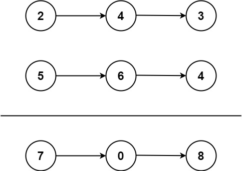

> 输入：l1 = [2,4,3], l2 = [5,6,4]
>
> 输出：[7,0,8]
>
> 解释：342 + 465 = 807.

示例 2：

> 输入：l1 = [0], l2 = [0]
>
> 输出：[0]

示例 3：

> 输入：l1 = [9,9,9,9,9,9,9], l2 = [9,9,9,9]
>
> 输出：[8,9,9,9,0,0,0,1]

提示：

- 每个链表中的节点数在范围 [1, 100] 内
- 0 <= Node.val <= 9
- 题目数据保证列表表示的数字不含前导零

#### 2-CODE

- [2.add-two-numbers.go](../code/leetcode2026/2.add-two-numbers.go)

遍历两个链表，不断累加，不是很优雅：

```go
/**
 * Definition for singly-linked list.
 * type ListNode struct {
 *     Val int
 *     Next *ListNode
 * }
 */
func addTwoNumbers(l1 *ListNode, l2 *ListNode) *ListNode {
    if l1 == nil {
        return l2
    }
    if l2 == nil {
        return l1
    }
    carry := 0
    res, tmp := l1, l1
    for l1 != nil && l2 != nil {
        carry = carry + l1.Val + l2.Val
        l1.Val = carry % 10
        carry = carry / 10
        tmp = l1
        l1 = l1.Next
        l2 = l2.Next
    }
    for l1 != nil {
        carry = carry + l1.Val
        l1.Val = carry % 10
        carry = carry / 10
        tmp = l1
        l1 = l1.Next
    }
    tmp.Next = l2
    l1 = l2
    for l1 != nil {
        carry = carry + l1.Val
        l1.Val = carry % 10
        carry = carry / 10
        tmp = l1
        l1 = l1.Next
    }
    if carry != 0 {
        tmp.Next = &ListNode{
            Val: carry,
        }
    }

    return res
}
```

看了下提交代码的示例，优雅的写法：

```go
/**
 * Definition for singly-linked list.
 * type ListNode struct {
 *     Val int
 *     Next *ListNode
 * }
 */
func addTwoNumbers(l1 *ListNode, l2 *ListNode) *ListNode {
    dummy := &ListNode{}
    curr := dummy
    carry := 0

    for l1!= nil || l2 !=nil{
        v1,v2 := 0,0
        if l1!=nil {
            v1 = l1.Val
            l1 = l1.Next
        }
        if l2 != nil {
            v2 = l2.Val
            l2 = l2.Next
        }
        sumnum := v1+v2+carry

        curr.Next = &ListNode{}

        curr.Next.Val = sumnum%10
        carry = sumnum/10
        curr = curr.Next
    }
    if carry >0 {
        curr.Next = &ListNode{}
        curr.Next.Val = carry
    }
    return dummy.Next
}
```

### 12. [19.删除链表的倒数第 N 个结点](https://leetcode.cn/problems/remove-nth-node-from-end-of-list/description/?envType=study-plan-v2&envId=top-100-liked)

#### 19-DESC

给你一个链表，删除链表的倒数第 n 个结点，并且返回链表的头结点。

示例 1：

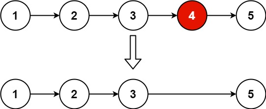

> 输入：head = [1,2,3,4,5], n = 2
>
> 输出：[1,2,3,5]

示例 2：

> 输入：head = [1], n = 1
>
> 输出：[]

示例 3：

> 输入：head = [1,2], n = 1
>
> 输出：[1]

提示：

- 链表中结点的数目为 sz
- 1 <= sz <= 30
- 0 <= Node.val <= 100
- 1 <= n <= sz

进阶：你能尝试使用一趟扫描实现吗？

#### 19-CODE

- [19.remove-nth-node-from-end-of-list.go](../code/leetcode2026/19.remove-nth-node-from-end-of-list.go)

又是一个快慢指针的问题，倒数第 N 个，实际上就是前面的指针先跑 N 步，然后快慢指针一起走，直到快的指针为空，慢的指针就是要踢掉的节点：

```go
/**
 * Definition for singly-linked list.
 * type ListNode struct {
 *     Val int
 *     Next *ListNode
 * }
 */
func removeNthFromEnd(head *ListNode, n int) *ListNode {
    p, q := head, head
    pre := &ListNode{
        Next: head,
    }
    res := pre
    for n > 0 {
        q = q.Next
        n--
    }
    for q != nil {
        pre = p
        p = p.Next
        q = q.Next
    }
    pre.Next = pre.Next.Next

    return res.Next
}
```

### 13. [24.两两交换链表中的节点](https://leetcode.cn/problems/swap-nodes-in-pairs/description/?envType=study-plan-v2&envId=top-100-liked)

#### 24-DESC

给你一个链表，两两交换其中相邻的节点，并返回交换后链表的头节点。你必须在不修改节点内部的值的情况下完成本题（即， **只能进行节点交换** ）。

示例 1：

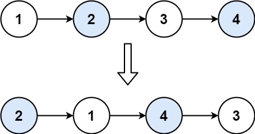

> 输入：head = [1,2,3,4]
>
> 输出：[2,1,4,3]

示例 2：

> 输入：head = []
>
> 输出：[]

示例 3：

> 输入：head = [1]
>
> 输出：[1]

提示：

- 链表中节点的数目在范围 [0, 100] 内
- 0 <= Node.val <= 100

#### 24-CODE

- [24.swap-nodes-in-pairs.go](../code/leetcode2026/24.swap-nodes-in-pairs.go)

```go
/**
 * Definition for singly-linked list.
 * type ListNode struct {
 *     Val int
 *     Next *ListNode
 * }
 */
func swapPairs(head *ListNode) *ListNode {
    p, q := head, head
    newHead := &ListNode{
        Next: head,
    }
    tmp := newHead
    for p != nil && p.Next != nil {
        q = p.Next

        p.Next = q.Next
        q.Next = p
        tmp.Next = q

        tmp = p
        p = p.Next
    }

    return newHead.Next
}
```

### 14. [25.K 个一组翻转链表](https://leetcode.cn/problems/reverse-nodes-in-k-group/?envType=study-plan-v2&envId=top-100-liked)

#### 25-DESC

给你链表的头节点 head ，每 k 个节点一组进行翻转，请你返回修改后的链表。

k 是一个正整数，它的值小于或等于链表的长度。如果节点总数不是 k 的整数倍，那么请将最后剩余的节点保持原有顺序。

你不能只是单纯的改变节点内部的值，而是需要实际进行节点交换。

示例 1：

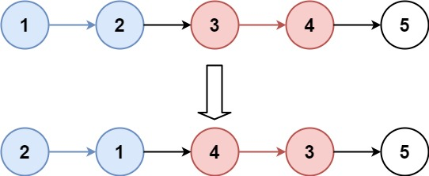

> 输入：head = [1,2,3,4,5], k = 2
>
> 输出：[2,1,4,3,5]

示例 2：

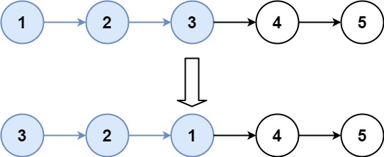

> 输入：head = [1,2,3,4,5], k = 3
>
> 输出：[3,2,1,4,5]

提示：

- 链表中的节点数目为 n
- 1 <= k <= n <= 5000
- 0 <= Node.val <= 1000

进阶：你可以设计一个只用 O(1) 额外内存空间的算法解决此问题吗？

#### 25-CODE

- [25.reverse-nodes-in-k-group.go](../code/leetcode2026/25.reverse-nodes-in-k-group.go)

这个题不愧是 hard，确实复杂，看题解都有点头疼，果然还是题刷少了，让 deepseek 给我解答：

- 使用虚拟头节点 dummy 简化边界处理。
- 遍历链表，每次检查当前剩余节点是否不足 k 个，若是则直接结束。
- 对当前组的 k 个节点进行翻转：
    - 使用 prev、curr、next 三个指针完成局部翻转。
    - 翻转后将该组重新接入链表。
- 移动指针到下一组的前驱位置，继续循环。

```go
/**
 * Definition for singly-linked list.
 * type ListNode struct {
 *     Val int
 *     Next *ListNode
 * }
 */
func reverseKGroup(head *ListNode, k int) *ListNode {
    dummy := &ListNode{Next: head}
    prev := dummy // 上一组的尾巴，最开始指向虚拟头

    for {
        // 1. 【切】检查从 prev 开始，有没有 k 个节点？
        check := prev
        for i := 0; i < k; i++ {
            check = check.Next
            if check == nil { // 不够？不翻了，直接回家
                return dummy.Next
            }
        }

        // 2. 【翻】翻转这一组
        curr := prev.Next      // curr 是当前组第一个节点（例如例子的 1）
        next := curr.Next      // next 是当前组第二个节点（例如例子的 2）

        // 为什么循环 k-1 次？因为 2 个节点只需要交换 1 次指针
        for i := 0; i < k-1; i++ {
            temp := next.Next   // 先保存 2 后面的节点（防止丢了 3）
            next.Next = curr    // 关键！让 2 指向 1 (反转)
            curr = next         // 指针后移，准备翻下一个
            next = temp         // 指针后移
        }

        // 3. 【接】把翻好的组接回去
        // 注意：此时的 curr 已经是原来最后一个节点（例子中的 2）
        // 注意：此时的 next 已经是下一组的头（例子中的 3）
        groupHead := prev.Next   // 原来的组头（例子中的 1），现在它变成组尾了
        prev.Next = curr         // 上一组尾巴指向新组头（例如 dummy 指向 2）
        groupHead.Next = next    // 新组尾指向下一组头（例如 1 指向 3）
        prev = groupHead         // 移动 prev 到这一组的尾巴（1），准备下一轮
    }
}
```

### 15. [138.随机链表的复制](https://leetcode.cn/problems/copy-list-with-random-pointer/description/?envType=study-plan-v2&envId=top-100-liked)

#### 138-DESC

给你一个长度为 n 的链表，每个节点包含一个额外增加的随机指针 random ，该指针可以指向链表中的任何节点或空节点。

构造这个链表的 深拷贝。 深拷贝应该正好由 n 个 全新 节点组成，其中每个新节点的值都设为其对应的原节点的值。新节点的 next 指针和 random 指针也都应指向复制链表中的新节点，并使原链表和复制链表中的这些指针能够表示相同的链表状态。复制链表中的指针都不应指向原链表中的节点 。

例如，如果原链表中有 X 和 Y 两个节点，其中 X.random --> Y 。那么在复制链表中对应的两个节点 x 和 y ，同样有 x.random --> y 。

返回复制链表的头节点。

用一个由 n 个节点组成的链表来表示输入/输出中的链表。每个节点用一个 [val, random_index] 表示：

val：一个表示 Node.val 的整数。
random_index：随机指针指向的节点索引（范围从 0 到 n-1）；如果不指向任何节点，则为  null 。
你的代码 只 接受原链表的头节点 head 作为传入参数。

示例 1：

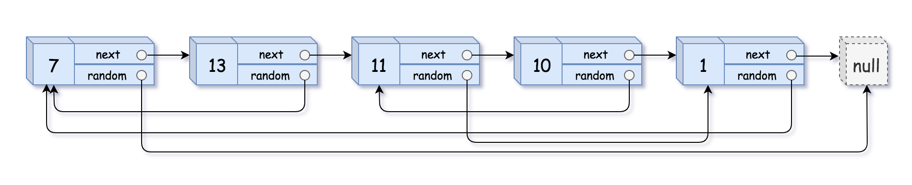

> 输入：head = [[7,null],[13,0],[11,4],[10,2],[1,0]]
>
> 输出：[[7,null],[13,0],[11,4],[10,2],[1,0]]

示例 2：


输入：head = [[1,1],[2,1]]
输出：[[1,1],[2,1]]
示例 3：


> 输入：head = [[3,null],[3,0],[3,null]]
>
> 输出：[[3,null],[3,0],[3,null]]

提示：

- 0 <= n <= 1000
- -104 <= Node.val <= 104
- Node.random 为 null 或指向链表中的节点。

#### 138-CODE

本题的核心是建立原节点到新节点的映射关系。最清晰、不易出错的方法是使用哈希表（`map[*Node]*Node`）。

第一步：复制节点。遍历原链表，为每个原节点创建一个值相同的新节点，并将映射关系 (原节点 -> 新节点) 存入哈希表。

第二步：连接指针。再次遍历原链表，利用哈希表快速找到当前节点对应的新节点，然后设置其 Next 和 Random 指针。

```go
/**
 * Definition for a Node.
 * type Node struct {
 *     Val int
 *     Next *Node
 *     Random *Node
 * }
 */

func copyRandomList(head *Node) *Node {
    if head == nil {
        return nil
    }

    // 1. 建立原节点到新节点的映射
    cache := make(map[*Node]*Node)
    cur := head
    for cur != nil {
        cache[cur] = &Node{Val: cur.Val}
        cur = cur.Next
    }

    // 2. 连接新节点的 Next 和 Random 指针
    cur = head
    for cur != nil {
        // 从 map 中取出当前节点对应的新节点
        newNode := cache[cur]
        // 设置新节点的 Next 指针
        newNode.Next = cache[cur.Next]
        // 设置新节点的 Random 指针
        newNode.Random = cache[cur.Random]
        cur = cur.Next
    }

    // 返回原头节点对应的新节点
    return cache[head]
}
```

还有一种巧妙解法，不需要哈希表，空间复杂度可以做到 O(1)（不计返回的链表本身）。

核心思想：我们将链表 A -> B -> C 变成 A -> A' -> B -> B' -> C -> C'（其中 A' 是 A 的复制节点）。

第 1 步：插入复制节点（挨个“克隆”）
遍历原链表，为每个原节点 cur 创建一个复制节点 copy，然后把 copy 插入到 cur 和 cur.Next 之间。

第 2 步：设置 Random 指针（利用相邻关系）
再次遍历这个新旧交替的链表。

原节点 cur 的复制节点是 cur.Next。

如果 cur.Random 指向 B，那么 cur.Next.Random 就应该指向 B.Next（也就是 B 的复制节点 B'）。

第 3 步：拆分链表（“脱钩”）
把原链表和新链表拆开。恢复原链表的 Next 指针，同时把复制节点的 Next 指针串联起来。

```go
/**
 * Definition for a Node.
 * type Node struct {
 *     Val int
 *     Next *Node
 *     Random *Node
 * }
 */

func copyRandomList(head *Node) *Node {
    if head == nil {
        return nil
    }

    // ========== 第一步：穿插复制节点 ==========
    cur := head
    for cur != nil {
        // 创建复制节点
        copyNode := &Node{Val: cur.Val}

        // 插入到当前节点和下一个节点之间
        copyNode.Next = cur.Next
        cur.Next = copyNode

        // 移动到下一个原节点（跳过刚插入的复制节点）
        cur = copyNode.Next
    }

    // ========== 第二步：设置复制节点的 Random 指针 ==========
    cur = head
    for cur != nil {
        // 如果原节点有 Random 指针
        if cur.Random != nil {
            // 当前节点的复制节点(cur.Next) 的 Random
            // 指向 原节点.Random 的复制节点 (cur.Random.Next)
            cur.Next.Random = cur.Random.Next
        }
        // 移动到下一个原节点（跳两步）
        cur = cur.Next.Next
    }

    // ========== 第三步：拆分链表（分离原链表和复制链表） ==========
    // 创建虚拟头节点，方便串联复制链表
    dummy := &Node{}
    copyCur := dummy
    cur = head

    for cur != nil {
        // 1. 取出复制节点
        copyNode := cur.Next
        // 2. 将复制节点接到新链表后面
        copyCur.Next = copyNode
        copyCur = copyNode

        // 3. 恢复原链表的 Next 指针（跳过复制节点）
        cur.Next = copyNode.Next

        // 4. 继续处理下一个原节点
        cur = cur.Next
    }

    return dummy.Next
}
```

### 16. [148.排序链表](https://leetcode.cn/problems/sort-list/description/?envType=study-plan-v2&envId=top-100-liked)

#### 148-DESC

给你链表的头结点 head ，请将其按 升序 排列并返回 排序后的链表 。

示例 1：

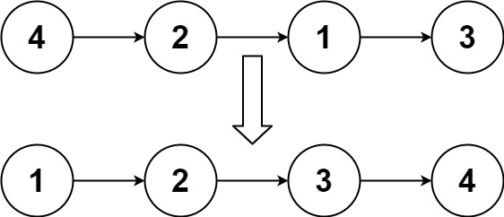

> 输入：head = [4,2,1,3]
>
> 输出：[1,2,3,4]

示例 2：

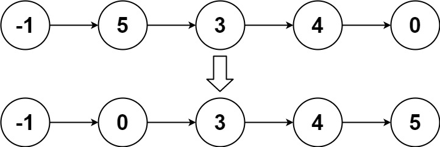

> 输入：head = [-1,5,3,4,0]
>
> 输出：[-1,0,3,4,5]

示例 3：

> 输入：head = []
>
> 输出：[]

提示：

- 链表中节点的数目在范围 `[0, 5 * 104]` 内
- -105 <= Node.val <= 105

进阶：你可以在 `O(n log n)` 时间复杂度和常数级空间复杂度下，对链表进行排序吗？

#### 148-CODE

归并排序的核心是“分治”：先分割，后合并。

- 分割：用快慢指针找到链表的中点，将链表一分为二。
- 递归排序：对左右两个子链表递归地进行排序。
- 合并：将两个已排序的子链表合并成一个有序链表。

递归版本：

```go
/**
 * Definition for singly-linked list.
 * type ListNode struct {
 *     Val int
 *     Next *ListNode
 * }
 */

func sortList(head *ListNode) *ListNode {
    if head == nil || head.Next == nil {
        return head
    }

    // 1. 找到中点，分割链表
    mid := findMid(head)
    rightHead := mid.Next
    mid.Next = nil

    // 2. 递归排序
    left := sortList(head)
    right := sortList(rightHead)

    // 3. 合并
    return merge(left, right)
}

// 快慢指针找中点
func findMid(head *ListNode) *ListNode {
    if head == nil || head.Next == nil {
        return head
    }
    slow, fast := head, head
    for fast.Next != nil && fast.Next.Next != nil {
        slow = slow.Next
        fast = fast.Next.Next
    }
    return slow
}

// 合并两个有序链表
func merge(l1, l2 *ListNode) *ListNode {
    dummy := &ListNode{}
    tail := dummy

    for l1 != nil && l2 != nil {
        if l1.Val < l2.Val {
            tail.Next = l1
            l1 = l1.Next
        } else {
            tail.Next = l2
            l2 = l2.Next
        }
        tail = tail.Next
    }

    if l1 != nil {
        tail.Next = l1
    } else {
        tail.Next = l2
    }

    return dummy.Next
}
```

迭代版本：

如果想追求常数级空间复杂度，可以用迭代的方式实现归并排序。

核心思想是自底向上：先以 1 个节点为一组进行两两合并，再以 2 个节点为一组合并，然后是 4 个、8 个……直到整个链表有序。

```go
func sortList(head *ListNode) *ListNode {
    if head == nil || head.Next == nil {
        return head
    }

    // 1. 计算链表长度
    length := 0
    for cur := head; cur != nil; cur = cur.Next {
        length++
    }

    dummy := &ListNode{Next: head}

    // 2. 逐步增加合并的步长：1, 2, 4, 8, ...
    for step := 1; step < length; step <<= 1 {
        prev, cur := dummy, dummy.Next

        for cur != nil {
            // 2.1 找到第一段的头 head1，并截取 step 个节点
            head1 := cur
            for i := 1; i < step && cur.Next != nil; i++ {
                cur = cur.Next
            }

            // 2.2 找到第二段的头 head2
            head2 := cur.Next
            cur.Next = nil // 切断第一段
            cur = head2

            // 2.3 截取第二段的 step 个节点
            for i := 1; i < step && cur != nil && cur.Next != nil; i++ {
                cur = cur.Next
            }

            // 2.4 保存下一段的起点
            next := (*ListNode)(nil)
            if cur != nil {
                next = cur.Next
                cur.Next = nil // 切断第二段
            }

            // 2.5 合并 head1 和 head2，接到 prev 后面
            prev.Next = merge(head1, head2)

            // 2.6 移动 prev 到合并后链表的尾部
            for prev.Next != nil {
                prev = prev.Next
            }

            cur = next // 处理下一组
        }
    }

    return dummy.Next
}

func merge(l1, l2 *ListNode) *ListNode {
    dummy := &ListNode{}
    tail := dummy

    for l1 != nil && l2 != nil {
        if l1.Val < l2.Val {
            tail.Next = l1
            l1 = l1.Next
        } else {
            tail.Next = l2
            l2 = l2.Next
        }
        tail = tail.Next
    }

    if l1 != nil {
        tail.Next = l1
    } else {
        tail.Next = l2
    }

    return dummy.Next
}
```

### 17. [23.合并 K 个升序链表](https://leetcode.cn/problems/merge-k-sorted-lists/description/?envType=study-plan-v2&envId=top-100-liked)

#### 23-DESC

给你一个链表数组，每个链表都已经按升序排列。

请你将所有链表合并到一个升序链表中，返回合并后的链表。

示例 1：

> 输入：lists = [[1,4,5],[1,3,4],[2,6]]
>
> 输出：[1,1,2,3,4,4,5,6]
>
> 解释：链表数组如下：
>
> [
>
> 1->4->5,
>
> 1->3->4,
>
> 2->6
>
> ]
>
> 将它们合并到一个有序链表中得到。
>
> 1->1->2->3->4->4->5->6

示例 2：

> 输入：lists = []
>
> 输出：[]

示例 3：

> 输入：lists = [[]]
>
> 输出：[]

提示：

- k == lists.length
- 0 <= k <= 10^4
- 0 <= lists[i].length <= 500
- -10^4 <= lists[i][j] <= 10^4
- lists[i] 按 升序 排列
- lists[i].length 的总和不超过 10^4

#### 23-CODE

跟前面的题类似，使用分治+递归来解决：

```go
/**
 * Definition for singly-linked list.
 * type ListNode struct {
 *     Val int
 *     Next *ListNode
 * }
 */
func mergeKLists(lists []*ListNode) *ListNode {
    if len(lists) == 0 {
        return nil
    }
    if len(lists) == 1 {
        return lists[0]
    }
    if len(lists) == 2 {
        return merge(lists[0], lists[1])
    }

    return merge(mergeKLists(lists[0: len(lists)/2]), mergeKLists(lists[len(lists)/2: len(lists)]))
}

func merge(l1, l2 *ListNode) *ListNode {
    dummy := &ListNode{}
    tail := dummy

    for l1 != nil && l2 != nil {
        if l1.Val < l2.Val {
            tail.Next = l1
            l1 = l1.Next
        } else {
            tail.Next = l2
            l2 = l2.Next
        }
        tail = tail.Next
    }

    if l1 != nil {
        tail.Next = l1
    } else {
        tail.Next = l2
    }

    return dummy.Next
}
```

### 18. [146.LRU 缓存](https://leetcode.cn/problems/lru-cache/description/?envType=study-plan-v2&envId=top-100-liked)

#### 146-DESC

请你设计并实现一个满足  LRU (最近最少使用) 缓存 约束的数据结构。
实现 LRUCache 类：
- LRUCache(int capacity) 以 正整数 作为容量 capacity 初始化 LRU 缓存
- int get(int key) 如果关键字 key 存在于缓存中，则返回关键字的值，否则返回 -1 。
- void put(int key, int value) 如果关键字 key 已经存在，则变更其数据值 value ；如果不存在，则向缓存中插入该组 key-value 。如果插入操作导致关键字数量超过 capacity ，则应该 逐出 最久未使用的关键字。

函数 get 和 put 必须以 O(1) 的平均时间复杂度运行。

示例：

> 输入
>
> ["LRUCache", "put", "put", "get", "put", "get", "put", "get", "get", "get"]
>
> [[2], [1, 1], [2, 2], [1], [3, 3], [2], [4, 4], [1], [3], [4]]
>
> 输出
>
> [null, null, null, 1, null, -1, null, -1, 3, 4]
>
> 解释
>
> LRUCache lRUCache = new LRUCache(2);
>
> lRUCache.put(1, 1); // 缓存是 {1=1}
>
> lRUCache.put(2, 2); // 缓存是 {1=1, 2=2}
>
> lRUCache.get(1);    // 返回 1
>
> lRUCache.put(3, 3); // 该操作会使得关键字 2 作废，缓存是 {1=1, 3=3}
>
> lRUCache.get(2);    // 返回 -1 (未找到)
>
> lRUCache.put(4, 4); // 该操作会使得关键字 1 作废，缓存是 {4=4, 3=3}
>
> lRUCache.get(1);    // 返回 -1 (未找到)
>
> lRUCache.get(3);    // 返回 3
>
> lRUCache.get(4);    // 返回 4

提示：

- 1 <= capacity <= 3000
- 0 <= key <= 10000
- 0 <= value <= 105
- 最多调用 2 * 105 次 get 和 put

#### 146-CODE

get 操作需要 O(1) 的查找速度，这可以通过哈希表实现。而 LRU 的核心是维护数据的访问顺序，需要快速地在头部插入新数据，以及从尾部删除最久未使用的数据，这可以通过双向链表实现。

两者结合即可满足所有要求。数据结构设计如下：

哈希表 (`map[int]*Node`)：键是 key，值是指向双向链表对应节点的指针，实现 O(1) 查找。

双向链表 (Node)：维护键值对的使用顺序。头部表示最近使用的数据，尾部表示最久未使用的数据。

虚拟头/尾节点：引入不存储数据的 head 和 tail 节点，可以简化链表在头尾的插入和删除操作。

```go
// 定义双向链表的节点
type Node struct {
    key, val int
    prev, next *Node
}

// 定义 LRU 缓存结构
type LRUCache struct {
    capacity int
    cache    map[int]*Node
    head     *Node // 虚拟头节点
    tail     *Node // 虚拟尾节点
}

// 构造函数，初始化 LRU 缓存
func Constructor(capacity int) LRUCache {
    head := &Node{}
    tail := &Node{}
    head.next = tail
    tail.prev = head
    return LRUCache{
        capacity: capacity,
        cache:    make(map[int]*Node),
        head:     head,
        tail:     tail,
    }
}

// get 操作：从缓存中获取值
func (this *LRUCache) Get(key int) int {
    // 1. 从哈希表中查找节点
    if node, ok := this.cache[key]; ok {
        // 2. 如果存在，将该节点移动到链表头部 (表示最近使用)
        this.moveToHead(node)
        return node.val
    }
    return -1
}

// put 操作：向缓存中插入或更新值
func (this *LRUCache) Put(key int, value int) {
    // 1. 尝试从哈希表中查找节点
    if node, ok := this.cache[key]; ok {
        // 2. 如果 key 存在，更新值，并将节点移到头部
        node.val = value
        this.moveToHead(node)
        return
    }

    // 3. 如果 key 不存在，检查容量是否已满
    if len(this.cache) >= this.capacity {
        // 4. 如果满了，移除链表尾部的节点 (最久未使用)
        tailNode := this.removeTail()
        delete(this.cache, tailNode.key)
    }

    // 5. 创建新节点，加入哈希表，并添加到链表头部
    newNode := &Node{key: key, val: value}
    this.cache[key] = newNode
    this.addToHead(newNode)
}

// --- 辅助方法 ---

// moveToHead: 将某个已存在的节点移动到链表头部
func (this *LRUCache) moveToHead(node *Node) {
    this.removeNode(node)
    this.addToHead(node)
}

// addToHead: 在虚拟头节点之后添加一个新节点
func (this *LRUCache) addToHead(node *Node) {
    node.prev = this.head
    node.next = this.head.next
    this.head.next.prev = node
    this.head.next = node
}

// removeNode: 从链表中移除一个节点
func (this *LRUCache) removeNode(node *Node) {
    node.prev.next = node.next
    node.next.prev = node.prev
}

// removeTail: 移除链表尾部（虚拟尾节点之前）的真实节点，并返回它
func (this *LRUCache) removeTail() *Node {
    node := this.tail.prev
    this.removeNode(node)
    return node
}
```

### 19. [460.LFU 缓存](https://leetcode.cn/problems/lfu-cache/description/)

#### 460-DESC

请你为 最不经常使用（LFU）缓存算法设计并实现数据结构。

实现 [LFUCache](https://baike.baidu.com/item/%E7%BC%93%E5%AD%98%E7%AE%97%E6%B3%95) 类：

- LFUCache(int capacity) - 用数据结构的容量 capacity 初始化对象
- int get(int key) - 如果键 key 存在于缓存中，则获取键的值，否则返回 -1 。
- void put(int key, int value) - 如果键 key 已存在，则变更其值；如果键不存在，请插入键值对。当缓存达到其容量 capacity 时，则应该在插入新项之前，移除最不经常使用的项。在此问题中，当存在平局（即两个或更多个键具有相同使用频率）时，应该去除 最久未使用 的键。
- 为了确定最不常使用的键，可以为缓存中的每个键维护一个 使用计数器 。使用计数最小的键是最久未使用的键。

当一个键首次插入到缓存中时，它的使用计数器被设置为 1 (由于 put 操作)。对缓存中的键执行 get 或 put 操作，使用计数器的值将会递增。

函数 get 和 put 必须以 O(1) 的平均时间复杂度运行。

示例：

> 输入：
>
> ["LFUCache", "put", "put", "get", "put", "get", "get", "put", "get", "get", "get"]
>
> [[2], [1, 1], [2, 2], [1], [3, 3], [2], [3], [4, 4], [1], [3], [4]]
>
> 输出：
>
> [null, null, null, 1, null, -1, 3, null, -1, 3, 4]
>
> 解释：
>
> // cnt(x) = 键 x 的使用计数
>
> // cache=[] 将显示最后一次使用的顺序（最左边的元素是最近的）
>
> LFUCache lfu = new LFUCache(2);
>
> lfu.put(1, 1);   // cache=[1,_ ], cnt(1)=1
>
> lfu.put(2, 2);   // cache=[2,1], cnt(2)=1, cnt(1)=1
>
> lfu.get(1);      // 返回 1
>
> // cache=[1,2], cnt(2)=1, cnt(1)=2
>
> lfu.put(3, 3);   // 去除键 2 ，因为 cnt(2)=1 ，使用计数最小
>
> // cache=[3,1], cnt(3)=1, cnt(1)=2
>
> lfu.get(2);      // 返回 -1（未找到）
>
> lfu.get(3);      // 返回 3
>
> // cache=[3,1], cnt(3)=2, cnt(1)=2
>
> lfu.put(4, 4);   // 去除键 1 ，1 和 3 的 cnt 相同，但 1 最久未使用
>
> // cache=[4,3], cnt(4)=1, cnt(3)=2
>
> lfu.get(1);      // 返回 -1（未找到）
>
> lfu.get(3);      // 返回 3
>
> // cache=[3,4], cnt(4)=1, cnt(3)=3
>
> lfu.get(4);      // 返回 4
>
> // cache=[3,4], cnt(4)=2, cnt(3)=3

提示：

- 1 <= capacity <= 104
- 0 <= key <= 105
- 0 <= value <= 109
- 最多调用 2 * 105 次 get 和 put 方法

#### 460-CODE

LFU 比 LRU 更复杂，因为它需要同时管理使用频次 (freq) 和访问顺序。为实现 O(1) 操作，核心是使用 “双哈希表 + 双向链表” 的数据结构组合。

- keyNodeMap (哈希表)：以 key 为键，直接指向存储该键值对信息的 Node 节点，实现 O(1) 查找。
- freqListMap (哈希表)：以 freq (使用频次) 为键，值为一个双向链表。这个链表维护了所有当前频次为 freq 的节点，并且链表头部是最近使用的，尾部是最久未使用的。
- minFreq (变量)：记录当前缓存中所有键的最小使用频次。当缓存满需要淘汰时，直接从 freqListMap[minFreq] 这个链表的尾部删除节点即可。

```go
// 定义双向链表的节点
type Node struct {
    key, val   int
    freq       int
    prev, next *Node
}

// 定义双向链表
type DoubleList struct {
    head, tail *Node
}

// 创建一个新的双向链表，带有虚拟头尾节点
func NewDoubleList() *DoubleList {
    head, tail := &Node{}, &Node{}
    head.next, tail.prev = tail, head
    return &DoubleList{head: head, tail: tail}
}

// 在链表头部添加节点 (表示最近使用)
func (this *DoubleList) AddFirst(node *Node) {
    node.next = this.head.next
    node.prev = this.head
    this.head.next.prev = node
    this.head.next = node
}

// 从链表中移除一个节点
func (this *DoubleList) Remove(node *Node) {
    node.prev.next = node.next
    node.next.prev = node.prev
    // 清空被移除节点的指针，帮助GC
    node.prev, node.next = nil, nil
}

// 移除链表尾部节点 (表示最久未使用) 并返回它
func (this *DoubleList) RemoveLast() *Node {
    if this.IsEmpty() {
        return nil
    }
    last := this.tail.prev
    this.Remove(last)
    return last
}

// 检查链表是否为空
func (this *DoubleList) IsEmpty() bool {
    return this.head.next == this.tail
}

// 定义 LFU 缓存结构
type LFUCache struct {
    capacity int
    size     int
    minFreq  int
    // key -> Node 的映射
    keyNodeMap map[int]*Node
    // freq -> DoubleList 的映射
    freqListMap map[int]*DoubleList
}

// 构造函数，初始化 LFU 缓存
func Constructor(capacity int) LFUCache {
    return LFUCache{
        capacity:    capacity,
        keyNodeMap:  make(map[int]*Node),
        freqListMap: make(map[int]*DoubleList),
    }
}

// get 操作：从缓存中获取值
func (this *LFUCache) Get(key int) int {
    if this.capacity == 0 {
        return -1
    }
    // 1. 从 keyNodeMap 中查找节点
    if node, ok := this.keyNodeMap[key]; ok {
        // 2. 如果存在，增加其频次 (内部处理链表移动)
        this.increaseFreq(node)
        return node.val
    }
    return -1
}

// put 操作：向缓存中插入或更新值
func (this *LFUCache) Put(key int, value int) {
    if this.capacity == 0 {
        return
    }
    // 1. 尝试从 keyNodeMap 中查找节点
    if node, ok := this.keyNodeMap[key]; ok {
        // 2. 如果 key 存在，更新值，并增加其频次
        node.val = value
        this.increaseFreq(node)
        return
    }

    // 3. 如果 key 不存在，检查容量是否已满
    if this.size >= this.capacity {
        // 4. 如果满了，从 freqListMap[minFreq] 链表中移除尾部节点 (最久未使用)
        list := this.freqListMap[this.minFreq]
        deletedNode := list.RemoveLast()
        // 从 keyNodeMap 中删除该节点的 key
        delete(this.keyNodeMap, deletedNode.key)
        this.size--
    }

    // 5. 创建新节点，频次为 1
    newNode := &Node{key: key, val: value, freq: 1}
    this.keyNodeMap[key] = newNode

    // 6. 将新节点加入 freqListMap[1] 的链表头部
    if this.freqListMap[1] == nil {
        this.freqListMap[1] = NewDoubleList()
    }
    this.freqListMap[1].AddFirst(newNode)

    // 7. 更新最小频次为 1
    this.minFreq = 1
    this.size++
}

// --- 辅助方法：增加节点的频次 ---
func (this *LFUCache) increaseFreq(node *Node) {
    // 1. 从原频次对应的链表中移除该节点
    oldFreq := node.freq
    oldList := this.freqListMap[oldFreq]
    oldList.Remove(node)

    // 2. 如果原链表为空，则从 freqListMap 中删除它
    if oldList.IsEmpty() {
        delete(this.freqListMap, oldFreq)
        // 如果移除的正好是最小频次，则 minFreq 需要增加
        if this.minFreq == oldFreq {
            this.minFreq++
        }
    }

    // 3. 更新节点的频次
    node.freq++

    // 4. 将节点添加到新频次对应链表的头部
    newFreq := node.freq
    if this.freqListMap[newFreq] == nil {
        this.freqListMap[newFreq] = NewDoubleList()
    }
    this.freqListMap[newFreq].AddFirst(node)
}
```

### 20. [94.二叉树的中序遍历](https://leetcode.cn/problems/binary-tree-inorder-traversal/description/?envType=study-plan-v2&envId=top-100-liked)

#### 94-DESC

给定一个二叉树的根节点 root ，返回 它的 中序 遍历 。

示例 1：

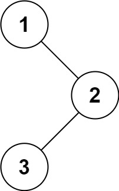

> 输入：root = [1,null,2,3]
>
> 输出：[1,3,2]

示例 2：

> 输入：root = []
>
> 输出：[]

示例 3：

> 输入：root = [1]
>
> 输出：[1]

提示：

- 树中节点数目在范围 [0, 100] 内
- -100 <= Node.val <= 100

进阶: 递归算法很简单，你可以通过迭代算法完成吗？

#### 94-CODE

中序遍历是指先左子树，然后根节点，最后右子树，递归很简单：

```go
/**
 * Definition for a binary tree node.
 * type TreeNode struct {
 *     Val int
 *     Left *TreeNode
 *     Right *TreeNode
 * }
 */
func inorderTraversal(root *TreeNode) []int {
    if root == nil {
        return nil
    }
    if root.Left == nil && root.Right == nil {
        return []int{root.Val}
    }

    res := make([]int, 0)
    left := inorderTraversal(root.Left)
    right := inorderTraversal(root.Right)

    res = append(res, left...)
    res = append(res, root.Val)
    res = append(res, right...)

    return res
}
```

迭代版本也不难，用栈来存中间遍历的节点：

```go
func inorderTraversal(root *TreeNode) []int {
    if root == nil {
        return nil
    }

    stack := make([]*TreeNode, 0)
    res := make([]int, 0)
    for len(stack) != 0 || root != nil {
        if root != nil {
            stack = append(stack, root)
            root = root.Left
        } else {
            root = stack[len(stack)-1]
            stack = stack[:len(stack)-1]
            res = append(res, root.Val)
            root = root.Right
        }
    }

    return res
}
```

### 21 [104.二叉树的最大深度](https://leetcode.cn/problems/maximum-depth-of-binary-tree/description/?envType=study-plan-v2&envId=top-100-liked)

#### 104-DESC

给定一个二叉树 root ，返回其最大深度。

二叉树的 最大深度 是指从根节点到最远叶子节点的最长路径上的节点数。

示例 1：

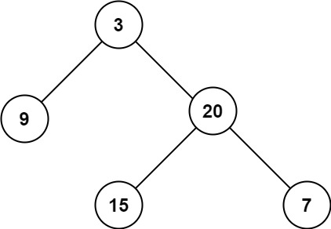

> 输入：root = [3,9,20,null,null,15,7]
>
> 输出：3

示例 2：

> 输入：root = [1,null,2]
>
> 输出：2

提示：

- 树中节点的数量在 [0, 104] 区间内。
- -100 <= Node.val <= 100

#### 104-CODE

本质上是求从根节点到叶子节点的最长路径数，直接递归很简单：

```go
/**
 * Definition for a binary tree node.
 * type TreeNode struct {
 *     Val int
 *     Left *TreeNode
 *     Right *TreeNode
 * }
 */
func maxDepth(root *TreeNode) int {
    if root == nil {
        return 0
    }
    if root.Left == nil && root.Right == nil {
        return 1
    }

    left := maxDepth(root.Left) + 1
    right := maxDepth(root.Right) + 1

    return max(left, right)
}
```

迭代有两种解法，BFS 和 DFS：

BFS 采用层序遍历的方式，像剥洋葱一样，一层一层地遍历树的所有节点。每遍历完一层，深度计数器就加 1。当队列为空时，计数器的值就是树的最大深度。

```go
/**
 * Definition for a binary tree node.
 * type TreeNode struct {
 *     Val int
 *     Left *TreeNode
 *     Right *TreeNode
 * }
 */
func maxDepth(root *TreeNode) int {
    if root == nil {
        return 0
    }

    depth := 0
    queue := []*TreeNode{root} // 初始化队列，将根节点放入

    for len(queue) > 0 {
        // 记录当前层的节点数
        levelSize := len(queue)

        // 将当前层的所有节点出队，并将它们的子节点入队
        for i := 0; i < levelSize; i++ {
            node := queue[0]
            queue = queue[1:] // 出队

            if node.Left != nil {
                queue = append(queue, node.Left)
            }
            if node.Right != nil {
                queue = append(queue, node.Right)
            }
        }
        // 当前层遍历完毕，深度+1
        depth++
    }
    return depth
}
```

DFS 采用前序遍历的方式，沿着一条路径走到黑，再回溯。我们可以用栈来模拟这个过程，栈中每个元素除了节点本身，还需记录该节点当前的深度。

```go
/**
 * Definition for a binary tree node.
 * type TreeNode struct {
 *     Val int
 *     Left *TreeNode
 *     Right *TreeNode
 * }
 */
func maxDepth(root *TreeNode) int {
    if root == nil {
        return 0
    }

    maxDepth := 0
    // 栈中存储的是 [节点, 当前深度]
    stack := [][2]interface{}{{root, 1}}

    for len(stack) > 0 {
        // 弹出栈顶元素
        item := stack[len(stack)-1]
        stack = stack[:len(stack)-1]

        node := item[0].(*TreeNode)
        currentDepth := item[1].(int)

        // 更新最大深度
        if currentDepth > maxDepth {
            maxDepth = currentDepth
        }

        // 将子节点入栈，深度+1
        if node.Left != nil {
            stack = append(stack, [2]interface{}{node.Left, currentDepth + 1})
        }
        if node.Right != nil {
            stack = append(stack, [2]interface{}{node.Right, currentDepth + 1})
        }
    }
    return maxDepth
}
```

### 22. [226.翻转二叉树](https://leetcode.cn/problems/invert-binary-tree/?envType=study-plan-v2&envId=top-100-liked)

#### 226-DESC

给你一棵二叉树的根节点 root ，翻转这棵二叉树，并返回其根节点。

示例 1：

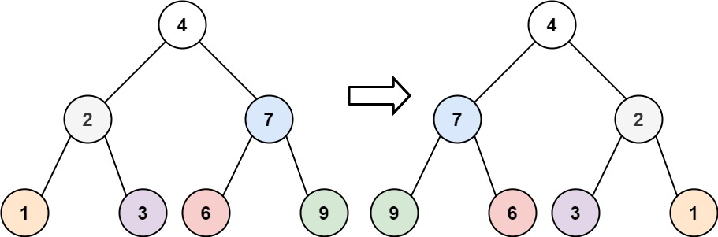

> 输入：root = [4,2,7,1,3,6,9]
>
> 输出：[4,7,2,9,6,3,1]

示例 2：

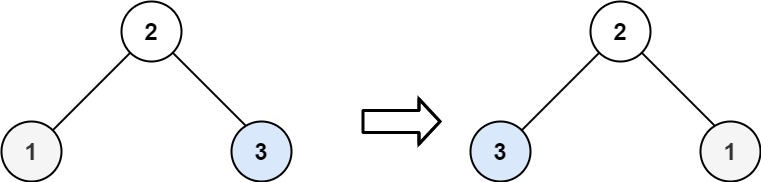

> 输入：root = [2,1,3]
>
> 输出：[2,3,1]

示例 3：

> 输入：root = []
>
> 输出：[]

提示：

- 树中节点数目范围在 [0, 100] 内
- -100 <= Node.val <= 100

#### 226-CODE

直接递归就好了：

```go
/**
 * Definition for a binary tree node.
 * type TreeNode struct {
 *     Val int
 *     Left *TreeNode
 *     Right *TreeNode
 * }
 */
func invertTree(root *TreeNode) *TreeNode {
    if root == nil {
        return nil
    }
    if root.Left == nil && root.Right == nil {
        return root
    }

    root.Left, root.Right = root.Right, root.Left
    invertTree(root.Left)
    invertTree(root.Right)

    return root
}
```

### 23. [101.对称二叉树](https://leetcode.cn/problems/symmetric-tree/?envType=study-plan-v2&envId=top-100-liked)

#### 101-DESC

给你一个二叉树的根节点 root ， 检查它是否轴对称。

示例 1：

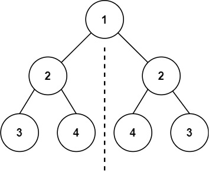

> 输入：root = [1,2,2,3,4,4,3]
>
> 输出：true

示例 2：

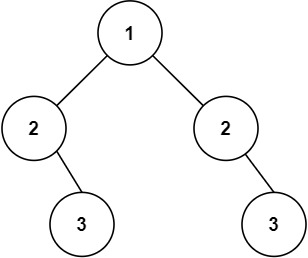

> 输入：root = [1,2,2,null,3,null,3]
>
> 输出：false

提示：

- 树中节点数目在范围 [1, 1000] 内
- -100 <= Node.val <= 100

进阶：你可以运用递归和迭代两种方法解决这个问题吗？

#### 101-CODE

递归版本：

```go
/**
 * Definition for a binary tree node.
 * type TreeNode struct {
 *     Val int
 *     Left *TreeNode
 *     Right *TreeNode
 * }
 */
func isSymmetric(root *TreeNode) bool {
    if root == nil {
        return true
    }
    return isSymmetric2(root.Left, root.Right)
}

func isSymmetric2(left, right *TreeNode) bool {
    if left == nil || right == nil {
        return left == right // 只有当 left 和 right 同时为 nil 时才 true
    }
    return left.Val == right.Val &&
        isSymmetric2(left.Left, right.Right) &&
        isSymmetric2(left.Right, right.Left)
}
```

迭代版本：

```go
func isSymmetric(root *TreeNode) bool {
    if root == nil {
        return true
    }
    queue := []*TreeNode{root.Left, root.Right}
    for len(queue) > 0 {
        l, r := queue[0], queue[1]
        queue = queue[2:]
        if l == nil && r == nil {
            continue
        }
        if l == nil || r == nil || l.Val != r.Val {
            return false
        }
        queue = append(queue, l.Left, r.Right, l.Right, r.Left)
    }
    return true
}
```

### 24. [543.二叉树的直径](https://leetcode.cn/problems/diameter-of-binary-tree/description/?envType=study-plan-v2&envId=top-100-liked)

#### 543-DESC

给你一棵二叉树的根节点，返回该树的 直径 。

二叉树的 直径 是指树中任意两个节点之间最长路径的 长度 。这条路径可能经过也可能不经过根节点 root 。

两节点之间路径的 长度 由它们之间边数表示。

示例 1：

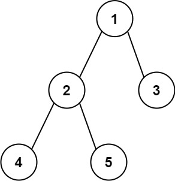

> 输入：root = [1,2,3,4,5]
>
> 输出：3
>
> 解释：3 ，取路径 [4,2,1,3] 或 [5,2,1,3] 的长度。

示例 2：

> 输入：root = [1,2]
>
> 输出：1

提示：

- 树中节点数目在范围 [1, 104] 内
- -100 <= Node.val <= 100

#### 543-CODE

递归版本：

```go
/**
 * Definition for a binary tree node.
 * type TreeNode struct {
 *     Val int
 *     Left *TreeNode
 *     Right *TreeNode
 * }
 */
func diameterOfBinaryTree(root *TreeNode) int {
    diameter := 0
    var dfs func(*TreeNode) int
    dfs = func(node *TreeNode) int {
        if node == nil {
            return 0
        }
        leftDepth := dfs(node.Left)
        rightDepth := dfs(node.Right)

        // 当前节点的直径 = 左子树深度 + 右子树深度，更新全局最大值
        if leftDepth+rightDepth > diameter {
            diameter = leftDepth + rightDepth
        }

        // 返回当前节点的最大深度
        if leftDepth > rightDepth {
            return leftDepth + 1
        }
        return rightDepth + 1
    }
    dfs(root)
    return diameter
}
```

迭代版本：

```go
/**
 * Definition for a binary tree node.
 * type TreeNode struct {
 *     Val int
 *     Left *TreeNode
 *     Right *TreeNode
 * }
 */
func diameterOfBinaryTree(root *TreeNode) int {
    if root == nil {
        return 0
    }

    diameter := 0
    // 栈用于存储节点，map用于存储每个节点对应的最大深度[reference:6]
    stack := []*TreeNode{root}
    depthMap := make(map[*TreeNode]int)

    // 后序遍历
    for len(stack) > 0 {
        node := stack[len(stack)-1]

        // 如果当前节点的左右子树还未处理，则将其入栈
        if node.Left != nil && depthMap[node.Left] == 0 {
            stack = append(stack, node.Left)
        } else if node.Right != nil && depthMap[node.Right] == 0 {
            stack = append(stack, node.Right)
        } else {
            // 左右子树都已处理完毕（或为空），可以计算当前节点
            stack = stack[:len(stack)-1] // 出栈

            leftDepth := depthMap[node.Left]
            rightDepth := depthMap[node.Right]

            // 更新直径
            if leftDepth+rightDepth > diameter {
                diameter = leftDepth + rightDepth
            }

            // 记录当前节点的最大深度
            depthMap[node] = max(leftDepth, rightDepth) + 1
        }
    }
    return diameter
}
```

### 25. [102.二叉树的层序遍历](https://leetcode.cn/problems/binary-tree-level-order-traversal/description/?envType=study-plan-v2&envId=top-100-liked)

#### 102-DESC

给你二叉树的根节点 root ，返回其节点值的 层序遍历 。 （即逐层地，从左到右访问所有节点）。

示例 1：

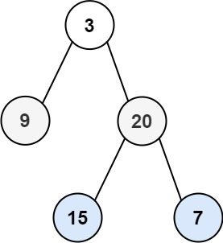

> 输入：root = [3,9,20,null,null,15,7]
>
> 输出：[[3],[9,20],[15,7]]

示例 2：

> 输入：root = [1]
>
> 输出：[[1]]

示例 3：

> 输入：root = []
>
> 输出：[]

提示：

- 树中节点数目在范围 [0, 2000] 内
- -1000 <= Node.val <= 1000

#### 102-CODE

```go
/**
 * Definition for a binary tree node.
 * type TreeNode struct {
 *     Val int
 *     Left *TreeNode
 *     Right *TreeNode
 * }
 */
func levelOrder(root *TreeNode) [][]int {
    if root == nil {
        return nil
    }

    res := make([][]int, 0)
    queue := []*TreeNode{root}

    for len(queue) > 0 {
        size := len(queue)
        tmp := make([]int, 0)
        for i := 0; i < size; i++ {
            node := queue[i]
            tmp = append(tmp, node.Val)
            if node.Left != nil {
                queue = append(queue, node.Left)
            }
            if node.Right != nil {
                queue = append(queue, node.Right)
            }
        }
        res = append(res, tmp)
        queue = queue[size:]
    }

    return res
}
```

### 26. [108.将有序数组转换为二叉搜索树](https://leetcode.cn/problems/convert-sorted-array-to-binary-search-tree/description/?envType=study-plan-v2&envId=top-100-liked)

#### 108-DESC

给你一个整数数组 nums ，其中元素已经按 升序 排列，请你将其转换为一棵 平衡 二叉搜索树。

示例 1：

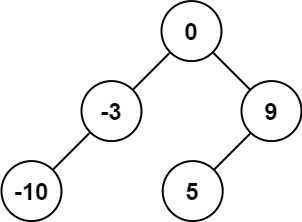

> 输入：nums = [-10,-3,0,5,9]
>
> 输出：[0,-3,9,-10,null,5]
>
> 解释：[0,-10,5,null,-3,null,9] 也将被视为正确答案：

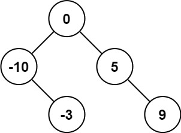

示例 2：

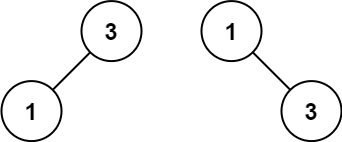

> 输入：nums = [1,3]
>
> 输出：[3,1]
>
> 解释：[1,null,3] 和 [3,1] 都是高度平衡二叉搜索树。

提示：

- 1 <= nums.length <= 104
- -104 <= nums[i] <= 104
- nums 按 严格递增 顺序排列

#### 108-CODE

本质就是二分，数组中间那个作为根节点，左半部分生成左子树，右半部分生成右子树，然后递归：

```go
/**
 * Definition for a binary tree node.
 * type TreeNode struct {
 *     Val int
 *     Left *TreeNode
 *     Right *TreeNode
 * }
 */
func sortedArrayToBST(nums []int) *TreeNode {
    size := len(nums)
    if size == 0 {
        return nil
    }
    if size == 1 {
        return &TreeNode{
            Val: nums[0],
        }
    }

    rootIdx := size / 2
    root := &TreeNode{Val: nums[rootIdx]}
    root.Left = sortedArrayToBST(nums[:rootIdx])
    if rootIdx < size-1 {
        root.Right = sortedArrayToBST(nums[rootIdx+1:])
    }

    return root
}
```

### 27. [98.验证二叉搜索树](https://leetcode.cn/problems/validate-binary-search-tree/description/?envType=study-plan-v2&envId=top-100-liked)

#### 98-DESC

给你一个二叉树的根节点 root ，判断其是否是一个有效的二叉搜索树。

有效 二叉搜索树定义如下：

- 节点的左子树只包含 严格小于 当前节点的数。
- 节点的右子树只包含 严格大于 当前节点的数。
- 所有左子树和右子树自身必须也是二叉搜索树。

示例 1：

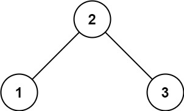

> 输入：root = [2,1,3]
>
> 输出：true

示例 2：

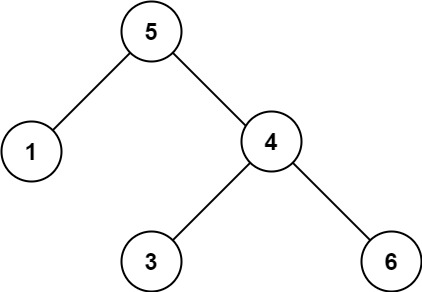

> 输入：root = [5,1,4,null,null,3,6]
>
> 输出：false
>
> 解释：根节点的值是 5 ，但是右子节点的值是 4 。

提示：

- 树中节点数目范围在[1, 104] 内
- -231 <= Node.val <= 231 - 1

#### 98-CODE

```go
/**
 * Definition for a binary tree node.
 * type TreeNode struct {
 *     Val int
 *     Left *TreeNode
 *     Right *TreeNode
 * }
 */
func isValidBST(root *TreeNode) bool {
    // 初始范围设置为最大和最小整数
    return helper(root, math.MinInt64, math.MaxInt64)
}

func helper(node *TreeNode, min, max int) bool {
    if node == nil {
        return true
    }
    // 当前节点值必须在 (min, max) 开区间内
    if node.Val <= min || node.Val >= max {
        return false
    }
    // 递归检查左子树（更新上界）和右子树（更新下界）
    return helper(node.Left, min, node.Val) && helper(node.Right, node.Val, max)
}
```

### 28. [230.二叉搜索树中第K小的元素](https://leetcode.cn/problems/kth-smallest-element-in-a-bst/description/?envType=study-plan-v2&envId=top-100-liked)

#### 230-CODE

给定一个二叉搜索树的根节点 root ，和一个整数 k ，请你设计一个算法查找其中第 k 小的元素（k 从 1 开始计数）。

示例 1：

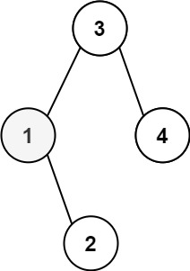

> 输入：root = [3,1,4,null,2], k = 1
>
> 输出：1

示例 2：

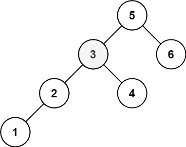

> 输入：root = [5,3,6,2,4,null,null,1], k = 3
>
> 输出：3

提示：

- 树中的节点数为 n 。
- 1 <= k <= n <= 104
- 0 <= Node.val <= 104

进阶：如果二叉搜索树经常被修改（插入/删除操作）并且你需要频繁地查找第 k 小的值，你将如何优化算法？

#### 230-CODE

```go
/**
 * Definition for a binary tree node.
 * type TreeNode struct {
 *     Val int
 *     Left *TreeNode
 *     Right *TreeNode
 * }
 */
func kthSmallest(root *TreeNode, k int) int {
    stack := make([]*TreeNode, 0)

    res := 0
    for root != nil || len(stack) > 0 {
        if root == nil {
            root = stack[len(stack)-1]
            k--
            if k == 0 {
                res = root.Val
                break
            }
            stack = stack[:len(stack)-1]
            root = root.Right
        } else {
            stack = append(stack, root)
            root = root.Left
        }
    }

    return res
}
```

### 29. [199.二叉树的右视图](https://leetcode.cn/problems/binary-tree-right-side-view/description/?envType=study-plan-v2&envId=top-100-liked)

#### 199-DESC

给定一个二叉树的 根节点 root，想象自己站在它的右侧，按照从顶部到底部的顺序，返回从右侧所能看到的节点值。

示例 1：

> 输入：root = [1,2,3,null,5,null,4]
>
> 输出：[1,3,4]
>
> 解释：

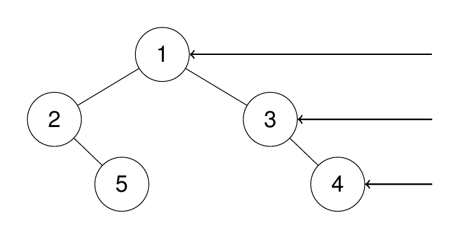

示例 2：

> 输入：root = [1,2,3,4,null,null,null,5]
>
> 输出：[1,3,4,5]
>
> 解释：

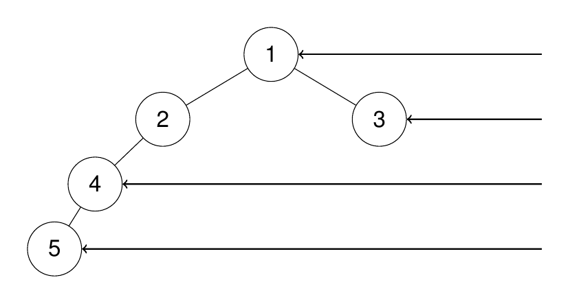

示例 3：

> 输入：root = [1,null,3]
>
> 输出：[1,3]

示例 4：

> 输入：root = []
>
> 输出：[]

提示:

- 二叉树的节点个数的范围是 [0,100]
- -100 <= Node.val <= 100

#### 199-CODE

本质上就是层序遍历，只不过是每一层的最后一个节点：

```go
/**
 * Definition for a binary tree node.
 * type TreeNode struct {
 *     Val int
 *     Left *TreeNode
 *     Right *TreeNode
 * }
 */
func rightSideView(root *TreeNode) []int {
    if root == nil {
        return nil
    }

    queue := []*TreeNode{root}
    res := []int{}
    for len(queue) > 0 {
        size := len(queue)
        res = append(res, queue[size-1].Val)

        for i := 0; i < size; i++ {
            node := queue[i]
            if node.Left != nil {
                queue = append(queue, node.Left)
            }
            if node.Right != nil {
                queue = append(queue, node.Right)
            }
        }

        queue = queue[size:]
    }

    return res
}
```

### 30. [114.二叉树展开为链表](https://leetcode.cn/problems/flatten-binary-tree-to-linked-list/description/?envType=study-plan-v2&envId=top-100-liked)

#### 114-DESC

给你二叉树的根结点 root ，请你将它展开为一个单链表：

展开后的单链表应该同样使用 TreeNode ，其中 right 子指针指向链表中下一个结点，而左子指针始终为 null 。
展开后的单链表应该与二叉树 先序遍历 顺序相同。

示例 1：

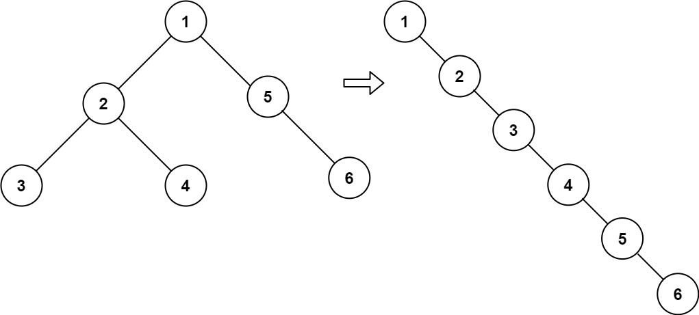

> 输入：root = [1,2,5,3,4,null,6]
>
> 输出：[1,null,2,null,3,null,4,null,5,null,6]

示例 2：

> 输入：root = []
>
> 输出：[]

示例 3：

> 输入：root = [0]
>
> 输出：[0]

提示：

- 树中结点数在范围 [0, 2000] 内
- -100 <= Node.val <= 100

进阶：你可以使用原地算法（O(1) 额外空间）展开这棵树吗？

#### 114-CODE

使用栈保存右节点，不断处理把左节点放置到右节点，直到处理完然后出栈右节点：

```go
/**
 * Definition for a binary tree node.
 * type TreeNode struct {
 *     Val int
 *     Left *TreeNode
 *     Right *TreeNode
 * }
 */
func flatten(root *TreeNode) {
    stack := []*TreeNode{}
    pre := root
    for root != nil || len(stack) > 0 {
        if root != nil {
            if root.Right != nil {
                stack = append(stack, root.Right)
            }
            root.Right = root.Left
            root.Left = nil
            pre = root
            root = root.Right
        } else {
            root = stack[len(stack)-1]
            stack = stack[:len(stack)-1]
            pre.Right = root
        }
    }
}
```

O(1) 空间复杂度的解法：

```go
/**
 * Definition for a binary tree node.
 * type TreeNode struct {
 *     Val int
 *     Left *TreeNode
 *     Right *TreeNode
 * }
 */
func flatten(root *TreeNode) {
    cur := root
    for cur != nil {
        // 1. 如果当前节点有左子树，才需要处理
        if cur.Left != nil {
            // 2. 寻找左子树中的最右节点（前驱节点）
            pre := cur.Left
            for pre.Right != nil {
                pre = pre.Right
            }

            // 3. 将当前节点的右子树接到前驱节点的右边
            pre.Right = cur.Right

            // 4. 将左子树移到右边，并将左指针置空
            cur.Right = cur.Left
            cur.Left = nil
        }
        // 5. 移动到下一个节点（即当前节点的右子节点）
        cur = cur.Right
    }
}
```

### 31. [105.从前序与中序遍历序列构造二叉树](https://leetcode.cn/problems/construct-binary-tree-from-preorder-and-inorder-traversal/description/?envType=study-plan-v2&envId=top-100-liked)

#### 105-DESC

给定两个整数数组 preorder 和 inorder ，其中 preorder 是二叉树的先序遍历， inorder 是同一棵树的中序遍历，请构造二叉树并返回其根节点。

示例 1:

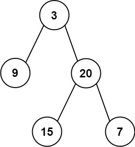

> 输入: preorder = [3,9,20,15,7], inorder = [9,3,15,20,7]
>
> 输出: [3,9,20,null,null,15,7]

示例 2:

> 输入: preorder = [-1], inorder = [-1]
>
> 输出: [-1]

提示:

- 1 <= preorder.length <= 3000
- inorder.length == preorder.length
- -3000 <= preorder[i], inorder[i] <= 3000
- preorder 和 inorder 均 无重复 元素
- inorder 均出现在 preorder
- preorder 保证 为二叉树的前序遍历序列
- inorder 保证 为二叉树的中序遍历序列

#### 105-CODE

先序遍历数组第一个元素就是根节点，而在中序遍历数组中对应该元素的前半部分就是左子树，右半部分就是右子树，依旧递归解法：

```go
/**
 * Definition for a binary tree node.
 * type TreeNode struct {
 *     Val int
 *     Left *TreeNode
 *     Right *TreeNode
 * }
 */
func buildTree(preorder []int, inorder []int) *TreeNode {
    if len(preorder) == 0 {
        return nil
    }
    if len(preorder) == 1 {
        return &TreeNode{Val: preorder[0]}
    }

    root := &TreeNode{Val: preorder[0]}
    rootIdx := func() int {
        for idx, v := range inorder {
            if v == preorder[0] {
                return idx
            }
        }
        return 0
    }()
    root.Left = buildTree(preorder[1:rootIdx+1], inorder[0:rootIdx])
    root.Right = buildTree(preorder[rootIdx+1:], inorder[rootIdx+1:])
    return root
}
```

### 32. [437.路径总和III](https://leetcode.cn/problems/path-sum-iii/description/?envType=study-plan-v2&envId=top-100-liked)

#### 437-DESC

给定一个二叉树的根节点 root ，和一个整数 targetSum ，求该二叉树里节点值之和等于 targetSum 的 路径 的数目。

路径 不需要从根节点开始，也不需要在叶子节点结束，但是路径方向必须是向下的（只能从父节点到子节点）。

示例 1：

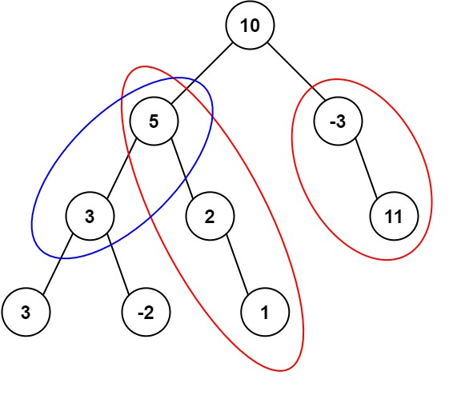

> 输入：root = [10,5,-3,3,2,null,11,3,-2,null,1], targetSum = 8
>
> 输出：3
>
> 解释：和等于 8 的路径有 3 条，如图所示。

示例 2：

> 输入：root = [5,4,8,11,null,13,4,7,2,null,null,5,1], targetSum = 22
>
> 输出：3

提示:

- 二叉树的节点个数的范围是 [0,1000]
- -109 <= Node.val <= 109
- -1000 <= targetSum <= 1000

#### 437-CODE

递归解法：以树中的每一个节点作为路径的起点，去尝试所有可能向下的路径

```go
/**
 * Definition for a binary tree node.
 * type TreeNode struct {
 *     Val int
 *     Left *TreeNode
 *     Right *TreeNode
 * }
 */
func pathSum(root *TreeNode, targetSum int) int {
    if root == nil {
        return 0
    }
    // 包含当前节点的路径数 + 不包含当前节点的路径数（在左、右子树中）
    res := dfs(root, targetSum)
    res += pathSum(root.Left, targetSum)
    res += pathSum(root.Right, targetSum)
    return res
}

// dfs 计算从 node 出发，向下寻找有多少条路径和等于 targetSum
func dfs(node *TreeNode, targetSum int) int {
    if node == nil {
        return 0
    }
    res := 0
    if node.Val == targetSum {
        res++
    }
    // 继续向下寻找，目标值减去当前节点的值
    res += dfs(node.Left, targetSum - node.Val)
    res += dfs(node.Right, targetSum - node.Val)
    return res
}
```

前缀和 + 回溯：

- 前缀和：在从根节点向下的路径上，记录从根节点到当前节点的所有节点值之和。
- 核心公式：如果路径 A -> B 的和为 targetSum，那么 prefixSum(B) - prefixSum(parent of A) = targetSum。换句话说，prefixSum(parent of A) = prefixSum(B) - targetSum。
- 哈希表：我们用一个哈希表 mp 来存储在遍历过程中，所有已出现的前缀和及其出现的次数。
- 回溯：在遍历完一个节点的左子树后，需要从哈希表中移除该节点的前缀和，再遍历右子树，以保证路径的连续性。

```go
/**
 * Definition for a binary tree node.
 * type TreeNode struct {
 *     Val int
 *     Left *TreeNode
 *     Right *TreeNode
 * }
 */
func pathSum(root *TreeNode, targetSum int) int {
    // mp 存储前缀和及其出现次数
    // 初始化 mp[0] = 1 至关重要，它代表“空路径”，用于处理从根节点开始的路径
    mp := map[int]int{0: 1}
    return preorder(root, 0, targetSum, mp)
}

func preorder(node *TreeNode, currSum int, target int, mp map[int]int) int {
    if node == nil {
        return 0
    }

    // 1. 更新当前路径和
    currSum += node.Val

    // 2. 查找是否存在满足条件的前缀和
    //    核心公式：当前前缀和 - target = 之前某个前缀和
    res := mp[currSum - target]

    // 3. 将当前前缀和加入哈希表，供子节点使用
    mp[currSum]++

    // 4. 递归处理左右子树
    res += preorder(node.Left, currSum, target, mp)
    res += preorder(node.Right, currSum, target, mp)

    // 5. 回溯：从哈希表中移除当前前缀和，避免影响其他路径
    mp[currSum]--

    return res
}
```

### 33. [236.二叉树的最近公共祖先](https://leetcode.cn/problems/lowest-common-ancestor-of-a-binary-tree/?envType=study-plan-v2&envId=top-100-liked)

#### 236-DESC

给定一个二叉树, 找到该树中两个指定节点的最近公共祖先。

百度百科中最近公共祖先的定义为：“对于有根树 T 的两个节点 p、q，最近公共祖先表示为一个节点 x，满足 x 是 p、q 的祖先且 x 的深度尽可能大（一个节点也可以是它自己的祖先）。”

示例 1：


> 输入：root = [3,5,1,6,2,0,8,null,null,7,4], p = 5, q = 1
>
> 输出：3
>
> 解释：节点 5 和节点 1 的最近公共祖先是节点 3 。

示例 2：


> 输入：root = [3,5,1,6,2,0,8,null,null,7,4], p = 5, q = 4
>
> 输出：5
>
> 解释：节点 5 和节点 4 的最近公共祖先是节点 5 。因为根据定义最近公共祖先节点可以为节点本身。

示例 3：

> 输入：root = [1,2], p = 1, q = 2
>
> 输出：1

提示：

- 树中节点数目在范围 [2, 105] 内。
- -109 <= Node.val <= 109
- 所有 Node.val 互不相同 。
- p != q
- p 和 q 均存在于给定的二叉树中。

#### 236-CODE

分别在左子树和右子树中寻找 p 和 q，如果左右子树的返回值都不为空，说明 p 和 q 分别位于当前节点的两侧，那么当前节点就是它们的最近公共祖先。如果只有一边的返回值不为空，则说明两个节点都在那一边，直接将这个不为空的结果向上返回。

```go
/**
 * Definition for a binary tree node.
 * type TreeNode struct {
 *     Val int
 *     Left *TreeNode
 *     Right *TreeNode
 * }
 */
func lowestCommonAncestor(root, p, q *TreeNode) *TreeNode {
    // 1. 终止条件：遇到空节点，或找到 p 或 q 就返回
    if root == nil || root == p || root == q {
        return root
    }

    // 2. 在左、右子树中递归查找
    left := lowestCommonAncestor(root.Left, p, q)
    right := lowestCommonAncestor(root.Right, p, q)

    // 3. 根据返回值判断
    if left != nil && right != nil {
        // 情况1: p 和 q 分别在左右子树，当前节点即为 LCA
        return root
    }
    if left != nil {
        // 情况2: 都在左子树
        return left
    }
    // 情况3: 都在右子树，或者都没找到
    return right
}
```

### 34. [124.二叉树中的最大路径和](https://leetcode.cn/problems/binary-tree-maximum-path-sum/?envType=study-plan-v2&envId=top-100-liked)

#### 124-DESC

二叉树中的 路径 被定义为一条节点序列，序列中每对相邻节点之间都存在一条边。同一个节点在一条路径序列中 至多出现一次 。该路径 至少包含一个 节点，且不一定经过根节点。

路径和 是路径中各节点值的总和。

给你一个二叉树的根节点 root ，返回其 最大路径和 。

示例 1：

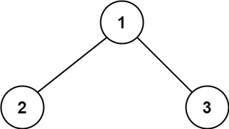

> 输入：root = [1,2,3]
>
> 输出：6
>
> 解释：最优路径是 2 -> 1 -> 3 ，路径和为 2 + 1 + 3 = 6

示例 2：

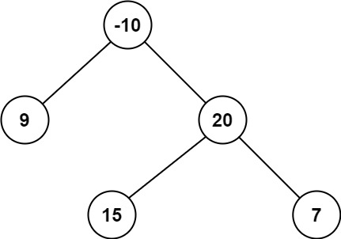

> 输入：root = [-10,9,20,null,null,15,7]
>
> 输出：42
>
> 解释：最优路径是 15 -> 20 -> 7 ，路径和为 15 + 20 + 7 = 42

提示：

- 树中节点数目范围是 [1, 3 * 104]
- -1000 <= Node.val <= 1000

#### 124-CODE

```go
/**
 * Definition for a binary tree node.
 * type TreeNode struct {
 *     Val int
 *     Left *TreeNode
 *     Right *TreeNode
 * }
 */
func maxPathSum(root *TreeNode) int {
    maxSum := math.MinInt32

    var dfs func(*TreeNode) int
    dfs = func(node *TreeNode) int {
        if node == nil {
            return 0
        }

        // 1. 后序遍历：先计算左右子树的贡献值
        //    如果子树贡献为负，则舍弃，贡献值记为 0
        leftGain := max(dfs(node.Left), 0)
        rightGain := max(dfs(node.Right), 0)

        // 2. 计算“经过当前节点”的最大路径和，并更新全局最大值
        //    这个路径由 node.Val + leftGain + rightGain 组成
        currentPathSum := node.Val + leftGain + rightGain
        if currentPathSum > maxSum {
            maxSum = currentPathSum
        }

        // 3. 返回当前节点能向父节点提供的最大“贡献值”
        //    父节点只能选择当前节点的一条路径，所以是 node.Val + max(leftGain, rightGain)
        return node.Val + max(leftGain, rightGain)
    }

    dfs(root)
    return maxSum
}
```

### 35. [200.岛屿数量](https://leetcode.cn/problems/number-of-islands/description/?envType=study-plan-v2&envId=top-100-liked)

#### 200-DESC

给你一个由 '1'（陆地）和 '0'（水）组成的的二维网格，请你计算网格中岛屿的数量。

岛屿总是被水包围，并且每座岛屿只能由水平方向和/或竖直方向上相邻的陆地连接形成。

此外，你可以假设该网格的四条边均被水包围。

示例 1：

> 输入：grid = [
>
> ['1','1','1','1','0'],
>
> ['1','1','0','1','0'],
>
> ['1','1','0','0','0'],
>
> ['0','0','0','0','0']
>
> ]
>
> 输出：1

示例 2：

> 输入：grid = [
>
> ['1','1','0','0','0'],
>
> ['1','1','0','0','0'],
>
> ['0','0','1','0','0'],
>
> ['0','0','0','1','1']
>
> ]
>
> 输出：3

提示：

- m == grid.length
- n == grid[i].length
- 1 <= m, n <= 300
- grid[i][j] 的值为 '0' 或 '1'

#### 200-CODE

最直观的方法遍历整个网格，每当遇到一个未访问的陆地 '1'，就启动一次DFS，将这个岛屿上所有的 '1' 都标记为已访问（改为 '0'），同时岛屿计数器加 1，知道所有区域遍历完：

```go
func numIslands(grid [][]byte) int {
    if len(grid) == 0 {
        return 0
    }
    m, n := len(grid), len(grid[0])
    res := 0

    var dfs func(int, int)
    dfs = func(i, j int) {
        // 边界检查：超出网格范围，或者当前格子不是陆地 '1'
        if i < 0 || i >= m || j < 0 || j >= n || grid[i][j] != '1' {
            return
        }
        // 将当前陆地标记为已访问，避免重复计算
        grid[i][j] = '0' // 或 '2'

        // 向四个方向递归探索
        dfs(i-1, j) // 上
        dfs(i+1, j) // 下
        dfs(i, j-1) // 左
        dfs(i, j+1) // 右
    }

    for i := 0; i < m; i++ {
        for j := 0; j < n; j++ {
            if grid[i][j] == '1' {
                res++     // 发现一个新岛屿
                dfs(i, j) // 用 DFS 淹没整个岛屿
            }
        }
    }
    return res
}
```

### 36. [994.腐烂的橘子](https://leetcode.cn/problems/rotting-oranges/description/?envType=study-plan-v2&envId=top-100-liked)

#### 994-DESC

在给定的 m x n 网格 grid 中，每个单元格可以有以下三个值之一：

- 值 0 代表空单元格；
- 值 1 代表新鲜橘子；
- 值 2 代表腐烂的橘子。

每分钟，腐烂的橘子 周围 4 个方向上相邻 的新鲜橘子都会腐烂。

返回 直到单元格中没有新鲜橘子为止所必须经过的最小分钟数。如果不可能，返回 -1 。

示例 1：

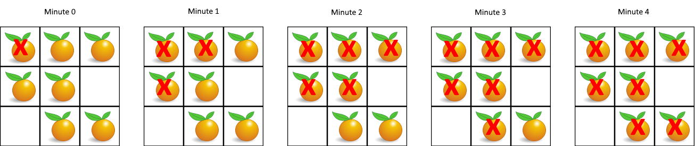

> 输入：grid = [[2,1,1],[1,1,0],[0,1,1]]
>
> 输出：4

示例 2：

> 输入：grid = [[2,1,1],[0,1,1],[1,0,1]]
>
> 输出：-1
>
> 解释：左下角的橘子（第 2 行， 第 0 列）永远不会腐烂，因为腐烂只会发生在 4 个方向上。

示例 3：

> 输入：grid = [[0,2]]
>
> 输出：0
>
> 解释：因为 0 分钟时已经没有新鲜橘子了，所以答案就是 0 。

提示：

- m == grid.length
- n == grid[i].length
- 1 <= m, n <= 10
- grid[i][j] 仅为 0、1 或 2

#### 994-CODE

把所有初始就腐烂的橘子想象成同一批“源头”，它们会同时向四周扩散，每一分钟会有新的被污染，然后继续向四周扩展，用队列保存污染源，直到没有新污染源：

```go
func orangesRotting(grid [][]int) int {
    if len(grid) == 0 {
        return 0
    }
    m, n := len(grid), len(grid[0])
    // 队列，用于BFS
    queue := make([][2]int, 0)
    freshCount := 0

    // 1. 初始化：统计新鲜橘子，并将所有腐烂橘子入队
    for i := 0; i < m; i++ {
        for j := 0; j < n; j++ {
            if grid[i][j] == 1 {
                freshCount++
            } else if grid[i][j] == 2 {
                queue = append(queue, [2]int{i, j})
            }
        }
    }

    // 如果没有新鲜橘子，直接返回0
    if freshCount == 0 {
        return 0
    }

    // 四个方向的移动向量
    directions := [][2]int{{-1, 0}, {1, 0}, {0, -1}, {0, 1}}
    minutes := 0

    // 2. 多源BFS
    for len(queue) > 0 && freshCount > 0 {
        // 关键：记录当前队列的长度，这代表“当前这一分钟”要处理的腐烂橘子
        levelSize := len(queue)
        // 在这一分钟内，只处理 levelSize 个橘子
        for i := 0; i < levelSize; i++ {
            // 取出队首元素
            cur := queue[0]
            queue = queue[1:]
            x, y := cur[0], cur[1]

            // 尝试向四个方向扩散
            for _, d := range directions {
                nx, ny := x+d[0], y+d[1]
                // 如果相邻格子是新鲜橘子
                if nx >= 0 && nx < m && ny >= 0 && ny < n && grid[nx][ny] == 1 {
                    // 让它腐烂
                    grid[nx][ny] = 2
                    freshCount--
                    // 将这个新腐烂的橘子加入队列，作为下一分钟的“源头”
                    queue = append(queue, [2]int{nx, ny})
                }
            }
        }
        // 处理完当前这一分钟的所有橘子后，时间+1
        minutes++
    }

    // 3. 如果还有新鲜橘子未被感染，说明它们被孤立了，返回-1
    if freshCount > 0 {
        return -1
    }
    return minutes
}
```

### 37. [207.课程表](https://leetcode.cn/problems/course-schedule/description/?envType=study-plan-v2&envId=top-100-liked)

#### 207-DESC

你这个学期必须选修 numCourses 门课程，记为 0 到 numCourses - 1 。

在选修某些课程之前需要一些先修课程。 先修课程按数组 prerequisites 给出，其中 prerequisites[i] = [ai, bi] ，表示如果要学习课程 ai 则 必须 先学习课程  bi 。

- 例如，先修课程对 [0, 1] 表示：想要学习课程 0 ，你需要先完成课程 1 。

请你判断是否可能完成所有课程的学习？如果可以，返回 true ；否则，返回 false 。

示例 1：

> 输入：numCourses = 2, prerequisites = [[1,0]]
>
> 输出：true
>
> 解释：总共有 2 门课程。学习课程 1 之前，你需要完成课程 0 。这是可能的。

示例 2：

> 输入：numCourses = 2, prerequisites = [[1,0],[0,1]]
>
> 输出：false
>
> 解释：总共有 2 门课程。学习课程 1 之前，你需要先完成课程 0 ；并且学习课程 0 之前，你还应先完成课程 1 。这是不可能的。

提示：

- 1 <= numCourses <= 2000
- 0 <= prerequisites.length <= 5000
- prerequisites[i].length == 2
- 0 <= ai, bi < numCourses
- prerequisites[i] 中的所有课程对 互不相同

#### 207-CODE

这个问题是典型的有向图环检测问题。可以把每门课程看作图中的一个节点，先修关系 [a, b] 看作一条从 b 指向 a 的有向边（必须先修 b，才能修 a）。如果这张图中存在环，就意味着课程之间出现了循环依赖，无法完成所有课程；反之则可以。

```go
func canFinish(numCourses int, prerequisites [][]int) bool {
    // 1. 初始化入度表和邻接表
    inDegree := make([]int, numCourses)
    graph := make([][]int, numCourses)

    for _, pre := range prerequisites {
        // pre = [a, b], 表示 先修 b 才能修 a
        // 构建邻接表: b -> a
        graph[pre[1]] = append(graph[pre[1]], pre[0])
        // 课程 a 的入度加1
        inDegree[pre[0]]++
    }

    // 2. 将所有入度为0的课程加入队列
    queue := []int{}
    for i := 0; i < numCourses; i++ {
        if inDegree[i] == 0 {
            queue = append(queue, i)
        }
    }

    // 3. 记录已修完的课程数量
    finished := 0

    // 4. BFS 拓扑排序
    for len(queue) > 0 {
        // 取出队首课程
        course := queue[0]
        queue = queue[1:]
        finished++

        // 遍历所有需要以 course 为先修课的后续课程
        for _, next := range graph[course] {
            inDegree[next]-- // 依赖的先修课少了一门
            if inDegree[next] == 0 {
                queue = append(queue, next) // 新的可修课程
            }
        }
    }

    // 5. 判断是否所有课程都已修完
    return finished == numCourses
}
```

### 38. [208.实现Trie(前缀树)](https://leetcode.cn/problems/implement-trie-prefix-tree/description/?envType=study-plan-v2&envId=top-100-liked)

#### 208-DESC

Trie（发音类似 "try"）或者说 前缀树 是一种树形数据结构，用于高效地存储和检索字符串数据集中的键。这一数据结构有相当多的应用情景，例如自动补全和拼写检查。

请你实现 Trie 类：

- Trie() 初始化前缀树对象。
- void insert(String word) 向前缀树中插入字符串 word 。
- boolean search(String word) 如果字符串 word 在前缀树中，返回 true（即，在检索之前已经插入）；否则，返回 false 。
- boolean startsWith(String prefix) 如果之前已经插入的字符串 word 的前缀之一为 prefix ，返回 true ；否则，返回 false 。

示例：

> 输入
>
> ["Trie", "insert", "search", "search", "startsWith", "insert", "search"]
>
> [[], ["apple"], ["apple"], ["app"], ["app"], ["app"], ["app"]]
>
> 输出
>
> [null, null, true, false, true, null, true]
>
>
>
> 解释
>
> Trie trie = new Trie();
>
> trie.insert("apple");
>
> trie.search("apple");   // 返回 True
>
> trie.search("app");     // 返回 False
>
> trie.startsWith("app"); // 返回 True
>
> trie.insert("app");
>
> trie.search("app");     // 返回 True

提示：

- 1 <= word.length, prefix.length <= 2000
- word 和 prefix 仅由小写英文字母组成
- insert、search 和 startsWith 调用次数 总计 不超过 3 * 10^4 次

#### 208-CODE

```go
type Trie struct {
    children [26]*Trie
    isEnd    bool
}

// Constructor 初始化 Trie 对象
func Constructor() Trie {
    return Trie{}
}

// Insert 插入一个单词
func (t *Trie) Insert(word string) {
    node := t
    for _, ch := range word {
        index := ch - 'a'
        if node.children[index] == nil {
            node.children[index] = &Trie{}
        }
        node = node.children[index]
    }
    node.isEnd = true
}

// Search 查找一个完整的单词是否存在
func (t *Trie) Search(word string) bool {
    node := t
    for _, ch := range word {
        index := ch - 'a'
        if node.children[index] == nil {
            return false
        }
        node = node.children[index]
    }
    return node.isEnd
}

// StartsWith 检查是否存在以给定前缀开头的单词
func (t *Trie) StartsWith(prefix string) bool {
    node := t
    for _, ch := range prefix {
        index := ch - 'a'
        if node.children[index] == nil {
            return false
        }
        node = node.children[index]
    }
    return true
}
```

### 39. [35.搜索插入位置](https://leetcode.cn/problems/search-insert-position/description/?envType=study-plan-v2&envId=top-100-liked)

#### 35-DESC

给定一个排序数组和一个目标值，在数组中找到目标值，并返回其索引。如果目标值不存在于数组中，返回它将会被按顺序插入的位置。

请必须使用时间复杂度为 O(log n) 的算法。

示例 1:

> 输入: nums = [1,3,5,6], target = 5
>
> 输出: 2

示例 2:

> 输入: nums = [1,3,5,6], target = 2
>
> 输出: 1

示例 3:

> 输入: nums = [1,3,5,6], target = 7
>
> 输出: 4

提示:

- 1 <= nums.length <= 104
- -104 <= nums[i] <= 104
- nums 为 无重复元素 的 升序 排列数组
- -104 <= target <= 104

#### 35-CODE

```go
func searchInsert(nums []int, target int) int {
    l, r := 0, len(nums)-1
    for l <= r {
        m := (r-l)/2 + l
        fmt.Println(m)
        if nums[m] == target {
            return m
        } else if nums[m] > target {
            r = m - 1
        } else {
            l = m + 1
        }
    }

    if l > r {
        return l
    }
    return r
}
```

### 40. [74.搜索二维矩阵](https://leetcode.cn/problems/search-a-2d-matrix/?envType=study-plan-v2&envId=top-100-liked)

#### 74-DESC

给你一个满足下述两条属性的 m x n 整数矩阵：

- 每行中的整数从左到右按非严格递增顺序排列。
- 每行的第一个整数大于前一行的最后一个整数。

给你一个整数 target ，如果 target 在矩阵中，返回 true ；否则，返回 false 。

你必须编写一个时间复杂度为 `O(log(m * n))` 的解决方案。

示例 1：

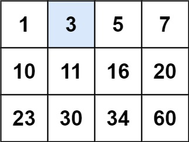

> 输入：matrix = [[1,3,5,7],[10,11,16,20],[23,30,34,60]], target = 3
>
> 输出：true

示例 2：

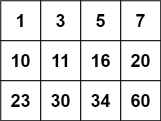

> 输入：matrix = [[1,3,5,7],[10,11,16,20],[23,30,34,60]], target = 13
>
> 输出：false

提示：

- m == matrix.length
- n == matrix[i].length
- 1 <= m, n <= 100
- -104 <= matrix[i][j], target <= 104

#### 74-CODE

核心思路是将 m x n 的矩阵想象成一个长度为 m * n 的有序数组，然后进行标准的二分查找。

关键点：对于一维索引 mid，它在二维矩阵中的位置是：

- 行：mid / n
- 列：mid % n

```go
func searchMatrix(matrix [][]int, target int) bool {
    if len(matrix) == 0 || len(matrix[0]) == 0 {
        return false
    }
    m, n := len(matrix), len(matrix[0])
    left, right := 0, m*n-1

    for left <= right {
        mid := left + (right-left)/2
        // 将一维索引 mid 转换为二维坐标
        midVal := matrix[mid/n][mid%n]

        if midVal == target {
            return true
        } else if midVal < target {
            left = mid + 1
        } else {
            right = mid - 1
        }
    }
    return false
}
```

### 41. [34.在排序数组中查找元素的第一个和最后一个位置](https://leetcode.cn/problems/find-first-and-last-position-of-element-in-sorted-array/description/?envType=study-plan-v2&envId=top-100-liked)

#### 34-DESC

给你一个按照非递减顺序排列的整数数组 nums，和一个目标值 target。请你找出给定目标值在数组中的开始位置和结束位置。

如果数组中不存在目标值 target，返回 [-1, -1]。

你必须设计并实现时间复杂度为 O(log n) 的算法解决此问题。

示例 1：

> 输入：nums = [5,7,7,8,8,10], target = 8
>
> 输出：[3,4]

示例 2：

> 输入：nums = [5,7,7,8,8,10], target = 6
>
> 输出：[-1,-1]

示例 3：

> 输入：nums = [], target = 0
>
> 输出：[-1,-1]

提示：

- 0 <= nums.length <= 105
- -109 <= nums[i] <= 109
- nums 是一个非递减数组
- -109 <= target <= 109

#### 34-CODE

两次二分查找，分别查找左右界：

```go
func searchRange(nums []int, target int) []int {
    // 初始化结果为 -1
    first, last := -1, -1

    // 查找左边界
    l, r := 0, len(nums)-1
    for l <= r {
        mid := l + (r-l)/2
        if nums[mid] == target {
            first = mid
            r = mid - 1 // 关键：继续向左搜索，看是否还有更靠前的 target
        } else if nums[mid] < target {
            l = mid + 1
        } else {
            r = mid - 1
        }
    }

    // 如果没找到左边界，说明 target 不存在，直接返回
    if first == -1 {
        return []int{-1, -1}
    }

    // 查找右边界
    l, r = 0, len(nums)-1
    for l <= r {
        mid := l + (r-l)/2
        if nums[mid] == target {
            last = mid
            l = mid + 1 // 关键：继续向右搜索，看是否还有更靠后的 target
        } else if nums[mid] < target {
            l = mid + 1
        } else {
            r = mid - 1
        }
    }

    return []int{first, last}
}
```

### 42. [33.搜索旋转排序数组](https://leetcode.cn/problems/search-in-rotated-sorted-array/description/?envType=study-plan-v2&envId=top-100-liked)

#### 33-DESC

整数数组 nums 按升序排列，数组中的值 互不相同 。

在传递给函数之前，nums 在预先未知的某个下标 k（0 <= k < nums.length）上进行了 向左旋转，使数组变为 [nums[k], nums[k+1], ..., nums[n-1], nums[0], nums[1], ..., nums[k-1]]（下标 从 0 开始 计数）。例如， [0,1,2,4,5,6,7] 下标 3 上向左旋转后可能变为 [4,5,6,7,0,1,2] 。

给你 旋转后 的数组 nums 和一个整数 target ，如果 nums 中存在这个目标值 target ，则返回它的下标，否则返回 -1 。

你必须设计一个时间复杂度为 O(log n) 的算法解决此问题。

示例 1：

> 输入：nums = [4,5,6,7,0,1,2], target = 0
>
> 输出：4

示例 2：

> 输入：nums = [4,5,6,7,0,1,2], target = 3
>
> 输出：-1

示例 3：

> 输入：nums = [1], target = 0
>
> 输出：-1

提示：

- 1 <= nums.length <= 5000
- -104 <= nums[i] <= 104
- nums 中的每个值都 独一无二
- 题目数据保证 nums 在预先未知的某个下标上进行了旋转
- -104 <= target <= 104

#### 33-CODE

旋转后的数组有一个关键特性：用 mid 把数组分成两半后，至少有一半是严格有序的。我们可以利用这一点，判断目标值是否在有序的那一半中，从而决定搜索方向。

```go
func search(nums []int, target int) int {
    left, right := 0, len(nums)-1

    for left <= right {
        mid := left + (right-left)/2
        if nums[mid] == target {
            return mid
        }

        // 判断左半部分是否有序
        if nums[left] <= nums[mid] {
            // 左半部分有序，检查 target 是否在左半部分
            if nums[left] <= target && target < nums[mid] {
                right = mid - 1 // 在左半部分继续搜索
            } else {
                left = mid + 1 // 在右半部分继续搜索
            }
        } else {
            // 右半部分有序，检查 target 是否在右半部分
            if nums[mid] < target && target <= nums[right] {
                left = mid + 1 // 在右半部分继续搜索
            } else {
                right = mid - 1 // 在左半部分继续搜索
            }
        }
    }

    return -1
}
```

### 43. [153.寻找旋转排序数组中的最小值](https://leetcode.cn/problems/find-minimum-in-rotated-sorted-array/description/?envType=study-plan-v2&envId=top-100-liked)

#### 153-DESC

已知一个长度为 n 的数组，预先按照升序排列，经由 1 到 n 次 旋转 后，得到输入数组。例如，原数组 nums = [0,1,2,4,5,6,7] 在变化后可能得到：
- 若旋转 4 次，则可以得到 [4,5,6,7,0,1,2]
- 若旋转 7 次，则可以得到 [0,1,2,4,5,6,7]

注意，数组 [a[0], a[1], a[2], ..., a[n-1]] 旋转一次 的结果为数组 [a[n-1], a[0], a[1], a[2], ..., a[n-2]] 。

给你一个元素值 互不相同 的数组 nums ，它原来是一个升序排列的数组，并按上述情形进行了多次旋转。请你找出并返回数组中的 最小元素 。

你必须设计一个时间复杂度为 O(log n) 的算法解决此问题。

示例 1：

> 输入：nums = [3,4,5,1,2]
>
> 输出：1
>
> 解释：原数组为 [1,2,3,4,5] ，旋转 3 次得到输入数组。

示例 2：

> 输入：nums = [4,5,6,7,0,1,2]
>
> 输出：0
>
> 解释：原数组为 [0,1,2,4,5,6,7] ，旋转 4 次得到输入数组。

示例 3：

> 输入：nums = [11,13,15,17]
>
> 输出：11
>
> 解释：原数组为 [11,13,15,17] ，旋转 4 次得到输入数组。

提示：

- n == nums.length
- 1 <= n <= 5000
- -5000 <= nums[i] <= 5000
- nums 中的所有整数 互不相同
- nums 原来是一个升序排序的数组，并进行了 1 至 n 次旋转

#### 153-CODE

旋转后的数组有一个关键特性：它由两个递增的子数组拼接而成，并且左子数组的所有元素都大于右子数组的所有元素。最小值就是右子数组的第一个元素。

在二分查找中，我们比较 nums[mid] 和 nums[right]：

- 如果 nums[mid] > nums[right]：说明 mid 位于左侧的递增子数组中。此时，最小值一定在 mid 的右侧，因此将搜索范围缩小到 [mid+1, right]。
- 如果 nums[mid] <= nums[right]：说明 mid 位于右侧的递增子数组中。此时，最小值可能在 mid 处或其左侧，因此将搜索范围缩小到 [left, mid]。

```go
func findMin(nums []int) int {
    l, r := 0, len(nums)-1
    for l < r {
        mid := (r-l)/2 + l
        if nums[mid] > nums[r] {
            l = mid + 1
        } else {
            r = mid
        }
    }

    return nums[r]
}
```

### 44. [4.寻找两个正序数组的中位数](https://leetcode.cn/problems/median-of-two-sorted-arrays/description/?envType=study-plan-v2&envId=top-100-liked)

#### 4-DESC

给定两个大小分别为 m 和 n 的正序（从小到大）数组 nums1 和 nums2。请你找出并返回这两个正序数组的 中位数 。

算法的时间复杂度应该为 `O(log (m+n))` 。

示例 1：

> 输入：nums1 = [1,3], nums2 = [2]
>
> 输出：2.00000
>
> 解释：合并数组 = [1,2,3] ，中位数 2

示例 2：

> 输入：nums1 = [1,2], nums2 = [3,4]
>
> 输出：2.50000
>
> 解释：合并数组 = [1,2,3,4] ，中位数 (2 + 3) / 2 = 2.5

提示：

- nums1.length == m
- nums2.length == n
- 0 <= m <= 1000
- 0 <= n <= 1000
- 1 <= m + n <= 2000
- -106 <= nums1[i], nums2[i] <= 106

#### 4-CODE

```go
func findMedianSortedArrays(nums1 []int, nums2 []int) float64 {
    total := len(nums1) + len(nums2)
    if total%2 == 1 {
        // 奇数长度，返回第 (total/2 + 1) 小的数
        return float64(findKth(nums1, nums2, total/2+1))
    }
    // 偶数长度，返回第 (total/2) 和 (total/2 + 1) 小数的平均值
    left := findKth(nums1, nums2, total/2)
    right := findKth(nums1, nums2, total/2+1)
    return float64(left+right) / 2.0
}

// findKth 寻找两个有序数组中第 k 小的元素 (k 从 1 开始)
func findKth(nums1, nums2 []int, k int) int {
    idx1, idx2 := 0, 0
    for {
        // 边界情况
        if idx1 == len(nums1) {
            return nums2[idx2+k-1]
        }
        if idx2 == len(nums2) {
            return nums1[idx1+k-1]
        }
        if k == 1 {
            return min(nums1[idx1], nums2[idx2])
        }

        // 正常二分查找
        half := k / 2
        // 防止越界，取实际能取的步数
        newIdx1 := min(idx1+half, len(nums1)) - 1
        newIdx2 := min(idx2+half, len(nums2)) - 1
        pivot1, pivot2 := nums1[newIdx1], nums2[newIdx2]

        if pivot1 <= pivot2 {
            // 排除 nums1 中 idx1 到 newIdx1 的部分
            k -= (newIdx1 - idx1 + 1)
            idx1 = newIdx1 + 1
        } else {
            // 排除 nums2 中 idx2 到 newIdx2 的部分
            k -= (newIdx2 - idx2 + 1)
            idx2 = newIdx2 + 1
        }
    }
}
```

### 45. [20.有效的括号](https://leetcode.cn/problems/valid-parentheses/description/?envType=study-plan-v2&envId=top-100-liked)

#### 20-DESC

给定一个只包括 '('，')'，'{'，'}'，'['，']' 的字符串 s ，判断字符串是否有效。

有效字符串需满足：

1. 左括号必须用相同类型的右括号闭合。
2. 左括号必须以正确的顺序闭合。
3. 每个右括号都有一个对应的相同类型的左括号。

示例 1：

> 输入：s = "()"
>
> 输出：true

示例 2：

> 输入：s = "()[]{}"
>
> 输出：true

示例 3：

> 输入：s = "(]"
>
> 输出：false

示例 4：

> 输入：s = "([])"
>
> 输出：true

示例 5：

> 输入：s = "([)]"
>
> 输出：false

提示：

- 1 <= s.length <= 104
- s 仅由括号 '()[]{}' 组成

#### 20-CODE

```go
func isValid(s string) bool {
    stack := make([]rune, 0)
    pairs := map[rune]rune{
        ')': '(',
        ']': '[',
        '}': '{',
    }

    for _, char := range s {
        // 如果是右括号
        if left, ok := pairs[char]; ok {
            // 栈空 或 栈顶不匹配，直接返回 false
            if len(stack) == 0 || stack[len(stack)-1] != left {
                return false
            }
            // 匹配成功，弹出栈顶
            stack = stack[:len(stack)-1]
        } else {
            // 如果是左括号，入栈
            stack = append(stack, char)
        }
    }

    return len(stack) == 0
}
```

### 46. [155.最小栈](https://leetcode.cn/problems/min-stack/description/?envType=study-plan-v2&envId=top-100-liked)

#### 155-DESC

设计一个支持 push ，pop ，top 操作，并能在常数时间内检索到最小元素的栈。

实现 MinStack 类:

- MinStack() 初始化堆栈对象。
- void push(int value) 将元素 value 推入堆栈。
- void pop() 删除堆栈顶部的元素。
- int top() 获取堆栈顶部的元素。
- int getMin() 获取堆栈中的最小元素。

示例 1:

> 输入：
>
> ["MinStack","push","push","push","getMin","pop","top","getMin"]
>
> [[],[-2],[0],[-3],[],[],[],[]]
>
> 输出：
>
> [null,null,null,null,-3,null,0,-2]
>
> 解释：
>
> MinStack minStack = new MinStack();
>
> minStack.push(-2);
>
> minStack.push(0);
>
> minStack.push(-3);
>
> minStack.getMin();   --> 返回 -3.
>
> minStack.pop();
>
> minStack.top();      --> 返回 0.
>
> minStack.getMin();   --> 返回 -2.

提示：

- -231 <= val <= 231 - 1
- pop、top 和 getMin 操作总是在 非空栈 上调用
- push, pop, top, and getMin最多被调用 3 * 10^4 次

#### 155-CODE

这种方法使用两个栈：

- 主栈 (stack)：正常存储所有元素
- 辅助栈 (minStack)：同步存储主栈中每一步对应的最小值

操作逻辑：

- Push(x)：
    - 将 x 压入主栈。
    - 如果辅助栈为空，或 x 小于等于辅助栈的栈顶，则将 x 也压入辅助栈。
    - 否则，将辅助栈当前的栈顶元素再压入一次。
- Pop()：
- 主栈和辅助栈同时弹出栈顶元素。
- Top()：返回主栈的栈顶元素。
- GetMin()：直接返回辅助栈的栈顶元素。

### 47. [394.字符串解码](https://leetcode.cn/problems/decode-string/description/?envType=study-plan-v2&envId=top-100-liked)

#### 394-DESC

给定一个经过编码的字符串，返回它解码后的字符串。

编码规则为: k[encoded_string]，表示其中方括号内部的 encoded_string 正好重复 k 次。注意 k 保证为正整数。

你可以认为输入字符串总是有效的；输入字符串中没有额外的空格，且输入的方括号总是符合格式要求的。

此外，你可以认为原始数据不包含数字，所有的数字只表示重复的次数 k ，例如不会出现像 3a 或 2[4] 的输入。

测试用例保证输出的长度不会超过 105。

示例 1：

> 输入：s = "3[a]2[bc]"
>
> 输出："aaabcbc"

示例 2：

> 输入：s = "3[a2[c]]"
>
> 输出："accaccacc"

示例 3：

> 输入：s = "2[abc]3[cd]ef"
>
> 输出："abcabccdcdcdef"

示例 4：

> 输入：s = "abc3[cd]xyz"
>
> 输出："abccdcdcdxyz"

提示：

- 1 <= s.length <= 30
- s 由小写英文字母、数字和方括号 '[]' 组成
- s 保证是一个 有效 的输入。
- s 中所有整数的取值范围为 [1, 300]

#### 394-CODE

```go
type MinStack struct {
    stack    []int
    minStack []int
}

func Constructor() MinStack {
    return MinStack{
        stack:    []int{},
        minStack: []int{},
    }
}

func (this *MinStack) Push(val int) {
    this.stack = append(this.stack, val)

    // 如果辅助栈为空，或 val 小于等于辅助栈栈顶，则压入 val
    if len(this.minStack) == 0 || val <= this.minStack[len(this.minStack)-1] {
        this.minStack = append(this.minStack, val)
    } else {
        // 否则，将当前最小值（辅助栈栈顶）再次压入，保持同步
        this.minStack = append(this.minStack, this.minStack[len(this.minStack)-1])
    }
}

func (this *MinStack) Pop() {
    if len(this.stack) == 0 {
        return
    }
    // 主栈和辅助栈同时弹出
    this.stack = this.stack[:len(this.stack)-1]
    this.minStack = this.minStack[:len(this.minStack)-1]
}

func (this *MinStack) Top() int {
    if len(this.stack) == 0 {
        return 0
    }
    return this.stack[len(this.stack)-1]
}

func (this *MinStack) GetMin() int {
    if len(this.minStack) == 0 {
        return 0
    }
    return this.minStack[len(this.minStack)-1]
}
```

### 48. [739.每日温度](https://leetcode.cn/problems/daily-temperatures/description/?envType=study-plan-v2&envId=top-100-liked)

#### 739-DESC

给定一个整数数组 temperatures ，表示每天的温度，返回一个数组 answer ，其中 answer[i] 是指对于第 i 天，下一个更高温度出现在几天后。如果气温在这之后都不会升高，请在该位置用 0 来代替。

示例 1:

> 输入: temperatures = [73,74,75,71,69,72,76,73]
>
> 输出: [1,1,4,2,1,1,0,0]

示例 2:

> 输入: temperatures = [30,40,50,60]
>
> 输出: [1,1,1,0]

示例 3:

> 输入: temperatures = [30,60,90]
>
> 输出: [1,1,0]

提示：

- 1 <= temperatures.length <= 10^5
- 30 <= temperatures[i] <= 100

#### 739-CODE

用一个单调递减栈来高效解决。栈里存储的是数组下标，并且栈底到栈顶对应的温度值是递减的。

算法流程：

- 从左到右遍历温度数组
- 对于当前温度 t，只要栈不为空，并且 t 大于栈顶下标所对应的温度，就说明我们找到了栈顶那一天右边第一个更高温度的日子
- 此时，弹出栈顶下标 idx，并计算结果：answer[idx] = 今天下标 - idx
- 重复步骤 2 和 3，直到栈空或栈顶温度不再小于 t
- 将当前下标 i 入栈

```go
func dailyTemperatures(temperatures []int) []int {
    n := len(temperatures)
    // 初始化答案数组，默认值为0
    answer := make([]int, n)
    // 用切片模拟单调栈，存储下标
    stack := []int{}

    for i := 0; i < n; i++ {
        // 当前温度大于栈顶下标对应的温度时，循环处理
        for len(stack) > 0 && temperatures[i] > temperatures[stack[len(stack)-1]] {
            // 弹出栈顶下标
            idx := stack[len(stack)-1]
            stack = stack[:len(stack)-1]
            // 计算等待天数
            answer[idx] = i - idx
        }
        // 将当前下标入栈
        stack = append(stack, i)
    }

    return answer
}
```

### 49. [84.柱状图中最大的矩形](https://leetcode.cn/problems/largest-rectangle-in-histogram/description/?envType=study-plan-v2&envId=top-100-liked)

#### 84-DESC

给定 n 个非负整数，用来表示柱状图中各个柱子的高度。每个柱子彼此相邻，且宽度为 1。

求在该柱状图中，能够勾勒出来的矩形的最大面积。

示例 1:

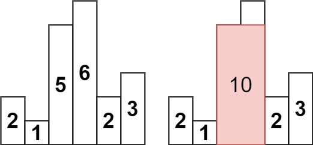

> 输入：heights = [2,1,5,6,2,3]
>
> 输出：10
>
> 解释：最大的矩形为图中红色区域，面积为 10

示例 2：


> 输入： heights = [2,4]
>
> 输出： 4

提示：

- 1 <= heights.length <=10^5
- 0 <= heights[i] <= 10^4

#### 84-CODE

这道题是经典的单调栈应用题，核心思想是为每个柱子找到左右两边第一个比它矮的柱子，从而确定以该柱子高度为矩形高的最大宽度。

核心思路：单调递增栈

对于柱子 i，如果以它的高度 heights[i] 作为矩形的高，那么矩形的左右边界就是左边第一个比它矮的柱子和右边第一个比它矮的柱子。

我们可以用单调递增栈在一次遍历中高效地找到这两个边界。栈里存储的是数组下标，且从栈底到栈顶对应的柱子高度是递增的。

算法流程：

- 哨兵处理：在数组末尾添加一个高度为 0 的柱子。这能确保遍历完所有柱子后，栈中剩下的元素都能被计算面积
- 遍历：从左到右遍历数组（包括末尾添加的 0）
- 出栈计算：对于当前柱子 i，只要栈不为空，并且 heights[i] 小于栈顶柱子 stack[top] 的高度，就说明 i 是栈顶柱子右边第一个比它矮的柱子
    - cur = 弹出栈顶元素（待计算高度的柱子索引）
    - height = heights[cur]
    - left = 弹出后新的栈顶元素（cur 左边第一个比它矮的柱子索引）
    - right = i
    - 计算矩形宽度 width = right - left - 1
    - 更新最大面积 maxArea = max(maxArea, height * width)
- 入栈：将当前柱子索引 i 入栈

这样，每个柱子最多入栈和出栈一次，时间复杂度仅为 O(n)

```go
func largestRectangleArea(heights []int) int {
    // 在末尾添加一个高度为0的柱子，作为哨兵
    // 确保遍历结束后，栈中所有元素都能被处理
    heights = append(heights, 0)
    n := len(heights)
    // 用切片模拟单调递增栈（存储下标）
    stack := []int{}
    maxArea := 0

    for i := 0; i < n; i++ {
        // 当前柱子高度小于栈顶柱子高度时，栈顶柱子无法再向右扩展
        // 弹出栈顶并计算以其为高的最大矩形面积
        for len(stack) > 0 && heights[i] < heights[stack[len(stack)-1]] {
            // 弹出栈顶元素，即待计算高度的柱子索引
            cur := stack[len(stack)-1]
            stack = stack[:len(stack)-1]

            // 计算高度
            height := heights[cur]

            // 计算宽度
            // 如果栈为空，说明 cur 左边没有比它矮的柱子，左边界为 -1
            left := -1
            if len(stack) > 0 {
                left = stack[len(stack)-1]
            }
            // 当前索引 i 是 cur 右边第一个比它矮的柱子
            width := i - left - 1

            // 更新最大面积
            area := height * width
            if area > maxArea {
                maxArea = area
            }
        }
        // 当前柱子入栈
        stack = append(stack, i)
    }

    return maxArea
}
```

### 50. [215.数组中的第K个最大元素](https://leetcode.cn/problems/kth-largest-element-in-an-array/description/?envType=study-plan-v2&envId=top-100-liked)

#### 215-DESC

给定整数数组 nums 和整数 k，请返回数组中第 k 个最大的元素。

请注意，你需要找的是数组排序后的第 k 个最大的元素，而不是第 k 个不同的元素。

你必须设计并实现时间复杂度为 O(n) 的算法解决此问题。

示例 1:

> 输入: [3,2,1,5,6,4], k = 2
>
> 输出: 5

示例 2:

> 输入: [3,2,3,1,2,4,5,5,6], k = 4
>
> 输出: 4

提示：

- 1 <= k <= nums.length <= 10^5
- -104 <= nums[i] <= 10^4

#### 215-CODE

方法一：快速选择

基于 partition 的思路，将数组分成两块，前半部分是大于选择的基准值，后半部分是小于基准值的，若基准值下标正好为 k，则对应的基准值就是所求值；若下标大于 k，说明在前半部分，继续调用此方法；否则说明在后半部分，需要注意的是，再次调用时需要将 k 减去基准值下标，相当于已经排除了 x 个大元素了

核心思路：

- 每次在数组中随机选择一个基准值（pivot）。
- 通过 partition 操作，将数组划分为两部分：左边部分都 大于等于 基准值，右边部分都 小于 基准值。
- 此时，基准值所在的位置 index 就是它在降序数组中的排名（index+1 就是它是第几大的元素）。
- 比较 index+1 与 k：
    - 如果相等，恭喜，基准值就是我们要找的第 k 大的数。
    - 如果 index+1 > k，说明目标在左边部分，递归处理左半部分。
    - 如果 index+1 < k，说明目标在右边部分，递归处理右半部分。

```go
import "math/rand"

func findKthLargest(nums []int, k int) int {
    // 为了确保平均时间复杂度为 O(n)，随机打乱数组
    // 可以避免在极端有序情况下退化为 O(n^2)
    rand.Shuffle(len(nums), func(i, j int) { nums[i], nums[j] = nums[j], nums[i] })
    return quickSelect(nums, 0, len(nums)-1, k)
}

func quickSelect(nums []int, left, right, k int) int {
    // 1. 调用 partition，得到基准值的最终位置 index
    index := partition(nums, left, right)

    // 2. 判断基准值在降序数组中的排名
    // 因为 partition 将大的元素放在了左边，所以 index-left+1 就是基准值是第几大的
    rank := index - left + 1

    if rank == k {
        return nums[index]
    } else if rank > k {
        // 目标在左半部分
        return quickSelect(nums, left, index-1, k)
    } else {
        // 目标在右半部分，注意 k 要减去左半部分的大小
        return quickSelect(nums, index+1, right, k-rank)
    }
}

// partition 函数：将区间 [left, right] 划分为两部分
// 左边都大于等于基准值，右边都小于基准值
// 返回基准值最终的索引位置
func partition(nums []int, left, right int) int {
    // 随机选择一个元素作为基准值，并将其交换到最右边
    pivotIdx := left + rand.Intn(right-left+1)
    nums[pivotIdx], nums[right] = nums[right], nums[pivotIdx]

    pivot := nums[right]
    i := left // i 指向下一个大于等于 pivot 的元素应该放置的位置

    for j := left; j < right; j++ {
        // 将大于等于 pivot 的元素交换到左边
        if nums[j] >= pivot {
            nums[i], nums[j] = nums[j], nums[i]
            i++
        }
    }
    // 最后将 pivot 交换到正确的位置
    nums[i], nums[right] = nums[right], nums[i]
    return i
}
```

方法二：堆 (Heap)

如果数据量极大（例如，数据是流式产生的，无法一次性加载到内存），堆是更好的选择。

核心思路：维护一个大小为 k 的小顶堆。

- 遍历数组，将元素加入小顶堆
- 当堆的大小超过 k 时，弹出堆顶元素（即当前堆中最小的元素）
- 遍历结束后，堆中剩下的就是整个数组中最大的 k 个元素，而堆顶（最小值）就是第 k 大的元素

```go
import "container/heap"

// 定义一个 IntHeap 类型，实现 heap.Interface 接口
// 这是一个小顶堆 (Min-Heap)
type IntHeap []int

func (h IntHeap) Len() int           { return len(h) }
func (h IntHeap) Less(i, j int) bool { return h[i] < h[j] } // 小顶堆
func (h IntHeap) Swap(i, j int)      { h[i], h[j] = h[j], h[i] }

// Push 和 Pop 方法需要使用指针接收者，因为它们会修改 slice 的长度
func (h *IntHeap) Push(x interface{}) {
    *h = append(*h, x.(int))
}

func (h *IntHeap) Pop() interface{} {
    old := *h
    n := len(old)
    x := old[n-1]
    *h = old[0 : n-1]
    return x
}

func findKthLargest(nums []int, k int) int {
    h := &IntHeap{}
    heap.Init(h)

    for _, num := range nums {
        heap.Push(h, num)
        // 保持堆的大小为 k
        if h.Len() > k {
            heap.Pop(h)
        }
    }

    // 堆顶元素就是第 k 大的元素
    return (*h)[0]
}
```

### 51. [347.前K个高频元素](https://leetcode.cn/problems/top-k-frequent-elements/description/?envType=study-plan-v2&envId=top-100-liked)

#### 347-DESC

给你一个整数数组 nums 和一个整数 k ，请你返回其中出现频率前 k 高的元素。你可以按 任意顺序 返回答案。

示例 1：

> 输入：nums = [1,1,1,2,2,3], k = 2
>
> 输出：[1,2]

示例 2：

> 输入：nums = [1], k = 1
>
> 输出：[1]

示例 3：

> 输入：nums = [1,2,1,2,1,2,3,1,3,2], k = 2
>
> 输出：[1,2]

提示：

- 1 <= nums.length <= 105
- -104 <= nums[i] <= 104
- k 的取值范围是 [1, 数组中不相同的元素的个数]
- 题目数据保证答案唯一，换句话说，数组中前 k 个高频元素的集合是唯一的

进阶：你所设计算法的时间复杂度 必须 优于 O(n log n) ，其中 n 是数组大小。

#### 347-CODE

维护一个大小为 k 的小顶堆。遍历频率哈希表，将元素加入堆中；一旦堆的大小超过 k，就弹出堆顶（即当前频率最小的元素）。遍历结束后，堆中剩下的就是频率前 k 高的元素。

这种方法在海量数据场景下非常高效，因为它不需要存储所有元素。

```go
import "container/heap"

// Pair 存储元素及其频率
type Pair struct {
    Num  int
    Freq int
}

// MinHeap 实现一个小顶堆，基于频率排序
type MinHeap []Pair

func (h MinHeap) Len() int { return len(h) }

// 小顶堆：频率低的排在前面
func (h MinHeap) Less(i, j int) bool { return h[i].Freq < h[j].Freq }
func (h MinHeap) Swap(i, j int)      { h[i], h[j] = h[j], h[i] }

func (h *MinHeap) Push(x interface{}) {
    *h = append(*h, x.(Pair))
}

func (h *MinHeap) Pop() interface{} {
    old := *h
    n := len(old)
    item := old[n-1]
    *h = old[0 : n-1]
    return item
}

func topKFrequent(nums []int, k int) []int {
    // 1. 统计频率
    freqMap := make(map[int]int)
    for _, num := range nums {
        freqMap[num]++
    }

    // 2. 使用小顶堆维护频率前 k 高的元素
    h := &MinHeap{}
    heap.Init(h)
    for num, freq := range freqMap {
        heap.Push(h, Pair{Num: num, Freq: freq})
        if h.Len() > k {
            heap.Pop(h) // 弹出频率最小的元素
        }
    }

    // 3. 提取结果
    result := make([]int, k)
    for i := 0; i < k; i++ {
        result[i] = heap.Pop(h).(Pair).Num
    }
    return result
}
```

### 52. [295.数据流的中位数](https://leetcode.cn/problems/find-median-from-data-stream/description/?envType=study-plan-v2&envId=top-100-liked)

#### 295-DESC

中位数是有序整数列表中的中间值。如果列表的大小是偶数，则没有中间值，中位数是两个中间值的平均值。

- 例如 arr = [2,3,4] 的中位数是 3 。
- 例如 arr = [2,3] 的中位数是 (2 + 3) / 2 = 2.5 。

实现 MedianFinder 类:

- MedianFinder() 初始化 MedianFinder 对象。
- void addNum(int num) 将数据流中的整数 num 添加到数据结构中。
- double findMedian() 返回到目前为止所有元素的中位数。与实际答案相差 10-5 以内的答案将被接受。

示例 1：

> 输入
>
> ["MedianFinder", "addNum", "addNum", "findMedian", "addNum", "findMedian"]
>
> [[], [1], [2], [], [3], []]
>
> 输出
>
> [null, null, null, 1.5, null, 2.0]
>
> 解释
>
> MedianFinder medianFinder = new MedianFinder();
>
> medianFinder.addNum(1);    // arr = [1]
>
> medianFinder.addNum(2);    // arr = [1, 2]
>
> medianFinder.findMedian(); // 返回 1.5 ((1 + 2) / 2)
>
> medianFinder.addNum(3);    // arr[1, 2, 3]
>
> medianFinder.findMedian(); // return 2.0

提示:

- -10^5 <= num <= 10^5
- 在调用 findMedian 之前，数据结构中至少有一个元素
- 最多 5 * 10^4 次调用 addNum 和 findMedian

#### 295-CODE

```go
import (
    "container/heap"
    "sort"
)

// hp 定义了一个最小堆
// 它通过内嵌 sort.IntSlice 来获得 Len() 和 Less() 方法
// 默认的 Less 方法实现的是升序，即小根堆[reference:8]
type hp struct{ sort.IntSlice }

func (h *hp) Push(v interface{}) {
    h.IntSlice = append(h.IntSlice, v.(int))
}

func (h *hp) Pop() interface{} {
    a := h.IntSlice
    v := a[len(a)-1]
    h.IntSlice = a[:len(a)-1]
    return v
}

type MedianFinder struct {
    left  hp // 存储较小的一半，通过存储负数实现为最大堆[reference:9]
    right hp // 存储较大的一半，原生最小堆
}

func Constructor() MedianFinder {
    return MedianFinder{}
}

// AddNum 添加一个数字到数据结构中
func (this *MedianFinder) AddNum(num int) {
    // 1. 当两堆等长时，新元素加入后应使 left 比 right 多 1 个
    //    先将元素加入 right，再从 right 弹出一个最小元素加入 left[reference:10]
    if this.left.Len() == this.right.Len() {
        heap.Push(&this.right, num)
        minFromRight := heap.Pop(&this.right).(int)
        heap.Push(&this.left, -minFromRight) // 存入负数，实现大根堆[reference:11]
    } else {
        // 2. 当 left 比 right 多 1 个时，新元素加入后应使两堆等长
        //    先将元素（取反后）加入 left，再从 left 弹出一个最大元素加入 right[reference:12]
        heap.Push(&this.left, -num)                // 存入负数
        maxFromLeft := -heap.Pop(&this.left).(int) // 弹出时取反，得到真实值
        heap.Push(&this.right, maxFromLeft)
    }
}

// FindMedian 返回当前所有元素的中位数
func (this *MedianFinder) FindMedian() float64 {
    if this.left.Len() == this.right.Len() {
        // 偶数个元素：中位数为两个堆顶的平均值[reference:13]
        leftTop := -this.left.IntSlice[0] // left 存储的是负数，需要取反
        rightTop := this.right.IntSlice[0]
        return float64(leftTop+rightTop) / 2.0
    }
    // 奇数个元素：中位数为 left 的堆顶[reference:14]
    // left 存储的是负数，需要取反
    return float64(-this.left.IntSlice[0])
}

```

### 53. [136.只出现一次的数字](https://leetcode.cn/problems/single-number/submissions/743394261/?envType=study-plan-v2&envId=top-100-liked)

#### 136-DESC

给你一个 非空 整数数组 nums ，除了某个元素只出现一次以外，其余每个元素均出现两次。找出那个只出现了一次的元素。

你必须设计并实现线性时间复杂度的算法来解决此问题，且该算法只使用常量额外空间。

示例 1 ：

> 输入：nums = [2,2,1]
>
> 输出：1

示例 2 ：

> 输入：nums = [4,1,2,1,2]
>
> 输出：4

示例 3 ：

> 输入：nums = [1]
>
> 输出：1

提示：

- 1 <= nums.length <= 3 * 104
- -3 * 104 <= nums[i] <= 3 * 104
- 除了某个元素只出现一次以外，其余每个元素均出现两次。

#### 136-CODE

这题用到了异或的性质，知道这个技巧就很简单了。

```go
func singleNumber(nums []int) int {
    x := nums[0]
    for i := 1; i < len(nums); i++ {
        x ^= nums[i]
    }

    return x
}
```

### 54. [75.颜色分类](https://leetcode.cn/problems/sort-colors/?envType=study-plan-v2&envId=top-100-liked)

#### 75-DESC

给定一个包含红色、白色和蓝色、共 n 个元素的数组 nums ，原地 对它们进行排序，使得相同颜色的元素相邻，并按照红色、白色、蓝色顺序排列。

我们使用整数 0、 1 和 2 分别表示红色、白色和蓝色。

必须在不使用库内置的 sort 函数的情况下解决这个问题。

示例 1：

> 输入：nums = [2,0,2,1,1,0]
>
> 输出：[0,0,1,1,2,2]
>
> 解释：
>
> 该数组包含两个 0、两个 1 和两个 2。将它们原地排序后，所有 0 排在最前面，接着是所有 1，最后是所有 2。

示例 2：

> 输入：nums = [2,0,1]
>
> 输出：[0,1,2]
>
> 解释：
>
> 数组中有且仅有一个 0、一个 1 和一个 2，按 0、1、2 的顺序原地排列。

提示：

- n == nums.length
- 1 <= n <= 300
- nums[i] 为 0、1 或 2

进阶：

你能想出一个仅使用常数空间的一趟扫描算法吗？

#### 75-CODE

```go
func sortColors(nums []int) {
    start, end, cur := 0, len(nums)-1, 0
    for cur <= end {
        if nums[cur] == 1 {
            cur++
        } else if nums[cur] == 2 {
            nums[cur], nums[end] = nums[end], nums[cur]
            end--
        } else if nums[cur] == 0 {
            nums[cur], nums[start] = nums[start], nums[cur]
            start++
            cur++
        }
    }
}
```

**与 start 交换为什么安全？**

当 nums[cur] == 0 时，算法将 cur 和 start 位置的元素交换。

关键在于：start 位置指向的是 0 区域的边界，这个位置的元素不可能是 2。

为什么？

如果 start 和 cur 指向同一个位置：交换没有意义，nums[cur] 本身就是 0。交换后，cur 位置的元素依然是 0，可以被跳过。

如果 start 在 cur 的左边：由于 cur 从左向右扫描，start 和 cur 之间的所有元素都已经被 cur 检查过了。在检查过程中，所有遇到的 2 都已经被交换到了数组末尾，所有遇到的 0 也已经被交换到了数组前面。因此，start 位置现在存放的，只可能是1。

所以，当 nums[cur] == 0 并与 start 交换后，cur 指向的新元素就一定是 1。既然 cur 已经处理过 1 了（直接跳过），那么将 cur 向前移动就是安全的。

**为什么不与 end 交换后 cur 不能 ++？**

这是理解此算法的另一个关键点，也恰恰从反面证明了为什么与 start 交换后 cur 必须 ++。

当 nums[cur] == 2 时，算法将 cur 和 end 位置的元素交换。

关键区别：end 指向的是未扫描的区域，我们不知道 end 位置原来是什么元素。

交换后，cur 指向的新元素可能是 0、1 或 2。如果是 0，还需要再与 start 交换；如果是 2，还需要再次与 end 交换。

因此，cur 不能移动，必须留在原地，在下一次循环中继续检查这个新换过来的元素是什么。

## review [🔝](#weekly-114)

### 1. [IndexTTS 2.5 让声音跨越语言](https://mp.weixin.qq.com/s/30e0qSPbdj06H_gap78Qqw?scene=1&click_id=1594969601)

文章存档：[IndexTTS 2.5 让声音跨越语言](../blog/2026/08/bilibili-indextts2.5.md)

这篇文章介绍了B站自研的**IndexTTS 2.5**，这是一个支持中/英/日/西/阿五国语言的AI语音合成模型。

视频介绍：

<video src="https://mpvideo.qpic.cn/0bc3fudgiaaglmailq3ynnvfmlodmqwqmzaa.f10002.mp4?dis_k=bbcbc2acd75b62fa9142e65256f74c65&dis_t=1786954026&play_scene=10120&auth_info=VrX8s74sTlcatOjLwV1fRSY7QwpJenRnAWxOQjsBJW5vFxplY01kZTQbNDhNMhsCLmxKBRBoHhhWLEEdYVozOnAd&auth_key=3c3a155e2fd9491aacb7b7d357eee0af&format_id=10002&support_redirect=0&mmversion=false" controls width="800"></video>

#### 背景与目标
IndexTTS 2发布后，社区反馈主要集中在两点：**语言不够多**（只有中英）和**推理速度偏慢**。2.5版本正是为了解决这两个核心痛点而开发，团队经过长时间打磨，最终实现了多语言、高情绪还原度和快速推理的兼顾。

#### 四大核心升级

1. **多语言支持**：新增日语、西班牙语、阿拉伯语。为此，团队专门设计了多种建模策略来应对“跨语言共享字符”（如汉字在中日文中读音不同）的难题，并构建了约**15万小时**的多语言和**135小时**的情感语音数据集。
2. **推理速度翻倍**：通过将语义编码帧率从50Hz降至25Hz（序列长度减半），并将声学模型从U-DiT换成更轻量的Zipformer，整体推理速度提升了约**2.28倍**。
3. **强化学习优化**：引入**GRPO强化学习**算法，让模型自我“竞争”和进化。优化后，五语言平均识别错误率（WER）从6.75%降至**6.00%**，说话人相似度也从73.18提升至**73.63**。
4. **灵活语速控制**：新增了语速调节功能，满足了更多创作场景的需求。

#### 效果与数据

- **零样本语音克隆**：在五种语言的评测中，IndexTTS 2.5的说话人相似度均处于**第一梯队**。
- **跨语言与情感迁移**：在“用中文语音让同一音色说其他语言”的测试中，综合成绩**全场最佳**。情感迁移能力尤为突出，能将一段音频的情绪（如开心）迁移到另一种语言上，在阿拉伯语极端测试中情感MOS评分达4.18/5，中文情感识别准确率（0.713）也远超对比模型（0.467）。

### 2. [上海目前存在的最大的问题在哪里？](https://www.zhihu.com/question/265258072/answer/1920461643806148309)

> 来自 [上下五千年](https://www.zhihu.com/people/di-shi-18-93) 的 [回答](https://www.zhihu.com/question/265258072/answer/1920461643806148309)

作为一个魔都人感受很深，上海目前存在的最大的问题就是外资越来越少了，上海历史上三个大发展时期，第一个是上海开埠后到抗战前外资疯狂涌入打造了外滩和租界区域的繁华，直接成为远东第一城，你今天看上海100多年前的老别墅人家电梯电灯电话马桶啥都有；第二个是80年代和日本的全面合作，打造了虹桥古北西郊一带的繁华，那边人均消费几千一餐的日料比比皆是，也是最早可以直接美金购房的区域，白马会所算啥，当年开在古北臻园背后的古北夜王，每晚两百个男模的时代才是巅峰，一度营业额超过东京夜王总部；第三个是浦东开发开放，陆家嘴更是外资涌入无数，后面各种国际性的迪士尼、特斯拉落户上海，大到欧美小到泰国都涌入大笔投资在浦东。

后来本来已经想好了第四个大发展时期，弄虹桥商务区，结果碰到疫情，出尔反尔的封城政策导致原本想投资的外资连夜卷铺盖跑了，摩根斯坦利、贝莱德这些原本准备扎根上海市场的国际巨鳄都吓得楼也不要了直接开溜。后来一系列对外利好的政策，让来上海旅游的人是大幅度增加了，但大规模投资的金主爸爸却还是观望。

魔都迎来了第一次靠内资发展的时期，结果如何呢，五大新城看着施工队如火如荼，房价成啥样了我都不好意思说，原本号称很能抗的魔都国企像上汽这些，说着没裁员，但离职人数都大几千了，你猜是因为啥？魔都的经济生态系统里，国企是大头，但真正带动经济和做规矩的全是外资。什么是外资做规矩的作用呢，上海曾经是大城市里最不卷的，曾经是五天八小时工作制执行最好的，原因就是外企在这里打了个榜样，你其他企业也不能做太绝、压榨太厉害。如今外资少了，这两年我去了魔都的很多新能源车企考察，不少都是国内数一数二的在松江和嘉定的高科技厂，基本连个晚上10点前准时下班的都没碰到过。

没有这些外资，你只能走内卷这一条路，你魔都的本土企业能不能卷过山东安徽都难说，外资一少，你国企也自然难做了，因为整个经济生态是整体，就像外资一少，很多国企针对外国市场的业务和人员就全没了，像过去给外国人看的上海外语频道都直接没了，没法做下去了。没有外资，我说实话，上海人本身真不算吃苦耐劳的，比大多数中部地区差多了，各类开销成本都高，真拼内资未来有这个实力吗？美团、字节、B站这些把总部放这是因为看好你是国际化大都市，如果未来不够国际化了，人家干嘛不找个物美价廉的城市呢？金虹桥的拼多多、漕河泾的米哈游又哪里真的非那里不可呢？

## tip [🔝](#weekly-114)

## share [🔝](#weekly-114)

[readme](../README.md) | [previous](202608W2.md) | [next](202608W4.md)
