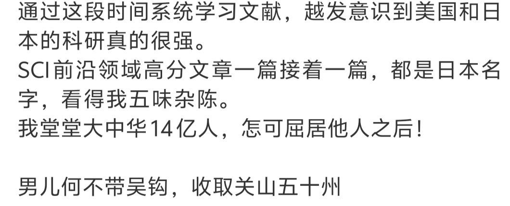
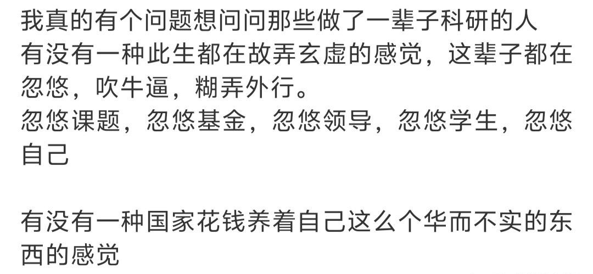

# Weekly #115

@Range : 2026-08-23 - 2026-08-29

@City: Hangzhou

[readme](../README.md) | [previous](202608W3.md) | [next](202609W1.md)


\**Photo by [小小岳](https://www.douyin.com/user/MS4wLjABAAAAL_N2mObcIRH2Xors3tdq4z_SNwRzggoxIi86QcGwbW6xZK4tcqE8NJM7q-nYpFNI) on [Douyin](https://www.douyin.com/note/7674567370974753126)*

-[toc]

## algorithm [🔝](#weekly-115)

### 1. [46.全排列](https://leetcode.cn/problems/permutations/description/?envType=study-plan-v2&envId=top-100-liked)

#### 46-DESC

给定一个不含重复数字的数组 nums ，返回其 所有可能的全排列 。你可以 按任意顺序 返回答案。

示例 1：

> 输入：nums = [1,2,3]
>
> 输出：[[1,2,3],[1,3,2],[2,1,3],[2,3,1],[3,1,2],[3,2,1]]

示例 2：

> 输入：nums = [0,1]
>
> 输出：[[0,1],[1,0]]

示例 3：

> 输入：nums = [1]
>
> 输出：[[1]]

提示：

- 1 <= nums.length <= 6
- -10 <= nums[i] <= 10
- nums 中的所有整数 互不相同

#### 46-CODE

回溯法 + 交换：直接在原数组 nums 上进行元素交换来生成排列。idx 表示当前要确定的位置，通过将 nums[idx] 与 nums[i]（i 从 idx 到末尾）交换，让每个元素轮流“坐”到 idx 位置，然后递归处理 idx+1。

```go
func permute(nums []int) [][]int {
	res := [][]int{}
	n := len(nums)

	var backtrack func(int)
	backtrack = func(idx int) {
		// 终止条件：所有位置都已确定，得到一个完整排列
		if idx == n {
			// 注意：需要拷贝一份 nums，因为后续交换会修改它
			tmp := make([]int, n)
			copy(tmp, nums)
			res = append(res, tmp)
			return
		}

		for i := idx; i < n; i++ {
			// 做选择：将 nums[i] 交换到 idx 位置
			nums[idx], nums[i] = nums[i], nums[idx]
			// 递归确定下一个位置
			backtrack(idx + 1)
			// 撤销选择（回溯）：交换回来，恢复原状
			nums[idx], nums[i] = nums[i], nums[idx]
		}
	}

	backtrack(0)
	return res
}
```

### 2. [78.子集](https://leetcode.cn/problems/subsets/?envType=study-plan-v2&envId=top-100-liked)

#### 78-DESC

给你一个整数数组 nums ，数组中的元素 互不相同 。返回该数组所有可能的子集（幂集）。

解集 不能 包含重复的子集。你可以按 任意顺序 返回解集。

示例 1：

> 输入：nums = [1,2,3]
>
> 输出：[[],[1],[2],[1,2],[3],[1,3],[2,3],[1,2,3]]

示例 2：

> 输入：nums = [0]
>
> 输出：[[],[0]]

提示：

- 1 <= nums.length <= 10
- -10 <= nums[i] <= 10
- nums 中的所有元素 互不相同

#### 78-CODE

回溯法：遍历数组，对每个元素做“选”或“不选”的决定。递归树上的每一个节点（包括根节点）都代表一个子集，需要收集起来。

```go
func subsets(nums []int) [][]int {
	var res [][]int
	var path []int

	var backtrack func(start int)
	backtrack = func(start int) {
		// 关键：将当前路径的拷贝加入结果集（每个节点都是一个子集）[reference:4][reference:5]
		temp := make([]int, len(path))
		copy(temp, path)
		res = append(res, temp)

		// 从 start 开始遍历，保证不会出现重复子集[reference:6]
		for i := start; i < len(nums); i++ {
			path = append(path, nums[i]) // 做选择
			backtrack(i + 1)             // 递归
			path = path[:len(path)-1]    // 撤销选择（回溯）
		}
	}

	backtrack(0)
	return res
}
```

### 3. [17.电话号码的字母组合](https://leetcode.cn/problems/letter-combinations-of-a-phone-number/?envType=study-plan-v2&envId=top-100-liked)

#### 17-DESC

给定一个仅包含数字 2-9 的字符串，返回所有它能表示的字母组合。答案可以按 任意顺序 返回。

给出数字到字母的映射如下（与电话按键相同）。注意 1 不对应任何字母。


示例 1：

> 输入：digits = "23"
>
> 输出：["ad","ae","af","bd","be","bf","cd","ce","cf"]

示例 2：

> 输入：digits = "2"
>
> 输出：["a","b","c"]

提示：

> 1 <= digits.length <= 4
>
> digits[i] 是范围 ['2', '9'] 的一个数字。

#### 17-CODE

```go
func letterCombinations(digits string) []string {
	res := []string{}

	table := map[byte]string{
		'2': "abc", '3': "def", '4': "ghi", '5': "jkl",
		'6': "mno", '7': "pqrs", '8': "tuv", '9': "wxyz",
	}

	path := ""
	var backtrack func(start int)
	backtrack = func(start int) {
		if start == len(digits) {
			res = append(res, path)
			return
		}

		for _, ch := range table[digits[start]] {
			path += string(ch)
			backtrack(start + 1)
			path = path[:len(path)-1]
		}
	}

	backtrack(0)
	return res
```

### 4. [39.组合总和](https://leetcode.cn/problems/combination-sum/description/?envType=study-plan-v2&envId=top-100-liked)

#### 39-DESC

给你一个 无重复元素 的整数数组 candidates 和一个目标整数 target ，找出 candidates 中可以使数字和为目标数 target 的 所有 不同组合 ，并以列表形式返回。你可以按 任意顺序 返回这些组合。

candidates 中的 同一个 数字可以 无限制重复被选取 。如果至少一个数字的被选数量不同，则两种组合是不同的。

对于给定的输入，保证和为 target 的不同组合数少于 150 个。

示例 1：

> 输入：candidates = [2,3,6,7], target = 7
>
> 输出：[[2,2,3],[7]]
>
> 解释：
>
> 2 和 3 可以形成一组候选，2 + 2 + 3 = 7 。注意 2 可以使用多次。
>
> 7 也是一个候选， 7 = 7 。
>
> 仅有这两种组合。

示例 2：

> 输入: candidates = [2,3,5], target = 8
>
> 输出: [[2,2,2,2],[2,3,3],[3,5]]

示例 3：

> 输入: candidates = [2], target = 1
>
> 输出: []

提示：

- 1 <= candidates.length <= 30
- 2 <= candidates[i] <= 40
- candidates 的所有元素 互不相同
- 1 <= target <= 40

#### 39-CODE

回溯 + 剪枝：“无限次使用”这个条件是解题的关键。我们可以通过回溯算法，在搜索树的每一层，都从当前元素开始尝试，而不是从下一个元素开始，这样就能实现同一个数字的重复选取。

同时，我们可以利用剪枝来优化：先对数组排序，如果当前和已经大于 target，就可以停止当前分支的搜索。

```go
func combinationSum(candidates []int, target int) [][]int {
	var res [][]int // 存放最终结果
	var path []int  // 存放当前搜索路径

	// 1. 排序是为了方便剪枝，不是必须的
	sort.Ints(candidates)

	// 2. 定义 DFS 函数（闭包）
	var dfs func(start, sum int)
	dfs = func(start, sum int) {
		// 3. 终止条件：找到一个有效组合
		if sum == target {
			// 关键：拷贝一份 path，因为后续回溯会修改它
			temp := make([]int, len(path))
			copy(temp, path)
			res = append(res, temp)
			return
		}
		// 4. 剪枝：如果当前和已经超过目标，直接返回
		if sum > target {
			return
		}

		// 5. 遍历选择列表
		//    从 start 开始，保证每个元素可以被重复选择
		for i := start; i < len(candidates); i++ {
			// 做选择
			path = append(path, candidates[i])
			// 递归：注意这里的 start 参数是 i，而不是 i+1
			// 这表示下一层仍然可以从 candidates[i] 开始选择，实现无限次使用
			dfs(i, sum+candidates[i])
			// 撤销选择（回溯）
			path = path[:len(path)-1]
		}
	}

	dfs(0, 0)
	return res
}
```

### 5. [22.括号生成](https://leetcode.cn/problems/generate-parentheses/description/?envType=study-plan-v2&envId=top-100-liked)

#### 22-DESC

数字 n 代表生成括号的对数，请你设计一个函数，用于能够生成所有可能的并且 有效的 括号组合。

示例 1：

> 输入：n = 3
>
> 输出：["((()))","(()())","(())()","()(())","()()()"]

示例 2：

> 输入：n = 1
>
> 输出：["()"]

提示：

- 1 <= n <= 8

#### 22-CODE

回溯法：可以把生成括号的过程想象成一棵决策树。我们从空字符串开始，每一步都有两个选择：添加一个左括号 ( 或添加一个右括号 )。

但并不是所有选择都合法，我们需要遵循两条规则：

左括号可以随时添加，只要它的总数不超过 n。

右括号只能在已添加的左括号数量大于右括号数量时添加，即 right < left。这保证了括号序列始终是“合法前缀”。

当构建的字符串长度达到 2 * n 时，就生成了一个有效组合。

```go
func generateParenthesis(n int) []string {
	var res []string

	// 定义回溯函数
	// left: 已使用的左括号数, right: 已使用的右括号数, path: 当前构建的字符串
	var backtrack func(left, right int, path string)
	backtrack = func(left, right int, path string) {
		// 终止条件：当字符串长度达到 2*n 时，说明找到一个有效组合
		if len(path) == 2*n {
			res = append(res, path)
			return
		}

		// 1. 尝试添加左括号：只要左括号数量不超过 n
		if left < n {
			backtrack(left+1, right, path+"(")
		}

		// 2. 尝试添加右括号：只要右括号数量少于左括号数量
		if right < left {
			backtrack(left, right+1, path+")")
		}
	}

	// 从空字符串开始回溯
	backtrack(0, 0, "")
	return res
}
```

### 6. [79.单词搜索](https://leetcode.cn/problems/word-search/description/?envType=study-plan-v2&envId=top-100-liked)

#### 79-DESC

给定一个 m x n 二维字符网格 board 和一个字符串单词 word 。如果 word 存在于网格中，返回 true ；否则，返回 false 。

单词必须按照字母顺序，通过相邻的单元格内的字母构成，其中“相邻”单元格是那些水平相邻或垂直相邻的单元格。同一个单元格内的字母不允许被重复使用。

示例 1：


> 输入：board = [['A','B','C','E'],['S','F','C','S'],['A','D','E','E']], word = "ABCCED"
>
> 输出：true

示例 2：


> 输入：board = [['A','B','C','E'],['S','F','C','S'],['A','D','E','E']], word = "SEE"
>
> 输出：true

示例 3：


> 输入：board = [['A','B','C','E'],['S','F','C','S'],['A','D','E','E']], word = "ABCB"
>
> 输出：false

提示：

- m == board.length
- n = board[i].length
- 1 <= m, n <= 6
- 1 <= word.length <= 15
- board 和 word 仅由大小写英文字母组成

进阶：你可以使用搜索剪枝的技术来优化解决方案，使其在 board 更大的情况下可以更快解决问题？

#### 79-CODE

核心思路：DFS + 回溯

整个搜索过程遵循一个标准模式，可以从两个层面理解：

1. 整体遍历：扫描整个二维网格，找到所有与单词第一个字母相匹配的格子，作为搜索的起点。
2. DFS 递归搜索：从起点开始，检查当前格子的字母是否匹配单词中对应位置的字母。
	- 匹配成功：标记当前格子为已访问，然后继续向它的四个相邻格子探索，去匹配单词的下一个字母。
	- 匹配失败（或所有方向探索完都没有找到完整单词）：撤销当前格子的访问标记（即回溯），并告诉上一层此路不通。

```go
func exist(board [][]byte, word string) bool {
	rows, cols := len(board), len(board[0])
	// 初始化访问标记矩阵
	visited := make([][]bool, rows)
	for i := range visited {
		visited[i] = make([]bool, cols)
	}

	// 定义深度优先搜索函数
	var dfs func(r, c, idx int) bool
	dfs = func(r, c, idx int) bool {
		// 1. 边界条件与剪枝
		if r < 0 || r >= rows || c < 0 || c >= cols ||
			visited[r][c] || board[r][c] != word[idx] {
			return false
		}
		// 2. 找到完整单词
		if idx == len(word)-1 {
			return true
		}

		// 3. 标记当前格子为已访问
		visited[r][c] = true

		// 4. 向四个方向递归探索
		// 使用方向数组让代码更简洁
		directions := [][]int{{-1, 0}, {1, 0}, {0, -1}, {0, 1}}
		for _, d := range directions {
			nr, nc := r+d[0], c+d[1]
			if dfs(nr, nc, idx+1) {
				return true
			}
		}

		// 5. 回溯：撤销当前格子的访问标记
		visited[r][c] = false
		return false
	}

	// 从每个格子开始尝试
	for r := 0; r < rows; r++ {
		for c := 0; c < cols; c++ {
			if board[r][c] == word[0] && dfs(r, c, 0) {
				return true
			}
		}
	}
	return false
}
```

### 7. [131.分割回文串](https://leetcode.cn/problems/palindrome-partitioning/?envType=study-plan-v2&envId=top-100-liked)

#### 131-DESC

给你一个字符串 s，请你将 s 分割成一些 子串，使每个子串都是 回文串 。返回 s 所有可能的分割方案。

示例 1：

> 输入：s = "aab"
>
> 输出：[["a","a","b"],["aa","b"]]

示例 2：

> 输入：s = "a"
>
> 输出：[["a"]]

提示：

- 1 <= s.length <= 16
- s 仅由小写英文字母组成

#### 131-CODE

```go
func partition(s string) [][]string {
    res := [][]string{}
    path := []string{}

    // 判断子串 s[l:r+1] 是否为回文串
    isPalindrome := func(l, r int) bool {
        for l < r {
            if s[l] != s[r] {
                return false
            }
            l++
            r--
        }
        return true
    }

    var dfs func(int)
    dfs = func(start int) {
        // 到达字符串末尾，找到一种分割方案
        if start == len(s) {
            // 关键：拷贝一份 path，因为后续回溯会修改它[reference:11]
            tmp := make([]string, len(path))
            copy(tmp, path)
            res = append(res, tmp)
            return
        }

        for i := start; i < len(s); i++ {
            // 剪枝：只有当前子串是回文串，才继续递归[reference:12]
            if isPalindrome(start, i) {
                path = append(path, s[start:i+1]) // 做选择
                dfs(i + 1)                        // 递归
                path = path[:len(path)-1]         // 撤销选择（回溯）
            }
        }
    }

    dfs(0)
    return res
}
```

### 8. [51.N皇后](https://leetcode.cn/problems/n-queens/?envType=study-plan-v2&envId=top-100-liked)

#### 51-DESC

按照国际象棋的规则，皇后可以攻击与之处在同一行或同一列或同一斜线上的棋子。

n 皇后问题 研究的是如何将 n 个皇后放置在 n×n 的棋盘上，并且使皇后彼此之间不能相互攻击。

给你一个整数 n ，返回所有不同的 n 皇后问题 的解决方案。

每一种解法包含一个不同的 n 皇后问题 的棋子放置方案，该方案中 'Q' 和 '.' 分别代表了皇后和空位。

示例 1：


> 输入：n = 4
>
> 输出：[[".Q..","...Q","Q...","..Q."],["..Q.","Q...","...Q",".Q.."]]
>
> 解释：如上图所示，4 皇后问题存在两个不同的解法。

示例 2：

> 输入：n = 1
>
> 输出：[["Q"]]

提示：

- 1 <= n <= 9

#### 51-CODE

使用三个数组记录冲突，分别表示列、主对角线、副对角线。

1. 副对角线 `diag2`：`row + col` （最简单）

这是最容易理解的。想象一个矩阵，你会发现，**在同一条 `/`（右上到左下）方向的斜线上，所有格子的“行号 + 列号”是完全相等的**。

以 `n=4` 为例（行和列从 0 开始）：

| 坐标 (行, 列) | row + col | 对应的 `/` 斜线 |
| :--- | :--- | :--- |
| (0, 0) | 0 | 最右上角那条 |
| (1, 0) 或 (0, 1) | 1 | 中间第二条 |
| (0, 3), (1, 2), (2, 1), (3, 0) | **3** | **穿过棋盘中央的这条** |
| (3, 3) | 6 | 最左下角那条 |

**结论**：`row+col` 的范围是 `0` 到 `2n-2`，恰好对应 `diag2` 数组的长度 `2n-1`，所以可以直接用 `row+col` 当作数组下标。

2. 主对角线 `diag1`：`row - col + n - 1` （需要偏移）

对于 `\`（左上到右下）方向的斜线，规则是：**同一条斜线上所有格子的“行号 - 列号”是一个定值**。

仍然以 `n=4` 为例：

| 坐标 (行, 列) | row - col | 对应的 `\` 斜线 |
| :--- | :--- | :--- |
| (0, 0), (1, 1), (2, 2), (3, 3) | **0** | 正中间那条主对角线 |
| (1, 0), (2, 1), (3, 2) | **1** | 主对角线下方那条 |
| (0, 1), (1, 2), (2, 3) | **-1** | 主对角线上方那条 |
| (3, 0) | **3** | 最左下角那条 |
| (0, 3) | **-3** | 最右上角那条 |

**问题出现了**：计算出来的 `row - col` 有**负数**（-1, -2, -3），而数组下标是不能为负数的。

**解决方法**：我们给所有结果加上一个**偏移量**，让最小值变成 0。
观察上表，`row - col` 的最小值是 `0 - (n-1) = -(n-1)`。为了让最小值变成 0，我们需要加上 `n-1`。

所以公式就变成了：
**`索引 = row - col + n - 1`**

- 原来 `-3` 的格子，现在变成 `-3 + 3 = 0`。
- 原来 `0` 的格子，现在变成 `0 + 3 = 3`。
- 原来 `3` 的格子，现在变成 `3 + 3 = 6`。

这样，映射后的范围就是 `0` 到 `2n-2`，完美地落入了 `diag1` 数组 `2n-1` 的范围内。

```go
func solveNQueens(n int) [][]string {
	var result [][]string
	// 用三个布尔数组分别记录被占用的列、主对角线（r-c）、副对角线（r+c）
	// 主对角线数量为 2*n-1，副对角线数量为 2*n-1
	cols := make([]bool, n)
	diag1 := make([]bool, 2*n-1) // 主对角线，索引为 r-c + (n-1)
	diag2 := make([]bool, 2*n-1) // 副对角线，索引为 r+c

	// queens 数组记录每一行皇后所在的列，queens[r] = c
	queens := make([]int, n)

	var backtrack func(row int)
	backtrack = func(row int) {
		// 如果已经成功放置了 n 个皇后，说明找到了一个解
		if row == n {
			// 根据 queens 数组构建棋盘字符串
			board := make([]string, n)
			for r := 0; r < n; r++ {
				rowStr := make([]byte, n)
				for c := 0; c < n; c++ {
					if queens[r] == c {
						rowStr[c] = 'Q'
					} else {
						rowStr[c] = '.'
					}
				}
				board[r] = string(rowStr)
			}
			result = append(result, board)
			return
		}

		// 尝试在当前 row 的每一列放置皇后
		for col := 0; col < n; col++ {
			// 计算当前格子所在的两条对角线的索引
			d1Idx := row - col + n - 1 // 主对角线
			d2Idx := row + col         // 副对角线

			// 如果列、两条对角线都没有被占用，则可以选择
			if !cols[col] && !diag1[d1Idx] && !diag2[d2Idx] {
				// 做选择
				queens[row] = col
				cols[col] = true
				diag1[d1Idx] = true
				diag2[d2Idx] = true

				// 递归进入下一行
				backtrack(row + 1)

				// 撤销选择（回溯）
				cols[col] = false
				diag1[d1Idx] = false
				diag2[d2Idx] = false
			}
		}
	}

	backtrack(0)
	return result
}
```

### 9. [70.爬楼梯](https://leetcode.cn/problems/climbing-stairs/description/?envType=study-plan-v2&envId=top-100-liked)

#### 70-DESC

假设你正在爬楼梯。需要 n 阶你才能到达楼顶。

每次你可以爬 1 或 2 个台阶。你有多少种不同的方法可以爬到楼顶呢？

示例 1：

> 输入：n = 2
>
> 输出：2
>
> 解释：有两种方法可以爬到楼顶。
>
> 1. 1 阶 + 1 阶
>
> 2. 2 阶

示例 2：

> 输入：n = 3
>
> 输出：3
>
> 解释：有三种方法可以爬到楼顶。
>
> 1. 1 阶 + 1 阶 + 1 阶
>
> 2. 1 阶 + 2 阶
>
> 3. 2 阶 + 1 阶

提示：

- 1 <= n <= 45

#### 70-CODE

很简单的动态规划：`dp[i] = dp[i-1] + dp[i-2]`

```go
func climbStairs(n int) int {
	if n < 2 {
		return 1
	}
	dp := make([]int, n)
	dp[0] = 1
	dp[1] = 2
	for i := 2; i < n; i++ {
		dp[i] = dp[i-1] + dp[i-2]
	}

	return dp[n-1]
}
```

### 10. [118.杨辉三角](https://leetcode.cn/problems/pascals-triangle/?envType=study-plan-v2&envId=top-100-liked)

#### 118-DESC

给定一个非负整数 numRows，生成「杨辉三角」的前 numRows 行。

在「杨辉三角」中，每个数是它左上方和右上方的数的和。


示例 1:

> 输入: numRows = 5
>
> 输出: [[1],[1,1],[1,2,1],[1,3,3,1],[1,4,6,4,1]]

示例 2:

> 输入: numRows = 1
>
> 输出: [[1]]

提示:

1 <= numRows <= 30

#### 118-CODE

```go
func generate(numRows int) [][]int {
	if numRows < 2 {
		return [][]int{{1}}
	}
	dp := make([][]int, numRows)
	for idx := range dp {
		dp[idx] = make([]int, idx+1)
	}
	dp[0] = []int{1}
	dp[1] = []int{1, 1}
	for r := 2; r < numRows; r++ {
		for c := 0; c <= r; c++ {
			if c == 0 || c == r {
				dp[r][c] = 1
			} else {
				dp[r][c] = dp[r-1][c] + dp[r-1][c-1]
			}
		}
	}

	return dp
}
```

### 11. [198.打家劫舍](https://leetcode.cn/problems/house-robber/?envType=study-plan-v2&envId=top-100-liked)

#### 198-DESC

你是一个专业的小偷，计划偷窃沿街的房屋。每间房内都藏有一定的现金，影响你偷窃的唯一制约因素就是相邻的房屋装有相互连通的防盗系统，如果两间相邻的房屋在同一晚上被小偷闯入，系统会自动报警。

给定一个代表每个房屋存放金额的非负整数数组，计算你 不触动警报装置的情况下 ，一夜之内能够偷窃到的最高金额。

示例 1：

> 输入：[1,2,3,1]
>
> 输出：4
>
> 解释：偷窃 1 号房屋 (金额 = 1) ，然后偷窃 3 号房屋 (金额 = 3)。
>
> 偷窃到的最高金额 = 1 + 3 = 4 。

示例 2：

> 输入：[2,7,9,3,1]
>
> 输出：12
>
> 解释：偷窃 1 号房屋 (金额 = 2), 偷窃 3 号房屋 (金额 = 9)，接着偷窃 5 号房屋 (金额 = 1)。
>
> 偷窃到的最高金额 = 2 + 9 + 1 = 12 。

提示：

- 1 <= nums.length <= 100
- 0 <= nums[i] <= 400

#### 198-CODE

`dp[i][0]` 表示第 i 家不偷，`dp[i][1]` 偷。那么：

- `dp[i][0] = max(dp[i-1][0], dp[i-1][1])`
- `dp[i][1] = dp[i-1][0] + nums[i]`

```go
func rob(nums []int) int {
	n := len(nums)
	dp := make([][]int, n)
	for idx := range dp {
		dp[idx] = make([]int, 2)
	}

	// dp[i][0] 不偷，dp[i][1] 偷
	dp[0][1] = nums[0]
	for i := 1; i < len(nums); i++ {
		dp[i][0] = max(dp[i-1][0], dp[i-1][1])
		dp[i][1] = dp[i-1][0] + nums[i]
	}

	return max(dp[n-1][0], dp[n-1][1])
}
```

更衣优化空间：

```go
func rob(nums []int) int {
    // 初始化第0间房子的状态
    notRob := 0     // dp[0][0]
    rob := nums[0]  // dp[0][1]

    for i := 1; i < len(nums); i++ {
        // 计算当前房子的两个状态
        newNotRob := max(notRob, rob)          // 当前不偷 = 上一间偷/不偷的最大值
        newRob := notRob + nums[i]             // 当前偷 = 上一间不偷 + 当前金额
        // 更新状态
        notRob, rob = newNotRob, newRob
    }
    return max(notRob, rob)
}
```

### 12. [279.完全平方数](https://leetcode.cn/problems/perfect-squares/description/?envType=study-plan-v2&envId=top-100-liked)

#### 279-DESC

给你一个整数 n ，返回 和为 n 的完全平方数的最少数量 。

完全平方数 是一个整数，其值等于另一个整数的平方；换句话说，其值等于一个整数自乘的积。例如，1、4、9 和 16 都是完全平方数，而 3 和 11 不是。

示例 1：

> 输入：n = 12
>
> 输出：3
>
> 解释：12 = 4 + 4 + 4

示例 2：

> 输入：n = 13
>
> 输出：2
>
> 解释：13 = 4 + 9

提示：

- 1 <= n <= 10^4

#### 279-CODE

定义一个 dp 数组，dp[i] 表示组成数字 i 所需的最少完全平方数个数。

对于任意数字 i，可以尝试减去一个完全平方数 j * j（其中 j * j <= i），那么 dp[i] 就可以由 dp[i - j * j] + 1 转移而来。我们取所有可能中的最小值即可。

状态转移方程：dp[i] = min(dp[i - j * j] + 1)，对于所有 j 满足 j * j <= i。

```go
func numSquares(n int) int {
	// 初始化 dp 数组，长度为 n+1
	// dp[i] 表示组成数字 i 所需的最少完全平方数个数
	dp := make([]int, n+1)

	// 从 1 开始遍历到 n
	for i := 1; i <= n; i++ {
		// 最坏情况：全由 1 组成，需要 i 个
		minCount := i
		// 尝试减去所有可能的完全平方数 j*j
		for j := 1; j*j <= i; j++ {
			// 状态转移
			if dp[i-j*j]+1 < minCount {
				minCount = dp[i-j*j] + 1
			}
		}
		dp[i] = minCount
	}

	return dp[n]
}
```

还有个解法：数学方法（四平方和定理）

根据拉格朗日四平方和定理，任何正整数都可以表示为最多四个完全平方数之和。利用这个定理，答案只能是 1, 2, 3, 4。

- 答案为 1：如果 n 本身就是一个完全平方数，直接返回 1
- 答案为 4：根据定理的推论，如果一个数形如 4^k * (8m + 7)，则它必须由四个完全平方数表示
- 答案为 2：检查是否存在两个完全平方数之和等于 n
- 答案为 3：如果以上都不满足，答案就是 3

```go
import "math"

func numSquares(n int) int {
	// 1. 判断是否为 1
	sqrt := int(math.Sqrt(float64(n)))
	if sqrt*sqrt == n {
		return 1
	}

	// 2. 判断是否为 4
	temp := n
	for temp%4 == 0 {
		temp /= 4
	}
	if temp%8 == 7 {
		return 4
	}

	// 3. 判断是否为 2
	for i := 1; i*i <= n; i++ {
		j := int(math.Sqrt(float64(n - i*i)))
		if i*i+j*j == n {
			return 2
		}
	}

	// 4. 否则为 3
	return 3
}
```

### 13. [322.零钱兑换](https://leetcode.cn/problems/coin-change/description/?envType=study-plan-v2&envId=top-100-liked)

#### 322-DESC

给你一个整数数组 coins ，表示不同面额的硬币；以及一个整数 amount ，表示总金额。

计算并返回可以凑成总金额所需的 最少的硬币个数 。如果没有任何一种硬币组合能组成总金额，返回 -1 。

你可以认为每种硬币的数量是无限的。

示例 1：

> 输入：coins = [1, 2, 5], amount = 11
>
> 输出：3
>
> 解释：11 = 5 + 5 + 1

示例 2：

> 输入：coins = [2], amount = 3
>
> 输出：-1

示例 3：

> 输入：coins = [1], amount = 0
>
> 输出：0

提示：

- 1 <= coins.length <= 12
- 1 <= coins[i] <= 2^31 - 1
- 0 <= amount <= 10^4

#### 322-CODE

dp[i] 表示凑成金额 i 所需的最少硬币数。

状态定义：dp[i] = 凑成金额 i 需要的最少硬币数。

初始状态：dp[0] = 0。对于其他 i，初始化为一个不可能的大数（如 amount+1）。

状态转移：对于每个金额 i，遍历所有硬币 coin，如果 i >= coin，则 dp[i] = min(dp[i], dp[i-coin] + 1)。

```go
func coinChange(coins []int, amount int) int {
	// dp[i] 表示凑成金额 i 所需的最少硬币数
	dp := make([]int, amount+1)
	// 初始化为最大值 amount+1，表示无法凑成
	for i := 1; i <= amount; i++ {
		dp[i] = amount + 1
	}
	dp[0] = 0

	// 遍历每个金额
	for i := 1; i <= amount; i++ {
		// 尝试使用每种硬币
		for _, coin := range coins {
			if i >= coin {
				// 状态转移：用一枚 coin，加上凑成 i-coin 的最少硬币数
				dp[i] = min(dp[i], dp[i-coin]+1)
			}
		}
	}

	// 如果 dp[amount] 仍是初始值，说明无法凑成
	if dp[amount] == amount+1 {
		return -1
	}
	return dp[amount]
}
```

### 14. [62.不同路径](https://leetcode.cn/problems/unique-paths/description/?envType=study-plan-v2&envId=top-100-liked)

#### 62-DESC

一个机器人位于一个 m x n 网格的左上角 （起始点在下图中标记为 “Start” ）。

机器人每次只能向下或者向右移动一步。机器人试图达到网格的右下角（在下图中标记为 “Finish” ）。

问总共有多少条不同的路径？

示例 1：


> 输入：m = 3, n = 7
>
> 输出：28
>
> 示例 2：
>
> 输入：m = 3, n = 2
>
> 输出：3
>
> 解释：
>
> 从左上角开始，总共有 3 条路径可以到达右下角。
>
> 1. 向右 -> 向下 -> 向下
>
> 2. 向下 -> 向下 -> 向右
>
> 3. 向下 -> 向右 -> 向下

示例 3：

> 输入：m = 7, n = 3
>
> 输出：28

示例 4：

> 输入：m = 3, n = 3
>
> 输出：6

提示：

- 1 <= m, n <= 100
- 题目数据保证答案小于等于 2 * 10^9

#### 62-CODE

```go
func uniquePaths(m int, n int) int {
	// 1. 创建二维 DP 数组
	dp := make([][]int, m)
	for i := range dp {
		dp[i] = make([]int, n)
	}

	// 2. 初始化边界：第一行和第一列都是 1
	for i := 0; i < m; i++ {
		dp[i][0] = 1
	}
	for j := 0; j < n; j++ {
		dp[0][j] = 1
	}

	// 3. 填充 DP 表格
	for i := 1; i < m; i++ {
		for j := 1; j < n; j++ {
			dp[i][j] = dp[i-1][j] + dp[i][j-1]
		}
	}

	// 4. 返回右下角的值
	return dp[m-1][n-1]
}
```

### 15. [64.最小路径和](https://leetcode.cn/problems/minimum-path-sum/description/?envType=study-plan-v2&envId=top-100-liked)

#### 64-DESC

给定一个包含非负整数的 m x n 网格 grid ，请找出一条从左上角到右下角的路径，使得路径上的数字总和为最小。

说明：每次只能向下或者向右移动一步。

示例 1：


> 输入：grid = [[1,3,1],[1,5,1],[4,2,1]]
>
> 输出：7
>
> 解释：因为路径 1→3→1→1→1 的总和最小。

示例 2：

> 输入：grid = [[1,2,3],[4,5,6]]
>
> 输出：12

提示：

- m == grid.length
- n == grid[i].length
- 1 <= m, n <= 200
- 0 <= grid[i][j] <= 200

#### 64-CODE

```go
func minPathSum(grid [][]int) int {
	m, n := len(grid), len(grid[0])
	dp := make([][]int, m)
	for i := range dp {
		dp[i] = make([]int, n)
	}

	dp[0][0] = grid[0][0]
	for i := 1; i < m; i++ {
		dp[i][0] = dp[i-1][0] + grid[i][0]
	}
	for j := 1; j < n; j++ {
		dp[0][j] = dp[0][j-1] + grid[0][j]
	}

	for i := 1; i < m; i++ {
		for j := 1; j < n; j++ {
			dp[i][j] = min(dp[i-1][j], dp[i][j-1]) + grid[i][j]
		}
	}

	return dp[m-1][n-1]
}
```

### 16. [5.最长回文子串](https://leetcode.cn/problems/longest-palindromic-substring/?envType=study-plan-v2&envId=top-100-liked)

#### 5-DESC

给你一个字符串 s，找到 s 中最长的 回文 子串。

示例 1：

> 输入：s = "babad"
>
> 输出："bab"
>
> 解释："aba" 同样是符合题意的答案。

示例 2：

> 输入：s = "cbbd"
>
> 输出："bb"

提示：

> 1 <= s.length <= 1000
>
> s 仅由数字和英文字母组成

#### 5-CODE

中心扩散法：回文串天然具有对称性，我们可以枚举所有可能的回文中心，然后向两边扩散，直到无法扩展为止。

两种中心：

- 奇数长度回文：中心是一个字符，如 "aba" 的中心是 'b'。
- 偶数长度回文：中心在两个字符之间，如 "abba" 的中心在两个 'b' 之间。

算法步骤：遍历字符串的每个位置，分别将其作为奇数长度和偶数长度回文的中心，向两边扩展，并记录最长的结果。

```go
func longestPalindrome(s string) string {
	if len(s) < 2 {
		return s
	}

	start, maxLen := 0, 1

	// 辅助函数：从中心向两边扩展，返回回文串的长度[reference:13]
	expandAroundCenter := func(left, right int) int {
		for left >= 0 && right < len(s) && s[left] == s[right] {
			left--
			right++
		}
		// 当循环退出时，有效回文串的范围是 [left+1, right-1]
		// 长度为 right - left - 1[reference:14]
		return right - left - 1
	}

	for i := 0; i < len(s); i++ {
		// 1. 奇数长度回文，中心为 s[i][reference:15]
		len1 := expandAroundCenter(i, i)
		// 2. 偶数长度回文，中心为 s[i] 和 s[i+1][reference:16]
		len2 := expandAroundCenter(i, i+1)

		curMaxLen := max(len1, len2)
		if curMaxLen > maxLen {
			maxLen = curMaxLen
			// 计算当前最长回文子串的起始位置[reference:17]
			start = i - (maxLen-1)/2
		}
	}

	return s[start : start+maxLen]
}
```

### 17. [1143. 最长公共子序列](https://leetcode.cn/problems/longest-common-subsequence/description/?envType=study-plan-v2&envId=top-100-liked)

#### 1143-DESC

给定两个字符串 text1 和 text2，返回这两个字符串的最长 公共子序列 的长度。如果不存在 公共子序列 ，返回 0 。

一个字符串的 子序列 是指这样一个新的字符串：它是由原字符串在不改变字符的相对顺序的情况下删除某些字符（也可以不删除任何字符）后组成的新字符串。

例如，"ace" 是 "abcde" 的子序列，但 "aec" 不是 "abcde" 的子序列。
两个字符串的 公共子序列 是这两个字符串所共同拥有的子序列。

示例 1：

> 输入：text1 = "abcde", text2 = "ace"
>
> 输出：3
>
> 解释：最长公共子序列是 "ace" ，它的长度为 3 。

示例 2：

> 输入：text1 = "abc", text2 = "abc"
>
> 输出：3
>
> 解释：最长公共子序列是 "abc" ，它的长度为 3 。

示例 3：

> 输入：text1 = "abc", text2 = "def"
>
> 输出：0
>
> 解释：两个字符串没有公共子序列，返回 0 。

提示：

- 1 <= text1.length, text2.length <= 1000
- text1 和 text2 仅由小写英文字符组成。

#### 1143-CODE

用 `dp[i][j]` 表示 text1 的前 i 个字符和 text2 的前 j 个字符的最长公共子序列长度。递推时，如果当前字符相同，长度就是左上角的值加1；如果不同，就取上方和左方中的最大值。

```go
func longestCommonSubsequence(text1 string, text2 string) int {
	n, m := len(text1), len(text2)
	// 创建 (n+1) x (m+1) 的二维数组，默认值为 0
	dp := make([][]int, n+1)
	for i := 0; i <= n; i++ {
		dp[i] = make([]int, m+1)
	}

	// 从 1 开始遍历，因为 dp[0][*] 和 dp[*][0] 都是 0
	for i := 1; i <= n; i++ {
		for j := 1; j <= m; j++ {
			// 注意：字符串索引需要减 1
			if text1[i-1] == text2[j-1] {
				// 当前字符相同，长度 = 左上角 + 1
				dp[i][j] = dp[i-1][j-1] + 1
			} else {
				// 当前字符不同，取上方和左方的最大值
				dp[i][j] = max(dp[i-1][j], dp[i][j-1])
			}
		}
	}

	return dp[n][m]
}
```

### 18. [72.编辑距离](https://leetcode.cn/problems/edit-distance/?envType=study-plan-v2&envId=top-100-liked)

#### 72-DESC

给你两个单词 word1 和 word2， 请返回将 word1 转换成 word2 所使用的最少操作数  。

你可以对一个单词进行如下三种操作：

- 插入一个字符
- 删除一个字符
- 替换一个字符

示例 1：

> 输入：word1 = "horse", word2 = "ros"
>
> 输出：3
>
> 解释：
>
> horse -> rorse (将 'h' 替换为 'r')
>
> rorse -> rose (删除 'r')
>
> rose -> ros (删除 'e')

示例 2：

> 输入：word1 = "intention", word2 = "execution"
>
> 输出：5
>
> 解释：
>
> intention -> inention (删除 't')
>
> inention -> enention (将 'i' 替换为 'e')
>
> enention -> exention (将 'n' 替换为 'x')
>
> exention -> exection (将 'n' 替换为 'c')
>
> exection -> execution (插入 'u')

提示：

- 0 <= word1.length, word2.length <= 500
- word1 和 word2 由小写英文字母组成

#### 72-CODE

dp[i][j] 表示 word1 的前 i 个字符转换成 word2 的前 j 个字符需要的最少操作数。

状态转移：对于 word1[i-1] 和 word2[j-1]：

- 字符相同：无需操作，dp[i][j] = dp[i-1][j-1]。
- 字符不同：有三种操作可选，取最小值：
	- 替换：dp[i-1][j-1] + 1
	- 删除（删 word1[i-1]）：dp[i-1][j] + 1
	- 插入（在 word1 中插入 word2[j-1]）：dp[i][j-1] + 1
- 初始化：dp[i][0] = i（全删除），dp[0][j] = j（全插入）。

```go
func minDistance(word1 string, word2 string) int {
	n, m := len(word1), len(word2)
	// 1. 创建 (n+1) x (m+1) 的二维 DP 表
	dp := make([][]int, n+1)
	for i := 0; i <= n; i++ {
		dp[i] = make([]int, m+1)
	}

	// 2. 初始化边界
	for i := 0; i <= n; i++ {
		dp[i][0] = i
	}
	for j := 0; j <= m; j++ {
		dp[0][j] = j
	}

	// 3. 填充 DP 表
	for i := 1; i <= n; i++ {
		for j := 1; j <= m; j++ {
			if word1[i-1] == word2[j-1] {
				dp[i][j] = dp[i-1][j-1]
			} else {
				dp[i][j] = min(
					dp[i-1][j-1]+1, // 替换
					dp[i-1][j]+1,   // 删除
					dp[i][j-1]+1,   // 插入
				)
			}
		}
	}

	// 4. 返回结果
	return dp[n][m]
}
```

## review [🔝](#weekly-115)

### 1. 郑伯克段于鄢

初<sup id="w155a1-1">[[1]](#w155f1-1)</sup>，郑武公娶于申<sup id="w155a1-2">[[2]](#w155f1-2)</sup> ，日武姜<sup id="w155a1-3">[[3]](#w155f1-3)</sup>。生庄公及共叔段<sup id="w155a1-4">[[4]](#w155f1-4)</sup>。庄公寤生<sup id="w155a1-5">[[5]](#w155f1-5)</sup>，惊姜氏，故名曰“寤生”，遂恶之<sup id="w155a1-6">[[6]](#w155f1-6)</sup>。爱共叔段，欲立之，亟请于武公<sup id="w155a1-7">[[7]](#w155f1-7)</sup>，公弗许。及庄公即位，为之请制<sup id="w155a1-8">[[8]](#w155f1-8)</sup>。公曰：“制，岩邑也<sup id="w155a1-9">[[9]](#w155f1-9)</sup>， 虢叔死焉<sup id="w155a1-10">[[10]](#w155f1-10)</sup>，佗邑唯命<sup id="w155a1-11">[[11]](#w155f1-11)</sup>。”请京<sup id="w155a1-12">[[12]](#w155f1-12)</sup>，使居之，谓之“京城大叔”。

> 当初，郑武公娶了申国国君的女儿为妻，叫做武姜；生下了庄公和公叔段。庄公脚在前倒生下来，使姜氏受了惊吓所以取名叫‘窹生’，武姜因此讨厌庄公。武姜玉爱共叔段，想立他为太子多次向武公请求，武公都没有答应。等到庄公当上了郑国国君，武姜为公叔段请求把制作为他的封邑。庄又说“制是个险要的城邑，从前虢叔就死在那里，如果要别的地方，我都答应。”武姜又为共叔段请求京邑，庄公就计共叔段住在那里，称他为“京城太叔”。

祭仲曰<sup id="w155a1-13">[[13]](#w155f1-13)</sup>：“都，城过百雉<sup id="w155a1-14">[[14]](#w155f1-14)</sup>，国之害也。先王之制：大都，不过参国之一<sup id="w155a1-15">[[15]](#w155f1-15)</sup>；中，五之一；小，九之一。今京不度，非制也，君 将不堪<sup id="w155a1-16">[[16]](#w155f1-16)</sup>。”公曰：“姜氏欲之，焉辟害<sup id="w155a1-17">[[17]](#w155f1-17)</sup>？”对曰：“姜氏何厌之有<sup id="w155a1-18">[[18]](#w155f1-18)</sup>？ 不如早为之所<sup id="w155a1-19">[[19]](#w155f1-19)</sup>，无使滋蔓。蔓，难图也<sup id="w155a1-20">[[20]](#w155f1-20)</sup>”。蔓草犹不可除，况君之宠弟乎？”公曰：“多行不义，必自毙<sup id="w155a1-21">[[21]](#w155f1-21)</sup>，子姑待之。”

> 祭仲说“都城超过了三百丈，就会成为国家的祸害。按先王的规定，大的都城面积不能超过国都的三分之一。中等的不超过五分之一，小的不超过九分之一。现在京邑的大小不合法度，违反了先王的制度，这会使您受不了。”庄公回答说；“姜氏要这么做我怎能避开这祸害呢？”祭仲说道：“姜氏有什么可满足呢？不如早些处置共叔段，不让他的势力蔓延。如果蔓延开来，就难对付了。蔓延开的野草都除不掉，更何况是您习卜受宠的兄弟呢？”庄公说‘干多了不仁义的事情，必定会自取灭亡，您暂且等着看吧。”

既而大叔命西鄙、北鄙贰于己<sup id="w155a1-22">[[22]](#w155f1-22)</sup>。公于吕曰<sup id="w155a1-23">[[23]](#w155f1-23)</sup>：“国不堪贰，君将若之何<sup id="w155a1-24">[[24]](#w155f1-24)</sup>？欲与大叔，臣请事之；若弗与，则请除之，无生民心。” 公曰：“无庸<sup id="w155a1-25">[[25]](#w155f1-25)</sup>，将自及。”大叔又收贰以为己邑，至于廪延<sup id="w155a1-26">[[26]](#w155f1-26)</sup>。子封曰：“可矣。厚将得众。”公曰：“不义不昵<sup id="w155a1-27">[[27]](#w155f1-27)</sup>”，厚将崩。”

> 不久之后，太叔命令西边和北边的边邑也同时归他管辖。公子吕说‘一个国家不能容纳两个君王，您打算怎么办？如果您想把国家交给大叔，就请允许我去事奉他；如果不给，就请陈掉他，不要使百姓产生二心。”庄公说；“用不着，他会自食其果。太叔又把双方共管的边邑收归自己，一直把邑地扩大到了廪延。公子吕说；“可以动手了。他占多了地方就会得到百姓拥护。”庄公说“做事不仁义就不会有人亲近，地方再大也会崩溃。”

大叔完聚<sup id="w155a1-28">[[28]](#w155f1-28)</sup>，缮甲兵，具卒乘<sup id="w155a1-29">[[29]](#w155f1-29)</sup>，将袭郑。夫人将启之<sup id="w155a1-30">[[30]](#w155f1-30)</sup>。公闻其期，曰：“可矣！”命子封帅车二百乘以伐京<sup id="w155a1-31">[[31]](#w155f1-31)</sup>。京叛大叔段。段入于鄢<sup id="w155a1-32">[[32]](#w155f1-32)</sup>。公伐诸鄢。五月辛丑<sup id="w155a1-33">[[33]](#w155f1-33)</sup>，大叔出奔共。

> 太叔修造城地，聚集百姓，修整铠甲和武器．准备好了步兵和战车，将要偷袭郑国国都。武姜打算为他打开城门作内应。庄公得知了太叔偷袭的日期，说；‘可以动手了！”于是，他命令公子吕率领二百辆战车去攻打京邑。京邑百姓背叛了共叔段，共叔段逃到了鄢地，庄公又攻打鄢。五月二十三日，共叔段逃奔去了共国。

遂置姜氏于城颍<sup id="w155a1-34">[[34]](#w155f1-34)</sup>，而誓之日：“不及黄泉，无相见也<sup id="w155a1-35">[[35]](#w155f1-35)</sup>。”既而悔之。

> 于是庄公把武姜安置到城颖，并向她发誓说：“不到地下黄泉，水远不再见面。”事后，他又后悔这么说。

颍考叔为颍谷封人<sup id="w155a1-36">[[36]](#w155f1-36)</sup>，闻之，有献于公。公赐之食。食舍肉<sup id="w155a1-37">[[37]](#w155f1-37)</sup>。公问之，对曰：“小人有母，皆尝君之羲<sup id="w155a1-38">[[38]](#w155f1-38)</sup>。请以遗之<sup id="w155a1-39">[[39]](#w155f1-39)</sup>。”公曰：“尔有母遗，繄我独无<sup id="w155a1-40">[[40]](#w155f1-40)</sup>！”颖考叔曰：“敢问何谓也？”公语之故，且告之悔。对曰：“君何患焉？若闕地及泉<sup id="w155a1-41">[[41]](#w155f1-41)</sup>，遂而相见<sup id="w155a1-42">[[42]](#w155f1-42)</sup>，其谁曰不然？”公从之。公入而赋<sup id="w155a1-43">[[43]](#w155f1-43)</sup>：“大隧之中，其乐也融融<sup id="w155a1-44">[[44]](#w155f1-44)</sup>！”姜出而赋：“大隧之外，其乐也泄泄<sup id="w155a1-45">[[45]](#w155f1-45)</sup>！”遂为母子如初。

> 考叔当时是颖谷管理疆界的官员，他听说了这件事，就送了些礼物给庄公。庄公请他吃饭，他却把肉放在一旁不吃。庄公问他为什么，颖考叔回答说：“我家中有母亲，我的饭食她都吃过，就是从未吃过君王的肉羹，后允许我拿去送给她。”庄公说“你有母亲可以送东西给她，唯独我没有！”颖考叔说“我冒昧问一下这话是什么意思？”庄公把事情的缘由告诉了他，并说自己很后悔。颖考叔说；“君王何必担忧呢？如果掘地见水，打成地道去见面，谁能说这不是黄泉相见？”庄公听从了项考叔的话，照着做了。庄公进入地道，赋诗说：‘隧道当中，心中快乐融和！”武姜走出隧道，赋诗说；‘隧道之外，心中快乐舒畅！”于是。母于关系又与从前一样了。

君子曰<sup id="w155a1-46">[[46]](#w155f1-46)</sup>：“颖考叔，纯孝也。爱其母，施及庄公<sup id="w155a1-47">[[47]](#w155f1-47)</sup>。《诗》曰：‘孝子不匮，永锡尔类<sup id="w155a1-48">[[48]](#w155f1-48)</sup>。’其是之谓乎？”

> 君子说；“颖考叔真是个孝子。爱自己的母亲，还扩大影响了郑庄公。《诗·大雅·既醉》说‘孝子德行无穷个永久能分给同类。’大概说的就是这样的事吧！”

#### 注释

- <b id="w155f1-1">[[1]](#w155a1-1)</b> 初：当初，从前。故事开头时用语。
- <b id="w155f1-2">[[2]](#w155a1-2)</b> 郑武公：春秋时诸侯国郑国（在今河南新郑）国君，姓姬，名掘突，武为谥号。申：诸侯国名，在今河南南阳，姜姓。
- <b id="w155f1-3">[[3]](#w155a1-3)</b> 武姜：武谥郑武公谥号，姜谥娘家姓。
- <b id="w155f1-4">[[4]](#w155a1-4)</b> 庄公：即郑庄公。共（gōng）叔段：共是国名，叔为兄弟排行居后，段是名。
- <b id="w155f1-5">[[5]](#w155a1-5)</b> 窹（wù）生：逆生，倒生，即难产。
- <b id="w155f1-6">[[6]](#w155a1-6)</b> 恶（wù）：不喜欢。
- <b id="w155f1-7">[[7]](#w155a1-7)</b> 亟（qì）：多次屡次。
- <b id="w155f1-8">[[8]](#w155a1-8)</b> 制：郑国邑名，在今河南荥阳县虎牢关。
- <b id="w155f1-9">[[9]](#w155a1-9)</b> 岩邑：险要地城邑。
- <b id="w155f1-10">[[10]](#w155a1-10)</b> 虢（guó）叔：东虢国国君。
- <b id="w155f1-11">[[11]](#w155a1-11)</b> 佗：同“他”。唯命：“唯命是从”地省略。
- <b id="w155f1-12">[[12]](#w155a1-12)</b> 京：郑国邑名，在今河南荥阳县东南。
- <b id="w155f1-13">[[13]](#w155a1-13)</b> 祭（zhài）仲：郑国大夫，字足。
- <b id="w155f1-14">[[14]](#w155a1-14)</b> 雉：古时建筑计量单位，长三丈，高一丈。
- <b id="w155f1-15">[[15]](#w155a1-15)</b> 参：同“三”。国：国都。
- <b id="w155f1-16">[[16]](#w155a1-16)</b> 堪：经受得起。
- <b id="w155f1-17">[[17]](#w155a1-17)</b> 焉：哪里。辟：同“避”。
- <b id="w155f1-18">[[18]](#w155a1-18)</b> 何厌之有：有何厌。厌：满足。
- <b id="w155f1-19">[[19]](#w155a1-19)</b> 所：安置，处理。
- <b id="w155f1-20">[[20]](#w155a1-20)</b> 图：课，治。
- <b id="w155f1-21">[[21]](#w155a1-21)</b> 毙：仆倒，倒下去。
- <b id="w155f1-22">[[22]](#w155a1-22)</b> 鄙：边境上得邑。贰于己：同时属于庄公和自己。
- <b id="w155f1-23">[[23]](#w155a1-23)</b> 公子吕：郑国大夫，字子封。
- <b id="w155f1-24">[[24]](#w155a1-24)</b> 若之何：对他怎么办。
- <b id="w155f1-25">[[25]](#w155a1-25)</b> 庸：用。
- <b id="w155f1-26">[[26]](#w155a1-26)</b> 廪延：郑国邑名，在今河南延津北。
- <b id="w155f1-27">[[27]](#w155a1-27)</b> 昵：亲近。
- <b id="w155f1-28">[[28]](#w155a1-28)</b> 完：修缮。聚：积聚。
- <b id="w155f1-29">[[29]](#w155a1-29)</b> 缮：修整。甲：铠甲。兵：武器。具：备齐。卒：步兵。乘（shèng）：兵车。
- <b id="w155f1-30">[[30]](#w155a1-30)</b> 夫人：指武姜。启之：为他打开城门。
- <b id="w155f1-31">[[31]](#w155a1-31)</b> 帅：率领。乘：一车四马为一乘。车一乘配甲士三人，步卒七十二人。
- <b id="w155f1-32">[[32]](#w155a1-32)</b> 鄢：郑国邑名，在陵境内。
- <b id="w155f1-33">[[33]](#w155a1-33)</b> 五月辛丑：五月二十三日。古人记日用天干和地支搭配。
- <b id="w155f1-34">[[34]](#w155a1-34)</b> 城颖：郑国邑名，在今河南临颍西北。
- <b id="w155f1-35">[[35]](#w155a1-35)</b> 黄泉：黄土下的泉水。这里指墓穴。
- <b id="w155f1-36">[[36]](#w155a1-36)</b> 颖考叔：郑国大夫。颖谷：郑国邑名，在今河南登封西南。封人：管理边界的官。
- <b id="w155f1-37">[[37]](#w155a1-37)</b> 舍肉：把肉放在旁边不吃。
- <b id="w155f1-38">[[38]](#w155a1-38)</b> 羲：调和五味做成的带汁的肉。
- <b id="w155f1-39">[[39]](#w155a1-39)</b> 遗（wéi）：赠送。
- <b id="w155f1-40">[[40]](#w155a1-40)</b> 繄（yì）：语气助词。没有实义。
- <b id="w155f1-41">[[41]](#w155a1-41)</b> 闕：同“掘”，挖。
- <b id="w155f1-42">[[42]](#w155a1-42)</b> 隧：地道。这里的意思是挖隧道。
- <b id="w155f1-43">[[43]](#w155a1-43)</b> 赋：指作诗。
- <b id="w155f1-44">[[44]](#w155a1-44)</b> 融融：快乐自得的样子。
- <b id="w155f1-45">[[45]](#w155a1-45)</b> 泄泄（yì）：快乐舒畅的样子。
- <b id="w155f1-46">[[46]](#w155a1-46)</b> 君子：作者地托。《左传》作者常用这种方式发表评论。
- <b id="w155f1-47">[[47]](#w155a1-47)</b> 施（yì）：延及，扩展。
- <b id="w155f1-48">[[48]](#w155a1-48)</b> 这两句诗出自《诗·大雅·既醉》。匮：穷尽。锡：同“赐”，给予。

### 2. [为什么很多人说沸羊羊是舔狗，没见谁说灰太狼是舔狗？](https://www.zhihu.com/question/667519737)

> 来自 [黄大懒](https://www.zhihu.com/people/huang-da-lan-75) 的 [回答](https://www.zhihu.com/question/667519737/answer/3631419279)，发布于 2024-09-21 09:44 广东

请沸羊羊别碰瓷。

人家灰太狼红太狼是夫妻，育有儿子灰灰，红太狼所有行为逻辑都是为了家庭，在狼群中坚定地选择了看上去不强壮不起眼甚至有点窝囊的灰太狼，且不管条件如何艰苦从没动摇过，

无论失败多少次，只要灰太狼有新点子新想法，都会尽力支持，逆境中虽有抱怨但不抛弃，顺风局总能给到及时的赞美和崇拜，对外立场永远与灰太狼一致。

以上这些，扪心自问能全部做到的女人能有多少？

红太狼唯一黑点是家暴，这没得洗。

沸羊羊有什么？

### 3. [失去信仰或是信仰崩塌是种什么体验？](https://www.zhihu.com/question/58976043)

> 来自 [樱桃小丸犊子](https://www.zhihu.com/people/li-zong-hao-17) 的 [回答](https://www.zhihu.com/question/58976043/answer/3462735514)，发布于 2024-04-11 22:15

这是我当年刚刚保研成功，面对即将到来的科研生活发的微博



这是我经过中国科研环境的摧残，见识过各种逼良为娼，劣币驱逐良币的现状后，今年发的微博



从激扬文字豪情满志的少年，到信念崩塌的科研畜，只需要硕博几年而已

### 4. [科研圈子这种“皇帝的新装”式的科研何时是尽头？](https://www.zhihu.com/question/666341887)

> 来自 [海泡泡](https://www.zhihu.com/people/qing-yi-ren-49) 的 [回答](https://www.zhihu.com/question/666341887/answer/5029745831)，发布于 2024-10-13 10:28

到不了头。 **真正混到学术圈塔尖的人，他们从大学开始就是搞得清加分政策、搭得起人脉的人精，绝不是一心只读圣贤书的老实人。** 他们非常善于人情世故、懂江湖套路，才能在和别人基础能力大差不差的情况下爬到顶上。所以他们也更善于在科研环境下灌水。

他们知道江湖的规则很简单，就是拜帮派。如果博士就入了大帮派，老板活跃、自己会来事还会卷论文，工作后广泛参会，担任各类专委职务，借着老板名号结识人脉，邀请对方交流（主要就为名正言顺发劳务），请一群学生扮演观众，慢慢就能打出自己的名号。

武侠小说、港剧黑帮，不都是这样吗？

至于论文灌水，劣币驱逐良币的现象哪里没有？就说现在的大学生们，个个课前刷抖音打游戏，上面明明知道年轻人沉迷其中玩完之后全身心空虚但仍然为了经济发展鼓励娱乐至死、消费至上，不也是一样的现象？

我们方向，南大的一位老优青从来不去结识人脉，为人非常刚直，学术做的非常好，也有自己创新的理论成果，今年连面上都没有拿到。排除本子问题，更重要的是什么？是现在的科研圈大多数是新生代超会灌水、情商极高的卷王，谁认识你？那我就是觉得别人的本子比这个本子顺眼，能咋办？

这种明明是一身正气、潜心科研的人，反而会被大家排挤。

GF单位也是一样，为了中标重大项目，生搬硬凑本子内容，最后拿到款后敷衍了事。任何一个重大课题，最后都是急功近利搞出来的，GJ交给这些人危不危险？真正想认真搞的，人家都不给你机会，更不给你时间！一切只是为了中标。

反观那些既得利益者，眼瞅着非常老实、实际上心眼很多的social王，天天都不在学院露面，一整年的时间都在服务于jjw的各个大佬，专委的各个大佬。人家什么项目都有，包括人家老婆天天学厨艺学瑜伽仍然拿了最多的成果，LV 爱马仕天天换。

虽然大家都自动保持距离，但领导都是一边嫌弃一边还得伺候着这种人。

开会时一个报告讲一年甚至几年，就为了游山玩水、吃饭喝茶、晚上回酒店继续收红包。你说正常吗？

你说其它圈这样正常，科研圈不正常，那你错了，人性使然，永远不要违背人性去幻想大部分凡人的气节。

看看历史，就知道了——太阳底下没有新鲜事。

你说我羡慕那些既得利益者吗？

如果我也是其中一位得利者，一切顺风顺水，我可能永远都不会满足，不懂向内寻求，不会和自己对话，更不能真正认识自己。我也许会为了外在的虚荣不假思索的永远争夺下去。恰恰因为我不是既得利益者，我有时间关心自己、反思现状，我才越发认为走向了更丰盛喜悦的道路。

### 5. [为什么奴隶喜欢为奴隶主辩护？](https://www.zhihu.com/question/666183499)

> 来自 [半岛钢盒](https://www.zhihu.com/people/bandaoganghe) 的 [回答](https://www.zhihu.com/question/666183499/answer/4359177443)，发布于 2024-10-07 06:48

曾经看过一个故事：

秀才路过一村庄，看见狗主人正在磨刀准备杀狗。秀才看狗可怜，就求情：既然你养不了，那就卖给我放生吧。狗主人说想吃狗肉，不卖；于是两人争了起来。狗看见秀才对主人指手画脚，就龇牙咧嘴扑了上来咬秀才。狗主人洋洋得意：看，即使我要杀它吃肉它依然忠于我，你要救它却是要咬你的，这就是畜生。

总结一下就是，狗听不懂人话，而奴隶看待事情是管中窥豹。错把剥削当恩情。

## tip [🔝](#weekly-115)

## share [🔝](#weekly-115)

[readme](../README.md) | [previous](202608W3.md) | [next](202609W1.md)
