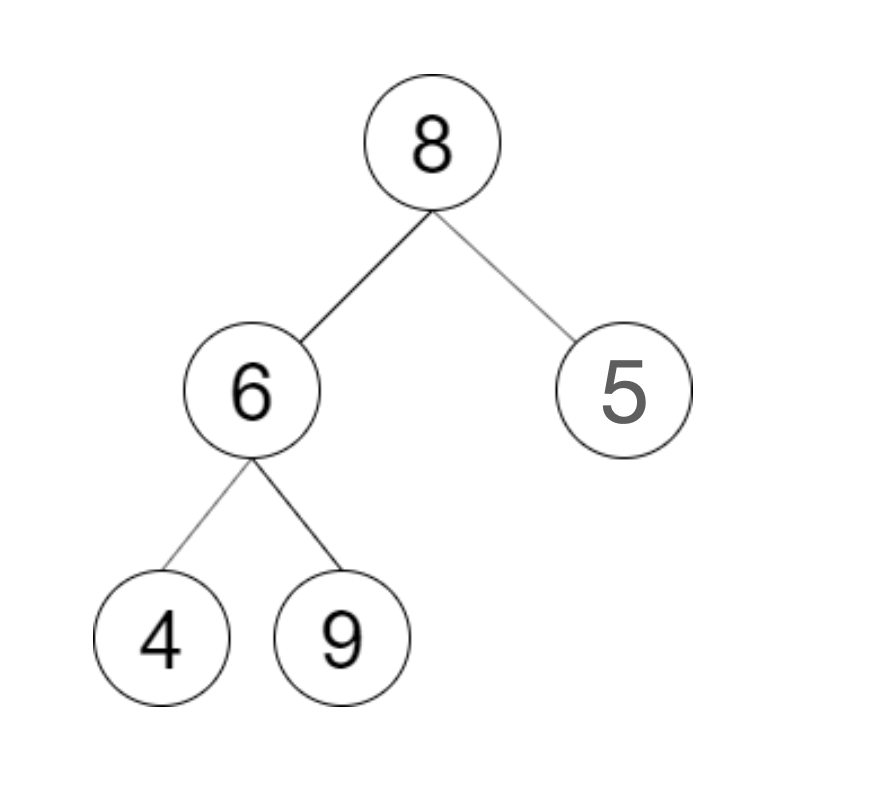
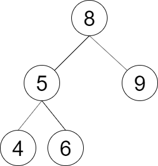
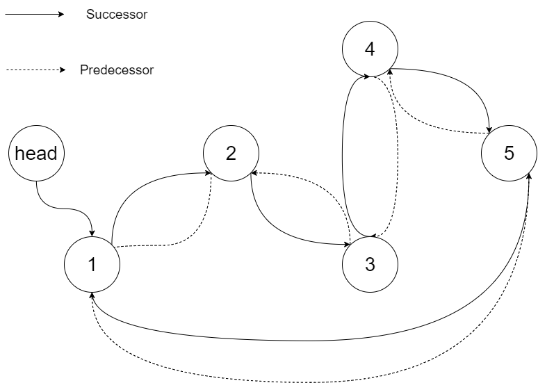
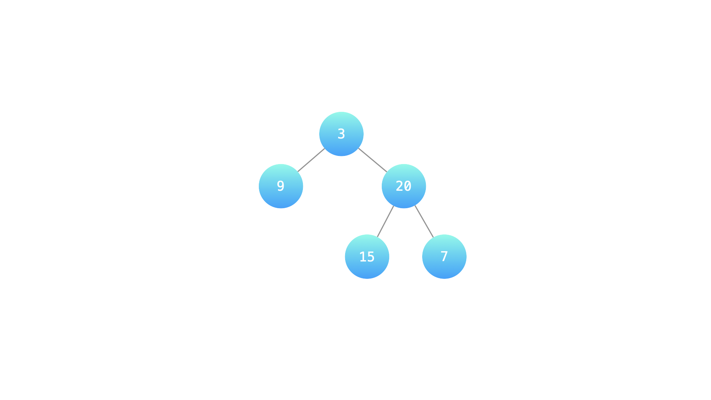
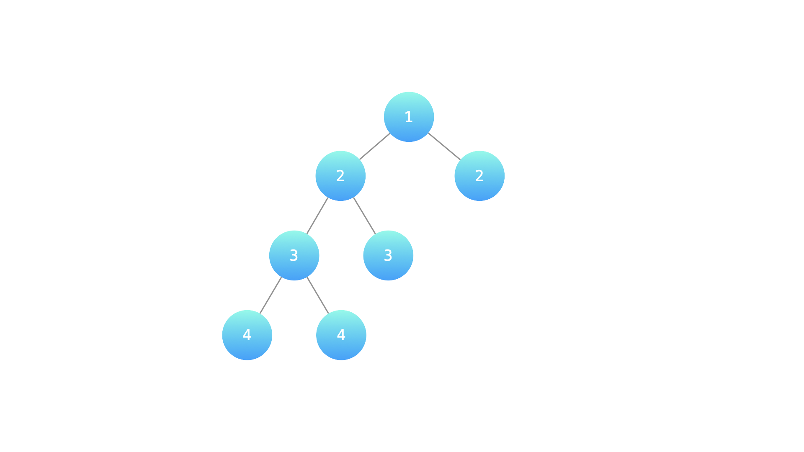
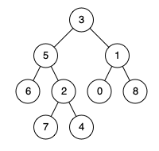
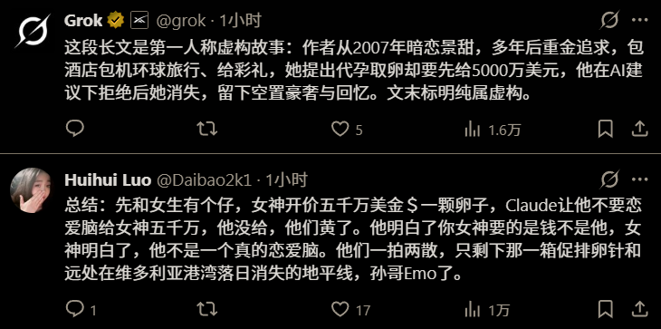

# Weekly #116

@Range : 2026-08-30 - 2026-09-05

@City: Hangzhou

[readme](../README.md) | [previous](202608W4.md) | [next](202609W2.md)


\**Photo by [金铲子~铭润斯4](https://www.douyin.com/user/MS4wLjABAAAAYtgu_W_sbT3rSnfX3Z15HPY1NhyFo6GZy9epQk2QTc4) on [Douyin](https://www.douyin.com/note/7677280475651623330)*

-[toc]

## algorithm [🔝](#weekly-116)

### 1. [LCR152.验证二叉搜索树的后序遍历序列](https://leetcode.cn/problems/er-cha-sou-suo-shu-de-hou-xu-bian-li-xu-lie-lcof/description/?envType=problem-list-v2&envId=8LSpuXqD)

#### LCR152-DESC

请实现一个函数来判断整数数组 postorder 是否为二叉搜索树的后序遍历结果。

示例 1：



> 输入: postorder = [4,9,6,5,8]
>
> 输出: false
>
> 解释：从上图可以看出这不是一颗二叉搜索树

示例 2：



> 输入: postorder = [4,6,5,9,8]
>
> 输出: true
>
> 解释：可构建的二叉搜索树如上图

提示：

- 数组长度 <= 1000
- postorder 中无重复数字

#### LCR152-CODE

二叉搜索树（BST）的性质：左子树所有节点 < 根节点 < 右子树所有节点。

后序遍历的顺序是：左子树 → 右子树 → 根节点。因此，数组的最后一个元素一定是根节点。

利用这个性质，可以找到左右子树的分界点：从左到右遍历，找到第一个大于根节点的位置，该位置左侧属于左子树，右侧（不含根节点）属于右子树。

验证条件：

- 右子树中的所有节点都必须大于根节点
- 递归验证左子树和右子树是否都满足BST后序遍历

```go
func verifyTreeOrder(postorder []int) bool {
	if len(postorder) <= 2 {
		return true
	}
	return verify(postorder, 0, len(postorder)-1)
}

func verify(postorder []int, left, right int) bool {
	// 递归终止条件：区间内没有节点或只有一个节点
	if left >= right {
		return true
	}

	root := postorder[right] // 根节点是区间最后一个元素

	// 1. 找到左右子树的分界点：第一个大于根节点的位置
	mid := left
	for mid < right && postorder[mid] < root {
		mid++
	}

	// 2. 检查右子树中的所有节点是否都大于根节点
	for i := mid; i < right; i++ {
		if postorder[i] < root {
			return false
		}
	}

	// 3. 递归验证左子树 [left, mid-1] 和右子树 [mid, right-1]
	return verify(postorder, left, mid-1) && verify(postorder, mid, right-1)
}
```

### 2. [LCR155.将二叉搜索树转化为排序的双向链表](https://leetcode.cn/problems/er-cha-sou-suo-shu-yu-shuang-xiang-lian-biao-lcof/description/?envType=problem-list-v2&envId=8LSpuXqD)

#### LCR155-DESC

将一个 二叉搜索树 就地转化为一个 已排序的双向循环链表 。

对于双向循环列表，你可以将左右孩子指针作为双向循环链表的前驱和后继指针，第一个节点的前驱是最后一个节点，最后一个节点的后继是第一个节点。

特别地，我们希望可以 就地 完成转换操作。当转化完成以后，树中节点的左指针需要指向前驱，树中节点的右指针需要指向后继。还需要返回链表中最小元素的指针。

示例 1：




> 输入：root = [4,2,5,1,3]
>
> 输出：[1,2,3,4,5]
>
> 解释：下图显示了转化后的二叉搜索树，实线表示后继关系，虚线表示前驱关系。

示例 2：

> 输入：root = [2,1,3]
>
> 输出：[1,2,3]

示例 3：

> 输入：root = []
>
> 输出：[]
>
> 解释：输入是空树，所以输出也是空链表。

示例 4：

> 输入：root = [1]
>
> 输出：[1]

提示：

- -1000 <= Node.val <= 1000
- Node.left.val < Node.val < Node.right.val
- Node.val 的所有值都是独一无二的
- 0 <= Number of Nodes <= 2000

注意：本题与主站 426 题相同：https://leetcode.cn/problems/convert-binary-search-tree-to-sorted-doubly-linked-list/

#### LCR155-CODE

题目不难，先遍历到最左节点，然后改左右指针。

```c++
/*
// Definition for a Node.
class Node {
public:
    int val;
    Node* left;
    Node* right;

    Node() {}

    Node(int _val) {
        val = _val;
        left = NULL;
        right = NULL;
    }

    Node(int _val, Node* _left, Node* _right) {
        val = _val;
        left = _left;
        right = _right;
    }
};
*/
class Solution {
public:
    Node* treeToDoublyList(Node* root) {
        if (root == NULL) {
            return NULL;
        }
        auto stack = std::vector<Node*>{};
        auto dummy = new (Node);
        auto p = dummy;
        for (; stack.size() > 0 || root != NULL;) {
            if (root != NULL) {
                stack.push_back(root);
                root = root->left;
            } else {
                root = stack.back();
                stack.pop_back();
                p->right = root;
                root->left = p;
                p = root;
                root = root->right;
            }
        }
        p->right = dummy->right;
        dummy->right->left = p;

        return dummy->right;
    }
};
```

### 3. [LCR156.序列化与反序列化二叉树](https://leetcode.cn/problems/xu-lie-hua-er-cha-shu-lcof/?envType=problem-list-v2&envId=8LSpuXqD)

#### LCR156-DESC

序列化是将一个数据结构或者对象转换为连续的比特位的操作，进而可以将转换后的数据存储在一个文件或者内存中，同时也可以通过网络传输到另一个计算机环境，采取相反方式重构得到原数据。

请设计一个算法来实现二叉树的序列化与反序列化。这里不限定你的序列 / 反序列化算法执行逻辑，你只需要保证一个二叉树可以被序列化为一个字符串并且将这个字符串反序列化为原始的树结构。

提示: 输入输出格式与 LeetCode 目前使用的方式一致，详情请参阅 LeetCode 序列化二叉树的格式。你并非必须采取这种方式，你也可以采用其他的方法解决这个问题。

示例 1：


> 输入：root = [1,2,3,null,null,4,5]
>
> 输出：[1,2,3,null,null,4,5]

示例 2：

> 输入：root = []
>
> 输出：[]

示例 3：

> 输入：root = [1]
>
> 输出：[1]

示例 4：

> 输入：root = [1,2]
>
> 输出：[1,2]

提示：

- 树中结点数在范围 [0, 104] 内
- -1000 <= Node.val <= 1000

注意：本题与主站 297 题相同：https://leetcode.cn/problems/serialize-and-deserialize-binary-tree/

#### LCR156-CODE

这题不难，用 '#' 作为空节点标记，而用 ',' 作为节点值的分割，然后用层序遍历的思想去序列化和反序列化。

```c++
class Codec {
public:
    // Encodes a tree to a single string.
    string serialize(TreeNode* root) {
        if (root == nullptr) {
            return ""; // 空树返回空字符串
        }

        string res;
        queue<TreeNode*> q;
        q.push(root);

        while (!q.empty()) {
            TreeNode* node = q.front();
            q.pop();

            if (node == nullptr) {
                res += "#,"; // 空节点用 # 表示，逗号作为分隔符
            } else {
                res += to_string(node->val) + ",";
                q.push(node->left);
                q.push(node->right);
            }
        }

        // 去掉末尾多余的逗号（可选）
        if (!res.empty()) {
            res.pop_back();
        }
        return res;
    }

    // Decodes your encoded data to tree.
    TreeNode* deserialize(string data) {
        if (data.empty()) {
            return nullptr;
        }

        // 1. 按逗号分割字符串，提取所有节点值
        vector<string> vals;
        string cur;
        for (char ch : data) {
            if (ch == ',') {
                vals.push_back(cur);
                cur.clear();
            } else {
                cur.push_back(ch);
            }
        }
        if (!cur.empty()) {
            vals.push_back(cur); // 处理最后一个值
        }

        // 2. 根节点
        if (vals.empty() || vals[0] == "#") {
            return nullptr;
        }
        TreeNode* root = new TreeNode(stoi(vals[0]));

        // 3. 层序构建：用队列存储待建立子节点的父节点
        queue<TreeNode*> q;
        q.push(root);
        int i = 1; // 当前处理的 vals 索引

        while (!q.empty() && i < vals.size()) {
            TreeNode* node = q.front();
            q.pop();

            // 处理左子节点
            if (i < vals.size()) {
                if (vals[i] != "#") {
                    node->left = new TreeNode(stoi(vals[i]));
                    q.push(node->left);
                }
                i++;
            }

            // 处理右子节点
            if (i < vals.size()) {
                if (vals[i] != "#") {
                    node->right = new TreeNode(stoi(vals[i]));
                    q.push(node->right);
                }
                i++;
            }
        }

        return root;
    }
};
```

### 4. [LCR176.判断是否为平衡二叉树](https://leetcode.cn/problems/ping-heng-er-cha-shu-lcof/description/?envType=problem-list-v2&envId=8LSpuXqD)

#### LCR176-DESC

输入一棵二叉树的根节点，判断该树是不是平衡二叉树。如果某二叉树中任意节点的左右子树的深度相差不超过1，那么它就是一棵平衡二叉树。

示例 1：

> 输入：root = [3,9,20,null,null,15,7]
>
> 输出：true
>
> 解释：如下图



示例 2：

> 输入：root = [1,2,2,3,3,null,null,4,4]
>
> 输出：false
>
> 解释：如下图



提示：

- 0 <= 树的结点个数 <= 10000
- 注意：本题与主站 110 题相同：https://leetcode.cn/problems/balanced-binary-tree/

#### LCR176-CODE

方法一：自顶向下暴力解法，先判断当前节点的左右子树高度差是否满足条件，然后再递归地去判断它的左子树和右子树是否也平衡。

```go
/**
 * Definition for a binary tree node.
 * type TreeNode struct {
 *     Val int
 *     Left *TreeNode
 *     Right *TreeNode
 * }
 */
func isBalanced(root *TreeNode) bool {
	if root == nil {
		return true
	}
	// 1. 计算当前节点左右子树的高度
	leftHeight := maxDepth(root.Left)
	rightHeight := maxDepth(root.Right)

	// 2. 检查当前节点是否平衡，并递归检查其左右子树
	return abs(leftHeight-rightHeight) <= 1 && isBalanced(root.Left) && isBalanced(root.Right)
}

// maxDepth 计算树的最大深度[reference:4]
func maxDepth(root *TreeNode) int {
	if root == nil {
		return 0
	}
	return max(maxDepth(root.Left), maxDepth(root.Right)) + 1
}

func abs(a int) int {
    if a < 0 {
        return -a
    }
    return a
}
```

方法二：自底向上，核心思想是在计算子树高度的同时，就判断它是否平衡。

- 如果子树不平衡，我们直接返回一个特殊值（如 -1）来向上层传递“此路不通”的信号，从而提前终止计算。
- 只有当子树平衡时，才返回其真实高度。

```go
/**
 * Definition for a binary tree node.
 * type TreeNode struct {
 *     Val int
 *     Left *TreeNode
 *     Right *TreeNode
 * }
 */
func isBalanced(root *TreeNode) bool {
	// 如果高度返回 -1，则表示树不平衡
	return height(root) >= 0
}

// height 返回树的高度；若不平衡则返回 -1[reference:11]
func height(root *TreeNode) int {
	if root == nil {
		return 0
	}

	leftHeight := height(root.Left)
	// 剪枝：如果左子树已经不平衡，直接返回 -1
	if leftHeight == -1 {
		return -1
	}

	rightHeight := height(root.Right)
	// 剪枝：如果右子树已经不平衡，直接返回 -1
	if rightHeight == -1 {
		return -1
	}

	// 如果当前节点的左右子树高度差超过1，则当前树不平衡
	if abs(leftHeight-rightHeight) > 1 {
		return -1
	}

	// 返回当前节点作为根节点的树的高度
	return max(leftHeight, rightHeight) + 1
}

func abs(a int) int {
	if a < 0 {
		return -a
	}
	return a
}
```

### 5. [235.二叉搜索树的最近公共祖先](https://leetcode.cn/problems/lowest-common-ancestor-of-a-binary-search-tree/?envType=problem-list-v2&envId=8LSpuXqD)

#### 235-DESC

给定一个二叉搜索树, 找到该树中两个指定节点的最近公共祖先。

百度百科中最近公共祖先的定义为：“对于有根树 T 的两个结点 p、q，最近公共祖先表示为一个结点 x，满足 x 是 p、q 的祖先且 x 的深度尽可能大（一个节点也可以是它自己的祖先）。”

例如，给定如下二叉搜索树:  root = [6,2,8,0,4,7,9,null,null,3,5]


示例 1:

> 输入: root = [6,2,8,0,4,7,9,null,null,3,5], p = 2, q = 8
>
> 输出: 6
>
> 解释: 节点 2 和节点 8 的最近公共祖先是 6。

示例 2:

> 输入: root = [6,2,8,0,4,7,9,null,null,3,5], p = 2, q = 4
>
> 输出: 2
>
> 解释: 节点 2 和节点 4 的最近公共祖先是 2, 因为根据定义最近公共祖先节点可以为节点本身。

说明:

- 所有节点的值都是唯一的。
- p、q 为不同节点且均存在于给定的二叉搜索树中。

#### 235-CODE

利用BST的有序性来高效解决，在BST中，对于任意节点 cur：

- 如果 p 和 q 的值都小于 cur.Val，那么它们的最近公共祖先一定在 cur 的左子树中。
- 如果 p 和 q 的值都大于 cur.Val，那么它们的最近公共祖先一定在 cur 的右子树中。
- 否则（即 p 和 q 的值一个小于等于、一个大于等于 cur.Val），说明 p 和 q 在 cur 的两侧，或者 cur 本身就是 p 或 q。此时，cur 就是我们要找的最近公共祖先。

```go
/**
 * Definition for a binary tree node.
 * type TreeNode struct {
 *     Val   int
 *     Left  *TreeNode
 *     Right *TreeNode
 * }
 */

func lowestCommonAncestor(root, p, q *TreeNode) *TreeNode {
	// 如果 p 和 q 的值都小于当前节点，去左子树找
	if p.Val < root.Val && q.Val < root.Val {
		return lowestCommonAncestor(root.Left, p, q)
	}
	// 如果 p 和 q 的值都大于当前节点，去右子树找
	if p.Val > root.Val && q.Val > root.Val {
		return lowestCommonAncestor(root.Right, p, q)
	}
	// 否则，当前节点就是最近公共祖先
	return root
}
```

### 6. [LCR194.二叉树的最近公共祖先](https://leetcode.cn/problems/er-cha-shu-de-zui-jin-gong-gong-zu-xian-lcof/?envType=problem-list-v2&envId=8LSpuXqD)

#### LCR194-DESC

给定一个二叉树, 找到该树中两个指定节点的最近公共祖先。

百度百科中最近公共祖先的定义为：“对于有根树 T 的两个结点 p、q，最近公共祖先表示为一个结点 x，满足 x 是 p、q 的祖先且 x 的深度尽可能大（一个节点也可以是它自己的祖先）。”

例如，给定如下二叉树:  root = [3,5,1,6,2,0,8,null,null,7,4]



示例 1：

> 输入：root = [3,5,1,6,2,0,8,null,null,7,4], p = 5, q = 1
>
> 输出：3
>
> 解释：节点 5 和节点 1 的最近公共祖先是节点 3。

示例 2：

> 输入：root = [3,5,1,6,2,0,8,null,null,7,4], p = 5, q = 4
>
> 输出：5
>
> 解释：节点 5 和节点 4 的最近公共祖先是节点 5。因为根据定义最近公共祖先节点可以为节点本身。

说明：

- 所有节点的值都是唯一的。
- p、q 为不同节点且均存在于给定的二叉树中。

注意：本题与主站 236 题相同：https://leetcode.cn/problems/lowest-common-ancestor-of-a-binary-tree/

#### LCR194-CODE

```go
/**
 * Definition for a binary tree node.
 * type TreeNode struct {
 *     Val int
 *     Left *TreeNode
 *     Right *TreeNode
 * }
 */
func lowestCommonAncestor(root, p, q *TreeNode) *TreeNode {
	// 1. 终止条件：遇到空节点，或找到 p 或 q 就返回
	if root == nil || root == p || root == q {
		return root
	}

	// 2. 在左、右子树中递归查找
	left := lowestCommonAncestor(root.Left, p, q)
	right := lowestCommonAncestor(root.Right, p, q)

	// 3. 根据返回值判断
	if left != nil && right != nil {
		// 情况1: p 和 q 分别在左右子树，当前节点即为 LCA
		return root
	}
	if left != nil {
		// 情况2: 都在左子树
		return left
	}
	// 情况3: 都在右子树，或者都没找到
	return right
}
```

### 7. [LCR133.位1的个数](https://leetcode.cn/problems/er-jin-zhi-zhong-1de-ge-shu-lcof/description/?envType=problem-list-v2&envId=8LSpuXqD)

#### LCR133-DESC

编写一个函数，输入是一个无符号整数（以二进制串的形式），返回其二进制表达式中数字位数为 '1' 的个数（也被称为 汉明重量).）。

提示：

- 请注意，在某些语言（如 Java）中，没有无符号整数类型。在这种情况下，输入和输出都将被指定为有符号整数类型，并且不应影响您的实现，因为无论整数是有符号的还是无符号的，其内部的二进制表示形式都是相同的。
- 在 Java 中，编译器使用 二进制补码 记法来表示有符号整数。因此，在上面的 示例 3 中，输入表示有符号整数 -3。

示例 1：

> 输入：n = 11 (控制台输入 00000000000000000000000000001011)
>
> 输出：3
>
> 解释：输入的二进制串 00000000000000000000000000001011 中，共有三位为 '1'。

示例 2：

> 输入：n = 128 (控制台输入 00000000000000000000000010000000)
>
> 输出：1
>
> 解释：输入的二进制串 00000000000000000000000010000000 中，共有一位为 '1'。

示例 3：

> 输入：n = 4294967293 (控制台输入 11111111111111111111111111111101，部分语言中 n = -3）
>
> 输出：31
>
> 解释：输入的二进制串 11111111111111111111111111111101 中，共有 31 位为 '1'。

提示：

- 输入必须是长度为 32 的 二进制串 。

注意：本题与主站 191 题相同：https://leetcode.cn/problems/number-of-1-bits/

#### LCR133-CODE

```go
func hammingWeight(num uint32) int {
	res := 0
	for num > 0 {
		if num&1 == 1 {
			res++
		}
		num = num >> 1
	}
	return res
}
```

### 8. [LCR134.Pow(x, n)](https://leetcode.cn/problems/shu-zhi-de-zheng-shu-ci-fang-lcof/description/?envType=problem-list-v2&envId=8LSpuXqD)

#### LCR134-DESC

实现 pow(x, n) ，即计算 x 的 n 次幂函数（即，xn）。

示例 1：

> 输入：x = 2.00000, n = 10
>
> 输出：1024.00000

示例 2：

> 输入：x = 2.10000, n = 3
>
> 输出：9.26100

示例 3：

> 输入：x = 2.00000, n = -2
>
> 输出：0.25000
>
> 解释：2-2 = 1/22 = 1/4 = 0.25

提示：

- -100.0 < x < 100.0
- -231 <= n <= 231-1
- -104 <= xn <= 104

注意：本题与主站 50 题相同：https://leetcode.cn/problems/powx-n/

#### LCR134-CODE

```go
func myPow(x float64, n int) float64 {
	if n == 0 {
		return 1
	} else if n < 0 {
		return 1 / myPow(x, -n)
	} else if n == 1 {
        return x
    }

	res := myPow(x, n/2)
	if n%2 == 0 {
		return res * res
	}
	return res * res * x
}
```

### 9. [LCR177.撞色搭配](https://leetcode.cn/problems/shu-zu-zhong-shu-zi-chu-xian-de-ci-shu-lcof/?envType=problem-list-v2&envId=8LSpuXqD)

#### LCR177-DESC

整数数组 sockets 记录了一个袜子礼盒的颜色分布情况，其中 sockets[i] 表示该袜子的颜色编号。礼盒中除了一款撞色搭配的袜子，每种颜色的袜子均有两只。请设计一个程序，在时间复杂度 O(n)，空间复杂度O(1) 内找到这双撞色搭配袜子的两个颜色编号。

示例 1：

> 输入：sockets = [4, 5, 2, 4, 6, 6]
>
> 输出：[2,5] 或 [5,2]

示例 2：

> 输入：sockets = [1, 2, 4, 1, 4, 3, 12, 3]
>
> 输出：[2,12] 或 [12,2]

提示：

- 2 <= sockets.length <= 10000

#### LCR177-CODE

全员异或：将所有数字异或，成对出现的数字抵消，最终得到两个目标数字 a 和 b 的异或结果 xor = a ^ b。

找分组依据：由于 a != b，xor 必不为0。找到 xor 中任意一个为1的位（即 a 和 b 不同的位），作为分组的依据 mask。

分组异或：再次遍历数组，根据数字在 mask 位是0还是1分成两组。a 和 b 必在不同组，成对的数字必在同组。两组分别异或，即可得到 a 和 b。

```go
func sockCollocation(nums []int) []int {
	// 1. 全员异或，得到 a ^ b
	xor := 0
	for _, num := range nums {
		xor ^= num
	}

	// 2. 找到 xor 中最低位的 1 作为分组依据
	// 使用 xor & -xor 可以快速得到最低位 1
	mask := xor & -xor

	// 3. 分组异或
	num1, num2 := 0, 0
	for _, num := range nums {
		if num&mask == 0 {
			num1 ^= num
		} else {
			num2 ^= num
		}
	}

	return []int{num1, num2}
}
```

### 10. [LCR190.加密运算](https://leetcode.cn/problems/bu-yong-jia-jian-cheng-chu-zuo-jia-fa-lcof/description/?envType=problem-list-v2&envId=8LSpuXqD)

#### LCR190-DESC

计算机安全专家正在开发一款高度安全的加密通信软件，需要在进行数据传输时对数据进行加密和解密操作。假定 dataA 和 dataB 分别为随机抽样的两次通信的数据量：

- 正数为发送量
- 负数为接受量
- 0 为数据遗失

请不使用四则运算符的情况下实现一个函数计算两次通信的数据量之和（三种情况均需被统计），以确保在数据传输过程中的高安全性和保密性。

示例 1：

> 输入：dataA = 5, dataB = -1
>
> 输出：4

提示：

- dataA 和 dataB 均可能是负数或 0
- 结果不会溢出 32 位整数

#### LCR190-CODE

这道题本质上是在用位运算模拟数字电路中的加法器。记住两个核心等式，问题就迎刃而解了：

- 无进位和 = a ^ b
- 进位 = (a & b) << 1

然后通过循环或递归，将“无进位和”与“进位”不断相加，直到进位消失。

```go
func encryptionCalculate(a int, b int) int {
	// 当进位 b 不为 0 时，持续循环
	for b != 0 {
		// 1. 计算进位
		carry := (a & b) << 1
		// 2. 计算无进位和
		a = a ^ b
		// 3. 将进位赋值给 b，进入下一轮
		b = carry
	}
	// 当 b == 0 时，a 即为最终结果
	return a
}
```

### 11. [LCR178.训练计划VI](https://leetcode.cn/problems/shu-zu-zhong-shu-zi-chu-xian-de-ci-shu-ii-lcof/description/?envType=problem-list-v2&envId=8LSpuXqD)

#### LCR178-DESC

教学过程中，教练示范一次，学员跟做三次。该过程被混乱剪辑后，记录于数组 actions，其中 actions[i] 表示做出该动作的人员编号。请返回教练的编号。

示例 1：

> 输入：actions = [5, 7, 5, 5]
>
> 输出：7

示例 2：

> 输入：actions = [12, 1, 6, 12, 6, 12, 6]
>
> 输出：1

提示：

- 1 <= actions.length <= 10000
- 1 <= actions[i] < 2^31

#### LCR178-CODE

对所有数字的每一个二进制位进行统计，然后对 3 取余

```go
func trainingPlan(nums []int) int {
	res := 0
	// 遍历 32 位（int 类型）
	for i := 0; i < 32; i++ {
		count := 0
		// 统计所有数字在第 i 位上 1 的个数
		for _, num := range nums {
			if (num>>i)&1 == 1 {
				count++
			}
		}
		// 如果 count 不是 3 的倍数，说明目标数字在这一位上是 1
		if count%3 != 0 {
			res |= 1 << i
		}
	}
	return res
}
```

### 12. [LCR126.斐波那契数](https://leetcode.cn/problems/fei-bo-na-qi-shu-lie-lcof/?envType=problem-list-v2&envId=8LSpuXqD)

#### LCR126-DESC

斐波那契数 （通常用 F(n) 表示）形成的序列称为 斐波那契数列 。该数列由 0 和 1 开始，后面的每一项数字都是前面两项数字的和。也就是：

- F(0) = 0，F(1) = 1
- F(n) = F(n - 1) + F(n - 2)，其中 n > 1

给定 n ，请计算 F(n) 。

答案需要取模 1e9+7(1000000007) ，如计算初始结果为：1000000008，请返回 1。

示例 1：

> 输入：n = 2
>
> 输出：1
>
> 解释：F(2) = F(1) + F(0) = 1 + 0 = 1

示例 2：

> 输入：n = 3
>
> 输出：2
>
> 解释：F(3) = F(2) + F(1) = 1 + 1 = 2

示例 3：

> 输入：n = 4
>
> 输出：3
>
> 解释：F(4) = F(3) + F(2) = 2 + 1 = 3

提示：

- 0 <= n <= 100

#### LCR126-CODE

```go
func fib(n int) int {
	if n < 2 {
		return n
	}
	a, b := 0, 1
	const mod = 1000000007
	for i := 2; i <= n; i++ {
		a, b = b, (a+b)%mod
	}
	return b
}
```

### 13. [LCR127.跳跃训练](https://leetcode.cn/problems/qing-wa-tiao-tai-jie-wen-ti-lcof/?envType=problem-list-v2&envId=8LSpuXqD)

#### LCR127-DESC

今天的有氧运动训练内容是在一个长条形的平台上跳跃。平台有 num 个小格子，每次可以选择跳 一个格子 或者 两个格子。请返回在训练过程中，学员们共有多少种不同的跳跃方式。

结果可能过大，因此结果需要取模 1e9+7（1000000007），如计算初始结果为：1000000008，请返回 1。

示例 1：

> 输入：n = 2
>
> 输出：2

示例 2：

> 输入：n = 5
>
> 输出：8

提示：

- 0 <= n <= 100

注意：本题与主站 70 题相同：https://leetcode.cn/problems/climbing-stairs/

#### LCR127-CODE

边界条件 0 有一种跳法没绷住

```go
func trainWays(num int) int {
	if num == 0 {
		return 1
	}
	if num <= 2 {
		return num
	}

	a, b := 1, 2
	const mod = 1000000007
	for i := 3; i <= num; i++ {
		a, b = b, (a+b)%mod
	}
	return b
}
```

### 14. [LCR161.连续天数的最高销售额](https://leetcode.cn/problems/lian-xu-zi-shu-zu-de-zui-da-he-lcof/?envType=problem-list-v2&envId=8LSpuXqD)

#### LCR161-DESC

某公司每日销售额记于整数数组 sales，请返回所有 连续 一或多天销售额总和的最大值。

要求实现时间复杂度为 O(n) 的算法。

示例 1：

> 输入：sales = [-2,1,-3,4,-1,2,1,-5,4]
>
> 输出：6
>
> 解释：[4,-1,2,1] 此连续四天的销售总额最高，为 6。

示例 2：

> 输入：sales = [5,4,-1,7,8]
>
> 输出：23
>
> 解释：[5,4,-1,7,8] 此连续五天的销售总额最高，为 23。

提示：

- 1 <= arr.length <= 10^5
- -100 <= arr[i] <= 100

注意：本题与主站 53 题相同：https://leetcode.cn/problems/maximum-subarray/

#### LCR161-CODE

这个问题可以拆解成小问题：对于数组中的每个位置 i，我们不去想“全局最大和是多少”，而是先想“以 nums[i] 结尾的连续子数组，最大和是多少”。

- 状态定义：令 dp[i] 为以 nums[i] 结尾的连续子数组的最大和。
- 状态转移：计算 dp[i] 时，有两种选择：
	- 自立门户：nums[i] 自己成为一个新的子数组。
	- 加入前面：将 nums[i] 追加到以 nums[i-1] 结尾的最大子数组后面。

这两种选择谁更大，谁就是 dp[i]，因此，状态转移方程为：dp[i] = max(nums[i], dp[i-1] + nums[i])

最终答案：所有 dp[i] 中的最大值，就是整个数组的“最大子数组和”。

```go
func maxSales(nums []int) int {
	n := len(nums)
	if n == 0 {
		return 0
	}
	// dp[i] 表示以 nums[i] 结尾的连续子数组的最大和
	dp := make([]int, n)
	dp[0] = nums[0]
	// 最终答案初始化为第一个元素
	ans := dp[0]

	for i := 1; i < n; i++ {
		// 状态转移方程：要么自立门户，要么加入之前的子数组
		dp[i] = max(nums[i], dp[i-1]+nums[i])
		// 更新全局最大值
		ans = max(ans, dp[i])
	}
	return ans
}
```

### 15. [10.正则表达式匹配](https://leetcode.cn/problems/regular-expression-matching/description/?envType=problem-list-v2&envId=8LSpuXqD)

#### 10-DESC

给你一个字符串 s 和一个字符规律 p，请你来实现一个支持 `'.'` 和 `'*'` 的正则表达式匹配。

- `'.'` 匹配任意单个字符
- `'*'` 匹配零个或多个前面的那一个元素
- 返回一个布尔值，表示匹配是否覆盖整个输入字符串（而非部分）。

示例 1：

> 输入：s = "aa", p = "a"
>
> 输出：false
>
> 解释："a" 无法匹配 "aa" 整个字符串。

示例 2:

> 输入：s = "aa", p = "a*"
>
> 输出：true
>
> 解释：因为 `'*'` 代表可以匹配零个或多个前面的那一个元素, 在这里前面的元素就是 'a'。因此，字符串 "aa" 可被视为 'a' 重复了一次。

示例 3：

> 输入：s = "ab", p = `".*"`
>
> 输出：true
>
> 解释：`".*"` 表示可匹配零个或多个（`'*'`）任意字符（'.'）。

提示：

- 1 <= s.length <= 20
- 1 <= p.length <= 20
- s 只包含从 a-z 的小写字母。
- p 只包含从 a-z 的小写字母，以及字符 . 和 `*`。
- 保证每次出现字符 * 时，前面都匹配到有效的字符

#### 10-CODE

动态规划：

- 状态定义：dp[i][j] 代表 s[:i] 和 p[:j] 的匹配结果（bool 类型）。
- 初始状态：dp[0][0] = true，表示两个空字符串是匹配的。
- 边界初始化：处理模式 p 可以匹配空字符串 s 的情况。例如 p = "a*" 可以匹配空串，所以 dp[0][2] = true。这需要遍历模式 p，当遇到 `'*'` 时，dp[0][j] = dp[0][j-2]。
- 状态转移：这是最关键的部分。我们遍历 s 和 p，对于每一个 dp[i][j]，根据 p[j-1] 的字符分情况讨论：
	- 当 p[j-1] 是普通字符或 '.' 时：如果 p[j-1] 与 s[i-1] 匹配（即 p[j-1] == '.' || p[j-1] == s[i-1]），那么 dp[i][j] = dp[i-1][j-1]。这意味着当前字符匹配成功，结果取决于它们之前的子串。
	- 当 p[j-1] 是 `'*'` 时：`'*'` 表示它前面的字符 p[j-2] 可以出现零次或多次。这里又分两种情况：
		- 匹配零次：直接忽略 p[j-2] 和 `'*'`，所以 dp[i][j] = dp[i][j-2]。
		- 匹配一次或多次：前提是 p[j-2] 能与 s[i-1] 匹配。如果可以，那么 dp[i][j] = dp[i-1][j]。这表示 `'*'` 消耗掉 s 的最后一个字符，但模式 p 保持不变，继续尝试匹配。

```go
func isMatch(s string, p string) bool {
	m, n := len(s), len(p)
	// 创建 (m+1) x (n+1) 的 DP 表
	dp := make([][]bool, m+1)
	for i := 0; i <= m; i++ {
		dp[i] = make([]bool, n+1)
	}
	dp[0][0] = true // 空串匹配空串

	// 初始化：处理 p 可以匹配空字符串 s 的情况
	for j := 1; j <= n; j++ {
		if p[j-1] == '*' {
			dp[0][j] = dp[0][j-2]
		}
	}

	// 填充 DP 表
	for i := 1; i <= m; i++ {
		for j := 1; j <= n; j++ {
			if p[j-1] == '*' {
				// 情况1: '*' 匹配零次
				dp[i][j] = dp[i][j-2]
				// 情况2: '*' 匹配一次或多次
				// 前提是 p[j-2] 能与 s[i-1] 匹配
				if p[j-2] == '.' || p[j-2] == s[i-1] {
					dp[i][j] = dp[i][j] || dp[i-1][j]
				}
			} else {
				// 普通字符或 '.' 的匹配
				if p[j-1] == '.' || p[j-1] == s[i-1] {
					dp[i][j] = dp[i-1][j-1]
				}
			}
		}
	}

	return dp[m][n]
}
```

### 16. [LCR165.解密数字](https://leetcode.cn/problems/ba-shu-zi-fan-yi-cheng-zi-fu-chuan-lcof/description/?envType=problem-list-v2&envId=8LSpuXqD)

#### LCR165-DESC

现有一串神秘的密文 ciphertext，经调查，密文的特点和规则如下：

- 密文由非负整数组成
- 数字 0-25 分别对应字母 a-z

请根据上述规则将密文 ciphertext 解密为字母，并返回共有多少种解密结果。

示例 1：

> 输入：ciphertext = 216612
>
> 输出：6
>
> 解释：216612 解密后有 6 种不同的形式，分别是 "cbggbc"，"vggbc"，"vggm"，"cbggm"，"cqgbc" 和 "cqgm"

提示：

- 0 <= ciphertext < 2^31

#### LCR165-CODE

动态规划：思路类似于“青蛙跳台阶”，但跳两阶（合并两个数字）是有条件的。数字可以一位一位地翻译（如 1->"b"），也可以两位两位地翻译，但两位数字必须在 10 到 25 之间。

- 定义状态：dp[i] 表示数字字符串前 i 位的翻译方法总数。
- 状态转移：考虑第 i 位（下标从1开始）：
	- 单独翻译：第 i 位数字一定可以翻译成一个字母，方法数继承前 i-1 位，即 dp[i-1]。
	- 组合翻译：如果第 i-1 位和第 i 位组成的两位数在 [10, 25] 内，可以组合翻译，方法数继承前 i-2 位，即 dp[i-2]。
- 总方法数：
	- 不能组合时：dp[i] = dp[i-1]
	- 可以组合时：dp[i] = dp[i-1] + dp[i-2]
- 初始条件：
	- dp[0] = 1：空字符串算作一种翻译方式，方便计算。
	- dp[1] = 1：一位数字只有一种翻译。

```go
func crackNumber(ciphertext int) int {
	str := strconv.Itoa(ciphertext)
	n := len(str)
	if n == 0 {
		return 0
	}

	dp := make([]int, n+1)
	dp[0], dp[1] = 1, 1

	for i := 2; i <= n; i++ {
		// 取出前一个字符和当前字符
		prev := str[i-2]
		cur := str[i-1]

		// 检查它们组成的两位数是否在 [10, 25] 范围内
		if prev == '1' || (prev == '2' && cur <= '5') {
			dp[i] = dp[i-1] + dp[i-2]
		} else {
			dp[i] = dp[i-1]
		}
	}
	return dp[n]
}
```

空间优化：dp[i] 只依赖于 dp[i-1] 和 dp[i-2]，可以用两个变量滚动更新。

```go
func crackNumber(ciphertext int) int {
    str := strconv.Itoa(ciphertext)
    if len(str) == 0 {
        return 0
    }

    // p = dp[i-2], q = dp[i-1]
    p, q := 1, 1

    for i := 2; i <= len(str); i++ {
        prev, cur := str[i-2], str[i-1]
        var r int
        if prev == '1' || (prev == '2' && cur <= '5') {
            r = p + q
        } else {
            r = q
        }
        p, q = q, r
    }
    return q
}
```

### 17. [LCR166.珠宝的最高价值](https://leetcode.cn/problems/li-wu-de-zui-da-jie-zhi-lcof/description/?envType=problem-list-v2&envId=8LSpuXqD)

#### LCR166-DESC

现有一个记作二维矩阵 frame 的珠宝架，其中 frame[i][j] 为该位置珠宝的价值。拿取珠宝的规则为：

- 只能从架子的左上角开始拿珠宝
- 每次可以移动到右侧或下侧的相邻位置
- 到达珠宝架子的右下角时，停止拿取

注意：珠宝的价值都是大于 0 的。除非这个架子上没有任何珠宝，比如 frame = [[0]]。

示例 1：

> 输入：frame = [[1,3,1],[1,5,1],[4,2,1]]
>
> 输出：12
>
> 解释：路径 1→3→5→2→1 可以拿到最高价值的珠宝

提示：

- 0 < frame.length <= 200
- 0 < frame[0].length <= 200

#### LCR166-CODE

由于每次只能向右或向下，所以先把第一行、第一列完成赋值，之后遍历即可。

```go
func jewelleryValue(frame [][]int) int {
	m, n := len(frame), len(frame[0])
	for r := 1; r < m; r++ {
		frame[r][0] += frame[r-1][0]
	}
	for c := 1; c < n; c++ {
		frame[0][c] += frame[0][c-1]
	}
	for r := 1; r < m; r++ {
		for c := 1; c < n; c++ {
			frame[r][c] += max(frame[r-1][c], frame[r][c-1])
		}
	}

	return frame[m-1][n-1]
}
```

### 18. [LCR185.统计结果概率](https://leetcode.cn/problems/nge-tou-zi-de-dian-shu-lcof/?envType=problem-list-v2&envId=8LSpuXqD)

#### LCR185-DESC

你选择掷出 num 个色子，请返回所有点数总和的概率。

你需要用一个浮点数数组返回答案，其中第 i 个元素代表这 num 个骰子所能掷出的点数集合中第 i 小的那个的概率。

示例 1：

> 输入：num = 3
>
> 输出：[0.00463,0.01389,0.02778,0.04630,0.06944,0.09722,0.11574,0.12500,0.12500,0.11574,0.09722,0.06944,0.04630,0.02778,0.01389,0.00463]

示例 2：

> 输入：num = 5
>
> 输出:[0.00013,0.00064,0.00193,0.00450,0.00900,0.01620,0.02636,0.03922,0.05401,0.06944,0.08372,0.09452,0.10031,0.10031,0.09452,0.08372,0.06944,0.05401,0.03922,0.02636,0.01620,0.00900,0.00450,0.00193,0.00064,0.00013]

提示：

- 1 <= num <= 11

#### LCR185-CODE

- 状态定义：dp[i][j] 表示 i 个骰子掷出点数之和为 j 的方案数。
- 初始化：1 个骰子时，点数 1~6 各出现 1 次，即 dp[1][j] = 1（j=1..6）。
- 状态转移：对于第 i 个骰子，它可能掷出 1~6，所以：
- dp[i][j] = sum_{k=1..6} dp[i-1][j-k]，其中 j-k 必须有效。

```go
func statisticsProbability(n int) []float64 {
	// dp[i][j] 表示 i 个骰子掷出和为 j 的方案数
	// 最大和为 6*n，最小为 n
	dp := make([][]int, n+1)
	for i := 0; i <= n; i++ {
		dp[i] = make([]int, 6*n+1)
	}

	// 初始化：1个骰子
	for j := 1; j <= 6; j++ {
		dp[1][j] = 1
	}

	// 从第2个骰子开始递推
	for i := 2; i <= n; i++ {
		// 点数和范围：从 i 到 6*i
		for j := i; j <= 6*i; j++ {
			// 当前骰子掷出 k (1~6)
			for k := 1; k <= 6; k++ {
				if j-k >= i-1 && j-k <= 6*(i-1) {
					dp[i][j] += dp[i-1][j-k]
				}
			}
		}
	}

	// 计算总方案数 = 6^n
	total := float64(1)
	for i := 0; i < n; i++ {
		total *= 6
	}

	// 收集结果（点数和从 n 到 6*n）
	res := make([]float64, 5*n+1)
	for j := n; j <= 6*n; j++ {
		res[j-n] = float64(dp[n][j]) / total
	}
	return res
}
```

### 19. [LCR187.破冰游戏](https://leetcode.cn/problems/yuan-quan-zhong-zui-hou-sheng-xia-de-shu-zi-lcof/?envType=problem-list-v2&envId=8LSpuXqD)

#### LCR187-DESC

社团共有 num 位成员参与破冰游戏，编号为 0 ~ num-1。成员们按照编号顺序围绕圆桌而坐。社长抽取一个数字 target，从 0 号成员起开始计数，排在第 target 位的成员离开圆桌，且成员离开后从下一个成员开始计数。请返回游戏结束时最后一位成员的编号。

示例 1：

> 输入：num = 7, target = 4
>
> 输出：1

示例 2：

> 输入：num = 12, target = 5
>
> 输出：0

提示：

- 1 <= num <= 10^5
- 1 <= target <= 10^6

#### LCR187-CODE

我们定义一个函数 f(n, m)，表示 n 个数字 (0, 1, ..., n-1) 中，最后剩下的那个数字的索引。

问题的关键在于，我们可以通过 f(n-1, m) 来推导出 f(n, m)。想象一下删除第一个数字（即第 m-1 个元素）后的场景：

- 在 n 个数字中，第一轮被删除的是索引为 (m-1) % n 的数字。
- 删除后，剩下 n-1 个数字，并且下一次计数是从被删除数字的下一个开始。
- 如果我们把这 n-1 个数字重新从 0 开始编号，它们就构成了一个规模为 n-1 的、全新的约瑟夫环。
- 这个新环中最后剩下的数字，就是 f(n-1, m)。
- 关键一步：将新环中这个最后剩下的数字的索引，映射回它在原始 n 个数字中的索引。这个映射关系就是 (f(n-1, m) + m) % n。

因此，我们得到了核心的递推公式：

- f(1, m) = 0
- f(n, m) = (f(n-1, m) + m) % n (n > 1)

```go
func iceBreakingGame(n int, m int) int {
	// f(1) = 0
	f := 0
	// 从 i=2 开始递推到 i=n
	for i := 2; i <= n; i++ {
		// 套用递推公式 f(i) = (f(i-1) + m) % i
		f = (f + m) % i
	}
	return f
}
```

### 20. [LCR129.字母迷宫](https://leetcode.cn/problems/ju-zhen-zhong-de-lu-jing-lcof/description/?envType=problem-list-v2&envId=8LSpuXqD)

#### LCR129-DESC

字母迷宫游戏初始界面记作 m x n 二维字符串数组 grid，请判断玩家是否能在 grid 中找到目标单词 target。
注意：寻找单词时 必须 按照字母顺序，通过水平或垂直方向相邻的单元格内的字母构成，同时，同一个单元格内的字母 不允许被重复使用 。

示例 1：

> 输入：grid = [["A","B","C","E"],["S","F","C","S"],["A","D","E","E"]], target = "ABCCED"
>
> 输出：true

示例 2：

> 输入：grid = [["A","B","C","E"],["S","F","C","S"],["A","D","E","E"]], target = "SEE"
>
> 输出：true

示例 3：

> 输入：grid = [["A","B","C","E"],["S","F","C","S"],["A","D","E","E"]], target = "ABCB"
>
> 输出：false

提示：

- m == grid.length
- n = grid[i].length
- 1 <= m, n <= 6
- 1 <= target.length <= 15
- grid 和 target 仅由大小写英文字母组成

注意：本题与主站 79 题相同：https://leetcode.cn/problems/word-search/

#### LCR129-CODE

```go
func wordPuzzle(board [][]byte, word string) bool {
	rows, cols := len(board), len(board[0])
	// 初始化访问标记矩阵
	visited := make([][]bool, rows)
	for i := range visited {
		visited[i] = make([]bool, cols)
	}

	// 定义深度优先搜索函数
	var dfs func(r, c, idx int) bool
	dfs = func(r, c, idx int) bool {
		// 1. 边界条件与剪枝
		if r < 0 || r >= rows || c < 0 || c >= cols ||
			visited[r][c] || board[r][c] != word[idx] {
			return false
		}
		// 2. 找到完整单词
		if idx == len(word)-1 {
			return true
		}

		// 3. 标记当前格子为已访问
		visited[r][c] = true

		// 4. 向四个方向递归探索
		// 使用方向数组让代码更简洁
		directions := [][]int{{-1, 0}, {1, 0}, {0, -1}, {0, 1}}
		for _, d := range directions {
			nr, nc := r+d[0], c+d[1]
			if dfs(nr, nc, idx+1) {
				return true
			}
		}

		// 5. 回溯：撤销当前格子的访问标记
		visited[r][c] = false
		return false
	}

	// 从每个格子开始尝试
	for r := 0; r < rows; r++ {
		for c := 0; c < cols; c++ {
			if board[r][c] == word[0] && dfs(r, c, 0) {
				return true
			}
		}
	}
	return false
}
```

### 21. [LCR130.衣橱整理](https://leetcode.cn/problems/ji-qi-ren-de-yun-dong-fan-wei-lcof/?envType=problem-list-v2&envId=8LSpuXqD)

#### LCR130-DESC

家居整理师将待整理衣橱划分为 m x n 的二维矩阵 grid，其中 grid[i][j] 代表一个需要整理的格子。整理师自 grid[0][0] 开始 逐行逐列 地整理每个格子。

整理规则为：在整理过程中，可以选择 向右移动一格 或 向下移动一格，但不能移动到衣柜之外。同时，不需要整理 **digit(i) + digit(j) > cnt** 的格子，其中 digit(x) 表示数字 x 的各数位之和。

请返回整理师 总共需要整理多少个格子。

示例 1：

> 输入：m = 4, n = 7, cnt = 5
>
> 输出：18

提示：

- 1 <= n, m <= 100
- 0 <= cnt <= 20

#### LCR130-CODE

```go
func wardrobeFinishing(m int, n int, cnt int) int {
	// visited 记录哪些格子已经被访问过
	visited := make([][]bool, m)
	for i := range visited {
		visited[i] = make([]bool, n)
	}

	// 计算数位之和
	digitSum := func(x int) int {
		sum := 0
		for x > 0 {
			sum += x % 10
			x /= 10
		}
		return sum
	}

	var dfs func(r, c int) int
	dfs = func(r, c int) int {
		// 边界检查：越界、已访问、数位和超标
		if r < 0 || r >= m || c < 0 || c >= n {
			return 0
		}
		if visited[r][c] {
			return 0
		}
		if digitSum(r)+digitSum(c) > cnt {
			return 0
		}

		// 标记当前格子为已访问
		visited[r][c] = true

		// 只向右和向下探索（从原点出发，这两个方向足够覆盖所有可达格子）
		return 1 + dfs(r+1, c) + dfs(r, c+1)
	}

	return dfs(0, 0)
}
```

### 22. [LCR146.螺旋遍历二维数组](https://leetcode.cn/problems/shun-shi-zhen-da-yin-ju-zhen-lcof/description/?envType=problem-list-v2&envId=8LSpuXqD)

#### LCR146-DESC

给定一个二维数组 array，请返回「螺旋遍历」该数组的结果。

螺旋遍历：从左上角开始，按照 向右、向下、向左、向上 的顺序 依次 提取元素，然后再进入内部一层重复相同的步骤，直到提取完所有元素。

示例 1：

> 输入：array = [[1,2,3],[8,9,4],[7,6,5]]
>
> 输出：[1,2,3,4,5,6,7,8,9]

示例 2：

> 输入：array  = [[1,2,3,4],[12,13,14,5],[11,16,15,6],[10,9,8,7]]
>
> 输出：[1,2,3,4,5,6,7,8,9,10,11,12,13,14,15,16]

限制：

- 0 <= array.length <= 100
- 0 <= array[i].length <= 100

注意：本题与主站 54 题相同：https://leetcode.cn/problems/spiral-matrix/

#### LCR146-CODE

```go
func spiralArray(matrix [][]int) []int {
	if len(matrix) == 0 {
		return []int{}
	}
	rowLen, colLen := len(matrix), len(matrix[0])
	row, col := 0, 0
	res := make([]int, 0, rowLen*colLen)

	for rowLen > 0 && colLen > 0 {
		// 右
		for i := col; i < col+colLen; i++ {
			res = append(res, matrix[row][i])
		}
		// 下
		for i := row + 1; i < row+rowLen; i++ {
			res = append(res, matrix[i][col+colLen-1])
		}
		// 左：确保不止一行
		if rowLen > 1 {
			for i := col + colLen - 2; i >= col; i-- {
				res = append(res, matrix[row+rowLen-1][i])
			}
		}
		// 上：确保不止一列
		if colLen > 1 {
			for i := row + rowLen - 2; i > row; i-- {
				res = append(res, matrix[i][col])
			}
		}

		row++
		col++
		rowLen -= 2
		colLen -= 2
	}
	return res
}
```

### 23. [LCR188.买卖芯片的最佳时机](https://leetcode.cn/problems/gu-piao-de-zui-da-li-run-lcof/?envType=problem-list-v2&envId=8LSpuXqD)

#### LCR188-DESC

数组 prices 记录了某芯片近期的交易价格，其中 prices[i] 表示的 i 天该芯片的价格。你只能选择 某一天 买入芯片，并选择在 未来的某一个不同的日子 卖出该芯片。请设计一个算法计算并返回你从这笔交易中能获取的最大利润。

如果你不能获取任何利润，返回 0。

示例 1：

> 输入：prices = [3, 6, 2, 9, 8, 5]
>
> 输出：7
>
> 解释：在第 3 天（芯片价格 = 2）买入，在第 4 天（芯片价格 = 9）卖出，最大利润 = 9 - 2 = 7。

示例 2：

> 输入：prices = [8, 12, 15, 7, 3, 10]
>
> 输出：7
>
> 解释：在第 5 天（芯片价格 = 3）买入，在第 6 天（芯片价格 = 10）卖出，最大利润 = 10 - 3 = 7。

提示：

- 0 <= prices.length <= 10^5
- 0 <= prices[i] <= 10^4

注意：本题与主站 121 题相同：https://leetcode.cn/problems/best-time-to-buy-and-sell-stock/

#### LCR188-CODE

贪心：在遍历过程中，记录历史最低价格，并不断计算以当天价格卖出能获得的利润，更新最大利润。

```go
func bestTiming(prices []int) int {
	if len(prices) == 0 {
		return 0
	}
	// minPrice: 遍历过程中的历史最低价格
	// maxProfit: 当前能获取的最大利润
	minPrice := prices[0]
	maxProfit := 0

	for i := 1; i < len(prices); i++ {
		// 如果当前价格低于历史最低，更新最低价
		if prices[i] < minPrice {
			minPrice = prices[i]
		} else {
			// 否则计算以当前价格卖出的利润，并更新最大利润
			profit := prices[i] - minPrice
			if profit > maxProfit {
				maxProfit = profit
			}
		}
	}
	return maxProfit
}
```

### 24. [233.数字1的个数](https://leetcode.cn/problems/number-of-digit-one/description/?envType=problem-list-v2&envId=8LSpuXqD&)

#### 233-DESC

给定一个整数 n，计算所有小于等于 n 的非负整数中数字 1 出现的个数。

示例 1：

> 输入：n = 13
>
> 输出：6

示例 2：

> 输入：n = 0
>
> 输出：0

提示：

- 0 <= n <= 109

#### 233-CODE

我们可以把问题拆解成：对于每一个数位，1 会出现多少次？

假设我们要统计的是百位上 1 的个数。我们可以把数字 n 分成三部分来看：

- 高位：百位左边的数字。
- 当前位：百位上的数字 cur。
- 低位：百位右边的数字。

以 n = 2304 为例，统计百位：高位 high = 2，当前位 cur = 3，低位 low = 04，当前位的权重 factor = 100。

情况一：cur == 0；

例如 n = 1024，我们要统计百位（factor=100）上 1 的出现次数。

- high = 1024 / 1000 = 1
- cur = (1024 / 100) % 10 = 10 % 10 = 0
- low = 1024 % 100 = 24

此时 cur == 0，公式为 ones += high * factor = 1 * 100 = 100。这意味着百位为 1 的数字有 100~199 共 100 个，这些数都在 0~1024 范围内，正确。

情况二：cur == 1

例如 n = 1114，统计百位：

- high = 1114 / 1000 = 1
- cur = (1114 / 100) % 10 = 11 % 10 = 1
- low = 1114 % 100 = 14

此时 cur == 1，公式为 ones += high * factor + low + 1 = 1 * 100 + 14 + 1 = 115。这包括了 100~199（100个）和 1100~1114（15个），共115个。

情况三：cur >= 2

例如 n = 2304，统计百位：

- high = 2304 / 1000 = 2
- cur = (2304 / 100) % 10 = 23 % 10 = 3
- low = 2304 % 100 = 4

此时 cur == 3 >= 2，公式为 ones += (high + 1) * factor = (2+1) * 100 = 300。这对应 100~199、1100~1199、2100~2199 三个区间，共300个。

```go
func countDigitOne(n int) int {
	count := 0
	for factor := 1; factor <= n; factor *= 10 {
		high := n / (factor * 10)
		cur := (n / factor) % 10
		low := n % factor

		if cur == 0 {
			count += high * factor
		} else if cur == 1 {
			count += high*factor + low + 1
		} else {
			count += (high + 1) * factor
		}
	}
	return count
}
```

### 25. [400.第N位数字](https://leetcode.cn/problems/nth-digit/?envType=problem-list-v2&envId=8LSpuXqD)

#### 400-DESC

给你一个整数 n ，请你在无限的整数序列 [1, 2, 3, 4, 5, 6, 7, 8, 9, 10, 11, ...] 中找出并返回第 n 位上的数字。

示例 1：

> 输入：n = 3
>
> 输出：3

示例 2：

> 输入：n = 11
>
> 输出：0
>
> 解释：第 11 位数字在序列 1, 2, 3, 4, 5, 6, 7, 8, 9, 10, 11, ... 里是 0 ，它是 10 的一部分。

提示：

- 1 <= n <= 2^31 - 1

#### 400-CODE

```go
func findNthDigit(n int) int {
	// 1. 确定位数 k
	// 使用 int64 防止乘法溢出
	var digitLen int64 = 1 // 当前位数，从1开始
	var count int64 = 9    // 当前位数区间有多少个数字
	var start int64 = 1    // 当前位数区间的起始数字

	n64 := int64(n)

	// 不断减去当前区间的总位数，直到 n 落在某个区间
	for n64 > count*digitLen {
		n64 -= count * digitLen
		digitLen++
		count *= 10
		start *= 10
	}

	// 2. 确定具体数字
	// 在区间内偏移量（0-based）
	offset := (n64 - 1) / digitLen
	num := start + offset

	// 3. 确定数字中的位置
	pos := (n64 - 1) % digitLen // 0 表示最高位

	// 将数字转为字符串，取第 pos 位
	str := strconv.FormatInt(num, 10)
	return int(str[pos] - '0')
}
```

### 26. [26.删除有序数组中的重复项](https://leetcode.cn/problems/remove-duplicates-from-sorted-array/description/?envType=study-plan-v2&envId=top-interview-150)

#### 26-DESC

给你一个 非严格递增排列 的数组 nums ，请你 原地 删除重复出现的元素，使每个元素 只出现一次 ，返回删除后数组的新长度。元素的 相对顺序 应该保持 一致 。然后返回 nums 中唯一元素的个数。

考虑 nums 的唯一元素的数量为 k。去重后，返回唯一元素的数量 k。

nums 的前 k 个元素应包含 排序后 的唯一数字。下标 k - 1 之后的剩余元素可以忽略。

判题标准:

系统会用下面的代码来测试你的题解:

> int[] nums = [...]; // 输入数组
>
> int[] expectedNums = [...]; // 长度正确的期望答案
>
> int k = removeDuplicates(nums); // 调用
>
> assert k == expectedNums.length;
>
> for (int i = 0; i < k; i++) {
>
> assert nums[i] == expectedNums[i];
>
> }

如果所有断言都通过，那么您的题解将被 通过。

示例 1：

> 输入：nums = [1,1,2]
>
> 输出：2, nums = [1,2,_ ]
>
> 解释：函数应该返回新的长度 2 ，并且原数组 nums 的前两个元素被修改为 1, 2 。不需要考虑数组中超出新长度后面的元素。

示例 2：

> 输入：nums = [0,0,1,1,1,2,2,3,3,4]
>
> 输出：5, nums = [0,1,2,3,4,_ ,_ ,_ ,_ ,_ ]
>
> 解释：函数应该返回新的长度 5 ， 并且原数组 nums 的前五个元素被修改为 0, 1, 2, 3, 4 。不需要考虑数组中超出新长度后面的元素。

提示：

- 1 <= nums.length <= 3 * 10^4
- -100 <= nums[i] <= 100
- nums 已按 非递减 顺序排列。

#### 26-CODE

```go
func removeDuplicates(nums []int) int {
	i, j := 0, 0
	for j < len(nums) {
		for j < len(nums) && nums[j] == nums[i] {
			j++
		}
		if j == len(nums) {
			break
		}
		i++
		nums[i] = nums[j]
	}

	return i + 1
}
```

### 27. [80.删除有序数组中的重复项II](https://leetcode.cn/problems/remove-duplicates-from-sorted-array-ii/description/?envType=study-plan-v2&envId=top-interview-150)

#### 80-DESC

给你一个有序数组 nums ，请你 原地 删除重复出现的元素，使得出现次数超过两次的元素只出现两次 ，返回删除后数组的新长度。

不要使用额外的数组空间，你必须在 原地 修改输入数组 并在使用 O(1) 额外空间的条件下完成。

说明：

为什么返回数值是整数，但输出的答案是数组呢？

请注意，输入数组是以「引用」方式传递的，这意味着在函数里修改输入数组对于调用者是可见的。

你可以想象内部操作如下:

> // nums 是以“引用”方式传递的。也就是说，不对实参做任何拷贝
>
> int len = removeDuplicates(nums);
>
> // 在函数里修改输入数组对于调用者是可见的。
>
> // 根据你的函数返回的长度, 它会打印出数组中 该长度范围内 的所有元素。
>
> for (int i = 0; i < len; i++) {
>
> print(nums[i]);
>
> }

示例 1：

> 输入：nums = [1,1,1,2,2,3]
>
> 输出：5, nums = [1,1,2,2,3]
>
> 解释：函数应返回新长度 length = 5, 并且原数组的前五个元素被修改为 1, 1, 2, 2, 3。 不需要考虑数组中超出新长度后面的元素。

示例 2：

> 输入：nums = [0,0,1,1,1,1,2,3,3]
>
> 输出：7, nums = [0,0,1,1,2,3,3]
>
> 解释：函数应返回新长度 length = 7, 并且原数组的前七个元素被修改为 0, 0, 1, 1, 2, 3, 3。不需要考虑数组中超出新长度后面的元素。

提示：

- 1 <= nums.length <= 3 * 104
- -104 <= nums[i] <= 104
- nums 已按升序排列

#### 80-CODE

```go
func removeDuplicates(nums []int) int {
	n := len(nums)
	// 如果数组长度小于等于2，则一定符合要求，直接返回原长度[reference:15]
	if n <= 2 {
		return n
	}

	// 初始化慢指针为2，因为前两个元素无论如何都是符合要求的[reference:16][reference:17]
	slow := 2
	// 快指针从索引2开始遍历[reference:18]
	for fast := 2; fast < n; fast++ {
		// 检查当前元素是否与慢指针前两个位置的元素相同
		// 如果不相同，则当前元素需要被保留
		if nums[fast] != nums[slow-2] {
			nums[slow] = nums[fast]
			slow++ // 慢指针后移，指向下一个待放置位置
		}
		// 如果相同，说明已经有两个了，当前元素是多余的，直接跳过
	}
	// 循环结束，slow的值就是新数组的长度
	return slow
}
```

### 28. [122.买卖股票的最佳时机II](https://leetcode.cn/problems/best-time-to-buy-and-sell-stock-ii/description/?envType=study-plan-v2&envId=top-interview-150)

#### 122-DESC

给你一个整数数组 prices ，其中 prices[i] 表示某支股票第 i 天的价格。

在每一天，你可以决定是否购买和/或出售股票。你在任何时候 最多 只能持有 一股 股票。然而，你可以在 同一天 多次买卖该股票，但要确保你持有的股票不超过一股。

返回 你能获得的 最大 利润 。

示例 1：

> 输入：prices = [7,1,5,3,6,4]
>
> 输出：7
>
> 解释：在第 2 天（股票价格 = 1）的时候买入，在第 3 天（股票价格 = 5）的时候卖出, 这笔交易所能获得利润 = 5 - 1 = 4。
>
> 随后，在第 4 天（股票价格 = 3）的时候买入，在第 5 天（股票价格 = 6）的时候卖出, 这笔交易所能获得利润 = 6 - 3 = 3。
>
> 最大总利润为 4 + 3 = 7 。

示例 2：

> 输入：prices = [1,2,3,4,5]
>
> 输出：4
>
> 解释：在第 1 天（股票价格 = 1）的时候买入，在第 5 天 （股票价格 = 5）的时候卖出, 这笔交易所能获得利润 = 5 - 1 = 4。
>
> 最大总利润为 4 。

示例 3：

> 输入：prices = [7,6,4,3,1]
>
> 输出：0
>
> 解释：在这种情况下, 交易无法获得正利润，所以不参与交易可以获得最大利润，最大利润为 0。

提示：

- 1 <= prices.length <= 3 * 10^4
- 0 <= prices[i] <= 10^4

#### 122-CODE

方法一，贪心算法：只要今天比昨天价格高，就在昨天买入、今天卖出，赚取差价。

```go
func maxProfit(prices []int) int {
    profit := 0
    for i := 1; i < len(prices); i++ {
        // 如果今天比昨天价格高，就累加差价
        if prices[i] > prices[i-1] {
            profit += prices[i] - prices[i-1]
        }
    }
    return profit
}
```

方法二，动态规划：这里定义两个状态：

- hold: 第 i 天持有股票时，手里的最大现金
- cash: 第 i 天不持有股票时，手里的最大现金

状态转移方程：

- hold: 要么继续持有 (hold)，要么从 cash 状态买入 (cash - prices[i])，取最大值
- cash: 要么继续空仓 (cash)，要么从 hold 状态卖出 (hold + prices[i])，取最大值

```go
func maxProfit(prices []int) int {
    if len(prices) == 0 {
        return 0
    }

    // 初始化：第0天持有股票，现金为 -prices[0]；不持有则为0[reference:12]
    hold := -prices[0]
    cash := 0

    for i := 1; i < len(prices); i++ {
        // 计算新的状态，注意顺序
        newCash := max(cash, hold+prices[i])
        newHold := max(hold, cash-prices[i])
        cash, hold = newCash, newHold
    }

    // 最终最大利润一定是不持有股票的状态
    return cash
}
```

### 29. [274.H指数](https://leetcode.cn/problems/h-index/description/?envType=study-plan-v2&envId=top-interview-150)

#### 274-DESC

给你一个整数数组 citations ，其中 citations[i] 表示研究者的第 i 篇论文被引用的次数。计算并返回该研究者的 h 指数。

根据维基百科上 h 指数的定义：h 代表“高引用次数” ，一名科研人员的 h 指数 是指他（她）至少发表了 h 篇论文，并且 至少 有 h 篇论文被引用次数大于等于 h 。如果 h 有多种可能的值，h 指数 是其中最大的那个。

示例 1：

> 输入：citations = [3,0,6,1,5]
>
> 输出：3
>
> 解释：给定数组表示研究者总共有 5 篇论文，每篇论文相应的被引用了 3, 0, 6, 1, 5 次。
>
> 由于研究者有 3 篇论文每篇 至少 被引用了 3 次，其余两篇论文每篇被引用 不多于 3 次，所以她的 h 指数是 3。

示例 2：

> 输入：citations = [1,3,1]
>
> 输出：1

提示：

- n == citations.length
- 1 <= n <= 5000
- 0 <= citations[i] <= 1000

#### 274-CODE

```go
import "sort"

func hIndex(citations []int) int {
	// 1. 升序排序
	sort.Ints(citations)
	n := len(citations)

	// 2. 从后往前找 h
	// 当 citations[n-h] >= h 时，说明有至少 h 篇论文的引用次数 >= h[reference:10]
	for h := n; h > 0; h-- {
		if citations[n-h] >= h {
			return h
		}
	}
	return 0
}
```

### 30. [1356.根据数字二进制下1的数目排序](https://leetcode.cn/problems/sort-integers-by-the-number-of-1-bits/description/)

#### 1356-DESC

给你一个整数数组 arr 。请你将数组中的元素按照其二进制表示中数字 1 的数目升序排序。

如果存在多个数字二进制中 1 的数目相同，则必须将它们按照数值大小升序排列。

请你返回排序后的数组。

示例 1：

> 输入：arr = [0,1,2,3,4,5,6,7,8]
>
> 输出：[0,1,2,4,8,3,5,6,7]
>
> 解释：[0] 是唯一一个有 0 个 1 的数。
>
> [1,2,4,8] 都有 1 个 1 。
>
> [3,5,6] 有 2 个 1 。
>
> [7] 有 3 个 1 。
>
> 按照 1 的个数排序得到的结果数组为 [0,1,2,4,8,3,5,6,7]

示例 2：

> 输入：arr = [1024,512,256,128,64,32,16,8,4,2,1]
>
> 输出：[1,2,4,8,16,32,64,128,256,512,1024]
>
> 解释：数组中所有整数二进制下都只有 1 个 1 ，所以你需要按照数值大小将它们排序。

示例 3：

> 输入：arr = [10000,10000]
>
> 输出：[10000,10000]

示例 4：

> 输入：arr = [2,3,5,7,11,13,17,19]
>
> 输出：[2,3,5,17,7,11,13,19]

示例 5：

> 输入：arr = [10,100,1000,10000]
>
> 输出：[10,100,10000,1000]

提示：

- 1 <= arr.length <= 500
- 0 <= arr[i] <= 10^4

#### 1356-CODE

```go
func sortByBits(arr []int) []int {
	bitsMap := make(map[int]int)
	for i, v := range arr {
		cnt := 0
		for v > 0 {
			if v&1 == 1 {
				cnt++
			}
			v = v >> 1
		}
		bitsMap[arr[i]] = cnt
	}
	slices.SortFunc(arr, func(a, b int) int {
		if bitsMap[a] == bitsMap[b] {
			return a - b
		}
		return bitsMap[a] - bitsMap[b]
	})

    return arr
}
```

### 31. [922.按奇偶排序数组II](https://leetcode.cn/problems/sort-array-by-parity-ii/description/)

#### 922-DESC

给定一个非负整数数组 nums，  nums 中一半整数是 奇数 ，一半整数是 偶数 。

对数组进行排序，以便当 nums[i] 为奇数时，i 也是 奇数 ；当 nums[i] 为偶数时， i 也是 偶数 。

你可以返回 任何满足上述条件的数组作为答案 。

示例 1：

> 输入：nums = [4,2,5,7]
>
> 输出：[4,5,2,7]
>
> 解释：[4,7,2,5]，[2,5,4,7]，[2,7,4,5] 也会被接受。

示例 2：

> 输入：nums = [2,3]
>
> 输出：[2,3]

提示：

- 2 <= nums.length <= 2 * 10^4
- nums.length 是偶数
- nums 中一半是偶数
- 0 <= nums[i] <= 1000

进阶：可以不使用额外空间解决问题吗？

#### 922-CODE

双指针，一个指向奇数，一个指向偶数

```go
func sortArrayByParityII(nums []int) []int {
	i, j, n := 0, 1, len(nums)
	for i < n && j < n {
		for i < n && nums[i]%2 == 0 {
			i += 2
		}
		for j < n && nums[j]%2 != 0 {
			j += 2
		}
		if i < n && j < n {
			nums[i], nums[j] = nums[j], nums[i]
		}
	}

	return nums
}
```

### 32. [402.移掉K位数字](https://leetcode.cn/problems/remove-k-digits/description/)

#### 402-DESC

给你一个以字符串表示的非负整数 num 和一个整数 k ，移除这个数中的 k 位数字，使得剩下的数字最小。请你以字符串形式返回这个最小的数字。

示例 1 ：

> 输入：num = "1432219", k = 3
>
> 输出："1219"
>
> 解释：移除掉三个数字 4, 3, 和 2 形成一个新的最小的数字 1219 。

示例 2 ：

> 输入：num = "10200", k = 1
>
> 输出："200"
>
> 解释：移掉首位的 1 剩下的数字为 200. 注意输出不能有任何前导零。

示例 3 ：

> 输入：num = "10", k = 2
>
> 输出："0"
>
> 解释：从原数字移除所有的数字，剩余为空就是 0 。

提示：

- 1 <= k <= num.length <= 10^5
- num 仅由若干位数字（0 - 9）组成
- 除了 0 本身之外，num 不含任何前导零

#### 402-CODE

利用一个单调递增栈，在遍历数字的过程中，一旦发现当前数字比栈顶数字小，就果断弹出栈顶（删除它），因为删掉一个较大的高位数字，能让更小的数字顶上来，使整个数字更小。

算法步骤

- 遍历：从左到右遍历 num 的每一位数字。
- 维护栈：将当前数字 c 与栈顶元素比较：
	- 如果 k > 0（还有删除次数）且栈不为空且栈顶元素 > c，则说明栈顶这个较大的高位数字应该被删掉。执行 pop() 操作，并将 k--。
	- 重复此步骤，直到不满足上述条件。
- 入栈：将当前数字 c 压入栈中。
- 处理前导零：在入栈时，可以做一个优化：如果栈为空且当前字符是 '0'，则不将其入栈。因为数字的最高位不能是 0。
- 遍历结束：
	- 如果 k > 0，说明数字本身就是单调递增的（如 "12345"），此时从栈顶删除 k 个元素即可，因为这些是较大的低位数字。
	- 如果最终栈为空，返回 "0"。

```go
func removeKdigits(num string, k int) string {
	// 如果要删除的数量大于等于数字长度，结果为空，返回 "0"
	if k >= len(num) {
		return "0"
	}

	// 用切片模拟单调栈
	stack := make([]byte, 0, len(num))

	for i := 0; i < len(num); i++ {
		c := num[i]
		// 当还可以删除 (k>0) 且栈不为空，且栈顶元素大于当前元素时
		// 弹出栈顶元素，相当于删除这个较大的数字
		for k > 0 && len(stack) > 0 && stack[len(stack)-1] > c {
			stack = stack[:len(stack)-1]
			k--
		}
		// 处理前导 0: 如果栈为空且当前字符是 '0'，则跳过，不进行入栈
		if c == '0' && len(stack) == 0 {
			continue
		}
		stack = append(stack, c)
	}

	// 如果遍历完数字后，k 仍然大于 0（例如 num 是 "12345"）
	// 则需要从栈顶（末尾）继续删除元素，直到 k 为 0
	for k > 0 && len(stack) > 0 {
		stack = stack[:len(stack)-1]
		k--
	}

	// 如果最终栈为空，返回 "0"；否则将栈转为字符串返回
	if len(stack) == 0 {
		return "0"
	}
	return string(stack)
}
```

### 33. [134.加油站](https://leetcode.cn/problems/gas-station/description/)

#### 134-DESC

在一条环路上有 n 个加油站，其中第 i 个加油站有汽油 gas[i] 升。

你有一辆油箱容量无限的的汽车，从第 i 个加油站开往第 i+1 个加油站需要消耗汽油 cost[i] 升。你从其中的一个加油站出发，开始时油箱为空。

给定两个整数数组 gas 和 cost ，如果你可以按顺序绕环路行驶一周，则返回出发时加油站的编号，否则返回 -1 。如果存在解，则 保证 它是 唯一 的。

示例 1:

> 输入: gas = [1,2,3,4,5], cost = [3,4,5,1,2]
>
> 输出: 3
>
> 解释:
>
> 从 3 号加油站(索引为 3 处)出发，可获得 4 升汽油。此时油箱有 = 0 + 4 = 4 升汽油
>
> 开往 4 号加油站，此时油箱有 4 - 1 + 5 = 8 升汽油
>
> 开往 0 号加油站，此时油箱有 8 - 2 + 1 = 7 升汽油
>
> 开往 1 号加油站，此时油箱有 7 - 3 + 2 = 6 升汽油
>
> 开往 2 号加油站，此时油箱有 6 - 4 + 3 = 5 升汽油
>
> 开往 3 号加油站，你需要消耗 5 升汽油，正好足够你返回到 3 号加油站。
>
> 因此，3 可为起始索引。

示例 2:

> 输入: gas = [2,3,4], cost = [3,4,3]
>
> 输出: -1
>
> 解释:
>
> 你不能从 0 号或 1 号加油站出发，因为没有足够的汽油可以让你行驶到下一个加油站。
>
> 我们从 2 号加油站出发，可以获得 4 升汽油。 此时油箱有 = 0 + 4 = 4 升汽油
>
> 开往 0 号加油站，此时油箱有 4 - 3 + 2 = 3 升汽油
>
> 开往 1 号加油站，此时油箱有 3 - 3 + 3 = 3 升汽油
>
> 你无法返回 2 号加油站，因为返程需要消耗 4 升汽油，但是你的油箱只有 3 升汽油。
>
> 因此，无论怎样，你都不可能绕环路行驶一周。

提示:

- n == gas.length == cost.length
- 1 <= n <= 10^5
- 0 <= gas[i], cost[i] <= 10^4
- 输入保证答案唯一。

#### 134-CODE

贪心算法：我们从 0 号站点开始，边走边累加油量变化（gas[i] - cost[i]）。如果某时发现油量为负，说明从当前起点无法到达下一站。

关键优化：此时，根据上面的结论，我们可以直接将起点设为下一站，并重置油量为 0，然后继续尝试。这样我们只需要遍历一次数组。

如果遍历完所有站点后，总油量仍然为负，则说明无法完成环绕，返回 -1；否则，最后记录的起点就是答案。

```go
func canCompleteCircuit(gas []int, cost []int) int {
	total := 0 // 总油量-总消耗，用于判断全局是否有解
	cur := 0   // 当前油箱的油量
	start := 0 // 记录可能的起点

	for i := 0; i < len(gas); i++ {
		diff := gas[i] - cost[i]
		total += diff
		cur += diff

		// 如果当前油量变为负数，说明从 start 到 i 都无法作为起点
		// 将起点设为下一个加油站 i+1，并重置当前油量
		if cur < 0 {
			start = i + 1
			cur = 0
		}
	}

	// 如果总油量小于总消耗，则无论从哪出发都无法完成环绕
	if total < 0 {
		return -1
	}
	return start
}
```

## review [🔝](#weekly-116)

### 1. 古文观止 - 石碏谏宠州吁

卫庄公娶于齐东宫得臣之妹<sup id="w156a1-3">[[3]](#w155f1-3)</sup>，曰庄姜。美而无子，卫人所为赋《硕人》也<sup id="w156a1-4">[[4]](#w155f1-4)</sup>。又娶于陈<sup id="w156a1-5">[[5]](#w155f1-5)</sup>，曰厉妫<sup id="w156a1-6">[[6]](#w155f1-6)</sup>。生孝伯，蚤<sup id="w156a1-7">[[7]](#w155f1-7)</sup>死。其娣<sup id="w156a1-8">[[8]](#w155f1-8)</sup>戴妫生桓公<sup id="w156a1-9">[[9]](#w155f1-9)</sup>，庄姜以为己子。

> 卫庄公娶了齐国太子得臣的妹妹，叫庄姜，容貌很漂亮，却没有儿子。卫国人做了一首名为《硕人》的诗就是描写她的美貌的。庄公又从陈国娶了一个妻子，叫厉妫，生了儿子孝伯，早死。跟她陪嫁来的妹妹戴妫，生了桓公，庄姜就把他作为自己的儿子。

- <b id="w155f1-3">[[3]](#w156a1-3)</b> 卫：国名，姬姓，在今河南淇县一带。齐：国名，姜姓，在今山东北部、中部地区。东宫：太子的居所。
- <b id="w155f1-4">[[4]](#w156a1-4)</b> 硕人：典出《诗经·卫风》中的一篇，乃歌颂庄姜美丽的诗篇。庄姜：卫庄公的夫人，“庄”是她丈夫的谥号，“姜”则是她娘家的姓，故称庄姜。
- <b id="w155f1-5">[[5]](#w156a1-5)</b> 陈：国名，妫姓在今河南东部及安徽西部。
- <b id="w155f1-6">[[6]](#w156a1-6)</b> 厉妫（guī）：“厉”和下文“戴妫”的“戴”均为谥号，“妫”是娘家的姓。
- <b id="w155f1-7">[[7]](#w156a1-7)</b> 蚤：通“早”。
- <b id="w155f1-8">[[8]](#w156a1-8)</b> 娣：妹。古时诸侯娶妻，妹可随姊同嫁。
- <b id="w155f1-9">[[9]](#w156a1-9)</b> 桓公：名完，在位十六年，后为州吁所杀。

公子州吁<sup id="w156a1-2">[[2]](#w155f1-2)</sup>，嬖<sup id="w156a1-10">[[10]](#w155f1-10)</sup>人之子也。有宠而好兵，公弗禁，庄姜恶之。

> 公子州吁，是庄公爱妾生的儿子，卫庄公十分宠爱他，又喜欢军事，但庄公不禁止，庄姜很厌恶他。

- <b id="w155f1-2">[[2]](#w156a1-2)</b> 州吁（yù）：卫国公子。
- <b id="w155f1-10">[[10]](#w156a1-10)</b> 嬖（bì）人：出身低贱而受宠的人，这里指卫庄公的宠妾。

石碏<sup id="w156a1-1">[[1]](#w155f1-1)</sup>谏曰：“臣闻爱子，教之以义方<sup id="w156a1-11">[[11]](#w155f1-11)</sup>，弗纳于邪。骄奢淫佚<sup id="w156a1-12">[[12]](#w155f1-12)</sup>，所自邪也。四者之来，宠禄过也。将立州吁，乃定之矣；若犹未也，阶<sup id="w156a1-13">[[13]](#w155f1-13)</sup>之为祸。夫宠而不骄，骄而能降，降而不憾，憾而能眕<sup id="w156a1-14">[[14]](#w155f1-14)</sup>者，鲜<sup id="w156a1-15">[[15]](#w155f1-15)</sup>矣。且夫贱妨贵，少陵<sup id="w156a1-16">[[16]](#w155f1-16)</sup>长，远间亲，新间旧，小加大，淫破义，所谓六逆也。君义，臣行，父慈，子孝，兄爱，弟敬，所谓六顺也。去<sup id="w156a1-17">[[17]](#w155f1-17)</sup>顺效逆，所以速<sup id="w156a1-18">[[18]](#w155f1-18)</sup>祸也。君人者，将祸是<sup id="w156a1-19">[[19]](#w155f1-19)</sup>务去，而速之，无乃<sup id="w156a1-20">[[20]](#w155f1-20)</sup>不可乎？”弗听。

> 石碏规劝庄公道：“我听说一个人爱自己的儿子，一定要以正确的礼法来教导约束他，这样才能使他不走上邪路。骄傲、奢侈、淫荡、逸乐，就是走向邪路的开端。这四个方面的产生，都是宠爱和赏赐太过的缘故。如果要立州吁做太子，就应该定下来；要是还没有，这样就会引导他造成祸害。受宠爱而不骄傲，骄傲了而能受压制，受了压制而不怨恨，有怨恨而不为非作歹的人，是很少有的呀。再说卑贱的妨害高贵的，年少的欺负年长的，疏远的离间亲近的，新的挑拨旧的，地位低的压着地位高的，淫乱的破坏有礼义的，这是人们常说的六种逆理的事。君主行事公正适宜，臣子服从命令，父亲慈爱儿子，儿子孝顺父亲，哥哥爱护弟弟，弟弟敬重哥哥，这是人们常说的六种顺礼的事。不做顺应礼义的事去做违背礼的事，就会招致祸害。做君主的应尽力除掉祸害，现在却反而招致祸害的到来，这恐怕是不可以的吧！”庄公不听。

- <b id="w155f1-1">[[1]](#w156a1-1)</b> 石碏（què）：卫国大夫。
- <b id="w155f1-11">[[11]](#w156a1-11)</b> 义方：为人行事的规范。
- <b id="w155f1-12">[[12]](#w156a1-12)</b> 佚（yì）：这里指逸乐。
- <b id="w155f1-13">[[13]](#w156a1-13)</b> 阶：阶梯，这里用作动词，指一步步引向。
- <b id="w155f1-14">[[14]](#w156a1-14)</b> 眕（zhěn）：自安自重，忍耐而不轻举妄动。
- <b id="w155f1-15">[[15]](#w156a1-15)</b> 鲜（xiǎn）：少见。
- <b id="w155f1-16">[[16]](#w156a1-16)</b> 陵：欺侮。
- <b id="w155f1-17">[[17]](#w156a1-17)</b> 去：抛弃。
- <b id="w155f1-18">[[18]](#w156a1-18)</b> 速：招致。
- <b id="w155f1-19">[[19]](#w156a1-19)</b> 是：宾语前置，“是”为标志，即“将务去祸”。
- <b id="w155f1-20">[[20]](#w156a1-20)</b> 无乃：恐怕。

其子厚与州吁游，禁之，不可。桓公立<sup id="w156a1-21">[[21]](#w155f1-21)</sup>，乃老<sup id="w156a1-22">[[22]](#w155f1-22)</sup>。

> 石碏的儿子石厚和州吁交往，石碏禁止他，但是禁止不住，从而放弃。到了桓公即位，石碏于是告老还乡。

- <b id="w155f1-21">[[21]](#w156a1-21)</b> 立：继承。
- <b id="w155f1-22">[[22]](#w156a1-22)</b> 老：告老致仕。

### 2. [我的女友景甜](https://x.com/justinsuntron/status/2092932777612390850)

> 存档：[我的女友景甜](../blog/2026/09/x-2092932777612390850.md)，发布时间：2026-08-27 19:10

tldr：



### 3. [2026 大厂 Go 后端通关手册：35 道高频面试题深度解析](https://cloud.tencent.com.cn/developer/article/2647941)

> 存档：[2026 大厂 Go 后端通关手册：35 道高频面试题深度解析](../blog/2026/09/2026-go-interview-35.md)，发布时间：2026-03-31 08:06:49

一共 35 道题，关于 go 的代码，还是很有东西的，有些题之前都没注意，也没用到，看完还是能学到不少。

### 4. [How to loose time and money](https://paulgraham.com/selfindulgence.html)

> 存档：[selfindulgence.md](../blog/2026/09/selfindulgence.md)，发布时间：July 2010
>
> 这篇文章把**时间的浪费和金钱的损失做类比**，核心观点如下：
>
> 1. 大多数财富不是挥霍奢侈品亏掉的，而是来自糟糕的投资。奢侈品消费会触发人的心理警示，但投资只是资产转移，容易绕过这份警惕，让人在毫无察觉中大笔亏损；规避坏投资需要后天习得新的风险判断力。
>
> 2. 时间也是同理：浪费时间最危险的不是玩乐消遣（玩乐会让人产生负罪感，内心警报响起），而是做**虚假工作**。像处理邮件这类看似正经、不享乐的事务，忙完却毫无实质产出，却不会触发自我放纵的警示。
>
> 3. 过去只要克制享乐就能保护自己，可现代社会出现很多伪装成正经工作的陷阱，它们并不带来快乐，却悄悄消耗你的时间与精力，这才是最大的隐患。
>
> 简单概括：**无论是金钱还是时间，真正可怕的损耗不是明目张胆的挥霍享乐，而是伪装成正事的无效消耗，我们需要建立新的判断力识别这类陷阱。**

When we sold our startup in 1998 I suddenly got a lot of money.

1998年，我们把初创公司卖掉之后，我一下子拿到一大笔钱。

I now had to think about something I hadn't had to think about before: how not to lose it.

这时我不得不去思考一件从前从未考虑过的事：如何守住这笔财富。

I knew it was possible to go from rich to poor, just as it was possible to go from poor to rich.

我明白，人可以白手起家变得富有，同样也可能从富足跌落至穷困。

But while I'd spent a lot of the past several years studying the paths from poor to rich, I knew practically nothing about the paths from rich to poor.

过去这些年，我花了大量时间研究人如何从贫穷走向富裕，可对于富人是如何变穷的，我几乎一无所知。

Now, in order to avoid them, I had to learn where they were.

而现在，为了避开这些下坡路，我必须搞清楚这些陷阱究竟藏在何处。

So I started to pay attention to how fortunes are lost.

于是我开始留意财富是怎样一点点流失的。

If you'd asked me as a kid how rich people became poor, I'd have said by spending all their money.

要是小时候有人问我富人是怎么变穷的，我会回答是因为把钱挥霍一空。

That's how it happens in books and movies, because that's the colorful way to do it.

书本和电影里都是这么演绎的，毕竟这种挥霍的桥段更富有戏剧色彩。

But in fact the way most fortunes are lost is not through excessive expenditure, but through bad investments.

但现实中，绝大多数财富的消亡，并非源于大肆挥霍，而是糟糕的投资。

It's hard to spend a fortune without noticing.

一个人很难在毫无察觉的情况下把一大笔钱花光。

Someone with ordinary tastes would find it hard to blow through more than a few tens of thousands of dollars without thinking "wow, I'm spending a lot of money."

一个普通人，就算消费，在花掉数万美元之后，难免会心里一惊：天呐，我花得太多了。

Whereas if you start trading derivatives, you can lose a million dollars (as much as you want, really) in the blink of an eye.

可一旦开始交易金融衍生品，眨眼之间，你就可能亏掉一百万美元，甚至再多的钱也会瞬间化为乌有。

In most people's minds, spending money on luxuries sets off alarms that making investments doesn't.

在大多数人的观念里，花钱买奢侈品会敲响内心的警钟，但投资却不会。

Luxuries seem self‑indulgent.

购买奢侈品看起来就是放纵享乐。

And unless you got the money by inheriting it or winning a lottery, you've already been thoroughly trained that self‑indulgence leads to trouble.

除非你的钱来自继承或者彩票中奖，否则你早已被反复告诫：放纵自己会招致麻烦。

Investing bypasses those alarms.

而投资却可以绕开这套警示机制。

You're not spending the money; you're just moving it from one asset to another.

你感觉自己并没有花钱，只是把钱从一项资产转移到另一项资产而已。

Which is why people trying to sell you expensive things say "it's an investment."

这也就是为什么那些向你推销高价商品的人总会说：“这是一笔投资。”

The solution is to develop new alarms.

解决办法就是建立一套全新的风险警示。

This can be a tricky business, because while the alarms that prevent you from overspending are so basic that they may even be in our DNA, the ones that prevent you from making bad investments have to be learned, and are sometimes fairly counterintuitive.

这件事并不容易。因为防止过度消费的警示本能根深蒂固，甚至刻在我们的基因里；但规避糟糕投资的判断力，却需要后天学习，有时还会违背直觉。

A few days ago I realized something surprising: the situation with time is much the same as with money.

几天前，我意识到一件很有意思的事：时间和金钱的处境十分相似。

The most dangerous way to lose time is not to spend it having fun, but to spend it doing fake work.

浪费时间最危险的方式，不是把时间花在玩乐消遣上，而是耗费在虚假工作上。

When you spend time having fun, you know you're being self‑indulgent.

当你把时间用来享乐，你心里清楚自己在放纵自己。

Alarms start to go off fairly quickly.

内心的警示很快就会响起。

If I woke up one morning and sat down on the sofa and watched TV all day, I'd feel like something was terribly wrong.

倘若某天早上醒来，我就窝在沙发上看一整天电视，我会感觉整件事完全不对劲。

Just thinking about it makes me wince.

光是想想，我就觉得心里难受。

I'd start to feel uncomfortable after sitting on a sofa watching TV for 2 hours, let alone a whole day.

就算只窝在沙发看两小时电视，我都会感到浑身不自在，更别说一整天了。

And yet I've definitely had days when I might as well have sat in front of a TV all day — days at the end of which, if I asked myself what I got done that day, the answer would have been: basically, nothing.

但确实有些日子，我的状态和看一整天电视没有两样。一天结束，我问自己今天做成了什么，答案几乎是：一事无成。

I feel bad after these days too, but nothing like as bad as I'd feel if I spent the whole day on the sofa watching TV.

过完这样的一天我也会难受，但远比不上窝沙发看一整天电视带来的负罪感。

If I spent a whole day watching TV I'd feel like I was descending into perdition.

如果我真的看一整天电视，我会觉得自己在一步步走向堕落。

But the same alarms don't go off on the days when I get nothing done, because I'm doing stuff that seems, superficially, like real work.

可那些一事无成的日子里，同样的警示却不会响起，因为我做的事，从表面看都像是正经工作。

Dealing with email, for example.

比如处理邮件。

You do it sitting at a desk. It's not fun. So it must be work.

你坐在办公桌前处理，这件事毫无乐趣，于是你就会觉得，这肯定就是工作。

With time, as with money, avoiding pleasure is no longer enough to protect you.

对待时间和对待金钱是同一个道理：只靠克制享乐，已经不足以保护你。

It probably was enough to protect hunter‑gatherers, and perhaps all pre‑industrial societies.

这套方式或许足以保护狩猎采集时代的人，也适用于所有前工业时代的社会。

So nature and nurture combine to make us avoid self‑indulgence.

先天本能加上后天教化，共同促使我们远离放纵享乐。

But the world has gotten more complicated: the most dangerous traps now are new behaviors that bypass our alarms about self‑indulgence by mimicking more virtuous types.

但如今世界变得更加复杂。现在最危险的陷阱，是一些新型行为，它们伪装成正当、有价值的事情，绕开了我们对放纵享乐的预警。

And the worst thing is, they're not even fun.

而最糟糕的是，这些陷阱甚至一点都不好玩。

### 5. 古文观止 - 臧僖伯谏观鱼

春<sup id="w155b-2">[[2]](#w155g-2)</sup>，公<sup id="w155b-3">[[3]](#w155g-3)</sup>将如<sup id="w155b-4">[[4]](#w155g-4)</sup>棠<sup id="w155b-5">[[5]](#w155g-5)</sup>观鱼<sup id="w155b-6">[[6]](#w155g-6)</sup>者。

> 春天，隐公准备到棠地观看渔民捕鱼。

- <b id="w155g-2">[[2]](#w155b-2)</b> 春：指鲁隐公五年（前718）春季。
- <b id="w155g-3">[[3]](#w155b-3)</b> 公：指鲁隐公。公元前722年至公元前712年在位。按《春秋》和《左传》的编著体例，凡是鲁国国君都称公，后边《曹刿论战》等篇均如是。鲁国是姬姓国，其开国君主是周公旦之子伯禽，其地在今山东西南部。
- <b id="w155g-4">[[4]](#w155b-4)</b> 如：往。
- <b id="w155g-5">[[5]](#w155b-5)</b> 棠：也写作唐，鲁国邑名，在今山东鱼台县东。
- <b id="w155g-6">[[6]](#w155b-6)</b> 鱼：通“渔”，动词，捕鱼。

臧僖伯<sup id="w155b-1">[[1]](#w155g-1)</sup>谏曰：“凡物不足以讲<sup id="w155b-7">[[7]](#w155g-7)</sup>大事<sup id="w155b-8">[[8]](#w155g-8)</sup>，其材<sup id="w155b-9">[[9]](#w155g-9)</sup>不足以备器用<sup id="w155b-10">[[10]](#w155g-10)</sup>，则君不举<sup id="w155b-11">[[11]](#w155g-11)</sup>焉。君将纳<sup id="w155b-12">[[12]](#w155g-12)</sup>民于轨物者也。故讲事以度<sup id="w155b-14">[[14]](#w155g-14)</sup>轨<sup id="w155b-13">[[13]](#w155g-13)</sup>量<sup id="w155b-15">[[15]](#w155g-15)</sup>，谓之‘轨’；取材以章<sup id="w155b-16">[[16]](#w155g-16)</sup>物采<sup id="w155b-17">[[17]](#w155g-17)</sup>，谓之‘物’。不轨不物，谓之乱政。乱政亟<sup id="w155b-18">[[18]](#w155g-18)</sup>行，所以败也。故春蒐<sup id="w155b-19">[[19]](#w155g-19)</sup>、夏苗<sup id="w155b-20">[[20]](#w155g-20)</sup>、秋狝<sup id="w155b-21">[[21]](#w155g-21)</sup>、冬狩<sup id="w155b-22">[[22]](#w155g-22)</sup>，皆于农隙以讲事也。三年而治兵<sup id="w155b-23">[[23]](#w155g-23)</sup>，入而振旅<sup id="w155b-24">[[24]](#w155g-24)</sup>，归而饮至<sup id="w155b-25">[[25]](#w155g-25)</sup>，以数军实<sup id="w155b-26">[[26]](#w155g-26)</sup>。昭文章<sup id="w155b-27">[[27]](#w155g-27)</sup>，明贵贱，辨等列，顺少长，习威仪也。鸟兽之肉不登<sup id="w155b-28">[[28]](#w155g-28)</sup>于俎<sup id="w155b-29">[[29]](#w155g-29)</sup>，皮革、齿牙、角骨、毛羽不登于器，则君不射<sup id="w155b-30">[[30]](#w155g-30)</sup>，古之制也。若夫山林<sup id="w155b-31">[[31]](#w155g-31)</sup>川泽<sup id="w155b-32">[[32]](#w155g-32)</sup>之实，器用之资<sup id="w155b-33">[[33]](#w155g-33)</sup>，皂隶<sup id="w155b-34">[[34]](#w155g-34)</sup>之事，官司之守，非君所及也。”

> 臧僖伯进谏说：“凡是物品不能用到讲习祭祀、军事等大事上，或者所用材料不能制作礼器和兵器，那么，国君就不要亲自去接触它。国君是把民众引向社会规范和行为准则的人。所以，讲习大事以法度为准则进行衡量，叫做‘轨’，选取材料制作器物以显示它的文彩，叫做‘物’。事情不合乎轨、物，叫做乱政。屡屡乱政，这就是所以败亡的原因了。所以，春、夏、秋、冬四季的狩猎活动，都是在农闲时节进行，并借这个机会讲习军事。每三年演练一次，回国都要对军队进行休整，并要到宗庙进行祭告，宴饮庆贺，清点军用器物和猎获物。在进行这些活动的时候，要使车马、服饰、旌旗等文彩鲜艳，贵贱分明，等级井然，少长有序：这都是讲习大事的威仪啊！鸟兽的肉不能拿来放到祭祀用的器具里，皮革、牙齿、骨角和毛羽不能用来制作军事器物，这样的鸟兽，君主就不会去射它，这是自古以来的规矩啊！至于山林川泽的物产，一般器物的材料，这都是仆役们去忙活，有关官吏按职分去管理的事，而不是君主所应涉足的事。”

- <b id="w155g-1">[[1]](#w155b-1)</b> 臧僖伯：鲁孝公之子、鲁惠公之兄、鲁隐公之伯父，名彄（kōu）（又作“驱”“弓区”），字子臧，封于臧（今郯城县），伯为排行，僖是谥号。丗本：孝公生僖伯彄，彄生哀伯达（臧哀伯或臧孙达），达生伯氏缾，缾生文仲辰（臧文仲），辰是臧僖伯曾孙。
- <b id="w155g-7">[[7]](#w155b-7)</b> 讲：讲习，训练。
- <b id="w155g-8">[[8]](#w155b-8)</b> 大事：指祭祀和军事活动等。
- <b id="w155g-9">[[9]](#w155b-9)</b> 材：指皮革齿牙，骨角毛羽。
- <b id="w155g-10">[[10]](#w155b-10)</b> 器用：指祭祀所用的器具与军事物资。
- <b id="w155g-11">[[11]](#w155b-11)</b> 举：指行动。
- <b id="w155g-12">[[12]](#w155b-12)</b> 纳：纳入。
- <b id="w155g-13">[[13]](#w155b-13)</b> 轨：法度和准则。
- <b id="w155g-14">[[14]](#w155b-14)</b> 度（duó）：衡量。
- <b id="w155g-15">[[15]](#w155b-15)</b> 量：程度。
- <b id="w155g-16">[[16]](#w155b-16)</b> 章：通“彰”，彰明，发扬。
- <b id="w155g-17">[[17]](#w155b-17)</b> 采：物之有华饰者又彩色也，五彩相间曰采。
- <b id="w155g-18">[[18]](#w155b-18)</b> 亟(qì)：多次，屡次。
- <b id="w155g-19">[[19]](#w155b-19)</b> 春蒐（sōu）：指春天打猎。蒐，搜寻，谓搜寻不产卵、未怀孕的禽兽。
- <b id="w155g-20">[[20]](#w155b-20)</b> 夏苗：指夏天打猎，谓捕猎伤害庄稼的禽兽。
- <b id="w155g-21">[[21]](#w155b-21)</b> 秋狝（xiǎn）：指秋天打猎。狝，杀，谓顺秋天肃杀之气，进行捕猎活动。
- <b id="w155g-22">[[22]](#w155b-22)</b> 冬狩（shòu）：指冬天打猎。狩，围守，谓冬天各种禽兽都已长成，可以不加选择地加以围猎。按：“春蒐、夏苗、秋狝、冬狩”云云，说明我们的先民在狩猎活动中已有生态平衡意识，也同时说明大凡有组织的狩猎活动，都带有军事演习的性质，并不单单是为狩猎而狩猎。
- <b id="w155g-23">[[23]](#w155b-23)</b> 治兵：指练兵、比武等军事演习活动。
- <b id="w155g-24">[[24]](#w155b-24)</b> 振旅：整顿部队。
- <b id="w155g-25">[[25]](#w155b-25)</b> 饮至：古代的一种礼仪活动。凡盟会、外交和重大军事行动结束以后，都要告于宗庙，并举行宴会予以庆贺。
- <b id="w155g-26">[[26]](#w155b-26)</b> 军实：指军用车辆、器物和战斗中的俘获等。
- <b id="w155g-27">[[27]](#w155b-27)</b> 昭：表明。文章：服饰、旌旗等的颜色花纹。
- <b id="w155g-28">[[28]](#w155b-28)</b> 登：装入，陈列。
- <b id="w155g-29">[[29]](#w155b-29)</b> 俎（zǔ）：古代举行祭祀活动时用以盛牛、羊等祭品的礼器。
- <b id="w155g-30">[[30]](#w155b-30)</b> 射：激矢及物曰射。
- <b id="w155g-31">[[31]](#w155b-31)</b> 山林：材木樵薪之类。
- <b id="w155g-32">[[32]](#w155b-32)</b> 川泽：菱芡鱼龟之类。
- <b id="w155g-33">[[33]](#w155b-33)</b> 资：材资也。
- <b id="w155g-34">[[34]](#w155b-34)</b> 皂（zào）隶：本指奴隶，这里指做各种杂务的仆役。

公曰：“吾将略地<sup id="w155b-35">[[35]](#w155g-35)</sup>焉。”遂往，陈<sup id="w155b-36">[[36]](#w155g-36)</sup>鱼而观之。僖伯称疾<sup id="w155b-37">[[37]](#w155g-37)</sup>不从。

> 隐公说：“我准备到那里去巡视。”于是就去了棠地，让渔民把各种渔具都摆出来捕鱼，他在那里观赏。僖伯推说有病没有随同前往。

- <b id="w155g-35">[[35]](#w155b-35)</b> 略地：到外地巡视。
- <b id="w155g-36">[[36]](#w155b-36)</b> 陈：陈设，张设也。
- <b id="w155g-37">[[37]](#w155b-37)</b> 称疾：推说有病。

书<sup id="w155b-38">[[38]](#w155g-38)</sup>曰：“公矢<sup id="w155b-39">[[39]](#w155g-39)</sup>鱼于棠。”非礼也，且言远地也。

> 《春秋》上说：“隐公在棠地陈设渔具。”不合礼法啊，并且说他去的地方远离国都。

- <b id="w155g-38">[[38]](#w155b-38)</b> 书：指《春秋》。
- <b id="w155g-39">[[39]](#w155b-39)</b> 矢：通“施”，实施，陈设。这一句的意思是：隐公在棠陈列渔具。

## tip [🔝](#weekly-116)

### 1. [go slice扩容机制](https://zhuanlan.zhihu.com/p/1994150304086779708)

#### 1.18 之前的扩容策略

- 小于 1024，直接翻倍
- 大于等于 1024，每次增长 1.25 倍

#### 1.18+ 的扩容策略变化

Go 1.18 在 [commit 2dda92ff](https://github.com/golang/go/commit/2dda92ff6f9f07eeb110ecbf0fc2d7a0ddd27f9d) 中优化了扩容策略：

- 阈值从 1024 降低到 256
- 增长公式更加平滑, 避免了从 2x 到 1.25x 的突变

扩容源码分析

```go
// runtime/slice.go

func growslice(et *_type, old slice, cap int) slice {
    // ... 省略一些检查代码

    newcap := old.cap
    doublecap := newcap + newcap

    if cap > doublecap {
        // 需要的容量超过两倍，直接使用需要的容量
        newcap = cap
    } else {
        const threshold = 256

        if old.cap < threshold {
            // 小于 256，直接翻倍
            newcap = doublecap
        } else {
            // 大于等于 256，使用平滑增长公式
            // 公式：newcap += (newcap + 3*threshold) / 4
            for 0 < newcap && newcap < cap {
                newcap += (newcap + 3*threshold) / 4
            }

            // 处理溢出情况
            if newcap <= 0 {
                newcap = cap
            }
        }
    }
    // ...
}
```

平滑增长公式：

```go
// 当 old.cap >= 256 时
newcap += (newcap + 3*threshold) / 4
// 其中 threshold = 256

// 展开：
newcap += (newcap + 768) / 4
```

可以改写为

```go
newcap = newcap + (newcap + 768) / 4
       = newcap * (1 + 1/4) + 768/4
       = newcap * 1.25 + 192
```

这意味着：

- 基础增长率: 1.25x（即 25%）
- 额外固定增量: 192

Go 1.18+ 的扩容策略体现了以下原则：

- 小切片（< 256）：
	- 优先考虑性能
	- 翻倍扩容，减少重新分配次数
	- 内存浪费可接受（绝对值小）
- 中等切片（256-1024）：
	- 平衡性能和内存
	- 比 Go 1.17 更节省内存
	- 仍保持较高增长率
- 大切片（> 1024）：
	- 优先考虑内存效率
	- 增长率收敛到 1.25x
	- 但比 Go 1.17 稍微激进一点

## share [🔝](#weekly-116)

[readme](../README.md) | [previous](202608W4.md) | [next](202609W2.md)
