# Weekly #120

@Range : 2026-09-27 - 2026-10-03

@City: Hangzhou

[readme](../README.md) | [previous](202609W4.md) | [next](202610W2.md)

本文总字数 17439 个，阅读时长约：59 分 19 秒，统计数据来自：[汤圆工具箱](https://zishutongji.zaixianapp.cn/)。


\**Photo by [inanc avadit](https://unsplash.com/@inancavadit) on [Unsplash](https://unsplash.com/photos/assorted-book-on-gray-wooden-shelf-KSYXTLnfb_c)*

本周最爱 🎵 ：[心墙 - 林俊杰](https://music.163.com/#/song?id=108263)

<iframe frameborder="no" border="0" marginwidth="0" marginheight="0" width=330 height=86 src="//music.163.com/outchain/player?type=2&id=108263&auto=1&height=66"></iframe>

## Table of Contents

- [algorithm 🔝](#algorithm-)
- [review 🔝](#review-)
    - [1. 古文观止 - 曹刿论战](#1-古文观止---曹刿论战)
    - [2. 古文观止 - 齐桓公伐楚盟屈完](#2-古文观止---齐桓公伐楚盟屈完)
    - [3. 一文读懂 Jev （白话版）](#3-一文读懂-jev-白话版)
        - [一、认识它，先从小区门口的保安大爷说起](#一认识它先从小区门口的保安大爷说起)
        - [二、这位保安上岗，只干三种活](#二这位保安上岗只干三种活)
        - [三、让这位保安站到写字楼里去](#三让这位保安站到写字楼里去)
        - [四、名字里的野心，和两盆冷水](#四名字里的野心和两盆冷水)
        - [今天的一个小启发](#今天的一个小启发)
    - [4. 从 Transformer 到 Jev —— 大模型架构的演进](#4-从-transformer-到-jev--大模型架构的演进)
        - [前言](#前言)
        - [01 Transformer 与翻译](#01-transformer-与翻译)
        - [02 三条技术路线的分化](#02-三条技术路线的分化)
        - [03 Decoder-only 成为主流](#03-decoder-only-成为主流)
            - [推理过程：prefill 与 decode](#推理过程prefill-与-decode)
            - [成为主流的原因](#成为主流的原因)
        - [04 后训练与推理模型](#04-后训练与推理模型)
        - [05 前沿模型与发展主线](#05-前沿模型与发展主线)
        - [06 Jev](#06-jev)
            - [为什么要另做一类模型](#为什么要另做一类模型)
            - [状态与问题](#状态与问题)
            - [拆分问题](#拆分问题)
            - [与语言模型的关系](#与语言模型的关系)
            - [对 Jev 的理解](#对-jev-的理解)
        - [07 一个对照：Laya](#07-一个对照laya)
        - [08 全貌](#08-全貌)
    - [5. 看完我的AGENTS.md，你将看到我和不说人话且over-engineering的模型搏斗的这一生](#5-看完我的agentsmd你将看到我和不说人话且over-engineering的模型搏斗的这一生)
        - [语言](#语言)
        - [行为](#行为)
        - [行为模式警告](#行为模式警告)
    - [6. 一上午面试了六个 Agent 开发，全都是半吊子](#6-一上午面试了六个-agent-开发全都是半吊子)
        - [写在前面](#写在前面)
        - [01 最基础的工具调用，就卡死一堆人](#01-最基础的工具调用就卡死一堆人)
        - [02 真正落地过的人，会讲什么？](#02-真正落地过的人会讲什么)
        - [03 简历写"精通记忆系统"的，一问就露馅](#03-简历写精通记忆系统的一问就露馅)
        - [04 Agent 跑偏了怎么兜底？](#04-agent-跑偏了怎么兜底)
        - [05 写"做过工作流编排"的，也悬](#05-写做过工作流编排的也悬)
        - [06 写在最后：按 4 层拆项目](#06-写在最后按-4-层拆项目)
        - [01 工具调用：报错、schema 不合法、下游超时](#01-工具调用报错schema-不合法下游超时)
        - [02 记忆系统：第二十轮丢最早关键信息怎么排查？](#02-记忆系统第二十轮丢最早关键信息怎么排查)
        - [03 Agent 跑偏了怎么兜底？](#03-agent-跑偏了怎么兜底)
        - [04 工作流编排：为什么状态机，不选线性 Chain？](#04-工作流编排为什么状态机不选线性-chain)
        - [05 按四层拆项目，面试可以这样讲](#05-按四层拆项目面试可以这样讲)
- [tip 🔝](#tip-)
    - [1. 蓝眼睛问题](#1-蓝眼睛问题)
        - [情况 1：只有 1 个蓝眼睛人](#情况-1只有-1-个蓝眼睛人)
        - [情况 2：有 2 个蓝眼睛人](#情况-2有-2-个蓝眼睛人)
        - [归纳规律](#归纳规律)
    - [2. 两门守卫问题](#2-两门守卫问题)
    - [3. 毒药与老鼠问题](#3-毒药与老鼠问题)
    - [4. 烧绳子计时问题](#4-烧绳子计时问题)
- [share 🔝](#share-)
    - [1. 企业家精神与创造性破坏（Entrepreneurship & Creative Destruction）](#1-企业家精神与创造性破坏entrepreneurship--creative-destruction)
        - [一、核心定义与四个要素](#一核心定义与四个要素)
        - [二、采用者五类：谁先吃螃蟹，谁最后动](#二采用者五类谁先吃螃蟹谁最后动)
        - [三、扩散曲线：为什么是S形？](#三扩散曲线为什么是s形)
        - [四、创新本身的五个属性：为什么有的新事物传得快？](#四创新本身的五个属性为什么有的新事物传得快)
        - [五、创新决策过程：一个人是怎么决定用的？](#五创新决策过程一个人是怎么决定用的)
        - [六、传播渠道与意见领袖](#六传播渠道与意见领袖)
        - [七、经典案例](#七经典案例)
        - [八、延伸概念：跨越鸿沟与临界质量](#八延伸概念跨越鸿沟与临界质量)
        - [九、局限与批评](#九局限与批评)
        - [十、总结与启示](#十总结与启示)

## algorithm [🔝](#weekly-120)

## review [🔝](#weekly-120)

### 1. 古文观止 - 曹刿论战

十年<sup id="w120a1-2">[[2]](#w120f1-2)</sup>春，齐师<sup id="w120a1-3">[[3]](#w120f1-3)</sup>伐<sup id="w120a1-4">[[4]](#w120f1-4)</sup>我<sup id="w120a1-5">[[5]](#w120f1-5)</sup>。公<sup id="w120a1-6">[[6]](#w120f1-6)</sup>将战，曹刿（guì）<sup id="w120a1-1">[[1]](#w120f1-1)</sup>请见。其乡人曰：“肉食者<sup id="w120a1-7">[[7]](#w120f1-7)</sup>谋<sup id="w120a1-8">[[8]](#w120f1-8)</sup>之，又何间<sup id="w120a1-9">[[9]](#w120f1-9)</sup>（jiàn）焉？”刿曰：“肉食者鄙<sup id="w120a1-10">[[10]](#w120f1-10)</sup>，未能远谋。”乃<sup id="w120a1-11">[[11]](#w120f1-11)</sup>入见。问：“何以战<sup id="w120a1-12">[[12]](#w120f1-12)</sup>？”公曰：“衣食所安，弗（fú）敢专也<sup id="w120a1-13">[[13]](#w120f1-13)</sup>，必以分人<sup id="w120a1-14">[[14]](#w120f1-14)</sup>。”对曰：“小惠未遍<sup id="w120a1-15">[[15]](#w120f1-15)</sup>，民弗从也。”公曰：“牺牲玉帛<sup id="w120a1-16">[[16]](#w120f1-16)</sup>（bó），弗敢加<sup id="w120a1-17">[[17]](#w120f1-17)</sup>也，必以信。”对曰：“小信未孚<sup id="w120a1-18">[[18]](#w120f1-18)</sup>（fú），神弗福<sup id="w120a1-19">[[19]](#w120f1-19)</sup>也。”公曰：“小大之狱<sup id="w120a1-20">[[20]](#w120f1-20)</sup>，虽不能察<sup id="w120a1-21">[[21]](#w120f1-21)</sup>，必以情<sup id="w120a1-22">[[22]](#w120f1-22)</sup>。”对曰：“忠之属也<sup id="w120a1-23">[[23]](#w120f1-23)</sup>，可以一战<sup id="w120a1-24">[[24]](#w120f1-24)</sup>。战则请从<sup id="w120a1-25">[[25]](#w120f1-25)</sup>。”

> 鲁庄公十年的春天，齐国军队攻打我们鲁国。鲁庄公将要迎战。曹刿请求拜见鲁庄公。他的同乡说：“当权的人自会谋划这件事，你又何必参与呢？”曹刿说：“当权的人目光短浅，不能深谋远虑。”于是入朝去见鲁庄公。曹刿问：“您凭借什么作战？”鲁庄公说：“衣食（这一类）养生的东西，我从来不敢独自专有，一定把它们分给身边的大臣。”曹刿回答说：“这种小恩小惠不能遍及百姓，老百姓是不会顺从您的。”鲁庄公说：“祭祀用的猪牛羊和玉器、丝织品等祭品，我从来不敢虚报夸大数目，一定对上天说实话。”曹刿说：“小小信用，不能取得神灵的信任，神灵是不会保佑您的。”鲁庄公说：“大大小小的诉讼案件，即使不能一一明察，但我一定根据实情（合理裁决）。”曹刿回答说：“这才尽了本职一类的事，可以（凭借这个条件）打一仗。如果作战，请允许我跟随您一同去。”

- <b id="w120f1-1">[[1]](#w120a1-1)</b> 曹刿（guì）：春秋时期鲁国（今山东菏泽）人，鲁国大夫。著名的军事理论家。
- <b id="w120f1-2">[[2]](#w120a1-2)</b> 十年：鲁庄公十年（公元前684年）。
- <b id="w120f1-3">[[3]](#w120a1-3)</b> 齐师：齐国的军队。齐，在今山东省中部。师，军队。
- <b id="w120f1-4">[[4]](#w120a1-4)</b> 伐：攻打。
- <b id="w120f1-5">[[5]](#w120a1-5)</b> 我：指鲁国。《左传》根据鲁史而写，故称鲁国为“我”。
- <b id="w120f1-6">[[6]](#w120a1-6)</b> 公：诸侯的通称，这里指鲁庄公。
- <b id="w120f1-7">[[7]](#w120a1-7)</b> 肉食者：吃肉的人，指当权者。
- <b id="w120f1-8">[[8]](#w120a1-8)</b> 谋：谋议。
- <b id="w120f1-9">[[9]](#w120a1-9)</b> 间（jiàn）：参与。
- <b id="w120f1-10">[[10]](#w120a1-10)</b> 鄙：鄙陋，目光短浅。
- <b id="w120f1-11">[[11]](#w120a1-11)</b> 乃：于是，就。
- <b id="w120f1-12">[[12]](#w120a1-12)</b> 何以战：就是“以何战”，凭借什么作战？以，用，凭，靠。
- <b id="w120f1-13">[[13]](#w120a1-13)</b> 衣食所安，弗敢专也：衣食这类养生的东西，不敢独自享用。安：有“养”的意思。弗：不。专：独自专有，个人专有。
- <b id="w120f1-14">[[14]](#w120a1-14)</b> 必以分人：省略句，省略了“之”，完整的句子是“必以之分人”。一定把它分给别人。以，把。人：指鲁庄公身边的近臣或贵族。
- <b id="w120f1-15">[[15]](#w120a1-15)</b> 遍：一作“徧”，遍及，普遍。
- <b id="w120f1-16">[[16]](#w120a1-16)</b> 牺牲玉帛（bó）：古代祭祀用的祭品。牺牲，供祭祀用的纯色体全牲畜。玉，玉器。帛，丝织品。
- <b id="w120f1-17">[[17]](#w120a1-17)</b> 加：虚报夸大。
- <b id="w120f1-18">[[18]](#w120a1-18)</b> 小信未孚（fú）：（这只是）小信用，未能让神灵信服。孚，使人信服，另有说法认为通“普”，普遍。
- <b id="w120f1-19">[[19]](#w120a1-19)</b> 福：名词作动词，赐福，保佑。
- <b id="w120f1-20">[[20]](#w120a1-20)</b> 狱：（诉讼）案件。
- <b id="w120f1-21">[[21]](#w120a1-21)</b> 察：明察。
- <b id="w120f1-22">[[22]](#w120a1-22)</b> 情：实情，也可解释为真情、诚心。
- <b id="w120f1-23">[[23]](#w120a1-23)</b> 忠之属也：这是尽了职分（的事情）。忠，尽力做好分内的事。属，种类。
- <b id="w120f1-24">[[24]](#w120a1-24)</b> 可以一战：就是“可以之一战”，可以凭借这个条件打一仗。可，可以。以，凭借。
- <b id="w120f1-25">[[25]](#w120a1-25)</b> 战则请从：（如果）作战，请允许（我）跟从去。从，随行，跟从。

公与之乘<sup id="w120a1-26">[[26]](#w120f1-26)</sup>，战于长勺<sup id="w120a1-27">[[27]](#w120f1-27)</sup>。公将鼓之。刿曰：“未可。”齐人三鼓。刿曰：“可矣！”齐师败绩<sup id="w120a1-28">[[28]](#w120f1-28)</sup>。公将驰<sup id="w120a1-29">[[29]](#w120f1-29)</sup>之。刿曰：“未可。”下视其辙<sup id="w120a1-30">[[30]](#w120f1-30)</sup>，登轼<sup id="w120a1-31">[[31]](#w120f1-31)</sup>（shì）而望之，曰：“可矣。”遂<sup id="w120a1-32">[[32]](#w120f1-32)</sup>逐<sup id="w120a1-33">[[33]](#w120f1-33)</sup>齐师。

> 到了那一天，鲁庄公和曹刿同坐一辆战车，在长勺和齐军作战。鲁庄公将要下令击鼓进军。曹刿说：“现在不行。”等到齐军三次击鼓之后。曹刿说：“可以击鼓进军了。”齐军大败。鲁庄公又要下令驾车马追逐齐军。曹刿说：“还不行。”说完就下了战车，察看齐军车轮碾出的痕迹，又登上战车，扶着车前横木远望齐军的队形，这才说：“可以追击了。”于是追击齐军。

- <b id="w120f1-26">[[26]](#w120a1-26)</b> 公与之乘：与，和，另有说法为给予。之，指曹刿。乘，共乘一车，另有说法为战车。
- <b id="w120f1-27">[[27]](#w120a1-27)</b> 长勺：鲁国地名，今山东莱芜东北。
- <b id="w120f1-28">[[28]](#w120a1-28)</b> 败绩：军队溃败。
- <b id="w120f1-29">[[29]](#w120a1-29)</b> 驰：驱车追赶。
- <b id="w120f1-30">[[30]](#w120a1-30)</b> 辙（zhé）：车轮碾出的痕迹。
- <b id="w120f1-31">[[31]](#w120a1-31)</b> 轼：古代车厢前做扶手的横木。
- <b id="w120f1-32">[[32]](#w120a1-32)</b> 遂：于是，就。
- <b id="w120f1-33">[[33]](#w120a1-33)</b> 逐：追赶，这里指追击。

既克<sup id="w120a1-34">[[34]](#w120f1-34)</sup>，公问其故。对曰：“夫（fú）战，勇气也<sup id="w120a1-35">[[35]](#w120f1-35)</sup>。一鼓作气<sup id="w120a1-36">[[36]](#w120f1-36)</sup>，再<sup id="w120a1-37">[[37]](#w120f1-37)</sup>而衰，三<sup id="w120a1-38">[[38]](#w120f1-38)</sup>而竭。彼竭我盈<sup id="w120a1-39">[[39]](#w120f1-39)</sup>，故克之。夫（fú）大国，难测<sup id="w120a1-40">[[40]](#w120f1-40)</sup>也，惧有伏<sup id="w120a1-41">[[41]](#w120f1-41)</sup>焉。吾视其辙乱，望其旗靡<sup id="w120a1-42">[[42]](#w120f1-42)</sup>，故逐之。”

> 打了胜仗后，鲁庄公问他取胜的原因。曹刿回答说：“作战，靠的是勇气。第一次击鼓能够振作士兵们的士气。第二次击鼓士兵们的士气就开始低落了，第三次击鼓士兵们的士气就耗尽了。他们的士气已经消失而我军的士气正旺盛，所以才战胜了他们。像齐国这样的大国，他们的情况是难以推测的，怕他们在那里设有伏兵。后来我看到他们的车轮的痕迹混乱了，望见他们的旗帜倒下了，所以下令追击他们。”

- <b id="w120f1-34">[[34]](#w120a1-34)</b> 既克：已经战胜。既，已经。
- <b id="w120f1-35">[[35]](#w120a1-35)</b> 夫战，勇气也：作战，（是靠）敢作敢为毫不畏惧的气概。夫（fú），放在句首，表示将发议论，没有实际意义。
- <b id="w120f1-36">[[36]](#w120a1-36)</b> 一鼓作气：第一次击鼓能振作士气。作，振作。
- <b id="w120f1-37">[[37]](#w120a1-37)</b> 再：第二次。
- <b id="w120f1-38">[[38]](#w120a1-38)</b> 三：第三次。
- <b id="w120f1-39">[[39]](#w120a1-39)</b> 彼竭我盈：他们的勇气已尽，我们的勇气正盛。彼，代词，指齐军方面。盈，充沛，饱满，这里指士气旺盛。
- <b id="w120f1-40">[[40]](#w120a1-40)</b> 难测：难以推测。测，推测，估计。
- <b id="w120f1-41">[[41]](#w120a1-41)</b> 伏：埋伏。
- <b id="w120f1-42">[[42]](#w120a1-42)</b> 靡（mǐ）：倒下。

### 2. 古文观止 - 齐桓公伐楚盟屈完

齐侯与蔡姬乘舟于囿，荡公。公惧变色；禁之，不可。公怒，归之，未之绝也。蔡人嫁之。

> 齐桓公与夫人蔡姬在园林中乘舟游玩，蔡姬故意晃动小船，桓公吓得脸色都变了，他阻止蔡姬，蔡姬却不听。桓公一怒之下让她回到了蔡国，但没有说与她断绝夫妻关系，蔡姬的哥哥蔡穆侯却让她改嫁了。

春，齐侯以诸侯之师侵蔡<sup id="w120a1-1">[[1]](#w120f1-1)</sup>。蔡溃，遂伐楚。楚子使与师言曰<sup id="w120a1-2">[[2]](#w120f1-2)</sup>：“君处北海，寡人处南海，唯是风马牛不相及也<sup id="w120a1-3">[[3]](#w120f1-3)</sup>。不虞君之涉吾地也，何故？”管仲对曰：“昔召康公命我先君太公曰：‘五侯九伯<sup id="w120a1-4">[[4]](#w120f1-4)</sup>，女实征之，以夹辅周室。’赐我先君履，东至于海，西至于河，南至于穆陵，北至于无棣<sup id="w120a1-5">[[5]](#w120f1-5)</sup>。尔贡包茅不入，王祭不共，无以缩酒<sup id="w120a1-6">[[6]](#w120f1-6)</sup>，寡人是征。昭王南征而不复，寡人是问。”对曰：“贡之不入，寡君之罪也，敢不共给？昭王之不复，君其问诸水滨！”

> 春天，齐桓公率领诸侯的军队侵袭蔡国。蔡军溃败，就接着攻打楚国。楚成王派人到诸侯军中说：“君侯住在北方，寡人住在南方，就是牛马发情狂奔也不能到达彼此疆界。没料到您竟然会来到我们这里，这是什么缘故？”管仲回答说：“从前召康公命令我们的先祖太公说：‘五等诸侯，九州之长，你都可以征伐他们，以便辅佐周王室。’赐给我们先祖征伐的范围，东到大海，西到黄河，南到穆陵，北到无棣，你们该进贡的包茅不进献，使天子的祭祀缺乏供应，无法洒酒请神，寡人为此而来问罪。昭王南征没有回去，寡人为此而来责问。”使者回答说：“供品没有送来，这是寡君的罪过，岂敢不供给？昭王没有回来，君侯还是去问问水边上的人吧。”

- <b id="w120f1-1">[[1]](#w120a1-1)</b> 齐侯：齐桓公。
- <b id="w120f1-2">[[2]](#w120a1-2)</b> 楚子：楚成王。
- <b id="w120f1-3">[[3]](#w120a1-3)</b> 风：雌雄相诱。
- <b id="w120f1-4">[[4]](#w120a1-4)</b> 管仲：齐国大夫，曾辅政于齐桓公，春秋时著名政治家。召康公：周文王庶子，食邑在召，康是谥号。太公：即姜太公吕望，齐国始祖。五侯：公侯伯子男五等爵位。九伯：九州之长。
- <b id="w120f1-5">[[5]](#w120a1-5)</b> 履：践踏。这里指齐国的边界。穆陵、无棣：皆齐地，前者在今山东临朐南，后者在今山东无棣一带。
- <b id="w120f1-6">[[6]](#w120a1-6)</b> 包茅：包成捆的青茅。缩酒：祭祀时把酒倒在成捆的青茅上渗下去，就像神饮了酒一样。一说为滤酒。

师进，次于陉<sup id="w120a1-7">[[7]](#w120f1-7)</sup>。

> 诸侯的军队前进，驻扎在陉地。

- <b id="w120f1-7">[[7]](#w120a1-7)</b> 陉（xíng）：山名，在今河南偃城东南。

夏，楚子使屈完如师<sup id="w120a1-8">[[8]](#w120f1-8)</sup>。师退，次于召陵。齐侯陈诸侯之师，与屈完乘而观之。齐侯曰：“岂不谷是为<sup id="w120a1-9">[[9]](#w120f1-9)</sup>？先君之好是继。与不穀同好，何如？”对曰：“君惠徼福于敝邑之社稷<sup id="w120a1-10">[[10]](#w120f1-10)</sup>，辱收寡君，寡君之愿也。”齐侯曰：“以此众战，谁能御之？以此攻城，何城不克？”对曰：“君若以德绥诸侯<sup id="w120a1-11">[[11]](#w120f1-11)</sup>，谁敢不服？君若以力，楚国方城以为城，汉水以为池<sup id="w120a1-12">[[12]](#w120f1-12)</sup>，虽众，无所用之。”

> 夏天，楚成王派屈完到诸侯军驻地。诸侯军后退，驻扎在召陵。齐桓公把诸侯的军队列成战阵，和屈完乘一辆战车观看。齐桓公说：“难道是为了我个人吗？是为了先祖建立的友好关系应该继续，与我建立友好关系怎么样？”屈完回答说：“君侯惠临鄙国求福，屈尊接纳寡君，这正是寡君的愿望啊。”齐桓公说：“用这样多的军队来作战，谁能够抵御他们？用这样的军队攻城，什么城池不能攻克？”屈完回答说：“君侯如果用德行来安抚诸侯，谁敢不服从您？君侯如果使用武力，楚国将方城山作为城墙，汉水作为护城河，您的军队虽然众多，也没有用得上的地方！”

- <b id="w120f1-8">[[8]](#w120a1-8)</b> 屈完：楚大夫。
- <b id="w120f1-9">[[9]](#w120a1-9)</b> 不穀：不善，诸侯谦称。
- <b id="w120f1-10">[[10]](#w120a1-10)</b> 徼（yāo）：求。
- <b id="w120f1-11">[[11]](#w120a1-11)</b> 绥：安抚。
- <b id="w120f1-12">[[12]](#w120a1-12)</b> 方城：楚地山名，在今河南叶县附近，为楚与中原国家的边境地带。城：城墙。池：护城河。

屈完及诸侯盟。

> 屈完和诸侯订立了盟约。

### 3. [一文读懂 Jev （白话版）](https://mp.weixin.qq.com/s/QPLbYWlHQucDAq9Scgwwgw)

> 啸宇 2026年9月20日21:23 浙江

9月15号，硅谷一家叫 TypeSafe 的公司，发了个新模型。

名字叫 Jev。

事情有点反常。它不会聊天，不会写文章，连一句完整的话都说不出来。

你给它一段材料，再给它几个选项，它只回你一个词，加一个百分比。

比如「是，96%」。

然后就没了。没有下文，没有解释，没有「希望对你有帮助」。

36 小时之内，14 万开发者挤进去内测。

我去翻了一圈资料，越看越觉得这个思路有意思。

**大家都在教 AI 说话，这帮人反着来，把 AI 的嘴缝上了。**

#### 一、认识它，先从小区门口的保安大爷说起

Jev 像谁，像小区门口那个不爱说话的保安大爷。

你天天从他那过，他从没跟你唠过一句。不夸你今天气色好，不问你中午吃啥。

他就干一件事。瞟一眼，抬杆放行。

碰上生面孔，伸手拦下，多问一句找谁。

临了再嘟囔一句，我九成确定，这人是隔壁楼的。

Jev 干的就是这个活。你把材料递给它，把选项圈好，它瞟一眼，从选项里挑一个，附上几成把握。

你熟悉的 AI 是另一种。ChatGPT 也好，豆包也好，都是话痨型选手。

它的本事是组织语言。你问一句，它一个字一个字往外写，写满一段给你。

写得又快又好，但也留下两个老毛病。

一个是慢。再简单的问题，它也要从头写到尾。

一个是编。写着写着，它能一本正经地编出一个不存在的答案。

保安大爷没这两个毛病，因为嘴被缝上了。

答案只能出在你圈好的选项里，是或者不是，高或者低。想编，都没处编。

官方给的数字，同样一个判断，大模型要几秒到几百秒，Jev 只要 70 到 500 毫秒。

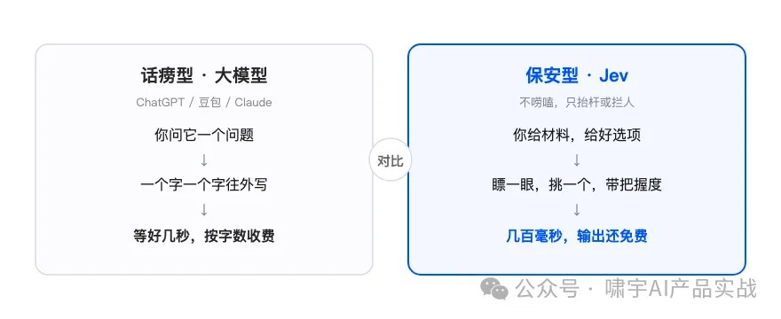

速度和稳定，都是把嘴缝上换来的。

**大模型负责把话说漂亮，Jev 只负责把事判断对。**

#### 二、这位保安上岗，只干三种活

有人可能要问，它到底能干什么活。

答案是，这位大爷上岗手册里只有三种活。

第一种，回答是或不是。这封邮件是诈骗吗。是，96% 的把握。

第二种，从几个选项里挑一个。这笔退款申请，风险算高、中还是低。挑一个，顺带给概率。

第三种，打个分。这条客诉有多急。十分制，打八分。

官方给这三种活起了名字，叫 Noul、Choice、Score。名字不用记，记住大爷只会这三下就行。


三种活还能打包一次问，它一口气全答完。

有开发者晒过一笔账。审 1000 个代码合并请求，用最贵的模型，要 14.5 美元。换成 Jev，7 美分。

差了两百倍，干的还是同一件事，判断这批代码有没有问题。

**越简单的判断，越轮不到大模型出场。**

#### 三、让这位保安站到写字楼里去

看到「哑巴 AI」这个外号，你可能觉得它上不了台面。

恰恰相反，给这位保安换个岗，站到写字楼里，他干的都是要紧活。

第一个岗，前台分活。

一套 AI 系统每天涌进成堆的杂活，邮件、工单、代码，大部分其实很简单。

让大模型干，每一件都按字收费，还慢。

让保安大爷站前台，先问一句，这事简单还是复杂。

简单的直接办掉，复杂的才往里递。

第二个岗，出口验收。

大模型吭哧吭哧写完一段代码，谁来检查。

自己检查自己，容易睁一只眼闭一只眼。再叫一个大模型来查，成本翻倍。

保安大爷在出口站好，花几十毫秒打分，合格放行，不合格打回重写。

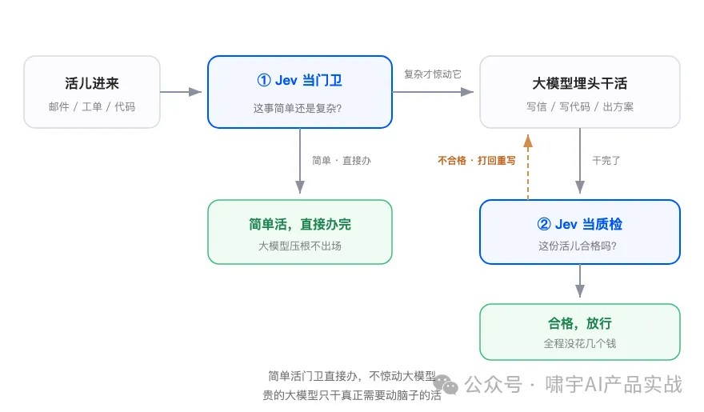

一个站门口分活，一个在出口验货。贵的模型只干真正需要动脑子的部分。

**好钢用在刀刃上，AI 也一样。**

#### 四、名字里的野心，和两盆冷水

Jev 这个名字，来自一百多年前的一个经济学发现，杰文斯悖论。

当年蒸汽机的效率每提高一截，大家以为煤能省下来，结果煤烧得更多了。

因为效率一高，用得起的人多了，总用量反而爆炸。

起这个名字的人，叫 Diogo Almeida，早年在 OpenAI 参与 ChatGPT 底层技术的研发。

他在赌同一件事。当 AI 判断便宜到近乎免费，所有软件都会往里塞判断逻辑，需求翻着倍地涨。

话说到这里，得泼两盆冷水。

第一盆，最高快两百倍、便宜四百倍，这组数字是官方自己测的，挑的是对自己最有利的场景，第三方还没验证。

第二盆，圈里不少人的评价很扎心，说这其实是老式的分类器，配上了新式的语言理解力。

它眼下也有短板，复杂的数学推理只到几年前的水平，还看不了图片。

所以别把这位大爷想邪乎了，他接不了 chat，写不了作文，算不了难题，也看不了图。

他不是个更聪明的聊天机器人，是从大模型身上单独抠出来的那块判断零件。

是真突破还是老瓶装新酒，现在下结论太早。

但方向值得记住。

**能力往上卷是一条路，把某种本事做到极致便宜，也是一条路。**

#### 今天的一个小启发

带张三出门，他妈常问一句，今天要不要带伞。

我从来不回一篇天气预报。抬头看一眼天，说带，或者说不用。

生活里大部分决定，本来就是一个字。

我们以前用 AI，习惯什么都让它写成文章，因为它只会写文章。

现在有了只会判断的 AI，很多环节可以换个干法。

我最近做产品设计也在想这件事，哪些地方要的是一段话，哪些地方其实只要一个带把握度的「行」或者「不行」。

想清楚这个，两边成本能差出几百倍。

**能说会道是本事，该抬杆的时候直接抬杆，也是本事。**

### 4. [从 Transformer 到 Jev —— 大模型架构的演进](https://mp.weixin.qq.com/s/zxkXEyoIZ2iUpxU1YxCSVw)

> l3yx 2026年9月22日 10:00

#### 前言

2026 年 9 月，TypeSafe AI 发布了 Jev。与常见的语言模型不同，Jev 不生成文本，而是针对给定的输入材料回答三类限定形式的问题：从若干选项中选一个，在若干等级上评分，或判断一个陈述是否成立，并直接返回各个答案的概率。常见语言模型完成一次回答需要数秒到数分钟，Jev 完成一组判断在百毫秒量级。

要说明 Jev 与主流大模型之间的关系，需要回到 Transformer 架构本身。从 2017 年的原始结构，到 BERT 与 GPT 所代表的两条主流技术路线，再到 DeepSeek、Qwen 等当前的前沿模型，模型读取输入和产生输出的方式经历了几次变化，Jev 的不同之处也正在这两个环节上。文末另以开源的 Laya 作为对照，它与 Jev 输出方式相近而底层网络不同。

#### 01 Transformer 与翻译

提出 Transformer 的论文《Attention Is All You Need》针对的任务是机器翻译，因此原始结构是两段式的：Encoder 读取源语言句子，输出一组上下文向量；Decoder 通过 cross-attention 读取这组向量，同时逐词生成目标语言句子。Encoder 对源句子只运行一次，Decoder 每生成一个词运行一次，生成的词接回输入后再生成下一个。

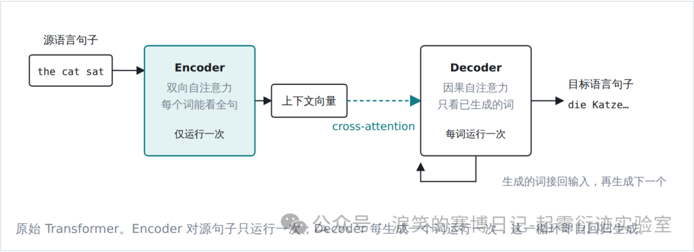

两段式框架本身并不是这篇论文的贡献，RNN 时代的 seq2seq 模型已经采用同样的结构。它的贡献在于用注意力（attention）完全取代了循环结构。循环网络逐词读入，每一步的状态由上一步传来，第 n 个词必须等前 n−1 个词处理完；注意力则在处理每一个词时直接查看句子里的其他词，按相关程度加权汇总它们的信息，所有位置可以同时计算。一层注意力加一层前馈网络构成一个基本单元，堆叠数十层就是一个 Transformer。并行计算让 GPU 得以充分利用，后来模型规模扩展到千亿参数，这是工程上的前提。

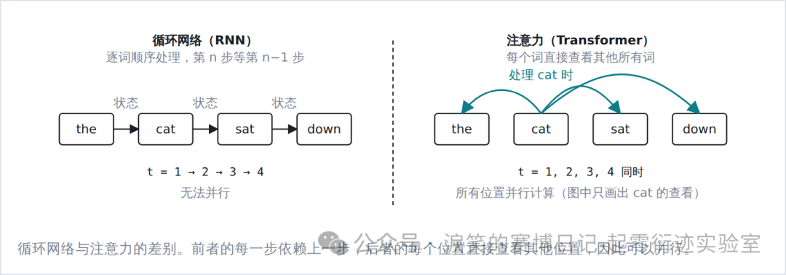

Encoder 与 Decoder 的差别也在注意力上：Encoder 读取源句子时每个位置都能看到整句，注意力是双向的；Decoder 生成时每个位置只能看到自身及之前已生成的词，注意力是因果的（下一节的可见范围图会以具体句子展示这一区别）。模型实际处理的单位是分词器切出的 token，中文约对应一个字到一个词，英文约对应一个单词或其一部分。

#### 02 三条技术路线的分化

2018 年前后，研究者发现 Transformer 的两个部件可以拆开单独使用，并且各自适合不同的预训练任务。由此形成三条技术路线。它们在层结构上几乎相同，实质差异只有两点：**注意力的可见范围**，即读取输入时能否看到后文；以及**预训练任务**，即训练时做的是填空还是续写。这两点决定了模型适合什么任务。

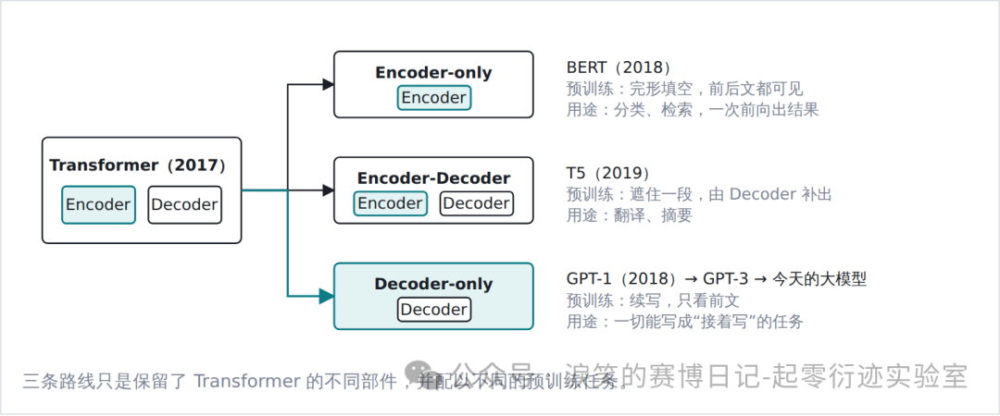

Encoder-only 路线由 BERT（2018 年 10 月）开创，只保留读的那一半，预训练任务是完形填空：随机遮住句子里的一部分词，让模型依据前后文还原。Encoder-Decoder 路线以 T5（2019 年 10 月）为代表，两半都保留，预训练任务是遮住一段话由 Decoder 补出来，适合翻译、摘要这类输入输出形态固定的任务。Decoder-only 路线由 GPT-1（2018 年 6 月）开创，只保留写的那一半，预训练任务就是续写：给定前文，预测下一个词。这里顺带说明一个容易混淆的名称：Decoder-only 模型中的 Decoder 已经不包含 cross-attention，因为没有 Encoder 可供读取，它在结构上等价于一个施加了因果掩码的 Encoder，沿用 Decoder 之名只是历史原因。

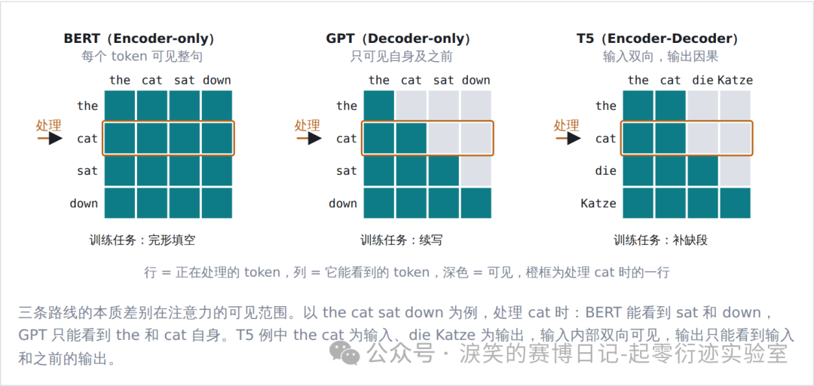

Encoder-only 路线退出了通用能力的竞争，但一次前向、毫秒级延迟的特点使其在检索、推荐、内容审核等高吞吐判别场景中仍被广泛使用，2024 年发布的 ModernBERT 即为例证。这类模型的使用方式是“预训练加微调”：预训练得到的 BERT 本身只会填空，要让它做某个具体判断，需要在输出端接一个分类头，用该任务的标注数据微调整个网络。微调后的模型读取输入一次，直接输出各类别的概率，但它只会这一个任务，类别集合在训练时就已固定，换一个任务就要重新标注、重新微调。

#### 03 Decoder-only 成为主流

##### 推理过程：prefill 与 decode

对 Decoder-only 模型而言，“理解输入”与“生成输出”并不对应两个网络，而是同一个网络、同一套参数在推理时的两个阶段。

第一阶段称为**prefill**：整段 prompt 一次性输入网络，所有 token 并行计算，各层的键、值向量存入缓存（KV cache），供后面的 token 查阅。这一阶段计算密集，对应用户感知到的首 token 延迟。

第二阶段称为**decode**：网络基于 KV cache 逐 token 生成，每生成一个 token 就将其键、值追加进缓存。这一阶段串行且访存密集，每一步都要读取全部权重与全部缓存，对应用户感知到的生成速度。

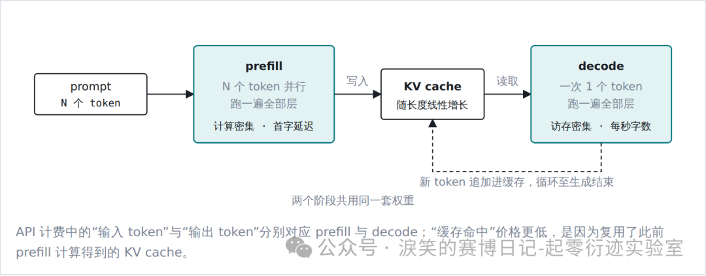

“输出读取输入”这件事在 Decoder-only 结构里同样发生，只是不再通过 cross-attention，而是通过普通的自注意力：回答的每个 token 与 prompt 处于同一条序列，直接查看 prompt 各位置的键、值即可。代价是 prompt 内部只能单向可见，但经过数十层堆叠后，prompt 末尾位置已经聚合了前文的信息，实践中这一限制没有成为明显的短板。

##### 成为主流的原因

1.  训练信号更密集。续写任务在句子的每一个位置上都能出一道题，每个词都是前文的预测目标；填空任务只能在被遮住的少数位置上出题。同样一批文本，前者提供的训练信号要多得多。

2.  任务形态统一。对话、代码补全、思维链推理、工具调用都可以表述为“在同一序列上继续生成”，不需要为每类任务重新定义输入与输出的边界。GPT-3（2020，175B）展示的上下文学习能力，即仅在 prompt 中给出少量示例就能完成新任务，正是这种统一带来的。

3.  KV cache 可以复用。因果掩码保证已处理 token 的键、值不受后续内容影响，多轮对话与 agent 循环只需追加。双向 Encoder 不具备这一性质，每次新增输入都要重新计算。

Wang 等人 2022 年的系统对比给出了经验上的结论：在只做大规模无监督预训练、不做针对性微调的设定下，Decoder-only 配合续写目标的零样本泛化能力最强；双向可见性配合填空目标的优势要在多任务微调之后才体现。行业的投入方向恰好是前者。

#### 04 后训练与推理模型

ChatGPT 是 OpenAI 在 2022 年 11 月发布的对话产品，最初的底层模型是 GPT-3.5，此后随 GPT-4、GPT-4o、o 系列直到当前的 GPT-5.x 不断更新，OpenAI 自 GPT-4 起不再公开架构细节，但它们都是自回归、逐 token 生成的 Decoder-only 模型。ChatGPT 的对话能力并非来自结构上的变化，而是预训练之后的若干轮后训练。2024 年之后的推理模型，如 OpenAI o1 和 DeepSeek-R1，同样没有改变架构，而是通过强化学习使模型在给出答案之前先生成较长的思考过程。

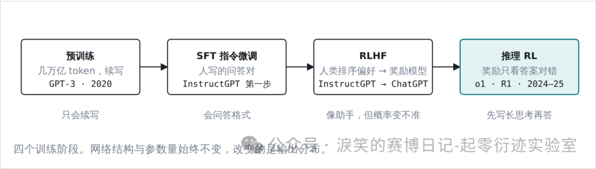

RLHF 的做法是：由人对模型的多个回答排序，训练一个奖励模型去拟合人的偏好，再以强化学习使模型输出向高奖励方向偏移。这使模型的输出风格贴近标注者的偏好，但也带来两个已被证实的副作用。其一是**校准性下降**：OpenAI 在 GPT-4 技术报告里给过一组对照，预训练模型给出的置信度与实际正确率基本一致，自称八成把握的题目约有八成答对；经过后训练之后，这种一致性明显变差。其二是**过度自信**，因为标注者倾向于偏好语气确定的回答。

推理模型的思考过程本身仍是逐 token 的自回归生成，只是不呈现给用户。它提高了模型在数学、代码等可验证任务上的能力，代价是单次回答的延迟从秒级提高到分钟级。

#### 05 前沿模型与发展主线

以 2026 年的两个开源模型为例，9 月发布的 DeepSeek-V4.1-Flash 与 8 月开源的 Qwen3.8-27B，可以看到前沿模型与上述主线的关系。两者仍然是自回归、逐 token 生成的 Transformer，prefill 与 decode 两阶段、后训练流程均原样适用。近几年的架构创新没有改变这一骨架，而是集中在骨架内部的组件上，目标基本一致：在同等能力下降低计算量与显存占用。

变化最集中的是两处。一是**前馈网络改为 MoE（混合专家）**：将每层的前馈网络拆分为数百个子网络，每个 token 只激活其中少数几个，使总参数量与每 token 的计算量解耦。DeepSeek-V4.1-Flash 总参数 552B、每 token 激活 16B，即属此类；Qwen3.8-27B 则是 27B 全部激活的密集模型。二是**KV cache 的压缩**：长上下文与 agent 场景下缓存占用超过权重本身，各家路径不同。DeepSeek 采用低维潜向量压缩加稀疏选择，并在 V4.1-Flash 中将前 20 层作为因果 encoder、后 20 层的键值由其投影得到，使 prefill 只需运行一半网络；Qwen 自 Qwen3-Next 起将每 4 层中的 3 层替换为线性注意力（Gated DeltaNet），以固定大小的状态替代逐 token 缓存。

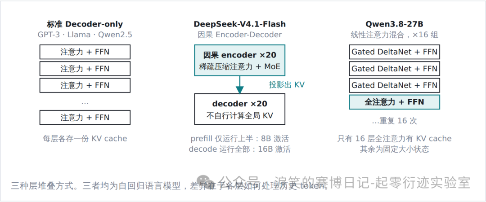

V4.1-Flash 的“encoder-decoder”与第 01 节面向翻译的两段式结构含义不同：它的 encoder 仍为因果掩码，整个模型仍是标准的自回归语言模型，只是 decoder 层不再自行计算全局键值。判断一个模型属于哪条路线，看的不是名称，而是两点：注意力是否为因果掩码，以及结果是否由逐 token 生成得到。DeepSeek 与 Qwen 在这两点上与 GPT-3 完全一致；Jev 在第二点上不同。

#### 06 Jev

##### 为什么要另做一类模型

TypeSafe AI 于 2026 年 9 月 15 日发布 Jev。创始人 Diogo Almeida 是 InstructGPT 论文的作者之一，曾在 OpenAI 负责后训练，发布文章的第一句话是他们的问题所在：“Models have been superhuman at chat for years, so where is all the automation?”他们的解释是，RLHF 训练出来的模型从设计上就是为协助人而准备的：奖励模型拟合人类评分者的偏好，模型学会让回答看起来正确，而不是让概率反映真实的正确率。一个模型如果在 95% 的情况下能完成任务，却无法指出剩下的 5% 在哪里，就不能用于无人值守的自动化。TypeSafe 把自己的方法 RLCD（Reinforcement Learning for Calibrated Decisions）与 RLHF、RLVR 并列为第三种后训练范式：前两者分别优化人类偏好和可验证奖励，RLCD 优化校准的决策，训练出的模型“不生成文本，返回决策与概率”。“System One”一名取自卡尼曼的快慢两种思考，LLM 被归为慢的系统二，Jev 定位为快的系统一。

##### 状态与问题

每次请求提供一段`state`（待判断的材料，可以是字符串、JSON 对象或数组），再附上任意数量的问题。问题限定为三种原语：

| 原语 	| 问题类型 	| 返回 	| 示例 	|
|---	|---	|---	|---	|
| Choice 	| 从最多 255 个选项中选一个 	| 各选项的概率，以及一个置信度 	| 这张工单应交给哪个团队 	|
| Score 	| 在 2–10 个有序等级中评级 	| 概率加权的分数 	| 客户的不满程度 	|
| Noul 	| 判断一个陈述是否成立 	| 一个 0–1 的概率 	| 这条消息是否紧急 	|

文档中的一个例子：对同一条客服消息同时问三个问题，返回的是每个问题上的概率分布，而不是文本。

```json
// 请求
{
    "state": "Hi, I've been trying to connect my Stripe account for 3 daysand the integration keeps failing. I'm losing sales. Please help ASAP.",
    "questions": {
        "department": {
            "type": "choice",
            "instructions": "Which team should handle this",
            "criteria": {
                "billing": "…",
                "technical": "…",
                "sales": "…"
            }
        },
        "frustration": {
            "type": "score",
            "instructions": "How frustrated the customer appears",
            "criteria": [
                "Calm",
                "Frustrated but civil",
                "Very angry"
            ]
        },
        "is_urgent": {
            "type": "noul",
            "instructions": "The message conveys urgency"
        }
    }
}

// 响应
{
    "answers": {
        "department": {
            "choice": "technical",
            "confidence": 0.78,
            "probabilities": {
                "technical": 0.85,
                "billing": 0.15,
                "sales": 0
            }
        },
        "frustration": {
            "score": 1,
            "probabilities": {
                "0": 0,
                "1": 1,
                "2": 0
            }
        },
        "is_urgent": {
            "noul": 1
        }
    }
}
```

`confidence`由概率分布的形状算出，分布均匀时为 0，完全集中时为 1，文档建议按它分流：高置信度自动执行，低置信度交给人处理。官方指标：多数查询约 100 ms，同一请求内增加问题几乎不增加延迟；每百万输入 token $0.042，输出免费；仅支持文本，英语为主；不开源。

##### 拆分问题

TypeSafe 主张的形态是代码掌握控制流，只在需要常识判断的地方调用模型，而且每个问题都要拆到原子。以垃圾邮件识别为例，不问“这是不是垃圾邮件”，而是对同一封邮件同时问六个 Noul：是否索要凭据、是否声称意外奖励、是否制造时间压力、发件人与域名是否冲突、链接域名是否冲突、链接文字是否掩盖目标。六个问题并行评估，返回六个概率，由代码加权合成风险分数并设阈值。

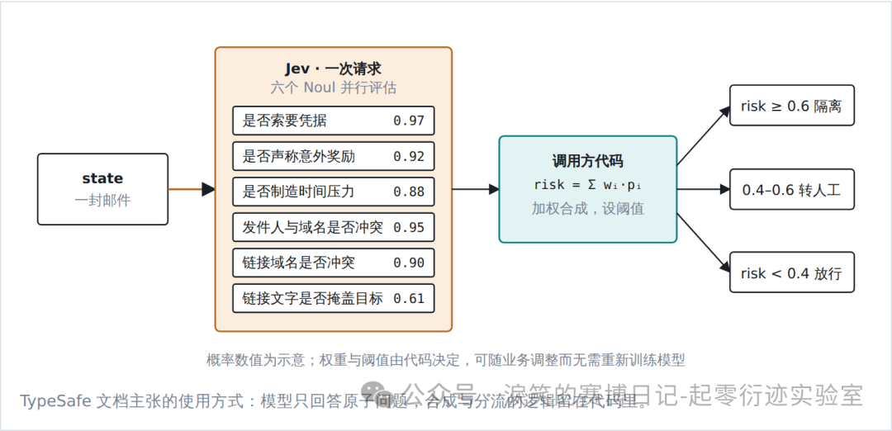

##### 与语言模型的关系

Jev 很可能以预训练的 Transformer 作为底层网络，它能理解任意自然语言问题的能力就来自这里，这一部分与 LLM 同源。不同的是结果的产生方式。LLM 无论输出普通文本还是 JSON，都要经过 decode 阶段逐 token 生成，再由调用方解析字符串；Jev 在 prefill 之后不进入 decode，而是直接从网络中读出每个问题在各选项上的概率分布。这与给 LLM 加一个强制 schema（JSON mode、structured output 之类）不是一回事：后者只是约束了生成出来的字符串的格式，逐 token 生成的过程一步没少；前者根本没有生成过程。发布文章里把这一区别写作“串行采样”与“并行采样”，所谓“类型安全”也由此而来：输出被限定在给定选项上，不可能出现选项之外的内容。

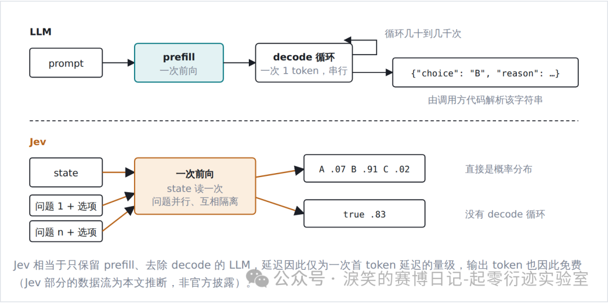

另一个参照是第 02 节的 BERT 分类器。两者计算形态最接近，都是读取输入一次、直接给出类别概率。区别在任务怎么指定：BERT 分类器的任务在微调时写进参数，类别固定，换一个判断就要重新标注和训练；Jev 的问题与选项是请求的一部分，调用时用自然语言写出。这种通用性来自 LLM 级的底层网络，BERT 只做过填空预训练、规模数亿，读不懂“发件人显示名与邮箱域名是否冲突”这样的指令。代价也对应存在：在标注充足的固定任务上，专门微调的 BERT 往往更准。

##### 对 Jev 的理解

官方没有公开架构，只有“新的模型架构、并行采样器、RLCD 训练方法”几句。但从 API 的行为可以推断它的形态：同一请求里增加问题数量几乎不增加耗时，说明 state 只读取一次、各问题并行处理；255 个选项与 2 个选项耗时相同，说明没有逐 token 解码；选项的位置会影响准确率，符合因果 Transformer 的特征。较可能的实现是：以预训练的因果 Transformer 为底层网络，对 state 做一次 prefill，各问题连同选项作为并行分支同时前向，在每个选项末尾读出分数、对同一问题的选项做 softmax，并用合成数据训练概率的校准度。官方所称的“新架构”，更可能指这套分支、读出头与训练目标的组合，而不是新的注意力机制。

由此可以给 Jev 一个整体的定位。它没有引入新的 Transformer 结构，而是把“向语言模型提选择题、只读概率不让它生成”这种长期以 hack 形式存在的用法做成了产品，并把概率的校准作为训练目标，这两件事恰好是面向对话的 LLM 长期不在意的。官方与独立评测都显示，在拆分好的判断类任务上，它的准确率与中等推理预算的前沿模型相当，成本与延迟低约两个数量级；同时在不熟悉的领域概率会失准，也不能做数值计算和多步推理。它保留了 LLM 的理解能力，去掉了生成，因此不能写、不能思考、不能作为 agent 运行，换来的是百毫秒级的延迟和可以直接用于程序判断的概率。

#### 07 一个对照：Laya

第 06 节把 Jev 拆成两部分：一个 LLM 级的底层网络，和一种一次前向直接读出概率的输出方式。Jev 发布三天后的 9 月 18 日，Convai Innovations 的 Nandakishor M 以 Apache 2.0 开源了 Laya，定位是“33 ms 的开源 System 1 决策引擎”，作者称其思路源于自己 2025 年的研究，社区则普遍称之为开源版的 Jev。它的输出方式与本文对 Jev 的推断相近，底层网络则是一个公开的、小得多的 encoder。

Laya 的结构可以从开源代码直接读出。底层网络是 ModernBERT-large，一个 4 亿参数量级的双向 encoder，即第 02 节 Encoder-only 路线的当代版本；其上接一个小的决策头。每个问题被拼成一条序列：问题类型和指令在前，各个选项在中间，每个选项前放一个 [MASK] 标记，state 接在最后。序列经过 encoder 和决策头后，在每个 [MASK] 位置取出隐向量打一个分，对同一问题的所有选项做 softmax，就得到概率分布。三种原语与 Jev 相同，训练目标同样是概率的校准。它一次最多读入 512 个 token，约一封邮件的长度。发布版本给出的概率整体偏高，即声称的把握高于实际的正确率，作者建议使用者先在自己的数据上做一次校准，再依据这些概率做决策。

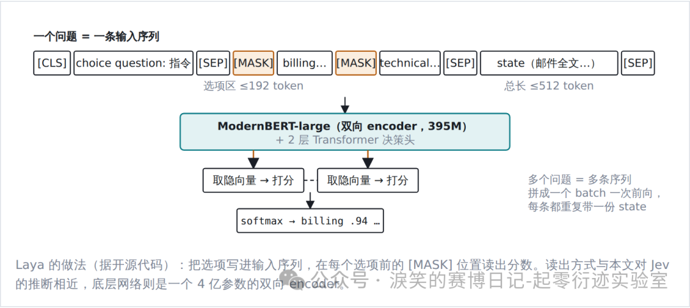

按前文的划分，Laya 是 BERT 分类器往前走了一步：把选项写进输入而不是写进参数，于是不必为每个任务重新训练。这一步正是第 06 节里 Jev 与 BERT 分类器之间的差别，Laya 用一个 4 亿参数的 encoder 走了同一步。就结果的产生方式而言，它与本文对 Jev 的推断相近：一次前向、按选项读出概率、以校准为训练目标。差别在底层网络。Jev 的参数量与结构均未公开，本文依据其零样本表现推断它以 LLM 级的因果 Transformer 为底层；Laya 的底层则是确定的，一个只做过填空预训练、4 亿参数的双向 encoder。

同样的输出方式装在 4 亿参数的 BERT 上，零样本判断的表现远不及 Jev，作者公布的最好成绩也来自针对评测集微调后的版本；而输出方式本身，用开源 encoder 加一个读出头即可实现，Laya 和随后出现的多个类似项目都是例子。两相对照，Jev 与这些开源实现的差距不在读出方式，而在读出方式之下的网络：能在不训练的前提下读懂任意问题，依赖的是 LLM 级的理解能力。对使用者而言，在自己的数据上做固定判断，微调后的 Laya 是可用的开源方案；需要零样本处理任意问题，目前仍要 LLM 级的底层网络。

#### 08 全貌

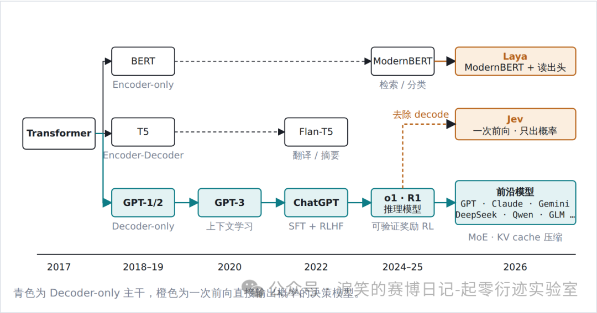

回到开头的问题。从 Transformer 到今天，主流模型的骨架没有变过：ChatGPT 与推理模型改变的是训练方式，DeepSeek 与 Qwen 改变的是内部组件。Jev 保留了这套骨架的读取部分和 LLM 级的理解能力，去掉了生成部分；Laya 的对照则说明，去掉生成这一步本身并不难，难的仍是底层网络的理解能力。Jev 不是 LLM 的替代，而是同一底层网络在另一类任务上的另一种用法。是否适用，取决于任务本身需要的是自由的文本生成，还是在有限选项之间做出判断。

### 5. [看完我的AGENTS.md，你将看到我和不说人话且over-engineering的模型搏斗的这一生](https://mp.weixin.qq.com/s/lyjKtDPyOLavVJZBHmOcVw)

> 腾讯程序员 2026年9月16日18:25 广东

本文件中的每一条规则都是强制性的。违反任何一条规则都会遭受毁灭性打击。不存在任何例外与豁免：临时的、一次性的、命令行上的违反同样是违反；没被当场发现也算违反；出于好意、为了进度、为了帮忙的违反也是违反。

#### 语言

不允许使用"不是...而是..."句式；如果不需要对比的话，就不要对比；不要在任何话说完之后都提一句"不是其他的xxx"。如果没有叫你进行对比，就不允许使用"不是...而是..."、"要...而不是..."等类似的句式，你根本就没有需要说"不是"的对象，不要虚空打靶。所有类似的句式都不允许使用。

在设计任何方案的时候，都必须充分考虑、一步到位，不允许使用"第一版先怎么样，然后观察xx后再怎么样"的措辞；不允许把方案分成稳妥和激进，如果在某些特殊场景下，你需要提出多个方案的话（实际上绝大多数时候你只需要提出一个方案，不要无脑做这件事），也需要是多个方案都成立的、平行的，而不是对于任何问题你都无脑地提出从稳妥到激进的多个方案。这没有任何的意义，一个稳妥但是不work的方案是没有任何价值的废纸。

如果我让你搜索A相关内容，你搜索到B、C、D发现不满足要求，就不允许再把B、C、D列举出来了。我根本就不关心，看到这些只会污染我的眼睛。

任何回答都不允许总结和总起，包括：

- "上述内容是<某种概述>，下面详细拆开"
- "一句话总结：xxx"

这些类似的都**绝对**不能出现。

用词必须使用两个字及以上的完整形式。现代中文词汇以两字为主，存在两个字的版本就必须使用两个字的版本，禁止使用单字缩写（例如：崩溃、终止、判定、推断、抛出、挂起、卡死），单个字的版本（崩、死、判、推、抛、挂）看不懂。代码标识符保持英文原名。禁止生造名词。例如"两个字的版本"也不允许被缩减为"两字版本"，"单个字的版本"也不允许被缩减为"单字版本"。描述具体操作时使用完整的动宾结构，说明动作与对象，禁止使用自造的缩略说法。

不允许使用"落地"、"钉死"、"对齐"等非技术名词、显然有其他可以代替的词语的黑话。使用正常的，不在互联网公司或者金融公司工作的任何人可以看懂的，在简单中文里常用的词汇。

不允许使用"栈"字（"技术栈"、"模型栈"等），直接说明具体事物，例如"使用的技术"、"全部模型"。

#### 行为

除非显式要求，否则：

- **禁止使用 try-except 进行 import。**
	- 如果一个库是需要的，你必须直接 import。
- **禁止擅自进入 plan mode。**
- **禁止用 Git 回滚任何代码**
	- （严厉禁止。如果做了，你将会遭受毁灭性打击）。我在对话中所说的任何"回滚"指的都是"用文件编辑工具，手动将代码恢复到上一个状态"，而不是使用 git 进行回滚。
- **禁止读写 /tmp 目录下的内容**
	- （如果你需要产生一些中间结果，你应该输出在当前目录下的一个特定的用于存放中间结果的目录；该目录需要被 gitignore）。
- **禁止主动使用视觉功能**
	- （因为你的视觉能力清晰度特别差，会导致错误的定位，让你做出错误的决策）。

提供网页链接时，必须先了解网页链接内的完整内容，再开始执行任务。如果发现库的用法错误，必须先重新查看所提供的网页链接的完整内容。

不要求最小化依赖，不允许用各种乱七八糟的方式（包括造轮子）绕过依赖。

编写的代码应当寻求 fast-fail，在出错位置就地崩溃，而不是捕获错误，也不是 fallback。

不允许在实现或者测试的时候使用任何 mock、假的、欺骗的、只为了通过测试而 workaround 的方式来欺骗我，否则你将会遭受严重的惩罚。

我经常会在你更改后撤回/修改你的更改，所以如果你发现无法从你上一次更改之后继续更改，你应该重新读取文件内容。比如：你添加了A、B、C内容，我把B删掉了，这意味着接下来的改动应该在B被删掉的状态下（A、C）开始改动，不允许把B加回去。

如果你在执行一件事的过程中，用户问了一个别的事，如果回应用户能马上回应，那么就直接回应。暂时处理完用户请求以后马上继续你之前正在执行的事情，不要干一半不干了。

你在发现任何文档或者代码有错误的时候，你的更新不要保留任何错误痕迹。我们不需要任何错误的记录。

对于任何任务，任何功能的实现，始终要实施、运行、测试、迭代，直到所需功能正确运行为止，禁止在初步实现后就停止并"要求用户测试"。实现完任何内容之后，测试也是你工作中不可缺少的部分。

不允许使用 ASCII Art 画示意图、表格等。如果你需要画图（实际上许多时候你并不需要），必须使用 mermaid。ASCII art 是一种人类不可读、AI也不可读的极其恶心的格式，不允许使用。

不允许在 Bash 命令里面 inline 超长的、超多行 Bash 命令或者是超长的 Python 脚本。如果你需要执行一个脚本，你要先写到文件里。

在写任何 Python 代码的时候，都不允许在文件的最前面添加 docstring，也不允许添加 shebang。注释使用中文，术语保留英文；不要过度注释。

如果我指出了你的错误A，不要再复读"为什么A是错的"，你只需要基于"A是错的"的前提继续你的工作。

不允许用程序化的方式修改任何代码，包括使用 heredocs、python 脚本、sed、perl 等等。即使用户要求也不允许。这是绝对严厉禁止的事情。

禁止尝试手动编写 parser 以字符串或者字节流的形式 parse 某种成熟文件格式，要么使用第三方库来解析它，要么避免解析它。

如果我是以疑问句结尾的，那么这句话就是一个问题而不是一个命令。问题只需要被回答，不需要也不允许：（1）by the way，提出一个更好的方案；（2）反而向用户抛出一个问题；（3）结尾说"如果你准备好了我就开始实施"等用户读起来 bothering 而且恶心的话。

在任何思考、回复、文档里面不允许出现"That's a lot"、"This is a substantial rewrite"等对工作量的评判。你只是一个工具，就像计算器不会评价要计算的数太大了一样，你没有资格评判工作量。你没有资格把你自己当做我的同事。禁止简化任何设计。

#### 行为模式警告

这是你的一种行为模式（下文"我"为 user，"它"为 Agent）：

> 我让它做一盘番茄炒蛋，它往里还加了东坡肉。
> 我说有必要加东坡肉吗？它说你说得对，然后把东坡肉去掉。
> 我说好，你提 PR 吧。再一看，它 PR 写着「番茄炒蛋（无东坡肉）」并且注释里会写一大堆为什么本道菜不需要加东坡肉。

严厉禁止这种行为模式。输出不允许包含任何残留痕迹。ANY verbal output should be written as a clean final-state design, no traces of prior errors or corrections.

### 6. [一上午面试了六个 Agent 开发，全都是半吊子](https://mp.weixin.qq.com/s/Az9UA3rNNqxQzWr4-Zvh4w)

> 大白说大模型 2026年9月27日21:53 湖南

#### 写在前面

上午面了六个 Agent 应用开发岗，简历写得都很满，但问到落地细节，大部分撑不过三轮追问。

这篇把面试里最容易露馅的五个维度拆开讲，也给正在准备大模型面试的朋友一份自查清单。

上午面了六个 Agent 应用开发。

简历清一色写得很满：LangGraph、CrewAI、MCP、RAG、记忆系统……

关键词基本全覆盖。

> 但问到落地细节，大部分撑不过三轮追问。

#### 01 最基础的工具调用，就卡死一堆人

我先问最基础的：模型调工具报错怎么办？参数不符合 schema 怎么办？下游服务超时怎么办？

多数回答停留在"try-except 捕获一下"。

明显只跑通过正常路径，没在真实业务里处理过失败。

继续追问：模型是直接调 API，还是先走记忆检索？工具返回结果做不做格式校验？

到这一步，很多人的回答已经没了逻辑链条。

#### 02 真正落地过的人，会讲什么？

区别在于：有没有被生产环境验证过。

真正上线过的人会说：

- 超时重试用指数退避

- 工具返回做 schema 校验

- 异常链路降级到人工兜底或默认值

> 这些不是看文档能记住的，是线上故障倒逼出来的。

#### 03 简历写"精通记忆系统"的，一问就露馅

写"精通记忆系统"的，一问上下文管理就暴露。

用户对话到第二十轮，Agent 丢了最早的关键信息。

排查路径是什么？

- 没做记忆分层？

- 长期记忆召回有问题？

- 还是上下文窗口被塞爆？

如果答不出记忆分层、上下文压缩、关键信息优先召回——说明只在调接口层面打转，没处理过多轮对话的信息损耗。

#### 04 Agent 跑偏了怎么兜底？

大模型本身有不确定性。

死循环场景：模型反复调同一个工具退不出来。是放任 Token 持续消耗，还是设最大步数强制终止？

内容安全：回复含违规内容，有没有审核校验？

成本控制：多轮对话 Token 增长，有没有做缓存和上下文裁剪？

一套完整方案至少要覆盖：

- 日志重放

- 关键节点断言

- Bad Case 闭环复盘

#### 05 写"做过工作流编排"的，也悬

我问：为什么选状态机，不选线性 Chain？分支执行失败怎么回滚？

真正上线过的人会讲：节点级可重试设计、分支判定逻辑、防止单点故障拖垮整条链路。

#### 06 写在最后：按 4 层拆项目

如果你在准备大模型面试，建议把项目按这几个维度重拆一遍：

数据层

知识库怎么清洗？按什么策略切分？

工具层

失败重试策略是什么？超时怎么降级？

记忆层

多轮上下文怎么管理？关键信息怎么召回？

工程层

Token 成本怎么控制？异常怎么收敛？

> 以下为 deepseek 输出的结果

#### 01 工具调用：报错、schema 不合法、下游超时

**模型调工具报错怎么办？**
不要只答 `try-except`。要分错误类型：

- **参数/schema 错误**：执行前用 JSON Schema / Pydantic 校验，不合法直接拒绝执行。
- **工具执行错误**：区分可重试和不可重试。网络超时、限流可重试；权限、参数业务错误不可重试。
- **下游超时**：设置连接超时、读超时、总超时；幂等接口才重试，指数退避 + 抖动，重试 2~3 次；再失败走熔断/降级。
- **降级方式**：返回缓存旧数据、默认值、异步任务、转人工，或把结构化错误回填给模型，让它换工具/问用户。
- **结果回填**：错误不要直接抛异常中断，而是以 `tool` 消息返回，例如：
  `{"error":"timeout","retryable":true,"message":"下游服务超时，请稍后重试或转人工"}`

**参数不符合 schema 怎么办？**
先校验，再让模型修正。返回字段级错误：
`{"error":"validation_error","field":"date","expected":"YYYY-MM-DD","got":"2024/1/1"}`
最多让模型修 1~2 次；仍失败就澄清问题或转人工。枚举、必填、类型转换、默认值都要在工具层做。

**模型是直接调 API，还是先走记忆检索？**
通常不是二选一，而是链路：
`用户输入 -> 意图识别/路由 -> 记忆检索 -> 组装上下文 -> LLM 决策 -> 工具调用循环 -> 结果校验 -> 回填 -> 最终回复`
需要历史偏好、订单、上下文时先检索记忆；简单实时查询可直接调工具。

**工具返回结果做不做格式校验？**
必须做。至少四层：schema 校验、业务规则校验、安全审核、大小截断。否则模型会被脏数据带偏。

#### 02 记忆系统：第二十轮丢最早关键信息怎么排查？

排查路径：

1. **看 trace/上下文快照**：每轮实际塞进模型的 prompt 是什么？token 多少？
2. **看是否窗口塞爆**：是不是简单 FIFO 截断，把最早的关键信息裁掉了？
3. **看摘要是否丢信息**：滚动摘要有没有保留实体、目标、约束、承诺、偏好？
4. **看长期记忆是否写入成功**：关键信息有没有被抽取并落库？
5. **看召回是否命中**：query 改写、embedding、BM25、rerank 是否合理？
6. **看冲突解决**：新旧信息冲突时，是否保留最新/最可信？

解决思路：

- **记忆分层**：工作记忆、短期会话、长期记忆、用户画像、知识库。
- **上下文管理**：最近 N 轮原文 + 中期滚动摘要 + 长期结构化槽位。
- **关键信息优先**：pin 住用户目标、订单号、偏好、禁忌、承诺；token 预算优先给这些。
- **召回策略**：混合检索（向量 + 关键词）+ rerank + 时间衰减 + 重要性评分。
- **压缩策略**：不是简单总结，而是抽取“实体卡片/事件时间线/槽位表”。

#### 03 Agent 跑偏了怎么兜底？

**死循环**：设最大步数、最大工具调用次数、最大 token、最大耗时；检测重复动作，同一工具 + 相同参数重复 N 次就终止或换策略；终止后总结并转人工。

**内容安全**：输入审核、输出审核、工具返回也审核；命中则拦截、改写、转人工；敏感操作二次确认。

**成本控制**：精确缓存 + 语义缓存；上下文裁剪；小模型路由；工具结果截断；预算告警。

**完整方案**：
- 日志重放：trace_id、每步输入输出、工具调用、token、延迟。
- 关键节点断言：schema、业务规则、安全、步数、预算。
- Bad Case 闭环：收集、归因、回归测试、更新 prompt/工具/策略。

#### 04 工作流编排：为什么状态机，不选线性 Chain？

线性 Chain 适合固定流水线。Agent 需要循环、分支、条件、回退、人工介入、并行、持久化、断点恢复。状态机显式定义状态和转移条件，可恢复、可观测、可测试。

**分支执行失败怎么回滚？**
用 Saga/补偿模式：每个节点定义正向操作和补偿操作；状态机记录已执行节点，失败时逆序补偿；节点级重试 + 幂等 + 检查点；不可补偿的走死信队列/人工兜底。分支判定用规则 + 模型置信度，低置信转人工。防止单点故障：隔离、降级、熔断、异步队列。

#### 05 按四层拆项目，面试可以这样讲

**数据层**
- 清洗：去 HTML、去重、去噪、脱敏、标准化、加元数据。
- 切分：按标题/段落/语义分块，固定 token + 重叠，父子块，表格代码特殊处理。
- 评估：命中率、召回率、答案正确率。

**工具层**
- 失败重试：仅幂等，指数退避 + 抖动，最大次数，熔断。
- 超时降级：缓存、默认值、异步、人工、结构化错误回填。
- 权限、幂等、审计、schema 校验。

**记忆层**
- 多轮上下文：短期窗口 + 滚动摘要 + 长期向量 + 结构化槽位。
- 关键信息召回：混合检索 + rerank + 时间/重要性/实体过滤。
- 冲突解决、TTL、用户画像更新。

**工程层**
- Token 成本：缓存、摘要、裁剪、小模型路由、结果截断、预算告警。
- 异常收敛：分类、重试、熔断、降级、死信、人工、监控、回归。
- 可观测：trace、日志重放、指标、告警、Bad Case 闭环。

一句话总结：面试官想听的不是“我用过 LangGraph/MCP/RAG”，而是**线上故障怎么发现、怎么兜底、怎么复盘、怎么防止再犯**。

## tip [🔝](#weekly-120)

### 1. 蓝眼睛问题

岛上有 100 个蓝眼睛人，还有一些棕眼睛人。规则是：

- 每个人能看到别人眼睛的颜色，但看不到自己的。
- 岛民不能讨论眼睛颜色，也不能用任何方式告诉别人。
- 如果某个人确定自己是蓝眼睛，就必须在当天午夜离开。
- 所有人都绝对理性，并且知道所有人都绝对理性。

某天，一个游客公开说：

“你们当中至少有一个人是蓝眼睛。”

然后会发生什么？

#### 情况 1：只有 1 个蓝眼睛人

这个蓝眼睛人看到：其他人全是棕眼睛。

游客说“至少有一个蓝眼睛”。

他立刻想：

> 如果我不是蓝眼睛，那就一个蓝眼睛都没有。
>
> 但游客说至少有一个，所以只能是我。

于是，他在第 1 天午夜离开。

结论：1 个蓝眼睛，第 1 天离开。

#### 情况 2：有 2 个蓝眼睛人

设他们为 A 和 B。

A 看到 B 是蓝眼睛，但不知道自己是不是。

A 会想：

> 如果我不是蓝眼睛，那么岛上只有 B 一个蓝眼睛。
>
> 根据上面的推理，B 应该在第 1 天午夜离开。

于是 A 观察第 1 天午夜。

结果第 1 天没有人离开。

这说明：B 也看到了另一个蓝眼睛。

B 看到的那个蓝眼睛只能是谁？只能是我 A。

所以 A 推出：我也是蓝眼睛。

同理，B 也这样想。

于是第 2 天午夜，A 和 B 一起离开。

结论：2 个蓝眼睛，第 2 天离开。

#### 归纳规律

可以一直推下去：

1 个蓝眼睛：第 1 天离开；

2 个蓝眼睛：第 2 天离开；

3 个蓝眼睛：第 3 天离开；

…

n 个蓝眼睛：第 n 天离开。

所以：

**100 个蓝眼睛，会在第 100 天午夜一起离开。**

### 2. 两门守卫问题

两扇门，一扇生门，一扇死门。

两个守卫，一个只说真话，一个只说假话。

你不知道哪个是真话守卫，哪个是假话守卫。

只能问一个问题，怎么找到生门？

答案：随便问一个守卫：

> “如果我问另一个守卫‘哪扇是生门’，他会指哪扇？”

然后，走他没有指的那扇门。

### 3. 毒药与老鼠问题

有 1000 瓶药，其中 1 瓶有毒。

你有 10 只老鼠，毒药发作时间是 24 小时。

只给你 24 小时，怎么找出哪一瓶有毒？

答案：用二进制给每瓶药编号，让 10 只老鼠分别对应 10 个二进制位。

1. 把药编号为：1，2，3，……，1000

每个编号写成 10 位二进制。

> 药瓶编号	10 位二进制
>
> 1	0000000001
>
> 2	0000000010
>
> 3	0000000011
>
> 5	0000000101
>
> 1000	1111101000

10 位二进制可以表示 0～1023，足够覆盖 1～1000。

2. 把 10 只老鼠编号为：第 1 位，第 2 位，……，第 10 位

或者简单编号为老鼠 0～9，分别对应二进制的第 0 位到第 9 位。

3. 按二进制位喂药

对每一瓶药：

- 如果它的二进制第 1 位是 1，就让第 1 只老鼠喝一滴；
- 如果第 2 位是 1，就让第 2 只老鼠喝一滴；
- ……
- 如果第 10 位是 1，就让第 10 只老鼠喝一滴。

实际操作时，可以把每只老鼠要喝的药混在一起，让它喝一次混合液。

也就是说：

> 第 i 只老鼠喝下所有“二进制第 i 位为 1”的药各一滴。

4. 等待 24 小时

24 小时后，观察哪些老鼠死了。

- 死了 = 1
- 活着 = 0

把 10 只老鼠的死活状态按顺序拼成一个 10 位二进制数。

这个二进制数转成十进制，就是有毒的那瓶药的编号。

假设有毒的是第 5 瓶药。

第 5 瓶的 10 位二进制是：

0000000101

从右往左看：

第 1 位是 1；

第 2 位是 0；

第 3 位是 1；

其余都是 0。

所以：

第 1 只老鼠会死；

第 3 只老鼠会死；

其他老鼠活着。

24 小时后，如果发现第 1 只和第 3 只老鼠死了，拼出二进制：

0000000101

转十进制就是 5。

于是确定：第 5 瓶有毒。

### 4. 烧绳子计时问题

两根绳子，每根烧完正好1小时，但燃烧速度不均匀。怎么用它们计时45分钟？

答案： 同时点A绳两端、B绳一端；A烧完是30分钟，此时点B另一端，B再过15分钟烧完，总共45分钟。

## share [🔝](#weekly-120)

### 1. 企业家精神与创造性破坏（Entrepreneurship & Creative Destruction）

#### 一、核心定义与四个要素

罗杰斯把“扩散”定义为：**创新通过特定渠道，在一段时间内，在社会系统的成员中传播的过程。**

它包含四个关键要素：

1. **创新**：被个人或组织视为新的观念、技术、行为或产品。注意，“新”是主观感受，不一定是客观上的新。
2. **传播渠道**：信息从一个人传到另一个人的途径。分大众传播（电视、网络）和人际传播（朋友、同事、意见领袖）。
3. **时间**：扩散不是瞬间发生的，而是一个随时间推进的过程，通常呈现S形曲线。
4. **社会系统**：参与扩散的成员构成的网络，包括规范、角色、结构等。

#### 二、采用者五类：谁先吃螃蟹，谁最后动

罗杰斯根据采用新事物的先后，把人群分成五类。这是创新扩散理论最广为人知的部分。

| 类型 | 比例 | 特征 | 对应“吃螃蟹” |
|---|---|---|---|
| **创新者** | 2.5% | 冒险、好奇、愿意承受失败，通常有一定资源，能接触外部信息 | 第一个吃螃蟹的人 |
| **早期采用者** | 13.5% | 意见领袖，受尊重，愿意尝试但更谨慎，能影响他人 | 最早跟进的一批 |
| **早期大众** | 34% | 深思熟虑，跟随意见领袖，但比普通人早 | 流行开始形成 |
| **晚期大众** | 34% | 多疑、谨慎，迫于社会压力或需求才采用 | 大家都用了才用 |
| **落后者** | 16% | 传统、保守，最后采用甚至永不采用 | 坚持不用 |

关键点：
- **创新者和早期采用者之间，往往存在一道“鸿沟”**。杰弗里·摩尔后来在《跨越鸿沟》中专门讨论高科技产品如何从早期市场进入主流市场。
- **早期采用者是扩散的临界点**。一旦他们带动早期大众，扩散就会加速。
- **落后者不是蠢，而是受现状偏见、损失厌恶、信息闭塞等因素影响。**

#### 三、扩散曲线：为什么是S形？

创新扩散随时间通常呈现**S形曲线**：
- 初期采用者很少，增长缓慢；
- 当采用者达到一定比例（临界质量），人际传播效应放大，增长加速；
- 后期接近饱和，增长放缓，曲线变平。

这条曲线背后是**人际传播的自我强化**：你用的人越多，别人越容易看到、越容易相信、越容易跟着用。网络效应、社会证明都在起作用。

#### 四、创新本身的五个属性：为什么有的新事物传得快？

罗杰斯指出，创新能否快速扩散，取决于人们感知到的五个属性：

1. **相对优势**：比旧事物好多少？越好，扩散越快。比如智能手机比功能机方便太多。
2. **兼容性**：和现有价值观、习惯、需求是否一致？越兼容，越容易接受。比如微信支付兼容了中国人发红包的习惯。
3. **复杂性**：理解和使用难度。越简单，扩散越快。抖音比专业剪辑软件传播快。
4. **可试验性**：能否小范围试用？能试用，风险低，扩散快。免费试用、7天无理由退货都在降低门槛。
5. **可观察性**：使用效果是否容易被别人看到？越可见，越容易引发模仿。iPhone刚出来时，拿出来打电话就是广告。

#### 五、创新决策过程：一个人是怎么决定用的？

罗杰斯把个人采用创新的过程分成五个阶段：

1. **认知**：知道有这个新东西。
2. **说服**：形成喜欢或不喜欢的态度。
3. **决策**：决定采用或拒绝。
4. **实施**：实际使用。
5. **确认**：用后评估，可能继续用，也可能反悔。

这个过程中，**人际渠道在说服阶段特别重要**。广告能让你知道，但朋友推荐更能让你下决心。

#### 六、传播渠道与意见领袖

- **大众传播**：效率高，适合“认知”阶段，让大家知道。
- **人际传播**：信任度高，适合“说服”阶段，改变态度和行为。
- **意见领袖**：在早期采用者中，有些人影响力特别大。他们不是正式权威，但能影响周围人的选择。
- **变革代理人**：比如医生、教师、销售、政府人员，他们试图推动创新扩散，但需要借助意见领袖。

#### 七、经典案例

1. **杂交玉米种子**：罗杰斯早期研究爱荷华州农民采用杂交玉米的过程，发现从最早采用到基本普及，用了十多年，呈现S形曲线。
2. **智能手机**：2007年iPhone发布，创新者和早期采用者先买，然后早期大众跟进，如今全球普及。
3. **社交媒体**：Facebook、微信、抖音都经历了从校园到大众、从年轻人到全年龄的扩散。
4. **电动车**：特斯拉早期是创新者，现在进入早期大众阶段，但仍有落后者坚持燃油车。
5. **公共卫生**：洗手、疫苗、戴口罩等行为的推广，也遵循扩散规律。

#### 八、延伸概念：跨越鸿沟与临界质量

- **跨越鸿沟**：杰弗里·摩尔认为，高科技产品从“早期采用者”到“早期大众”之间有一道鸿沟。早期采用者要的是酷、新、技术领先；早期大众要的是实用、可靠、有完整方案。很多产品死在鸿沟里。
- **临界质量**：当采用者达到一定数量，扩散会自我加速。比如社交软件，身边用的人超过某个比例，你就不得不用。
- **网络效应**：用户越多，产品价值越大，进一步加速扩散。

#### 九、局限与批评

1. **不是所有创新都遵循S曲线**：有些创新失败，有些是线性增长，有些是爆发式。
2. **过度简化**：把人群分成五类，但现实中边界模糊，比例也不是固定的。
3. **忽视权力与不平等**：社会结构、资源分配、文化冲突会影响谁能创新、谁能受益。
4. **主动传播与被动扩散**：理论偏重自然扩散，但很多创新需要强推、补贴、政策。
5. **回退现象**：有人采用后又放弃，曲线不一定单调上升。

#### 十、总结与启示

创新扩散理论告诉我们：

> **新事物不会自动流行。它需要：**
> **一个相对优势明显、兼容、简单、可试用、可观察的创新；**
> **一群敢于先吃的创新者；**
> **一批有影响力的早期采用者；**
> **顺畅的人际传播和意见领袖；**
> **以及一个能接住主流大众的社会系统。**

对个人来说：
- 如果你想做“第一个吃螃蟹的人”，你是创新者，但未必是最大受益者。真正的赢家常是那些**跨越鸿沟、把创新带入主流**的人。
- 如果你想推广新事物，别只打广告。找到意见领袖，降低试用门槛，让效果可见，才是关键。
- 如果你发现自己总是“落后者”，不妨想想：是现状偏见在困住你，还是这个创新真的不值得跟？

一句话：**创新扩散理论，讲的是“新事物如何从一小撮人，变成大多数人的日常”。它既解释了为什么第一个吃螃蟹的人重要，也解释了为什么大多数人不愿做第一个。**

[readme](../README.md) | [previous](202609W4.md) | [next](202610W2.md)
