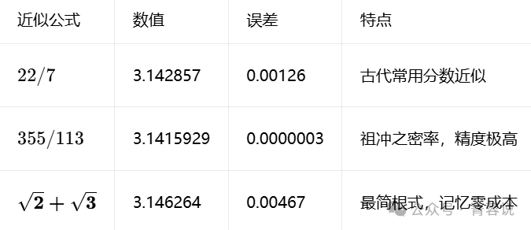
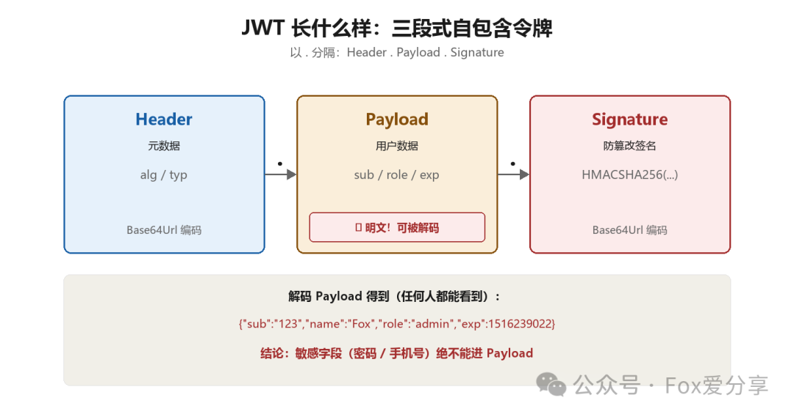
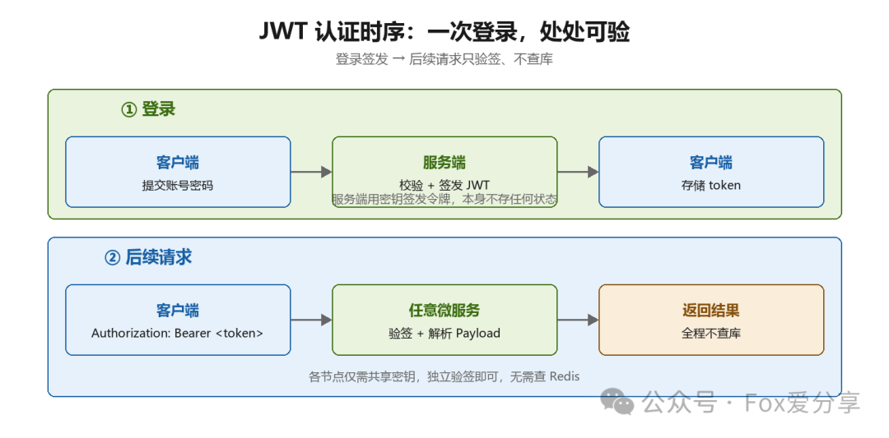
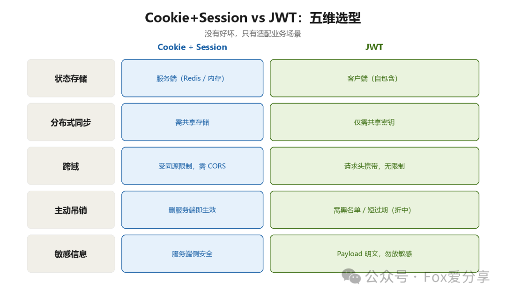

# Weekly #121

@Range : 2026-09-29 - 2026-09-29

@City: Hangzhou

[readme](../README.md) | [previous](202610W1.md) | [next](202610W3.md)


\**Photo by [Madara](https://unsplash.com/@madara_p) on [Unsplash](https://unsplash.com/photos/a-woman-reading-a-book-with-her-eyes-closed-BBYx-IBR8hE)*

-[toc]

## algorithm [🔝](#weekly-121)

## review [🔝](#weekly-121)

### 1. [MySQL 的 count(\*) 为什么这么慢——我从 300ms 优化到 3ms](https://mp.weixin.qq.com/s/vNnWCOzxbC0OOw5j7Er6XQ)

> 糖糖@码骨丹心 2026年9月12日 10:17

上周线上一个列表页接口，P99干到300ms。产品经理在群里@我，说用户体验稀烂。

我先打了慢日志。一条SQL亮了：

```SQL
SELECT COUNT(*) FROM t_order WHERE status = 2;
```

280ms。整个接口300ms，这条count占了280ms。数据量？800万行。

今天就掰扯清楚：InnoDB下 `count(*)`为什么慢，以及我怎么把它压到3ms的。这题面试也高频，看完基本能吊打面试官。

先说结论：性能排序

**count(\*) ≈ count(1) ≥ count(id) > count(字段)**

一个一个说。

**count(字段)**：MySQL要把字段值读出来，判断是不是NULL。NULL不计。所以它多了一步取值+判空。如果这个字段没索引，还得回表，更惨。最慢，实至名归。

**count(id)**：id是主键，InnoDB的主键索引（聚簇索引）里叶子节点存的是整行数据。扫id等于扫全表数据页，页多，IO大。而且id理论上不可能为NULL，判空这步白做。

**count(1)**：1是常量，每行返回个1，不用取任何字段，只数行数。

**count(\*)**：MySQL官方对它做了专门优化，语义上等价于count(0)，不取值、不判空，只数行。**它不是"把所有字段都查出来"**，这是最多人误解的一点。

所以count(\*)不比count(1)慢，甚至优化器会自动挑最小的索引来扫。别再手写count(1)装高级了，写count(\*)就行，可读性最好。

面试的时候能把"count(\*)为什么不慢"讲清楚，这题就过了一半。

为什么InnoDB下就是慢？

一句话：**InnoDB根本不知道表里有多少行。**

为什么不知道？MVCC。InnoDB支持事务，每个事务看到的行数可能不一样。同一个时刻，事务A能看到100万行，事务B只能看到99万行（有些行对它不可见）。所以没法维护一个"全局总行数"。

那count(\*)怎么办？只能老老实实扫。扫哪个索引？优化器会挑一个最小的。通常二级索引比聚簇索引小（叶子节点只存索引列+主键，不存整行），所以经常是扫二级索引。但本质还是全扫，800万行就是800万行。

MyISAM为什么快？它表上直接存了总行数，count(\*)无where条件时直接返回，O(1)。但注意：**一旦带上where，MyISAM也得扫，一样慢**。面试爱考这个坑。

MySQL 8.0.x对count(\*)有并行读优化（Innodb_parallel_read_threads），大表能快不少。但本质还是扫，800万行的表，该慢还是慢，只是没以前那么惨。

四种优化方案

- 方案一：覆盖索引，让扫描变小

慢的根源是扫的数据量大。那就让扫的东西变少。

status = 2的查询，如果只有个status单列索引，区分度低，优化器可能不用。建个联合索引：

```SQL
ALTER TABLE t_order ADD INDEX idx_status_created(status, created_at);
```

count走这个索引，覆盖扫描，不回表。800万行从扫聚簇索引变成扫一个瘦索引，280ms能降到60-80ms。

不够快？接着看下面的。

- 方案二：近似值，explain估算

很多列表页根本不需要精确的"共8237412条"。用户就看个大概，或者分页组件只要知道"有没有下一页"。

explain自己就是估算：

EXPLAIN SELECT * FROM t_order WHERE status = 2;

rows列就是优化器的估算行数，偏差可能不小（基于统计信息），但做"约800万条"的展示完全够用。

或者查统计信息表：

SELECT table_rows FROM information_schema.tables
WHERE table_name = 't_order';

这个值是采样统计的，误差可达10%-40%，只适合展示"约xx万条"这种场景。精确计数别用。

- 方案三：缓存

列表页的count，通常不需要每次都实时算。查一次，扔Redis，给个TTL：

```SQL
-- 伪代码
count = redis.get("order:count:status:2")
if count == nil:
  count = db.query("SELECT COUNT(\*) FROM t_order WHERE status = 2")
  redis.setex("order:count:status:2", 60, count)
```

60秒过期，用户看到的数字最多滞后一分钟，大多数后台完全能接受。成本最低，见效最快。我那次300ms到3ms，就是缓存+覆盖索引组合拳打出来的。

- 方案四：计数表，精确+快

要精确、要实时，只能自己维护数。单独一张表：

```SQL
CREATE TABLE t_count (
 biz VARCHAR(32) PRIMARY KEY,
 cnt BIGINT NOT NULL DEFAULT 0
) ENGINE=InnoDB;

UPDATE t_count SET cnt = cnt + 1 WHERE biz = 'order_status_2';
```

更新时机两种做法：

**触发器**。insert/update/delete订单表时自动加减计数。对业务无侵入，但触发器这东西，出问题排查很痛苦，而且高并发下每次写入都锁计数行，热点更新会顶不住（可以分桶计数缓解）。

**binlog同步**。Canal之类的工具订阅binlog，把行变更解析出来，异步更新计数表。业务代码零侵入，天然解耦，还有重放能力。代价是多一套基础设施。

计数表是我最后的选择，因为它有个大坑，下面说。

我踩过的坑：计数表和事务不一致

前年做电商订单，我用了触发器方案。上线两周，运营报障：列表页显示"共10234条"，导出却是10241条。差7条。

排查了一晚上。根因：触发器虽然在事务内，但业务代码里有段逻辑，先insert订单，然后调了个外部风控接口，接口超时，整个事务回滚。触发器跟着回滚了，没问题。真正的问题在另一步——有个老代码路径绕过了触发器逻辑，直接用`INSERT ... ON DUPLICATE KEY UPDATE`批量刷历史数据，触发器里的计数逻辑写错了判断，少加了。

代价：一晚上排查+重算，写了个对账脚本，每小时用count(\*)全量校准一次计数表，误差超阈值就告警。

解决方案三条，现在是我的标配：

1. **别全信触发器**：代码路径一多必漏。能用binlog就binlog，单一数据源。
2. **必须有对账**：定时全量count校准，不一致就告警+自动修复。
3. **读的时候接受最终一致**：前端展示"约xx条"，别承诺精确到个位。

计数表不是建完就完事，它是个需要运维的活。想清楚再上。

怎么选

- 数据量小（几十万以内），索引建好，count(\*)直接上，别折腾。
- 展示型列表页，不要求精确 → 缓存或近似值，成本最低。
- 要求精确+实时（报表、财务） → 计数表+binlog+对账。
- 中间地带 → 覆盖索引，通常够用。

### 2. [日志该存哪？Doris 和 OpenSearch 这样选](https://mp.weixin.qq.com/s/gbpNw7QVFTJyzSjffE2Egw)

> 主号@程序原技术分享 2026年9月30日 09:06

做日志平台的同学迟早会遇到这个问题：日志进 Kafka 之后，往 OpenSearch 写，还是往 Doris 写？

先说结论：这个问题本身就问错了。

OpenSearch 更偏搜索引擎加日志检索，Doris 更偏实时 OLAP 分析数据库。两者都能存日志、都能做聚合，但设计目标差得很远——OpenSearch 基于 Lucene，核心是搜索和可观测性；Doris 是 MPP 架构的列式分析数据库。真正该问的是：你的查询，是要找数据，还是要算数据？

#### 一、核心能力对比

1. 核心定位：OpenSearch 是搜索引擎，Doris 是实时 OLAP 数据库
2. 数据模型：OpenSearch 是 JSON Document + Index，Doris 是 Table + 行列混合
3. 查询方式：OpenSearch 用 Query DSL，Doris 用 SQL
4. 底层引擎：OpenSearch 基于 Lucene，Doris 是 MPP + 向量化执行 + 列式存储
5. 全文搜索：OpenSearch 很强，Doris 支持且在增强
6. 多表 JOIN：OpenSearch 不是核心场景，Doris 是优势项
7. BI 报表：OpenSearch 可以做，Doris 特别合适
8. MySQL 协议：Doris 原生兼容

一句话总结：搜索和检索找 OpenSearch，聚合分析和 JOIN 找 Doris。

#### 二、什么查询该交给 OpenSearch

场景一：查过去 5 分钟所有包含 error 的日志，用 message:_error_。

场景二：找某个 request_id 对应的完整日志链，用 request_id = "abc123"。

这类查询的本质是：我不知道要找的数据在哪 → 通过关键词或字段 → 快速把相关 Document 捞出来。

这就是 OpenSearch 的主场：全文检索、模糊搜索、日志排障、Trace 查询。

#### 三、什么查询该交给 Doris

换一个场景：100 亿条日志，你想统计每个服务每小时的调用量和错误率。

```SQL
SELECT service, DATE_FORMAT(@timestamp, '%Y-%m-%d %H:00:00') AS hour,
COUNT(*) AS total, SUM(CASE WHEN status >= 500 THEN 1 ELSE 0 END) AS error
FROM logs GROUP BY service, hour ORDER BY hour;
```

这种「海量数据 → 过滤 → GROUP BY → 聚合 → 多维分析」的活，就是 Doris 的强项。它的 MPP、列式存储、向量化执行，就是为这类查询而生的。

#### 四、一个判断口诀

两个系统的查询思维是两个路数：

OpenSearch：我要「找东西」。找包含 error 的日志、找 request_id 对应的记录、找某 IP 的访问、全文模糊搜索。

Doris：我要「算东西」。每天多少日志、每小时 QPS、错误率多少、TOP 100 排行、30 天趋势、同比环比、多表 JOIN。

所以记住这组等式：OpenSearch = Search First；Doris = Analytics First。

#### 五、为什么大厂经常两个一起用

真实日志平台的架构，往往不是二选一：Kafka → Fluent Bit 之后分流，一路进 OpenSearch 负责检索排障，一路进 Doris 负责分析报表。

OpenSearch 负责：日志检索、全文搜索、实时排障、Trace 查询、告警、Dashboards。开发同学的典型问题「昨天 15:23，service-A 为什么出现大量 timeout」——去 OpenSearch 搜。

Doris 负责：统计报表、大数据量聚合、趋势分析、多维分析、长周期历史数据。运营同学的典型问题「过去 7 天各服务错误量排行」——去 Doris 跑 SQL。

甚至可以按时间分层：OpenSearch 存近 7~30 天热数据负责实时排障，Doris 存长周期历史数据负责分析统计。

#### 六、存储成本这笔账也要算

OpenSearch 为了搜索能力，会给大量字段建倒排索引：message、service、host、level、trace_id、request_id……原始日志一路膨胀成倒排索引 + Doc Values + Segment + Replica，存储空间相当可观。

Doris 是典型列式 OLAP 存储：service 一列、status 一列、timestamp 一列。查询 `SELECT service, COUNT(*)` 根本不需要读所有列，加上高压缩比，对几十 TB 到 PB 量级的数据分析很友好。

所以长周期、大体量的日志分析，Doris 的成本结构优势明显。

#### 七、但别简单理解成「Doris 啥都快」

反例一：查 message 里是否包含 "connection refused"。OpenSearch 走全文检索和倒排索引，快速定位文档——这是它的优势场景，Doris 反而不占优。

反例二：按天聚合各服务的平均响应时间。典型 OLAP 场景，Doris 的 MPP + 列式 + 向量化执行占优。

所以结论不是谁比谁快，而是：全文搜索、日志检索 → OpenSearch；聚合分析、复杂 SQL、多表 JOIN、BI → Doris。

#### 收个尾

一个判断口诀送给你：「我是要找到某几条数据，还是要计算大量数据？」

找数据 → OpenSearch：error、timeout、request_id、关键词、模糊搜索。算数据 → Doris：COUNT、SUM、AVG、GROUP BY、JOIN、TOP N、趋势报表。

如果你在搭日志平台，合理的方向不是二选一：让 OpenSearch 做实时检索和排障，让 Doris 做海量分析和长期统计。两条腿走路，各干各的活。

### 3. [OpenSearch运维必背的5个接口](https://mp.weixin.qq.com/s/AEQ73yyLUBOo5kLwIRJoew)

主号@程序原技术分享 2026年9月28日 16:18

凌晨两点，告警群炸了。集群红了，没人知道从哪下手——这是运维最怕遇到的场景。

其实 OpenSearch 排查有固定顺序：集群健康 → 节点 → 索引 → 分片 → 问题定位。这 5 个接口记熟，半夜被叫起来也能三分钟定位方向。

#### 一、集群健康：上手就看它

`GET /_cluster/health?pretty`

任何异常，第一个敲的就是它。重点看这几个字段：

1. status
2. number_of_nodes
3. number_of_data_nodes
4. active_primary_shards
5. active_shards
6. relocating_shards
7. initializing_shards
8. unassigned_shards
9. number_of_pending_tasks

三种颜色必须刻进肌肉记忆：

1. green：一切正常
2. yellow：主分片正常，但有副本没分配上
3. red：主分片都没分配，数据可能已经不可用

这是 OpenSearch 文档中定义的集群健康判断标准。运维出手的第一反应，就是这个接口。

#### 二、节点状态：谁在拖后腿

`GET /_cat/nodes?v`

重点盯这些列：

1. ip / name / role / node.role
2. heap.percent
3. ram.percent
4. cpu
5. load_1m
6. disk.used_percent

判断逻辑很朴素：某个节点的 CPU、JVM、内存、磁盘明显跟其他节点不在一个档次，那问题就在它身上，深入查这一个就行。

CAT API 本身就是 OpenSearch 用来快速查看集群、节点、索引、分片运维信息的接口组。

#### 三、索引状态：哪个 Index 出事了

`GET /_cat/indices?v`

关注：health、status、index、pri、rep、docs.count、docs.deleted、store.size、pri.store.size。

两个高频用法，建议直接背下来。找出占磁盘最多的索引：

`GET /_cat/indices?v&s=store.size:desc`

只看异常的：

`GET /_cat/indices?v&health=red`

#### 四、分片状态：排查 Yellow/Red 的核心

`GET /_cat/shards?v`

这是 OpenSearch 运维里相当重要的一个接口。

典型场景：集群 status 是 red，unassigned_shards 有 200 个。这时候立刻敲这个接口，去找 UNASSIGNED。

想看更多字段：

`GET /_cat/shards?v&h=index,shard,prirep,state,node,unassigned.reason`

针对具体索引：`GET /_cluster/health/your-index?v`

还是不知道为什么分不上去，就用分配解释接口：`GET /_cluster/allocation/explain`，参数传 index、shard、primary。

#### 五、集群统计：整体容量体检

`GET /_cluster/stats?human&pretty`

适合做整体容量和资源分析。可以看到 Index 数量、Shard 数量、Document 数量、Storage、Node 数量，以及 CPU、Memory、JVM、OS 等维度信息。

#### 核心记忆表

1. `/_cluster/health` —— 集群健康吗？
2. `/_cat/nodes` —— 哪个节点有问题？
3. `/_cat/indices` —— 哪个 Index 有问题 / 占空间？
4. `/_cat/shards` —— 哪个 Shard 有问题？
5. `/_cluster/stats` —— 整个集群资源和容量怎么样？

发现 OpenSearch 异常时，按这个顺序走：发现异常 → `/_cluster/health` → 有没有 unassigned / initializing / relocating → `/_cat/nodes` → 有没有异常节点 → `/_cat/indices` → 有没有异常或超大 Index → `/_cat/shards` → 具体哪个 Shard → `/_cluster/allocation/explain` → 为什么分配失败。

补充一句：如果集群规模到了 16 节点、数万 Shard，并且存在大量 unassigned shard，那 `/_cluster/allocation/explain` 就应该当成第 6 个必背接口。规模越大，它越关键。

### 4. [π≈√2+√3 一个美得骗人的近似](https://mp.weixin.qq.com/s/_-GQSXST8odWMN10rHWFLQ)

> 菁蓉说 2026年9月6日 08:00 上海

有没有见过这个神奇式子：

π ≈ √2 +√3

√2≈1.4142，√3≈1.7321，两者相加等于3.1463。

而 π≈3.1416。

前三位完全都是 3.14，误差仅仅只有 0.0047。

第一眼看上去，几乎以为它们相等。很多人第一次看到，都会惊呼：难道π就等于根号2加根号3？

但真相是：它们永远不可能真正相等，只是一场惊艳的数学巧合。

直观算一遍，看清差距

- √2=1.41421356
-  √3=1.73205081
- √2+√3=3.14626437
-  π≈ 3.14159265

差值：√2+√3-π ≈0.00467

日常口算取3.14的时候，几乎分不出差别；但只要多往后看一位小数，差距立刻显现。

这只是几何估算，不是严格等式！

1. √2、√3 都是**二次无理数**

2. π 是超越数，理论上**绝对不可能相等**

3. 只是**数学巧合里的顶级神巧合**

代数数 ≠ 超越数。

二者分属完全不同数的类别，无论小数靠得多近，数学本质上永远不能画等号。

π ≈ √2 +√3 它不是凭空瞎凑，背后还有几何来源

这个近似不是数学家随手乱加出来的，和古代割圆思想有关系。

单位圆：

-  内接正八边形面积 2√2，比圆面积π偏小
-  外切正六边形面积 2√3，比圆面积π偏大

一大一小两个多边形，把圆夹在中间。把两者取平均化简，就得到

π ≈ √2 +√3

古人用多边形逼近圆，这正是阿基米德、刘徽割圆术的思路。只不过正八边形、正六边形边数还太少，精度有限，只能得到一个不错的粗略估计。

经典π近似公式横向对比



可以看出来：√2 +√3精度不如密率、22/7，但是颜值最高，记忆最简单，两个中学最熟悉的根号相加，随手就能心算出来。

数学界其他出名的“美丽巧合”

数学里还有不少这种“数值挨得很近，但本质无关”的名场面：

1. $e^\pi \approx  23.14$，非常接近整数23
2. $\pi^2 \approx 9.87$，和重力加速度g≈9.8几乎撞在一起

它们不是什么宇宙底层定理，只是数字世界里浪漫的偶遇。

很多数学之美，不在于严丝合缝的相等，而在于这种意外的贴近。

### 5. [Cookie、Session 与 JWT 怎么选？](https://mp.weixin.qq.com/s/nEVtU5yoEvHByorzs4nycw)

> Fox爱分享 2026年8月25日 07:00 湖南

后端面试里，"Cookie、Session 与 JWT 怎么选"是高频考点，也是很多人栽跟头的地方。下面先用一个真实翻车案例暴露误区，再拆解本质，最后给你一套能拿 offer 的回答模板。

#### 一、面试失败案例：只知表面差异，不懂场景适配

面试官提问

"你们项目登录认证用了 JWT，而传统的 Cookie+Session 也能实现认证，为什么不选后者？"

候选人回答

"因为 JWT 是无状态的，不需要存在服务器里，Session 要存在服务器，占用内存。而且 JWT 可以跨域，Cookie 跨域不方便，所以我们就用了 JWT。"

失败原因

1. 认知片面。只强调"无状态""跨域"两个表层特性，没讲清"为什么无状态在当前业务里更重要""Session 跨域真的无解吗"，缺业务视角。
2. 技术误解。默认"Session 只能存内存"，忽略了 Session 也能放 Redis、MySQL 等分布式存储；也没提 JWT 无状态的代价（如无法主动吊销）。
3. 逻辑断层。没结合项目具体场景（是否分布式、是否多端），回答空泛，看不出选型思考。

#### 二、核心拆解：Cookie+Session 的局限，才是 JWT 的价值

2.1 Cookie+Session 的逻辑与瓶颈

核心逻辑是"**服务端存状态，客户端带凭证**"：登录后服务端生成 Session ID，把用户数据存服务端（内存/Redis/MySQL），Session ID 经 Cookie 下发给客户端；后续请求带 Cookie 里的 Session ID，服务端查库验证。

它的命门是"**依赖服务端存储 Session 状态**"，在以下场景会吃紧：

| 场景痛点 	| 具体问题 	|
|---	|---	|
| 分布式状态同步 	| 多机部署需共享 Session（如 Redis 分布式 Session），增存储与运维成本；存本地内存则会"换机重登"。 	|
| 跨域 Cookie 限制 	| 受同源策略限制，前后端不同域需配 CORS，部分浏览器（如 Safari）默认拦截跨域 Cookie。 	|
| 多端凭证携带 	| App、小程序无 Cookie 机制，需手动存 Session ID 再经请求头携带，破坏原生流程。 	|
| 高并发存储压力 	| 百万级在线用户需存大量 Session，即便用 Redis 也要扩节点。 	|

2.2 JWT 的核心价值：用"客户端存状态"解题

JWT 核心逻辑是"**服务端不存状态，客户端存完整凭证**"：登录后服务端用密钥签发令牌（Header.Payload.Signature 三段），客户端后续经**Authorization: Bearer <token>**携带；服务端不查库，只验签名、解析 Payload 即完成认证。

**a. 分布式无需状态同步：**令牌自含用户信息，各节点只需共享密钥即可独立验签，免去 Redis 同步与查询延迟。

**b. 跨域无 Cookie 限制：**经请求头携带，不受同源策略影响。**结论：Session 跨域并非不能解（可用 CORS + withCredentials + 统一域名规划实现），但成本与兼容性明显不如 JWT 请求头方案。**

**c. 多端适配更灵活：**浏览器、App、小程序、第三方调用都走请求头或参数，无需依赖 Cookie。

**d. 降低存储压力：**无需存 Session 数据，省 Redis/MySQL 资源。

2.3 关键提醒：JWT 并非完美方案

**无法主动吊销：**令牌发出后服务端不存状态，强制登出/禁用只能靠"短过期 + 刷新令牌"弥补，而 Session 删服务端数据即可即时吊销。

**Payload 不宜存敏感信息：**Payload 是 Base64 编码（非加密），可被直接解码，不能放密码、手机号等。

**令牌体积可能偏大：**Payload 信息过多会拉长每次请求，建议只存核心认证字段。

2.4 附：一段真实的 JWT 长什么样

很多人讲 JWT 只讲概念，实际它是一串以 "." 分隔的三段文本：

```
// 完整 JWT（三段用 . 连接）

eyJhbGciOiJIUzI1NiIsInR5cCI6IkpXVCJ9

.eyJzdWIiOiIxMjM0NTYiLCJuYW1lIjoiRm94Iiwicm9sZSI6ImFkbWluIiwiaWF0IjoxNTE2MjM5MDIyfQ

.SflKxwRJSMeKKF2QT4fwpMeJf36POk6yJV_adQssw5c

// 第1段 Header 解码后

{"alg":"HS256","typ":"JWT"}

// 第2段 Payload 解码后（明文！可被任何人解码）

{"sub":"123456","name":"Fox","role":"admin","iat":1516239022}

// 第3段 Signature = HMACSHA256(

// base64url(header)+"."+base64url(payload), secret)
```

注意 Payload 那段是**明文 Base64**，任何人拿到 token 都能解码出 name、role。所以敏感字段绝不能进 Payload——这正解释了 2.3 的"不宜存敏感信息"。



2.5 认证时序：一次登录，处处可验

**登录：**

① 客户端提交账号密码 → ② 服务端校验通过，用密钥签发 JWT 返回 → ③ 客户端存 localStorage / 移动端缓存。

**后续请求：**

① 客户端在 Authorization 头带 token → ② 任意微服务节点用共享密钥验签 → ③ 验过即解析 Payload 拿到用户身份，**全程不查库**。



| 维度 	| Cookie+Session 	| JWT 	|
|---	|---	|---	|
| 状态存储 	| 服务端（Redis/内存） 	| 客户端（自包含） 	|
| 分布式同步 	| 需共享存储 	| 仅需共享密钥 	|
| 跨域 	| 受同源限制，需 CORS 	| 请求头携带，无限制 	|
| 主动吊销 	| 删服务端即生效 	| 需黑名单/短过期（折中） 	|



#### 三、面试标准答案模板：用业务场景体现选型思维

回答逻辑：先承认 Cookie+Session 的价值 → 结合场景说明 JWT 解决什么痛点 → 补 JWT 局限与应对，展现"不盲从技术，只适配业务"。

标准答案示例

面试官您好，我们选 JWT 而非 Cookie+Session，不是因为后者不好，而是基于"分布式微服务 + 多端适配（Web+App+第三方接口）"的场景，JWT 能更高效解决前者的核心痛点，分三方面说：

第一，解决分布式 Session 同步难题。后端是微服务集群（用户/订单/支付服务分节点部署）。若用 Session，需 Redis 做分布式 Session，增加集群运维与查询延迟；JWT 无状态，各节点共享密钥即可独立验签，减存储压力也降响应时间（示例数据：认证耗时从约 15ms 降至约 3ms，仅用于说明量级，非真实压测）。

第二，适配多端跨域。Web 端与后端跨域（后端域名 `api.xxx.com`），Cookie 方案需 CORS 配跨域 Cookie 且 Safari 兼容性差；App 与第三方接口无 Cookie 机制。JWT 走 Authorization 头，不受同源限制，多端统一"存令牌+带令牌"即可。

第三，降低高并发压力。平台日活约 50 万（示例场景），Session 方案需存 50 万条数据并保障高可用；JWT 仅登录时签发，后续只验签，省存储（示例估算：约可减少 30% 相关存储成本）。

应对局限：为解决无法主动吊销，我们设计"短期访问令牌（2h）+ 长期刷新令牌（7d）"，强制登出时在 Redis 拉黑刷新令牌（注意：引入黑名单意味着 JWT 已非纯无状态，是工程上的折中）；同时严格精简 Payload，只存用户 ID、角色、过期时间三字段。

总结：选型核心是"业务场景驱动"——分布式、多端跨域下 JWT 更平衡性能/成本/兼容性；若回归单体且只服务 Web，Cookie+Session 仍是更简选择。

> 技术没有好坏，只有适配。能讲清"为什么这么选、代价是什么"的候选人，才真正懂架构。

## tip [🔝](#weekly-121)

## share [🔝](#weekly-121)

[readme](../README.md) | [previous](202610W1.md) | [next](202610W3.md)
